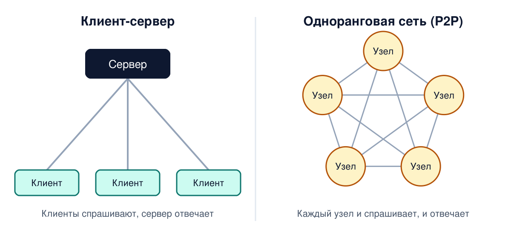
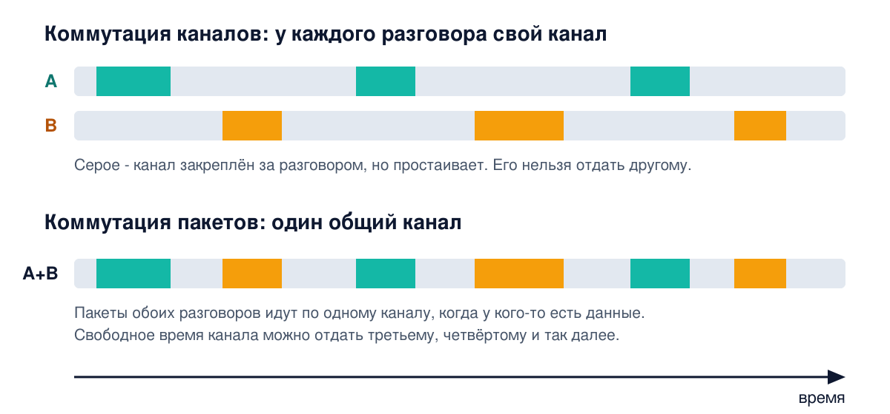
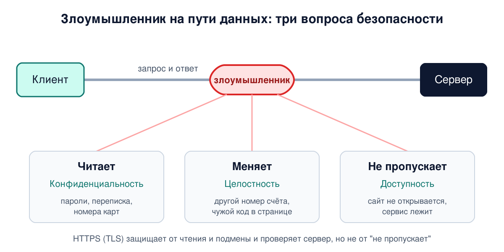

# Урок 1. Зачем нужна сеть

Этот урок - фундамент всего курса. Команд и конфигов здесь почти нет. Зато мы договоримся о главном: что вообще делает сеть, откуда она взялась и как на неё смотрит специалист по безопасности. Всё, что будет дальше, от Ethernet до REALITY, будет достраивать одну и ту же картину.

## Одна задача

Забудь на минуту про роутеры, провода и VPN. Представь одну сцену.

На твоём ноутбуке работает браузер. Где-то в дата-центре работает веб-сервер. Браузер хочет сказать серверу "дай мне страницу", а сервер хочет ответить "вот она". Больше ничего не нужно.

То есть **одна программа хочет передать другой программе последовательность байт**. Это главная задача компьютерной сети. Всё остальное - способы решить её надёжно, быстро и безопасно.

Таненбаум определяет компьютерную сеть как "набор взаимосвязанных автономных вычислительных устройств", причём взаимосвязанными они считаются, если могут обмениваться информацией. Обрати внимание: не "соединены проводом", а "могут обмениваться". Провод, оптика или радио - это просто средство.

Проблема в том, что между двумя программами лежат провода, радиоэфир, чужие устройства и чужие сети. И вся эта среда враждебна к данным:

- сигнал в проводе и в эфире искажается помехами;
- промежуточные устройства перегружаются и теряют данные;
- куски данных могут прийти не в том порядке или дважды;
- по пути стоят чужие устройства, и кто-то может подсмотреть или подменить данные.

Важная деталь, к которой мы вернёмся в блоке 4: сама сеть по пути **ничего не гарантирует**. Она старается доставить каждый кусок данных, но может потерять его или перепутать порядок. Надёжность достраивают программы на концах: например, протокол TCP на твоём компьютере и на сервере отправляет заново то, что не дошло, и собирает куски в правильном порядке.

## Кто с кем разговаривает

Фраза "компьютер связался с сервером" удобна, но неточна. Прикладные данные - страницу, сообщение, файл - передают друг другу **процессы**, то есть запущенные программы. На одном компьютере одновременно работают десятки программ, и каждая ведёт свои разговоры. А компьютеры, роутеры и провода обеспечивают доставку.

Слово "обеспечивают" тут не случайно. Устройства на пути - не пассивные трубы: они читают служебную часть данных, чтобы решить, куда их нести, а некоторые и меняют её. Например, домашний роутер переписывает адреса в каждом пакете, который уходит из домашней сети в интернет. Это называется NAT, и ему посвящён целый блок курса.

Самая распространённая схема разговора - **клиент-сервер**:

```
 Твой компьютер                           Сервер
┌──────────────────┐                ┌──────────────────┐
│ процесс-клиент   │ ── запрос ───► │ процесс-сервер   │
│ (браузер)        │ ◄── ответ ──── │ (веб-сервер)     │
└──────────────────┘                └──────────────────┘
```

Клиент отправляет запрос и ждёт. Сервер получает запрос, делает работу (например, достаёт страницу из базы) и отправляет ответ. Один сервер обычно обслуживает сотни и тысячи клиентов одновременно.

Есть и другая схема - **одноранговая** (peer-to-peer, P2P). В ней нет деления на клиентов и серверы: каждый участник может и спрашивать, и отвечать. Так устроены, например, торрент-сети.



Примеры из жизни:

| Что ты делаешь | Клиент | Сервер |
|---|---|---|
| Открываешь GitHub | браузер | веб-серверы GitHub |
| Заходишь на сервер по SSH | программа ssh | процесс sshd на сервере |
| Пишешь в Telegram | приложение Telegram | серверы Telegram |
| Качаешь торрент | твоя программа-торрент | другие участники: каждый из них одновременно и клиент, и сервер (P2P) |

## Откуда взялись сети

История объясняет, почему сети устроены именно так. Олифер открывает первую главу мыслью, что у компьютерных сетей два корня: **вычислительная техника** и **телекоммуникации** (прежде всего телефонные сети). От первого корня сети взяли идею "компьютеры сами обмениваются данными", от второго - технику передачи сигналов на большие расстояния.

Коротко путь выглядит так:

```
1950-е  Мейнфрейм и пакетная обработка заданий (batch-режим,
        не путать с сетевыми пакетами): колоды перфокарт,
        результат на следующий день
   ↓
1960-е  Терминалы и разделение времени: у каждого свой терминал,
        но компьютер один
   ↓
        Удалённые терминалы через телефонную сеть и модемы,
        затем связь компьютер - компьютер: первые глобальные сети
   ↓
1969    ARPANET - сеть, из которой вырос интернет
   ↓
1970-е  Мини-компьютеры дешевеют, у каждого отдела свой компьютер,
        их хочется связать: первые локальные сети
   ↓
1980-е  Стандартные технологии локальных сетей, среди них Ethernet;
        персональные компьютеры становятся и клиентами, и серверами
   ↓
Сегодня Ethernet в локальных сетях, IP объединяет все сети в одну,
        интернет несёт и данные, и голос, и видео
```

Две детали из этой истории важны для всего курса.

**Первое: глобальные сети появились раньше локальных.** Пока компьютеры были огромными и дорогими, у организации был обычно один компьютер, и связывать внутри здания было нечего. Существовало даже эмпирическое правило, закон Гроша: производительность компьютера растёт как квадрат его стоимости, так что одна большая машина выгоднее двух маленьких. Зато до этой одной машины хотелось дотянуться издалека. Сначала к ней подключали удалённые терминалы по телефонным линиям, а затем начали связывать между собой сами компьютеры, и это уже были глобальные сети.

**Второе: компьютерные сети отказались от принципа телефонной сети.** Телефонная сеть на время разговора закрепляет за абонентами канал с постоянной скоростью, и он занят, даже когда оба молчат. Компьютерный трафик устроен иначе: всплеск данных, потом долгая пауза, потом снова всплеск. Резервировать под него канал на весь сеанс расточительно. Поэтому данные стали резать на небольшие порции - **пакеты**, - и в простейшем варианте каждый пакет сам несёт адрес получателя и сам идёт по сети. Линия занята только тогда, когда по ней действительно идут данные. Это называется коммутацией пакетов, и на ней построен весь интернет. Подробно разберём её в уроке 4.



## Как это выглядит изнутри компьютера

Обычная программа не работает с сетевой картой напрямую. Браузер не знает, подключён ноутбук кабелем или по Wi-Fi. Он просит **операционную систему**: "отправь эти байты вон той программе на том компьютере". Дальше работают ядро ОС и оборудование.

```
 Браузер (программа)
    │  "отправь эти байты туда"
    ▼
 Операционная система (ядро Linux, Windows, macOS)
    │  упаковывает байты, выбирает путь, отдаёт карте
    ▼
 Сетевая карта (Ethernet или Wi-Fi)
    │  превращает биты в сигнал
    ▼
 Провод или радио
```

Это разделение труда - первая встреча с идеей, которая пройдёт через весь курс: каждая часть системы решает свою задачу и не лезет в чужую. Как именно ОС "упаковывает байты", мы разберём по слоям в уроках 5-6, а как ядро Linux ведёт пакет внутри себя - в блоке 5.

## Путь пакета: каркас всего курса

Есть два способа учить сети. Первый - списком технологий: сегодня ARP, завтра DNS, послезавтра NAT. В голове остаются разрозненные карточки, и когда "сайт не открывается", непонятно, с какой начинать.

Второй способ - наш: мы мысленно садимся на пакет и едем вместе с ним. Каждая технология появляется ровно в той точке пути, где пакет с ней встречается. Вот каркас, который будет подробнее с каждым блоком:

```
[Программа: браузер]
      │  "хочу example.com"
      ▼
[Узнать адрес сервера по имени]    ← блок DNS
      ▼
[ОС упаковывает данные]            ← блоки про уровни, TCP, IP, Ethernet
      ▼
[Сетевая карта, провод или радио]  ← физический уровень
      ▼
[Роутер: фаервол, NAT]             ← блоки netfilter, conntrack, NAT
      ▼
[Интернет: цепочка роутеров]       ← маршрутизация
      ▼
[Сервер: тот же путь снизу вверх]
      ▼
[Программа на сервере читает запрос]
```

Этот каркас даёт главный навык инженера - **отладку по маршруту**. "Сайт не открывается" превращается в список вопросов в том же порядке, в каком едет пакет: нашёлся ли адрес по имени? ушёл ли пакет с компьютера? есть ли маршрут? пропустил ли фаервол? установилось ли соединение? договорились ли стороны о шифровании? Место, где пакет перестаёт проходить, и есть поломка.

Прокси и VPN тоже встанут на этот путь, в отдельных точках. Как именно - и почему разные протоколы делают это по-разному - разберём в блоках 10-11.

## Как это увидеть в Linux

Посмотрим на разговор двух программ своими глазами. Нужен любой Linux: виртуальная машина, WSL или сервер.

**Команда 1.** Программа `curl` - это клиент, как браузер, только в терминале. Флаг `-v` просит показать, что происходит, `-s` убирает индикатор загрузки, а `-o /dev/null` выбрасывает саму страницу, чтобы она не мешала читать:

```
curl -sv http://example.com -o /dev/null
```

Вывод будет примерно таким (адреса у тебя могут отличаться):

```
* Host example.com:80 was resolved.
* IPv6: 2606:4700:10::ac42:93f3, 2606:4700:10::6814:179a
* IPv4: 172.66.147.243, 104.20.23.154
*   Trying 172.66.147.243:80...
* Connected to example.com (172.66.147.243) port 80
> GET / HTTP/1.1
> Host: example.com
> User-Agent: curl/8.5.0
> Accept: */*
>
< HTTP/1.1 200 OK
< Content-Type: text/html
< Server: cloudflare
...
```

Как читать:

- строки со `*` - это curl рассказывает, что делает сам: нашёл адреса сервера по имени, подключился к одному из них;
- строки с `>` - начало запроса, который **клиент отправил** серверу: стартовая строка и заголовки. Здесь запрос "дай мне страницу /";
- строки с `<` - начало ответа, который **сервер прислал**: "200 OK" и заголовки. Сама страница идёт после заголовков, мы её выбросили в `/dev/null`.

Вот вся схема клиент-сервер в одном выводе. Запрос ушёл, ответ пришёл.

**Команда 2.** Посмотрим, какие соединения сейчас есть у твоего компьютера:

```
ss -tn
```

Пример вывода (адреса заменены на учебные, из диапазонов для документации):

```
State   Recv-Q Send-Q  Local Address:Port   Peer Address:Port  Process
ESTAB   0      0       192.0.2.10:22        198.51.100.7:34982
ESTAB   0      0       192.0.2.10:48210     203.0.113.5:443
```

Каждая строка - одно соединение. Слева адрес и номер порта нашей стороны, справа - собеседника. `ESTAB` значит "соединение установлено": программы могут обмениваться данными, даже если прямо сейчас молчат. Первая строка здесь - чья-то SSH-сессия к нашему компьютеру (у нас порт 22). Во второй наш клиент подключён к серверу на порт 443; судя по порту, это скорее всего HTTPS. "Скорее всего" - потому что номер порта не гарантирует протокол, и в блоках про прокси мы увидим, как этим пользуются.

Иногда в выводе встречаются и другие состояния, например `TIME-WAIT` или `FIN-WAIT-1`: соединение уже закрывается. Что такое порты и состояния соединений, подробно разберём в блоке 4. Сейчас важно одно: сеть - это не абстракция, а конкретные соединения конкретных программ, и их можно увидеть одной командой.

## Атаки и защита: три вопроса безопасности

Вернёмся к нашей задаче: программа передаёт байты программе через враждебную среду. Специалист по безопасности задаёт про эти байты три вопроса. Это классическая **триада КЦД** (в английском варианте CIA):

| Свойство | Вопрос | Что будет, если нарушено |
|---|---|---|
| **Конфиденциальность** (confidentiality) | Может ли кто-то по пути **прочитать** байты? | Чужие пароли, переписка, номера карт у злоумышленника |
| **Целостность** (integrity) | Может ли кто-то по пути **изменить** байты незаметно? | Подменённая страница, другой номер счёта в платёжке, вирус в скачанной программе |
| **Доступность** (availability) | Дойдут ли байты **вообще**? | Сервис лежит: например, его завалили мусорными запросами (DoS-атака) |



Посмотри на вывод `curl` выше: запрос и ответ шли по обычному HTTP, то есть открытым текстом. Любое устройство на пути - точка доступа Wi-Fi в кафе, провайдер, чужой роутер - могло прочитать эти байты (удар по конфиденциальности) и подменить ответ (удар по целостности).

Поэтому сегодня почти весь веб работает по HTTPS. Протокол TLS делает три вещи сразу: шифрует байты, защищает их от незаметной подмены и, что очень важно, **позволяет убедиться, что на том конце настоящий сервер**, а не злоумышленник, для этого у сервера есть сертификат. Без последнего пункта шифрование не спасает от активного злоумышленника: он мог бы сам представиться сервером и зашифровать всё "для себя". TLS - одна из главных тем курса, до неё мы дойдём в блоке 9.

Триада не закрывает все вопросы, и к ней со временем добавили другие свойства. Например, **аутентичность**: действительно ли я говорю с тем, за кого себя выдаёт собеседник? Та самая проверка сервера в TLS - это про неё. Или **неотказуемость**: сможет ли участник потом отрицать, что отправил или получил сообщение? Эти свойства разберём в блоке криптографии.

И последнее. Безопасность нельзя "добавить" в одном месте. Подслушать можно на проводе, подменить адрес - в заголовке пакета, обмануть - на уровне приложения. Поэтому в каждом уроке курса будет раздел "Атаки и защита": на каждом участке пути пакета есть свои угрозы.

## Итог

- Главная задача сети - доставить байты от одной программы к другой через среду, которая искажает, теряет и перехватывает данные. Сама сеть доставку не гарантирует, надёжность достраивают программы на концах.
- Прикладные данные передают друг другу процессы. Компьютеры и роутеры обеспечивают доставку и по пути читают, а иногда и меняют служебную часть данных.
- Основная схема разговора - клиент-сервер: запрос и ответ. Есть и одноранговая схема, P2P.
- У сетей два корня: вычислительная техника и телекоммуникации. Глобальные сети появились раньше локальных. Компьютерные сети перешли от закреплённых каналов к пакетам, потому что компьютерный трафик идёт всплесками.
- Обычная программа не трогает сетевую карту сама, она просит операционную систему.
- Курс построен вокруг пути пакета: каждая технология появляется там, где пакет с ней встречается. Так же строится и отладка.
- Про безопасность любых байт задают три вопроса: прочитают ли (конфиденциальность), подменят ли (целостность), дойдут ли (доступность). И отдельно: а с тем ли я вообще говорю (аутентичность).

## Что почитать

- Олифер, "Компьютерные сети", глава 1 "Эволюция компьютерных сетей", с. 25-39. История от мейнфреймов до интернета.
- Таненбаум, "Компьютерные сети", раздел 1.1, с. 26-33. Клиент-сервер, P2P и зачем вообще нужны сети.
- Олифер, глава 26, с. 804-807 и Таненбаум, раздел 8.1, с. 815-817. Триада КЦД и её расширения.
