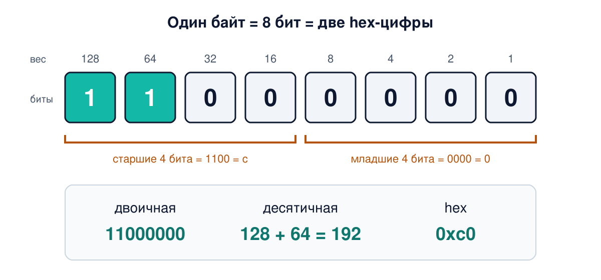
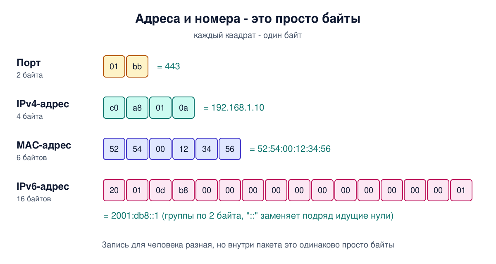
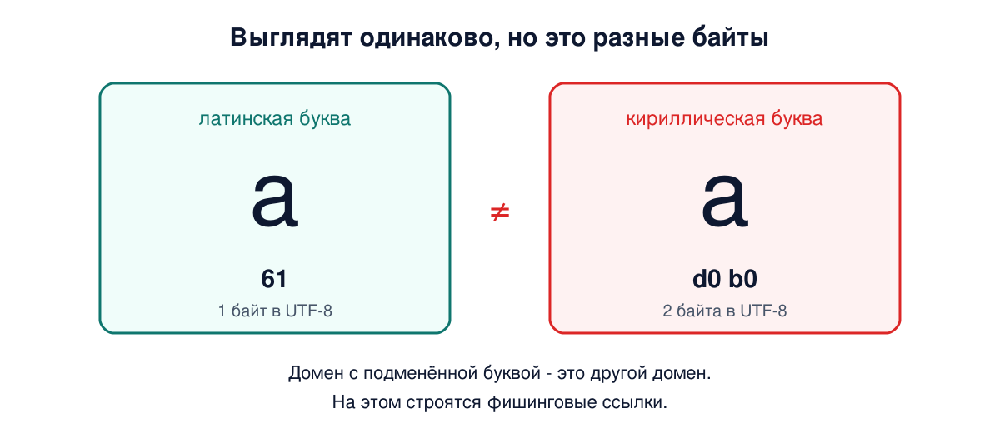

# Урок 2. Биты, байты и шестнадцатеричная запись

В первом уроке мы договорились: сеть передаёт байты от программы к программе. Сегодня разберёмся, что такое сами байты и как их читать. Это не математика ради математики. MAC-адреса, IPv6-адреса, дампы трафика, ключи шифрования, отпечатки сертификатов - всё это записано в шестнадцатеричном виде, и дальше в курсе ты будешь видеть его на каждом шагу. Кто читает hex свободно, тот видит в дампе пакета смысл, а не шум.

## Бит

**Бит** - наименьшая порция информации: одно из двух значений, 0 или 1. Да или нет, есть напряжение или нет, свет в оптоволокне горит или погас.

Почему именно два значения? Потому что два состояния проще всего надёжно различить: внутри компьютера каждая ячейка памяти и каждый логический элемент хранят ровно одно из двух состояний. А вот на линии связи всё хитрее. Чтобы передавать быстрее, один импульс сигнала часто несёт сразу несколько бит: например, различают не 2, а 4, 16 или ещё больше уровней или форм сигнала. Как именно биты превращаются в сигнал на проводе и в радиоэфире, разберём в блоке 1 (урок 10). Для нас сейчас важно другое: какой бы ни была физика, данные в сети - это последовательность битов.

Один бит - это мало: он отвечает только на вопрос "да или нет". Поэтому биты собирают в группы.

## Байт

**Байт** - группа из 8 бит. Восемь позиций, в каждой 0 или 1, дают 2 в степени 8 = **256** разных комбинаций. Поэтому один байт может хранить число от 0 до 255.

В сетевых стандартах часто пишут не "байт", а **октет** (от латинского "восемь"). Исторически на некоторых старых компьютерах байт был не 8 бит, и авторы стандартов хотели однозначности. Сегодня байт практически всегда 8 бит, так что для нас "байт" и "октет" - одно и то же. Встретишь слово "октет" в описании протокола - это просто байт.

Байт - основная единица, которой меряют данные в сети. Программа передаёт другой программе не биты по одному, а последовательность байтов: текст, картинку, запрос.

## Двоичная запись

Числа в байте хранятся в **двоичной системе**. Она устроена так же, как привычная десятичная, только основание не 10, а 2.

В десятичном числе 305 каждая позиция весит в 10 раз больше соседней справа: 3 сотни, 0 десятков, 5 единиц. В двоичном числе каждая позиция весит в 2 раза больше соседней справа. У байта восемь позиций с весами:

```
вес:     128   64   32   16    8    4    2    1
биты:      1    1    0    0    0    0    0    0
         128 + 64                              = 192
```

Чтобы перевести двоичное число в десятичное, складываем веса позиций, где стоит 1. `11000000` = 128 + 64 = **192**.

Обратный перевод: идём от самого большого веса и спрашиваем "помещается ли он в остаток". Переведём 10:

```
10:  128? нет  64? нет  32? нет  16? нет  8? да (остаток 2)  4? нет  2? да (остаток 0)  1? нет
      0         0        0        0       1                  0       1                  0
10 = 00001010
```

Самый левый бит (вес 128) называют **старшим**, самый правый (вес 1) - **младшим**. Эти слова ещё понадобятся, когда будем разбирать маски подсетей и порядок байтов.



## Шестнадцатеричная запись

Двоичная запись длинная: даже один байт - это восемь цифр, а IPv6-адрес - 128. Десятичная короче, но плохо показывает отдельные биты. Компромисс - **шестнадцатеричная система**, или просто **hex**.

В ней 16 цифр: `0 1 2 3 4 5 6 7 8 9 a b c d e f`. Буквы означают числа от 10 до 15: a = 10, b = 11, c = 12, d = 13, e = 14, f = 15.

Главное свойство, ради которого hex и используют: **одна hex-цифра - это ровно 4 бита**. Четыре бита дают 16 комбинаций, от 0000 до 1111, то есть от 0 до f. Значит, байт - это ровно **две** hex-цифры: старшие четыре бита и младшие четыре бита. Половинку байта иногда называют **полубайтом** (nibble).

```
двоичная:   1100 0000
             │    │
hex:         c    0      → c0
десятичная:  12×16 + 0   = 192
```

Перевод между двоичной записью и hex делается по четвёркам бит, без всякой арифметики. Поэтому инженеры и любят hex: смотришь на `c0` и сразу видишь `1100 0000`.

Несколько значений, которые стоит запомнить:

| hex | двоичная | десятичная |
|---|---|---|
| 00 | 0000 0000 | 0 |
| 0f | 0000 1111 | 15 |
| 10 | 0001 0000 | 16 |
| 7f | 0111 1111 | 127 |
| 80 | 1000 0000 | 128 |
| ff | 1111 1111 | 255 |

Чтобы не путать системы, у записи бывает приставка: `0x` для hex (`0xff` = 255) и `0b` для двоичной (`0b11000000` = 192). Приставку `0x` понимают почти везде, а `0b` - не везде: например, в bash двоичное число пишут иначе, это будет ниже в командах. Регистр букв не важен: `0xFF` и `0xff` - одно и то же число.

## Где ты увидишь байты в сетях

Почти все адреса и номера в сетях - это просто несколько байтов, записанных в удобном для человека виде. Запись разная, суть одна.

- **IPv4-адрес** - 4 байта. Каждый байт пишут десятичным числом от 0 до 255 через точку: `192.168.1.10`. В байтах это `c0 a8 01 0a`. Поэтому в IPv4-адресе не бывает числа 256 и больше: в байт оно не помещается.
- **Номер порта** - 2 байта, от 0 до 65535. Порт 443 - это `01 bb`.
- **MAC-адрес** сетевой карты - 6 байтов, записанных в hex через двоеточие: `52:54:00:12:34:56`.
- **IPv6-адрес** - 16 байтов, записанных в hex группами по два байта: `2001:db8::1`.
- **Маска подсети** `255.255.255.0` - это 4 байта `ff ff ff 00`, то есть 24 единицы подряд и 8 нулей. Почему это важно, станет ясно в уроке 22.



Размер важен не только для понимания. Когда будем разбирать заголовки пакетов, мы будем говорить "поле длиной 2 байта" или "поле длиной 4 бита", и ты будешь сразу понимать, какие значения в нём помещаются.

## Порядок байтов

Число, которое не помещается в один байт, хранят в нескольких байтах. Возникает вопрос: в каком порядке их передавать? Порт 443 = `0x01bb`: сначала `01`, потом `bb`, или наоборот?

В протоколах интернета - IP, TCP, UDP и большинстве других - договорились передавать **сначала старший байт**: `01`, потом `bb`. Такой порядок называют **сетевым порядком байтов** (network byte order), он же big-endian. А вот процессоры x86 и обычно ARM, которые стоят в большинстве компьютеров, телефонов и серверов, хранят числа в памяти наоборот, младшим байтом вперёд (little-endian). Поэтому перед отправкой ОС и программы переводят числа в сетевой порядок, а при приёме - обратно. Для тебя как для инженера важно: в дампе заголовков IP, TCP и UDP числа читаются слева направо, старшим байтом вперёд. Но это договорённость, а не закон природы: некоторые протоколы, например WireGuard, пишут почти все свои числа младшим байтом вперёд, и это всегда стоит проверять в описании протокола.

## Текст - тоже байты

Когда браузер отправляет запрос `GET / HTTP/1.1`, он отправляет не буквы, а байты. Соответствие "символ - байты" задаёт **кодировка**.

Классическая базовая кодировка - **ASCII**: латинские буквы, цифры и знаки, каждый символ ровно 1 байт. `H` = `0x48`, `i` = `0x69`, пробел = `0x20`.

Кириллицы в ASCII нет. Сегодня почти везде используется **UTF-8**: латиница в ней та же, что в ASCII (1 байт на символ), кириллица занимает 2 байта на символ, китайские иероглифы обычно 3, а эмодзи обычно 4. Слово "Привет" - 6 букв, но 12 байтов: `d0 9f d1 80 d0 b8 d0 b2 d0 b5 d1 82`.

Отсюда практический вывод: "длина строки в символах" и "размер в байтах" - разные вещи. Сеть считает байты.

## Биты и байты в скоростях

Скорость связи меряют в **битах** в секунду, а размер файлов - в **байтах**. Байт = 8 бит, поэтому тариф "100 Мбит/с" - это не 100 мегабайт в секунду, а примерно 12,5 мегабайта в секунду (или около 11,9 МиБ/с - об этих единицах чуть ниже, их часто показывают программы загрузки). На практике ещё немного меньше: часть каждого пакета занимают служебные заголовки, о них в уроках 5-6.

Вторая ловушка - приставки. Как отмечает Таненбаум, для скоростей "кило" значит 1000, а для объёма памяти и файлов его часто понимают как 1024 (2 в степени 10). Линия 1 Мбит/с передаёт ровно 1 000 000 бит в секунду, а "1 Мбайт" в свойствах файла может означать 1 048 576 байтов. Чтобы не путаться, существуют отдельные приставки для степеней двойки: КиБ, МиБ, ГиБ (KiB, MiB, GiB). Их пишет, например, `free -h` в Linux, причём сокращённо: `Gi`, `Mi`. А вот `ls -h` и `df -h` тоже считают в степенях двойки, но пишут просто K, M, G. Даже наши две книги расходятся: Таненбаум считает килобайт памяти равным 1024 байтам, а Олифер в примере с объёмом трафика берёт терабайт как 10 в 12-й степени байтов.

## Как это увидеть в Linux

Все команды ниже есть в обычной установке Ubuntu. В минимальных образах и Docker-контейнерах `xxd` и `hexdump` может не оказаться: они ставятся пакетами `xxd` и `bsdextrautils`.

**Посмотреть байты текста.** Команда `od` (octal dump) умеет показывать байты в hex:

```
echo -n "Hi" | od -An -tx1
```

```
 48 69
```

`echo -n` печатает строку без перевода строки в конце, `-tx1` значит "показывать по одному байту в hex", `-An` убирает номера позиций. Видим: `H` = `48`, `i` = `69`.

Теперь по-русски:

```
echo -n "Привет" | od -An -tx1
```

```
 d0 9f d1 80 d0 b8 d0 b2 d0 b5 d1 82
```

Двенадцать байтов на шесть букв. Посчитать байты можно и так: `echo -n "Привет" | wc -c` выведет `12`.

**Классический вид дампа.** Так же, только в формате, который ты будешь видеть в анализаторах трафика:

```
echo -n "Hi, Привет" | hexdump -C
```

```
00000000  48 69 2c 20 d0 9f d1 80  d0 b8 d0 b2 d0 b5 d1 82  |Hi, ............|
00000010
```

Слева - смещение от начала в hex, в середине - сами байты, справа - те же байты как текст. Байты, которые не являются печатными символами ASCII, показаны точками. Так же выглядит содержимое пакетов в Wireshark, а в `tcpdump -X` - похоже, только байты сгруппированы по два.

**Отдельные биты.** Команда `xxd -b` показывает байт в двоичном виде:

```
echo -n A | xxd -b
```

```
00000000: 01000001                                               A
```

`A` = `0x41` = `01000001`.

**Переводы между системами.** Прямо в bash:

```
echo $((16#ff)) $((2#1010)) $((0x1F))
printf "%x\n" 255
```

```
255 10 31
ff
```

`16#ff` значит "число ff в системе с основанием 16", `2#1010` - двоичное. Запись `0b1010` bash не понимает, для двоичных чисел нужна именно форма `2#1010`. `printf "%x"` переводит обратно в hex.

**Байты адреса.** Разложим IPv4-адрес на байты:

```
printf '%02x ' 192 168 1 10; echo
```

```
c0 a8 01 0a
```

**MAC-адреса своих интерфейсов:**

```
ip -br link
```

```
lo       UNKNOWN  00:00:00:00:00:00 <LOOPBACK,UP,LOWER_UP>
enp0s3   UP       52:54:00:12:34:56 <BROADCAST,MULTICAST,UP,LOWER_UP>
```

Шесть байтов в hex через двоеточие. У `lo`, виртуального интерфейса для связи компьютера с самим собой, адрес из одних нулей. В твоём выводе имена интерфейсов и MAC будут другими, а колонки выровнены шире.

## Атаки и защита

**Hex и base64 - это не шифрование.** Новички часто видят в конфиге или в сообщении непонятную строку вроде `aGVsbG8=` и думают, что данные защищены. Это base64 - ещё один способ записать байты печатными символами, как hex. Прочитать его может кто угодно одной командой:

```
echo aGVsbG8= | base64 -d; echo
```

```
hello
```

(`; echo` в конце просто переводит строку, чтобы приглашение терминала не прилипло к слову.)

Кодирование (hex, base64, UTF-8) меняет только запись байтов и обратимо без всякого ключа. Шифрование без ключа обратить нельзя. Если пароль лежит в base64 - он лежит в открытом виде. Поэтому пароли и ключи не хранят в коде и репозиториях даже "закодированными": их держат отдельно, например в переменных окружения или специальном хранилище секретов.

**Открытый трафик в дампе читается как книга.** Вспомни `hexdump -C`: правая колонка показывает байты как текст. Если перехватить незашифрованный HTTP-запрос с паролем, пароль будет прямо там, в правой колонке. Именно так выглядит нарушение конфиденциальности из урока 1 на практике. В уроке 47 про tcpdump мы сделаем это своими руками.

**Буквы-двойники.** Латинская `a` и кириллическая `а` на экране выглядят одинаково, но это разные байты:

```
printf 'a' | od -An -tx1     →  61
printf 'а' | od -An -tx1     →  d0 b0
```

Для компьютера домен, в котором латинские буквы заменены похожими кириллическими, - совсем другой домен. Имя, где алфавиты перемешаны, в большинстве доменных зон зарегистрировать не дадут, поэтому злоумышленники подбирают имя целиком из похожих букв чужого алфавита - а такое зарегистрировать может кто угодно. Этим пользуются фишинговые сайты: ссылка выглядит как адрес знакомого сервиса, а ведёт к злоумышленнику. Такие имена в DNS записываются специальной ASCII-формой, которая начинается с `xn--`, и браузеры в подозрительных случаях показывают именно её. Подробнее - в уроке 65 про атаки на DNS.



## Итог

- Бит - 0 или 1. Байт (он же октет) - 8 бит, 256 значений, от 0 до 255. На линии связи один импульс сигнала может нести и несколько бит.
- Двоичная запись: позиции байта весят 128, 64, 32, 16, 8, 4, 2, 1.
- Hex: 16 цифр, одна цифра - 4 бита, байт - ровно две цифры. Перевод hex ↔ двоичная делается по четвёркам бит.
- Адреса и номера в сетях - это байты: IPv4 - 4, порт - 2, MAC - 6, IPv6 - 16.
- В IP, TCP, UDP и большинстве протоколов интернета числа передаются старшим байтом вперёд (сетевой порядок байтов), но это договорённость, а не закон.
- Текст - тоже байты: в UTF-8 латиница занимает 1 байт, кириллица - 2, иероглифы и эмодзи - 3-4.
- Скорости меряют в битах, файлы - в байтах; 100 Мбит/с - это около 12,5 МБ/с.
- Hex и base64 - это запись, а не шифрование. Одинаковые на вид буквы могут быть разными байтами.

## Что почитать

- Таненбаум, "Компьютерные сети", раздел 1.9 "Единицы измерения", с. 111-112. Приставки для скоростей и для объёмов памяти.
- Олифер, "Компьютерные сети", глава 1, с. 37-38. Пример единиц объёма трафика: терабайты, петабайты, экзабайты, и здесь приставки десятичные.
- Олифер, глава 7, с. 222 и 228. Коды, в которых сигнал на линии имеет больше двух уровней: к ним вернёмся в уроке 10.
