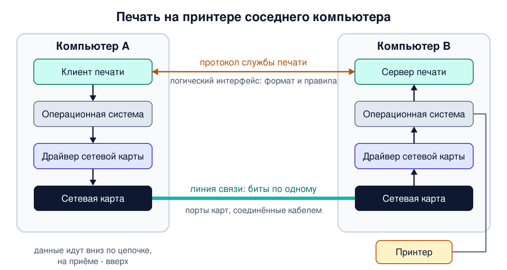
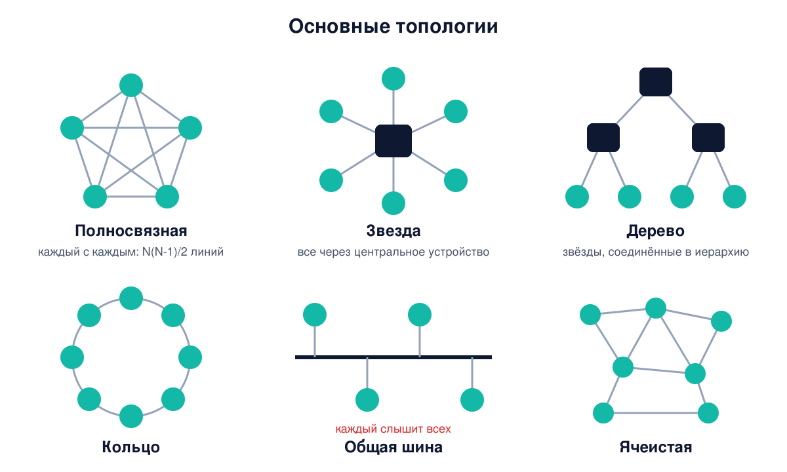

# Урок 3. Простейшая сеть из двух компьютеров

Самая маленькая сеть - два компьютера, соединённые кабелем. Кажется, что тут нечего изучать. Но именно на ней видны почти все главные идеи сетей: интерфейс, протокол, сетевая карта, драйвер, операционная система, сетевая служба, адрес. Олифер начинает объяснение устройства сетей именно с такого примера, и мы пройдём тем же путём.

## Задача: напечатать на чужом принтере

Возьмём классический пример. Есть компьютеры A и B, к компьютеру B подключён принтер. Пользователь компьютера A хочет напечатать документ на этом принтере. Что для этого нужно?

Сначала посмотрим, как печатает сам компьютер B, к которому принтер подключён напрямую. Это важно: сеть почти во всём повторяет устройство такой локальной связи.

```
 Компьютер B
┌──────────────────────────────────────────────┐
│ Приложение (текстовый редактор)              │
│    │ "напечатай этот буфер на принтере"      │
│    ▼                                         │
│ Операционная система                         │
│    │ запускает                               │
│    ▼                                         │
│ Драйвер принтера  ──► Интерфейсная карта ────┼──► кабель ──► Контроллер принтера
└──────────────────────────────────────────────┘
```

1. Приложение не управляет принтером само. Оно просит **операционную систему** выполнить операцию вывода и сообщает, где в памяти лежат данные.
2. ОС запускает **драйвер** - программу, которая знает команды конкретного устройства.
3. Драйвер переводит задачу на язык устройства ("напечатай символ", "перевод строки") и передаёт байты **интерфейсной карте**.
4. Карта не вникает в смысл: для неё это просто поток байтов. Она превращает каждый бит в электрический сигнал и отправляет в кабель.
5. **Контроллер принтера** на другом конце собирает биты обратно в байты и выполняет команды.

Запомни эту цепочку: приложение → ОС → драйвер → карта → линия. Она повторится почти без изменений, когда вместо принтера на том конце будет другой компьютер.

## Интерфейс и протокол

Олифер вводит здесь два понятия, которые пройдут через весь курс.

**Интерфейс** в широком смысле - это чётко определённая граница между двумя объектами, которые обмениваются информацией: какие у них есть точки соприкосновения и по каким правилам они общаются. Интерфейсы бывают двух видов.

- **Физический интерфейс**, его ещё называют **портом**, - это разъём с контактами и электрические параметры сигналов на них. Всё, что можно потрогать и измерить. Соединив два порта кабелем, мы получаем **линию связи**.
- **Логический интерфейс**, или **протокол**, - это набор сообщений определённого формата и правил, в каком порядке ими обмениваться. Его нельзя потрогать: это договорённость.

Кабель без протокола бесполезен: байты дойдут, но никто не поймёт, что они значат. Протокол без кабеля тоже: договорились, а передать не можем.

Интерфейс "компьютер - компьютер" с каждой стороны реализуют двое:

- **сетевая интерфейсная карта** (сетевой адаптер, NIC - Network Interface Card) - аппаратная часть;
- **драйвер сетевой карты** - программа, которая ею управляет.

## Два компьютера и их приложения

Теперь заменим принтер компьютером. Главное отличие: активны **обе** стороны. Принтер только выполняет команды, а приложение на компьютере B должно само принять сообщение, понять его и, возможно, ответить.

Чтобы приложения A и B понимали друг друга, их авторы должны заранее договориться: с какого сообщения начинается обмен, в каком формате идут данные, как сообщить об ошибке ("в принтере кончилась бумага"). Эта договорённость и есть **протокол** обмена приложений. Протоколы, с которыми ты уже сталкивался - HTTP в браузере, SSH в терминале, - это именно такие договорённости.

Путь одного сообщения выглядит так:

```
 Компьютер A                                      Компьютер B
 приложение A                                     приложение B
    │ кладёт сообщение в память                      ▲ читает сообщение
    │ и просит ОС отправить                          │ и выполняет протокол
    ▼                                                │
 ОС → драйвер сетевой карты                  драйвер сетевой карты → память
    │                                                ▲
    ▼                                                │
 сетевая карта ──── биты по линии связи ────► сетевая карта
```

Если протокол требует ответа, всё повторяется в обратную сторону. Так, соединив два компьютера и электрически, и логически, мы получили простейшую сеть.

Олифер делает из этого примера важный вывод: как только приложения начинают печатать по сети, одну и ту же логику ("отправить документ на удалённый принтер") приходится повторять в каждом приложении - в редакторе, в графической программе, в базе данных. Разумнее вынести её в отдельную пару программ: **клиент** печати на A и **сервер** печати на B. Пара клиент-сервер, которая даёт доступ к определённому виду ресурсов по сети, называется **сетевой службой**. Веб-служба - это пара "браузер и веб-сервер", файловая служба - пара "клиент и файловый сервер". Операционная система, в которую встроены такие службы и средства передачи сообщений, называется **сетевой ОС**. Сегодня сетевыми являются практически все ОС.



## Как биты идут по линии

Внутри компьютера данные передаются просто: провода короткие, спрятаны в корпусе, все устройства шагают в такт одного генератора. Снаружи всё сложнее, и уже в сети из двух машин появляются четыре проблемы.

**Кодирование.** Биты надо превратить в сигнал. Можно, например, обозначать 1 и 0 разными уровнями напряжения или импульсами разной полярности. А для линий, которые плохо пропускают резкие перепады, например для старых телефонных каналов, данные передают изменениями синусоидального сигнала. Это называется **модуляцией**, отсюда и слово "модем" (модулятор-демодулятор). Подробно способы кодирования разберём в уроке 10.

**Последовательная передача.** Внутри компьютера байты традиционно передавали параллельно, по восьми проводам сразу. В сетях провода дороги, поэтому биты идут друг за другом, **последовательно**: в простейшем случае по одной паре проводов, по одному волокну или по одному радиоканалу. (Быстрые технологии хитрее: гигабитный Ethernet, например, передаёт по четырём парам кабеля одновременно. К этому вернёмся в уроках 9-10.)

**Синхронизация.** Приёмник должен понимать, где начинается очередной бит и очередной байт. Общего генератора у двух компьютеров нет. Поэтому передатчик либо посылает отдельные тактовые сигналы, либо периодически вставляет в поток особые коды, по которым приёмник "подстраивается". В простейшем примере Олифера перед каждым байтом идёт стартовый сигнал, после - стоповый.

**Ошибки.** Длинная линия проходит сквозь помехи, и часть битов может исказиться. Поэтому к данным добавляют **контрольную сумму**: отправитель считает её по данным, получатель пересчитывает и сравнивает. Не совпало - данные повреждены. Часто получатель ещё и отправляет **квитанцию** - подтверждение, что данные приняты правильно.

## Характеристики канала

Уже для одной линии связи полезно различать три величины, их часто путают.

- **Предложенная нагрузка** - сколько данных в секунду хочет отправить приложение. Это свойство источника, а не сети.
- **Пропускная способность** - максимально возможная скорость передачи по каналу. Она зависит от среды и от технологии передачи. По одному и тому же оптическому волокну Ethernet разных поколений передаёт 10 Мбит/с, 100 Мбит/с или 1000 Мбит/с.
- **Скорость передачи данных** - сколько данных реально прошло за интервал времени. Она всегда средняя и никогда не превышает пропускную способность канала.

Если путь состоит из нескольких участков, его пропускная способность равна пропускной способности **самого медленного** участка. Этот участок называют **узким местом** (bottleneck). Гигабитная сетевая карта не поможет, если провайдер даёт 100 Мбит/с.

И ещё одна характеристика - направления передачи:

- **дуплексный** канал передаёт в обе стороны одновременно;
- **полудуплексный** - в обе стороны, но по очереди;
- **симплексный** - только в одну сторону.

Даже когда кажется, что данные идут в одну сторону, например при скачивании файла, обратно всё равно идёт поток: подтверждения о получении.

## Когда компьютеров больше двух

Стоит добавить третий компьютер, и появляются новые вопросы.

**Как их соединить?** Конфигурацию связей называют **топологией**. Если соединить каждого с каждым (полносвязная топология), то для N компьютеров понадобится N(N-1)/2 линий: для 10 компьютеров - 45, для 100 - 4950. Поэтому на практике используют другие схемы:

- **звезда** - все подключены к центральному устройству, например коммутатору;
- **дерево** (иерархическая звезда) - несколько звёзд, соединённых между собой. Это самая распространённая топология сегодня;
- **кольцо** - данные идут по кругу от узла к узлу;
- **общая шина** - все подключены к одному кабелю или к общему радиоэфиру, и каждый слышит всё, что передают остальные;
- **ячеистая** - много связей, но не все; типична для больших сетей.

Если компьютеры не соединены напрямую, данные идут через **транзитные узлы** - промежуточные устройства, которые умеют передавать данные дальше. Как они это делают, разберём в следующем уроке.



**Как указать получателя?** Нужны **адреса**. Адресуют, строго говоря, не компьютер, а его **сетевой интерфейс**: у одного компьютера может быть несколько сетевых карт, и у каждой свой адрес. По числу получателей адреса бывают:

- **unicast** - один конкретный интерфейс;
- **multicast** - группа интерфейсов, данные получит каждый член группы;
- **broadcast** - все узлы сети;
- **anycast** - группа, но данные получит только один её член, например ближайший.

Адреса бывают **плоскими** и **иерархическими**. Плоский адрес не несёт информации о том, где находится его владелец, как номер паспорта: MAC-адрес сетевой карты из урока 2 обычно записан в неё производителем и ничего не говорит о том, в какой сети карта сейчас стоит. (Записан - не значит неизменен: MAC можно поменять программно, виртуальным картам его назначает гипервизор, а телефоны и ноутбуки часто сами подставляют случайный MAC для каждой Wi-Fi сети. Подробнее - в уроке 15.) Иерархический адрес устроен как почтовый: город, улица, дом. IP-адрес состоит из номера сети и номера узла в ней. Это позволяет доставлять данные между сетями, глядя только на номер сети, как почтальон сначала везёт письмо в нужный город и только там смотрит на улицу.

На практике у одного интерфейса сразу несколько адресов разного вида: имя для людей (`github.com`), IP-адрес для доставки между сетями, MAC-адрес для доставки внутри локальной сети. Между ними работают протоколы преобразования: DNS находит IP по имени, ARP находит MAC по IP. DNS мы разберём в блоке 7, ARP - в уроке 24.

И последнее. Данные в конечном счёте нужны не интерфейсу и не компьютеру, а **процессу**. Поэтому к адресу интерфейса добавляется адрес процесса внутри компьютера - **номер порта**, тот самый 22 или 443 из урока 1. Слово "порт" здесь означает совсем не разъём, а номер программы-получателя. Двойное значение слова сбивает с толку, привыкай различать по контексту.

## Как это увидеть в Linux

Вывод ниже снят на реальном сервере (кроме примера физической карты), адреса в нём заменены на учебные.

**Какие сетевые интерфейсы есть в системе:**

```
ls /sys/class/net
```

```
docker0  enp0s3  lo
```

Каталог `/sys/class/net` - это окно ядра Linux: для каждого сетевого интерфейса ядро показывает там папку с его параметрами. `enp0s3` - интерфейс сетевой карты, `lo` - виртуальный интерфейс для связи компьютера с самим собой, `docker0` - виртуальный интерфейс, который создал Docker. У тебя имена могут быть другими, например `eth0`, `ens3` или `wlan0` для Wi-Fi.

**Какой драйвер обслуживает карту:**

```
ethtool -i enp0s3 | head -3
```

```
driver: virtio_net
version: 1.0.0
bus-info: 0000:00:03.0
```

Вот он, драйвер из примера Олифера. Здесь `virtio_net` - драйвер **виртуальной** сетевой карты: этот сервер - виртуальная машина, и "карту" для него изображает программа на физическом сервере провайдера. На обычном компьютере здесь будет драйвер реальной карты, например `e1000e`, `r8169` или `iwlwifi` для Wi-Fi. Если `ethtool` не установлен, драйвер можно узнать и так: `basename "$(readlink -f /sys/class/net/enp0s3/device/driver)"`. У виртуальных интерфейсов вроде `lo` и `docker0` каталога `device` нет: за ними не стоит никакое устройство.

**Сама карта на шине компьютера:**

```
lspci | grep -i ether
```

```
00:03.0 Ethernet controller: Red Hat, Inc. Virtio network device
```

**Состояние линии, скорость и дуплекс:**

```
ethtool enp0s3 | grep -E 'Speed|Duplex|Link detected'
```

```
	Speed: 1000Mb/s
	Duplex: Full
	Link detected: yes
```

Так это выглядит на физической карте: пропускная способность 1000 Мбит/с, дуплекс, линия есть. А вот реальный вывод с виртуального сервера:

```
	Speed: Unknown!
	Duplex: Unknown! (255)
	Link detected: yes
```

У виртуальной карты скорость и дуплекс неизвестны, потому что никакого кабеля у неё нет. `Link detected: yes` у физической карты значит, что кабель подключён и связь есть. У виртуальной карты это просто сообщение гипервизора, что виртуальный канал поднят: обычно такая карта подключена к виртуальному мосту или коммутатору на физическом сервере.

**Счётчики: сколько байтов и пакетов прошло, сколько ошибок:**

```
ip -s link show enp0s3
```

```
2: enp0s3: <BROADCAST,MULTICAST,UP,LOWER_UP> mtu 1500 ...
    link/ether 52:54:00:12:34:56 brd ff:ff:ff:ff:ff:ff
    RX:  bytes packets errors dropped  missed   mcast
     448230093   64630      0       0       0       0
    TX:  bytes packets errors dropped carrier collsns
       2293496   24531      0       0       0       0
```

`RX` - принято, `TX` - передано. В строке `RX` колонка `errors` - сколько принятых кадров оказались с ошибками, в первую очередь с неверной контрольной суммой: здесь срабатывает та самая проверка. В строке `TX` - ошибки при передаче. На исправной линии ошибок ноль. Растущий счётчик ошибок приёма - первый признак плохого кабеля, разъёма или помех. Обрати внимание и на строку `link/ether`: это MAC-адрес интерфейса, а `brd ff:ff:ff:ff:ff:ff` - широковещательный адрес, все шесть байтов равны `ff`.

## Атаки и защита: физический доступ

В нашей простейшей сети безопасность держится на том, что к кабелю и к компьютерам никто посторонний не подключится. Это главное правило, которое работает на любом уровне: **физический доступ к оборудованию почти всегда означает полный доступ**.

- **Кто подключён к линии, тот её слышит.** В топологии "общая шина" и в радиоэфире все получают всё, что передаётся. Злоумышленнику достаточно подключиться к той же среде. К этой проблеме вернёмся в уроке 14 про классический Ethernet и в уроке 19 про Wi-Fi.
- **Свободная розетка в стене - это вход в сеть.** Сетевой порт в переговорке или коридоре, в который можно воткнуть свой ноутбук или маленькое устройство-шпион, часто даёт доступ во внутреннюю сеть компании в обход всех внешних защит. Защищаются отключением неиспользуемых портов и проверкой устройств при подключении: об этом в блоке 2 про Ethernet и коммутаторы (урок 16).
- **Кто держит компьютер в руках, тот им управляет.** Можно загрузиться с флешки, вынуть диск, подключить устройство, которое притворяется клавиатурой. Поэтому серверы стоят в закрытых помещениях, а диски шифруют.

И ещё одна мысль, которая пригодится в уроке 11. Контрольная сумма из этого урока защищает от **случайных** помех, но не от злоумышленника: тот, кто подменяет данные, просто пересчитает контрольную сумму заново. Защита от намеренной подмены требует криптографии.

## Итог

- Приложение не работает с сетевой картой само: оно просит ОС, ОС запускает драйвер, драйвер управляет картой, карта передаёт биты в линию.
- Физический интерфейс (порт) - разъём и сигналы; два порта, соединённые кабелем, дают линию связи. Логический интерфейс (протокол) - формат сообщений и правила обмена.
- Приложения на двух компьютерах понимают друг друга благодаря протоколу. Пара клиент-сервер, дающая доступ к ресурсу по сети, называется сетевой службой.
- При передаче по линии нужно решить кодирование, последовательную передачу, синхронизацию и обнаружение ошибок.
- Пропускная способность - предел канала, скорость передачи - реальный результат. Путь не быстрее своего узкого места. Каналы бывают дуплексные, полудуплексные и симплексные.
- С ростом числа компьютеров появляются топология, транзитные узлы и адресация. Адреса бывают unicast, multicast, broadcast, anycast, плоские и иерархические. Процесс в компьютере адресуется номером порта.
- Физический доступ почти всегда означает полный доступ. Контрольная сумма защищает от помех, но не от злоумышленника.

## Что почитать

- Олифер, "Компьютерные сети", глава 2 "Общие принципы построения сетей", с. 40-61: простейшая сеть, сетевые службы, физическая передача, характеристики каналов, топология и адресация. Продолжение главы про коммутацию (с. 61-73) - к уроку 4.
