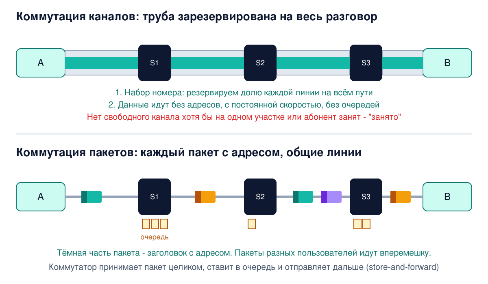
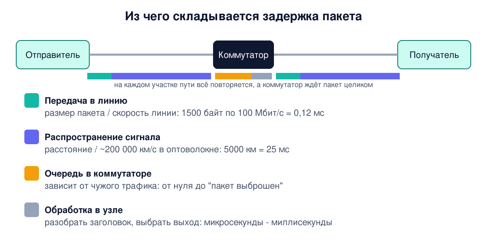

# Урок 4. Коммутация каналов и пакетов

В уроке 3 мы остановились на вопросе: если два компьютера не соединены напрямую, данные идут через транзитные узлы. Но как именно? Есть два принципиально разных ответа - коммутация каналов и коммутация пакетов. Телефонная сеть больше века жила по первому, интернет построен на втором. Разберёмся, чем они отличаются, почему для компьютеров победили пакеты и чем за это пришлось заплатить.

## Задача коммутации

Соединение конечных узлов через цепочку транзитных узлов называют **коммутацией**, а саму цепочку узлов на пути от отправителя к получателю - **маршрутом**. Олифер раскладывает задачу коммутации на четыре части. Они есть в любой сети, от телефонной до интернета.

1. **Определить потоки.** Поток - это данные, объединённые общими признаками: например, всё, что идёт от компьютера A к серверу B. Главный признак потока - адрес назначения, но бывают и другие.
2. **Проложить маршрут** (маршрутизация). Выбрать, через какие узлы пойдут данные. Вручную или автоматически, по какому-то критерию: меньше узлов, выше скорость, дешевле.
3. **Продвигать данные.** Каждый транзитный узел, получив данные, должен понять, к какому потоку они относятся, и передать их на нужный свой интерфейс. Для этого у узла есть **таблица коммутации**: признак потока → куда отправить.
4. **Мультиплексировать и демультиплексировать.** По одной линии связи идут сразу много потоков. Их нужно уметь сложить в одну линию и потом разобрать обратно.

Устройство, которое перекладывает данные с одного своего интерфейса на другой, в широком смысле называют **коммутатором**. Не пугайся, если встретишь разные названия: в IP-сетях то же самое называют маршрутизацией, таблицей маршрутизации и маршрутизатором, в локальных сетях Ethernet "коммутатор" - это конкретное устройство, а в телефонии коммутатором исторически называли телефонную станцию.

Хорошая аналогия - почта. Письма сортируют по адресу (определение потока), для каждого направления заранее известно, в какое отделение везти дальше (таблица коммутации), в каждом отделении письма перекладывают в нужный мешок (продвижение), а в один грузовик кладут мешки для разных городов (мультиплексирование).

## Коммутация каналов: зарезервировать трубу

Так устроена классическая телефонная сеть. Прежде чем передавать данные, сеть **устанавливает соединение**: проверяет весь путь от абонента A до абонента B и закрепляет за ними на этом пути свою долю пропускной способности каждой линии. Получается непрерывный **составной канал**, "труба" от A до B. Пока разговор идёт, она принадлежит только им.

Долю линии меряют **элементарными каналами**. В цифровой телефонии это 64 Кбит/с, и число взято не случайно. Чтобы передать голос цифрами, его измеряют 8000 раз в секунду и каждое измерение записывают одним байтом: 8000 × 8 бит = 64 000 бит/с. Любая линия в такой сети несёт целое число элементарных каналов: абонентская линия - от двух до нескольких десятков, магистраль между станциями - сотни и тысячи.

Свойства такой сети:

- **Сначала соединение, потом данные.** В телефонии установление соединения - это набор номера. Адрес нужен только на этом этапе: дальше данные идут по уже скоммутированной трубе без всяких адресов.
- **Сеть может отказать.** Если на каком-то участке пути свободных каналов не осталось или абонент занят, соединение не установится. Знакомый сигнал "занято".
- **Гарантии.** Пока соединение есть, данные идут с постоянной скоростью, без очередей и потерь, как будто в сети больше никого нет.
- **Расточительность.** Канал закреплён за абонентами, даже когда они молчат.

Для телефонного разговора с его паузами это терпимо. А компьютерный трафик, как мы помним из урока 1, идёт всплесками: страница загрузилась - и тишина, пока ты её читаешь. Закреплённый под такой трафик канал большую часть времени простаивает, и никто другой им воспользоваться не может. Как забронированный столик в переполненном ресторане, за которым весь вечер никто не сидит.

## Коммутация пакетов: каждый сам за себя

В пакетной сети ничего заранее не резервируется. Данные режут на порции - **пакеты**, и каждый пакет снабжают **заголовком**: там адрес назначения и другая служебная информация. Часто в конце пакета есть ещё **концевик** с контрольной суммой из урока 3. Раз адрес есть в каждом пакете, коммутатор может обработать каждый пакет сам по себе, не зная ничего о соседних.

Сеть с коммутацией пакетов ведёт себя "менее ответственно", чем телефонная. Она всегда готова принять пакет, но ничего не обещает: пакеты могут задерживаться, теряться, приходить не в том порядке.



Главное отличие пакетного коммутатора от телефонного - у него есть **память**, буфер. И вот почему.

- **Сохранить и передать** (store-and-forward). Коммутатор сначала принимает пакет целиком в буфер, проверяет контрольную сумму, смотрит адрес назначения - и только потом отправляет дальше. Целиком - потому что контрольная сумма лежит в концевике и проверить её можно, только получив весь пакет: незачем тратить линию на пересылку испорченных данных. (Бывают коммутаторы, которые начинают передавать кадр сразу, как только прочитали адрес в заголовке, не дожидаясь конца. Это называется cut-through, к нему вернёмся в уроке 16.)
- **Очереди.** Если в какую-то линию одновременно хотят уйти больше пакетов, чем она успевает передать, пакеты ждут своей очереди в буфере. Отсюда случайные задержки: сколько ждать, зависит от того, сколько сейчас трафика у соседей.
- **Потери.** Буфер не бесконечен. Если перегрузка длится долго, новым пакетам просто некуда встать, и коммутатор их выбрасывает. Это нормальное поведение пакетной сети, а не авария. Восстанавливать потерянное будут протоколы на концах, например TCP (блок 4).

Зачем всё это? Потому что всплески трафика от разных компьютеров случайны и редко совпадают. Когда по одной линии идут пакеты сотен пользователей, их пики накладываются на паузы друг друга, и суммарный поток получается ровным. Линия почти всегда занята полезной работой. Это главное преимущество пакетов, и ради него интернет построен именно так.

## Три способа продвигать пакеты

Внутри пакетных сетей тоже есть варианты. Олифер выделяет три.

**Дейтаграммы.** Каждый пакет обрабатывается полностью независимо, сеть не помнит ничего о предыдущих пакетах. Решение принимается по адресу назначения и таблице коммутации. Пакеты одного потока могут даже пойти разными путями, например если коммутатор распределяет нагрузку между двумя линиями или какой-то узел отказал. (На практике балансировку обычно устраивают так, чтобы один поток держался одного пути: иначе пакеты чаще приходят не по порядку.) Доставка не гарантируется, сеть лишь старается: это называется **best effort** (доставка по возможности). Именно так работает протокол **IP**, основа интернета.

**Логическое соединение.** Два конечных узла перед обменом договариваются о параметрах: нумерации пакетов, сколько можно отправить без подтверждения. Потом передают данные, подтверждают приём, повторно передают потерянное, выбрасывают дубли. И в конце разрывают соединение. Важно: всю эту работу делают **конечные узлы**, а коммутаторы по-прежнему видят обычные пакеты с адресами. Так работает протокол **TCP**, ему посвящён блок 4.

**Виртуальный канал.** Это логическое соединение, у которого вдобавок закреплён маршрут. При установлении соединения каждый коммутатор на пути запоминает: пакеты с такой-то **меткой** отправлять туда-то. Дальше коммутатор решает, куда слать пакет, не по длинному адресу назначения, а по короткой метке. По Таненбауму, коммутатор может заменять метку на выходе на свою, чтобы метки разных соединений не путались. Так работает технология **MPLS** в сетях провайдеров: там метку добавляют к IP-пакету спереди, отдельным маленьким заголовком, а сам IP-пакет с адресами сохраняется внутри. Не путай виртуальный канал с коммутацией каналов: по нему идут отдельные пакеты, а не непрерывный поток с постоянной скоростью. Хотя ресурсы под виртуальный канал при желании можно зарезервировать, как и отмечает Таненбаум.

И вот что любопытно: интернет использует все три способа сразу. Между сетями пакеты продвигает дейтаграммный IP, надёжность между конечными узлами обеспечивает TCP с логическими соединениями, а внутри многих провайдерских сетей работает MPLS с виртуальными каналами.

Таненбаум описывает, как вокруг этого выбора десятилетиями спорили два лагеря. Интернет-сообщество говорило: сеть в принципе ненадёжна, поэтому пусть она только перекладывает пакеты, а проверку ошибок и порядок доставки сделают компьютеры на концах, незачем делать одну работу дважды. Эту идею называют **сквозным принципом** (end-to-end argument). Телефонные компании отвечали: сеть должна давать надёжные соединения с гарантированным качеством, иначе голос и видео нормально не передать. В сетях общего назначения победил IP, но инструменты с соединениями вроде MPLS никуда не исчезли.

## Из чего складывается задержка

Разберёмся, сколько времени пакет идёт от отправителя до получателя. Задержка складывается из нескольких частей.

- **Распространение сигнала.** Сигнал бежит по кабелю не мгновенно, а примерно со скоростью 200 000 км/с, это около двух третей скорости света в вакууме. Время: расстояние / скорость. 5000 км - это 25 мс, и быстрее не сделать никаким оборудованием.
- **Передача в линию** (сериализация). Чтобы "вытолкнуть" в линию N бит, нужно N / пропускная способность секунд. 10 мегабайт по линии 100 Мбит/с - это 0,8 секунды.
- **Ожидание в очередях.** В пакетной сети - на каждом коммутаторе, случайная величина.
- **Обработка в узле.** Коммутатору нужно время, чтобы разобрать заголовок и выбрать выход: от микросекунд до миллисекунд.

Кроме того, из-за принципа store-and-forward каждый коммутатор ждёт, пока пакет придёт **целиком**, и только потом начинает отправлять его дальше. Спасает то, что пакеты идут конвейером: пока коммутатор передаёт дальше первый пакет, второй уже принимается.



Олифер приводит поучительный расчёт. 10 мегабайт передают на 5000 км по линиям 100 Мбит/с. В сети с уже установленным каналом это займёт около 825 мс: 25 мс на распространение и 800 мс на передачу в линию. В пакетной сети с десятью коммутаторами на пути, пакетами по тысяче байт и 40-байтовыми заголовками выходит около 1856 мс - больше чем вдвое дольше. Любопытно, откуда разница: сами коммутаторы и заголовки добавляют в этом расчёте лишь десятки миллисекунд, а очереди в нём вообще не учитываются. Почти всю разницу даёт одно допущение примера: отправитель тратит 100 микросекунд на подготовку каждого пакета, и в расчёте это время добавляется к передаче, а не совмещается с ней. Урок из этого примера не в конкретных числах, а в том, что при коммутации пакетов появляются расходы, которых нет у готового канала.

Выходит, пакеты хуже? Для **одного** пользователя, которому выделили целый канал, - да. Но в канальной сети этот канал весь сеанс принадлежит ему одному, даже когда он молчит, а пакетная сеть в это же время обслуживает по тем же линиям множество других пользователей. Пакеты выигрывают не в скорости для одного, а в эффективности для всех. Это классический инженерный компромисс, и таких в курсе будет много.

## Как это увидеть в Linux

**Задержка распространения своими глазами.** Команда `ping` отправляет узлу маленький пакет и ждёт ответ, показывая время туда и обратно (RTT, round-trip time). Вот замеры с сервера в Швеции до серверов в разных частях мира:

```
ping -c 4 -q fra-de-ping.vultr.com
```

```
4 packets transmitted, 4 received, 0% packet loss, time 3010ms
rtt min/avg/max/mdev = 27.581/30.561/38.659/4.680 ms
```

Флаг `-c 4` - отправить четыре запроса, `-q` - показать только итог. `min` - самый быстрый из четырёх ответов, `avg` - среднее, `max` - самый медленный, `mdev` - насколько сильно время скачет. Сведём минимальные значения для разных городов:

| Куда | Минимальный RTT |
|---|---|
| Франкфурт | 27,6 мс |
| Нью-Джерси, США | 101,7 мс |
| Лос-Анджелес, США | 155,0 мс |
| Токио | 253,6 мс |
| Сидней | 298,0 мс |

Посчитаем нижнюю границу для Токио. По кратчайшей линии на поверхности Земли (по дуге большого круга) от Стокгольма около 8200 км. Туда и обратно - 16 400 км. При 200 000 км/с это 82 мс. Реально - 254 мс, втрое больше. Причина в длине реального пути: кабели идут не по прямой, а в обход материков по дну океанов, и провайдеры передают трафик друг другу там, где договорились, так что из Европы в Японию пакет может пойти хоть через США. Вклад самих коммутаторов в эту цифру мал: на обработку маленького пакета уходят микросекунды. Главное видно сразу: чем дальше, тем дольше, и никакой быстрый тариф не сделает пинг до Токио меньше предела, который задаёт скорость света в оптоволокне. Разброс между `min` и `max` - это в основном очереди на пути.

**Транзитные узлы на пути.** Команда `tracepath` показывает, через какие узлы идёт пакет:

```
tracepath -n fra-de-ping.vultr.com
```

```
 1?: [LOCALHOST]                      pmtu 1500
 1:  10.0.0.1                                              0.154ms
 2:  192.0.2.177                                           0.646ms
 3:  192.0.2.8                                             0.967ms
 ...
 9:  198.51.100.14                                        31.626ms
10:  198.51.100.30                                        31.322ms
11:  no reply
12:  no reply
13:  203.0.113.49                                         31.903ms
 ...
```

Флаг `-n` - показывать адреса числами, без поиска имён. Первая строка `[LOCALHOST]` - это сам наш компьютер, а дальше каждая строка - транзитный узел, который принял пакет целиком, прочитал заголовок и отправил дальше. Слева номер шага, в середине адрес узла (публичные адреса здесь заменены на учебные), справа время. `no reply` значит, что узел молча не сообщил о себе: такие узлы обычный трафик пропускают, иначе мы не увидели бы следующие, просто не отправляют служебные сообщения, на которых построен `tracepath`. Как это устроено, разберём в уроке 28.

**Таблица коммутации компьютера.** У каждого компьютера тоже есть своя маленькая таблица, куда отправлять пакеты:

```
ip route
```

```
default via 10.0.0.1 dev enp0s3 onlink
172.17.0.0/16 dev docker0 proto kernel scope link src 172.17.0.1 linkdown
172.18.0.0/16 dev br-7f631d39ec2a proto kernel scope link src 172.18.0.1
```

Это настоящий вывод с того же сервера. Строка `default via 10.0.0.1` значит "всё, для чего нет отдельного правила, отправляй узлу 10.0.0.1" - это первый узел из вывода `tracepath`. Слово `onlink` здесь значит, что шлюз считается доступным напрямую через интерфейс, хотя в таблице нет маршрута к подсети шлюза: так настроен образ сервера у провайдера. Две другие строки - сети, которые создал Docker, а `linkdown` - что в сети docker0 сейчас нет ни одного подключённого контейнера. Подробно таблицу маршрутов разберём в уроке 26.

## Атаки и защита: каждый узел на пути держит твой пакет в руках

Принцип store-and-forward имеет прямое следствие для безопасности. Каждый транзитный узел **целиком получает твой пакет в свою память**, читает его заголовок и решает, что с ним делать. Технически он может:

- **прочитать** содержимое (удар по конфиденциальности);
- **изменить** его и отправить дальше (удар по целостности);
- **задержать** или **выбросить** (удар по доступности).

Посмотри на вывод `tracepath`: до сервера во Франкфурте больше десяти узлов, и принадлежат они разным компаниям в разных странах. Ты не выбирал их и не можешь проверить, что они честные. Именно поэтому в интернете нельзя полагаться на то, что "по пути никто не смотрит": защищать данные нужно на концах, шифрованием и проверкой подлинности, как в TLS. Это тот же сквозной принцип, только для безопасности: доверять можно только конечным точкам.

Но у шифрования на концах есть два предела. Оно не прячет заголовки, нужные для доставки: адреса отправителя и получателя узлы на пути видят всегда, иначе не смогли бы доставить пакет. И оно не спасает от того, что узел просто выбросит или задержит пакеты: доступность шифрованием не защитить.

Вторая сторона медали - **ресурсы**. Буферы коммутатора и таблицы соединений ограничены. Если завалить узел пакетами, буферы переполнятся и начнут теряться пакеты всех пользователей, а не только атакующего. На этом строятся атаки на доступность (DoS). А там, где хранится состояние соединений - на сервере или на файрволе, который следит за соединениями, - атакующий может пытаться исчерпать саму таблицу соединений. Так устроен SYN flood, которому посвящён урок 37.

## Итог

- Коммутация - соединение узлов через транзитные узлы. Её задачи: определить потоки, проложить маршрут, продвигать данные по таблице коммутации, мультиплексировать потоки в линиях.
- Коммутация каналов (телефония): сначала соединение и резервирование канала на всём пути, потом данные. Гарантированная скорость без очередей, но сеть может отказать, а канал простаивает в паузах. Элементарный канал цифровой телефонии - 64 Кбит/с.
- Коммутация пакетов (интернет): каждый пакет с адресом, ничего не резервируется, сеть всегда принимает данные. Store-and-forward, буферы, очереди, возможны потери. Выигрыш - эффективное использование линий для трафика со всплесками.
- Три способа продвижения пакетов: дейтаграммы (IP, best effort), логическое соединение между конечными узлами (TCP), виртуальный канал с метками (MPLS). Интернет использует все три.
- Задержка = распространение (расстояние / ~200 000 км/с) + передача в линию (объём / скорость) + очереди + обработка. Скорость света в оптоволокне не обмануть, а реальный путь обычно заметно длиннее прямой.
- Каждый транзитный узел держит пакет целиком и может его прочитать, изменить или выбросить. Защищать данные нужно на концах.

## Что почитать

- Олифер, "Компьютерные сети", конец главы 2, с. 61-73: обобщённая задача коммутации, маршрутизация, продвижение, мультиплексирование, разделяемая среда.
- Олифер, глава 3 "Коммутация каналов и пакетов", с. 74-101: элементарный и составной канал, буферизация, три способа продвижения пакетов, структура задержек. Числовой пример - с. 97-99.
- Таненбаум, "Компьютерные сети", раздел 5.1, с. 412-419: store-and-forward, спор о сетях с соединениями и без, дейтаграммы и виртуальные каналы.
