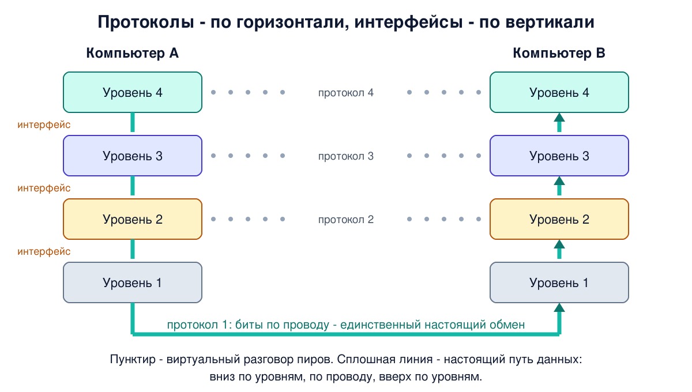

# Урок 5. Уровни, протоколы и интерфейсы

За четыре урока мы несколько раз говорили "уровни": программа просит ОС, ОС - драйвер, драйвер - карту. Сегодня сделаем из этого строгую идею. Многоуровневый подход - главный инструмент, которым инженеры справляются со сложностью сетей. Без него невозможно понять ни модель OSI (урок 6), ни то, как устроены VPN, прокси и туннели, до которых мы дойдём в конце курса.

## Разделяй и властвуй

Задача "передать данные от программы на одном компьютере программе на другом" огромна. Надо превратить биты в сигналы, найти путь через десятки узлов, не потерять данные, не перепутать их порядок, понять, какой программе они предназначены. Решить всё это одним куском невозможно.

Олифер описывает стандартный инженерный приём - **декомпозицию**. Сложную задачу разбивают на модули, для каждого чётко определяют, что он делает и как общается с соседями. Тогда каждый модуль можно рассматривать как **чёрный ящик**: неважно, как он устроен внутри, важно, что он обещает снаружи. И любой модуль можно переписать заново, не трогая остальные, если не менять правила общения с соседями.

**Многоуровневый подход** идёт дальше: модули выстраивают в иерархию уровней. Правило простое:

- каждый уровень обращается с запросами только к уровню **непосредственно под собой**;
- результат своей работы отдаёт только уровню **непосредственно над собой**.

Нижние уровни решают конкретные, "железные" задачи: как передать биты по проводу. Каждый следующий уровень опирается на них и решает задачу всё более общую и абстрактную: как доставить данные через всю сеть, как доставить их нужной программе.

## Два вида правил: интерфейс и протокол

В сети участвуют как минимум две стороны, и у каждой своя стопка уровней. Поэтому у каждого уровня есть договорённости двух видов.

- **Интерфейс** - правила общения соседних уровней **внутри одного компьютера**: какие услуги нижний уровень предоставляет верхнему и как их запросить. Его ещё называют **интерфейсом услуг**.
- **Протокол** - правила общения **одинаковых уровней на разных компьютерах**: какими сообщениями они обмениваются, в каком формате и порядке.

Олифер замечает, что по сути оба термина означают одно и то же - формальное описание того, как взаимодействуют два объекта. Но в сетях за ними закрепились разные роли: интерфейс - по вертикали, протокол - по горизонтали.

Иерархически организованный набор протоколов, которого достаточно для взаимодействия узлов, называется **стеком протоколов**. Отсюда выражения "стек TCP/IP", "сетевой стек Linux". Программный модуль, который реализует протокол, называют **протокольной сущностью** или просто протоколом.



## Главная иллюзия: горизонтальный разговор

Таненбаум подчёркивает важную тонкость. Протокол уровня n описывает разговор уровня n на одном компьютере с уровнем n на другом. Уровни-собеседники называют **пирами** (peers, "равные"). Но на самом деле **никакие данные не идут напрямую** от уровня n к уровню n. Каждый уровень отдаёт данные вниз, соседу под собой, и так до самого низа. По проводу физически идут только биты, а на приёмной стороне данные поднимаются вверх.

Горизонтальный разговор пиров **виртуальный**, настоящий путь данных - вниз, по проводу, вверх. Но каждый уровень "думает", что разговаривает напрямую со своим пиром, и это очень удобно: можно проектировать уровень, вообще не думая о том, как устроены остальные.

У Таненбаума есть известная аналогия с двумя философами, у которых нет общего языка. Переложим её на наш лад. Директор фирмы в Москве хочет договориться с директором в Токио. Каждый директор диктует письмо своему **переводчику**. Переводчики договорились общаться между собой по-английски. Каждый переводчик отдаёт английский текст **секретарю**, а секретари пересылают его по электронной почте.

- Директора обсуждают сделку - это протокол верхнего уровня. Им всё равно, на каком языке общаются переводчики.
- Переводчики общаются по-английски - протокол среднего уровня. Если они решат перейти на испанский, директора этого даже не заметят.
- Секретари выбирают, как пересылать - почтой, мессенджером, курьером. Переводчиков это не касается.

Каждый уровень может добавить к тексту служебную пометку для своего коллеги на другой стороне: переводчик - "язык: английский", секретарь - "срочно, копия в архив". Эти пометки читает только тот, кому они адресованы, а выше не передаёт. В сетях такая пометка называется **заголовком**, и это ключ к следующему уроку.

## Заголовки: каждый уровень добавляет свою обёртку

При отправке данные идут вниз, и каждый уровень добавляет к ним свой **заголовок** - служебную информацию для своего пира. Некоторые уровни добавляют ещё и **концевик** в конце. При приёме данные идут вверх, и каждый уровень снимает свой заголовок и отдаёт остальное выше. Уровень n никогда не видит заголовков уровней ниже себя.

```
 Отправитель                                 Получатель
 уровень 4:           [H4|данные]            [H4|данные]            ▲
 уровень 3:        [H3|H4|данные]            [H3|H4|данные]         │
 уровень 2:     [H2|H3|H4|данные|T2]         [H2|H3|H4|данные|T2]   │
 уровень 1:  ──── биты по проводу ────────►  биты                   │
```

H - заголовок (header), T - концевик (trailer). Если сообщение слишком большое для нижнего уровня, тот режет его на части и к каждой части добавляет свой заголовок - так из одного сообщения получается несколько пакетов. Всё это подробно, с настоящими именами уровней, разберём в уроке 6.

## Зачем это всё: заменяемость

Главная награда за многоуровневую архитектуру - **уровни можно менять независимо**. Таненбаум приводит пример: можно заменить все телефонные линии спутниковыми каналами, и уровни выше этого не заметят, если новый нижний уровень предоставляет прежние услуги.

Ты пользуешься этим каждый день. Браузер, которым ты открываешь сайт по Wi-Fi дома, работает точно так же по кабелю в офисе и по мобильной сети в метро. Нижние уровни совершенно разные, а браузер и веб-сервер об этом не знают.

И обратно: одни и те же нижние уровни обслуживают совершенно разные приложения - веб, почту, видеозвонки, SSH.

Цена за это - накладные расходы. Каждый уровень добавляет свой заголовок, и часть пропускной способности уходит на служебную информацию. Вот та самая причина из урока 2, почему 100 Мбит/с тарифа - это меньше 12,5 МБ/с полезных данных: заголовки уровней и служебные поля Ethernet съедают часть канала, и по 100-мегабитному Ethernet полезная скорость TCP получается около 94 Мбит/с, это примерно 11,7 МБ/с.

И ещё одна мысль, которая станет ключевой в конце курса. Для нижнего уровня заголовок верхнего - это просто данные, непрозрачный груз. Ethernet не заглядывает внутрь своего кадра: он только помечает в своём заголовке, какому протоколу отдать содержимое (это поле-указатель, о нём в уроке 6). Значит, внутрь можно положить что угодно, в том числе целый пакет другой сети. На этом держатся все туннели и VPN.

## Какие услуги уровень может предоставлять

Таненбаум различает услуги нижнего уровня по двум признакам.

**С соединением или без.** Служба **с установлением соединения** работает как телефон: сначала соединиться, потом разговаривать, потом положить трубку. Данные обычно приходят в том порядке, в каком отправлены. Служба **без соединения** работает как почта: каждое сообщение - отдельное письмо с полным адресом, и два письма могут прийти не по порядку. Узнаёшь урок 4? Это те самые логические соединения и дейтаграммы.

**Надёжная или нет.** Надёжная служба не теряет данные: получатель подтверждает приём, отправитель повторяет потерянное. Это стоит времени. Поэтому надёжность нужна не всегда: для звонка по интернету лучше потерять кусочек звука, чем замереть в ожидании повторной передачи.

У Таненбаума шесть типов служб, вот три самых важных для нас:

| Служба | Пример |
|---|---|
| Надёжный поток с соединением | скачивание файла, открытие сайта |
| Ненадёжная, без соединения | видео и голос в реальном времени (по UDP) |
| Запрос-ответ без соединения | обычный запрос к DNS по UDP (подробно в блоке 7) |

Важно и то, что надёжную службу можно построить поверх ненадёжной. Ethernet и IP не гарантируют доставку, а TCP поверх них даёт надёжный поток: данные доходят без потерь и по порядку, а если связь совсем пропала, программа узнаёт об ошибке.

## Служба и протокол - не одно и то же

Это различие Таненбаум называет ключевым для любого сетевого архитектора.

- **Служба** - что уровень делает для уровня выше: набор операций на интерфейсе. Например: "установи соединение", "отправь данные", "прими данные", "закрой соединение". Как он это делает - не сказано.
- **Протокол** - как уровень это реализует: формат и смысл сообщений, которыми обмениваются пиры.

Протокол можно поменять как угодно, лишь бы служба для верхнего уровня осталась прежней. Так живут в интернете новые версии протоколов: сайты переходят с одной версии HTTP на другую, а для тебя в браузере ничего не меняется.

Операции службы называют **примитивами**. Таненбаум приводит минимальный набор для надёжного потока: LISTEN (ждать входящего соединения), CONNECT (подключиться), ACCEPT (принять соединение), SEND (отправить), RECEIVE (принять данные), DISCONNECT (разорвать). Это упрощённая версия интерфейса **сокетов Беркли**, который используют почти все сетевые программы в мире. Когда стек протоколов находится в ядре ОС, а так обычно и бывает, примитивы - это **системные вызовы**: программа просит ядро выполнить операцию. Это та самая "просьба к ОС" из урока 3.

## Как это увидеть в Linux

**Примитивы службы в работе.** Утилита `strace` показывает, какие системные вызовы делает программа (если её нет: `sudo apt install strace`). Посмотрим, как `curl` просит ядро открыть сайт:

```
strace -e trace=socket,connect,sendto curl -s -4 http://example.com -o /dev/null
```

Вывод будет примерно таким (IP-адрес у тебя может отличаться), оставим главное:

```
socket(AF_INET, SOCK_STREAM, IPPROTO_TCP) = 5
connect(5, {sa_family=AF_INET, sin_port=htons(80), sin_addr=inet_addr("104.20.23.154")}, 16) = -1 EINPROGRESS (Operation now in progress)
sendto(5, "GET / HTTP/1.1\r\nHost: example.com\r\nUser-Agent: cur"..., 74, MSG_NOSIGNAL, NULL, 0) = 74
```

- `socket(AF_INET, SOCK_STREAM, IPPROTO_TCP) = 5` - "дай мне сокет для надёжного потока (TCP) по IPv4". Ядро выдаёт номер 5 - это **файловый дескриптор**, по нему программа дальше обращается к сокету (номера 0-2 заняты стандартным вводом и выводом). Соединения пока нет, есть только точка подключения.
- `connect(5, ... port 80 ...)` - примитив CONNECT: подключиться к серверу на порт 80. `-1 EINPROGRESS` здесь не ошибка: curl заранее попросил не ждать на месте, и ядро ответило "начало устанавливать соединение, первый пакет уже отправлен".
- `sendto(5, "GET / HTTP/1.1...")` - примитив SEND: вот он, HTTP-запрос из урока 1, который программа отдаёт ядру.

Дальше curl принимает ответ (RECEIVE) и закрывает соединение (DISCONNECT): если добавить в фильтр `recvfrom,close`, эти вызовы тоже будут видны. Обрати внимание: curl не формирует ни TCP-заголовки, ни IP-заголовки, ни Ethernet-кадры. Он только пользуется службой, всё остальное делают нижние уровни в ядре и сетевой карте. Это и есть интерфейс между уровнями в действии. (Бывают особые программы, которые делают часть этой работы сами: сканеры портов собирают TCP- и IP-заголовки своими руками (урок 34), а `ping` сам формирует служебное сообщение ICMP (урок 28).)

**Примитив LISTEN у сервера.** Серверная программа, которая ждёт соединений, находится в состоянии, которое показывает `ss`:

```
ss -tln
```

```
State   Recv-Q Send-Q Local Address:Port  Peer Address:Port
LISTEN  0      4096         0.0.0.0:22         0.0.0.0:*
LISTEN  0      4096            [::]:22            [::]:*
```

`LISTEN` - порт открыт и ждёт, когда кто-нибудь выполнит CONNECT на порт 22. Вторая строка - то же самое для IPv6. Здесь это SSH-сервер, но с одной тонкостью: в Ubuntu 24.04 слушающий сокет за SSH заранее открывает системный менеджер systemd и передаёт его sshd, когда приходит первое подключение. Поэтому `ss -tlnp` (с `-p`, показать процесс) может показать не sshd, а systemd. Флаг `-l` значит "только слушающие", `-t` - TCP, `-n` - числа вместо имён. (В настоящих сокетах сам вызов `listen()` не ждёт: он лишь переводит сокет в режим ожидания, а ждёт подключения следующий вызов, `accept()`.)

## Атаки и защита: у каждого уровня свои угрозы

Многоуровневая модель - не только инструмент проектирования, но и способ думать о безопасности. Таненбаум замечает, что безопасность нельзя приписать одному уровню: каждый вносит свой вклад.

- На **физическом** уровне кабель можно подслушать или повредить.
- На **канальном** можно подделать адрес отправителя в локальной сети.
- На **сетевом** можно подменить адрес источника пакета или перенаправить трафик.
- На **транспортном** можно вклиниться в соединение или завалить сервер запросами на соединение.
- На **прикладном** - обмануть программу поддельными данными.

Отсюда два важных вывода.

**Верхний уровень доверяет нижнему - и это уязвимость.** Каждый уровень считает, что нижний выполнит свою работу честно. Если злоумышленник захватил нижний уровень, например подделал адреса в локальной сети, все верхние уровни работают на его условиях, даже не подозревая об этом. Поэтому важные проверки делают как можно выше, на концах: TLS проверяет подлинность сервера сам, не полагаясь на то, что сеть привела пакеты куда надо.

**Защита на одном уровне не закрывает другие.** Шифрование на прикладном уровне защищает содержимое, но не прячет, с кем ты общаешься: адреса в заголовках нижних уровней остаются видны. А файрвол, который фильтрует по адресам и портам, не видит, что внутри разрешённого соединения. В следующих блоках ты будешь раз за разом видеть, как атаки бьют именно в стык между уровнями.

## Итог

- Сложную задачу разбивают на модули-чёрные ящики, а модули - на уровни. Каждый уровень пользуется только уровнем под собой и служит только уровню над собой.
- Интерфейс - правила общения соседних уровней внутри одного компьютера. Протокол - правила общения одинаковых уровней (пиров) на разных компьютерах. Набор протоколов всех уровней - стек.
- Пиры разговаривают виртуально, по горизонтали. Реально данные идут вниз, по проводу и вверх.
- Каждый уровень добавляет свой заголовок (иногда концевик), а на приёме снимает его.
- Уровни можно менять независимо, если сохранить службу для верхнего уровня. Цена - накладные расходы на заголовки.
- Службы бывают с соединением и без, надёжные и нет. Надёжную можно построить поверх ненадёжной.
- Служба - что уровень делает для верхнего, протокол - как. Примитивы службы в ОС - системные вызовы (сокеты).
- У каждого уровня свои угрозы. Доверие к нижнему уровню - уязвимость, поэтому важное проверяют на концах.

## Что почитать

- Олифер, "Компьютерные сети", глава 4, с. 102-107: декомпозиция, многоуровневый подход, протокол и стек протоколов.
- Таненбаум, "Компьютерные сети", раздел 1.5, с. 76-89: цели проектирования протоколов, разделение на уровни, службы с соединением и без, примитивы, различие служб и протоколов.
- Таненбаум, раздел 8.1, с. 816-817: безопасность на разных уровнях стека.
