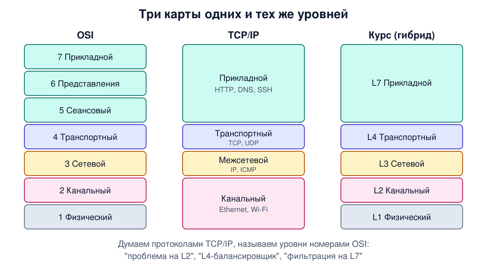
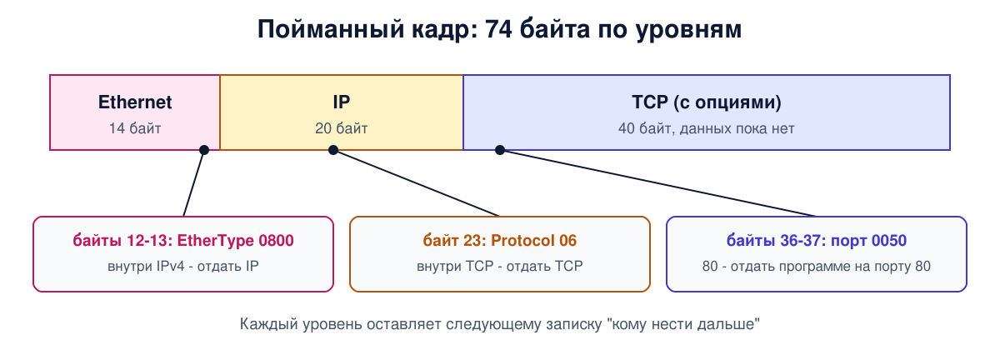

# Урок 6. Модели OSI и TCP/IP: инкапсуляция по-настоящему

В уроке 5 мы разобрали идею уровней в общем виде: интерфейсы, протоколы, пиры, заголовки. Сегодня дадим уровням настоящие имена. Есть две знаменитые "карты" сетевых уровней - модель OSI и модель TCP/IP. Одна стала общим языком инженеров, по другой построен интернет. А в конце урока мы возьмём настоящий пакет, пойманный на сервере, и найдём в его байтах каждый уровень.

## Модель OSI: семь уровней

В конце 1970-х в мире было много несовместимых наборов сетевых протоколов: у IBM свой, у DEC свой, у интернета свой. Международная организация по стандартизации (ISO) взялась создать единую модель - **модель взаимодействия открытых систем**, OSI (Open Systems Interconnection). Работа над ней шла с 1977 по 1984 год.

Модель OSI не описывает конкретные протоколы. Она задаёт уровни, их названия и функции каждого уровня. Уровней семь, снизу вверх:

| № | Уровень | Что делает | Пример |
|---|---|---|---|
| 1 | Физический | передаёт биты по среде: сигналы, разъёмы, кабели | витая пара, оптика, радио |
| 2 | Канальный | доставляет кадры между соседними узлами одной сети, проверяет ошибки | Ethernet, Wi-Fi |
| 3 | Сетевой | объединяет сети в составную сеть, доставляет пакеты через неё, выбирает маршрут | IP |
| 4 | Транспортный | доставляет данные нужной программе с нужной надёжностью | TCP, UDP |
| 5 | Сеансовый | управляет диалогом сторон, контрольные точки в длинных передачах | редко отдельно |
| 6 | Представления | согласует форму данных: кодировки, сжатие, шифрование | редко отдельно |
| 7 | Прикладной | услуги для приложений: доступ к файлам, веб, почта | HTTP, SMTP, DNS |

Несколько вещей, которые важно понять про эти уровни.

**Канальный уровень работает в пределах одной сети.** Его адреса (MAC) нужны, чтобы доставить кадр соседу по локальной сети. Чтобы данные прошли через несколько сетей, нужен сетевой уровень со своими, глобальными адресами (IP). Олифер сравнивает сетевой уровень с международной службой доставки, которая везёт груз через несколько континентов, пересаживая его с поезда на корабль, с корабля на самолёт. Каждый перевозчик отвечает только за свой участок, а служба доставки - за маршрут целиком.

**Нижние четыре уровня - это транспорт, верхние три - приложение.** Олифер называет нижние уровни сетевым транспортом: они доставляют сообщения по сети любой сложности. Верхние три связаны с тем, что именно делает приложение.

**Не все устройства работают на всех уровнях.** Полный стек есть только на конечных узлах - компьютерах, серверах, телефонах. Промежуточным устройствам достаточно нижних уровней:

- **концентратор** (хаб) работает на физическом уровне: просто повторяет сигнал на все порты;
- **коммутатор** локальной сети - на физическом и канальном: пересылает кадры по MAC-адресам;
- **маршрутизатор** - на первых трёх: пересылает пакеты между сетями по IP-адресам.

Так функции распределены именно при **пересылке чужих пакетов**. Для собственного управления (веб-интерфейс, SSH, мониторинг) у коммутаторов и маршрутизаторов тоже есть полный стек. А домашний роутер - это вообще несколько устройств в одной коробке: маршрутизатор с NAT, коммутатор, точка доступа Wi-Fi, серверы DHCP и DNS. Мы разберём его по частям в уроке 99 про OpenWrt.

## Модель TCP/IP: четыре уровня

Параллельно с OSI жил и рос интернет со своим стеком протоколов. Таненбаум рассказывает, что его корни - в сети ARPANET, которую финансировало министерство обороны США. Требования были особые: сеть должна объединять множество разнородных сетей и продолжать работу, даже если часть узлов и линий внезапно выйдет из строя. Отсюда выбор - пакетная сеть без соединений на сетевом уровне, та самая дейтаграммная из урока 4.

Уровней в модели TCP/IP четыре:

| Уровень TCP/IP | Что делает | Протоколы | Соответствует OSI |
|---|---|---|---|
| Прикладной | всё, что нужно приложениям | HTTP, DNS, SMTP, SSH | 5, 6, 7 |
| Транспортный | доставка между программами | TCP, UDP | 4 |
| Межсетевой | доставка пакетов между сетями | IP, ICMP | 3 |
| Канальный | передача по конкретной среде | Ethernet, Wi-Fi | 1, 2 |

Два протокола дали стеку имя. **IP** на межсетевом уровне доставляет пакеты через любые сети без гарантий. **TCP** на транспортном даёт программам надёжный поток байтов: разбивает его на части, нумерует, подтверждает, повторяет потерянное. Рядом с TCP живёт **UDP** - простой и ненадёжный, для тех, кому скорость важнее гарантий.

Сеансового уровня и уровня представления в TCP/IP нет. Приложения сами делают то, что им нужно из этих функций. Таненбаум замечает, что опыт подтвердил такой подход: для большинства приложений эти уровни оказались лишними.

## Почему победил TCP/IP

В конце 1980-х многие были уверены, что будущее за OSI. Вышло иначе. Таненбаум называет четыре причины.

- **Неудачное время.** Когда протоколы OSI появились, TCP/IP уже широко работал в университетах, и поддерживать второй стек никто не хотел.
- **Сложная архитектура.** Число уровней было выбрано скорее из политических соображений: два уровня получились почти пустыми, а два других - перегруженными. Стандарты вышли огромными и запутанными.
- **Плохие реализации.** Первые программы OSI были громоздкими и медленными, а TCP/IP вошёл в бесплатную и удачную Berkeley UNIX.
- **Политика.** OSI воспринимался как стандарт, спущенный министерствами, а TCP/IP - как свой, выросший у исследователей.

Итог, которым пользуется вся индустрия: **думаем протоколами TCP/IP, а называем уровни номерами OSI.** Таненбаум в своей книге использует гибридную модель из пяти уровней: физический, канальный, сетевой, транспортный, прикладной. Её используем и мы. В книге уровни пронумерованы от 1 до 5, но в речи прикладной уровень по привычке называют L7, по номеру из OSI. Отсюда привычные выражения: "проблема на L2", "L4-балансировщик", "фильтрация на L7".



## Инкапсуляция с настоящими именами

Теперь соберём всё вместе. Как мы видели в уроке 5, при отправке каждый уровень оборачивает данные верхнего уровня своим заголовком. Посмотрим, как это выглядит для запроса браузера.

```
L7  браузер:         [ GET / HTTP/1.1 ... ]                           данные
L4  TCP добавляет:   [ TCP | GET / HTTP/1.1 ... ]                     сегмент
L3  IP добавляет:    [ IP | TCP | GET / HTTP/1.1 ... ]                пакет
L2  Ethernet:        [ Ethernet | IP | TCP | GET / ... | FCS ]         кадр
L1  провод:          биты кадра по одному                             биты
```

У порции данных на каждом уровне своё имя:

- **данные** или сообщение - на прикладном уровне;
- **сегмент** - TCP-заголовок с данными; у UDP то же самое называют **дейтаграммой**;
- **пакет** - IP-заголовок с тем, что внутри;
- **кадр** (фрейм) - Ethernet-заголовок, пакет внутри и концевик **FCS** с контрольной суммой.

В быту "пакетом" называют всё подряд, и это нормально. Но строго пакет - это единица сетевого уровня. Даже утилиты путают: `ip -s link` из урока 3 в колонке `packets` на самом деле считает кадры канального уровня.

Где какие адреса живут, надо запомнить железно:

- **MAC-адреса** - в заголовке Ethernet (L2). Нужны до ближайшего соседа и **переписываются на каждом маршрутизаторе**: для каждого участка пути получается новый кадр.
- **IP-адреса** - в заголовке IP (L3). Указывают начало и конец всего пути. Обычный маршрутизатор их не меняет, а вот роутер с NAT (урок 56) меняет, и в этом весь смысл NAT.
- **Номера портов** - в заголовке TCP или UDP (L4). Указывают программу на компьютере.

## Как получатель разбирает матрёшку

На приёмной стороне всё идёт снизу вверх. Но как каждый уровень узнаёт, кому отдать то, что внутри? Для этого в каждом заголовке есть **поле-указатель** на следующий уровень.

```
кадр пришёл → Ethernet смотрит поле EtherType
                 0x0800 → внутри IPv4
                 0x86DD → внутри IPv6
                 0x0806 → внутри ARP
   → IP смотрит поле Protocol
                 6  → внутри TCP
                 17 → внутри UDP
                 1  → внутри ICMP
   → TCP смотрит порт назначения
                 80  → веб-сервер (HTTP)
                 443 → веб-сервер (HTTPS)
                 22  → SSH-сервер
   → данные отданы программе
```

Каждый уровень оставляет следующему записку "кому нести дальше". Без этих полей стек не смог бы разобрать ни одного пакета. Когда будешь читать дампы трафика или искать, где пакет "потерялся", ты будешь проходить именно эту лестницу.

## Как это увидеть в Linux

Поймаем настоящий пакет. Утилита `tcpdump` показывает пакеты, проходящие через интерфейс (нужны права root). В одном окне запускаем захват первого пакета нового TCP-соединения на порт 80:

```
sudo tcpdump -i enp0s3 -e -nn -XX -c 1 'tcp dst port 80 and (tcp[tcpflags] & tcp-syn != 0)'
```

В другом - `curl -s http://example.com -o /dev/null`. Вместо `enp0s3` подставь имя своего интерфейса из `ip link` (урок 3). Флаги: `-e` показать заголовок Ethernet, `-nn` не превращать адреса и порты в имена, `-XX` показать все байты кадра в hex, `-c 1` остановиться после одного пакета. Фильтр в кавычках отбирает первый пакет соединения (флаг SYN) на порт 80. Вот что получилось на сервере. Адреса заменены на учебные, а контрольные суммы пересчитаны под них; колонка с текстом справа убрана, а первая строка вывода, в оригинале одна длинная с меткой времени, разбита на две для читаемости:

```
52:54:00:12:34:56 > fe:54:00:ab:cd:ef, ethertype IPv4 (0x0800), length 74:
192.0.2.10.41232 > 172.66.147.243.80: Flags [S], seq 3697975666, win 64240, ...
  0x0000:  fe54 00ab cdef 5254 0012 3456 0800 4500
  0x0010:  003c 2967 4000 4006 0f15 c000 020a ac42
  0x0020:  93f3 a110 0050 dc6a a172 0000 0000 a002
  0x0030:  faf0 026f 0000 0204 05b4 0402 080a 64f9
  0x0040:  3278 0000 0000 0103 0307
```

Первая строка - заголовок Ethernet в понятном виде: MAC отправителя, MAC получателя и EtherType. Вторая - IP и TCP: адреса, порты (через точку после IP) и флаг `S` (SYN, начало соединения). Ниже - все 74 байта кадра в hex. Слева смещение в hex (0x0010 = 16, 0x0020 = 32, 0x0030 = 48), по 16 байт в строке, байты сгруппированы по два. Разберём их по уровням, пользуясь уроком 2 (смещения в таблице - десятичные, счёт с нуля):

| Байты (смещение) | Значение | Что это |
|---|---|---|
| 0-5 | `fe54 00ab cdef` | **L2:** MAC получателя - ближайший маршрутизатор |
| 6-11 | `5254 0012 3456` | **L2:** MAC отправителя - наша сетевая карта |
| 12-13 | `0800` | **L2:** EtherType = IPv4, дальше IP-заголовок |
| 14 | `45` | **L3:** версия 4, длина IP-заголовка 5 × 4 = 20 байт |
| 23 | `06` | **L3:** Protocol = 6, дальше TCP |
| 26-29 | `c000 020a` | **L3:** IP отправителя 192.0.2.10 |
| 30-33 | `ac42 93f3` | **L3:** IP получателя 172.66.147.243 |
| 34-35 | `a110` | **L4:** порт отправителя 41232 (выбран случайно) |
| 36-37 | `0050` | **L4:** порт получателя 80 |
| 46 | `a0` | **L4:** первая цифра - длина TCP-заголовка: a = 10, 10 × 4 = 40 байт |
| 47 | `02` | **L4:** флаги TCP, 02 = SYN |



Весь кадр - 14 байт Ethernet, 20 байт IP, 40 байт TCP (заголовок с опциями). Данных пока нет: это только первый шаг установления соединения, о нём в уроке 37. FCS в конце кадра `tcpdump` обычно не видит: у исходящих кадров её добавляет сетевая карта уже при отправке, а у входящих карта проверяет и отрезает её до того, как кадр попадает в систему.

Если запустить тот же захват с `-v` вместо `-XX`, tcpdump расшифрует поля IP словами: `ttl 64`, `proto TCP (6)`, `length 60`. А в TCP-части может написать `cksum 0x... (incorrect -> 0x...)`. Не пугайся: у исходящих пакетов контрольную сумму TCP и UDP часто досчитывает сама сетевая карта уже после того, как tcpdump увидел пакет. Это называется checksum offload. Контрольную сумму IP-заголовка Linux считает сам, поэтому с ней такого не бывает.

## Атаки и защита: что видит наблюдатель на каждом уровне

Раз каждый уровень добавляет свой заголовок, полезно понимать, что из них видно тому, кто перехватил пакет по пути. Вспомним урок 4: любой узел на пути держит пакет целиком.

- **L2 (MAC-адреса)** видны только в пределах одной локальной сети. Дальше маршрутизатор создаёт новый кадр со своими MAC. Твой MAC до сервера в интернете не доходит.
- **L3 (IP-адреса)** видны на всём пути: кто с кем общается, видно всем узлам между вами.
- **L4 (порты)** тоже видны на всём пути. По порту 22 скорее всего SSH, по 443 - скорее всего HTTPS. "Скорее всего" - потому что номер порта лишь соглашение, а не гарантия, и в блоке 10 мы увидим, как этим пользуются.
- **L7 (содержимое)** в открытом HTTP видно целиком: если поймать следующий пакет соединения, уже с данными, в его байтах будет текст `GET / HTTP/1.1`, как в `hexdump -C` из урока 2.

Шифрование TLS (блок 9) закрывает содержимое прикладного уровня. Сам TLS работает между TCP и приложением, и где его место в моделях уровней, обсудим в уроке 77. Но заголовки L3 и L4 остаются открытыми, иначе маршрутизаторы не смогли бы доставить пакет. Поэтому даже при HTTPS наблюдатель видит, с каким сервером ты общаешься, сколько данных и когда. На этом наблюдении строится и анализ трафика, и работа систем блокировок, и защита от них - к этому мы подробно вернёмся в блоке 10.

Там же станет ясно, почему VPN и прокси устроены по-разному. Одни заворачивают весь IP-пакет внутрь другого пакета, другие работают выше, с потоками данных. Само заворачивание ничего не прячет: скрывают содержимое они, только если шифруют. А адрес и порт самого VPN- или прокси-сервера наблюдатель видит в любом случае. Где именно на лестнице уровней работает каждая технология, определяет, что она может спрятать, а что нет.

## Итог

- Модель OSI - семь уровней: физический, канальный, сетевой, транспортный, сеансовый, представления, прикладной. Она стала общим языком инженеров.
- Модель TCP/IP - четыре уровня: канальный, межсетевой (IP), транспортный (TCP, UDP), прикладной. По ней построен интернет. Сеансового уровня и уровня представления в ней нет.
- TCP/IP победил из-за времени, простоты, удачных бесплатных реализаций и политики. На практике используют гибридную модель: протоколы TCP/IP, номера уровней OSI (L1-L4, L7).
- При пересылке чужих пакетов хаб работает на L1, коммутатор - на L2, маршрутизатор - на L3. Полный стек у конечных узлов, а для собственного управления - и у сетевых устройств.
- Порции данных: данные → сегмент (дейтаграмма у UDP) → пакет → кадр. MAC живут в L2 и меняются на каждом участке, IP - в L3, порты - в L4.
- Получатель разбирает матрёшку по полям-указателям: EtherType (0x0800 - IPv4), Protocol (6 - TCP, 17 - UDP), порт назначения.
- Наблюдатель на пути видит IP-адреса и порты пакетов, которые идут по проводу (при туннеле - только внешние), а содержимое - если оно не зашифровано.

## Что почитать

- Олифер, "Компьютерные сети", глава 4, с. 107-127: модель OSI, функции каждого уровня, стандартизация, стеки протоколов и их соответствие OSI, распределение уровней по устройствам.
- Таненбаум, "Компьютерные сети", раздел 1.6, с. 89-98: модели OSI и TCP/IP, почему OSI не победил, критика обеих моделей, гибридная модель книги.
