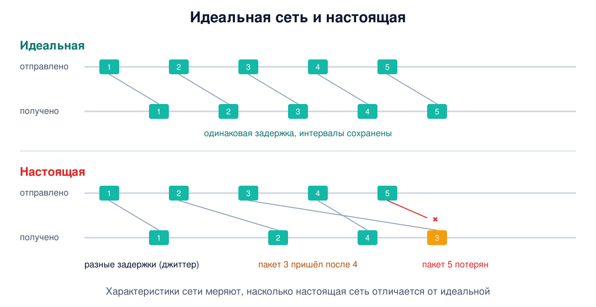
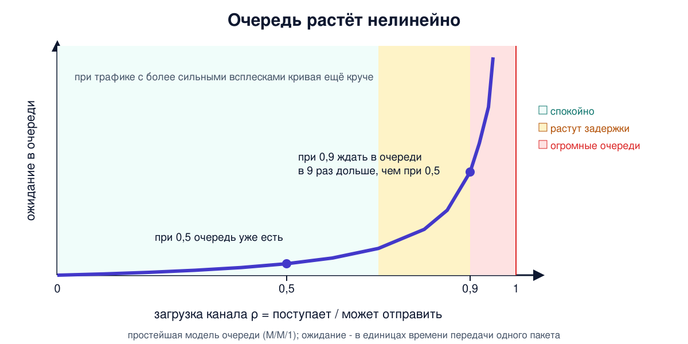

# Урок 7. Характеристики сети: задержка, джиттер, потери, скорость

"Интернет тормозит" - самая частая жалоба в мире. Но для инженера это не диагноз, а повод измерить. Тормозит - это что именно? Большая задержка? Скачет задержка? Теряются пакеты? Мала скорость? Или вообще сервер медленно отвечает, а сеть ни при чём? Сегодня научимся переводить жалобы на язык чисел и снимать эти числа своими руками. А ещё увидим, почему сеть, загруженная "всего" на 90%, может работать ужасно.

## Идеальная сеть и настоящая

Олифер предлагает простую точку отсчёта. **Идеальная** пакетная сеть:

- не теряет и не портит ни одного пакета;
- доставляет пакеты в том порядке, в каком их отправили;
- доставляет каждый пакет с минимально возможной задержкой, то есть только за время распространения сигнала;
- сохраняет интервалы между пакетами: если отправили с паузой 20 мс, то и придут с паузой 20 мс.

**Настоящая** сеть отклоняется от идеала во всём. Задержки разные у разных пакетов, потому что очереди в коммутаторах случайны. Пакеты могут прийти не по порядку, если шли разными путями. Могут потеряться или прийти испорченными, что для большинства протоколов одно и то же: испорченный пакет выбрасывают. Могут даже задвоиться. Характеристики сети нужны, чтобы измерить, насколько далеко реальность от идеала.

## Задержка: в одну сторону, туда-обратно и время ответа

Задержку можно мерить по-разному, и важно не путать.

- **Односторонняя задержка** - время от отправки пакета до его получения на другом конце. Самая честная характеристика, но измерить её трудно: нужны синхронизированные часы у отправителя и получателя.
- **Время оборота** (RTT, round-trip time) - время туда и обратно. Его меряет сам отправитель по своим часам: отметил время отправки, дождался ответа, посчитал разницу. Поэтому RTT - самая популярная характеристика. Минус: не видно, в какую сторону задержка больше.
- **Время реакции** - от запроса пользователя до ответа службы. Сюда входит не только сеть, но и работа сервера. Именно его пользователь и называет "сеть тормозит".

Последнее различие - ключ к отладке. Если сайт отвечает 3 секунды, а RTT до него 30 мс, то почти наверняка дело не в сети: чтобы набрать 3 секунды, понадобилась бы сотня оборотов по сети, а обычной странице хватает нескольких. Скорее всего, долго думает сервер, и ниже мы увидим, как это проверить.

## Джиттер: когда задержка скачет

**Вариация задержки**, или **джиттер** (jitter), показывает, насколько по-разному задерживаются пакеты. Для одних приложений это неважно, для других критично.

Олифер приводит наглядный пример. Если все пакеты видеоролика задерживаются ровно на 10 секунд, ты этого не заметишь: картинка просто начнётся на 10 секунд позже. А если задержка скачет от нуля до 10 секунд, изображение будет дёргаться. Спасает **буфер**: плеер накапливает пакеты на время, большее, чем разброс задержек, и воспроизводит их ровно. Отсюда крутящийся кружок в начале видео.

Для звонков буфер большим не сделаешь: собеседники не будут ждать. Олифер пишет, что при разбросе задержек больше 100-150 мс искажения голоса становятся неприемлемыми. В инженерной практике около 150 мс обычно называют и пределом комфортной задержки в одну сторону для разговора (рекомендация ITU-T G.114).



## Среднее значение лжёт

Задержка - случайная величина, и описывать её одним средним опасно. Представь: из каждых 50 пакетов 49 приходят за 20 мс, а один - за 2 секунды. Среднее - около 60 мс, вроде бы неплохо. А в реальности каждый пятидесятый запрос висит две секунды, и пользователь это прекрасно замечает.

Поэтому инженеры смотрят сразу на несколько оценок:

- **минимум** - сколько занимает путь без очередей, почти чистая физика;
- **медиана** - значение, которое делит все замеры пополам: половина пакетов быстрее, половина медленнее;
- **процентили** (квантили) - например, 99-й процентиль: 99% пакетов быстрее этого значения. Он показывает "хвосты", то есть редкие, но болезненные задержки: в примере выше 99-й процентиль равен двум секундам. Для совсем редких выбросов смотрят 99,9-й процентиль и максимум;
- **разброс** (стандартное отклонение) - насколько замеры отличаются от среднего.

В `ping` из урока 4 ты уже видел `min/avg/max/mdev`: минимум, среднее, максимум и разброс.

## Скорость: средняя, пиковая, мгновенная

Со скоростью тоже не всё просто, и Олифер разделяет несколько понятий.

- **Средняя скорость** - объём данных за период, делённый на длительность периода. Без указания периода она бессмысленна. Олифер приводит пример из договоров с провайдером: если провайдер один день в месяц вообще не передаёт твой трафик, а в другие дни разрешает превышать лимит, средняя скорость за месяц может оказаться в норме. Поэтому в договоре важно, за какой период её считают.
- **Мгновенная скорость** - в момент передачи пакета она всегда равна битовой скорости линии (например, 1 Гбит/с), а в паузах между пакетами равна нулю. Пакет не может идти "медленнее": медленнее может быть только поток пакетов, если между ними паузы.
- **Пиковая скорость** - средняя скорость на коротком всплеске трафика. Она показывает, выдержит ли сеть пульсации.

Вспомни урок 1: компьютерный трафик идёт всплесками. Отношение пиковой скорости к средней называют **коэффициентом пульсации**. У равномерного потока с постоянной битовой скоростью, например оцифрованного голоса в телефонной сети, он близок к единице, а у пульсирующего компьютерного трафика, по Олиферу, бывает от 2 до 100.

## Потери и надёжность

**Доля потерь** - отношение потерянных пакетов к отправленным. Пакет считается потерянным, если не пришёл за разумное время. Одни приложения к потерям очень чувствительны: в файле или программе не должно пропасть ни байта. Другие терпимы: в голосе потерянный кусочек можно "дорисовать" по соседним, хотя и здесь есть предел, порядка процента.

Для надёжности системы в целом используют **доступность** - долю времени, когда служба работает. Её меряют "девятками":

| Доступность | Простой в год |
|---|---|
| 99% ("две девятки") | около 3,7 суток |
| 99,9% ("три девятки") | около 8,8 часа |
| 99,99% ("четыре девятки") | около 53 минут |
| 99,999% ("пять девяток") | около 5,3 минуты |

По Олиферу, пять девяток - уровень лучшего оборудования телефонных сетей, а сети передачи данных к нему только стремятся.

Ещё одно свойство - **отказоустойчивость**: способность скрыть от пользователя отказ отдельных частей. Если два коммутатора соединены двумя линиями и одна порвалась, трафик пойдёт по второй, пусть и с половинной скоростью. Это называют деградацией, а не остановкой.

## Почему сеть на 90% загрузки - это плохо

Это, пожалуй, самый неожиданный вывод урока. Олифер разбирает его с помощью **теории очередей**. Представим выходной интерфейс коммутатора. В него приходят пакеты со средней интенсивностью λ, а он способен отправлять их со средней интенсивностью μ. Их отношение ρ = λ/μ называют **коэффициентом загрузки**.

Интуиция говорит: пока ρ меньше единицы, всё хорошо, мощности хватает. Реальность другая:

- при ρ около нуля очереди почти нет;
- уже при ρ около 0,5, когда мощности вдвое больше, чем нужно, очереди **есть**: пакеты приходят случайно, иногда сразу несколько подряд;
- когда ρ приближается к 1, время ожидания растёт **очень быстро и нелинейно**, в пределе - до бесконечности;
- чем сильнее пульсирует трафик, тем раньше и круче рост.



Практическое правило многих инженеров: при средней загрузке около 90% задержки уже заметно растут, особенно если трафик пульсирует, а ближе к 100% буферы переполняются и начинаются потери. Сколько это в миллисекундах, зависит от скорости канала: на гигабите пакет в 1500 байт передаётся за 12 мкс, и даже очередь из десятка пакетов почти незаметна, а на медленном канале каждый пакет в очереди добавляет уже миллисекунды. Поэтому магистрали стараются держать с запасом пропускной способности. Этот подход называют overprovisioning, "избыточная пропускная способность". Альтернатива - QoS: делить ресурсы между классами трафика, пропуская голос и видео вперёд, а скачивание файлов - потом.

Родственная проблема на домашних роутерах называется **bufferbloat**: если в устройстве слишком большие буферы, при загрузке канала пакеты подолгу стоят в очереди. Скачивание идёт на полной скорости, а пинг в игре подскакивает до сотен миллисекунд.

## Как это увидеть в Linux

Все измерения ниже сняты с сервера в Швеции.

**Задержка и разброс: `ping` со статистикой.**

```
ping -c 20 -i 0.2 -q fra-de-ping.vultr.com
```

```
20 packets transmitted, 20 received, 0% packet loss, time 3838ms
rtt min/avg/max/mdev = 27.593/29.438/31.995/1.447 ms
```

`-c 20` - двадцать запросов, `-i 0.2` - с интервалом 0,2 секунды, `-q` - показать только итог. Потерь 0%, минимум 27,6 мс, среднее 29,4, максимум 32,0, разброс 1,4 мс. Хороший стабильный путь: джиттер маленький.

**Задержки и потери на каждом участке пути: `mtr`.** Это `tracepath` и `ping` в одном: программа снова и снова получает ответы от каждого маршрутизатора на пути (как именно, разберём в уроке 28) и копит статистику по каждому.

```
mtr -r -w -n -c 20 fra-de-ping.vultr.com
```

```
HOST: server                    Loss%   Snt   Last   Avg  Best  Wrst StDev
  1.|-- 10.0.0.1                  0.0%    20   13.7   4.0   0.2  16.1   4.5
  ...
  6.|-- 198.51.100.136            0.0%    20   25.8  37.5  25.5  94.7  18.0
  7.|-- 198.51.100.192            0.0%    20   26.7  38.2  26.2 128.5  22.0
  8.|-- 198.51.100.137            0.0%    20   22.5  37.0  15.4 190.4  39.7
  9.|-- 203.0.113.14              0.0%    20   31.6  37.9  28.1  49.7   6.2
 10.|-- 203.0.113.30              0.0%    20   61.1  37.7  28.2  68.6  10.9
 11.|-- ???                      100.0    20    0.0   0.0   0.0   0.0   0.0
 12.|-- ???                      100.0    20    0.0   0.0   0.0   0.0   0.0
 13.|-- 203.0.113.49              0.0%    20   33.5  38.7  28.1  79.2  11.8
 14.|-- 203.0.113.117             0.0%    20   32.2  38.1  27.6  67.6  10.6
```

`-r` - отчёт после завершения, `-w` - не обрезать адреса, `-n` - без имён, `-c 20` - по двадцать замеров на каждый узел. Колонки: `Loss%` - потери, `Snt` - отправлено, `Last` - последний замер, `Avg` - среднее, `Best` и `Wrst` - лучший и худший, `StDev` - разброс. Строки 2-5 опущены для краткости, публичные адреса заменены на учебные.

А теперь главное умение - **правильно читать mtr**. Посмотри на узел 8: худшее время 190 мс, огромный разброс. И на узлы 11-12: 100% потерь! Тревога? Нет. Посмотри на **последнюю строку**, на сам сервер назначения: потерь 0%, худшее время 68 мс. Значит, через узлы 8, 11 и 12 наши пакеты проходят нормально. Маршрутизаторы пересылают чужие пакеты быстро, а отвечать mtr для них второстепенная работа: они делают это в последнюю очередь или не делают вовсе. **Проблема есть, только если потери или задержка появились на каком-то узле и сохраняются на всех следующих, вплоть до последнего.** Новички постоянно пишут провайдерам "у вас на 8-м хопе потери", хотя такие потери ничего не значат.

По тому же правилу видно и настоящее, хотя и безобидное явление. На всех показанных узлах, с 6-го до самого конца, среднее (около 38 мс) заметно выше лучшего (около 28 мс). Значит, во время замера на пути действительно был разброс задержек порядка 10 мс, скорее всего из-за очередей. Для большинства приложений это не страшно. А `ping` выше показал разброс всего 1,4 мс, потому что замеры сделаны в разное время: очереди в сети то появляются, то исчезают.

**Сеть или сервер: разложить время ответа.** `curl` умеет показать, сколько заняла каждая фаза запроса:

```
curl -s -o /dev/null -w 'dns=%{time_namelookup} connect=%{time_connect} tls=%{time_appconnect} ttfb=%{time_starttransfer} total=%{time_total}\n' https://example.com
```

```
dns=0.060851 connect=0.104741 tls=0.200757 ttfb=0.267148 total=0.267205
```

Все значения в секундах и **накопительные**, от начала запроса:

- `dns` - к 61-й миллисекунде нашли адрес сервера по имени;
- `connect` - к 105-й установили TCP-соединение, на это ушло 44 мс, примерно один RTT;
- `tls` - к 201-й договорились о шифровании, ещё около 96 мс: это один-два оборота по сети (в TLS 1.3 рукопожатие занимает один RTT) плюс вычисления и проверка сертификата;
- `ttfb` (time to first byte) - к 267-й пришёл первый байт ответа, ещё 66 мс. Из них примерно 44 мс - один оборот по сети: запрос дошёл до сервера, первый байт ответа вернулся. Сам сервер думал около 20 мс;
- `total` - всё закончилось к 267-й миллисекунде, страница маленькая.

Если разница между `ttfb` и `tls` намного больше одного RTT - медленно работает сервер. Если медленно уже на `dns` - виноват DNS. Это и есть отладка по пути пакета из урока 1.

**Скорость: скачать тестовый файл.**

```
curl -s -o /dev/null -w 'size=%{size_download} time=%{time_total} speed=%{speed_download}\n' https://fra-de-ping.vultr.com/vultr.com.100MB.bin
```

Два замера с нашего сервера, через один и тот же канал. Для Токио команда та же, отличается только адрес тестового сервера:

| Откуда файл | RTT | Время на 100 МиБ | Скорость |
|---|---|---|---|
| Франкфурт | ~28 мс | 3,6 с | около 29 МБ/с (233 Мбит/с) |
| Токио | ~254 мс | 19,0 с | около 5,5 МБ/с (44 Мбит/с) |

Файл весит 100 МиБ (104 857 600 байт), `speed_download` curl показывает в байтах в секунду, а МБ/с в таблице - десятичные мегабайты (урок 2); в мегабиты переводим умножением на 8. Канал тот же, а скорость отличается в пять раз. Главный фактор - задержка. TCP отправляет данные и ждёт подтверждений, поэтому его скорость не больше, чем объём неподтверждённых данных "в пути", делённый на RTT. При RTT в девять раз больше нужно в девять раз больше данных в пути, а на длинном пути ещё и редкие потери тормозят TCP сильнее. Вклад вносит и то, что серверы и маршруты разные, а из Франкфурта мы, похоже, упираемся уже в скорость канала нашего сервера. Почему так, разберём в уроках 39-41 про окно и контроль перегрузки. А пока запомни: **пропускная способность и задержка связаны**, и "у меня гигабит" ещё не значит, что файл с другого континента скачается быстро.

## Атаки и защита: удар по доступности

Из триады КЦД (урок 1) характеристики этого урока ближе всего к **доступности**. И самая массовая атака на доступность - **отказ в обслуживании** (DoS, Denial of Service), а если атакуют с тысяч машин одновременно - распределённый (DDoS).

Смысл простой: вспомни график загрузки. Атакующий заваливает канал или сервер мусорным трафиком, загрузка подходит к единице, очереди растут, буферы переполняются, и начинают теряться пакеты **всех** пользователей, а не только атакующего. Сервис формально работает, но пользоваться им невозможно. Бывает и хитрее: атаки, которые бьют не по каналу, а по ресурсам сервера, например по таблице соединений (урок 37), или используют чужие серверы как усилитель (урок 35).

Как защищаются:

- **запас пропускной способности** - чем больше канал, тем больше нужно мусора, чтобы его забить;
- **фильтрация как можно ближе к источнику** - у провайдера или в специальных центрах очистки трафика, пока мусор не дошёл до твоего канала;
- **ограничение скорости** (rate limiting) - не больше стольких-то запросов с одного адреса;
- **распределение по многим точкам**, например через сети доставки контента (CDN): атаке приходится бить сразу по сотням серверов по всему миру.

И ещё одно применение характеристик для защиты: если ты знаешь **нормальные** значения задержки, потерь и объёма трафика своей сети, резкое отклонение от нормы - первый сигнал атаки или сбоя. Системы мониторинга и обнаружения вторжений (урок 60) во многом построены на этой идее.

## Итог

- Идеальная сеть: без потерь, по порядку, с минимальной постоянной задержкой, с сохранением интервалов. Настоящая отклоняется во всём, и характеристики меряют, насколько.
- Задержка: односторонняя (честная, но нужны синхронные часы), RTT (туда-обратно, мерить легко), время реакции (включает работу сервера).
- Джиттер - разброс задержек. Критичен для голоса и видео, лечится буфером, если приложение может ждать.
- Одним средним задержку не описать: нужны минимум, медиана, процентили, разброс.
- Скорость: средняя (всегда с периодом), мгновенная (равна скорости линии во время передачи пакета), пиковая (на всплесках).
- Доступность меряют девятками: пять девяток - около 5 минут простоя в год.
- Время ожидания в очереди растёт нелинейно с загрузкой: при средней загрузке около 90% задержки уже заметно растут. Лечат запасом пропускной способности или QoS.
- В mtr смотри на последний узел: потери на промежуточных, которые не доходят до конца, - не проблема.
- Скорость зависит от задержки: один канал, но из далёкого места качается в разы медленнее.
- DoS бьёт по доступности, доводя загрузку до предела. Защита: запас, фильтрация у источника, ограничение скорости, распределение.

## Что почитать

- Олифер, "Компьютерные сети", глава 5, с. 133-159: субъективные и количественные характеристики, соглашение об уровне обслуживания, идеальная и реальная сети, статистические оценки, активные и пассивные измерения, задержки, скорости, надёжность, требования приложений и основы анализа очередей.
