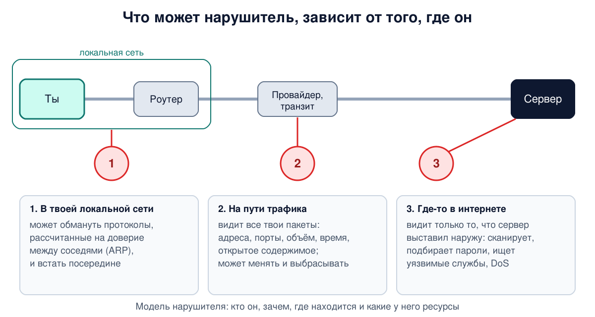

# Урок 8. Основы информационной безопасности

Во всех уроках курса есть раздел "Атаки и защита". Чтобы говорить о безопасности точно, нужен общий язык: чем уязвимость отличается от угрозы, что такое риск, кто такой нарушитель и по каким принципам строят защиту. Этот урок - словарь и способ мышления, которыми мы будем пользоваться до конца курса. А на практике мы посмотрим на настоящие атаки на наш собственный учебный сервер, который работает в интернете всего несколько часов.

## Кто ты и что тебе можно

Начнём с трёх слов, которые путают чаще всего. Олифер разбирает их на модели контролируемого доступа: есть субъекты (пользователи и программы, которые работают от их имени), есть объекты (файлы, устройства, сетевые службы) и есть правила, кто что может делать.

- **Идентификация** - назвать себя: "я - пользователь anna". Системе нужны уникальные имена, чтобы отличать субъекты и объекты друг от друга.
- **Аутентификация** - доказать, что ты тот, кем назвался: пароль, ключ, отпечаток пальца. Бывает односторонней (доказывает только одна сторона) и взаимной (стороны доказывают друг другу). Одностороннюю ты уже видел: в TLS браузер проверяет сертификат сервера (урок 1), а сервер тебя при этом не проверяет. Взаимная - например, вход по SSH с ключом: клиент проверяет ключ сервера, а сервер - ключ пользователя.
- **Авторизация** - решить, что именно тебе можно, после того как ты доказал, кто ты. Прочитать файл - да, удалить - нет.

Доступ в обход этих правил называют **несанкционированным**. Подробно способы аутентификации разберём в уроке 74.

## Что защищаем: КЦД и не только

Триаду **конфиденциальность, целостность, доступность** ты знаешь с урока 1. Олифер связывает её со статьёй Зальцера и Шрёдера 1975 года (тех самых, чьи принципы мы разберём ниже) и отмечает, что за почти полвека выяснилось: трёх свойств мало. Его пример: клиент банка отправил по почте распоряжение снять крупную сумму, а потом заявил, что ничего не отправлял. Безопасность нарушена? Да. Конфиденциальность, целостность или доступность? Нет.

Поэтому триаду расширяют. Одна из известных схем - **гексада Паркера**, в ней шесть свойств:

- конфиденциальность, целостность, доступность;
- **аутентичность** - нельзя выдать себя за другого, у сообщения достоверный автор;
- **владение** - физический контроль над носителем информации есть только у тех, кому положено. Украденный ноутбук с зашифрованным диском - это нарушение владения, даже если данные никто не прочитал;
- **полезность** - защита не должна делать работу невыносимой. Иначе сотрудники начнут её обходить, и защита станет вредной.

Отдельно говорят о **неотказуемости**: участник не может потом отрицать, что отправил или получил сообщение. Её обеспечивает электронная подпись (урок 73).

## Уязвимость, угроза, атака, риск

Эти четыре понятия - основа любого разговора о безопасности.

- **Уязвимость** - слабое место системы: ошибка в программе, простой пароль, неправильные права на файл, забытая настройка по умолчанию. Уязвимости бывают ещё неизвестными, известными теоретически и общеизвестными, для которых уже есть готовые инструменты взлома.
- **Угроза** - обстоятельства и действия, которые могут привести к нарушению безопасности.
- **Атака** - реализованная угроза. Олифер формулирует важную мысль: атака возможна только тогда, когда **одновременно** есть уязвимость и направленная на неё угроза. Уязвимость, о которой никто не знает, пока не опасна. Угроза против уязвимости, которой у тебя нет, тоже.
- **Эксплойт** - готовая программа или инструкция, которая использует конкретную уязвимость. Опасен тем, что с ним успешную атаку может провести даже неподготовленный человек.

Отсюда главный практический совет: **вовремя ставить обновления**. Общеизвестные, но не исправленные уязвимости - одна из самых частых причин взломов. На нашем сервере для этого работают автоматические обновления безопасности.

Ещё одна неприятная для самолюбия деталь. По оценке, которую приводит Олифер, около двух третей серьёзных инцидентов связаны не с внешними хакерами, а с легальными пользователями: сотрудниками, клиентами, студентами. И немалая их часть - не злой умысел, а ошибки. Пример из книги: в 1997 году ошибка в настройке маршрутизации у одного небольшого провайдера нарушила работу значительной части интернета.

**Ущерб** - негативное влияние атаки: не только затраты на восстановление, но и потери бизнеса. **Риск** - оценка ущерба с учётом вероятности атаки. Абсолютной защиты не бывает, поэтому задача не "исключить всё", а **управлять рисками**. С каждым риском можно поступить четырьмя способами:

| Действие | Когда | Пример |
|---|---|---|
| Принять | ущерб приемлем | мелкий сбой, который дешевле пережить, чем предотвращать |
| Устранить | можно убрать уязвимость или угрозу | закрыть ненужную службу, поставить обновление |
| Снизить | устранить нельзя | подбор паролей возможен всегда, но длинные пароли и ограничение попыток делают успех гораздо менее вероятным |
| Передать | ничего не помогает | застраховать риск |

## Нарушитель: кто, зачем, откуда и с какими силами

Защиту нельзя строить "от всего сразу". Сначала описывают **модель нарушителя**: против кого защищаемся. У Таненбаума есть показательная таблица типов нарушителей и их целей: от студента, которому любопытно почитать чужую почту, до уволенного сотрудника, который хочет отомстить, и шпиона, охотящегося за секретами. Таненбаум подчёркивает, что самые разрушительные атаки часто устраивают обиженные инсайдеры, то есть свои же сотрудники.

Модель нарушителя отвечает на четыре вопроса:

- **кто** - случайный хулиган, преступник ради денег, конкурент, сотрудник, государство;
- **зачем** - деньги, данные, месть, слава, политика;
- **где он находится** относительно тебя - в твоей локальной сети, на пути трафика (провайдер, точка доступа в кафе, узел на маршруте из урока 4) или где-то в интернете;
- **какие у него ресурсы** - один ноутбук, ботнет из тысяч машин, возможности государственного масштаба.

Особенно важен третий вопрос, и он напрямую связан с тем, что мы изучаем. Нарушитель **в интернете** видит только то, что твои компьютеры и серверы выставили наружу. Нарушитель **на пути** видит все твои пакеты и может их менять (урок 4). Нарушитель **в локальной сети** может обмануть протоколы, которые рассчитаны на доверие между соседями (урок 24 про ARP). От каждого защищаются по-своему. И когда в конце курса мы будем разбирать системы, которые прячут трафик от анализа, всё начнётся именно с вопроса: кто наш наблюдатель и что он видит.



## Из чего состоит атака

Таненбаум раскладывает сетевые атаки на базовые компоненты, из которых злоумышленник собирает свой "рецепт":

1. **Разведка** - узнать как можно больше: какие компьютеры есть, какие службы на них работают, какие версии программ. Урок 34 про сканирование портов.
2. **Прослушивание** - перехватить трафик. Даже зашифрованный трафик выдаёт, кто, с кем и когда общался (урок 6).
3. **Подмена** (spoofing) - выдать себя за другого: поставить чужой адрес отправителя в кадр или пакет. Протоколы Ethernet и IP этого не проверяют.
4. **Нарушение работы** - отказ в обслуживании, атака на доступность (урок 7).

Олифер делит атаки на **пассивные** и **активные**. Пассивные - сбор информации и прослушивание: система работает как обычно, следов почти не остаётся, поэтому такие атаки трудно заметить. Активные - меняют состояние системы: внедряют вредоносную программу, подменяют данные, заваливают запросами. После них обычно остаются следы. На практике атака почти всегда смешанная: сначала тихая разведка, потом активное вмешательство.

Олифер отдельно разбирает несколько распространённых типов атак:

- **DoS и DDoS** - отказ в обслуживании; распределённый вариант идёт с тысяч захваченных компьютеров, которые злоумышленник объединяет в **ботнет**. Для сокрытия источника часто подделывают адрес отправителя.
- **Вредоносные программы** - вирусы, черви, трояны, шпионские программы. Любопытное замечание Олифера: шпионским инструментом может стать и вполне легальная программа вроде анализатора трафика Wireshark, если она в руках злоумышленника.
- **Фишинг** - выманивание данных у человека: поддельные письма и сайты с адресами, похожими на настоящие. Вспомни буквы-двойники из урока 2.

## Как строят защиту

Олифер описывает четыре уровня средств защиты, и только последний из них - технический:

- **законодательный** - законы, стандарты, лицензирование;
- **административный** - политика безопасности: что защищаем в первую очередь, какой бюджет, кто отвечает;
- **процедурный** - действия людей: резервное копирование, обновления, пропускной режим, порядок приёма сотрудников на работу;
- **технический** - файрволы, шифрование, системы обнаружения вторжений (урок 60), антивирусы.

И несколько принципов, которые работают в любой системе защиты.

**Эшелонированная защита** (defense in depth). Ставить не одну преграду, а несколько подряд: физическая охрана, файрвол на границе сети, системы обнаружения внутри, защита на самом компьютере, шифрование данных. Смысл, по Олиферу, не только в том, что одно средство подстрахует другое, а в том, чтобы **заставить злоумышленника потратить больше времени** - и повысить шанс его заметить.

**Слабое звено.** Защищённость системы равна защищённости её самого слабого места. Мощное шифрование бесполезно, если ключи лежат в открытом доступе. Дорогой файрвол на входе в сеть бесполезен, если у сотрудника есть свой обходной канал в интернет. Олифер приводит реальный пример: диск с секретными военными данными был найден на рынке, потому что никто не продумал утилизацию оборудования, хотя хранение и передача были надёжно зашифрованы.

**Защита - это процесс.** Нельзя настроить безопасность один раз и забыть. Анализ угроз, оценка рисков, меры, проверка, снова анализ. И лучше готовиться заранее (проактивно), чем тушить пожар после взлома.

**Компромисс.** Защита должна стоить меньше, чем ущерб, от которого она защищает. А для злоумышленника атака должна стоить дороже, чем то, что он получит.

Таненбаум добавляет классические принципы Зальцера и Шрёдера 1975 года. Вот самые важные для нас:

- **простота** - чем проще механизм, тем меньше в нём ошибок и тем меньше **поверхность атаки**: все точки, куда можно ударить. Ненужная функция - лишний риск;
- **безопасные настройки по умолчанию** - по умолчанию запрещено всё, что явно не разрешено;
- **полная проверка** - проверять права при каждом обращении к ресурсу;
- **минимальные привилегии** - каждый компонент получает только те права, которые ему нужны. Если его взломают, злоумышленник получит немного;
- **открытая архитектура** - защита не должна держаться на том, что никто не знает, как она устроена. Это обобщение принципа Керкгоффса из криптографии: система шифрования должна оставаться надёжной, даже если противник знает о ней всё, кроме ключа (урок 68);
- **психологическая приемлемость** - защитой должно быть удобно пользоваться, иначе её будут обходить.

## Как это увидеть в Linux: наш сервер под атакой

Всё это не теория. Учебный сервер, на котором работает бот этого курса, подключён к интернету всего несколько часов. Посмотрим, что с ним успело произойти. Команды читают системные журналы и настройки, поэтому нужен `sudo`. Во всех выводах публичные адреса заменены на учебные, а имя сервера - на `server`.

**Первые гости.** Сервер загрузился в 10:15:57. Смотрим журнал службы SSH:

```
sudo journalctl -u ssh -o short-iso | grep -E 'Connection from|Invalid user|Failed password' | head -3
```

```
2026-09-28T10:16:55+00:00 server sshd[954]: ssh_dispatch_run_fatal: Connection from 198.51.100.7 port 41238: Broken pipe [preauth]
2026-09-28T10:28:03+00:00 server sshd[7676]: Invalid user admin from 203.0.113.25 port 39930
2026-09-28T10:28:04+00:00 server sshd[7676]: Failed password for invalid user admin from 203.0.113.25 port 39930 ssh2
```

Меньше чем через минуту после загрузки к порту 22 уже кто-то подключился. Через 12 минут бот попробовал войти как `admin` с паролем. В тот момент на сервере ещё стояли настройки хостинга по умолчанию, и вход по паролю был разрешён: мы закрыли его примерно через 40 минут. Пользователя `admin` на сервере нет, так что попытка провалилась. Но вывод простой: **сервер нужно защитить до того, как он появился в сети, или сразу после, а не "потом"**. Никто не знал, что здесь учебный бот: весь интернет непрерывно сканируют автоматические программы, которые перебирают адреса и порты в поисках открытых служб. Это разведка из списка Таненбаума в чистом виде.

**Файрвол записывает отброшенные пакеты.** В 10:57 мы включили ufw с правилом "запрещено всё, кроме SSH" - принцип безопасных настроек по умолчанию. Заблокированные пакеты попадают в журнал ядра. Одна из первых записей:

```
sudo journalctl -k | grep "UFW BLOCK" | grep "DPT=23 " | head -1
```

```
Sep 28 10:57:22 server kernel: [UFW BLOCK] IN=enp0s3 OUT= MAC=... SRC=198.51.100.44 DST=192.0.2.10 LEN=60 TOS=0x00 PREC=0x00 TTL=46 ID=11132 DF PROTO=TCP SPT=43148 DPT=23 WINDOW=65535 RES=0x00 SYN URGP=0
```

`SRC` - откуда пришёл пакет, `DST` - наш сервер, `DPT` - порт, к которому пытались подключиться (23 - telnet, старый небезопасный протокол удалённого доступа), `SYN` - попытка открыть TCP-соединение. Запись пришла через считанные секунды после включения файрвола. Посчитаем, сколько всего записей, с какого числа адресов и на какие порты:

```
sudo journalctl -k | grep -c "UFW BLOCK"
sudo journalctl -k | grep "UFW BLOCK" | grep -oE 'SRC=[^ ]+' | sort -u | wc -l
sudo journalctl -k | grep "UFW BLOCK" | grep -oE 'DPT=[0-9]+' | sort | uniq -c | sort -rn | head -3
```

```
329
130
      6 DPT=23
      2 DPT=443
      2 DPT=2082
```

329 записей со 130 адресов, и почти каждая - на свой порт: сканеры перебирают множество разных портов. Чаще других пробуют telnet: в интернете до сих пор много старых камер и роутеров, которые пускают по telnet с заводским паролем.

**Но журнал врёт, если не знать, как он устроен.** Записи идут с 10:57:22 до 12:43:22, это 106 минут. А ufw по умолчанию записывает не больше 3 блокировок в минуту, с запасом на 10 записей сразу. Это видно в правиле, которое пишет в журнал:

```
sudo iptables -S ufw-after-logging-input
```

```
-N ufw-after-logging-input
-A ufw-after-logging-input -m limit --limit 3/min --limit-burst 10 -j LOG --log-prefix "[UFW BLOCK] "
```

106 × 3 + 10 = 328. Записей почти ровно столько, сколько пропускает ограничитель: журнал всё это время был заполнен до предела, и 329 - это потолок ограничителя, а не число атак. Настоящее число отброшенных пакетов показывает счётчик самого файрвола:

```
sudo iptables -nvL INPUT | head -1
```

```
Chain INPUT (policy DROP 5181 packets, 261K bytes)
```

Больше пяти тысяч пакетов, в пятнадцать с лишним раз больше, чем записей в журнале. И адресов почти наверняка было больше 130. К тому же этот счётчик учитывает только IPv4, для IPv6 есть отдельный `ip6tables`. Ограничение разумное: без него сканеры могли бы забить диск журналом, и это тоже была бы атака на доступность. Но урок важный: прежде чем делать выводы по данным, узнай, **как инструмент их собирает** (вспомни процентили из урока 7).

**Попытки войти по SSH.** Какие имена пробовали:

```
sudo journalctl -u ssh | grep -o 'Invalid user [^ ]*' | cut -d' ' -f3 | sort | uniq -c | sort -rn
```

```
      3 admin
      1 wwswd
      1 probe-f2b-test
      1
```

Боты пробуют типичные имена вроде `admin`, один даже прислал пустое имя (последняя строка). `probe-f2b-test` - это мы сами, о нём ниже. Сейчас вход по паролю отключён, пускают только по ключу, так что подбор пароля бессмысленен: этот риск **устранён**. Проверить, какие настройки SSH действуют на самом деле, можно так:

```
sudo sshd -T | grep -iE 'passwordauthentication|permitrootlogin'
```

```
permitrootlogin without-password
passwordauthentication no
```

`sshd -T` показывает итоговую конфигурацию с учётом всех файлов в `/etc/ssh/sshd_config.d/`. Это важно: в облачных образах Ubuntu там бывает файл от cloud-init, который снова включает вход по паролю, и правка одного только основного файла ничего не даст. `without-password` - старое название значения `prohibit-password`: root не может войти по паролю, только по ключу.

**Проверяй не только защиту, но и свои выводы.** На сервере есть второй рубеж - fail2ban, программа, которая блокирует адрес после нескольких неудачных попыток входа (по умолчанию 5 за 10 минут). Готовя урок, мы заметили две странности. В Ubuntu 24.04 служба SSH называется `ssh.service` (порт держит сам systemd, урок 5), а стандартный фильтр fail2ban упоминает `sshd.service`. И счётчик fail2ban показывал меньше неудачных попыток, чем журнал. Гипотеза напрашивалась: fail2ban видит не всё. Мы явно указали правильное имя службы и проверили защиту пробной неудачной попыткой входа - это и есть `probe-f2b-test`:

```
sudo fail2ban-client status sshd
```

```
Status for the jail: sshd
|- Filter
|  |- Currently failed: 1
|  |- Total failed:     4
|  `- Journal matches:  _SYSTEMD_UNIT=ssh.service + _COMM=sshd
`- Actions
   |- Currently banned: 0
   |- Total banned:     0
   `- Banned IP list:
```

Счётчик вырос, защита работает. Но потом мы проверили саму гипотезу, и она оказалась **неверной**. Знак `+` в строке `Journal matches` означает ИЛИ: fail2ban читает записи либо службы с таким именем, либо процесса с именем `sshd`. Стандартный фильтр и до исправления ловил все нужные записи по имени процесса. А разница в счётчиках объяснялась проще: первые две попытки случились в 10:28, а fail2ban установили и запустили только в 10:57. Всё, что было после, он увидел: 4 попытки, включая нашу пробную. Бан не сработал ни разу, потому что ни один адрес не набрал 5 неудач за 10 минут.

Мораль двойная. **Защиту нужно проверять, а не только включать**: непроверенная защита опасна тем, что на неё рассчитывают. И **выводы тоже нужно проверять**: объяснение, которое звучит правдоподобно, может быть неверным. Прежде чем "чинить" систему безопасности, убедись по данным, что она действительно сломана.

**Поверхность атаки.** Что сервер выставил наружу:

```
sudo ss -tulnp
```

```
Netid State        Local Address:Port  Peer Address:Port Process
udp   UNCONN          127.0.0.54:53         0.0.0.0:*    users:(("systemd-resolve",...))
udp   UNCONN       127.0.0.53%lo:53         0.0.0.0:*    users:(("systemd-resolve",...))
tcp   LISTEN          127.0.0.54:53         0.0.0.0:*    users:(("systemd-resolve",...))
tcp   LISTEN       127.0.0.53%lo:53         0.0.0.0:*    users:(("systemd-resolve",...))
tcp   LISTEN             0.0.0.0:22         0.0.0.0:*    users:(("sshd",...),("systemd",pid=1,...))
tcp   LISTEN                [::]:22            [::]:*    users:(("sshd",...),("systemd",pid=1,...))
```

`-t` и `-u` - сокеты TCP и UDP, `-l` - только ожидающие подключений, `-n` - без имён, `-p` - какой процесс (для этого и нужен `sudo`). Колонки очередей убраны для краткости. Порт 53 слушает только адреса `127.0.0.x` - это локальный DNS-помощник, снаружи он недоступен. Наружу открыт единственный порт - TCP 22. Бот вообще не принимает входящих соединений: он сам ходит в Telegram. Поверхность атаки минимальна - принцип простоты.

**Минимальные привилегии.** Бот работает в контейнере Docker с жёсткими ограничениями:

```
sudo docker inspect hopbyhop-bot-1 --format 'user={{.Config.User}} readonly={{.HostConfig.ReadonlyRootfs}} capdrop={{.HostConfig.CapDrop}}'
```

```
user=bot readonly=true capdrop=[ALL]
```

Программа работает не от root, а от отдельного пользователя `bot`, файловая система контейнера доступна только для чтения. А `capdrop=[ALL]` отбирает все capabilities - полномочия root, разбитые на отдельные права: например, читать и менять чужие файлы в обход прав доступа или менять владельца файлов. Их не будет, даже если процесс внутри контейнера каким-то образом станет root. Если в боте когда-нибудь найдут уязвимость, злоумышленник окажется в очень тесной комнате.

Одна оговорка на будущее: если контейнер публикует порты наружу, Docker добавляет свои правила файрвола в обход ufw. У бота портов нет, но о такой ловушке стоит помнить.

В целом на сервере работают сразу несколько рубежей: только ключи для SSH, файрвол, fail2ban, автоматические обновления, изоляция бота. Это и есть эшелонированная защита.

## Итог

- Идентификация - назвать себя, аутентификация - доказать, авторизация - получить права.
- Кроме КЦД, защищают аутентичность, владение, полезность и неотказуемость.
- Уязвимость - слабое место, угроза - возможность вреда, атака - реализованная угроза. Атака возможна, только когда есть и уязвимость, и угроза. Главная защита от известных уязвимостей - обновления.
- Большинство серьёзных инцидентов связано со своими пользователями, и немало из них - просто ошибки.
- Риск = ущерб с учётом вероятности. Риск можно принять, устранить, снизить или передать.
- Модель нарушителя: кто, зачем, где находится относительно тебя, какие у него ресурсы.
- Компоненты атаки: разведка, прослушивание, подмена, нарушение работы. Пассивные атаки почти не оставляют следов, активные - оставляют.
- Уровни защиты: законодательный, административный, процедурный, технический. Принципы: эшелонированная защита, слабое звено, защита как процесс, компромисс, простота, запрет по умолчанию, минимальные привилегии, открытая архитектура.
- Сервер в интернете начинают сканировать через минуты после запуска. Защиту нужно не только включать, но и проверять, а выводы - сверять с данными и знать, как инструмент их собирает.

## Что почитать

- Олифер, "Компьютерные сети", глава 26, с. 801-822: идентификация, аутентификация, авторизация, модели безопасности (КЦД, гексада Паркера), уязвимость, угроза, атака, риск и управление рисками, типы атак, иерархия средств защиты, принципы защиты.
- Таненбаум, "Компьютерные сети", глава 8, с. 814-822: введение к главе (типы нарушителей, инсайдеры) и раздел 8.1: параметры безопасности, принципы Зальцера и Шрёдера, базовые компоненты атак.
