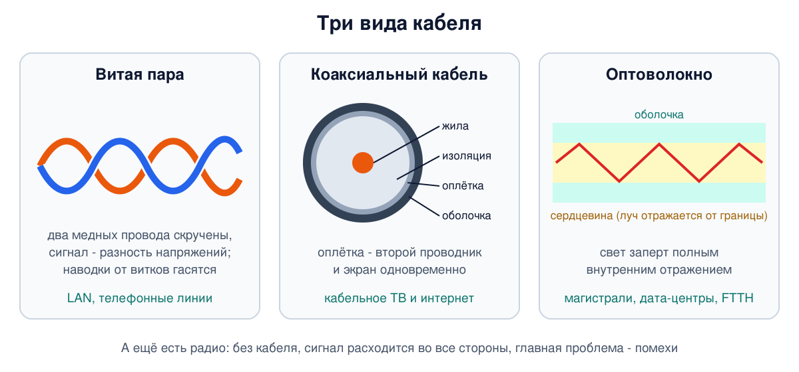
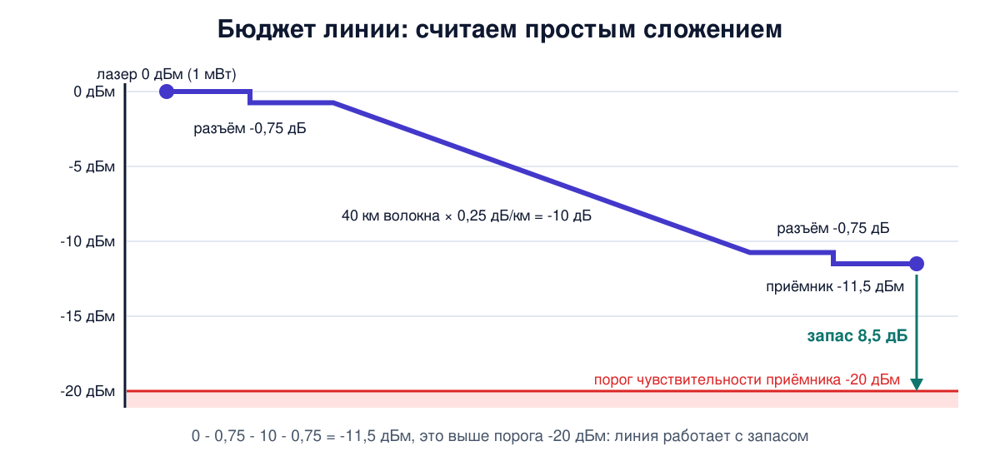
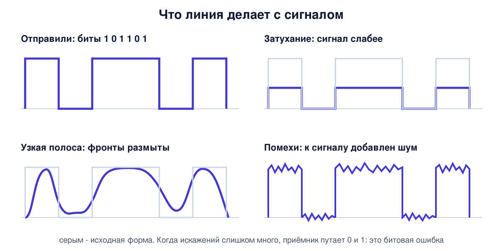

# Урок 9. Линии связи: медь, оптика, радио

Мы уже много раз говорили "биты идут по кабелю". Пора посмотреть, что это значит физически. Бит в линии - это не цифра, а сигнал: напряжение в медной паре, вспышка света в стекле, радиоволна в воздухе. И каждая среда его портит по-своему: ослабляет, размывает, подмешивает шум. Сегодня разберёмся, чем меряют качество линии, почему скорость упирается в физику, чем витая пара отличается от оптики и радио. А в разделе про безопасность увидим, что любой кабель и любой эфир можно подслушать, если знать, как.

## Звено, канал, линия

Сначала о словах, которые в литературе часто путают. Олифер предлагает различать:

- **звено** (link) - участок между двумя соседними узлами сети без коммутаторов посередине, хотя усилители и регенераторы сигнала на нём могут стоять;
- **канал** (channel) - часть пропускной способности звена, которой пользуются независимо. Например, одно звено может нести 30 телефонных каналов;
- **составной канал** (circuit) - путь между двумя конечными узлами через несколько звеньев и коммутаторов;
- **линия связи** - общее слово для любого из трёх.

Путаница неизбежна, потому что многое зависит от точки зрения. Два маршрутизатора в разных городах соединены "одним проводом" - для них это звено, соседи. А на самом деле провайдер собрал этот канал из десятков отрезков кабеля, усилителей и мультиплексоров, которые маршрутизаторы просто не видят. Про такие сети говорят, что компьютерная сеть работает **поверх** первичной, транспортной сети.

Олифер вводит и два названия для оборудования. **DTE** (оконечное оборудование данных) - тот, кто производит и потребляет данные: компьютер, коммутатор, маршрутизатор. **DCE** (аппаратура передачи данных) - то, что превращает данные в сигнал нужной формы и выдаёт его в линию: модем, оптический трансивер, та часть сетевой карты, которая работает с кабелем.

## Виды среды

Электромагнитные колебания, которыми передают данные, распространяются в двух видах среды:

- **направляющей** - по медному проводу или стеклянному волокну. Сигнал идёт туда, куда проложен кабель;
- **ненаправляющей** - в воздухе, вакууме, воде. Радиоволна расходится свободно.

На практике это три больших семейства: медный кабель (витая пара и коаксиальный), оптоволокно и радио (Wi-Fi, мобильная связь, спутники, радиорелейные линии).



## Любой сигнал - это сумма синусоид

Чтобы понять, почему линии портят сигнал, нужна одна математическая идея. Фурье доказал, что любой периодический сигнал можно представить как сумму синусоид разных частот и амплитуд, их называют **гармониками**. Прямоугольные импульсы, которыми удобно кодировать биты, тоже раскладываются на синусоиды: основная частота плюс всё более высокие гармоники с убывающей амплитудой. Чем круче фронты импульса, тем больше высоких гармоник нужно, чтобы его собрать.

Дальше - главное свойство, на котором стоит вся теория линий. Синусоида, пройдя через однородную среду, остаётся синусоидой той же частоты, меняются только её амплитуда и фаза. Значит, достаточно один раз измерить, как линия пропускает синусоиды разных частот, и можно предсказать, что она сделает с любым сигналом. Такая зависимость называется **амплитудно-частотной характеристикой** линии.

## Затухание и децибелы

**Затухание** - насколько ослабевает сигнал к концу линии. Его меряют в **децибелах** (дБ):

A = 10 · lg (P_вых / P_вх)

Логарифм здесь не для красоты. Мощности в сетях отличаются в миллионы раз, а децибелы превращают умножение в сложение: потери отрезков линии просто складываются. Несколько опорных точек, которые стоит запомнить:

| Во сколько раз изменилась мощность | Децибелы |
|---|---|
| в 2 раза больше | +3 дБ |
| в 2 раза меньше | -3 дБ |
| в 10 раз меньше | -10 дБ |
| в 100 раз меньше | -20 дБ |
| в миллион раз меньше | -60 дБ |

Раз сигнал на выходе слабее, чем на входе, затухание получается отрицательным. Минус часто опускают и говорят "затухание 20 дБ", поэтому смотри по контексту. Чем меньше затухание по модулю, тем лучше линия.

Затухание растёт с длиной, поэтому у кабелей его указывают на стандартный отрезок: 100 м для кабелей локальных сетей (это заодно максимальная длина сегмента для многих технологий LAN) и 1 км для дальних линий. И оно почти всегда растёт с частотой. По данным Олифера, 100 м витой пары категории 5 на частоте 100 МГц ослабляют сигнал на 23,6 дБ, то есть больше чем в двести раз, а более качественный кабель категории 6 - на 20,6 дБ. Одномодовое оптоволокно на длине волны 1550 нм теряет около 0,2 дБ на **километр**.

Абсолютную мощность сигнала удобно выражать в **дБм** - децибелах относительно одного милливатта. 0 дБм = 1 мВт, 20 дБм = 100 мВт, -30 дБм = 1 мкВт, -60 дБм = 1 нВт. Уровень сигнала Wi-Fi в подробных сведениях о подключении (и в утилитах вроде `iw`) показывают как раз в дБм, и числа там отрицательные: приёмник работает даже с долями нановатта.

С дБм и дБ считают **энергетический бюджет** линии. Мощность передатчика в дБм минус затухание линии в дБ (здесь по модулю) - это мощность на входе приёмника. Она должна быть выше **порога чувствительности** приёмника, то есть минимальной мощности, при которой он ещё уверенно различает сигнал. Всё, что выше порога, - запас на старение кабеля, грязные разъёмы и ремонты.



## Полоса пропускания, помехи и ошибки

**Полоса пропускания** - диапазон частот, которые линия передаёт без сильного ослабления. Её меряют в герцах. Обычно за границы полосы берут частоты, на которых мощность падает вдвое, то есть на 3 дБ.

Слово bandwidth в английском, а часто и "полосу пропускания" в русском используют ещё и в смысле "скорость в битах в секунду". Это разные вещи: полоса - в герцах, скорость - в бит/с. Связаны они тесно, и в следующем уроке мы увидим как: чем шире полоса, тем больше бит в секунду можно передать.

Что происходит, если полоса линии уже, чем спектр сигнала? Высокие гармоники срезаются, фронты импульсов заваливаются, и приёмнику всё труднее отличить 0 от 1. Отсюда вечная проблема: чтобы передавать быстрее, нужно менять сигнал чаще, для этого нужны более высокие частоты, а их линия ослабляет сильнее.

Второй враг - **помехи**. Внешние создают электродвигатели, микроволновки, соседние радиопередатчики, молнии. Внутренние - **перекрёстные наводки**: сигнал одной пары проводов наводит ток в соседней. Главная мера качества в таких условиях - **отношение сигнал/шум** (SNR), мощность сигнала, делённая на мощность шума, обычно тоже в децибелах. Чем оно ниже, тем сложнее приёмнику и тем меньше бит в секунду можно выжать из линии. Хуже всего защищены от помех радиолинии, лучше - кабели, отлично - оптика: стеклу электромагнитные помехи почти безразличны.



Итог всех искажений - **битовые ошибки**. Их долю называют BER (bit error rate). Олифер приводит типичные значения для линий без средств защиты от ошибок: от 10⁻⁴ до 10⁻⁶, то есть от одного испорченного бита на десять тысяч до одного на миллион, а для оптоволоконных линий около 10⁻⁹. Поэтому каждый кадр несёт контрольную сумму: испорченный кадр нужно хотя бы заметить (урок 11).

## Витая пара

Два изолированных медных провода, скрученных друг с другом. Зачем скручивать? Два параллельных провода - отличная антенна: они и излучают, и ловят помехи. В скрученной паре наводки от соседних витков взаимно гасятся. Кроме того, сигнал передают как **разность** напряжений между проводами пары. Внешняя помеха действует на оба провода почти одинаково, и разность от неё почти не меняется.

В одном кабеле четыре пары, каждая со своим цветом и шагом скрутки. Кабели делят на **категории**:

| Категория | Полоса | Для чего |
|---|---|---|
| 5 | до 100 МГц | 100 Мбит/с и 1 Гбит/с |
| 5e | до 100 МГц | улучшенная 5: строже по наводкам, под гигабит |
| 6 | до 250 МГц | 10 Гбит/с до 55 м |
| 6a | до 500 МГц | 10 Гбит/с до 100 м |
| 7 | до 600 МГц | обязательно экранирован, каждая пара и весь кабель |
| 8 | до 2000 МГц | только короткие отрезки до 30 м, для дата-центров |

Без экрана кабель называют UTP (неэкранированная витая пара), с экраном - STP. Экран лучше защищает от помех и меньше излучает наружу, но кабель дороже и его сложнее прокладывать, потому что экран нужно заземлять.

Полезная практическая деталь. Ethernet на 100 Мбит/с использует две пары из четырёх, по одной на каждое направление, а гигабитный - все четыре, и в обе стороны одновременно. Поэтому, если повреждена одна из пар, которые не нужны 100-мегабитному Ethernet, гигабит не поднимается, и многие карты сами понижают скорость до 100 Мбит/с. Если повреждена одна из двух других пар, связи не будет вовсе. Ноутбук на гигабитном порту вдруг показывает 100 Мбит/с? Первым делом замени кабель: бывают и дешёвые патч-корды, в которых всего две пары.

## Коаксиальный кабель

Медная жила в центре, вокруг изоляция, затем оплётка, которая одновременно служит вторым проводником и экраном. Экранирован лучше неэкранированной витой пары и пропускает гораздо более широкую полосу. Бывает 50-омным (исторически для передачи данных) и 75-омным (телевидение). Сегодня в локальных сетях его почти не используют, но он жив в кабельном телевидении и домашнем интернете через него (урок 12). А его родственник с двумя жилами, твинаксиальный кабель, соединяет серверы и коммутаторы в дата-центрах на скоростях от 10 Гбит/с и выше на расстояния до нескольких метров.

## Оптоволокно

Тонкая стеклянная **сердцевина** в стеклянной **оболочке** с чуть меньшим коэффициентом преломления. Луч, падающий на границу под достаточно пологим углом, отражается обратно целиком - это **полное внутреннее отражение**. Свет оказывается заперт в сердцевине и может пройти десятки километров.

Волокна бывают двух видов:

- **многомодовое** (MMF) - сердцевина около 50 мкм, как человеческий волос. Лучи идут внутри под разными углами (модами), проходят разный путь и приходят в разное время, поэтому импульсы размываются. Источник - дешёвые светодиоды или лазеры. Работает в пределах здания или кампуса: до нескольких сотен метров, на малых скоростях до 2 км, и чем выше скорость, тем короче дальность;
- **одномодовое** (SMF) - сердцевина 8-10 мкм, свет идёт почти по оси. Дороже, требует лазеров, зато работает на скоростях в сотни гигабит на десятки и сотни километров.

Стекло прозрачно не для всех длин волн. Практически используют три **окна прозрачности** около 850, 1310 и 1550 нм, это невидимый инфракрасный свет. Меньше всего потерь в окне 1550 нм. Кроме затухания импульсы в оптике портит **дисперсия**, то есть растягивание импульса. В многомодовом волокне это модовая дисперсия: лучи разных мод приходят в разное время. А хроматическая есть в любом волокне: волны разной длины идут с немного разной скоростью. Поэтому даже у оптики дальность ограничена, и на длинных трассах сигнал нужно усиливать или восстанавливать.

Плюсы оптики: огромная полоса, малое затухание, нечувствительность к электромагнитным помехам и грозам. Минусы: дороже монтаж, стекло ломается при сильном изгибе, а передача однонаправленная, поэтому для обмена в обе стороны нужны два волокна или две разные длины волны в одном.

## Радио

Радиоволна расходится во все стороны, и это одновременно главный плюс и главный минус. Энергия размазывается по всё большей площади, поэтому в свободном пространстве мощность падает обратно пропорционально квадрату расстояния. Таненбаум показывает, чем это отличается от кабеля. В кабеле каждые сто метров отнимают одно и то же число децибел, например 20 дБ у витой пары. А радиоволна теряет одно и то же число децибел при каждом **удвоении** расстояния, в вакууме это 6 дБ. Вблизи антенны потери огромны, но дальше растут медленно: от 100 м до 1,6 км радио теряет ещё 24 дБ, а витая пара на таком отрезке потеряла бы сотни. Поэтому радио легко покрывает большие расстояния, и главной проблемой становятся взаимные помехи между пользователями.

Свойства радиоволн сильно зависят от частоты. Низкие частоты огибают землю и проходят сквозь стены, но полоса у них узкая. В высоких диапазонах просто больше свободного спектра, и там можно выделить широкие каналы, зато такие волны идут почти по прямой, хуже проходят сквозь препятствия и поглощаются дождём. Поэтому Wi-Fi на 5 ГГц обычно быстрее, чем на 2,4 ГГц: там шире каналы и свободнее эфир. Но стены он пробивает хуже. А **многолучевость** - когда до приёмника доходят и прямая волна, и отражённые от стен, с разной задержкой - может ослабить сигнал в одной точке комнаты и не тронуть в соседней.

Эфир общий, поэтому государства жёстко распределяют частоты. Исключение - нелицензируемые диапазоны ISM, например 2,4 ГГц: там работают Wi-Fi, Bluetooth и микроволновые печи, и все мешают друг другу.

## Как это увидеть в Linux

**Параметры физического подключения.** На нашем сервере:

```
ethtool enp0s3
```

```
Settings for enp0s3:
	Supported ports: [  ]
	Supported link modes:   Not reported
	...
	Speed: Unknown!
	Duplex: Unknown! (255)
	Auto-negotiation: off
	Port: Other
	PHYAD: 0
	Transceiver: internal
	Link detected: yes
```

Скорость неизвестна, тип порта "другой", автосогласования нет. Всё правильно: у виртуальной карты `virtio_net` из урока 3 нет ни кабеля, ни линии, ни частот. "Провод" между виртуальной машиной и физическим сервером провайдера - это общая память. То же видно в файлах ядра: `cat /sys/class/net/enp0s3/speed` выводит `-1`.

На компьютере с настоящей картой в этом выводе будет скорость (например, `1000Mb/s`), режим `Full` (полный дуплекс), тип порта `Twisted Pair` или `FIBRE`, а также списки режимов, которые умеет сама карта и которые объявил её сосед на другом конце кабеля. Результат их согласования - в строках `Speed` и `Duplex`. Именно здесь видно ту самую деградацию до `100Mb/s` из-за повреждённой пары.

**Децибелы своими руками.** Python есть почти в любом Linux:

```
python3 -c 'import math; [print(r, round(10*math.log10(r), 2)) for r in (2, 0.5, 10, 0.01)]'
```

```
2 3.01
0.5 -3.01
10 10.0
0.01 -20.0
```

Отношение 2 - это 3 дБ, половина - минус 3, в сто раз меньше - минус 20. Теперь милливатты в дБм:

```
python3 -c 'import math; [print(mw, round(10*math.log10(mw), 1)) for mw in (1, 100, 0.001, 0.000001)]'
```

```
1 0.0
100 20.0
0.001 -30.0
1e-06 -60.0
```

**Считаем бюджет оптической линии.** Лазер выдаёт 0 дБм (1 мВт). Линия - 40 км одномодового волокна по 0,25 дБ/км, то есть 10 дБ, плюс два разъёма. Таненбаум пишет, что на разъёме теряется 10-20% света, это от 0,5 до 1 дБ. Возьмём по 0,75 дБ на разъём, всего 1,5 дБ. До приёмника дойдёт 0 - 10 - 1,5 = -11,5 дБм, около 0,07 мВт. Если чувствительность приёмника -20 дБм, запас 8,5 дБ: линия будет работать и переживёт ещё пару грязных разъёмов. Видишь, как удобно: никаких умножений, только сложение.

А на ноутбуке с Linux уровень сигнала Wi-Fi показывает `iw dev wlan0 link` (интерфейс может называться иначе, например `wlp2s0`), строка `signal` в дБм. Примерно: около -50 дБм - отлично, около -70 - терпимо, -80 и ниже - связь на грани. Отойди от точки доступа вдвое дальше, и в идеальных условиях сигнал упадёт на 6 дБ, а через стены - ещё сильнее.

## Атаки и защита: физический уровень не хранит секретов

Урок 3 уже предупреждал: кто подключён к среде, тот её слышит. Теперь ясно почему: сигнал - это физика, и физика не знает, кому он предназначен.

**Радио.** Любой приёмник в зоне действия получает всё, что передаётся. Зона действия - это не "пока ловит телефон": направленная антенна и чувствительный приёмник слышат сеть намного дальше, чем обычный ноутбук. Там же лежит и атака на доступность: эфир можно заглушить помехой на нужной частоте. От глушения частично спасает скачкообразная перестройка частоты (FHSS): передатчик сотни раз в секунду меняет частоту. Одной из изобретательниц этого метода была актриса Хеди Ламарр, и его до сих пор использует Bluetooth.

**Медь.** К кабелю можно подключиться устройством-ответвителем (network TAP). Администраторы легально ставят такие ответвители для мониторинга трафика, и ровно то же самое может сделать злоумышленник с доступом к кабелю. Чтобы врезаться в гигабитную линию, её обычно приходится на мгновение разорвать, и это падение линка видно в журналах коммутатора. Главная преграда здесь - физический доступ: запертые серверные и кроссовые шкафы, кабели не на виду.

**Побочные излучения.** Провода, мониторы, клавиатуры излучают электромагнитные волны, и в этих волнах есть следы передаваемых данных. Перехват по таким **побочным каналам** известен давно: ещё в 1985 году голландский исследователь Вим ван Эк показал, как восстановить изображение с тогдашнего монитора на электронно-лучевой трубке по его излучению с расстояния. У военных и спецслужб для этого есть целая дисциплина, в России её называют защитой от ПЭМИН (побочных электромагнитных излучений и наводок), в США - TEMPEST. Меры: экранирование, контролируемая зона вокруг помещения, генераторы шума, оптика вместо меди.

**Оптика.** Таненбаум пишет, что свет из волокна не утекает, поэтому подключиться к нему трудно. Трудно - да, невозможно - нет. Если волокно сильно изогнуть, часть света выходит наружу через оболочку. На этом принципе работают обычные монтажные приборы, которые определяют, есть ли в волокне сигнал, не разрезая его. Злоумышленник может собрать выходящий свет тем же способом. Защита - постоянно следить за уровнем сигнала на приёмнике: ответвление забирает часть мощности, и мониторинг может заметить её падение, хотя слабый отвод легко теряется в обычных колебаниях уровня. Место повреждения или вмешательства ищут рефлектометром: он посылает в волокно импульс и по свету, отражённому и рассеянному назад, строит карту потерь вдоль трассы. Изгиб на ней виден как ступенька.

Общий вывод, который пройдёт через весь курс: **физическому уровню доверять нельзя**. Физическая защита повышает цену атаки и сохраняет доступность, но конфиденциальность и целостность обеспечивает только криптографическая защита на концах: шифрование плюс проверка целостности в TLS (блок 9) и VPN (блок 10). Если трафик защищён, подслушавший эфир или кабель получит только шифртекст. Правда, и из шифрованного трафика видно, кто, с кем, когда и сколько общался (урок 6).

## Итог

- Звено - участок между соседними узлами, составной канал - путь через несколько звеньев. Компьютерная сеть часто работает поверх транспортной сети провайдера и не видит её устройства.
- Среды: направляющие (медь, оптика) и ненаправляющие (радио).
- Любой сигнал - сумма синусоид. Линия пропускает частоты по-разному, и это определяет, как она исказит сигнал.
- Затухание меряют в дБ: -3 дБ - вдвое меньше, -10 дБ - в десять раз, -20 дБ - в сто. Потери отрезков складываются. дБм - мощность относительно 1 мВт.
- Бюджет линии: мощность передатчика минус затухание должна быть выше порога чувствительности приёмника.
- Полоса пропускания - в герцах, скорость - в бит/с. Чем шире полоса и выше отношение сигнал/шум, тем больше бит в секунду.
- Витая пара: скрутка и разностный сигнал против помех, категории 5-8. Гигабиту нужны все четыре пары.
- Оптика: полное внутреннее отражение, многомодовое волокно на короткие расстояния, одномодовое - на дальние, окна 850/1310/1550 нм.
- Радио: в свободном пространстве сигнал слабеет на 6 дБ при каждом удвоении расстояния, поэтому покрывает большие расстояния, а главная проблема - помехи. В высоких диапазонах шире каналы, но волны хуже проходят сквозь стены.
- Любую среду можно подслушать: радио - из зоны приёма, медь - ответвителем и по излучению, оптику - через изгиб. Защита - физический доступ и контроль, но конфиденциальность даёт только криптография на концах.

## Что почитать

- Олифер, "Компьютерные сети", глава 6, с. 184-212: классификация и состав линий связи, спектр сигнала, затухание и опорная мощность, полоса пропускания, помехи и достоверность, витая пара, коаксиальный кабель, оптоволокно.
- Таненбаум, "Компьютерные сети", разделы 2.1-2.3, с. 121-143: проводные среды, спектр электромагнитных волн, радио, микроволны, инфракрасная и оптическая связь в свободном пространстве.
