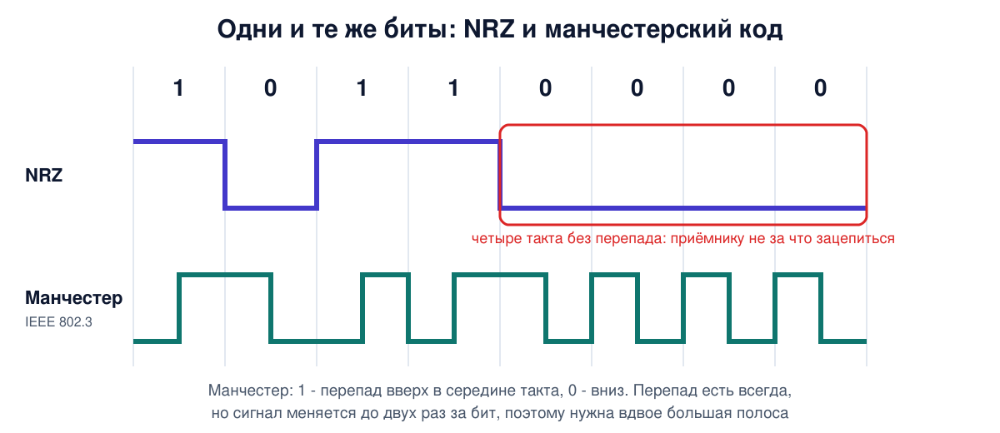
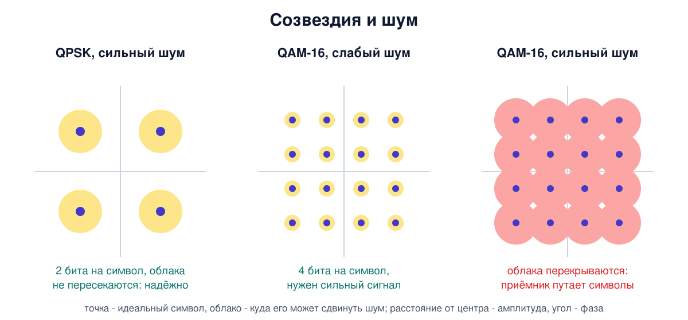
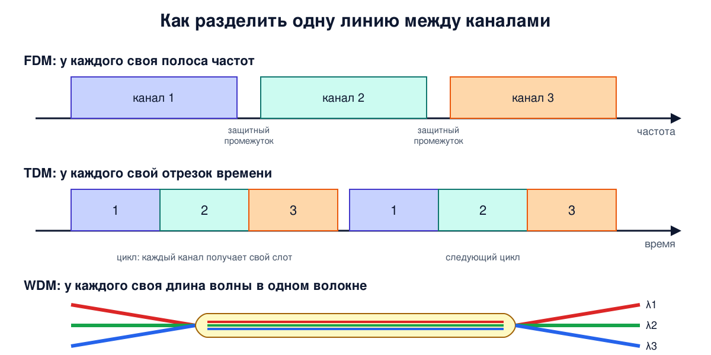

# Урок 10. Кодирование и модуляция: как биты становятся сигналом

В прошлом уроке мы выяснили, что линия ослабляет сигнал, срезает высокие частоты и подмешивает шум. Теперь вопрос с другой стороны: как превратить биты в сигнал, чтобы он пережил всё это и дошёл быстро? Почему гигабитный Ethernet не может просто подавать "есть напряжение - 1, нет - 0"? Почему Wi-Fi рядом с точкой доступа быстрый, а за стеной медленный? И есть ли у скорости линии предел, который никакая инженерия не обойдёт? Есть, и его вывели Найквист и Шеннон задолго до интернета.

## Такт, символ и бод

Передатчик работает **тактами**: через равные промежутки времени он выставляет в линию новое состояние сигнала. Одно такое состояние называют **символом**. Скорость смены символов меряют в **бодах**: 1000 бод - тысяча символов в секунду.

Бод и бит в секунду - не одно и то же. Если сигнал имеет два различимых состояния, каждый символ несёт 1 бит, и скорости совпадают. Если состояний четыре - каждый символ несёт 2 бита (00, 01, 10, 11), и скорость в битах вдвое выше скорости в бодах. Восемь состояний - 3 бита, шестнадцать - 4. Общее правило: символ с V состояниями несёт log₂V бит. Олифер приводит пример модема: 2400 бод и 8 состояний сигнала дают 7200 бит/с.

Бывает и наоборот, когда на один бит приходится несколько смен сигнала. Тогда скорость в бодах выше скорости в битах. Мы сейчас увидим, зачем так делают.

## Чего мы хотим от кода

Способ превращения битов в сигнал называют **линейным кодированием**, если сигнал - уровни напряжения или света, и **модуляцией**, если меняются параметры синусоиды-**несущей**. Олифер и Таненбаум перечисляют, чего хотят от хорошего кода, и эти требования противоречат друг другу:

- **узкий спектр** - чтобы уместиться в полосу линии и передать больше бит на той же линии;
- **синхронизация** - приёмник должен понимать, где кончается один такт и начинается следующий;
- **нет постоянной составляющей** - многие линии (с трансформаторами, как в Ethernet) не пропускают постоянный ток;
- **устойчивость к шуму** и возможность заметить ошибку;
- **малая мощность** передатчика.

## Код NRZ и проблема синхронизации

Самый простой код - **NRZ** (Non Return to Zero): единица - один уровень, ноль - другой. Спектр узкий, реализовать просто. Но представь, что пошли восемь нулей подряд. Сигнал стоит на одном уровне, и приёмник должен по своим часам отсчитать ровно восемь тактов. Часы передатчика и приёмника никогда не идут абсолютно одинаково, и на длинной цепочке приёмник ошибётся: насчитает семь или девять. Таненбаум формулирует это забавно: 15 нулей очень похожи на 16. Заодно длинная цепочка одинаковых битов даёт почти постоянный ток, который линия может не пропустить.

Приёмник подстраивает свои часы по **перепадам** сигнала. Значит, нужен код, в котором перепады бывают часто при любых данных.

## Манчестерский код

**Манчестерский код** кодирует бит не уровнем, а **направлением перепада** в середине такта: по стандарту Ethernet (IEEE 802.3) единица - переход снизу вверх, ноль - сверху вниз. Если идут одинаковые биты подряд, в начале такта добавляется служебный перепад. Сигнал меняется минимум раз за такт, поэтому приёмник легко держит синхронизацию, и постоянной составляющей нет.

Осторожно, в литературе встречаются обе договорённости: у Таненбаума в примере наоборот, ноль - переход снизу вверх. Главное, чтобы передатчик и приёмник договорились одинаково.

Цена - полоса. Каждый такт делится на две половины, поэтому скорость в бодах вдвое выше битовой: 10 Мбит/с классического Ethernet - это 20 миллионов бод, и сигнал меняется до двух раз за бит. Поэтому манчестерский код использовали в классическом Ethernet на 10 Мбит/с, а на больших скоростях от него отказались.



## Избыточные коды и скремблирование

Как получить частые перепады дешевле? Первый приём - **избыточный код**. В коде **4B/5B** каждые 4 бита данных заменяются 5-битной комбинацией по таблице. Из 32 возможных комбинаций выбраны 16 таких, в которых не бывает длинных серий нулей: по Олиферу, на линии не встретится больше трёх нулей подряд. Остальные комбинации запрещены или используются как служебные. Если приёмник получил запрещённую комбинацию, значит, сигнал исказился. Плата - 25% лишних битов: чтобы передать 100 Мбит/с, линия работает на 125 миллионах битов в секунду. Так устроен Fast Ethernet по витой паре.

Чем длиннее блок, тем меньше накладные расходы. Код 8B/10B (гигабитный Ethernet по оптике) тратит те же 25%, а **64B/66B** в 10- и 100-гигабитном Ethernet - около 3%.

Второй приём - **скремблирование**: данные перемешивают с псевдослучайной последовательностью (операция XOR), и они начинают выглядеть как случайный поток, в котором длинные серии одинаковых битов очень маловероятны. Приёмник выполняет обратное преобразование с той же последовательностью. Лишних битов не нужно.

## Много уровней: больше бит за такт

Самый прямой способ передавать быстрее по той же полосе - поднять число различимых состояний. Если вместо двух уровней напряжения использовать четыре, каждый символ несёт 2 бита, и при той же частоте смены символов скорость удваивается. Гигабитный Ethernet по витой паре (1000BASE-T) так и делает: каждая из четырёх пар передаёт 2 бита за символ, 125 миллионов символов в секунду, все пары одновременно и в обе стороны. Уровней напряжения у него пять, а не четыре: лишний уровень - запас для кода, который защищает от ошибок. Таненбаум замечает, что число уровней вовсе не обязано быть степенью двойки.

Но уровни нельзя добавлять бесконечно. Чем их больше, тем ближе они друг к другу, и тем меньший шум уже сдвигает сигнал к соседнему уровню. Олифер подчёркивает именно это: число состояний на практике ограничивает шум.

## Модуляция несущей: ASK, FSK, PSK и QAM

По радио и по телефонной линии нельзя просто подавать уровни напряжения: сигнал должен занимать определённую полосу частот, а не начинаться с нуля. Поэтому берут синусоиду-несущую нужной частоты и меняют её параметры. Отсюда три вида манипуляции:

- **амплитудная** (ASK) - меняют амплитуду;
- **частотная** (FSK) - частоту;
- **фазовая** (PSK) - фазу, то есть сдвиг волны во времени. Две фазы (0° и 180°) - BPSK, 1 бит на символ. Четыре фазы - **QPSK**, 2 бита.

Больше всего бит на символ дают, меняя одновременно и амплитуду, и фазу. Это **квадратурная амплитудная модуляция** (QAM). Состояния удобно рисовать точками на плоскости - **созвездием**: расстояние от центра - амплитуда, угол - фаза. В QAM-16 шестнадцать точек, 4 бита на символ, в QAM-64 - шестьдесят четыре точки и 6 бит, в QAM-256 - 8 бит.

Приёмник видит не точку, а облачко вокруг неё: шум сдвигает каждый принятый символ. Пока облачка не перекрываются, всё хорошо. Точки размечают **кодом Грея**, чтобы соседние отличались одним битом: тогда, если шум всё же сдвинул символ к соседней точке, испортится один бит, а не до четырёх.



Вот и ответ про Wi-Fi. Рядом с точкой доступа сигнал сильный, отношение сигнал/шум высокое, облачка маленькие, и устройство выбирает плотное созвездие с большим числом бит на символ. За стеной сигнал слабее, облачка шире, и приходится переходить на редкие созвездия вроде QPSK. Скорость падает, зато связь не рвётся. Современные Wi-Fi и мобильные сети делают этот выбор постоянно и автоматически.

## Пределы Найквиста и Шеннона

Можно ли, увеличивая число состояний и частоту символов, разогнать любую линию сколько угодно? Нет, и на это есть две классические формулы.

**Найквист** (в 1920-х годах) показал, что по каналу с полосой B герц нет смысла передавать больше 2B символов в секунду: более частые изменения линия просто не пропустит. Отсюда предел для линии **без шума**:

C = 2B · log₂V бит/с,

где V - число различимых состояний. Телефонный канал пропускает примерно от 300 до 3400 Гц, полоса около 3100 Гц. С двумя уровнями по нему нельзя передать больше 6200 бит/с даже без всякого шума.

Но формула Найквиста как будто разрешает бесконечную скорость: просто возьми больше уровней. Её ограничивает шум, и учёл его **Шеннон** (1948):

C = B · log₂(1 + S/N) бит/с,

где S/N - отношение мощности сигнала к мощности шума (в разах, а не в децибелах). Это предел для канала со случайным шумом, и он не зависит от способа кодирования: никакая модуляция не передаст больше. Таненбаум советует относиться к заявлениям о его преодолении с тем же скепсисом, что и к вечным двигателям.

Что следует из формулы Шеннона:

- при том же отношении сигнал/шум скорость растёт **пропорционально полосе**: удвоил полосу - удвоил предел. Поэтому операторы так борются за частоты, а Wi-Fi склеивает каналы в широкие полосы. Но есть подвох: в более широкой полосе собирается и больше шума, и при той же мощности передатчика отношение сигнал/шум падает. При слабом сигнале выигрыш от широкой полосы почти исчезает, а на практике широкий канал хуже бьёт вдаль;
- от мощности сигнала скорость растёт **медленно**, по логарифму. Олифер приводит пример: при отношении сигнал/шум 100 удвоение мощности передатчика даёт всего около 15% прироста.

Формулы работают вместе: Шеннон говорит, сколько бит вообще можно выжать из полосы и шума, а Найквист - сколько для этого нужно уровней при заданной частоте символов.

## Мультиплексирование: одна линия - много каналов

Проложить линию дорого, поэтому её делят между многими потоками. Основные способы:

- **частотное** (FDM) - каждому каналу своя полоса частот, как радиостанциям в эфире. Между каналами оставляют защитные промежутки;
- **волновое** (WDM) - то же самое в оптике: каждый канал идёт на своей длине волны, своим "цветом". Системы плотного WDM (DWDM) передают по одной паре волокон десятки и сотни каналов, в сумме - терабиты в секунду;
- **временное** (TDM) - каналы по очереди получают всю линию на короткий отрезок времени, тайм-слот. В синхронном TDM у каждого канала свой фиксированный слот, даже если ему нечего передать. Так устроена цифровая телефония: 8000 замеров голоса в секунду по 8 бит дают стандартный канал 64 кбит/с;
- **кодовое** (CDMA) - все передают одновременно во всей полосе, но каждый своим кодом, и приёмник выделяет нужный. Таненбаум сравнивает это с залом, где все пары разговаривают одновременно, но на разных языках.

А в Wi-Fi, 4G и 5G используют **OFDM**: полосу делят на множество узких поднесущих, и каждая модулируется своей QAM. Если какие-то частоты испортила помеха или отражения, страдают только их поднесущие.

Пакетная коммутация из урока 4 - тоже временное разделение, только асинхронное: пакеты занимают линию тогда, когда им есть что передать, без закреплённых слотов. Таненбаум замечает, что статистическое TDM - это, по сути, коммутация пакетов под другим названием.



## Как это увидеть в Linux

Посчитаем пределы сами. Сначала Найквист для телефонного канала с двумя и шестнадцатью уровнями:

```
python3 -c 'import math; print(2*3100*math.log2(2), 2*3100*math.log2(16))'
```

```
6200.0 24800.0
```

Теперь Шеннон для трёх каналов: телефонного (3100 Гц, сигнал/шум около 35 дБ, типичные значения - от 30 до 40), линии ADSL из примера Таненбаума (1 МГц, 40 дБ) и одного канала Wi-Fi шириной 20 МГц при 25 дБ. Децибелы переводим в разы: 10 в степени дБ/10.

```
python3 -c 'import math; [print(b, db, round(b*math.log2(1+10**(db/10)))) for b, db in ((3100, 35), (1000000, 40), (20000000, 25))]'
```

```
3100 35 36044
1000000 40 13287857
20000000 25 166187505
```

Около 36 кбит/с для телефонной линии, а при типичных 30-40 дБ предел от 31 до 41 кбит/с. Модемы стандарта V.34, которые работали через обычную аналоговую телефонную линию, дошли до 33,6 кбит/с, то есть работали у самого предела. (Модемы на 56 кбит/с Шеннона не нарушают: такая скорость бывает только в сторону абонента, когда у провайдера цифровая линия и на пути нет второго аналого-цифрового преобразования с его шумом.) Для ADSL - около 13 Мбит/с. Таненбаум пишет, что первые ADSL были рассчитаны на 12 Мбит/с, хотя первый стандарт обычно давал до 8, а 12 - это уже ADSL2. Чтобы идти дальше, ADSL2+ вдвое расширил полосу и дошёл до 24 Мбит/с: по Шеннону это самый прямой путь. А канал Wi-Fi в 20 МГц при хорошем сигнале теоретически даёт до 166 Мбит/с. Это предел для одной пары антенн: несколько антенн (MIMO, урок 19) создают несколько параллельных каналов, и предел считается для каждого. Поэтому современный Wi-Fi и объединяет каналы в полосы по 80 и 160 МГц, и ставит несколько антенн.

И наконец, закодируем байт `10110000` кодом NRZ и манчестерским кодом (по договорённости IEEE 802.3):

```
python3 -c 'b="10110000"; print(" ".join(b)); print(" ".join("+" if x=="1" else "-" for x in b)); print(" ".join("-+" if x=="1" else "+-" for x in b))'
```

```
1 0 1 1 0 0 0 0
+ - + + - - - -
-+ +- -+ -+ +- +- +- +-
```

В строке NRZ последние четыре такта сигнал стоит на месте - приёмнику не за что зацепиться. В манчестерском коде внутри каждого такта есть переход, но и символов вдвое больше.

## Атаки и защита: кодирование - не шифрование

Все способы кодирования из этого урока **открыты и обратимы**. Таблица 4B/5B напечатана в каждой книге по сетям, алгоритмы скремблеров описаны в стандартах, модуляцию Wi-Fi разбирает программно-определяемый радиоприёмник с достаточно широкой полосой. Скремблирование только выглядит как перемешивание: его цель - частые перепады, а не секретность. Не путай кодирование с шифрованием: кодирование делает сигнал удобным для линии, шифрование делает данные бесполезными для чужого. Первое есть на каждой линии, а второе обеспечивают отдельные механизмы: встроенное шифрование в Wi-Fi и мобильных сетях, TLS и VPN (блоки 8-10).

Зато у кодирования бывают свои уязвимости. Таненбаум рассказывает поучительную историю. В ранних стандартах передачи IP-пакетов по каналам SONET телефонных сетей использовался скремблер с короткой, предсказуемой последовательностью. Пользователь мог специально подобрать содержимое пакета так, чтобы после скремблирования получилась длинная цепочка нулей. Приёмник терял синхронизацию, и связь сбоила. Такие "пакеты-убийцы" позволяли обычному пользователю нарушать работу канала для всех. Стандарт исправили в 1999 году (RFC 2615): добавили второй скремблер, состояние которого зависит от уже переданных данных, и подобрать такой пакет стало практически невозможно.

Урок из этой истории выходит далеко за физический уровень: **никогда не рассчитывай, что данные будут "обычными"**. Если на вход системы попадают данные от пользователя, найдётся тот, кто подберёт их так, чтобы сломать систему. Мы ещё встретим этот принцип в атаках на протоколы, парсеры и шифрование.

И вторая угроза, связанная с Шенноном: скорость линии зависит от отношения сигнал/шум, а значит, **помеха снижает скорость, даже не обрывая связь**. Глушилка не обязана полностью забить эфир. Достаточно поднять уровень шума, и устройства сами перейдут на медленные созвездия. Это атака на доступность физического уровня. Частично от неё помогают методы расширения спектра, например скачкообразная перестройка частоты (FHSS) из урока 9, но обычный Wi-Fi против целенаправленного глушения почти беззащитен.

## Итог

- Символ - одно состояние сигнала, бод - символ в секунду. Символ с V состояниями несёт log₂V бит.
- Хороший код: узкий спектр, частые перепады для синхронизации, нет постоянной составляющей, устойчивость к шуму.
- NRZ прост, но теряет синхронизацию на длинных сериях одинаковых битов. Манчестерский код синхронизирует на каждом такте, но требует вдвое большую полосу.
- Избыточные коды (4B/5B, 8B/10B, 64B/66B) и скремблирование дают частые перепады дешевле.
- Больше уровней и точек созвездия - больше бит за символ, но меньше запас на шум. Wi-Fi выбирает созвездие по качеству сигнала.
- Найквист: без шума не больше 2B · log₂V бит/с. Шеннон: с шумом не больше B · log₂(1 + S/N), и это абсолютный предел.
- При том же отношении сигнал/шум скорость растёт пропорционально полосе, а от мощности - лишь логарифмически.
- Мультиплексирование: частотное, волновое (в оптике), временное, кодовое. Пакетная коммутация - асинхронное временное разделение.
- Кодирование не шифрует. А данные от пользователя могут быть подобраны так, чтобы сломать даже физический уровень.

## Что почитать

- Олифер, "Компьютерные сети", глава 6, с. 204-207: скорость в бодах и битах, формулы Шеннона и Найквиста; глава 7, с. 215-239: требования к кодам, NRZ, AMI, манчестерский код, избыточные коды, модуляция и QAM, оцифровка голоса, мультиплексирование FDM, WDM и TDM.
- Таненбаум, "Компьютерные сети", раздел 2.4, с. 143-166: ряды Фурье и ограниченная полоса, пределы Найквиста и Шеннона, линейные коды и скремблирование, модуляция и созвездия, мультиплексирование FDM, OFDM, TDM, CDMA и WDM.
