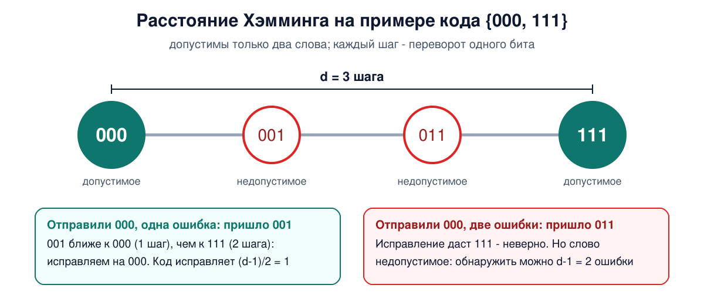
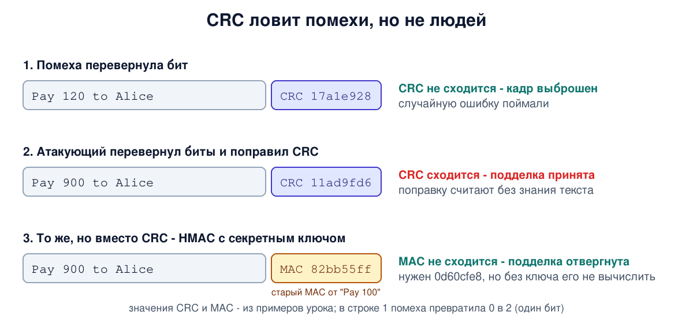

# Урок 11. Обнаружение и исправление ошибок, CRC

Из урока 9 мы знаем, что любая линия иногда портит биты. Значит, получатель должен как-то понять, что кадр пришёл испорченным, а в идеале - ещё и исправить его. Сегодня разберём, как это делают: от одного бита чётности до CRC, который стоит в конце каждого кадра Ethernet и Wi-Fi. А в разделе про безопасность своими руками подделаем сообщение так, что CRC ничего не заметит, даже не зная, что в сообщении написано.

## Две стратегии: заметить или исправить

Обе стратегии держатся на одной идее: к данным добавляют **избыточные** биты, вычисленные из самих данных. Дальше пути расходятся.

- **Обнаружение ошибок.** Получатель пересчитывает контрольные биты и сравнивает. Не совпало - кадр испорчен, его выбрасывают, а при необходимости его передадут заново: сам канальный уровень (как в Wi-Fi) или протокол выше, например TCP. Контрольных битов нужно немного.
- **Исправление ошибок** (FEC, forward error correction, прямая коррекция). Избыточности добавляют столько, что получатель сам вычисляет, какие биты испортились, и чинит их без повторной передачи. Цена - больше лишних битов.

Какую выбрать, зависит от линии. Таненбаум объясняет так: в надёжной линии, например оптической, ошибки редки, и дешевле просто переспросить испорченный кадр. В шумной беспроводной линии ошибок много, и повторная передача испортится с той же вероятностью, что и первая, поэтому выгоднее исправлять на месте. FEC незаменим и там, где переспросить нельзя или долго: в спутниковой связи, на CD и DVD, на физическом уровне магистральных оптических сетей (SDH, OTN).

И ещё одна важная мысль Таненбаума: контрольные биты тоже идут по линии и тоже могут испортиться. Для канала все биты одинаковы. Поэтому ни одна схема не ловит **все** ошибки - она ловит ошибки определённых видов и с определённой вероятностью пропускает остальные.

## Расстояние Хэмминга

Чтобы понять, что умеет код, нужно одно понятие. Возьмём два кодовых слова и посчитаем, в скольких позициях они отличаются. Удобно это делать операцией XOR (исключающее ИЛИ, или сложение по модулю 2): она даёт 1, если биты разные, и 0, если одинаковые. Применим XOR к словам побитно и посчитаем единицы. Это **расстояние Хэмминга** между ними. Например, 10001001 и 10110001 отличаются в трёх битах.

Код устроен так, что из всех возможных комбинаций битов лишь некоторые **допустимы**. Минимальное расстояние между допустимыми словами - расстояние Хэмминга всего кода, обозначим его d. Из него следует всё:

- код **обнаруживает** до d - 1 ошибок: меньшим числом переворотов одно допустимое слово в другое не превратить, и получатель видит недопустимую комбинацию;
- код **исправляет** до (d - 1) / 2 ошибок (с округлением вниз): испорченное слово всё ещё ближе к исходному, чем к любому другому допустимому.

Это либо одно, либо другое: один и тот же код нельзя одновременно использовать для исправления максимального числа ошибок и для обнаружения максимального числа.



## Бит чётности

Самый простой код: к данным добавляют один бит так, чтобы число единиц стало чётным. Данные 1011010 содержат четыре единицы, добавляем 0: получается 10110100. Если по пути перевернётся любой один бит, единиц станет нечётное число, и получатель это заметит.

Расстояние Хэмминга такого кода равно 2: обнаруживает одну ошибку, исправить не может. А две ошибки сразу он пропустит, потому что чётность вернётся. Если ошибки идут пачкой (а в реальных линиях помеха обычно портит несколько соседних битов подряд), бит чётности поймает её лишь с вероятностью 1/2. Олифер отмечает, что в компьютерных сетях этот метод почти не используют.

## Коды, которые исправляют

**Код Хэмминга** расставляет несколько битов чётности так, что каждый проверяет свою группу позиций. По тому, какие проверки не сошлись, получатель вычисляет номер испорченного бита и переворачивает его обратно. Расстояние такого кода 3: исправляет одну ошибку. Коды Хэмминга с дополнительным битом чётности работают в памяти с коррекцией ошибок (ECC): такой код исправляет одну ошибку и замечает две.

Для сетей Таненбаум называет более мощные коды:

- **сверточные** - выход зависит от текущего и нескольких предыдущих входных битов. Один такой код впервые применили на зонде "Вояджер" в 1977 году, и он до сих пор работает в Wi-Fi;
- **Рида - Соломона** - работают не с битами, а с целыми байтами и хорошо исправляют пачки ошибок: испорченный байт - одна ошибка, сколько бы бит в нём ни перевернулось. Отсюда их популярность в DSL, спутниковой связи и на дисках, где царапина уничтожает сразу много байтов подряд;
- **LDPC** - коды с малой плотностью проверок чётности, придуманные в 1962 году и забытые до 1990-х. Сегодня они в новых версиях Wi-Fi, 10-гигабитном Ethernet по витой паре, цифровом телевидении.

## Контрольная сумма

Под контрольной суммой часто понимают любые проверочные биты, но в узком смысле это именно **сумма** слов сообщения. Такую 16-битную сумму используют IPv4 (только для заголовка), TCP и UDP (урок 6): данные режут на 16-битные слова и складываются в особой арифметике с переносом старшего разряда обратно в младший.

Она проста и быстро считается программно, но слаба. Сумма не зависит от порядка слагаемых, поэтому если слова по пути поменялись местами, сумма не изменится. Это видно и в практике ниже. Таненбаум добавляет, что реальные данные далеко не случайны, и такие необнаруженные ошибки проскальзывают чаще, чем обещают расчёты. Поэтому на канальном уровне используют более надёжный метод.

## CRC

**Циклический избыточный код** (CRC, cyclic redundancy check) - главный метод обнаружения ошибок в сетях. Идея, если убрать математику:

1. Отправитель и получатель заранее договорились о **делителе** - специальном двоичном числе (его называют образующим многочленом).
2. Весь кадр рассматривается как одно огромное двоичное число. Кадр Ethernet длиной 1024 байта - это число из 8192 бит.
3. Отправитель делит его на делитель, но в особой арифметике, где вместо вычитания XOR и нет переносов. **Остаток** от деления и есть CRC, его дописывают в конец кадра.
4. Получатель делит принятое вместе с CRC на тот же делитель. Остаток ноль - ошибок не обнаружено. Не ноль - кадр испорчен. (В реальном CRC-32 к расчёту добавлены начальное значение и финальная инверсия, поэтому вместо нуля получается фиксированная константа, но смысл тот же.)

В Ethernet и Wi-Fi используют 32-битный CRC (CRC-32), это то самое поле FCS из урока 6. Что он гарантированно ловит:

- все одиночные, двойные и тройные ошибки в кадрах обычной длины: расстояние Хэмминга CRC-32 для них равно 4;
- все пачки ошибок длиной до 32 бит;
- более длинные пачки пропускает с вероятностью порядка одной на несколько миллиардов (по Таненбауму, если все комбинации ошибок равновероятны).

Осторожно: обе книги пишут, что CRC ловит и все ошибки в нечётном числе битов. Это верно только для делителей особого вида (делящихся на x + 1), а делитель стандартного CRC-32 не такой. Например, если перевернуть в кадре ровно 15 бит, совпадающих с самим делителем, CRC-32 этого не заметит.

При этом CRC-32 - всего 4 байта, для кадра в 1024 байта это 0,4% накладных расходов. А считается он простой схемой из сдвигового регистра и XOR, поэтому сетевые карты вычисляют и проверяют его аппаратно, на полной скорости линии. Если CRC не сошёлся, карта молча выбрасывает кадр и увеличивает счётчик ошибок, в том числе `RX errors` из урока 3.

Обрати внимание: на уровне кадра Ethernet ошибку только **обнаруживает**. Быстрые варианты Ethernet дополнительно исправляют ошибки на физическом уровне (FEC, например LDPC в 10-гигабитном Ethernet по витой паре), но кадр, у которого не сошёлся CRC, просто выбрасывается. Сам Ethernet повторять его не будет: потерю заметит и восполнит TCP (уроки 39-40), если он есть.

## Как это увидеть в Linux

Все примеры - однострочники на Python, который есть почти в любом Linux.

**Расстояние Хэмминга** между 10001001 и 10110001:

```
python3 -c 'a=0b10001001; b=0b10110001; x=a^b; print(format(x,"08b"), bin(x).count("1"))'
```

```
00111000 3
```

XOR оставляет единицы ровно там, где биты различаются, и их три.

**Бит чётности** для 1011010:

```
python3 -c 'd="1011010"; print(d + str(d.count("1") % 2))'
```

```
10110100
```

**CRC-32** двух сообщений, которые отличаются одним символом. Модуль `zlib` считает тот же CRC-32, что и Ethernet (значение то же, только в кадре его 4 байта записаны в обратном порядке):

```
python3 -c 'import zlib; print(format(zlib.crc32(b"Pay 100 to Alice"), "08x")); print(format(zlib.crc32(b"Pay 900 to Alice"), "08x"))'
```

```
17a1e928
11ad9fd6
```

Одна цифра в сообщении - и CRC совершенно другой. Случайная ошибка будет замечена.

**Слабость простой суммы.** Посчитаем интернет-контрольную сумму двух сообщений, где 16-битные слова переставлены местами:

```
cat > cs.py <<'EOF'
def cs(b):
    s = sum(int.from_bytes(b[i:i+2], "big") for i in range(0, len(b), 2))
    while s >> 16:
        s = (s & 0xffff) + (s >> 16)
    return format(~s & 0xffff, "04x")
print(cs(b"ABCD"), cs(b"CDAB"))
EOF
python3 cs.py
```

```
7b79 7b79
```

Данные разные, сумма одна: перестановку слов контрольная сумма не видит. CRC бы её заметил.

## Атаки и защита: почему CRC не защищает от злоумышленника

Урок 3 уже предупреждал: контрольная сумма защищает от случайных помех, но не от человека. Тот, кто подменил данные, просто пересчитает CRC: алгоритм открыт, секретов в нём нет. Но с CRC всё ещё хуже. Его можно исправить, **даже не зная, что написано в сообщении**.

Всё дело в том, что CRC **линеен** относительно XOR. Если перевернуть в сообщении какие-то биты, CRC изменится предсказуемо, и это изменение зависит только от того, **какие** биты перевернули, а не от самого сообщения. Проверим. Атакующий не видит сообщения, но знает его формат: на месте суммы стоит цифра, и он хочет превратить "1" в "9". В кодах ASCII это XOR с 0x08 в пятом байте. Поправку к CRC он вычисляет только из своей маски изменений:

```
cat > flip.py <<'EOF'
import zlib
m = b"Pay 100 to Alice"            # сообщение, которого атакующий не видит
crc = zlib.crc32(m)
d = bytes(4) + b"\x08" + bytes(11)  # что поменять: '1' xor 0x08 = '9' в позиции 4
fix = zlib.crc32(d) ^ zlib.crc32(bytes(len(d)))
m2 = bytes(a ^ b for a, b in zip(m, d))
print(m2.decode(), format(crc ^ fix, "08x"), format(zlib.crc32(m2), "08x"))
EOF
python3 flip.py
```

```
Pay 900 to Alice 11ad9fd6 11ad9fd6
```

Сообщение превратилось в "Pay 900 to Alice", а поддельный CRC (старый CRC, исправленный поправкой) совпал с настоящим. Получатель проверит CRC и примет подделку. Переменная `m` в скрипте нужна только чтобы показать результат: сама поправка `fix` вычислена без неё.



Это не игрушечный пример. Это одна из дыр **WEP**, первой защиты Wi-Fi (урок 20). WEP шифровал кадр вместе с CRC потоковым шифром, где шифрование - это тоже XOR с ключевым потоком. Переворот бита в зашифрованном кадре переворачивает тот же бит в расшифрованном, а CRC, как мы видели, исправляется без знания содержимого. Атакующий мог менять зашифрованные кадры, и WEP этого не замечал. Исследователи Борисов, Голдберг и Вагнер показали это в 2001 году. Окончательно WEP добили атаки, восстанавливающие сам ключ шифрования, но о них - в уроке 20.

Вывод: **CRC и контрольные суммы - защита от природы, а не от людей.** От намеренной подмены защищает код аутентификации сообщения (MAC), который вычисляется с секретным ключом, например HMAC:

```
python3 -c 'import hmac, hashlib; print(hmac.new(b"secret-key", b"Pay 100 to Alice", hashlib.sha256).hexdigest()); print(hmac.new(b"secret-key", b"Pay 900 to Alice", hashlib.sha256).hexdigest())'
```

```
82bb55ffa9544de595317551611922dc553f8bc501b365618bf7ad712b5f4785
0d60cfe87355fa95f2bf65125fad01c6401283feb23d31ec2e091656f85977f6
```

Без ключа атакующий не может вычислить правильный код для изменённого сообщения, и никакой линейной поправки здесь нет. Как это устроено, разберём в уроке 70, а в современных протоколах вроде TLS 1.3 и WireGuard шифрование и проверка целостности вообще объединены в одну операцию (AEAD, урок 69).

## Итог

- К данным добавляют избыточные биты. Обнаружение ошибок - мало лишних битов, испорченное выбрасывают. Исправление (FEC) - больше лишних битов, чинят на месте. Надёжные линии обнаруживают, шумные исправляют.
- Расстояние Хэмминга d: код обнаруживает d - 1 ошибок или исправляет (d - 1) / 2 с округлением вниз.
- Бит чётности ловит одну ошибку и пропускает две. Коды Хэмминга исправляют одну ошибку. Сверточные, Рида - Соломона и LDPC работают в Wi-Fi, DSL, спутниках, на дисках.
- Интернет-контрольная сумма IPv4, TCP, UDP проста, но не видит, например, перестановку слов.
- CRC-32 в Ethernet и Wi-Fi ловит все одиночные, двойные и тройные ошибки и все пачки до 32 бит, считается аппаратно. Кадр с несошедшимся CRC Ethernet выбрасывает.
- CRC линеен: злоумышленник исправит его даже без знания содержимого. Это одна из дыр WEP. От подмены защищает только криптографическая проверка с ключом: MAC (HMAC), AEAD, цифровая подпись.

## Что почитать

- Олифер, "Компьютерные сети", глава 7, с. 229-231: контрольная сумма и контроль по паритету, CRC, прямая коррекция ошибок, расстояние Хэмминга.
- Таненбаум, "Компьютерные сети", раздел 3.2, с. 252-266: стратегии борьбы с ошибками, расстояние Хэмминга, коды Хэмминга, сверточные, Рида - Соломона и LDPC, чётность и чередование, контрольная сумма интернета, CRC.
