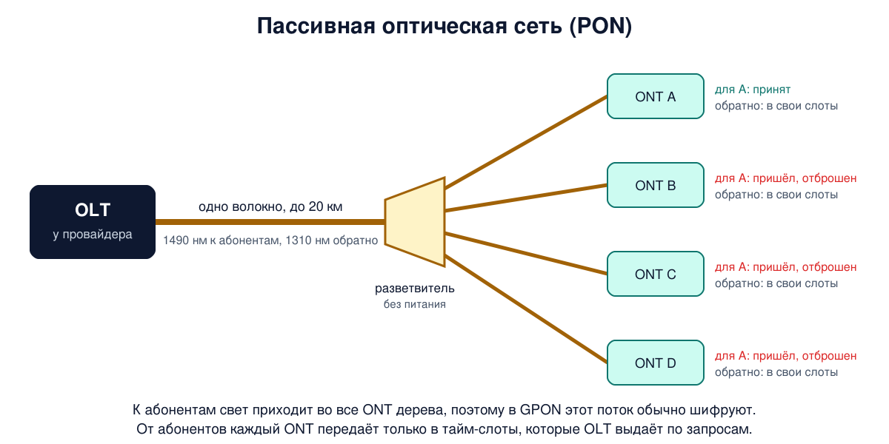
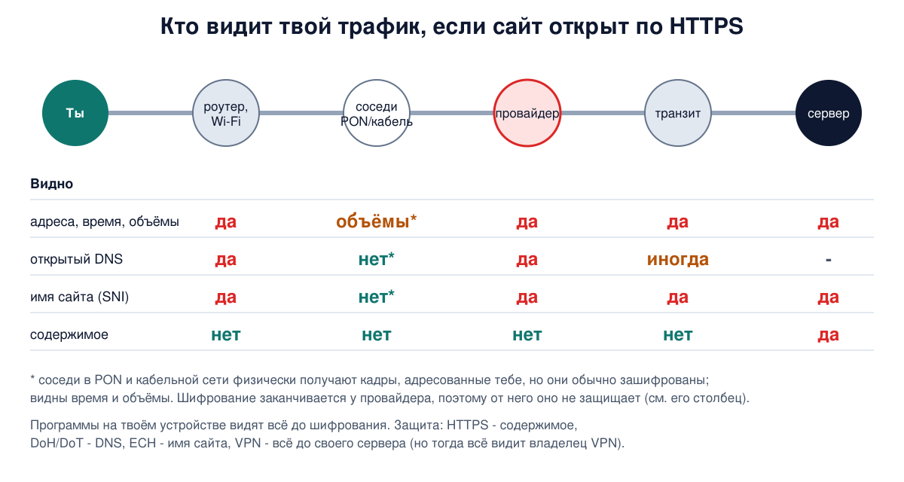

# Урок 12. Как вы подключены к интернету: DSL, PON, кабель, мобильная связь

Магистрали интернета давно оптические и очень быстрые. Самое трудное место - **последняя миля**: участок от ближайшего узла провайдера до твоей квартиры. Проложить новый кабель в каждый дом дорого, поэтому десятилетиями провайдеры выжимали всё из того, что уже было проложено: телефонной пары, телевизионного коаксиала, радиоэфира. Сегодня разберём, как устроены основные технологии доступа, почему у одних соседи влияют на твою скорость, а у других нет, и главное для безопасности - кто на этом пути видит твой трафик.

## Коммутируемый доступ: модем в телефонной линии

Самый старый способ: модем звонит по обычному телефону на модемный пул провайдера, и данные идут внутри голосового канала. Телефонная сеть отводит на разговор полосу примерно от 300 до 3400 Гц, и из урока 10 мы знаем, что по Шеннону это даёт потолок около 35 кбит/с. Модемы стандарта V.34 и его доработки V.34+ дошли до 33,6 кбит/с. Модемы V.90 давали до 56 кбит/с, но только в сторону абонента. Олифер объясняет это так: у провайдера линия цифровая, и к абоненту сигнал идёт вообще без аналого-цифрового преобразования, только с цифро-аналоговым на ближней к абоненту станции. А аналого-цифровое преобразование искажает сигнал гораздо сильнее. В обратную сторону оно остаётся, и там предел прежний - 33,6 кбит/с.

Главный вывод отсюда: медная пара сама по себе способна на гораздо большее, её ограничивал фильтр голосового канала. Этим и воспользовался DSL.

## DSL: та же пара, другие частоты

**ADSL** (асимметричная цифровая абонентская линия) использует ту же телефонную пару, но работает только на участке от квартиры до станции и не проходит через голосовые фильтры. Вместо 3100 Гц в распоряжении модема оказывается около 1 МГц, а в ADSL2+ - 2,2 МГц.

Как это устроено:

- **разделитель** (сплиттер) в квартире отделяет низкие частоты для телефона от высоких для данных, поэтому можно одновременно разговаривать и быть в интернете;
- на станции провайдера стоит **DSLAM** - по сути, стойка из множества ADSL-модемов, по одному на абонента. Он превращает сигнал в пакеты и отправляет их в сеть провайдера;
- в ADSL полосу 1,1 МГц делят на 256 узких каналов по 4312,5 Гц (в ADSL2+ их вдвое больше). Это та самая идея OFDM из урока 10, в DSL её называют DMT. Модем постоянно измеряет качество каждого канала и нагружает его битами по отношению сигнал/шум: хороший канал несёт до 15 бит на символ, плохой - 1-2 или не используется вовсе;
- большую часть каналов отдают на приём, меньшую - на передачу. Отсюда "асимметричная": скачивать быстрее, чем отдавать.

Главное ограничение DSL - **расстояние**. Затухание в медной паре растёт с длиной и частотой (урок 9), поэтому чем дальше дом от станции, тем меньше рабочих каналов и ниже скорость. По Таненбауму, первый стандарт ADSL (1999) давал до 8 Мбит/с к абоненту, ADSL2 - до 12, ADSL2+ - до 24 Мбит/с, а VDSL2 на коротких линиях разгоняется до 200 Мбит/с.

Поэтому провайдеры тянут оптику всё ближе к дому, а медь оставляют только на последнем коротком участке. Это семейство называют **FTTx** (fiber to the x): до уличного шкафа (FTTN, FTTC), до здания (FTTB) или до самой квартиры (FTTH).

У DSL есть важное свойство: каждая квартира подключена **своей** парой до DSLAM. Сосед, качающий фильмы, твою линию не занимает (хотя общий канал от DSLAM в сеть провайдера, конечно, делят все).

## PON: оптика с пассивными разветвителями

Провести отдельное волокно от станции до каждой квартиры дорого. **Пассивная оптическая сеть** (PON) решает это деревом:

- на станции провайдера стоит **OLT** (optical line terminal) - центральный терминал;
- от него идёт одно волокно к **разветвителю** (сплиттеру). Это пассивная стекляшка без питания: она делит свет из одного волокна на 16, 32 или больше, и её можно поставить в подвале или на столбе;
- в квартире стоит **ONT** (optical network terminal), та самая "оптическая коробочка" от провайдера.

По одному волокну свет идёт в обе стороны на разных длинах волн: 1490 нм к абоненту, 1310 нм от абонента, и иногда 1550 нм для телевидения (волновое мультиплексирование из урока 10). Расстояние от OLT до абонентов - до 20 км.

Самое интересное с точки зрения сетей - что PON **разделяемая среда**:

- **к абоненту** OLT шлёт кадры, и пассивный разветвитель доставляет свет **во все** квартиры дерева. Каждый ONT принимает только своё, а чужое отбрасывает. Отбрасывает - потому что так настроен, а физически чужие кадры к нему приходят. Поэтому в GPON стандарт предусматривает шифрование потока к абонентам (обычно оно включено), а в EPON шифрование зависит от производителя;
- **от абонентов** все ONT светят в одно волокно к OLT, и если заговорят одновременно, сигналы смешаются. Друг друга ONT при этом не слышат: разветвитель направляет их свет только к OLT. Поэтому OLT по запросам раздаёт ONT **тайм-слоты** (временное разделение, урок 10), и каждый ONT передаёт только в свои.

Самые распространённые стандарты - GPON от ITU-T (2,5 Гбит/с к абонентам и 1,25 Гбит/с обратно, одни на всё дерево) и EPON от IEEE (1 Гбит/с в обе стороны), а также их 10-гигабитные версии XG-PON и 10G-EPON.



## Кабельный интернет: DOCSIS

Сети кабельного телевидения изначально были односторонними: головная станция раздаёт каналы всем домам по общему коаксиалу. Сегодня это гибридные оптико-коаксиальные сети (HFC): оптика доходит до **оптического узла** в районе, а дальше коаксиал обходит сотни домов.

Интернет по такой сети передают по стандартам **DOCSIS**. Данные к абонентам занимают телевизионные частотные каналы (частотное разделение), а обратное направление - отдельную низкочастотную полосу. Модемы передают в сеть по очереди, в мини-слоты, которые распределяет головная станция (CMTS). Каждый модем сначала измеряет расстояние до неё, чтобы его передачи попадали точно в свой слот. DOCSIS 3.0 объединяет несколько каналов и даёт сотни мегабит, DOCSIS 3.1 с OFDM - больше гигабита.

И здесь среда **общая**: все дома узла делят один кабель. Если соседи вечером смотрят видео, скорость падает у всех. Операторы лечат это, дробя узлы: по Таненбауму, типичный узел сократился с 500-2000 домов до 300-500, а местами и до 70.

## Мобильная связь

Сотовая сеть делит территорию на **соты**, у каждой - базовая станция. В первых поколениях соседние соты работали на разных частотах, а далёкие использовали одни и те же, так эфир переиспользуется много раз. В CDMA, LTE и 5G соседние соты обычно работают даже на одной частоте, а помехи между ними гасят другими способами. Когда телефон переходит из соты в соту, сеть передаёт его новой станции (handover), стараясь не оборвать соединение.

Поколения кратко:

- **2G** (GSM) - цифровой голос, SMS и медленные данные;
- **3G** - голос и данные, передача данных по коммутации пакетов;
- **4G** (LTE) - сеть целиком на коммутации пакетов, даже голос передаётся как IP (VoLTE). Ядро сети LTE Таненбаум описывает как упрощённую IP-сеть;
- **5G** - мелкие соты, миллиметровые волны с огромной полосой, но плохим проникновением, массивы антенн (massive MIMO) и меньшая задержка.

Для нас важен один элемент ядра 4G, **P-GW** (шлюз в пакетную сеть). Это точка, где твой трафик выходит из мобильной сети в интернет. По Таненбауму, P-GW выдаёт адреса, ограничивает скорость, фильтрует трафик, выполняет углублённый анализ пакетов и правомерный перехват. В 5G эту роль выполняет узел UPF. Запомни: весь твой мобильный трафик проходит через одну точку, принадлежащую оператору.

## Спутники

**Геостационарный** спутник висит над одной точкой на высоте около 36 000 км. Сигнал проходит путь до спутника и обратно на землю за 250-300 мс, и запрос с ответом через такой спутник занимает больше полусекунды: онлайн-игры и звонки страдают. **Низкоорбитальные** спутники летают на высоте в сотни километров, и время туда и обратно у них, по Таненбауму, 40-150 мс. Зато их нужно очень много, ведь каждый быстро уходит за горизонт. Так устроены современные спутниковые сети вроде Starlink.

## Сравнение

| Технология | Среда | Общая с соседями? | Главное ограничение |
|---|---|---|---|
| DSL | своя медная пара до DSLAM | нет | расстояние до станции |
| PON (FTTH) | оптика, общее дерево | да, одно волокно на дерево | делится на всех абонентов дерева |
| Кабель (DOCSIS) | оптика + общий коаксиал | да, весь узел | вечерняя загрузка узла |
| Мобильная | радио, сота | да, вся сота | сигнал, загрузка соты |
| Спутник | радио | да, луч спутника | задержка, погода |

## Как это увидеть в Linux

Все выводы сняты на нашем сервере, публичные адреса заменены на учебные. Команды с `sudo` лучше запускать после `sudo -v`: так sudo заранее спросит пароль, и фоновая команда не остановится в ожидании ввода.

**Первые шаги пакета наружу.** Шлюз по умолчанию - первый узел, через который уходит весь трафик:

```
ip route show default
```

```
default via 10.0.0.1 dev enp0s3 onlink
```

(`onlink` значит, что шлюз считается доступным напрямую через интерфейс, даже если его адрес не входит в подсеть этого интерфейса.) А дальше посмотрим первые узлы пути:

```
tracepath -n -m 4 1.1.1.1
```

```
 1?: [LOCALHOST]                      pmtu 1500
 1:  10.0.0.1                                              0.343ms
 1:  10.0.0.1                                              0.100ms
 2:  10.0.0.1                                              0.092ms pmtu 1456
 2:  100.127.35.177                                        0.592ms
 3:  100.64.120.8                                          1.252ms
 4:  100.64.80.55                                          1.173ms asymm  3
     Too many hops: pmtu 1456
     Resume: pmtu 1456
```

Узел 10.0.0.1 - шлюз хостинга. Следующие адреса лежат в диапазоне 100.64.0.0/10 (от 100.64 до 100.127). Стандарт RFC 6598 выделил его для NAT операторского уровня (урок 58), но провайдеры используют его и для адресов своих маршрутизаторов. Здесь именно такой случай: у самого сервера публичный адрес, никакого NAT нет. Так что адрес 100.x в трассировке ещё не значит, что ты за NAT провайдера. `pmtu 1456` - на пути оказался участок, который пропускает пакеты не больше 1456 байт (урок 27), а `asymm 3` - ответ от узла 4, судя по его TTL, вернулся другим путём, за 3 узла: маршруты туда и обратно могут различаться. `Too many hops` - мы сами ограничили трассировку четырьмя узлами. На сервере первые строки - это сеть хостинга, а дома на их месте будут твой роутер (обычно 192.168.x.x), а за ним сеть доступа и сеть провайдера. Через них проходит **каждый** твой пакет.

**Что видит наблюдатель на пути.** Запустим захват пакетов и одновременно спросим DNS-сервер адрес сайта:

```
sudo -v
sudo timeout 6 tcpdump -i any -n -A -c 2 'udp port 53 and host 1.1.1.1' &
sleep 1
dig +short example.com @1.1.1.1
```

```
13:24:34.734175 enp0s3 Out IP 192.0.2.10.37107 > 1.1.1.1.53: 65222+ [1au] A? example.com. (52)
E..P.*..@.R............5.<@.... .........example.com.......).........
13:24:34.775106 enp0s3 In  IP 1.1.1.1.53 > 192.0.2.10.37107: 65222 2/0/1 A 203.0.113.243, A 203.0.113.154 (72)
```

Вывод сокращён. Флаги: `-i any` - слушать все интерфейсы, `-n` - не превращать адреса в имена, `-c 2` - остановиться после двух пакетов, `-A` - печатать содержимое пакета как текст (непечатаемые байты становятся точками), `timeout` - страховка, если пакетов не будет, `&` - запустить в фоне, `sleep 1` - дать tcpdump время начать захват. Имя `example.com` видно прямо в пакете: обычный DNS (урок 63) передаётся открытым текстом, и любой узел на пути знает, какие сайты ты открываешь. (Точки в имени здесь тоже непечатаемые байты: в DNS-пакете имя хранится как длины частей и сами части, урок 63.)

А теперь откроем тот же сайт по HTTPS и поищем его имя в первых пакетах соединения:

```
sudo timeout 8 tcpdump -i any -n -A 'tcp dst port 443' > sni.txt &
sleep 1
curl -s -o /dev/null https://example.com
wait
grep -a -o 'example\.com' sni.txt
```

```
example.com
```

Здесь tcpdump работает ровно 8 секунд и пишет все исходящие пакеты на порт 443 (без `-c`: на компьютере с открытым браузером чужие пакеты иначе быстро исчерпали бы лимит). Файл `sni.txt` создаёт твоя оболочка в текущем каталоге, потом его можно удалить. `wait` дожидается окончания tcpdump, чтобы он успел всё записать. Флаг `-n` здесь важен: без него tcpdump мог бы сам вписать имена в заголовки, а нам нужно найти имя именно внутри данных. Содержимое HTTPS зашифровано, но имя сайта всё равно нашлось: клиент (браузер или curl) отправляет его открытым текстом в самом первом сообщении TLS, в поле SNI. Зачем и что с этим делают, разберём в уроках 80 и 82.

## Атаки и защита: кто и где видит твой трафик

Теперь соберём всё вместе. Пакет от твоего телефона или ноутбука до сайта проходит через несколько участков, и на каждом есть свой наблюдатель.



- **Твоё устройство и программы на нём** видят всё, до шифрования. Вредоносная программа или "бесплатный VPN" с доступом к трафику сильнее любого провайдера.
- **Локальная сеть и Wi-Fi.** Владелец роутера видит адреса, объёмы, открытые DNS-запросы и имена сайтов из SNI, а в открытом или плохо защищённом Wi-Fi соседи видят и незашифрованное содержимое (урок 20).
- **Сеть доступа.** В PON и кабельных сетях кадры, адресованные тебе, физически приходят и к соседям. Поэтому данные на этом участке обычно шифруют: в GPON - поток к абонентам, в DOCSIS - оба направления. Но сосед с изменённым оборудованием всё равно видит время и объёмы, а Таненбаум формулирует главное: если сосед видит только зашифрованные данные, это всё равно хуже, чем если бы он не видел их вообще. И важно: это шифрование заканчивается на оборудовании провайдера (OLT, головная станция), поэтому от самого провайдера оно не защищает.
- **Провайдер** - главный наблюдатель. Через его сеть проходят все твои пакеты: он видит IP-адреса, с кем и когда ты общаешься, объёмы, открытые DNS-запросы и имена сайтов из SNI. Как правило, по закону он обязан обеспечивать правомерный перехват, а оборудование углублённого анализа пакетов (DPI, урок 88) распознаёт протоколы и приложения даже в зашифрованном трафике.
- **Мобильный оператор** видит то же самое через P-GW. В старых сетях 2G есть и особая угроза: там телефон доказывает сети, кто он, а сеть телефону - нет. Поэтому злоумышленник с поддельной базовой станцией может заставить телефоны подключиться к себе и даже отключить шифрование. В 3G и 4G появилась взаимная аутентификация, но часть служебных сообщений до аутентификации не защищена, и атакующие иногда вынуждают телефон откатиться на 2G.
- **Транзитные сети и точки обмена трафиком** видят адреса, объёмы и имя сайта из SNI, а если DNS-сервер находится за пределами провайдера, то и открытые DNS-запросы.
- **Сервер назначения** видит всё, что ты ему отправил, и твой IP-адрес.

Что с этим делать:

- **шифрование на концах** (HTTPS, TLS) закрывает содержимое от всех посредников, но не адреса, не время и не объёмы;
- **шифрованный DNS** (DoH, DoT, урок 67) убирает имена сайтов из открытых DNS-запросов, но теперь их видит сервис шифрованного DNS. А **ECH** (урок 82) прячет и SNI;
- **VPN** (блок 10) шифрует всё до своего сервера. Провайдер видит только, что ты общаешься с VPN-сервером, но теперь всё видит владелец VPN, а путь через VPN-сервер добавляет задержку. Доверие не исчезает, а переносится.

Это и есть модель нарушителя из урока 8 в действии: прежде чем выбирать защиту, ответь, от кого именно ты защищаешься и где он сидит.

## Итог

- Последняя миля - самый дорогой и медленный участок. Провайдеры используют уже проложенные телефонные пары, коаксиал и эфир и тянут оптику всё ближе к дому (FTTx).
- Модем в голосовом канале упирается в предел Шеннона около 35 кбит/с. DSL работает на той же паре, но на высоких частотах до DSLAM: ADSL до 8, ADSL2+ до 24 Мбит/с, VDSL2 до 200 Мбит/с на коротких линиях. Скорость падает с расстоянием.
- PON: OLT, пассивный разветвитель, ONT. К абонентам свет идёт во все квартиры дерева (в GPON поток обычно шифруют), от абонентов - по тайм-слотам, которые раздаёт OLT. GPON, EPON и их 10-гигабитные версии.
- Кабельный интернет (DOCSIS): общий коаксиал на узел, мини-слоты от головной станции, скорость зависит от загрузки узла.
- Мобильные сети: соты и переиспользование частот, 4G и 5G целиком на IP, весь трафик выходит через шлюз оператора.
- Спутники: геостационарные - больше полусекунды на запрос и ответ, низкоорбитальные - 40-150 мс туда и обратно.
- Трафик видят провайдер, сеть доступа, транзит и сервер. HTTPS прячет содержимое, но не адреса, объёмы и часто имя сайта. От кого защищаться - решает модель нарушителя.

## Что почитать

- Олифер, "Компьютерные сети", глава 19, с. 615-627: проблема последней мили, коммутируемый доступ и модемы, ADSL, пассивные оптические сети.
- Таненбаум, "Компьютерные сети", разделы 2.5-2.9, с. 166-227: телефонная сеть, модемы, DSL и FTTx, сотовые сети от 1G до 5G, кабельные сети и DOCSIS, спутники связи, сравнение сетей доступа.
