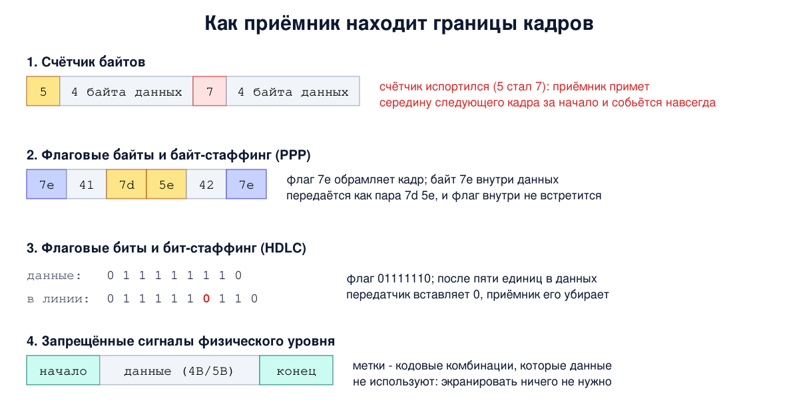
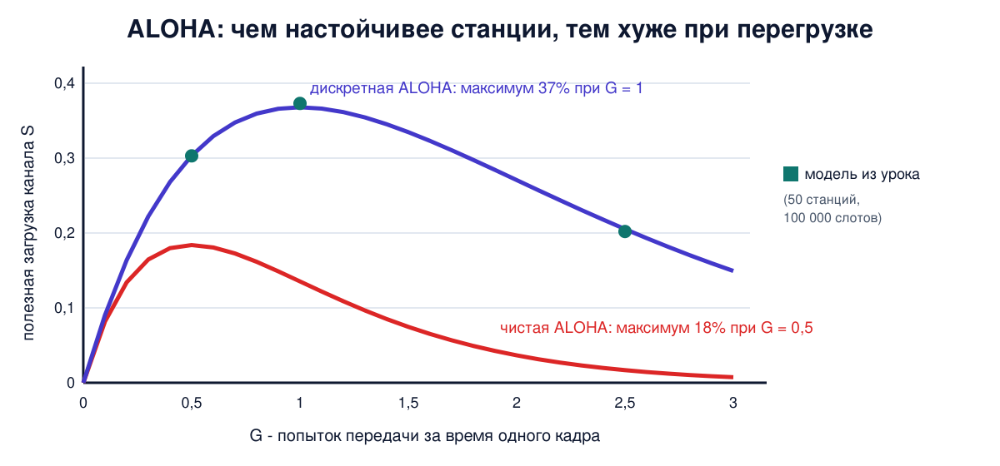

# Урок 13. Задачи канального уровня: кадры и доступ к среде

Физический уровень умеет одно: передавать поток битов, иногда с ошибками. Но биты сами по себе ничего не значат. Получателю нужно понять, где начинается и заканчивается порция данных, не испортилась ли она и кому предназначена. А если к одной среде подключено много устройств, нужно ещё договориться, кто и когда говорит. Всем этим занимается **канальный уровень**. Сегодня разберём его задачи в общем виде, а в следующих уроках увидим, как их решают Ethernet и Wi-Fi.

## Что делает канальный уровень

Таненбаум перечисляет основные задачи:

- дать сетевому уровню понятную службу: "доставь этот пакет соседу";
- **разбить поток битов на кадры** (фреймы) и найти их границы на приёме;
- **обнаружить ошибки**, а если нужно, исправить или переспросить (урок 11);
- **управлять потоком**: не дать быстрому отправителю завалить медленного получателя.

А там, где среда общая, добавляется ещё одна задача - **управление доступом к среде**. Её решает отдельный подуровень MAC (medium access control). Отсюда и название MAC-адреса: это адреса именно этого подуровня (урок 15).

Пакет сетевого уровня упаковывают в кадр: спереди **заголовок**, сзади **концевик** с контрольной суммой. Кадр живёт только на одном звене, от соседа до соседа. На каждом маршрутизаторе пакет вынимают из кадра и упаковывают в новый, для следующего звена (урок 6).

## Три вида службы

Канальный уровень может предлагать разную надёжность:

- **без подтверждений и без соединения.** Отправил кадр и забыл. Потерялся - канальный уровень ничего не делает, пусть разбираются уровни выше. Так работает Ethernet: в проводе ошибок мало, и тратить время на подтверждения невыгодно;
- **с подтверждениями, без соединения.** Каждый адресный кадр подтверждается, и если подтверждение не пришло, кадр отправляют снова. Так работает Wi-Fi: в радиоэфире потери обычное дело, и исправлять их быстрее прямо на месте, чем ждать, пока заметит TCP;
- **с подтверждениями и соединением.** Кадры нумеруются, доставляются ровно один раз и по порядку. Нужно на длинных ненадёжных каналах вроде спутниковых.

Таненбаум подчёркивает важную мысль: подтверждения на канальном уровне - это оптимизация, а не обязанность. Надёжность всё равно может обеспечить транспортный уровень, но в шумной среде локальный повтор экономит много времени.

## Как найти границы кадра

Кажется, что это просто, но нет. Получатель видит сплошной поток битов, и если он хоть раз потерял границу, дальше всё превратится в мусор. Таненбаум описывает четыре способа.

**1. Счётчик байтов.** В начале кадра пишут его длину. Проблема: если исказится сам счётчик, получатель отсчитает неправильное число байтов, примет середину чужих данных за начало следующего кадра и больше никогда не найдёт правильную границу. Поэтому в чистом виде способ почти не используют.

**2. Флаговые байты и байт-стаффинг.** Кадр обрамляют специальным байтом-флагом, например 0x7E. Потерял синхронизацию - просто жди следующий флаг. Но что, если такой байт встретится в самих данных? Перед ним ставят escape-байт, а если в данных встретится и сам escape - тоже экранируют. Так устроен протокол PPP на модемных линиях.

**3. Флаговые биты и бит-стаффинг.** То же на уровне битов: флаг 01111110, и если в данных попалось пять единиц подряд, передатчик сам вставляет после них ноль. В линии между флагами шесть единиц подряд не встретятся никогда, и флаг однозначен. Приёмник, увидев пять единиц и ноль, этот ноль убирает. Так работает HDLC. USB тоже вставляет биты (после шести единиц), но ради синхронизации приёмника, а конец пакета отмечает особым состоянием линии, как в способе 4.

**4. Запрещённые сигналы физического уровня.** Помнишь 4B/5B из урока 10? Из 32 пятибитных комбинаций данные используют только 16. Часть остальных можно отвести под метки начала и конца кадра: в данных они не встретятся в принципе, и ничего экранировать не нужно.

На практике способы комбинируют. Кадр Ethernet, например, начинается с **преамбулы**: 7 байтов чередующихся единиц и нулей, на которых приёмник подстраивает часы, и байта-разделителя, который говорит "сейчас начнётся кадр". А конец кадра физический уровень Ethernet отмечает прекращением сигнала или особыми символами, в зависимости от скорости.



## Управление потоком

Мощный сервер отдаёт данные телефону. Если сервер шлёт кадры быстрее, чем телефон успевает их обрабатывать, лишние просто пропадут, даже без единой ошибки в линии. Таненбаум описывает два подхода: получатель сам говорит отправителю "подожди" или "можно ещё столько-то" (обратная связь), либо скорость отправителя ограничивают заранее. На практике сетевые карты работают со скоростью линии, и управление потоком в основном делают уровни выше, прежде всего TCP (урок 39). Но в Ethernet есть и свой механизм: специальные кадры паузы, которыми порт может попросить соседа ненадолго замолчать.

## Доступ к общей среде

Теперь главная тема. Представь среду, к которой подключены многие: общий кабель старого Ethernet, радиоэфир Wi-Fi, коаксиал кабельного интернета. Если заговорят двое одновременно, сигналы смешаются, и оба кадра пропадут. Это называется **коллизией**. Как делить такой канал?

**Статическое деление** - частотное или временное мультиплексирование из урока 10: каждому своя полоса или свой слот. Для телефонных разговоров с ровным потоком это хорошо. Но компьютерный трафик пульсирует: большую часть времени станция молчит, а потом выдаёт пачку. Её законный слот простаивает, пока другим тесно. Таненбаум показывает расчётом: если разделить 100-мегабитный канал на десять 10-мегабитных, средняя задержка вырастет в десять раз. Одна общая очередь лучше десяти отдельных, как с банкоматами в банке.

Значит, нужно **динамическое** распределение. Вот как к нему шли.

**ALOHA** (1970-е, Гавайский университет). Идея предельно простая: есть что передать - передавай. Если произошла коллизия, подожди **случайное** время и попробуй снова. Именно случайное: если бы все ждали одинаково, то сталкивались бы снова и снова. Цена простоты - эффективность. В чистой ALOHA полезно используется не больше 18% времени канала. Если разрешить начинать передачу только в начале временных слотов (дискретная ALOHA), максимум вырастает до 37%: уязвимый интервал сокращается вдвое, ведь помешать кадру может только тот, кто начал в том же слоте.

**CSMA** (множественный доступ с контролем несущей) добавляет очевидный шаг: **сначала послушай**, свободен ли канал, и не перебивай. Коллизий становится намного меньше. Но они всё равно возможны: сигнал идёт по кабелю не мгновенно, и две станции могут одновременно услышать тишину и начать передачу.

**CSMA/CD** (с обнаружением коллизий) - ещё шаг: станция слушает канал и во время собственной передачи. Если услышала чужой сигнал, подаёт короткий сигнал затора и прекращает передачу, не тратя время на заведомо испорченный кадр. Так работал классический Ethernet, подробно - в уроке 14.

**Протоколы без коллизий** устраивают очередь явно. Например, **передача маркера**: по кругу передаётся особое сообщение-разрешение, и говорить может только тот, у кого маркер. Так работали Token Ring и FDDI. Они проиграли дешёвому Ethernet, но идея живёт: в PON и DOCSIS из урока 12 данные идут в тайм-слотах, которые назначает центральный узел, и не сталкиваются. Правда, в DOCSIS сами запросы на слоты модемы посылают в общих мини-слотах с конкуренцией, и это по сути дискретная ALOHA. Таненбаум замечает, что её вернули к жизни именно для кабельного доступа.



## Беспроводная среда: почему там всё сложнее

В проводе все слышат всех. В радио - нет: у каждой станции своя зона досягаемости. Отсюда две классические проблемы.

- **Скрытая станция.** A и C обе передают B, но друг друга не слышат, потому что далеко. C слушает эфир, слышит тишину и начинает передачу, а у B сигналы от A и C смешиваются. Контроль несущей не помог, потому что важна обстановка у **получателя**, а не у отправителя.
- **Засвеченная станция.** B передаёт A, а C хочет передать D. C слышит B и молчит, хотя её передача никому бы не помешала: A далеко от C. Канал простаивает зря.

Кроме того, радиостанция не может слушать эфир во время своей передачи: собственный сигнал в миллионы и даже миллиарды раз сильнее чужого. Поэтому коллизии в радио не обнаруживают, а стараются **избежать** (CSMA/CA) и узнают о неудаче по отсутствию подтверждения.

Решение, которое предложил протокол MACA, используют и в Wi-Fi. Перед большим кадром отправитель шлёт короткий **RTS** (request to send, "прошу слова") с длиной будущей передачи. Получатель отвечает **CTS** (clear to send, "говори"). Все, кто слышит CTS, находятся рядом с получателем и молчат, пока не пройдёт указанное время. Скрытая станция не слышит отправителя, зато слышит получателя, и обычно этого хватает. Коллизии всё ещё возможны, но теперь сталкиваются короткие RTS, а не длинные кадры. В Wi-Fi RTS/CTS необязателен и обычно включается только для больших кадров, а основной механизм - CSMA/CA со случайной задержкой. Подробно - в уроке 19.

## Как это увидеть в Linux

**Заголовок кадра.** Флаг `-e` просит tcpdump показать канальный уровень:

```
sudo -v
sudo timeout 5 tcpdump -i enp0s3 -e -n -c 2 'icmp and host 1.1.1.1' &
sleep 1; ping -c 1 -q 1.1.1.1
```

```
13:19:09.083036 52:54:00:12:34:56 > fe:54:00:12:34:56, ethertype IPv4 (0x0800), length 98: 192.0.2.10 > 1.1.1.1: ICMP echo request, id 44167, seq 1, length 64
13:19:09.094743 fe:54:00:12:34:56 > 52:54:00:12:34:56, ethertype IPv4 (0x0800), length 98: 1.1.1.1 > 192.0.2.10: ICMP echo reply, id 44167, seq 1, length 64
```

MAC-адреса заменены на учебные. Перед `>` - MAC-адрес отправителя кадра, после - получателя. Обрати внимание: получатель кадра - не сервер 1.1.1.1, а соседний узел, шлюз, через который пакет пойдёт дальше. Кадр живёт только на одном звене. `ethertype IPv4 (0x0800)` говорит получателю, что внутри кадра лежит IP-пакет. `length 98` - длина кадра без преамбулы и контрольной суммы: их сетевая карта добавляет и снимает сама (про контрольную сумму - урок 6). `sudo -v` заранее спрашивает пароль, чтобы фоновый tcpdump не остановился в ожидании ввода, а `sleep 1` даёт ему время начать захват.

**Байт-стаффинг своими руками.** Упакуем 5 байтов по правилам PPP, упрощённо, без адреса, поля протокола и контрольной суммы: флаг 0x7E, escape-байт 0x7D, а сам экранируемый байт передаётся изменённым (XOR с 0x20):

```
cat > stuff.py <<'EOF'
FLAG, ESC = 0x7E, 0x7D
def stuff(data):
    out = bytearray([FLAG])
    for b in data:
        if b in (FLAG, ESC):
            out += bytes([ESC, b ^ 0x20])
        else:
            out.append(b)
    out.append(FLAG)
    return bytes(out)
data = bytes([0x41, 0x7E, 0x42, 0x7D, 0x43])
print(data.hex(" "))
print(stuff(data).hex(" "))
EOF
python3 stuff.py
```

```
41 7e 42 7d 43
7e 41 7d 5e 42 7d 5d 43 7e
```

Кадр начинается и заканчивается флагом `7e`. Байт данных `7e` превратился в пару `7d 5e`, а байт `7d` - в `7d 5d`. Внутри кадра байт `7e` больше не встречается, и граница однозначна. Заодно видно, что длина кадра зависит от содержимого: два экранированных байта сделали его на два байта длиннее.

**Дискретная ALOHA на модели.** 50 станций, каждая в каждом слоте передаёт с вероятностью p. Слот успешен, если передавала ровно одна:

```
cat > aloha.py <<'EOF'
import random
random.seed(1)
N, SLOTS = 50, 100_000
for p in (0.01, 0.02, 0.05):
    ok = sum(1 for _ in range(SLOTS)
             if sum(random.random() < p for _ in range(N)) == 1)
    print(f"G={N * p:.1f}  успешных слотов: {ok / SLOTS:.3f}")
EOF
python3 aloha.py
```

```
G=0.5  успешных слотов: 0.303
G=1.0  успешных слотов: 0.373
G=2.5  успешных слотов: 0.202
```

G - сколько попыток передачи в среднем приходится на слот. При G = 1 модель даёт около 37%, как и предсказывает теория. А если станции становятся настойчивее (G = 2,5), полезная загрузка не растёт, а **падает**: слоты тонут в коллизиях. Это главный урок систем с конкуренцией без управления нагрузкой: при перегрузке они не просто медленнее, они работают хуже. Поэтому Ethernet, как мы увидим в уроке 14, после каждой неудачи расширяет диапазон, из которого выбирает случайную задержку.

**Коллизии в счётчиках.** В `ip -s link` (урок 3) в строке передачи есть колонка `collsns`:

```
ip -s link show enp0s3
```

```
    TX:  bytes packets errors dropped carrier collsns
       5618127   54349      0       0       0       0
```

Ноль, и так будет почти на любом современном компьютере: в полнодуплексном соединении с коммутатором каждое направление идёт отдельно, и сталкиваться некому. (У виртуальных карт ноль может означать и то, что драйвер этот счётчик вообще не ведёт.) Почему так вышло, разберём в уроке 14.

## Атаки и защита: когда данные притворяются рамкой

Разметка кадров - то место, где данные и служебная информация идут в одном потоке. А значит, есть соблазн сделать так, чтобы данные были приняты за разметку.

Красивый пример - атака **"пакет в пакете"**, которую исследователи показали в 2011 году на беспроводных сетях стандарта 802.15.4 (на нём работают умные датчики). Атакующий добивается, чтобы узел сети переслал в эфир обычные данные, например сообщение из интернета, но в этих данных целиком лежит **ещё один кадр**, с преамбулой и заголовком. Если при передаче внешнего кадра помеха испортит его начало, приёмник пропустит внешнюю разметку, найдёт внутреннюю преамбулу и примет вложенный кадр как настоящий. Срабатывает это не каждый раз, а с некоторой вероятностью, поэтому атаку просто повторяют. Так злоумышленник, находясь далеко и отправляя только "безобидные" данные, может подбросить в чужую сеть кадр любого содержания.

И атака на доступ к среде в беспроводной сети: кадры RTS и CTS сообщают, сколько времени соседям молчать, а проверять их никто не обязан. Станция, которая постоянно шлёт CTS с максимальным временем, заставляет честных соседей молчать, и канал встаёт. Это отказ в обслуживании без всякой глушилки, одними правилами протокола.

Выводов два. Первый, как в уроке 10 про "пакеты-убийцы": **нельзя, чтобы безопасность зависела от того, что данные "не похожи" на служебную информацию**. Второй: протоколы канального уровня создавались для честных соседей и верят непроверенным служебным полям. Шифрование и аутентификация в Wi-Fi (урок 20) защищают данные и, с защитой кадров управления (PMF), часть служебных кадров, но не RTS и CTS: от атаки на доступ к среде протокол не защищает, её можно только обнаружить и найти источник. А в проводных сетях от злоумышленника рядом защищает контроль портов в коммутаторах (урок 16).

## Итог

- Канальный уровень делает из потока битов кадры, проверяет ошибки, управляет потоком, а в общей среде - доступом к ней (подуровень MAC).
- Кадр живёт на одном звене: на каждом маршрутизаторе пакет перекладывают в новый кадр.
- Службы: без подтверждений (Ethernet), с подтверждениями (Wi-Fi), с соединением. Подтверждения на этом уровне - оптимизация.
- Границы кадра: счётчик байтов (ненадёжен), флаги с байт- и бит-стаффингом (PPP, HDLC), запрещённые сигналы физического уровня. Ethernet начинает кадр с преамбулы.
- Статическое деление канала плохо подходит пульсирующему трафику. ALOHA: до 18%, дискретная до 37%. CSMA слушает перед передачей, CSMA/CD - и во время. Бесконфликтные протоколы: маркер, тайм-слоты.
- В радио есть скрытые и засвеченные станции, коллизии не обнаружить, поэтому их избегают (CSMA/CA, при больших кадрах RTS/CTS) и проверяют подтверждениями.
- Системы с конкуренцией без управления нагрузкой при перегрузке работают не просто медленнее, а хуже.
- Когда данные и разметка идут в одном потоке, данные могут притвориться разметкой. А протоколы канального уровня верят непроверенным служебным полям, и ложные CTS могут остановить весь эфир.

## Что почитать

- Таненбаум, "Компьютерные сети", раздел 3.1, с. 242-251: службы канального уровня, формирование кадров, обработка ошибок, управление потоком; разделы 4.1-4.2, с. 313-336: распределение канала, ALOHA, CSMA, CSMA/CD, протоколы без коллизий, протоколы беспроводных сетей и MACA.
