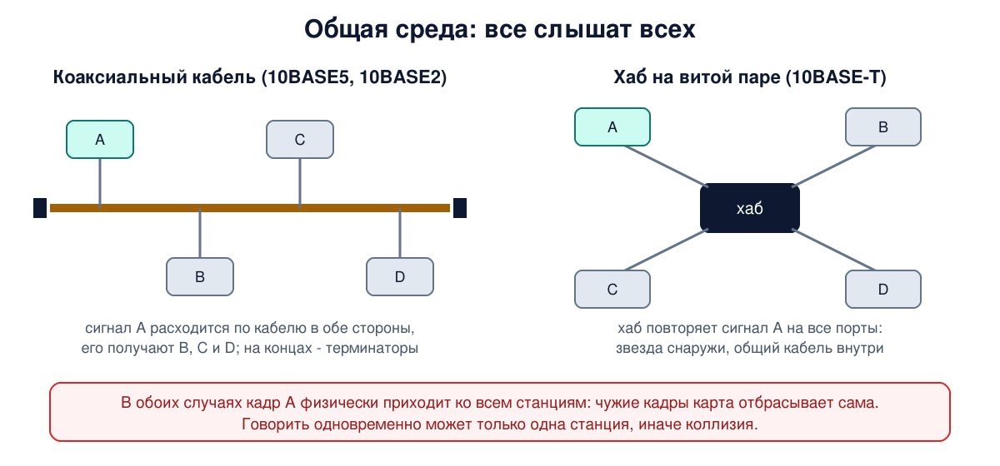
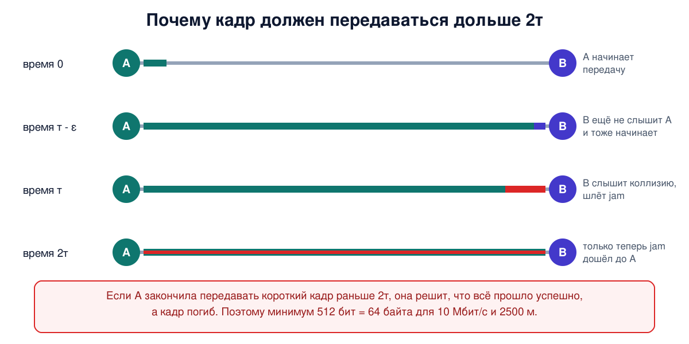

# Урок 14. Классический Ethernet: общая среда и CSMA/CD

Сегодня Ethernet - это кабель от компьютера до порта коммутатора, и соседи друг другу почти не мешают. Но полвека назад всё начиналось иначе: один длинный кабель на всё здание, к которому подключены все компьютеры, и каждый слышит каждого. Этот классический Ethernet давно не используют, но от него осталось очень многое: формат кадра, минимальный размер кадра в 64 байта, сама идея случайного доступа, которая живёт в Wi-Fi. И главное для безопасности: принцип "общая среда = все слышат всех" никуда не делся.

## Как всё начиналось

Роберт Меткалф познакомился с работой Абрамсона над радиосетью ALOHA (урок 13) и перенёс её идею в провод. В 1973 году в исследовательском центре Xerox он предложил заменить общий радиоэфир общим коаксиальным кабелем. Олифер приводит набросок из его служебной записки, где кабель назван "эфиром". Отсюда и название Ethernet: в честь "светоносного эфира", в котором, как когда-то думали физики, распространяются электромагнитные волны.

Первая сеть работала на 3 Мбит/с. Затем компании DEC, Intel и Xerox выпустили общий стандарт на 10 Мбит/с (его называют DIX), а в 1983 году на его основе появился стандарт IEEE 802.3. Формат кадра DIX, который часто называют Ethernet II, используют до сих пор (урок 15).

## Общая среда: толстый и тонкий кабель, хабы

Первый вариант, **10BASE5** ("толстый Ethernet"), - жёсткий коаксиальный кабель, похожий, по Таненбауму, на жёлтый садовый шланг. Компьютеры подключались к нему через отводы, а сегмент мог быть до 500 м. В названии 10 - скорость в Мбит/с, BASE - передача без модуляции несущей (baseband, урок 10), а 5 - длина сегмента в сотнях метров. (Олифер объясняет пятёрку диаметром кабеля в полдюйма, но общепринятое толкование - 500 м.) Затем пришёл **10BASE2**, "тонкий Ethernet": гибкий кабель с сегментом до 185 м.

Главная беда коаксиала - обрыв или плохой контакт в любом месте клал всю сеть, и найти такое место было мучением. Поэтому на рубеже 1990-х появился **10BASE-T** на витой паре: каждый компьютер подключается своим кабелем к **концентратору** (хабу). Искать неисправности стало легко. Но хаб - это многопортовый повторитель. Всё, что приходит на один порт, он побитно повторяет на все остальные. Логически это тот же общий кабель, только собранный в звезду. Все по-прежнему слышат всех, и одновременно может говорить только один.



## CSMA/CD по шагам

Как станции делят общий кабель? Метод называется **CSMA/CD** (множественный доступ с контролем несущей и обнаружением коллизий). Его общую идею мы видели в уроке 13, а теперь разберём по шагам, как это устроено в Ethernet.

1. **Слушай.** Станция, у которой есть кадр, проверяет, нет ли в кабеле сигнала другой станции. Занято - ждёт.
2. **Пауза.** Когда кабель освободился, станция выжидает межкадровый интервал, 9,6 мкс на скорости 10 Мбит/с. Он даёт адаптерам прийти в себя и не позволяет одной станции захватить среду навсегда.
3. **Передавай и слушай.** Станция начинает передачу и одновременно следит за сигналом в кабеле. Кадру предшествует **преамбула** - 7 байтов 10101010 и байт 10101011, на которой приёмники подстраивают часы (урок 13).
4. **Коллизия?** Если сигнал в кабеле отличается от того, что станция передаёт, значит, кто-то начал передачу одновременно. Станция прекращает кадр и посылает короткий сигнал **jam** (32 бита), чтобы коллизию точно заметили все.
5. **Подожди случайное время** и начни с шага 1.

Коллизия в такой сети - не авария, а нормальная часть работы. Возникает она потому, что сигнал идёт по кабелю не мгновенно. Станция A начала передачу, но пока её сигнал не дошёл до станции B, та слышит тишину и тоже начинает передавать.

## Двоичная экспоненциальная выдержка

Сколько ждать после коллизии? Время делят на слоты по 512 битовых интервалов, это 51,2 мкс на скорости 10 Мбит/с. После первой коллизии станция случайно выбирает 0 или 1 слот. После второй - от 0 до 3, после третьей - от 0 до 7. В общем случае после i-й коллизии выбирается число от 0 до 2^i - 1, но после десятой диапазон перестаёт расти и остаётся от 0 до 1023. После 16 неудачных попыток подряд кадр выбрасывают и сообщают об ошибке уровню выше.

Таненбаум объясняет, зачем так сложно. Если всегда выбирать из большого диапазона, две столкнувшиеся станции будут долго и бессмысленно ждать. Если всегда из маленького, сотня столкнувшихся станций будет сталкиваться бесконечно. Удваивая диапазон после каждой неудачи, алгоритм сам подстраивается под число претендентов: когда конкурентов мало, задержка маленькая, а когда много, они за разумное время разбегаются по разным слотам.

## Почему кадр не может быть короче 64 байт

Вот деталь, которая пережила сам классический Ethernet. Представь самый неудачный случай. Станция A на одном конце сети начинает передачу. Сигнал идёт до самой дальней станции B время τ. За мгновение до того, как он дойдёт, B тоже начинает передачу, сразу слышит коллизию и шлёт jam. Но до A этот сигнал дойдёт ещё через τ. Итого A узнает о коллизии только спустя **2τ** после начала своей передачи.

Если A к этому моменту уже **закончила** передавать короткий кадр, она решит, что всё прошло успешно, и не станет повторять, а кадр при этом погиб. Поэтому любой кадр должен передаваться дольше, чем 2τ. Для сети 10 Мбит/с длиной до 2500 м с четырьмя повторителями этот запас приняли равным 512 битам, то есть **64 байтам** от адреса получателя до контрольной суммы включительно. Если данных меньше 46 байт, кадр дополняют заполнителем до минимума.

Отсюда же видно фундаментальное ограничение: скорость и размер сети связаны. Время передачи минимального кадра на 100 Мбит/с в 10 раз меньше, значит, и сеть на хабах должна быть примерно в 10 раз меньше: около 200-250 м. На гигабите - ещё в 10 раз меньше, поэтому в полудуплексном гигабите передачу короткого кадра пришлось искусственно удлинять служебными символами после контрольной суммы (сам кадр при этом не меняется). На практике гигабитный Ethernet с общей средой почти не использовали: к тому времени победили коммутаторы.



## Сколько выжимает общая среда

При сильной загрузке станции всё больше времени тратят на коллизии. Таненбаум показывает расчётом, что при длинных кадрах (1024 байта) классический Ethernet может использовать канал на 85%, а при минимальных кадрах эффективность падает намного сильнее. Олифер приводит эмпирическое правило администраторов тех лет: не загружать общую среду больше чем на 30%, иначе задержки растут очень быстро. Таненбаум при этом ссылается на измерения, по которым Ethernet на практике неплохо работал и при высокой загрузке, так что это правило скорее осторожное, чем точное. И главное: как бы ни был устроен доступ, пропускная способность общей среды **делится на всех**. Добавил станцию - каждой досталось меньше.

## Что изменилось: коммутатор и полный дуплекс

Выход нашли в **коммутаторах** (урок 16). Коммутатор не повторяет сигнал побитно на все порты, а отправляет кадр только на порт получателя, если знает, где тот находится. Широковещательные кадры и кадры неизвестным адресатам по-прежнему получают все. У каждого порта своя линия, на которой всего двое: компьютер и порт коммутатора. Если обе стороны договорились о полном дуплексе, каждое направление передаётся независимо: в 10 и 100 Мбит/с по отдельным парам, а в гигабите по тем же парам в обе стороны с подавлением эха. Отдельные пары были и у хабов 10BASE-T, но там линия вела в общую среду, поэтому коллизии оставались. Такой режим - **полный дуплекс**, и в нём коллизий нет вообще: CSMA/CD просто выключен.

Поэтому современный проводной Ethernet - это уже не общая среда. Но осталось:

- **формат кадра и минимальные 64 байта** - ради совместимости;
- **режим полудуплекса** в стандарте для скоростей до 1 Гбит/с. Если один конец линии работает в полном дуплексе, а другой в полудуплексе (так бывает, когда автосогласование отключено только с одной стороны), связь вроде бы работает, но медленно и с ошибками. Полудуплексная сторона видит "коллизии" там, где их не должно быть, в том числе поздние - после первых 64 байтов кадра. Это классическая неисправность, которую ищут по счётчикам коллизий;
- **случайный доступ к общей среде** - в Wi-Fi, где эфир по-прежнему общий (урок 19).

## Как это увидеть в Linux

**Коллизии.** В уроке 13 мы видели, что колонка `collsns` в `ip -s link` на современном сервере равна нулю: полный дуплекс. Если на реальной машине этот счётчик растёт, первым делом проверь режим дуплекса: свою сторону покажет `ethtool`, а порт на другом конце смотрят на коммутаторе. При несовпадении дуплекса на полнодуплексной стороне растут ещё и ошибки контрольной суммы.

**Минимальный кадр своими руками.** Сколько времени сигнал идёт по 2500 м туда и обратно (скорость в кабеле около 200 000 км/с, урок 4), и сколько бит успевает передать станция за 51,2 мкс на 10 Мбит/с:

```
python3 -c 'print(2 * 2500 / 2e8 * 1e6, "мкс;", 10e6 * 51.2e-6, "бит")'
```

```
25.0 мкс; 512.0 бит
```

Сам путь по кабелю туда и обратно - 25 мкс. Остальной запас до 51,2 мкс приходится на задержки в повторителях и приёмопередатчиках. За 51,2 мкс станция передаёт как раз 512 бит = 64 байта.

**Неразборчивый режим.** В общей среде кадры для всех приходят ко всем, но сетевая карта обычно пропускает в систему только свои, широковещательные и групповые, на которые подписана система. Чтобы видеть всё, карту переводят в **неразборчивый режим** (promiscuous mode). Это делает, например, tcpdump при запуске. Посмотрим на счётчик неразборчивого режима до и во время работы tcpdump:

```
sudo -v
ip -d link show enp0s3 | grep -o 'promiscuity [0-9]*'
sudo timeout 3 tcpdump -i enp0s3 > /dev/null 2>&1 &
sleep 1
ip -d link show enp0s3 | grep -o 'promiscuity [0-9]*'
```

```
promiscuity 0
promiscuity 1
```

Вместо `enp0s3` подставь имя своего интерфейса. `sudo -v` заранее спрашивает пароль, чтобы фоновый tcpdump не остановился в ожидании ввода. Пока tcpdump работает (3 секунды), счётчик равен 1: кто-то попросил карту принимать всё. На VPS чужого трафика ты при этом не увидишь: виртуальный коммутатор гипервизора как правило, доставляет машине только её кадры и широковещательные. С флагом `-p` tcpdump не включает неразборчивый режим, и счётчик остаётся 0. А ядро оставляет след в своём журнале:

```
sudo journalctl -k | grep -i promisc | tail -2
```

```
kernel: virtio_net virtio0 enp0s3: entered promiscuous mode
kernel: virtio_net virtio0 enp0s3: left promiscuous mode
```

Вывод сокращён: убраны дата и имя сервера. Эти записи полезны администратору, но это сигнал, а не гарантия. Мосты, контейнеры Docker и виртуальные машины включают неразборчивый режим штатно, а анализатор, запущенный с `-p`, следа не оставит.

## Атаки и защита: разделяемая среда - все слышат всех

Урок 3 уже предупреждал об этом, а теперь мы видим механизм. В сети на общем кабеле или хабе **каждый кадр физически приходит к каждой станции**. Сетевая карта отбрасывает чужие кадры сама, по доброй воле. Достаточно перевести её в неразборчивый режим и запустить анализатор трафика, и можно читать всё, что передают соседи: пароли старых протоколов вроде telnet и FTP, письма, чужие файлы. Никакого взлома, никаких следов в сети: это пассивная атака из урока 8, которую почти невозможно заметить со стороны.

Именно поэтому сети на хабах были раем для перехвата. Коммутаторы сделали жизнь злоумышленника труднее: кадры, адресованные другим, к нему обычно не приходят (кроме широковещательных и кадров неизвестным адресатам). Но не невозможной - в уроке 16 мы увидим, как коммутатор можно заставить снова работать как хаб, а в уроке 24 - как обмануть соседей, чтобы они сами слали трафик злоумышленнику.

И главное: общая среда никуда не делась. **Wi-Fi - тоже общая среда**, как классический Ethernet, хотя со своим методом доступа (CSMA/CA) и своим форматом кадра: эфир слышат все в зоне досягаемости. Чтобы слышать весь эфир, даже не подключаясь к сети, карту переводят в особый режим мониторинга (урок 19). Общими остаются и сети доступа из урока 12 - PON и кабельный интернет. Поэтому защита содержимого возможна только шифрованием, а физическая изоляция - лишь дополнительный рубеж.

Для защитника есть и светлая сторона. Как мы видели, вход карты в неразборчивый режим обычно оставляет след в журнале ядра. На своих машинах такие события стоит собирать и проверять, отсеивая штатные источники вроде мостов и контейнеров: неожиданный анализатор трафика на сервере - серьёзный повод для расследования. Но отсутствие записей не доказывает, что никто не слушает.

## Итог

- Классический Ethernet: один общий кабель (10BASE5, 10BASE2) или хаб на витой паре (10BASE-T). Хаб - многопортовый повторитель, логически та же общая среда.
- CSMA/CD: слушай, выжди межкадровый интервал, передавай и слушай, при коллизии пошли jam и подожди случайное время.
- Двоичная экспоненциальная выдержка: после i-й коллизии случайно от 0 до 2^i - 1 слотов по 512 бит, диапазон растёт до 1023, после 16 попыток кадр выбрасывают.
- Кадр должен передаваться дольше 2τ, иначе отправитель не узнает о коллизии. Отсюда минимум 64 байта и связь скорости с размером сети.
- Пропускная способность общей среды делится на всех. Коммутаторы и полный дуплекс убрали коллизии, но формат кадра и 64 байта остались.
- Несовпадение дуплекса на концах линии - классическая неисправность со "странными" коллизиями.
- В общей среде все слышат всех: неразборчивый режим позволяет читать чужие кадры. Wi-Fi - тоже общая среда.

## Что почитать

- Олифер, "Компьютерные сети", глава 10, с. 308-319: разделяемая среда, уровни MAC и LLC, формат кадра, CSMA/CD, коллизии и минимальный размер кадра, физические стандарты 10 Мбит/с Ethernet, хабы.
- Таненбаум, "Компьютерные сети", разделы 4.3.1-4.3.3, с. 336-344: история и физический уровень классического Ethernet, протокол MAC, двоичная экспоненциальная выдержка, производительность.
