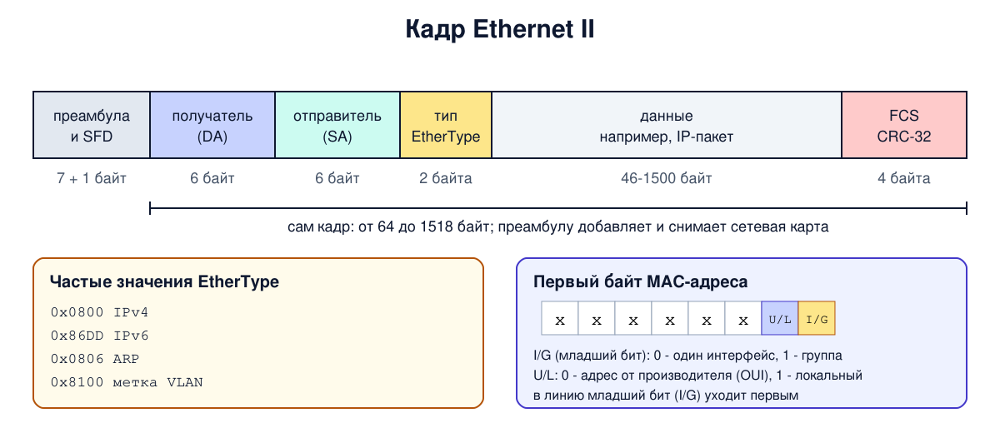

# Урок 15. Кадр Ethernet и MAC-адреса

В уроке 6 мы уже разбирали кадр Ethernet байт за байтом в шестнадцатеричном дампе, а в уроке 13 видели его заголовок в tcpdump. Теперь пора разобраться в устройстве кадра и MAC-адреса по-настоящему: что означает каждое поле, откуда берутся 1500 байт, почему в MAC-адресе важны отдельные биты и как по адресу узнать производителя карты. А в безопасности - главное свойство MAC-адреса: его может поменять кто угодно.

## Формат кадра

На практике почти весь трафик в сетях использует один формат - **Ethernet II**, он же DIX, по именам компаний DEC, Intel и Xerox. Олифер подчёркивает: стандартов формата было несколько, но в оборудовании живёт только этот.

| Поле | Размер | Что в нём |
|---|---|---|
| Преамбула и разделитель (SFD) | 7 + 1 байт | 10101010... и 10101011: синхронизация приёмника (урок 13) |
| Адрес получателя (DA) | 6 байт | MAC-адрес, кому кадр |
| Адрес отправителя (SA) | 6 байт | MAC-адрес, от кого |
| Тип (EtherType) | 2 байта | какой протокол лежит внутри |
| Данные | 46-1500 байт | например, IP-пакет; если меньше 46, дополняются |
| Контрольная сумма (FCS) | 4 байта | CRC-32 (урок 11) |

Преамбулу обычно не считают частью кадра: её добавляет и снимает сетевая карта. Без неё кадр занимает от 64 до 1518 байт (с меткой VLAN - до 1522).

Несколько деталей, которые пригодятся:

- **Адрес получателя стоит первым.** Приёмнику достаточно прочитать первые 6 байт, чтобы понять, ему ли кадр. Коммутатор тоже может начать решать, куда его отправить, как только прочитал этот адрес.
- **Адрес отправителя** для доставки не нужен. По Олиферу, он нужен, чтобы получатель знал, кому отвечать (на практике адрес для ответа система обычно берёт из своей таблицы соседей, урок 24), а коммутатору - чтобы узнать, где находится отправитель (урок 16). Групповым может быть только адрес получателя, в поле отправителя всегда адрес одного интерфейса.
- **EtherType** говорит, кому внутри системы отдать данные: 0x0800 - IPv4, 0x86DD - IPv6, 0x0806 - ARP (урок 24), 0x8100 - особый случай: это признак того, что дальше идёт 4-байтная метка VLAN, а за ней настоящий EtherType (урок 18). Это то самое поле-указатель на протокол верхнего уровня из уроков 5-6.
- **Минимум 46 байт данных** остался от классического Ethernet: кадр не может быть короче 64 байт (урок 14). Если данных меньше, карта добавляет заполнитель, а какой длины настоящие данные, получатель узнает из заголовка протокола внутри (у IP для этого есть поле длины): в Ethernet II поля длины нет.
- **Максимум 1500 байт данных** - это и есть знаменитый MTU Ethernet. Таненбаум объясняет, откуда такое число: в 1978 году память была дорогой, а приёмнику нужно было хранить кадр целиком. Число выбрали, в общем-то, произвольно, и оно пережило все последующие поколения. Многие карты и коммутаторы поддерживают и **jumbo-кадры** с MTU около 9000 байт, но это не стандарт, и включать их нужно на всех устройствах сегмента.

**Тип или длина?** В стандарте IEEE 802.3 на месте EtherType когда-то была **длина** данных, а тип протокола переносили в дополнительный заголовок LLC. Два формата пришлось примирить. Правило такое: если значение в этом поле не больше 1500, это длина (формат 802.3), а если 0x0600 (1536) и больше - это тип (Ethernet II). Все настоящие типы протоколов не меньше 0x0600, поэтому путаницы не бывает. Почти весь трафик - Ethernet II, исключение - служебные протоколы коммутаторов вроде STP (урок 17), они используют формат 802.3.



## MAC-адрес

MAC-адрес - 48 бит, то есть 6 байт, обычно записанных шестнадцатеричными парами: `52:54:00:12:34:56` или `52-54-00-12-34-56`. Название, как мы знаем из урока 13, от подуровня MAC (управление доступом к среде).

**Кто раздаёт адреса.** Чтобы адреса не повторялись, IEEE выдаёт производителям **OUI** (organizationally unique identifier) - 24-битный идентификатор, который занимает первые три байта адреса. Остальные три байта производитель назначает сам, и одного OUI хватает примерно на 16 миллионов карт. Например, OUI 00-00-0C принадлежит Cisco. По первым трём байтам можно узнать производителя карты, и мы сделаем это ниже.

**Два особых бита** находятся в первом байте адреса:

- **I/G** (individual/group) - самый младший бит первого байта. 0 - адрес одного интерфейса (**unicast**), 1 - адрес группы (**multicast**). Этот бит передаётся в линию самым первым, поэтому приёмник может сразу понять, групповой ли кадр. Групповой адрес из всех единиц, `ff:ff:ff:ff:ff:ff`, - **широковещательный** (broadcast): такой кадр принимают все;
- **U/L** (universal/local) - следующий бит. 0 - адрес назначен производителем по правилам IEEE, 1 - назначен локально: администратором, программой или операционной системой.

Удобное правило: смотри на вторую шестнадцатеричную цифру адреса, она заканчивает первый байт. Если она нечётная (1, 3, 5, 7, 9, B, D, F), адрес групповой. Если она 0, 4, 8 или C, адрес индивидуальный и назначен производителем. Если 2, 6, A или E, адрес индивидуальный, но назначенный локально, как `02:...` или `52:...`. Например, `01:00:5e:...` - групповой адрес для IPv4-multicast.

**Какие кадры принимает карта.** Свои (индивидуальные на её адрес), широковещательные и групповые для групп, в которые она включена. Остальные отбрасывает, если не включён неразборчивый режим (урок 14).

**Где MAC-адрес живёт.** Только на одном звене. Как мы видели в уроке 13, на каждом маршрутизаторе пакет перекладывают в новый кадр с новыми адресами. В заголовках кадров сервер в интернете твой MAC-адрес не увидит: там будут адреса последнего маршрутизатора перед ним. Исключение - IPv6-адреса, построенные из MAC-адреса (урок 30).

## Как это увидеть в Linux

**Адреса всех интерфейсов** коротко:

```
ip -br link
```

```
lo               UNKNOWN        00:00:00:00:00:00 <LOOPBACK,UP,LOWER_UP>
enp0s3           UP             52:54:00:12:34:56 <BROADCAST,MULTICAST,UP,LOWER_UP>
docker0          DOWN           66:3a:a2:e0:a6:8a <NO-CARRIER,BROADCAST,MULTICAST,UP>
br-7f631d39ec2a  UP             32:7f:44:bd:7c:dc <BROADCAST,MULTICAST,UP,LOWER_UP>
veth58cf7c1@if2  UP             6a:e3:b6:6f:2b:c9 <BROADCAST,MULTICAST,UP,LOWER_UP>
```

Последние три байта адреса `enp0s3` заменены на учебные. Кроме сетевой карты здесь интерфейсы, которые создал Docker: два моста (`docker0`, сейчас без контейнеров, и мост сети бота) и "виртуальный кабель" (veth) к контейнеру бота.

**Разбираем биты.** Посмотрим, что говорят биты I/G и U/L в нескольких адресах:

```
python3 -c '
for mac in ("52:54:00:12:34:56", "02:42:ac:11:00:02", "ff:ff:ff:ff:ff:ff", "01:00:5e:00:00:01"):
    b = int(mac.split(":")[0], 16)
    print(mac, "I/G =", b & 1, " U/L =", (b >> 1) & 1)
'
```

```
52:54:00:12:34:56 I/G = 0  U/L = 1
02:42:ac:11:00:02 I/G = 0  U/L = 1
ff:ff:ff:ff:ff:ff I/G = 1  U/L = 1
01:00:5e:00:00:01 I/G = 1  U/L = 0
```

Интересно: у сетевой карты нашего сервера адрес **локальный**. Это не ошибка. Карта виртуальная (урок 3), и адрес ей назначил гипервизор. Префикс 52:54:00 традиционно использует QEMU/KVM. Все адреса интерфейсов Docker - тоже локальные, их сгенерировала программа. А у настоящей карты с завода бит U/L будет равен 0. Обратное неверно: VMware, VirtualBox и Hyper-V используют собственные зарегистрированные OUI, так что U/L = 0 ещё не доказывает, что карта физическая.

**Кто производитель.** Локальную копию реестра IEEE даёт пакет `ieee-data` (если его нет: `sudo apt install ieee-data`):

```
grep -i '^00-00-0C' /usr/share/ieee-data/oui.txt
grep -i '^52-54-00' /usr/share/ieee-data/oui.txt || echo 'нет в реестре'
```

```
00-00-0C   (hex)		Cisco Systems, Inc
нет в реестре
```

OUI 00-00-0C принадлежит Cisco. А 52-54-00 в реестре нет, и это правильно: это локальный адрес, а не OUI производителя.

**Сменить MAC-адрес может любой, у кого есть права администратора.** Чтобы не трогать настоящую карту, создадим пустой учебный интерфейс, поменяем ему адрес и удалим:

```
sudo ip link add hbhtest0 type dummy
ip -br link show hbhtest0
sudo ip link set dev hbhtest0 address 02:00:00:00:be:ef
ip -br link show hbhtest0
sudo ip link del hbhtest0
```

```
hbhtest0         DOWN           ee:f8:ca:72:32:16 <BROADCAST,NOARP>
hbhtest0         DOWN           02:00:00:00:be:ef <BROADCAST,NOARP>
```

Одна команда - и у интерфейса другой адрес. Заметь, что и случайный адрес `ee:...`, который система дала новому интерфейсу, тоже локальный. С настоящей картой это делается так же, некоторые драйверы требуют сначала выключить интерфейс (`ip link set dev ... down`). Но на удалённом сервере не экспериментируй: даже без выключения облачный провайдер обычно отбрасывает кадры с незнакомого MAC-адреса, и связь пропадёт. Эксперименты - только на своём компьютере и не на том интерфейсе, через который ты к нему подключён.

**Пределы MTU карты:**

```
ip -d link show enp0s3 | grep -o 'mtu [0-9]*\|minmtu [0-9]*\|maxmtu [0-9]*'
```

```
mtu 1500
minmtu 68
maxmtu 65535
```

Сейчас MTU стандартный, 1500 байт. Виртуальная карта позволила бы поставить и больше, но это имеет смысл, только если весь путь поддерживает такие кадры.

## Атаки и защита: подмена MAC

Мы только что увидели главное: **MAC-адрес ничего не доказывает**. Он записан в карте производителем, но операционная система сообщает в сеть тот адрес, который ей скажут. Любой пользователь с правами администратора меняет его одной командой, и в самом Ethernet никакой проверки на это нет (проверять умеют коммутаторы и облачные провайдеры, урок 16). Это идентификация без аутентификации (урок 8).

Тем не менее на MAC-адресах часто строят "защиту":

- **фильтрация по MAC в Wi-Fi** - "пускать только эти устройства". Адреса разрешённых устройств видны в эфире в открытом виде даже в зашифрованной сети: заголовок кадра не шифруется. Злоумышленник подслушивает, подставляет себе разрешённый адрес и проходит фильтр;
- **платный Wi-Fi в гостиницах и кафе** часто запоминает, какой MAC-адрес оплатил доступ. Атакующий может скопировать адрес оплатившего соседа и пользоваться чужим доступом;
- **привязка в DHCP и списки доступа** на коммутаторах по MAC-адресу обходятся так же.

Поэтому MAC-адрес годится для учёта и удобства, но не как пропуск. Настоящую проверку даёт **802.1X**: аутентификация перед тем, как порт или точка доступа начнут пропускать трафик. В Wi-Fi это режимы WPA2/WPA3-Enterprise, где у каждого пользователя или устройства свои учётные данные (урок 20). У проводного 802.1X тоже есть слабые места, о них - в уроке 16.

У MAC-адреса есть и обратная проблема - **слежка**. Постоянный адрес телефона виден каждой точке доступа, мимо которой ты проходишь, даже если ты к ней не подключаешься: телефон сам рассылает запросы в поисках знакомых сетей. Магазины и торговые центры использовали это, чтобы отслеживать посетителей. Ответ - **случайные MAC-адреса** (с битом U/L = 1), о которых мы упоминали в уроке 3. Механизмов два. При поиске сетей телефоны давно подставляют случайные адреса, это мешает следить за прохожими. А при подключении используют отдельный случайный адрес для каждой сети, чтобы тебя нельзя было сопоставить между разными сетями; сама сеть при этом обычно видит один и тот же адрес. У телефонов это включено по умолчанию, у ноутбуков часто нужно включать вручную. И ещё: MAC-адрес может попасть в IPv6-адрес устройства и стать виден всему интернету, на части систем так бывает и сейчас - об этом в уроке 30.

## Итог

- Почти весь трафик - кадр Ethernet II: адрес получателя, адрес отправителя, тип, данные 46-1500 байт, CRC-32. Без преамбулы кадр занимает 64-1518 байт.
- EtherType говорит, какой протокол внутри: 0x0800 - IPv4, 0x86DD - IPv6, 0x0806 - ARP, 0x8100 - VLAN. Значение не больше 1500 - это длина (802.3), от 0x0600 - тип.
- MTU 1500 выбрали в 1970-х из-за дорогой памяти, и оно пережило все поколения Ethernet.
- MAC-адрес - 48 бит. У глобального адреса первые три байта - OUI производителя. Бит I/G: 0 - один интерфейс, 1 - группа, `ff:ff:ff:ff:ff:ff` - все. Бит U/L: 1 - адрес назначен локально.
- MAC-адрес живёт только на одном звене, в заголовках кадров его не видно за маршрутизатором (исключение - IPv6-адреса из MAC).
- MAC-адрес меняется одной командой и ничего не доказывает. Фильтры по MAC обходятся подменой, настоящая проверка - 802.1X.
- Постоянный MAC-адрес позволяет следить за устройством, поэтому телефоны используют случайные адреса.

## Что почитать

- Олифер, "Компьютерные сети", глава 10, с. 310-314: уровни MAC и LLC, MAC-адреса, групповые и широковещательные адреса, OUI, неразборчивый режим, формат кадра Ethernet II.
- Таненбаум, "Компьютерные сети", раздел 4.3.2, с. 338-341: формат кадра DIX и IEEE 802.3, адреса, поле типа и длины, ограничения размера данных.
