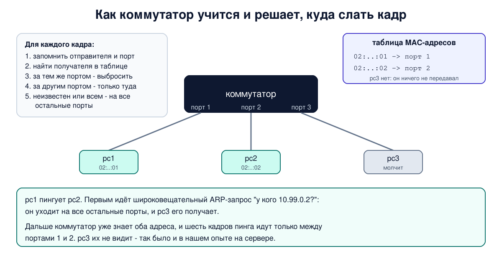

# Урок 16. Мосты и коммутаторы: как коммутатор узнаёт, куда слать кадр

В уроке 14 мы видели, почему общая среда плохо масштабируется: пропускная способность делится на всех, а кадр слышит каждый. Коммутатор решает обе проблемы. Он отправляет кадр не всем, а только туда, где находится получатель. Но откуда он знает, где получатель? Никто ему этого не сообщает: коммутатор учится сам, подглядывая за трафиком. Сегодня разберём этот алгоритм, проверим его на учебном коммутаторе, который соберём прямо в Linux, и посмотрим, какие слабые места у него есть и как их закрывают.

## От моста к коммутатору

Коммутатор вырос из **моста** (bridge). Мост придумали, чтобы соединять сегменты сетей на общей среде: у него обычно было два порта, отсюда и название, мост между двумя сегментами. Олифер подчёркивает, что алгоритм работы у моста и коммутатора один и тот же, он описан в стандарте IEEE 802.1D (сейчас он вошёл в стандарт 802.1Q, о нём в уроке 18), и в стандартах до сих пор пишут "мост". Коммутатор отличается числом портов и скоростью: по сути, это многопроцессорный мост, который передаёт кадры между многими парами портов одновременно. Поэтому дальше мы будем использовать эти слова как синонимы.

Главное отличие от хаба (урок 14): хаб повторяет сигнал побитно на все порты, а мост **принимает кадр** и решает, куда его отправить. Благодаря этому:

- у каждого порта своя **область коллизий**. Если к порту подключён один компьютер в полном дуплексе, коллизий нет вообще (урок 14);
- разные пары портов могут обмениваться кадрами **одновременно**. Олифер приводит пример: 8-портовый коммутатор 10 Мбит/с, где четыре порта одновременно передают на четыре других, пропускает в сумме 40 Мбит/с. Хаб на тех же портах дал бы только 10;
- кадры, которые никому за портом не нужны, туда не попадают.

Олифер называет это **логической структуризацией** сети, в отличие от физической, которую давали хабы: хаб собирает кабели в звезду, но логически это одна общая среда.

## Алгоритм обучения

Мост строит **таблицу MAC-адресов** (её ещё называют таблицей продвижения или фильтрации): какой адрес за каким портом. Строит он её сам, по **адресам отправителей**. Пришёл на порт 1 кадр от адреса A - значит, A находится за портом 1. Поэтому Таненбаум называет этот алгоритм **обратным обучением**: коммутатор узнаёт, куда слать кадры, по тому, откуда они приходят.

Чтобы видеть все кадры, порты моста работают в неразборчивом режиме (урок 14). Для каждого кадра алгоритм такой:

1. **Запомнить отправителя.** Записать или обновить в таблице: адрес отправителя - порт, на который пришёл кадр, - текущее время.
2. **Найти получателя в таблице.**
3. Если получатель за **тем же портом**, откуда пришёл кадр, - кадр выбросить. Это **фильтрация**: кадр уже там, где нужно.
4. Если получатель за **другим портом** - отправить кадр только туда. Это **продвижение**.
5. Если получателя в таблице **нет** или кадр **широковещательный** либо групповой - отправить на все порты, кроме того, откуда он пришёл. Это **затопление** (flooding). Исключение - служебные групповые адреса, по которым общаются сами мосты (урок 17): их мост не пересылает.

Таблица всё время обновляется. Если компьютер переехал на другой порт и что-то передал, запись по правилу 1 сразу переписывается на новый порт. Но переехавший или выключенный компьютер может молчать, и тогда кадры для него вечно уходили бы на старый порт. Поэтому записи, созданные обучением, **стареют**: если от адреса давно не было ни одного кадра, запись удаляют. Срок жизни записи по умолчанию - 300 секунд, его можно настроить. Бывают и **статические** записи, которые вносит администратор: они не стареют.

Заметь важную вещь: коммутатор узнаёт о компьютере, только когда тот сам что-то передаст. Молчащий компьютер в таблице не появится, и кадры для него будут рассылаться всем, пока он не ответит.



## Продвижение: сразу или после проверки

Коммутатор может начинать отправку кадра по-разному:

- **с промежуточным хранением** (store-and-forward) - принять кадр целиком, проверить контрольную сумму и только потом отправить. Испорченные кадры дальше не идут. Это тот самый способ из урока 4;
- **без буферизации** (cut-through) - начать отправку, как только прочитан адрес получателя, те самые первые 6 байт кадра (урок 15), если выходной порт свободен. Таненбаум отмечает, что так меньше задержка и меньше кадров нужно хранить. Но контрольная сумма стоит в конце кадра, и когда коммутатор до неё доходит, начало кадра уже ушло дальше. Поэтому испорченный кадр такой коммутатор может переслать (обычно он всё же отмечает ошибку, и кадр выбросит следующий узел). Если выходной порт занят, кадр всё равно приходится ставить в буфер.

## Производительность и дуплекс

Коммутатор называют **неблокирующим**, если он успевает передавать кадры с той же скоростью, с какой они приходят на все порты. Олифер приводит цифры: при минимальных кадрах порт 10 Мбит/с получает до 14 880 кадров в секунду, порт 100 Мбит/с - около 148 800, гигабитный - около 1 488 000. Они получаются так: минимальный кадр 64 байта плюс 8 байт преамбулы и 12 байт межкадрового интервала - это 84 байта, или 672 бита на кадр, и 10 000 000 / 672 ≈ 14 880,95, Олифер округляет до 14 880. Процессоры портов должны это выдерживать, поэтому коммутаторы строят на специализированных микросхемах.

Но даже неблокирующий коммутатор не поможет, если двум компьютерам одновременно нужен один и тот же выходной порт, например к серверу. Выходной порт не может передавать быстрее своей скорости, и кадры встают в очередь в буфере коммутатора. Отсюда совет Олифера: сервер, к которому обращаются многие, стоит подключать к более быстрому порту.

## Широковещательный домен и шторм

Коммутатор разделяет области коллизий, но **не разделяет широковещательный домен**. Широковещательный кадр, как мы видели, уходит на все порты, а значит, и через все коммутаторы, соединённые между собой. Все устройства, до которых доходит широковещательный кадр, образуют один **широковещательный домен**. Остановить его может только маршрутизатор (блок 3) или разбиение на VLAN (урок 18).

Отсюда проблема, о которой пишет Олифер: **широковещательный шторм**. Если сбойная карта или программа начинает непрерывно рассылать широковещательные кадры, коммутаторы честно доставят их во все уголки сети, и сеть захлебнётся. По умолчанию мосты от этого не защищают. Можно лишь ограничить допустимую интенсивность широковещательных кадров на порту (storm control), но для этого надо знать, какой уровень нормален. Ещё хуже, когда в сети образуется **петля** из коммутаторов: тогда каждый широковещательный кадр кружит бесконечно и размножается. Как с петлями борются, разберём в уроке 17.

## Как это увидеть в Linux

В Linux есть программный мост, который работает по тому же алгоритму 802.1D. Docker использует его для своих сетей. Соберём учебный коммутатор с тремя "компьютерами". В роли компьютеров будут сетевые пространства имён (network namespaces): каждое - это изолированный сетевой стек со своими интерфейсами и адресами, как будто отдельная машина. Каждый "компьютер" соединим с мостом виртуальным кабелем veth. IPv6 в учебной сети отключим, чтобы его служебные кадры не мешали смотреть.

Создай файл `switch-lab.sh` с таким содержимым и запусти его командой `bash switch-lab.sh`. Нужна машина с Linux (подойдёт и WSL2, но не WSL1 и не контейнер), права sudo и tcpdump (`sudo apt install tcpdump`). Скрипт ничего не меняет в настройках самой системы: всё создаётся внутри учебных пространств имён и в конце удаляется, а если его прервать, достаточно запустить снова - он сам уберёт остатки.

```
set -u
command -v tcpdump >/dev/null || { echo "установи tcpdump: sudo apt install tcpdump"; exit 1; }
# убрать остатки прошлого запуска, если он прервался
sudo ip link del hbhsw 2>/dev/null
for n in 1 2 3; do sudo ip netns del pc$n 2>/dev/null; done
# учебный коммутатор: мост hbhsw и три "компьютера" - сетевые пространства имён pc1, pc2, pc3
for n in 1 2 3; do
  sudo ip netns add pc$n
done
sudo ip link add hbhsw type bridge
for n in 1 2 3; do
  sudo ip link add veth$n type veth peer name eth0 netns pc$n
  sudo ip link set veth$n master hbhsw
  sudo ip netns exec pc$n sysctl -qw net.ipv6.conf.all.disable_ipv6=1 net.ipv6.conf.default.disable_ipv6=1 net.ipv6.conf.eth0.disable_ipv6=1
  sudo ip netns exec pc$n ip link set eth0 address 02:00:00:00:00:0$n
  sudo ip netns exec pc$n ip addr add 10.99.0.$n/24 dev eth0
done
sudo sysctl -qw net.ipv6.conf.hbhsw.disable_ipv6=1 net.ipv6.conf.veth1.disable_ipv6=1 net.ipv6.conf.veth2.disable_ipv6=1 net.ipv6.conf.veth3.disable_ipv6=1
sudo ip link set hbhsw up
for n in 1 2 3; do
  sudo ip link set veth$n up
  sudo ip netns exec pc$n ip link set eth0 up
done
sleep 1
echo '--- table before'
bridge fdb show br hbhsw | grep -v permanent
echo '--- pc3 listens, pc1 pings pc2'
f=$(mktemp)
sudo ip netns exec pc3 timeout 5 tcpdump -i eth0 -n -e -l 2>/dev/null > "$f" &
sleep 1
sudo ip netns exec pc1 ping -c 3 -q 10.99.0.2 | tail -2
wait
echo '--- pc3 saw'
sed -E 's/^[0-9:.]+ //' "$f"; rm -f "$f"
echo '--- table after'
bridge fdb show br hbhsw | grep -v permanent
echo '--- ageing'
ip -d link show hbhsw | grep -o 'ageing_time [0-9]*'
sudo ip link set hbhsw type bridge ageing_time 1000
sleep 15
bridge fdb show br hbhsw | grep -v permanent | wc -l
echo '--- cleanup'
sudo ip link del hbhsw
for n in 1 2 3; do sudo ip netns del pc$n; done
ip link show hbhsw 2>&1 | head -1
```

Вот что получилось на нашем сервере:

```
--- table before
--- pc3 listens, pc1 pings pc2
3 packets transmitted, 3 received, 0% packet loss, time 2030ms
rtt min/avg/max/mdev = 0.070/0.090/0.123/0.023 ms
--- pc3 saw
02:00:00:00:00:01 > ff:ff:ff:ff:ff:ff, ethertype ARP (0x0806), length 42: Request who-has 10.99.0.2 tell 10.99.0.1, length 28

--- table after
02:00:00:00:00:01 dev veth1 master hbhsw
02:00:00:00:00:02 dev veth2 master hbhsw
--- ageing
ageing_time 30000
0
--- cleanup
Device "hbhsw" does not exist.
```

Разберём по шагам.

- **Таблица до** пуста: никто ещё ничего не передавал, коммутатор никого не знает. (`bridge fdb show` показывает таблицу моста, а `grep -v permanent` убирает служебные постоянные записи: адреса самих портов моста и групповые адреса.) Для этого мы и отключили IPv6: иначе при включении каждый "компьютер", включая pc3, сразу разослал бы служебные кадры IPv6, и коммутатор узнал бы всех ещё до опыта.
- **pc1 пингует pc2**, а pc3 в это время слушает свой порт. Чтобы отправить пинг, pc1 сначала должен узнать MAC-адрес pc2 и рассылает широковещательный запрос ARP "у кого адрес 10.99.0.2?" (урок 24). В этот момент коммутатор впервые видит pc1 и запоминает его порт. Сам запрос широковещательный, и коммутатор отправил его на все остальные порты: pc3 его получил - это единственная строка в его захвате. (Пустая строка после неё - tcpdump сам печатает перевод строки при завершении.)
- **ARP-ответ** pc2 отправляет адресно, на MAC pc1. Коммутатор уже знает, где pc1, и отправляет ответ только туда, а заодно запоминает, где pc2. Поэтому pc3 ответа не видит.
- **Шесть кадров пинга** (три запроса и три ответа) pc3 тоже не увидел, хотя tcpdump перевёл его карту в неразборчивый режим (урок 14) и она приняла бы любой дошедший до неё кадр. Значит, кадры до pc3 просто не доходили: коммутатор отправлял их только pc1 и pc2. Это и есть фильтрация, ради которой коммутатор придуман.
- **Таблица после**: адреса pc1 и pc2 привязаны к своим портам. А pc3 в таблице нет: он ничего не передавал, и коммутатору неоткуда о нём узнать.
- **Старение**: `ageing_time 30000` - это срок жизни записи в сотых долях секунды, то есть 300 секунд (осторожно: справка `man ip-link` называет это секундами, но вывод на деле в сотых). Мы сократили срок до 10 секунд (1000), подождали 15, и динамических записей в таблице осталось 0 (`wc -l` считает строки): коммутатор забыл адреса, от которых давно ничего не приходило.
- В конце скрипт удаляет всё, что создал.

Если у тебя пинг не проходит (100% потерь), а ARP-запрос pc3 видит, проверь `sysctl net.bridge.bridge-nf-call-iptables`: если такой параметр есть и равен 1, трафик через мосты проходит через правила файрвола самой машины, и они могут его отбрасывать (так бывает на машинах с Docker или ufw). На нашем сервере модуля br_netfilter не было.

Таблицу настоящего моста можно посмотреть так же. На нашем сервере мост сети Docker знает один адрес - контейнер бота:

```
ip -br link show type bridge
bridge fdb show br br-7f631d39ec2a | grep -v permanent
```

```
XX:XX:XX:XX:XX:XX dev veth6f38a7a master br-7f631d39ec2a
```

(Первая команда перечисляет мосты; мост Docker по умолчанию называется `docker0`, мосты пользовательских сетей (в том числе compose) - `br-...`. Имя у тебя будет другим, адрес скрыт. Если контейнер молчал дольше 300 секунд, таблица может оказаться пустой - это старение.)

## Атаки и защита: слабые места коммутатора и защита портов

Коммутатор сильно усложнил жизнь перехватчику: чужие адресные кадры до него обычно не доходят (урок 14). Но алгоритм обучения доверчив по своей природе: коммутатор верит **любому** индивидуальному адресу отправителя и никак его не проверяет. Отсюда слабые места.

**Переполнение таблицы.** Таблица MAC-адресов имеет конечный размер. Если её забить множеством поддельных адресов отправителей, коммутатор перестаёт запоминать новые адреса. Кадры для всех, кого в таблице нет, по правилу 5 рассылаются на все порты (в пределах своей VLAN, урок 18), а по мере старения записей таких получателей становится всё больше. Сеть начинает вести себя похоже на хаб, и чужой трафик доходит и до злоумышленника. Эту атаку называют MAC flooding. Насколько сильно она действует, зависит от устройства: некоторые коммутаторы умеют не рассылать кадры неизвестным получателям.

**Подмена адреса.** Если злоумышленник отправит кадр с чужим адресом отправителя, коммутатор по правилу 1 решит, что владелец адреса переехал на порт злоумышленника, и часть кадров для жертвы пойдёт туда. MAC-адрес ничего не доказывает (урок 15), а коммутатор ему верит.

**Шторм и петля.** Широковещательный шторм или петля, случайные или намеренные, кладут весь широковещательный домен. Это атака на доступность.

Как защищаются:

- **Защита портов** (port security). На порту ограничивают число MAC-адресов, например одним или двумя, или разрешают только определённые адреса. Если на порту появляется лишний адрес, коммутатор отбрасывает такие кадры (часто сообщая администратору) или вовсе выключает порт. Переполнить таблицу с одного порта уже не получится, а адрес, закреплённый за одним портом, не сможет появиться на другом защищённом порту.
- **802.1X** - проверка устройства до того, как порт начнёт пропускать трафик. Участвуют три стороны: устройство, которое хочет подключиться (supplicant), коммутатор (authenticator) и сервер аутентификации, обычно RADIUS. Пока устройство не докажет, кто оно, например сертификатом или логином и паролем, порт пропускает только служебные кадры аутентификации (EAPOL). В Wi-Fi 802.1X используется в режимах WPA2/WPA3-Enterprise, но там из результата проверки выводятся ключи, которыми защищается каждый кадр, поэтому описанной ниже слабости нет (урок 20).
- **Слабое место 802.1X** в проводной сети: порт открывается после проверки (иногда её периодически повторяют), но сами кадры никак не привязаны к проверенному устройству. Если за портом стоит хаб или простой мини-коммутатор, пропускающий кадры EAPOL, после того как законное устройство прошло проверку, через тот же порт могут ходить и чужие кадры. Ограничение адресов на порту тут не спасёт, если чужое устройство подставит адрес законного. Полностью это закрывает только **MACsec** (IEEE 802.1AE): проверка подлинности и, как правило, шифрование каждого кадра на одном звене.
- **Контроль штормов** (storm control) ограничивает интенсивность широковещательных, групповых и неизвестных одноадресных кадров на порту, а **сегментация** на VLAN (урок 18) и маршрутизаторы уменьшают широковещательный домен и то, что в нём может сломаться.
- **Наблюдение.** Резкий рост числа адресов в таблице или частые "переезды" адреса между портами - признак атаки или сбоя. Управляемые коммутаторы умеют о таком сообщать.
- **Облачные провайдеры** делают похожее на своих виртуальных коммутаторах: кадры с чужого MAC-адреса или IP-адреса от виртуальной машины обычно просто отбрасываются. Поэтому, как говорилось в уроке 15, сменить MAC на VPS и не потерять связь не выйдет.

И главный вывод, который повторяется в курсе: коммутатор - не средство защиты конфиденциальности. Он лишь делает перехват труднее. Таненбаум говорит о том же: если безопасность действительно важна, к коммутации нужно добавить шифрование.

## Итог

- Коммутатор - многопортовый мост, алгоритм у них общий (IEEE 802.1D). В отличие от хаба, он принимает кадр и решает, куда его отправить.
- Таблицу MAC-адресов коммутатор строит сам по адресам отправителей (обратное обучение). Дальше: получатель за тем же портом - фильтрация, за другим - продвижение, неизвестен или широковещательный - затопление на все порты.
- Переехавший компьютер, который что-то передал, коммутатор находит сразу; записи тех, кто молчит, стареют (по умолчанию 300 секунд), статические записи не стареют. Молчащий компьютер коммутатор не знает.
- Store-and-forward проверяет контрольную сумму, cut-through даёт меньшую задержку, но может пропустить испорченный кадр.
- Каждый порт - своя область коллизий, но широковещательный домен общий. Его ограничивают маршрутизаторы и VLAN.
- Коммутатор верит любому индивидуальному адресу отправителя: таблицу можно переполнить, адрес - подменить. Защита: ограничение адресов на порту, 802.1X, MACsec, контроль штормов, сегментация и наблюдение.

## Что почитать

- Олифер, "Компьютерные сети", глава 10, с. 320-333: мост как предшественник коммутатора, алгоритм прозрачного моста IEEE 802.1D, широковещательный шторм, петли, параллельная коммутация, дуплексный режим, неблокирующие коммутаторы.
- Таненбаум, "Компьютерные сети", раздел 4.3.4, с. 344-347: коммутируемый Ethernet, области коллизий, безопасность; разделы 4.7.1-4.7.2, с. 386-391: применение мостов, обучающиеся мосты, cut-through.
