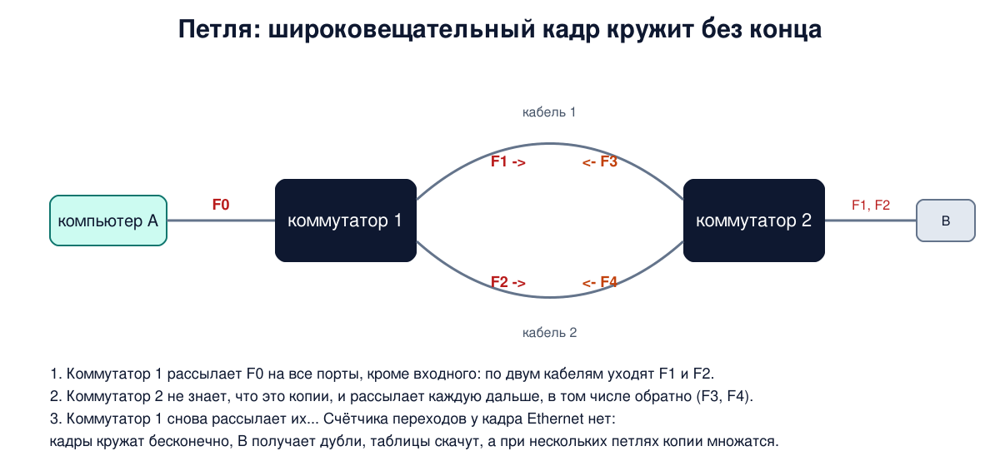
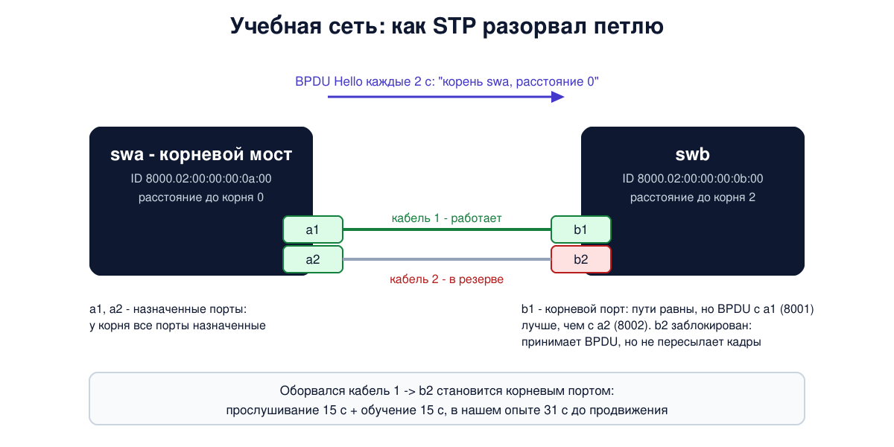

# Урок 17. Петли и STP: как коммутаторы строят дерево без петель

В уроке 16 коммутатор научился сам находить получателей. Но его алгоритм работает правильно, только если между любыми двумя точками сети есть ровно один путь. А для надёжности нужны запасные пути: оборвался кабель - трафик пошёл по другому. Запасной путь между коммутаторами - это петля, и для Ethernet петля смертельна. Сегодня разберём, почему, как протокол покрывающего дерева (STP) позволяет иметь запасные кабели без петель, посмотрим его работу на двух учебных коммутаторах в Linux и обсудим, чем опасно то, что коммутаторы верят любому, кто говорит на их протоколе.

## Почему петля смертельна

Таненбаум разбирает простой пример: два моста соединены двумя параллельными кабелями, чтобы обрыв одного не разделил сеть. Компьютер A отправляет кадр получателю, которого мосты ещё не знают (или широковещательный кадр). Дальше всё идёт по правилам урока 16:

1. Коммутатор 1 рассылает кадр F0 на все порты, кроме входного. По двум кабелям к коммутатору 2 уходят две копии, F1 и F2.
2. Коммутатор 2 не может знать, что это копии одного кадра, а не два разных. Он рассылает каждую на все остальные порты, в том числе по второму кабелю обратно: получаются F3 и F4.
3. Коммутатор 1 видит два "новых" кадра и снова рассылает их. И так без конца.



У IP-пакета есть счётчик переходов, который не даёт ему кружить вечно (блок 3), а у кадра Ethernet такого поля нет (урок 15). Поэтому кадры в петле живут, пока петлю не разорвут. Если коммутаторов и петель больше, копии ещё и размножаются: каждый широковещательный кадр порождает всё новые. Это и есть **широковещательный шторм** из урока 16, только созданный не сбойной картой, а топологией. Вдобавок таблицы MAC-адресов сходят с ума: кадр от A приходит к коммутатору то с одного порта, то с другого, и запись об A всё время "переезжает" (правило 1 из урока 16). Каналы и процессоры коммутаторов забиваются, и сеть перестаёт работать целиком.

Олифер описывает, как с этим боролись вручную: строили сеть с запасными связями, а лишние порты администратор отключал сам. При отказе всё нужно было заново найти и перенастроить руками, и сеть простаивала минутами. Нужен был автоматический способ.

## Идея покрывающего дерева

Представим сеть как граф: коммутаторы - вершины, связи между ними - рёбра. **Покрывающее дерево** (spanning tree) - это подмножество рёбер, которое соединяет все вершины и не содержит циклов. В дереве между любыми двумя вершинами ровно один путь, а значит, петель нет. Задача протокола - договориться, какие связи входят в дерево, а на остальных **заблокировать порты**: кабель остаётся подключённым, но пользовательские кадры через него не ходят. Если связь из дерева откажет, протокол построит новое дерево и включит запасную.

Алгоритм придумала Радья Перлман в компании DEC. Олифер датирует его 1983 годом, Таненбаум ссылается на её статью 1985 года и рассказывает, что на задачу ей дали неделю, а алгоритм она придумала в первый же день и успела изложить его в стихах. Алгоритм вошёл в тот же стандарт IEEE 802.1D, что и алгоритм прозрачного моста, а реализующий его протокол называется **STP** (Spanning Tree Protocol). Олифер замечает, что STP - это упрощённый протокол маршрутизации: он тоже ищет кратчайшие пути, но выбирает один активный путь для всех кадров сразу, а не для каждого адреса назначения отдельно.

## Как коммутаторы договариваются: BPDU

Коммутаторы обмениваются служебными кадрами **BPDU** (Bridge Protocol Data Unit). Их отправляют на групповой адрес `01:80:C2:00:00:00`, который коммутаторы не пересылают дальше, а обрабатывают сами (это те служебные групповые адреса, о которых говорилось в уроке 16). Главный тип - **конфигурационное сообщение**, его ещё называют Hello. В нём коммутатор сообщает:

- **идентификатор корня** - кого он считает корнем дерева;
- **расстояние до корня** - сумму стоимостей связей от себя до корня;
- **свой идентификатор** и идентификатор порта, с которого ушёл BPDU;
- таймеры, о них ниже.

**Идентификатор моста** (bridge ID) - 8 байт: два байта приоритета, который задаёт администратор (по умолчанию 32768, в шестнадцатеричной записи 8000), и MAC-адрес коммутатора. Сравнивают идентификаторы как числа: сначала по приоритету, при равенстве - по MAC-адресу. Меньшее значение лучше. В редакции 802.1D-2004 из двух байтов приоритета администратор задаёт только старшие 4 бита, а младшие 12 отведены под расширение идентификатора (например, номер VLAN или экземпляра дерева). Поэтому на коммутаторах приоритет выбирают кратным 4096: 0, 4096, 8192 и так далее (мост Linux позволяет задать и другое значение).

**Стоимость связи** зависит от скорости: чем быстрее связь, тем она "дешевле". Олифер приводит значения из 802.1D-2004: 10 Мбит/с - 2 000 000, 100 Мбит/с - 200 000, 1 Гбит/с - 20 000, 10 Гбит/с - 2000, 100 Гбит/с - 200. В старых редакциях стандарта шкала была другой, короче (например, 19 для 100 Мбит/с и 4 для гигабита), и многие устройства до сих пор используют её. Их можно встретить и в нашем опыте.

## Три шага построения дерева

Олифер описывает построение дерева в три этапа. Всё делается распределённо: каждый коммутатор знает только то, что пришло ему в BPDU от соседей.

1. **Выбор корневого моста.** Сначала каждый коммутатор считает корнем себя и рассылает BPDU с собственным идентификатором в поле корня. Получив BPDU с меньшим идентификатором корня, коммутатор признаёт этого кандидата, перестаёт объявлять себя и дальше сообщает соседям о нём. Через некоторое время все сходятся на одном корне - коммутаторе с наименьшим идентификатором. Если приоритеты никто не менял, это просто коммутатор с наименьшим MAC-адресом.
2. **Выбор корневого порта** на каждом коммутаторе, кроме корня. **Корневой порт** (root port) - тот, через который путь до корня самый короткий. При равенстве расстояний выбирают порт, ведущий к соседу с меньшим идентификатором. Если и это совпадает (например, два кабеля к одному соседу), стандарт сравнивает идентификаторы портов соседа, с которых пришли BPDU, и только потом собственные. Олифер упрощённо говорит о номере своего порта; в нашем опыте оба правила дают один ответ.
3. **Выбор назначенного порта** для каждого сегмента (связи). **Назначенный порт** (designated port) - порт того коммутатора на этом сегменте, который ближе всех к корню; через него сегмент получает кадры от корня. У самого корня все порты назначенные.

Все порты, которые не стали ни корневыми, ни назначенными, **блокируются**. Олифер подчёркивает, что это математически доказано: при таком выборе петель не остаётся, а активные связи образуют покрывающее дерево. Заблокированный порт не пересылает пользовательские кадры и не учится по ним, но продолжает принимать BPDU: так коммутатор узнаёт, что запасная связь жива и может понадобиться.

После построения дерева корень продолжает рассылать Hello каждые 2 секунды, остальные коммутаторы принимают их на корневом порту и передают дальше через назначенные порты, увеличивая расстояние на стоимость своей связи.

## Таймеры и состояния портов

У STP три главных таймера, их значения по умолчанию:

- **Hello time** - 2 секунды: как часто корень рассылает BPDU;
- **Max age** - 20 секунд (10 интервалов Hello): сколько коммутатор помнит последний BPDU. Если на корневой порт так долго ничего не приходит, коммутатор считает связь с корнем потерянной и начинает перестраивать дерево;
- **Forward delay** - 15 секунд: сколько порт проводит в каждом промежуточном состоянии.

Прежде чем начать пересылать кадры, порт проходит состояния:

- **блокировка** (blocking) - только принимает BPDU;
- **прослушивание** (listening) - участвует в обмене BPDU и выборах ролей, но кадры не пересылает и адреса не запоминает. 15 секунд;
- **обучение** (learning) - начинает запоминать адреса отправителей (урок 16), но кадры ещё не пересылает. 15 секунд. Олифер объясняет, зачем это нужно: пока порт не уверен, что останется в дереве, учиться ему бессмысленно, а если начать пересылку с пустой таблицей, всё придётся рассылать всем;
- **продвижение** (forwarding) - обычная работа.

Отсюда главный недостаток классического STP - медлительность. Порт, который должен заменить отказавший, выходит на продвижение через 2 × 15 = 30 секунд. А если отказ случился где-то дальше и коммутатор узнаёт о нём только по тишине, к этому добавляются 20 секунд max age: Олифер пишет, что переход может занять больше 50 секунд. Всё это время часть сети недоступна.

Ещё одна деталь, которую мы увидим в опыте: при изменении топологии в BPDU от корня ставится флаг **Topology change**. Получив его, коммутаторы на время сокращают срок жизни записей в таблице MAC-адресов с 300 секунд до forward delay, 15 секунд. Ведь после перестройки дерева компьютеры могли оказаться за другими портами, и старые записи надо быстрее забыть.

## RSTP: быстрее

В 2001 году появилась ускоренная версия - **RSTP** (Rapid STP, IEEE 802.1w), позже она вошла в 802.1D-2004. Олифер перечисляет её приёмы:

- **Тупиковые порты** (edge ports), к которым подключены конечные узлы, а не коммутаторы. Их отмечает администратор, и они переходят к продвижению сразу, без ожидания.
- Нет этапа прослушивания: порт, получивший роль корневого или назначенного, сразу переходит к обучению. Заблокированное состояние переименовано в **отбрасывание** (discarding).
- На двухточечных связях соседи договариваются напрямую (механизм предложения и согласия, proposal/agreement): коммутатор предлагает сделать назначенным свой порт на этой связи, сосед сначала переводит в отбрасывание свои порты к другим коммутаторам, чтобы не возникло петли, и отвечает согласием, после чего порт сразу начинает пересылать кадры, не дожидаясь таймеров. Олифер этот механизм не описывает, но именно он даёт основной выигрыш.
- Отказ обнаруживается за 3 пропущенных Hello, то есть за 6 секунд вместо 20.
- Новые роли портов: **альтернативный** (alternate) - запасной для корневого порта, и **резервный** (backup) - запасной для назначенного на том же сегменте (имеет смысл только для разделяемой среды). Они выбираются заранее, вместе с основными, и при отказе альтернативный порт сразу становится корневым, без долгих таймеров.

В итоге RSTP перестраивает дерево за несколько секунд, а на двухточечных связях благодаря предложению и согласию часто и быстрее. RSTP совместим с STP: в сети могут работать коммутаторы обоих типов. Таненбаум упоминает ту же переработку 2001 года коротко. Есть и дальнейшее развитие - MSTP: несколько деревьев, каждое для своей группы VLAN (о VLAN и MSTP - урок 18).

## Как это увидеть в Linux

Мост Linux из урока 16 умеет классический STP (по умолчанию выключен). RSTP ядро само не реализует, для него есть отдельная программа mstpd, её мы трогать не будем. Соберём сеть из двух коммутаторов, **swa** и **swb**, и соединим их двумя кабелями - петлёй, как в примере Таненбаума. Каждый коммутатор - мост `br0` в своём сетевом пространстве имён, кабели - пары veth: `a1`-`b1` и `a2`-`b2`. Адреса мостам зададим вручную, чтобы результат был предсказуемым: у swa `02:00:00:00:0a:00`, у swb `02:00:00:00:0b:00`, то есть swa меньше.

Создай файл `stp-lab.sh` и запусти `bash stp-lab.sh`. Нужны Linux (подойдёт и WSL2), права sudo и tcpdump; journalctl нужен только для двух строк журнала ядра, без него смотри примечание про dmesg ниже. Скрипт работает около 4 минут: STP неторопливый, и мы честно ждём его таймеры. В настройках самой системы он ничего не меняет, всё создаётся в учебных пространствах имён и в конце удаляется; если его прервать, достаточно запустить снова.

```
set -u
command -v tcpdump >/dev/null || { echo "установи tcpdump: sudo apt install tcpdump"; exit 1; }
# убрать остатки прошлого запуска
for s in swa swb; do sudo ip netns del $s 2>/dev/null; done
# два коммутатора (мосты br0 в пространствах имён swa и swb), соединённые ДВУМЯ кабелями - петля
sudo ip netns add swa
sudo ip netns add swb
sudo ip netns exec swa ip link add br0 address 02:00:00:00:0a:00 type bridge stp_state 1
sudo ip netns exec swb ip link add br0 address 02:00:00:00:0b:00 type bridge stp_state 1
sudo ip link add a1 netns swa address 02:00:00:00:0a:01 type veth peer name b1 netns swb address 02:00:00:00:0b:01
sudo ip link add a2 netns swa address 02:00:00:00:0a:02 type veth peer name b2 netns swb address 02:00:00:00:0b:02
for s in a b; do
  sudo ip netns exec sw$s ip link set ${s}1 master br0
  sudo ip netns exec sw$s ip link set ${s}2 master br0
  for i in br0 ${s}1 ${s}2; do sudo ip netns exec sw$s ip link set $i up; done
done
roots() {
  for s in a b; do
    echo "sw$s: $(for f in bridge_id root_id root_port root_path_cost; do printf '%s=%s ' $f $(sudo ip netns exec sw$s cat /sys/class/net/br0/bridge/$f); done)"
  done
}
states() {
  for s in a b; do sudo ip netns exec sw$s bridge link | sed -E 's/^[0-9]+: //; s/<[^>]*> //; s/ mtu [0-9]+//'; done
}
wait_fwd() {  # ждать, пока порт $2 в пространстве $1 не начнёт пересылать кадры
  start=$(date +%s)
  until sudo ip netns exec $1 bridge link show dev $2 | grep -q 'state forwarding'; do sleep 1; done
  echo "$2 forwarding after $(( $(date +%s) - start )) s"
}
echo '--- 1. 35 s later: who is root, port states'
sleep 35
roots
states
echo '--- 2. BPDUs from swa arriving at swb on b1'
sudo ip netns exec swb timeout 7 tcpdump -i b1 -e -n -c 2 -v 'stp and ether src 02:00:00:00:0a:01' 2>/dev/null
echo '--- 3. cable a1-b1 breaks'
sudo ip netns exec swa ip link set a1 down
wait_fwd swb b2
states
echo '--- 4. cable a1-b1 is back'
sudo ip netns exec swa ip link set a1 up
sleep 35
states
echo '--- 5. swb enables BPDU guard on b2 (as if b2 were a port for users)'
t=$(date '+%F %T')
sudo ip netns exec swb bridge link set dev b2 guard on
sleep 5
states
sudo journalctl -k --since "$t" -o cat | grep 'BPDU received'
echo '--- 6. guard off, b2 restarted'
sudo ip netns exec swb bridge link set dev b2 guard off
sudo ip netns exec swb ip link set b2 down
sudo ip netns exec swb ip link set b2 up
sleep 35
states
echo '--- 7. swb announces priority 4096 (lower = better)'
sudo ip netns exec swb ip link set br0 type bridge priority 4096
sleep 35
roots
states
echo '--- 8. swa enables root guard (root_block) on a1 and a2'
t=$(date '+%F %T')
for p in a1 a2; do sudo ip netns exec swa bridge link set dev $p root_block on; done
sleep 5
roots
states
echo '--- 9. 40 s later'
sleep 40
roots
states
sudo journalctl -k --since "$t" -o cat | grep 'tried to become root' | sort | uniq -c
echo '--- cleanup'
for s in swa swb; do sudo ip netns del $s; done
ip netns list | grep -cE '^sw[ab]( |$)'
```

Вот что получилось на нашем сервере:

```
--- 1. 35 s later: who is root, port states
swa: bridge_id=8000.020000000a00 root_id=8000.020000000a00 root_port=0 root_path_cost=0 
swb: bridge_id=8000.020000000b00 root_id=8000.020000000a00 root_port=1 root_path_cost=2 
a1: master br0 state forwarding priority 32 cost 2 
a2: master br0 state forwarding priority 32 cost 2 
b1: master br0 state forwarding priority 32 cost 2 
b2: master br0 state blocking priority 32 cost 2 
--- 2. BPDUs from swa arriving at swb on b1
13:41:07.424984 02:00:00:00:0a:01 > 01:80:c2:00:00:00, 802.3, length 38: LLC, dsap STP (0x42) Individual, ssap STP (0x42) Command, ctrl 0x03: STP 802.1d, Config, Flags [Topology change], bridge-id 8000.02:00:00:00:0a:00.8001, length 35
	message-age 0.00s, max-age 20.00s, hello-time 2.00s, forwarding-delay 15.00s
	root-id 8000.02:00:00:00:0a:00, root-pathcost 0
13:41:09.409463 02:00:00:00:0a:01 > 01:80:c2:00:00:00, 802.3, length 38: LLC, dsap STP (0x42) Individual, ssap STP (0x42) Command, ctrl 0x03: STP 802.1d, Config, Flags [Topology change], bridge-id 8000.02:00:00:00:0a:00.8001, length 35
	message-age 0.00s, max-age 20.00s, hello-time 2.00s, forwarding-delay 15.00s
	root-id 8000.02:00:00:00:0a:00, root-pathcost 0
--- 3. cable a1-b1 breaks
b2 forwarding after 31 s
a1: master br0 state disabled priority 32 cost 2 
a2: master br0 state forwarding priority 32 cost 2 
b1: master br0 state disabled priority 32 cost 2 
b2: master br0 state forwarding priority 32 cost 2 
--- 4. cable a1-b1 is back
a1: master br0 state forwarding priority 32 cost 2 
a2: master br0 state forwarding priority 32 cost 2 
b1: master br0 state forwarding priority 32 cost 2 
b2: master br0 state blocking priority 32 cost 2 
--- 5. swb enables BPDU guard on b2 (as if b2 were a port for users)
a1: master br0 state forwarding priority 32 cost 2 
a2: master br0 state forwarding priority 32 cost 2 
b1: master br0 state forwarding priority 32 cost 2 
b2: master br0 state disabled priority 32 cost 2 
br0: BPDU received on blocked port 2(b2)
--- 6. guard off, b2 restarted
a1: master br0 state forwarding priority 32 cost 2 
a2: master br0 state forwarding priority 32 cost 2 
b1: master br0 state forwarding priority 32 cost 2 
b2: master br0 state blocking priority 32 cost 2 
--- 7. swb announces priority 4096 (lower = better)
swa: bridge_id=8000.020000000a00 root_id=1000.020000000b00 root_port=1 root_path_cost=2 
swb: bridge_id=1000.020000000b00 root_id=1000.020000000b00 root_port=0 root_path_cost=0 
a1: master br0 state forwarding priority 32 cost 2 
a2: master br0 state blocking priority 32 cost 2 
b1: master br0 state forwarding priority 32 cost 2 
b2: master br0 state forwarding priority 32 cost 2 
--- 8. swa enables root guard (root_block) on a1 and a2
swa: bridge_id=8000.020000000a00 root_id=8000.020000000a00 root_port=0 root_path_cost=0 
swb: bridge_id=1000.020000000b00 root_id=1000.020000000b00 root_port=0 root_path_cost=0 
a1: master br0 state listening priority 32 cost 2 
a2: master br0 state listening priority 32 cost 2 
b1: master br0 state forwarding priority 32 cost 2 
b2: master br0 state forwarding priority 32 cost 2 
--- 9. 40 s later
swa: bridge_id=8000.020000000a00 root_id=8000.020000000a00 root_port=0 root_path_cost=0 
swb: bridge_id=1000.020000000b00 root_id=1000.020000000b00 root_port=0 root_path_cost=0 
a1: master br0 state listening priority 32 cost 2 
a2: master br0 state listening priority 32 cost 2 
b1: master br0 state forwarding priority 32 cost 2 
b2: master br0 state forwarding priority 32 cost 2 
     23 br0: port 1(a1) tried to become root port (blocked)
     22 br0: port 2(a2) tried to become root port (blocked)
--- cleanup
0
```



Разберём по шагам. Функция `roots` читает из файлов `/sys/class/net/br0/bridge/` идентификатор моста, идентификатор корня, номер корневого порта и расстояние до корня; `states` показывает состояние каждого порта (`bridge link`).

- **Шаг 1: дерево построено.** Оба коммутатора согласны, что корень - swa (`root_id=8000.020000000a00`): приоритеты одинаковые, 8000, а MAC-адрес у swa меньше. У корня нет корневого порта (`root_port=0`) и расстояние 0. У swb корневой порт 1, то есть b1, а расстояние 2. Оба кабеля ведут к корню одинаково коротко и к одному соседу, и swb выбрал b1: BPDU на него приходят с порта a1, идентификатор 8001, а на b2 - с a2, 8002 (у Олифера похожим образом выбирается порт 1 у коммутатора 222). Порт b2 заблокирован: петля разорвана. Ждали мы 35 секунд не случайно: 15 секунд прослушивания и 15 обучения.
- **Стоимость 2** - это старая короткая шкала, о которой шла речь выше: Linux считает veth связью 10 Гбит/с и даёт ей стоимость 2, а не 2000 из 802.1D-2004.
- **Шаг 2: BPDU.** Это Hello, которые корень присылает на b1 каждые 2 секунды (сравни время двух кадров). Видно всё, о чём мы говорили: адрес назначения `01:80:c2:00:00:00`; кадр в формате 802.3 с LLC, а не Ethernet II (урок 15 про поле длины); `bridge-id 8000.02:00:00:00:0a:00.8001` - приоритет, MAC-адрес моста swa (не порта a1: у самого кадра отправитель `0a:01`) и идентификатор порта 8001: в старших битах приоритет порта (в Linux по умолчанию 32, как в выводе `bridge link`; ядро сдвигает его на 10 бит влево, 32 × 1024 = 0x8000), в младших - номер порта 1; `root-id` - сам swa, `root-pathcost 0`; таймеры 20, 2 и 15 секунд. Флаг `Topology change` стоит потому, что дерево только что построилось: корень держит его ещё max age + forward delay, 35 секунд, и все сокращают срок жизни записей MAC-таблицы.
- **Шаг 3: обрыв кабеля.** Мы выключили a1, и обе стороны сразу увидели, что связь пропала (`disabled`). Корневым портом swb стал b2, но включиться сразу ему нельзя: он прошёл прослушивание и обучение, и через 31 секунду (15 + 15 плюс округление нашего опроса раз в секунду) начал пересылать кадры. Ждать 20 секунд max age не пришлось: пропажу связи коммутатор заметил сразу. В сети, где отказ случился за соседним коммутатором, добавились бы и они. Полминуты без связи - та самая медлительность STP.
- **Шаг 4: кабель вернули.** Дерево вернулось к исходному виду, b2 снова в резерве. Заметь: возврат кабеля тоже стоил полминуты без связи. Мы проверили это отдельным запуском, опрашивая состояния каждые 5 секунд: уже при первом опросе, через 5 секунд, b2 был заблокирован (b1 снова выигрывает по идентификатору порта), а b1 ещё 15 секунд прослушивал и 15 учился, и всё это время кадры между swa и swb не ходили.
- **Шаг 5 и 6: BPDU guard** (защита от BPDU, о ней ниже). Мы сделали вид, что b2 - порт для пользовательских компьютеров, где BPDU появляться не должны, и включили на нём защиту. Хотя b2 заблокирован, он принимает BPDU от swa - и через пару секунд, с первым же Hello, коммутатор выключил порт (`disabled`) и записал в журнал ядра `BPDU received on blocked port` (слово blocked здесь относится к защите: ядро пишет его для любого порта с guard, в каком бы состоянии тот ни был). Потом мы сняли защиту и перезапустили порт, и он снова ушёл в резерв.
- **Шаг 7: смена корня.** swb объявил приоритет 4096 (в выводе `1000` - это 4096 в шестнадцатеричной записи). Он стал лучше swa, и корнем swb стал уже по первому своему BPDU, а swa послушно перестроился: его корневой порт - a1, а a2 теперь заблокирован. 35 секунд мы ждали, чтобы порт b2, ставший назначенным, прошёл прослушивание и обучение. Никакой проверки не было: достаточно было **объявить** в BPDU меньший идентификатор. Если бы это был чужой компьютер, подключённый к порту коммутатора, он мог бы сделать то же самое. Об этом раздел про атаки.
- **Шаги 8 и 9: защита корня.** На swa мы включили `root_block` на обоих портах - так в Linux называется аналог защиты корня (root guard): через эти порты корень находиться не может. swa отказался признать swb корнем и снова считает корнем себя, а порты a1 и a2 перешли в прослушивание. Сорок секунд спустя они всё ещё в прослушивании: каждый новый BPDU от swb с "лучшим" корнем снова отбрасывает порт в начало (в журнале ядра десятки сообщений `tried to become root port (blocked)`). Порты не пересылают кадры, поэтому петли нет, но и связи между swa и swb нет: сеть предпочла разделиться, а не принять чужой корень. У коммутаторов Cisco похожая защита переводит порт в особое заблокированное состояние, из которого он сам возвращается, когда "лучшие" BPDU перестают приходить; детали у производителей разные.
- В конце скрипт удаляет пространства имён; `0` означает, что учебных коммутаторов не осталось.

Если у тебя нет journalctl (например, в WSL без systemd), те же сообщения ядра можно найти в выводе `sudo dmesg`. И одна ловушка: утилита `ip -d link show br0` в некоторых версиях iproute2 показывает в поле `designated_root` собственный идентификатор моста, даже когда корень другой. Поэтому в скрипте мы читаем данные прямо из `/sys`.

## Атаки и защита: атака на выбор корневого моста

STP, как и алгоритм обучения из урока 16, построен на доверии. BPDU не подписаны и никак не проверяются: любой, кто подключён к порту, где работает STP, может отправлять BPDU, и коммутаторы будут учитывать их наравне с настоящими. Мы только что видели это в опыте, шаг 7. Отсюда несколько угроз, и все они касаются всей коммутируемой сети до ближайшего маршрутизатора: в классическом STP дерево одно на все VLAN (о VLAN - урок 18; у коммутаторов Cisco по умолчанию работает PVST+, со своим деревом на каждую VLAN).

- **Захват роли корня.** Устройство злоумышленника объявляет в BPDU идентификатор меньше, чем у настоящего корня (например, приоритет 0). Все коммутаторы перестраивают дерево вокруг него. Если злоумышленник подключён к двум коммутаторам сразу и его устройство пересылает кадры между своими портами, часть трафика между коммутаторами может пойти через него, и он получает позицию "человека посередине" (урок 8; подробно такие атаки - в уроке 24). Даже если этого не случилось, дерево строится вокруг случайного места сети, и трафик ходит неоптимальными путями.
- **Нарушение доступности.** Каждая перестройка дерева - это десятки секунд без связи в классическом STP (как в шаге 3) и флаг Topology change, из-за которого коммутаторы быстрее забывают адреса и больше рассылают кадры всем. Если постоянно слать BPDU, которые меняют топологию, сеть будет лихорадить.
- **Случайная петля.** Не только атака: пользователь соединил кабелем две розетки или принёс свой коммутатор. Если STP на этом участке нет или его отключили "чтобы не мешал", получится шторм.

Как защищаются:

- **Выбрать корень сознательно.** Администратор задаёт наименьший приоритет (например, 0 или 4096) коммутатору в ядре сети, а запасному - следующий. Тогда случайное устройство с приоритетом по умолчанию корнем не станет. От атаки с приоритетом 0 и меньшим MAC-адресом это не защищает, поэтому нужны меры ниже.
- **Тупиковые порты и BPDU guard.** Порты, к которым подключены компьютеры, объявляют тупиковыми (edge, в RSTP) - они сразу начинают работать - и включают на них **защиту от BPDU** (BPDU guard): если на таком порту появился BPDU, значит, там неожиданно оказался коммутатор или атакующий, и порт выключается, как в нашем шаге 5. Обычно его потом включают вручную или по таймеру после разбора.
- **Защита корня** (root guard) - на портах, за которыми корня быть не должно, например в сторону коммутаторов доступа. "Лучший" BPDU на таком порту не меняет корень, а блокирует порт, как в шагах 8 и 9.
- **Фильтрация BPDU** (BPDU filter) - не отправлять и не обрабатывать BPDU на порту (детали у производителей разные). Это опасный инструмент: порт перестаёт участвовать в STP, и если за ним возникнет петля, её никто не разорвёт. Применяют редко и осознанно.
- **Не отключать STP** ради удобства. Даже в сети, где петель "не бывает", он защищает от ошибки с кабелем. Наблюдение тоже помогает: частые смены корня и топологии в журналах коммутаторов - повод разобраться.

Главный вывод тот же, что и в уроке 16: служебные протоколы канального уровня доверчивы по устройству, потому что придуманы для сети, где все свои. Защита строится на том, чтобы на пользовательских портах такие протоколы вообще не принимались.

## Итог

- Запасные связи между коммутаторами создают петли. Кадр Ethernet не имеет счётчика переходов, поэтому в петле широковещательные кадры кружат бесконечно, а при нескольких петлях ещё и размножаются, таблицы MAC-адресов скачут - сеть ложится.
- STP (IEEE 802.1D, алгоритм Радьи Перлман) строит покрывающее дерево: выбирает корневой мост (наименьший идентификатор: приоритет + MAC), на каждом коммутаторе корневой порт, на каждом сегменте назначенный порт, а остальные порты блокирует.
- Коммутаторы обмениваются BPDU на адрес 01:80:C2:00:00:00. Таймеры по умолчанию: Hello 2 с, max age 20 с, forward delay 15 с. Порт проходит блокировку, прослушивание, обучение и продвижение, поэтому переключение занимает 30-50 секунд.
- RSTP (802.1w, 2001) ускоряет это до секунд: предложение и согласие на двухточечных связях, тупиковые порты, отказ за 3 Hello, альтернативные и резервные порты, выбранные заранее.
- BPDU не проверяются: кто угодно на порту с STP может объявить себя корнем. Защита: сознательно заданный приоритет корня, BPDU guard на портах для компьютеров, root guard в сторону коммутаторов доступа, и не отключать STP.

## Что почитать

- Олифер, "Компьютерные сети", глава 11, с. 347-353: алгоритм покрывающего дерева, протокол STP, три этапа построения дерева, метрики 802.1D-2004, таймеры и состояния портов, RSTP.
- Таненбаум, "Компьютерные сети", раздел 4.7.3, с. 391-394: мосты связующего дерева, пример с размножением кадров в петле, история алгоритма Перлман.
