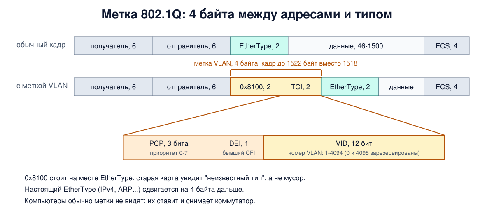
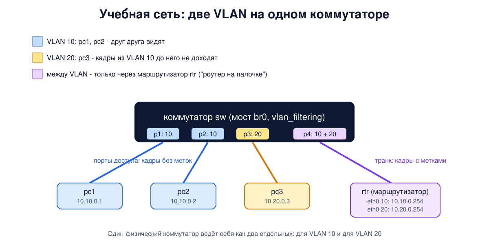

# Урок 18. VLAN и 802.1Q: несколько сетей на одних коммутаторах

В уроке 16 мы выяснили, что коммутатор делит сеть на области коллизий, но широковещательный домен у всех соединённых коммутаторов общий: широковещательный кадр доходит до каждого. В уроке 17 видели, что петля или шторм кладут весь этот домен сразу. А ещё в одной сети оказываются бухгалтерия, гостевой Wi-Fi, камеры и серверы, и все они могут слать кадры друг другу. Разделить сеть можно, купив отдельные коммутаторы и проложив отдельные кабели. Но есть способ проще: виртуальные локальные сети, VLAN. Сегодня разберём, как они устроены, соберём две VLAN на одном коммутаторе в Linux и обсудим, как атакующий может попытаться перепрыгнуть из одной VLAN в другую.

## Зачем делить сеть

Таненбаум рассказывает, как это было. Во времена толстого жёлтого кабеля (урок 14) компьютер подключали к тому кабелю, что проходил рядом, и в одной сети оказывались соседи по коридору, а не по отделу. Потом здания переделали под витую пару, идущую из каждого кабинета в шкаф с концентраторами (позже - коммутаторами), и появилась возможность группировать компьютеры логически. Зачем это нужно, он объясняет тремя причинами:

- **безопасность**: серверы для внешнего мира и компьютеры отдела кадров не должны быть в одной сети;
- **нагрузка**: чей-то тяжёлый трафик не должен мешать остальным;
- **широковещание**: чем больше сеть, тем больше в ней широковещательных кадров (например, запросов ARP, урок 24), и тем больше вред от шторма.

Олифер добавляет, почему не хватает фильтров на коммутаторах (они разбирались в его главе 11): фильтр задаётся по отдельным MAC-адресам, что громоздко, и главное - он не может остановить широковещательный трафик. Сети на одних коммутаторах поэтому называют плоскими.

Раньше разделение делали физически: отдельные коммутаторы, отдельные кабели, а связь между сетями - через маршрутизатор. Но сотрудник переходит в другой отдел, оставаясь в том же кабинете, - и администратору приходится перекидывать кабели. VLAN позволяет делать то же самое настройкой, не трогая проводов.

## Что такое VLAN

Олифер даёт определение: **виртуальная локальная сеть** (Virtual LAN, VLAN) - группа узлов, трафик которой, включая широковещательный, на канальном уровне полностью изолирован от трафика других узлов. Кадр из одной VLAN не попадёт в другую, какой бы у него ни был адрес: индивидуальный, групповой или широковещательный. Внутри VLAN всё работает как обычно: коммутатор учится и отправляет кадры только туда, где получатель (урок 16).

Каждая VLAN - это отдельный **широковещательный домен**. По сути, один физический коммутатор превращается в несколько логических, которые ничего не знают друг о друге. А чтобы компьютеры из разных VLAN могли общаться, нужен **маршрутизатор** - отдельный или встроенный в коммутатор (такие называют коммутаторами третьего уровня). Олифер подчёркивает, что это и есть смысл VLAN: сделать изолированные сети, а связь между ними пропустить через маршрутизатор, где её можно контролировать.

Самый простой способ построить VLAN на одном коммутаторе - **группировка портов**: каждому порту приписывается номер VLAN. Кадр, пришедший на порт VLAN 10, уйдёт только на порты VLAN 10. Олифер упоминает и группировку по MAC-адресам, но она требует много ручной работы и не прижилась.

## Метка 802.1Q

Сложности начинаются, когда VLAN растягивается на несколько коммутаторов. Если между коммутаторами один кабель, как второй коммутатор узнает, из какой VLAN пришёл кадр? Можно протянуть отдельный кабель для каждой VLAN, но это расточительно. Поэтому в сам кадр добавили поле с номером VLAN. Долгое время у каждого производителя был свой способ, и оборудование было несовместимо. В 1998 году вышел стандарт **IEEE 802.1Q**. Таненбаум замечает, что это было почти немыслимо: пришлось менять формат кадра Ethernet, который до того не трогали.



**Метка VLAN** (тег) занимает 4 байта и вставляется между адресом отправителя и полем EtherType (урок 15):

- первые 2 байта - значение **0x8100** на том месте, где обычно стоит EtherType. Оно больше 1500, поэтому любая карта поймёт его как тип, а не длину, а для понимающих это знак "дальше метка";
- следующие 2 байта - **TCI** (Tag Control Information): 3 бита **приоритета** (PCP, 8 классов трафика для качества обслуживания), 1 бит, который у Олифера и Таненбаума называется CFI (остался от Token Ring, в Ethernet равен 0; в современных редакциях стандарта этот бит переименован в DEI и помечает кадры, которые можно выбросить первыми при перегрузке), и 12 бит **VID** - номер VLAN;
- за меткой идёт настоящий EtherType: IPv4, ARP и так далее.

12 бит дают 4096 значений. Олифер так и пишет - до 4096 VLAN, но на практике их 4094: значения 0 и 4095 зарезервированы (0 означает, что кадр не относится ни к какой VLAN и метка несёт только приоритет; коммутатор отнесёт такой кадр к VLAN порта). Кадр с меткой становится на 4 байта длиннее, поэтому максимум вырос с 1518 до 1522 байт (урок 15). Поле данных при этом осталось до 1500 байт; у Олифера сказано, что оно уменьшилось на 4 байта, - это неточность. Таненбаум объясняет, почему это не сломало старое оборудование: метки используют в основном коммутаторы, а до обычных компьютеров кадры доходят уже без меток.

У провайдеров, которые возят через свою сеть VLAN многих клиентов, есть стандарт 802.1ad (Q-in-Q): кадр получает две метки, внешнюю (провайдера) и внутреннюю (клиента).

## Порты доступа и транки

Самая распространённая схема - **порт доступа** и **транк**:

- **порт доступа** (access port) смотрит на конечный узел: компьютер, принтер, камеру. Он принадлежит ровно одной VLAN. Кадры от компьютера приходят без меток, коммутатор считает их кадрами VLAN этого порта. Отправляя кадр компьютеру, коммутатор метку снимает. Компьютер про VLAN ничего не знает.
- **транк** (trunk) соединяет коммутаторы между собой или коммутатор с маршрутизатором и несёт кадры многих VLAN сразу. На транке кадры идут **с метками** (кроме кадров естественной VLAN, о ней ниже), чтобы на другой стороне было понятно, какой VLAN принадлежит каждый. Транк можно ограничить списком разрешённых VLAN.

Олифер описывает и более гибкую схему, в которой порт может одновременно принимать кадры с метками и без. Кадры без метки при этом относятся к одной выбранной VLAN. Её называют **естественной** (native VLAN). Обычно это VLAN 1 - та же, в которую изначально входят все порты (VLAN по умолчанию, default VLAN), но это разные понятия, и номер естественной VLAN можно поменять. Олифер замечает, что поэтому новый коммутатор без настройки работает как обычный. Запомни про естественную VLAN: она понадобится в разделе про атаки.

Когда коммутатор решает, куда отправить кадр, он дополнительно проверяет, разрешена ли VLAN этого кадра на выходном порту. И MAC-адреса он изучает **отдельно в каждой VLAN**: один и тот же MAC-адрес в VLAN 10 и VLAN 20 - это две разные записи. Это мы увидим в опыте.

Настраивать одинаковые VLAN на десятках коммутаторов вручную утомительно и чревато ошибками. Олифер перечисляет протоколы, которые распространяют список VLAN по сети автоматически: фирменный VTP у Cisco, стандартные GVRP и заменивший его в 2007 году MVRP. А протокол **MSTP**, развитие RSTP из урока 17, позволяет строить разные покрывающие деревья для разных групп VLAN, чтобы запасные связи не простаивали, а несли трафик других VLAN. В отличие от PVST+ у Cisco (урок 17), где своё дерево у каждой VLAN, MSTP обходится несколькими деревьями на все VLAN.

## Как это увидеть в Linux

Мост Linux умеет работать как коммутатор с VLAN, если включить у него фильтрацию VLAN (`vlan_filtering 1`). Соберём коммутатор `sw` и подключим к нему:

- **pc1** и **pc2** - порты доступа VLAN 10, адреса 10.10.0.1 и 10.10.0.2;
- **pc3** - порт доступа VLAN 20, адрес 10.20.0.3;
- **rtr** - маршрутизатор на транке, по которому идут VLAN 10 и 20 с метками. У него два виртуальных интерфейса: `eth0.10` (адрес 10.10.0.254) и `eth0.20` (10.20.0.254). Так маршрутизатор с одним кабелем обслуживает две сети; такую схему называют "роутер на палочке" (router on a stick).



Адреса и маршруты - тема блока 3, здесь достаточно знать, что компьютеры из разных сетей 10.10.0.0/24 и 10.20.0.0/24 обращаются друг к другу через маршрутизатор.

Создай файл `vlan-lab.sh` и запусти `bash vlan-lab.sh`. Нужны Linux (подойдёт WSL2), права sudo и tcpdump. Всё создаётся в учебных пространствах имён и в конце удаляется; если скрипт прервать, достаточно запустить его снова.

```
set -u
command -v tcpdump >/dev/null || { echo "установи tcpdump: sudo apt install tcpdump"; exit 1; }
# убрать остатки прошлого запуска
for n in sw pc1 pc2 pc3 rtr; do sudo ip netns del $n 2>/dev/null; done
# коммутатор sw (мост br0 с поддержкой VLAN) и четыре "компьютера"
for n in sw pc1 pc2 pc3 rtr; do
  sudo ip netns add $n
  sudo ip netns exec $n sysctl -qw net.ipv6.conf.all.disable_ipv6=1 net.ipv6.conf.default.disable_ipv6=1
done
sudo ip netns exec sw ip link add br0 type bridge vlan_filtering 1
i=1
for n in pc1 pc2 pc3 rtr; do
  sudo ip link add p$i netns sw type veth peer name eth0 netns $n
  sudo ip netns exec $n ip link set eth0 address 02:00:00:00:00:0$i
  sudo ip netns exec sw ip link set p$i master br0
  sudo ip netns exec sw ip link set p$i up
  sudo ip netns exec $n ip link set eth0 up
  i=$((i+1))
done
sudo ip netns exec sw ip link set br0 up
# порты доступа: p1, p2 - VLAN 10, p3 - VLAN 20; транк p4 - VLAN 10 и 20 с тегами
for p in p1 p2 p3 p4; do sudo ip netns exec sw bridge vlan del dev $p vid 1; done
sudo ip netns exec sw bridge vlan add dev p1 vid 10 pvid untagged
sudo ip netns exec sw bridge vlan add dev p2 vid 10 pvid untagged
sudo ip netns exec sw bridge vlan add dev p3 vid 20 pvid untagged
sudo ip netns exec sw bridge vlan add dev p4 vid 10
sudo ip netns exec sw bridge vlan add dev p4 vid 20
# адреса: VLAN 10 - 10.10.0.0/24, VLAN 20 - 10.20.0.0/24
sudo ip netns exec pc1 ip addr add 10.10.0.1/24 dev eth0
sudo ip netns exec pc2 ip addr add 10.10.0.2/24 dev eth0
sudo ip netns exec pc3 ip addr add 10.20.0.3/24 dev eth0
sudo ip netns exec pc1 ip route add default via 10.10.0.254
sudo ip netns exec pc2 ip route add default via 10.10.0.254
sudo ip netns exec pc3 ip route add default via 10.20.0.254
# маршрутизатор rtr на транке: подынтерфейсы eth0.10 и eth0.20
for v in 10 20; do
  sudo ip netns exec rtr ip link add link eth0 name eth0.$v type vlan id $v
  sudo ip netns exec rtr ip addr add 10.$v.0.254/24 dev eth0.$v
  sudo ip netns exec rtr ip link set eth0.$v up
done
sudo ip netns exec rtr sysctl -qw net.ipv4.ip_forward=1
sleep 1
echo '--- 1. VLAN table of the switch'
sudo ip netns exec sw bridge vlan show
echo '--- 2. pc1 -> pc2 (same VLAN 10)'
sudo ip netns exec pc1 ping -c 2 -q 10.10.0.2 | grep packets
echo '--- 3. pc3 gets address 10.10.0.3 too, pc1 -> 10.10.0.3'
sudo ip netns exec pc3 ip addr add 10.10.0.3/24 dev eth0
sudo ip netns exec pc1 ping -c 2 -q -W 1 10.10.0.3 | grep packets
sudo ip netns exec pc3 ip addr del 10.10.0.3/24 dev eth0
echo '--- 4. pc1 -> pc3 through the router, capture on the trunk'
f=$(mktemp)
sudo ip netns exec rtr timeout 4 tcpdump -i eth0 -n -e -l icmp 2>/dev/null > "$f" &
sleep 1
sudo ip netns exec pc1 ping -c 1 -q 10.20.0.3 | grep packets
wait
sed -E 's/^[0-9:.]+ //' "$f"; rm -f "$f"
echo '--- 5. MAC table: learned separately per VLAN'
sudo ip netns exec sw bridge fdb show br br0 | grep -v permanent
echo '--- 6. pc1 sends frames tagged with VLAN 20 into its access port'
sudo ip netns exec pc1 ip link add link eth0 name eth0.20 type vlan id 20
sudo ip netns exec pc1 ip addr add 10.20.0.99/24 dev eth0.20
sudo ip netns exec pc1 ip link set eth0.20 up
f=$(mktemp)
sudo ip netns exec pc3 timeout 4 tcpdump -i eth0 -n -e -l ether src 02:00:00:00:00:01 2>/dev/null > "$f" &
sleep 1
sudo ip netns exec pc1 ping -c 2 -q -W 1 10.20.0.3 | grep packets
wait
echo "frames from pc1 seen by pc3: $(grep -c . "$f")"; rm -f "$f"
echo '--- cleanup'
for n in sw pc1 pc2 pc3 rtr; do sudo ip netns del $n; done
ip netns list | grep -cE '^(sw|pc[123]|rtr)( |$)'
```

Вот что получилось на нашем сервере:

```
--- 1. VLAN table of the switch
port              vlan-id  
br0               1 PVID Egress Untagged
p1                10 PVID Egress Untagged
p2                10 PVID Egress Untagged
p3                20 PVID Egress Untagged
p4                10
                  20
--- 2. pc1 -> pc2 (same VLAN 10)
2 packets transmitted, 2 received, 0% packet loss, time 1049ms
--- 3. pc3 gets address 10.10.0.3 too, pc1 -> 10.10.0.3
2 packets transmitted, 0 received, 100% packet loss, time 1053ms
--- 4. pc1 -> pc3 through the router, capture on the trunk
1 packets transmitted, 1 received, 0% packet loss, time 0ms
02:00:00:00:00:01 > 02:00:00:00:00:04, ethertype 802.1Q (0x8100), length 102: vlan 10, p 0, ethertype IPv4 (0x0800), 10.10.0.1 > 10.20.0.3: ICMP echo request, id 62639, seq 1, length 64
02:00:00:00:00:04 > 02:00:00:00:00:03, ethertype 802.1Q (0x8100), length 102: vlan 20, p 0, ethertype IPv4 (0x0800), 10.10.0.1 > 10.20.0.3: ICMP echo request, id 62639, seq 1, length 64
02:00:00:00:00:03 > 02:00:00:00:00:04, ethertype 802.1Q (0x8100), length 102: vlan 20, p 0, ethertype IPv4 (0x0800), 10.20.0.3 > 10.10.0.1: ICMP echo reply, id 62639, seq 1, length 64
02:00:00:00:00:04 > 02:00:00:00:00:01, ethertype 802.1Q (0x8100), length 102: vlan 10, p 0, ethertype IPv4 (0x0800), 10.20.0.3 > 10.10.0.1: ICMP echo reply, id 62639, seq 1, length 64

--- 5. MAC table: learned separately per VLAN
02:00:00:00:00:01 dev p1 vlan 10 master br0 
02:00:00:00:00:02 dev p2 vlan 10 master br0 
02:00:00:00:00:03 dev p3 vlan 20 master br0 
02:00:00:00:00:04 dev p4 vlan 20 master br0 
02:00:00:00:00:04 dev p4 vlan 10 master br0 
--- 6. pc1 sends frames tagged with VLAN 20 into its access port
2 packets transmitted, 0 received, 100% packet loss, time 1006ms
frames from pc1 seen by pc3: 0
--- cleanup
0
```

Разберём по шагам.

- **Шаг 1: таблица VLAN.** `PVID` - VLAN, в которую попадают кадры, пришедшие без метки, `Egress Untagged` - отправлять кадры этой VLAN без метки. Так выглядят порты доступа: p1 и p2 в VLAN 10, p3 в VLAN 20. У транка p4 две VLAN без этих пометок: кадры идут с метками, а кадры без метки он не принимает, потому что VLAN 1 мы с портов убрали: естественной VLAN у нашего транка нет. Строка `br0` относится к самому мосту как к интерфейсу этой машины и нам не мешает.
- **Шаг 2**: pc1 и pc2 в одной VLAN, пинг проходит, как в уроке 16.
- **Шаг 3: изоляция.** Мы дали pc3 ещё и адрес 10.10.0.3 из сети VLAN 10, так что по IP-адресам он теперь "свой" для pc1. Но пинг не прошёл: чтобы отправить пакет, pc1 рассылает широковещательный запрос ARP (урок 24), а коммутатор не выпускает его за пределы VLAN 10. Кадр до pc3 просто не доходит. Изоляция работает на канальном уровне и от IP-адресов не зависит.
- **Шаг 4: транк и маршрутизатор.** pc1 обращается к pc3 через rtr, и мы слушаем кабель транка. Все четыре кадра - с меткой 802.1Q (`ethertype 802.1Q (0x8100)`), и tcpdump показывает её содержимое: `vlan 10, p 0` - номер VLAN и приоритет, за ним настоящий EtherType. Запрос от pc1 пришёл по транку в VLAN 10 - метку поставил коммутатор, pc1 отправлял кадр без неё. Маршрутизатор отправил тот же пакет в VLAN 20, уже со своим MAC-адресом отправителя, и коммутатор доставил его pc3 без метки. Ответ проделал обратный путь. Длина 102 байта - это 98 байт обычного кадра с пингом (14 байт заголовка, 20 байт IP, 64 байта ICMP) плюс 4 байта метки; контрольную сумму FCS tcpdump не показывает.
- **Шаг 5: таблица MAC-адресов.** У каждой записи есть номер VLAN. Адрес маршрутизатора `02:00:00:00:00:04` записан дважды, в VLAN 10 и в VLAN 20: для коммутатора это два разных адресата в двух разных "коммутаторах".
- **Шаг 6: попытка схитрить.** pc1 создал у себя интерфейс с меткой VLAN 20 и попробовал достучаться до pc3 напрямую. Кадры с меткой 20 пришли на порт доступа VLAN 10, и коммутатор их выбросил: VLAN 20 на этом порту не разрешена (это называют фильтрацией на входе). pc3 не получил от pc1 ни одного кадра. Так и должно быть в правильно настроенной сети: порт доступа не принимает чужие метки. Ниже увидим, при каких ошибках настройки эта проверка не спасает.
- В конце скрипт удаляет всё, что создал; `0` в последней строке означает, что учебных пространств имён не осталось.

## Атаки и защита: VLAN hopping

VLAN часто используют как границу безопасности: гости отдельно, камеры отдельно, серверы отдельно. **VLAN hopping** ("перепрыгивание" между VLAN) - общее название атак, при которых злоумышленник из своей VLAN отправляет кадры в чужую, минуя маршрутизатор и его правила. В нашем опыте (шаг 6) это не удалось. Известны два принципа, которые работают только при определённых ошибках настройки.

**Подмена коммутатора** (switch spoofing). Некоторые коммутаторы умеют автоматически договариваться с соседом, делать ли порт транком. У Cisco для этого есть протокол DTP, и в ряде режимов порт становится транком, если сосед об этом попросит. Если такой режим оставлен на пользовательском порту, устройство злоумышленника может представиться коммутатором и получить транк, а с ним - доступ ко всем VLAN, которые по нему идут.

**Двойная метка** (double tagging). Злоумышленник находится в VLAN, которая совпадает с естественной VLAN транка (часто это VLAN 1, если её не меняли). Он отправляет кадр с двумя метками: внешняя - номер его собственной VLAN, внутренняя - номер VLAN жертвы. Первый коммутатор снимает внешнюю метку и отправляет кадр по транку, а поскольку это естественная VLAN, то без неё. Но внутренняя метка осталась, и второй коммутатор принимает кадр как кадр VLAN жертвы. Атака работает в одну сторону: ответы жертвы обратно не дойдут. Но и этого может хватить, например чтобы отправить вредный пакет устройству, которое считает себя в изолированной сети.

Как защищаются:

- **Порты доступа - явно доступом.** Пользовательские порты жёстко настраиваются как порты доступа в одной VLAN, автоматическое согласование транка (DTP) на них выключено. Транки тоже настраиваются явно.
- **Естественная VLAN не для людей.** На транках естественной делают отдельную, ни для чего не используемую VLAN, а не VLAN 1 и не VLAN пользователей. Многие коммутаторы умеют помечать и кадры естественной VLAN. Тогда коммутатор не снимет внешнюю метку, и на той стороне кадр останется в естественной VLAN, а не попадёт в VLAN жертвы.
- **Список разрешённых VLAN на транке**: только те, что действительно нужны на той стороне.
- **Неиспользуемые порты** выключены и отнесены к пустой VLAN, никуда не ведущей.
- **Фильтрация на входе**: порт доступа выбрасывает кадры с чужими метками, как в шаге 6. Мост Linux с vlan_filtering делает это всегда, во многих коммутаторах так по умолчанию, но проверить стоит.
- **Правила между VLAN.** Изоляция VLAN ничего не стоит, если маршрутизатор между ними пропускает всё подряд. Настоящая граница - это правила фильтрации на маршрутизаторе или межсетевом экране (блоки 3 и 6).

И остаётся всё, что говорилось о коммутаторах в уроках 16 и 17: внутри одной VLAN работают и переполнение таблицы, и подмена адреса, и атаки на STP. VLAN уменьшает круг тех, кто может до тебя дотянуться на канальном уровне, но шифрование по-прежнему нужно.

## Итог

- VLAN - группа узлов, изолированная на канальном уровне, в том числе от широковещательных кадров. Каждая VLAN - отдельный широковещательный домен, связь между VLAN - только через маршрутизатор.
- Метка IEEE 802.1Q (1998) - 4 байта после адреса отправителя: 0x8100, затем 3 бита приоритета, 1 бит DEI (бывший CFI) и 12 бит номера VLAN (рабочие значения 1-4094). Кадр с меткой - до 1522 байт.
- Порт доступа принадлежит одной VLAN и работает с кадрами без меток: метку ставит и снимает коммутатор. Транк несёт кадры многих VLAN с метками; кадры без метки на нём относятся к естественной VLAN.
- Коммутатор изучает MAC-адреса отдельно в каждой VLAN и не выпускает кадр туда, где его VLAN не разрешена.
- VLAN hopping возможен при ошибках настройки: автоматическое согласование транка на пользовательском порту и двойная метка через естественную VLAN. Защита: явные порты доступа и транки, отдельная неиспользуемая естественная VLAN или метки для неё, списки VLAN на транках, выключенные лишние порты и правила на маршрутизаторе между VLAN.

## Что почитать

- Олифер, "Компьютерные сети", глава 11, с. 364-374: виртуальные локальные сети, группировка портов, тег 802.1Q, схема "транк - линия доступа", гибкая настройка портов, VTP, GVRP и MVRP, MSTP.
- Таненбаум, "Компьютерные сети", раздел 4.7.5, с. 397-403: зачем нужны VLAN, пример с серой и белой сетями, стандарт IEEE 802.1Q и формат кадра.
