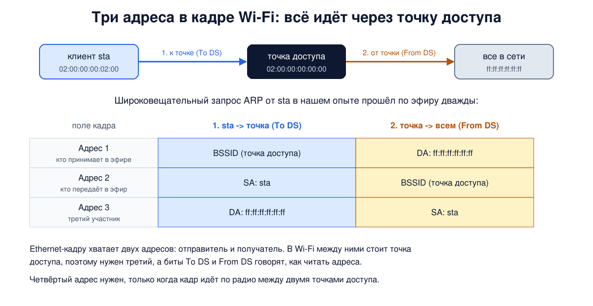
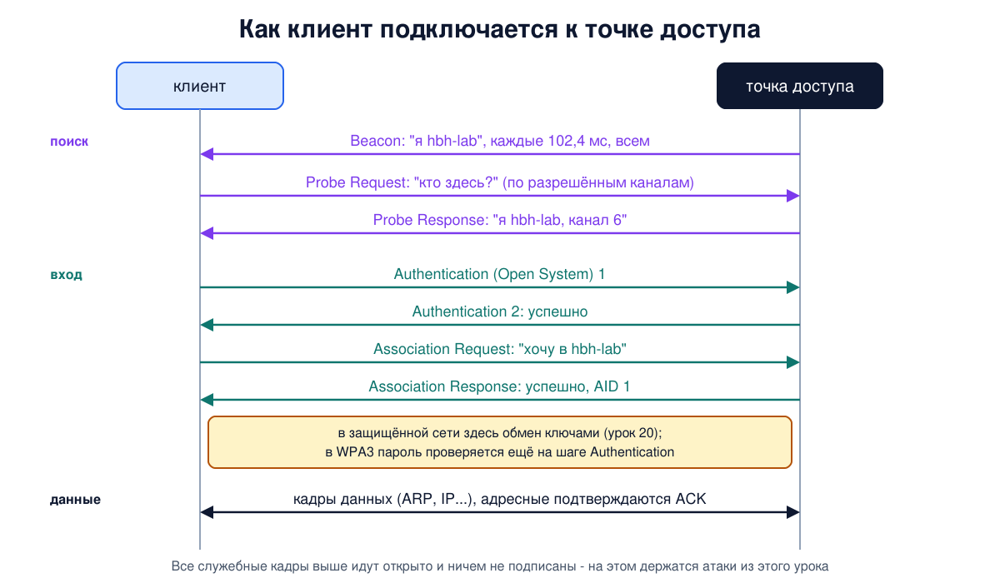

# Урок 19. Wi-Fi: как устроена сеть 802.11 и как к ней подключаются

В уроке 14 мы сказали, что Wi-Fi - тоже общая среда, как классический Ethernet: эфир слышат все, кто рядом. В уроке 13 разобрали, почему в радио нельзя обнаруживать коллизии и как их избегают. Сегодня соберём картину целиком: из чего состоит сеть Wi-Fi, как выглядит её кадр, почему в нём три адреса вместо двух и что происходит в эфире, когда телефон подключается к точке доступа. Всё это увидим своими глазами на виртуальных радио в Linux, а в конце разберём две классические атаки, которые вытекают прямо из устройства протокола: поддельную точку доступа и принудительное отключение.

## Точка доступа, BSS и ESS

Стандарт беспроводных локальных сетей - **IEEE 802.11**, первая версия вышла в 1997 году. Название **Wi-Fi** - торговая марка объединения производителей Wi-Fi Alliance, которое проверяет совместимость оборудования. (Олифер расшифровывает его как Wireless Fidelity по аналогии с Hi-Fi; сам Wi-Fi Alliance подчёркивает, что это просто название, а не сокращение.)

Основной элемент сети в стандарте - **BSS** (Basic Service Set, базовый набор услуг): группа устройств, которые работают на одном канале с одинаковыми параметрами. Сети бывают двух видов:

- **инфраструктурная** - с **точкой доступа** (access point, AP) в центре. Клиенты общаются только с точкой, и **весь трафик идёт через неё**, даже между двумя телефонами в одной комнате. Точка обычно подключена проводом к остальной сети, отсюда и название: доступ в сеть;
- **ad hoc** (IBSS) - устройства общаются напрямую, без точки доступа. Таненбаум замечает, что такие сети не слишком популярны: всем нужен выход в интернет, а он у точки доступа.

Несколько точек доступа, объединённых **распределительной системой** (distribution system, обычно проводной Ethernet), образуют **ESS** (Extended Service Set): одну большую сеть, по которой клиент может перемещаться, переходя от точки к точке. Так устроен Wi-Fi в офисе или аэропорту.

У каждой сети есть два имени:

- **SSID** - имя сети, которое видит человек, до 32 байт. Олифер приводит пример: по имени Smirnov-family понятно, чья это сеть. Но имя выбирает владелец точки, и никто не мешает другому выбрать такое же - это важно для раздела про атаки;
- **BSSID** - MAC-адрес радиоинтерфейса точки доступа (урок 15). У каждой точки в ESS (точнее, у каждой сети на каждом радио точки) свой BSSID при общем SSID.

Типичный домашний "роутер" - это сразу точка доступа, коммутатор на несколько портов и маршрутизатор в одной коробке.

## Физический уровень: поколения Wi-Fi

Wi-Fi работает в нелицензируемых диапазонах: 2,4 ГГц, 5 ГГц, а в новых версиях и 6 ГГц. Лицензия не нужна, но и соседей по эфиру много: Таненбаум вспоминает микроволновки, беспроводные телефоны и ворота гаражей. Диапазон 2,4 ГГц загружен сильнее, 5 ГГц свободнее, но хуже проходит сквозь стены (урок 9).

| Стандарт | Название | Год | Диапазон | Главное новшество |
|---|---|---|---|---|
| 802.11b | - | 1999 | 2,4 ГГц | расширение спектра, до 11 Мбит/с |
| 802.11a | - | 1999 | 5 ГГц | OFDM (урок 10), до 54 Мбит/с |
| 802.11g | - | 2003 | 2,4 ГГц | OFDM в 2,4 ГГц, до 54 Мбит/с |
| 802.11n | Wi-Fi 4 | 2009 | 2,4 и 5 ГГц | MIMO - несколько антенн и потоков, каналы 40 МГц |
| 802.11ac | Wi-Fi 5 | 2013 | 5 ГГц | каналы до 160 МГц, 256-QAM, многопользовательский MIMO |
| 802.11ax | Wi-Fi 6 и 6E | 2019-2021 | 2,4, 5 и 6 ГГц | OFDMA, 1024-QAM, расписание пробуждений (TWT) |
| 802.11be | Wi-Fi 7 | 2024 | 2,4, 5 и 6 ГГц | каналы до 320 МГц, работа на нескольких каналах сразу |

(Для 802.11ax 2019 - начало сертификации Wi-Fi 6, а сам стандарт IEEE утвердили в 2021 году; 6E - это Wi-Fi 6 в диапазоне 6 ГГц. Строка про 802.11be - уже не из книг, а по данным IEEE и Wi-Fi Alliance.) В 2018 году Wi-Fi Alliance ввёл название Wi-Fi 6 для нового 802.11ax и задним числом Wi-Fi 4 и 5 для 802.11n и 802.11ac, чтобы людям не приходилось запоминать буквы.

Цифры скорости в таблицах - теоретический максимум при идеальных условиях. На деле все версии постоянно подстраивают скорость под качество сигнала: слабый сигнал - более простая и надёжная модуляция и меньшая скорость, сильный - быстрее. Это называют **адаптацией скорости**. Таненбаум подчёркивает, что скорости различаются в десятки раз, а как именно их выбирать, стандарт не говорит - это решает производитель.

## Доступ к эфиру: CSMA/CA вживую

Основной режим доступа в 802.11 называется **DCF** (Distributed Coordination Function) - распределённый, без центрального управления. Он реализует CSMA/CA из урока 13:

1. Станция, у которой есть кадр, слушает эфир. Он должен быть свободен не меньше короткой паузы **DIFS**.
2. Затем станция выжидает ещё случайное число **слотов** из диапазона от 0 до размера **окна конкуренции** (CW). Если за это время эфир занимает кто-то другой, счётчик замораживается и продолжается, когда эфир снова освободится. Так тот, кто долго ждал, в следующий раз оказывается ближе к началу очереди.
3. Когда счётчик дошёл до нуля, станция передаёт кадр.
4. Получатель отвечает подтверждением **ACK** через ещё более короткую паузу **SIFS**. Раз SIFS короче DIFS, никто не успеет вклиниться между кадром и его подтверждением.
5. Нет ACK - станция считает, что кадр пропал (коллизия или помеха), удваивает окно конкуренции и пробует снова, как двоичная экспоненциальная выдержка в Ethernet (урок 14). После нескольких неудач кадр выбрасывают.

Кроме физического прослушивания есть **виртуальное**. В каждом кадре есть поле **Duration** (длительность): сколько микросекунд эфир ещё будет занят этим обменом, включая подтверждение. Услышав кадр, станции заводят у себя таймер **NAV** и молчат до его окончания, даже если сигнала не слышат. На этом же построен механизм RTS/CTS из урока 13: и RTS, и CTS несут в поле Duration время всего обмена, поэтому молчат все, кто услышал хотя бы один из них. Таненбаум честно пишет, что как общее средство от скрытых станций RTS/CTS не прижился; сегодня его включают в основном перед длинными кадрами (современный Wi-Fi склеивает несколько кадров в один большой) и в варианте CTS-to-self, когда станция посылает CTS самой себе, чтобы старые устройства, не понимающие новую модуляцию, промолчали. А централизованный режим **PCF**, где точка доступа по очереди опрашивает станции, почти не применяется: запретить соседней сети шуметь в том же эфире невозможно. Приоритеты для голоса и видео добавило расширение 802.11e (2005): у важного трафика паузы перед передачей короче, у фонового - длиннее.

Одно неожиданное следствие Таненбаум называет **аномалией скорости**. Пусть одна станция передаёт на 6 Мбит/с, а другая, рядом с точкой, на 54 Мбит/с, и они по очереди отправляют по кадру. Медленный кадр занимает эфир в 9 раз дольше, и в итоге обе получают около 5,4 Мбит/с: быстрая станция опускается почти до скорости медленной. Таненбаум пишет, что механизм TXOP из 802.11e позволяет выдавать станциям равное **время** в эфире, а не равное число кадров: тогда получится 3 и 27 Мбит/с. На практике такую справедливость по времени (airtime fairness) обеспечивает планировщик точки доступа, и умеют это не все точки. Вывод для жизни: одно старое устройство на краю зоны покрытия может заметно замедлить всю сеть.

## Кадр 802.11

Кадр Wi-Fi сложнее кадра Ethernet. Кадры бывают трёх типов:

- **данные** - то, ради чего всё затевалось;
- **управляющие** (control) - короткие кадры, обслуживающие сам обмен: ACK, RTS, CTS;
- **кадры управления сетью** (management) - маяки, поиск сети, подключение и отключение. Дальше в уроке мы будем называть их **служебными**. Нам они особенно интересны.

Поля кадра данных:

- **Frame Control** (2 байта): версия, тип и подтип кадра и набор флагов. Среди них **To DS** и **From DS** - идёт ли кадр к распределительной системе или от неё, **Retry** - повторная передача, **Power Management** - станция уходит в режим сна, **Protected** - содержимое зашифровано (урок 20);
- **Duration** (2 байта) - та самая длительность для NAV;
- **три адреса** по 6 байт, а в особом случае четыре (о них ниже);
- **Sequence** (2 байта) - номер кадра и номер фрагмента, чтобы отбрасывать дубликаты после повторов;
- **данные** - до 2312 байт; в начале у кадров с IP стоит короткий заголовок LLC/SNAP с тем же EtherType, что и в Ethernet (урок 15);
- **FCS** - та же 32-битная CRC (урок 11).

Кадр можно разбить на **фрагменты**, каждый со своей контрольной суммой и своим ACK: в шумном эфире короткий кадр имеет больше шансов дойти целым. (В современных версиях фрагментацию почти не используют: наоборот, несколько кадров склеивают в один большой, а получатель одним общим подтверждением сообщает, какие части дошли, и повторяют только пропавшие.) Таненбаум даёт пример: при вероятности ошибки в бите 1 из 10 000 полный кадр Ethernet из 12 144 бит доходит целым реже чем в 30% случаев, а кадр втрое короче - примерно в двух случаях из трёх.

**Зачем три адреса.** В Ethernet кадру достаточно двух адресов: кто отправил и кто получит. В инфраструктурной сети Wi-Fi между ними всегда стоит точка доступа. Кадр от телефона к серверу в интернете в эфире принимает точка доступа, но предназначен он не ей, а шлюзу за ней. Поэтому в кадре есть адрес того, кто принимает кадр в эфире, того, кто передаёт в эфир, и третий - конечного отправителя или получателя. Как читать эти адреса, говорят биты To DS и From DS. Мы увидим это в опыте на примере широковещательного запроса ARP. Четвёртый адрес нужен, когда кадр по радио передают между собой две точки доступа.



## Подключение к сети

Как телефон находит сеть и подключается к ней:

1. **Поиск.** Точка доступа регулярно рассылает всем кадры-**маяки** (beacon) с именем сети, BSSID, поддерживаемыми скоростями и параметрами безопасности. Интервал обычно 100 единиц времени (TU) по 1024 мкс, то есть 102,4 мс - около 10 маяков в секунду. Олифер и Таненбаум округляют до 100 мс. Клиент может просто слушать маяки (**пассивный поиск**) или сам спросить "кто здесь?" кадром **Probe Request**, на который точки отвечают **Probe Response** (**активный поиск**).
2. **Аутентификация.** Клиент отправляет кадр Authentication. В открытой сети и в WPA2 это формальность (Open System): точка ответит "успешно" любому, а проверка пароля и выработка ключей идут после ассоциации. В WPA3-Personal пароль проверяется уже на этом шаге, по протоколу SAE, а ключи окончательно вырабатываются после ассоциации (урок 20). Старая схема с общим ключом WEP на этом шаге давно не используется.
3. **Ассоциация.** Клиент просит точку принять его в сеть (Association Request), точка отвечает Association Response и выдаёт номер ассоциации (AID). С этого момента точка знает, что клиент её, и пересылает ему кадры.
4. **Обмен ключами** в защищённой сети (четырёхэтапное рукопожатие, 4-way handshake, урок 20), затем получение IP-адреса по DHCP (блок 3).

Переход к другой точке той же сети - **повторная ассоциация** (reassociation). Отключение - кадры **Deauthentication** и **Disassociation**, их может отправить и клиент, и точка. Запомни их: они понадобятся в разделе про атаки.



**Экономия энергии.** Клиент ставит флаг Power Management и засыпает. Точка доступа копит кадры для него, а в каждом маяке перечисляет, для кого у неё что-то накопилось. Клиент просыпается к очередному маяку, видит себя в списке и забирает кадры. В Wi-Fi 6 появилось расписание пробуждений (TWT): точка и устройство заранее договариваются, когда устройству просыпаться, что особенно полезно для умного дома.

Осторожно с главой Олифера: в ней есть неточности. Определение скрытой станции там сформулировано наоборот (скрытые станции как раз **не** слышат друг друга, см. урок 13), размер слота для DSSS указан 1 мкс вместо 20 (и для FHSS 28 мкс вместо 50), требование уникального SSID противоречит тому, что имя может взять кто угодно (см. раздел про атаки), а скорость первой версии 802.11 - "до 1,2 Мбит/с" вместо 1 и 2 Мбит/с. А когда Олифер пишет, что аутентификация идёт после запроса на присоединение, речь о проверке, которая в защищённой сети идёт после ассоциации (в корпоративной - через сервер аутентификации, урок 20), а не о кадрах Authentication. В уроке использованы правильные значения.

## Как это увидеть в Linux

Настоящий Wi-Fi-адаптер для опыта не нужен. В ядре Linux есть модуль **mac80211_hwsim**, который создаёт виртуальные радиоинтерфейсы: они работают через тот же стек 802.11, что и настоящие карты, а "эфир" между ними моделирует ядро. Создадим три радио и разнесём их по сетевым пространствам имён:

- **hbh-ap** - точка доступа с открытой сетью `hbh-lab` на канале 6, её запустит hostapd - та же программа, что работает во многих настоящих роутерах;
- **hbh-sta** - клиент;
- **hbh-twin** - ещё одно радио, оно понадобится в конце.

Бонус модуля: интерфейс `hwsim0` слышит весь виртуальный эфир. Это похоже на **режим мониторинга** (monitor mode) настоящей карты, о котором шла речь в уроке 14: карта слушает канал, ни к какой сети не подключаясь, и отдаёт все кадры целиком, вместе со служебными. Разница в том, что настоящая карта в каждый момент слушает один канал, а `hwsim0` - сразу все. На нём мы и будем слушать.

Нужна машина с Linux, где есть модуль mac80211_hwsim: подойдёт Ubuntu на виртуальной машине или VPS с полной виртуализацией (KVM), но не контейнерный VPS (OpenVZ, LXC), где модули ядра загружать нельзя. На облачных образах модуль иногда лежит в пакете `linux-modules-extra-$(uname -r)`, в WSL2 его нет; скрипт это проверит и подскажет. Понадобятся пакеты `hostapd`, `iw` и `tcpdump` (`sudo apt install hostapd iw tcpdump`; служба hostapd в Ubuntu после установки выключена и сама не запускается). Настоящую Wi-Fi-карту скрипт не трогает, но если в системе работает NetworkManager (как в Ubuntu Desktop), он может попытаться подхватить новые радиоинтерфейсы, поэтому удобнее Ubuntu Server в виртуальной машине. Скрипт загружает модуль, всё делает в учебных пространствах имён `hbh-*` и в конце выгружает модуль и удаляет свои файлы (модули mac80211 и cfg80211, которые ядро подгрузило вместе с ним, остаются, это безвредно); если его прервать, достаточно запустить снова. Работает около 20 секунд.

Создай файл `wifi-lab.sh` и запусти `bash wifi-lab.sh`:

```
set -u
for c in hostapd iw tcpdump; do
  command -v $c >/dev/null || { echo "нужен $c: sudo apt install hostapd iw tcpdump"; exit 1; }
done
modinfo mac80211_hwsim >/dev/null 2>&1 || { echo "нет модуля mac80211_hwsim: попробуй sudo apt install linux-modules-extra-$(uname -r) (в WSL2 и контейнерах его не будет)"; exit 1; }
# убрать остатки прошлого запуска
for n in hbh-ap hbh-twin hbh-sta; do
  sudo ip netns pids $n 2>/dev/null | xargs -r sudo kill
  sudo ip netns del $n 2>/dev/null
done
sudo rmmod mac80211_hwsim 2>/dev/null
lsmod | grep -q '^mac80211_hwsim' && { echo "модуль mac80211_hwsim занят, выгрузи его сам"; exit 1; }
d=$(mktemp -d)
# три виртуальных радио: точка доступа, "двойник" и клиент
sudo modprobe mac80211_hwsim radios=3
sleep 1
i=1
for p in $(for x in /sys/class/ieee80211/*; do readlink $x/device/driver | grep -q hwsim && basename $x; done | sort -V); do
  n=hbh-$(echo ap twin sta | cut -d' ' -f$i)
  sudo ip netns add $n
  sudo ip netns exec $n sysctl -qw net.ipv6.conf.all.disable_ipv6=1 net.ipv6.conf.default.disable_ipv6=1
  dev=$(ls /sys/class/ieee80211/$p/device/net/)
  sudo iw phy $p set netns name $n
  sudo ip netns exec $n ip link set $dev name wlan0
  i=$((i+1))
done
sudo ip link set hwsim0 up   # hwsim0 слышит весь эфир виртуальных радио
printf 'interface=wlan0\ndriver=nl80211\nssid=hbh-lab\nhw_mode=g\nchannel=6\n' > "$d/ap.conf"
sudo ip netns exec hbh-ap hostapd -B "$d/ap.conf" >/dev/null
sudo ip netns exec hbh-ap ip addr add 10.77.0.1/24 dev wlan0
sleep 2
sudo timeout 12 tcpdump -i hwsim0 -U -w "$d/air.pcap" 2>/dev/null &
sleep 1
echo '--- 1. sta scans the air'
sudo ip netns exec hbh-sta ip link set wlan0 up
sudo ip netns exec hbh-sta iw dev wlan0 scan | grep -E '^BSS|SSID:|freq:|beacon interval'
echo '--- 2. sta connects'
sudo ip netns exec hbh-sta iw dev wlan0 connect hbh-lab
sleep 2
sudo ip netns exec hbh-sta iw dev wlan0 link | grep -E 'Connected|SSID|freq|signal'
sudo ip netns exec hbh-sta ip addr add 10.77.0.2/24 dev wlan0
sudo ip netns exec hbh-sta ping -c 1 -q 10.77.0.1 | grep packets
wait
f() { tcpdump -r "$d/air.pcap" -e -n "$@" 2>/dev/null | sed -E 's/^[0-9:.]+ //; s/^[0-9]+us tsft //'; }
mhz() { grep -oE '[0-9]+ MHz' | cut -d' ' -f1 | sort -un | xargs; }
echo '--- 3. probes: who answered on which channel'
f 'type mgt subtype probe-req' | head -1
f 'type mgt subtype probe-resp' | head -1
echo "probe requests: $(f 'type mgt subtype probe-req' | wc -l), frequencies: $(f 'type mgt subtype probe-req' | mhz)"
echo "probe responses: $(f 'type mgt subtype probe-resp' | wc -l), frequencies: $(f 'type mgt subtype probe-resp' | mhz)"
echo '--- 4. joining the network'
f 'type mgt and (subtype auth or subtype assoc-req or subtype assoc-resp) or type ctl subtype ack' | awk '/Authentication/{p=1} p' | head -8
echo '--- 5. data frames'
f 'type data' | head -4
echo '--- 6. beacons'
n=$(f 'type mgt subtype beacon' | wc -l)
t=$(tcpdump -r "$d/air.pcap" -tt -n 'type mgt subtype beacon' 2>/dev/null | awk 'NR==1{a=$1} {b=$1} END{printf "%.2f", b-a}')
echo "$n beacons in $t s"
f 'type mgt subtype beacon' | head -1
echo '--- 7. a second access point with the same name'
printf 'interface=wlan0\ndriver=nl80211\nssid=hbh-lab\nhw_mode=g\nchannel=11\n' > "$d/twin.conf"
sudo ip netns exec hbh-twin hostapd -B "$d/twin.conf" >/dev/null
sleep 2
sudo ip netns exec hbh-sta iw dev wlan0 scan | grep -E '^BSS|SSID:|freq:'
echo '--- cleanup'
for n in hbh-ap hbh-twin hbh-sta; do
  sudo ip netns pids $n 2>/dev/null | xargs -r sudo kill
  sudo ip netns del $n
done
sleep 1
sudo rmmod mac80211_hwsim
sudo rm -rf "$d"
lsmod | grep -c '^mac80211_hwsim'
```

Вот что получилось на нашем сервере:

```
--- 1. sta scans the air
BSS 02:00:00:00:00:00(on wlan0)
	freq: 2437.0
	beacon interval: 100 TUs
	SSID: hbh-lab
--- 2. sta connects
Connected to 02:00:00:00:00:00 (on wlan0)
	SSID: hbh-lab
	freq: 2437.0
	signal: -30 dBm
1 packets transmitted, 1 received, 0% packet loss, time 0ms
--- 3. probes: who answered on which channel
1.0 Mb/s 2412 MHz 11b BSSID:ff:ff:ff:ff:ff:ff DA:ff:ff:ff:ff:ff:ff SA:02:00:00:00:02:00 Probe Request () [1.0 2.0 5.5 11.0 6.0 9.0 12.0 18.0 Mbit]
1.0 Mb/s 2437 MHz 11b BSSID:02:00:00:00:00:00 DA:02:00:00:00:02:00 SA:02:00:00:00:00:00 Probe Response (hbh-lab) [1.0* 2.0* 5.5* 11.0* 6.0 9.0 12.0 18.0 Mbit] CH: 6
probe requests: 11, frequencies: 2412 2417 2422 2427 2432 2437 2442 2447 2452 2457 2462
probe responses: 1, frequencies: 2437
--- 4. joining the network
1.0 Mb/s 2437 MHz 11b BSSID:02:00:00:00:00:00 DA:02:00:00:00:00:00 SA:02:00:00:00:02:00 Authentication (Open System)-1: Successful
2437 MHz RA:02:00:00:00:02:00 Acknowledgment
1.0 Mb/s 2437 MHz 11b BSSID:02:00:00:00:00:00 DA:02:00:00:00:02:00 SA:02:00:00:00:00:00 Authentication (Open System)-2: 
2437 MHz RA:02:00:00:00:00:00 Acknowledgment
1.0 Mb/s 2437 MHz 11b BSSID:02:00:00:00:00:00 DA:02:00:00:00:00:00 SA:02:00:00:00:02:00 Assoc Request (hbh-lab) [1.0 2.0 5.5 11.0 6.0 9.0 12.0 18.0 Mbit]
2437 MHz RA:02:00:00:00:02:00 Acknowledgment
1.0 Mb/s 2437 MHz 11b BSSID:02:00:00:00:00:00 DA:02:00:00:00:02:00 SA:02:00:00:00:00:00 Assoc Response AID(1) :: Successful
2437 MHz RA:02:00:00:00:00:00 Acknowledgment
--- 5. data frames
2.0 Mb/s 2437 MHz 11b BSSID:02:00:00:00:00:00 SA:02:00:00:00:02:00 DA:ff:ff:ff:ff:ff:ff LLC, dsap SNAP (0xaa) Individual, ssap SNAP (0xaa) Command, ctrl 0x03: oui Ethernet (0x000000), ethertype ARP (0x0806), length 28: Request who-has 10.77.0.1 tell 10.77.0.2, length 28
1.0 Mb/s 2437 MHz 11b DA:ff:ff:ff:ff:ff:ff BSSID:02:00:00:00:00:00 SA:02:00:00:00:02:00 LLC, dsap SNAP (0xaa) Individual, ssap SNAP (0xaa) Command, ctrl 0x03: oui Ethernet (0x000000), ethertype ARP (0x0806), length 28: Request who-has 10.77.0.1 tell 10.77.0.2, length 28
2.0 Mb/s 2437 MHz 11b DA:02:00:00:00:02:00 BSSID:02:00:00:00:00:00 SA:02:00:00:00:00:00 LLC, dsap SNAP (0xaa) Individual, ssap SNAP (0xaa) Command, ctrl 0x03: oui Ethernet (0x000000), ethertype ARP (0x0806), length 28: Reply 10.77.0.1 is-at 02:00:00:00:00:00, length 28
1.0 Mb/s 2437 MHz 11b BSSID:02:00:00:00:00:00 SA:02:00:00:00:02:00 DA:02:00:00:00:00:00 LLC, dsap SNAP (0xaa) Individual, ssap SNAP (0xaa) Command, ctrl 0x03: oui Ethernet (0x000000), ethertype IPv4 (0x0800), length 84: 10.77.0.2 > 10.77.0.1: ICMP echo request, id 4378, seq 1, length 64
--- 6. beacons
110 beacons in 11.16 s
1.0 Mb/s 2437 MHz 11b BSSID:02:00:00:00:00:00 DA:ff:ff:ff:ff:ff:ff SA:02:00:00:00:00:00 Beacon (hbh-lab) [1.0* 2.0* 5.5* 11.0* 6.0 9.0 12.0 18.0 Mbit] ESS CH: 6
--- 7. a second access point with the same name
BSS 02:00:00:00:00:00(on wlan0) -- associated
	freq: 2437.0
	SSID: hbh-lab
BSS 02:00:00:00:01:00(on wlan0)
	freq: 2462.0
	SSID: hbh-lab
--- cleanup
0
```

Разберём по шагам. MAC-адреса виртуальных радио модуль раздаёт сам: у точки доступа `02:00:00:00:00:00`, у двойника `02:00:00:00:01:00`, у клиента `02:00:00:00:02:00`. Уровень сигнала `-30 dBm` - условность виртуального эфира.

- **Шаг 1: поиск.** Клиент нашёл сеть `hbh-lab`: BSSID - адрес точки доступа, частота 2437 МГц - это канал 6, интервал маяков 100 TU.
- **Шаг 2: подключение.** `iw connect` подключил клиента к открытой сети, и первый же пинг прошёл.
- **Шаг 3: активный поиск.** Во время сканирования клиент отправил 11 кадров Probe Request, по одному на каждый канал с 1 по 11 диапазона 2,4 ГГц (2412-2462 МГц с шагом 5 МГц). На каналах 12-14 и в 5 ГГц он запросов не посылал: пока страна не задана, ядро работает по "мировым" правилам, где там разрешён только пассивный поиск (это видно в `iw reg get` и `iw phy`, пометка `no IR`). Запрос широковещательный и с пустым именем `()`: "отзовитесь все". Ответ был один - от нашей точки и только на её канале 6. Заметь адрес отправителя запроса: это настоящий MAC клиента. Именно так точки доступа в торговых центрах когда-то следили за телефонами прохожих, и поэтому современные телефоны при поиске подставляют случайные адреса (урок 15).
- **Шаг 4: вход в сеть.** Ровно по схеме: два кадра Authentication (Open System), затем Association Request и Response с номером ассоциации `AID(1)`. (tcpdump печатает поле статуса только у нечётных кадров аутентификации, поэтому `Successful` стоит у запроса клиента, где оно просто нулевое; что точка ответила "успешно", видно по тому, что клиент сразу перешёл к Association Request.) После **каждого** из этих адресных кадров - `Acknowledgment` от получателя: это ACK из CSMA/CA. У ACK только один адрес, `RA` (кому подтверждение): больше ему и не нужно. Все эти кадры идут открыто и ничем не подписаны. Служебные кадры передаются на одной из базовых скоростей, которые обязаны понимать все в сети; здесь это самая низкая и надёжная, 1 Мбит/с.
- **Шаг 5: данные и три адреса.** Самое интересное. Клиент хочет узнать MAC-адрес 10.77.0.1 и шлёт широковещательный запрос ARP (урок 24). Первая строка - кадр от клиента к точке доступа (To DS). tcpdump подписывает адреса по их смыслу и для кадров данных печатает в порядке полей кадра (у служебных кадров в шагах 3, 4 и 6 он ставит BSSID первым, хотя в кадре он третий): `BSSID` (принимает точка), `SA` (отправил клиент), `DA` (предназначен всем). Вторая строка - **тот же запрос**, но уже разосланный точкой доступа всем (From DS): теперь порядок `DA`, `BSSID`, `SA`. Даже широковещательный кадр клиента не уходит соседям напрямую: сначала он попадает к точке, а она рассылает его сама. Дальше ответ ARP от точки и сам пинг. Широковещательные кадры, кстати, никто не подтверждает: ACK бывает только у адресных. После SNAP видно знакомое `ethertype ARP (0x0806)` и `ethertype IPv4 (0x0800)`: внутри кадра Wi-Fi те же протоколы, что и в Ethernet.
- **Шаг 6: маяки.** За 11,16 секунды точка отправила 110 маяков: интервал 11,16 / 109 ≈ 0,1024 с, ровно 100 TU по 1024 мкс. Маяк широковещательный (`DA:ff:ff:ff:ff:ff:ff`), несёт имя сети, скорости и канал.
- **Шаг 7: двойник.** Мы запустили на третьем радио вторую точку доступа с **тем же именем** `hbh-lab`, но на канале 11. Клиент видит две сети с одинаковым SSID и отличает их только по BSSID. Какая из них настоящая, по имени понять невозможно. Об этом следующий раздел.
- В конце скрипт выгружает модуль; `0` означает, что модуль mac80211_hwsim выгружен и виртуальных радио не осталось.

## Атаки и защита: поддельная точка доступа и принудительное отключение

Всё, что мы видели в шагах 3-7, происходит открыто: маяки, поиск, аутентификация и ассоциация ничем не защищены, и любой может отправить такие кадры от имени кого угодно, как и в Ethernet (урок 15). Из этого вытекают две классические атаки. Разберём их принцип, не инструменты.

**Поддельная точка доступа** (evil twin, "злой двойник"). Злоумышленник запускает точку доступа с тем же именем, что у настоящей сети, как в нашем шаге 7. Телефоны помнят сети по имени и типу защиты и подключаются к знакомым автоматически, часто выбирая точку с более сильным сигналом. Поэтому проще всего подделать открытую сеть или сеть с общеизвестным паролем. Если сеть открытая, как в кафе или гостинице, клиент не может отличить поддельную точку от настоящей, и весь его трафик пойдёт через устройство злоумышленника: тот видит, какие сайты открываются, может подменить незащищённые страницы или показать поддельную страницу входа в сеть. Это позиция нарушителя на пути трафика (урок 8), так называемый "человек посередине". Только в радио занять её ещё проще, чем в проводе.

**Принудительное отключение** (деаутентификация). Кадры Deauthentication и Disassociation в классическом 802.11 не защищены: точка доступа или клиент принимают их на веру, как мы видели, служебные кадры не подписаны. Злоумышленник в радиусе действия может отправлять такие кадры от имени точки доступа, и клиенты будут раз за разом отключаться. Это атака на доступность, а заодно и подготовка к другим атакам: отключённый клиент тут же переподключается, и в этот момент его можно заманить к двойнику или записать начало обмена ключами (урок 20).

Как защищаются:

- **Защита служебных кадров** (Protected Management Frames, PMF, стандарт 802.11w, 2009). Кадры отключения и некоторые другие служебные кадры защищаются кодом целостности на ключах, выработанных при подключении (адресные ещё и шифруются), и поддельные кадры клиент просто отбрасывает. Таненбаум упоминает, что 802.11w добавил аутентификацию к кадрам отключения. В WPA3 эта защита обязательна, в WPA2 её часто можно включить в настройках точки доступа; но в распространённом смешанном режиме WPA2/WPA3 старые клиенты подключаются без неё. От глушения эфира помехами она, конечно, не спасает - радио всегда можно заглушить.
- **Сеть должна доказывать клиенту, что она настоящая.** В корпоративных сетях (WPA2/WPA3-Enterprise, урок 20) клиент проверяет сертификат сервера аутентификации, и двойник без правильного сертификата подключение не завершит, если проверка сертификата на устройстве действительно включена. В домашней сети с паролем (WPA2/WPA3-Personal) двойник, не знающий пароля, не сможет завершить обмен ключами. Но если пароль общий и известен всем, как в кафе, это не защита: его знает и злоумышленник.
- **Открытые сети - только с защитой поверх.** В открытой сети считай, что эфир слушают все, а точка доступа может быть чужой. Спасают шифрование на уровне приложений (HTTPS, блок 9) и доверенный VPN до своего сервера (блок 10). Режим Enhanced Open (OWE) шифрует эфир открытой сети, но точку доступа не проверяет, так что от двойника не защищает.
- **Не подключаться к открытым сетям автоматически** и удалять из телефона сети, которые больше не нужны: тогда двойнику сложнее подобрать знакомое имя.
- **Наблюдение.** Корпоративные системы Wi-Fi умеют находить посторонние точки доступа с именами своих сетей и всплески кадров отключения.

## Итог

- Wi-Fi (IEEE 802.11) - общая радиосреда. В инфраструктурной сети весь трафик идёт через точку доступа; несколько точек с общим именем образуют ESS. SSID - имя сети, которое может выбрать кто угодно, BSSID - MAC-адрес точки.
- Поколения от 802.11b до Wi-Fi 7 ускорялись за счёт OFDM, MIMO, широких каналов и плотной модуляции, а реальная скорость постоянно подстраивается под сигнал.
- Доступ к эфиру - CSMA/CA: пауза DIFS, случайная отсрочка, ACK через SIFS, удвоение окна при неудаче, виртуальное прослушивание через поле Duration и NAV. Медленная станция тормозит быстрые (аномалия скорости).
- Кадр 802.11: три типа (данные, управляющие, управления сетью), три адреса, смысл которых задают биты To DS и From DS, номер последовательности, фрагментация, до 2312 байт данных.
- Подключение: маяки или Probe, аутентификация, ассоциация, в защищённой сети - обмен ключами (урок 20). Служебные кадры в классическом 802.11 открыты и не подписаны.
- Отсюда атаки: поддельная точка доступа с тем же именем и поддельные кадры отключения. Защита: 802.11w (обязательна в WPA3), сети, доказывающие свою подлинность (сертификат в Enterprise, пароль в Personal), HTTPS и VPN в открытых сетях, отказ от автоподключения.

## Что почитать

- Олифер, "Компьютерные сети", глава 22, с. 700-713: особенности радиосреды, топологии BSS, ESS и ad hoc, стек 802.11, стандарты физического уровня, формат кадра, присоединение к сети, энергосбережение, режимы DCF и PCF. Учти неточности, о которых говорилось выше.
- Таненбаум, "Компьютерные сети", раздел 4.4, с. 358-375: архитектура 802.11, физический уровень от 802.11b до 802.11ax, CSMA/CA и NAV, надёжность и фрагментация, экономия энергии, QoS и аномалия скорости, структура кадра, службы и безопасность.
