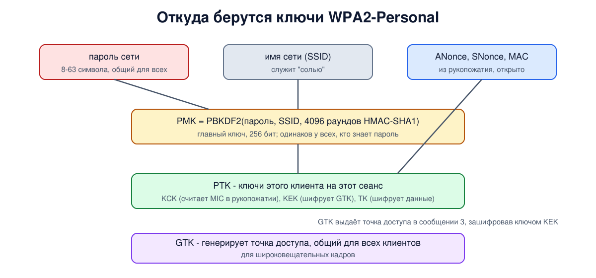
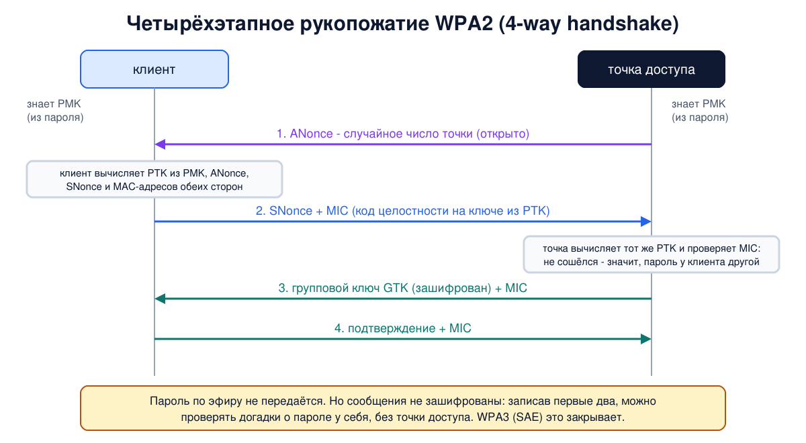

# Урок 20. Безопасность Wi-Fi: WEP, WPA2, WPA3 и 802.1X

В уроке 19 мы видели, что эфир слышат все, а служебные кадры Wi-Fi идут открыто. Таненбаум описывает это так: шпиону достаточно оставить ноутбук в машине у офиса, и к вечеру у него будет всё, что прозвучало в эфире, причём радио проходит сквозь любой межсетевой экран. Поэтому защита Wi-Fi должна не пускать в сеть чужих и шифровать всё, что идёт по воздуху. Сегодня разберём, почему первая попытка (WEP) провалилась, как устроены WPA2 и WPA3, что даёт корпоративный режим с 802.1X, и увидим рукопожатия WPA2 и WPA3 в эфире на виртуальных радио.

## Чего мы хотим от защиты

Вспомним свойства из урока 8:

- **конфиденциальность** - слушающий эфир не должен понимать содержимое кадров;
- **целостность** - нельзя незаметно изменить кадр или подсунуть свой;
- **аутентичность и аутентификация** - в сеть попадают только те, кто знает пароль или имеет учётную запись; в идеале и клиент должен убедиться, что точка доступа настоящая (урок 19, двойник).

И ещё **управление ключами**: ключи должны быть разными у разных клиентов и сеансов и регулярно меняться. Таненбаум замечает, что самым слабым звеном обычно оказываются не алгоритмы шифрования, а именно управление ключами.

## WEP: почему он не годится

**WEP** (Wired Equivalent Privacy) вошёл в первую версию 802.11. Таненбаум подчёркивает, что его придумал комитет по стандартам, а не открытый конкурс криптографов, как было с AES, и неудачным оказалось почти всё. Главные слабости, если коротко:

- **один общий ключ** на всю сеть, который вводят вручную и годами не меняют. Управления ключами нет вообще;
- **ключевой поток повторяется**: к ключу добавлялось лишь короткое открытое значение, и в загруженной сети оно быстро начинало повторяться, а повтор ключевого потока в поточном шифре - классическая ошибка;
- **проверка целостности на CRC-32**, который линеен: как мы разбирали в уроке 11, зашифрованный кадр можно изменить так, что проверка этого не заметит (Борисов, Голдберг и Вагнер, 2001);
- **слабость в использовании шифра RC4**, которая позволила восстанавливать сам ключ по перехваченному трафику (Флюрер, Мантин и Шамир, 2001). Таненбаум рассказывает, что Адам Стабблфилд проверил эту атаку на практике за неделю (работа опубликована в 2002 году).

С тех пор WEP считается полностью сломанным. Вывод один: **WEP не использовать никогда**, даже "лучше, чем ничего" - он создаёт только видимость защиты. Если старое устройство умеет только WEP, его место в отдельной изолированной сети или на свалке.

## WPA и WPA2

Когда стало ясно, что WEP не спасти, группа IEEE 802.11i начала делать новую защиту. Пока стандарт не был готов, Wi-Fi Alliance выпустил промежуточный **WPA** (2003) с протоколом **TKIP**: его можно было включить на старых картах обновлением прошивки. TKIP был заплаткой и позже тоже оказался уязвим, сегодня он считается устаревшим.

Стандарт **802.11i** вышел в июне 2004 года, коммерческое название - **WPA2**. Он решает все задачи по-новому:

- шифрование и целостность даёт протокол **CCMP** на основе AES со 128-битным ключом: AES в режиме счётчика шифрует данные, а код целостности (MIC) считается тем же AES по кадру вместе с частью заголовка (об AES и режимах шифрования - урок 69, о кодах целостности - урок 70). Таненбаум описывает его подробнее, для нас важно одно: это современная криптография, и подделать кадр без ключа нельзя;
- ключи шифрования **разные у каждого клиента и каждого сеанса** и вырабатываются заново при каждом подключении (кроме общего группового ключа для широковещательных кадров, о нём ниже).

WPA2 работает в двух режимах:

- **Personal** (PSK, pre-shared key) - один пароль сети на всех, дома и в маленьких офисах;
- **Enterprise** - у каждого пользователя свои учётные данные, их проверяет отдельный сервер через 802.1X (о нём ниже).

## Откуда берутся ключи: четырёхэтапное рукопожатие

В режиме Personal из пароля и имени сети вычисляется **главный ключ PMK**. Вычисление нарочно сделано медленным (4096 раундов HMAC-SHA1 по алгоритму PBKDF2), а имя сети играет роль "соли": один и тот же пароль в сетях с разными именами даёт разные PMK. PMK знают все, кто знает пароль, поэтому шифровать им напрямую нельзя.



Ключи сеанса вырабатывает **четырёхэтапное рукопожатие** (4-way handshake) из кадров EAPOL сразу после ассоциации:

1. Точка доступа присылает своё случайное число **ANonce**.
2. Клиент придумывает своё число **SNonce** и вычисляет из PMK, обоих чисел и MAC-адресов сторон набор ключей сеанса **PTK**. Он отправляет SNonce вместе с кодом целостности **MIC**, посчитанным на ключе из PTK.
3. Точка вычисляет тот же PTK и проверяет MIC. Сошёлся - значит, у клиента правильный пароль. Точка присылает **групповой ключ GTK** (для широковещательных кадров), зашифрованный ключом из PTK.
4. Клиент подтверждает получение. С этого момента данные шифруются.



Обрати внимание: **пароль по эфиру не передаётся**. Обе стороны доказывают друг другу, что знают PMK, и получают свежие ключи сеанса. Из PTK получаются три ключа: для MIC в рукопожатии, для шифрования GTK и для шифрования данных.

## Слабые места WPA2-Personal

При всей надёжности CCMP у режима с общим паролем есть принципиальные ограничения:

- **Подбор пароля без точки доступа.** Сообщения рукопожатия идут без шифрования (зашифрован только групповой ключ внутри третьего), и первых двух уже достаточно: тот, кто их записал, может проверять догадки о пароле у себя на компьютере. Для каждой догадки достаточно вычислить PMK и PTK и сравнить MIC. Точка доступа об этом не узнает и ограничить число попыток не сможет. Медленный PBKDF2 замедляет перебор, но короткий или словарный пароль не выдержит. Отсюда главное правило WPA2-Personal: **длинный случайный пароль**.
- **Общий пароль - общий секрет.** Как пишет Таненбаум, у клиентов разные ключи сеанса, но пароль у всех один, и любой, кто его знает и записал чужое рукопожатие, может вычислить ключи соседа.
- **Нет прямой секретности** (урок 72). Если сегодня записали рукопожатие и трафик, а пароль утёк через год, записанное можно расшифровать задним числом.
- **KRACK** (2017, Ванхуф и Писсенс). Таненбаум упоминает, что в 2017 году WPA2 "взломали". Точнее, нашли изъян в самом стандарте: при повторе третьего сообщения рукопожатия клиент заново устанавливал уже действующий ключ и сбрасывал счётчик пакетов, а это нарушало шифрование. Уязвимы были почти все реализации, а при быстром роуминге (802.11r) - и точки доступа. Пароль при этом не раскрывался, а исправили всё обновлениями, совместимыми со старыми устройствами, в первую очередь на клиентах. Вывод практический: **обновляй устройства**.
- **WPS** - кнопка или PIN-код для "простого подключения". Способ с PIN-кодом оказался уязвим к перебору, поэтому WPS на точке доступа лучше выключить.

## WPA3

**WPA3** объявлен в 2018 году. Главное изменение в режиме Personal - новый способ проверки пароля **SAE** (Simultaneous Authentication of Equals, в основе протокол Dragonfly). Он идёт ещё в кадрах Authentication, до ассоциации (урок 19), и устроен как обмен ключами Диффи-Хеллмана (урок 71), в который вплетён пароль:

- **подбор пароля по записи невозможен**: из подслушанного обмена нельзя проверять догадки у себя, каждая попытка требует нового живого обмена с точкой доступа, а точка может такие попытки ограничивать;
- **прямая секретность**: каждый раз получается новый PMK, и знание пароля потом не позволяет расшифровать записанный ранее трафик;
- **защита служебных кадров** (PMF, 802.11w, урок 19) обязательна.

После SAE идёт то же четырёхэтапное рукопожатие, но уже от свежего PMK. Таненбаум упоминает атаки Dragonblood (2019). Это утечки через побочные каналы в SAE, их закрыли обновлениями и доработкой протокола, и принудительное понижение до WPA2 в смешанном режиме - от него полностью защищает только чистый WPA3. И две оговорки из практики:

- **смешанный режим** WPA2/WPA3 нужен для старых устройств, но в нём WPA2-клиенты подключаются по старым правилам, со всеми слабостями выше, а поддельная точка может попытаться склонить к WPA2 и WPA3-клиента. Как только старые устройства уйдут, переключай сеть на чистый WPA3;
- SAE доказывает только знание пароля. Если пароль общеизвестен, как в кафе, двойник с тем же паролем (урок 19) всё равно сможет выдать себя за сеть.

## Корпоративный режим: 802.1X и EAP

В режиме **Enterprise** общего пароля нет. Работает знакомая по уроку 16 схема **802.1X** с тремя участниками: клиент (supplicant), точка доступа (authenticator) и сервер аутентификации, обычно **RADIUS**. Пока клиент не прошёл проверку, точка пропускает от него только кадры EAPOL (урок 16). Сам диалог клиента с сервером идёт по **EAP** (Extensible Authentication Protocol, RFC 3748; в книге Таненбаума расшифровка дана неточно). EAP - это рамка, в которой работают разные методы:

- **EAP-TLS** - и сервер, и клиент предъявляют сертификаты. Самый надёжный вариант;
- **PEAP** и **EAP-TTLS** - сначала строится TLS-туннель по сертификату сервера (о TLS - блок 9), а внутри него клиент входит по логину и паролю.

По итогам проверки у клиента и сервера появляется общий секрет. Сервер RADIUS передаёт выведенный из него ключ точке доступа, так что **свой PMK есть у каждого подключения**, и дальше идёт то же четырёхэтапное рукопожатие. Поэтому каждый кадр от клиента защищён его собственным ключом, и слабость проводного 802.1X из урока 16 (чужие кадры через уже открытый порт) здесь не работает. Преимущества: у каждого свои учётные данные, их можно отозвать, не меняя пароль всем, и сеть знает, кто именно подключён.

Главное условие безопасности: **клиент должен проверять сертификат сервера**. Если проверка выключена (а на многих устройствах её приходится включать вручную), двойник из урока 19 подставит свой сервер, и клиент отдаст ему данные для входа. Правильно настроенный клиент доверяет только своему удостоверяющему центру и знает имя своего сервера.

## Как это увидеть в Linux

Возьмём виртуальные радио из урока 19: точка доступа `hbh-ap` с сетью `hbh-sec` и клиент `hbh-sta`, на котором теперь работает **wpa_supplicant** - та же программа, что подключает к Wi-Fi большинство Linux-систем и Android. Проведём три опыта: WPA2 с правильным паролем, WPA2 с неправильным и WPA3. Маяки и поиск сети при записи эфира отфильтруем, они нам уже знакомы.

Требования те же, что в уроке 19 (машина с модулем mac80211_hwsim, не WSL2 и не контейнерный VPS), плюс пакет `wpasupplicant`: `sudo apt install hostapd wpasupplicant iw tcpdump`. Пароль `lab-password-1` учебный, он живёт только внутри виртуального эфира. Работает около 40 секунд.

Создай файл `wifi-sec-lab.sh` и запусти `bash wifi-sec-lab.sh`:

```
set -u
for c in hostapd wpa_supplicant wpa_cli iw tcpdump; do
  command -v $c >/dev/null || { echo "нужен $c: sudo apt install hostapd wpasupplicant iw tcpdump"; exit 1; }
done
modinfo mac80211_hwsim >/dev/null 2>&1 || { echo "нет модуля mac80211_hwsim: попробуй sudo apt install linux-modules-extra-$(uname -r) (в WSL2 и контейнерах его не будет)"; exit 1; }
# убрать остатки прошлого запуска
for n in hbh-ap hbh-sta; do
  sudo ip netns pids $n 2>/dev/null | xargs -r sudo kill
  sudo ip netns del $n 2>/dev/null
done
sudo rmmod mac80211_hwsim 2>/dev/null
lsmod | grep -q '^mac80211_hwsim' && { echo "модуль mac80211_hwsim занят, выгрузи его сам"; exit 1; }
d=$(mktemp -d)
# два виртуальных радио: точка доступа ap и клиент sta
sudo modprobe mac80211_hwsim radios=2
sleep 1
i=1
for p in $(for x in /sys/class/ieee80211/*; do readlink $x/device/driver | grep -q hwsim && basename $x; done | sort -V); do
  n=hbh-$(echo ap sta | cut -d' ' -f$i)
  sudo ip netns add $n
  sudo ip netns exec $n sysctl -qw net.ipv6.conf.all.disable_ipv6=1 net.ipv6.conf.default.disable_ipv6=1
  dev=$(ls /sys/class/ieee80211/$p/device/net/)
  sudo iw phy $p set netns name $n
  sudo ip netns exec $n ip link set $dev name wlan0
  i=$((i+1))
done
sudo ip link set hwsim0 up
sudo ip netns exec hbh-sta ip link set wlan0 up
sudo ip netns exec hbh-ap ip addr add 10.78.0.1/24 dev wlan0
sudo ip netns exec hbh-sta ip addr add 10.78.0.2/24 dev wlan0
# учебный пароль сети; настоящие пароли в скрипты не пишут
PASS=lab-password-1
# net $1 - имя опыта, $2 - настройки точки доступа, $3 - настройки клиента
net() {
  printf 'interface=wlan0\ndriver=nl80211\nssid=hbh-sec\nhw_mode=g\nchannel=6\nwpa=2\nrsn_pairwise=CCMP\n%b\n' "$2" > "$d/ap.conf"
  printf 'ctrl_interface=%s/ctrl\nnetwork={\n ssid="hbh-sec"\n%b\n}\n' "$d" "$3" > "$d/sta.conf"
  sudo ip netns exec hbh-ap hostapd -B -P "$d/ap.pid" -f "$d/$1-ap.log" "$d/ap.conf" >/dev/null
  sleep 1
  sudo timeout 9 tcpdump -i hwsim0 -U -w "$d/$1.pcap" 'not (type mgt subtype beacon or type mgt subtype probe-req or type mgt subtype probe-resp or type ctl)' 2>/dev/null &
  sleep 1
  sudo ip netns exec hbh-sta wpa_supplicant -B -P "$d/sta.pid" -i wlan0 -c "$d/sta.conf" -f "$d/$1-sta.log"
  for k in 1 2 3 4 5 6; do sudo grep -q CONNECTED "$d/$1-sta.log" && break; sleep 1; done
}
stop() {
  wait
  sudo kill $(cat "$d/sta.pid") $(cat "$d/ap.pid") 2>/dev/null
  sleep 1
  # перезапустить радио, чтобы следующий опыт начинался с чистого листа
  for n in hbh-ap hbh-sta; do sudo ip netns exec $n ip link set wlan0 down; sudo ip netns exec $n ip link set wlan0 up; done
}
air() { sudo tcpdump -r "$d/$1.pcap" -e -n 2>/dev/null | sed -E 's/^[0-9:.]+ //; s/^[0-9]+us tsft //; s/ LLC, dsap SNAP.*ethertype/ ethertype/'; }

echo '=== 1. WPA2-Personal, correct password'
net wpa2 "wpa_key_mgmt=WPA-PSK\nwpa_passphrase=$PASS" " key_mgmt=WPA-PSK\n psk=\"$PASS\""
sudo grep -h -E 'Key negotiation|CONNECTED' "$d/wpa2-sta.log"
sudo ip netns exec hbh-sta ping -c 1 -q 10.78.0.1 | grep packets
sudo ip netns exec hbh-sta wpa_cli -p "$d/ctrl" disconnect >/dev/null
sleep 1
stop
air wpa2 | grep -vi deauth | head -10
air wpa2 | grep -i deauth

echo '=== 2. WPA2-Personal, wrong password'
net bad "wpa_key_mgmt=WPA-PSK\nwpa_passphrase=$PASS" " key_mgmt=WPA-PSK\n psk=\"wrong-password\""
stop
sudo grep -h -o 'AP-STA-POSSIBLE-PSK-MISMATCH.*' "$d/bad-ap.log" | head -1
air bad | grep -c 'EAPOL key' | sed 's/^/EAPOL frames: /'
air bad | grep -E 'EAPOL' | head -3

echo '=== 3. WPA3-Personal (SAE), protected management frames required'
net sae "wpa_key_mgmt=SAE\nsae_password=$PASS\nieee80211w=2" " key_mgmt=SAE\n sae_password=\"$PASS\"\n ieee80211w=2"
sudo grep -h -E 'CONNECTED' "$d/sae-sta.log"
sudo ip netns exec hbh-ap iw dev wlan0 station dump | grep -E 'Station|MFP'
sudo ip netns exec hbh-sta wpa_cli -p "$d/ctrl" disconnect >/dev/null
sleep 1
stop
air sae | grep -vE 'Data IV' | head -12

echo '--- cleanup'
for n in hbh-ap hbh-sta; do
  sudo ip netns pids $n 2>/dev/null | xargs -r sudo kill
  sudo ip netns del $n
done
sleep 1
sudo rmmod mac80211_hwsim
sudo rm -rf "$d"
lsmod | grep -c '^mac80211_hwsim'
```

Вот что получилось на нашем сервере:

```
=== 1. WPA2-Personal, correct password
wlan0: WPA: Key negotiation completed with 02:00:00:00:00:00 [PTK=CCMP GTK=CCMP]
wlan0: CTRL-EVENT-CONNECTED - Connection to 02:00:00:00:00:00 completed [id=0 id_str=]
1 packets transmitted, 1 received, 0% packet loss, time 0ms
1.0 Mb/s 2437 MHz 11b BSSID:02:00:00:00:00:00 DA:02:00:00:00:00:00 SA:02:00:00:00:01:00 Authentication (Open System)-1: Successful
1.0 Mb/s 2437 MHz 11b BSSID:02:00:00:00:00:00 DA:02:00:00:00:01:00 SA:02:00:00:00:00:00 Authentication (Open System)-2: 
1.0 Mb/s 2437 MHz 11b BSSID:02:00:00:00:00:00 DA:02:00:00:00:00:00 SA:02:00:00:00:01:00 Assoc Request (hbh-sec) [1.0 2.0 5.5 11.0 6.0 9.0 12.0 18.0 Mbit]
1.0 Mb/s 2437 MHz 11b BSSID:02:00:00:00:00:00 DA:02:00:00:00:01:00 SA:02:00:00:00:00:00 Assoc Response AID(1) : PRIVACY : Successful
1.0 Mb/s 2437 MHz 11b DA:02:00:00:00:01:00 BSSID:02:00:00:00:00:00 SA:02:00:00:00:00:00 ethertype EAPOL (0x888e), length 99: EAPOL key (3) v2, len 95
1.0 Mb/s 2437 MHz 11b BSSID:02:00:00:00:00:00 SA:02:00:00:00:01:00 DA:02:00:00:00:00:00 ethertype EAPOL (0x888e), length 121: EAPOL key (3) v1, len 117
1.0 Mb/s 2437 MHz 11b DA:02:00:00:00:01:00 BSSID:02:00:00:00:00:00 SA:02:00:00:00:00:00 ethertype EAPOL (0x888e), length 155: EAPOL key (3) v2, len 151
1.0 Mb/s 2437 MHz 11b BSSID:02:00:00:00:00:00 SA:02:00:00:00:01:00 DA:02:00:00:00:00:00 ethertype EAPOL (0x888e), length 99: EAPOL key (3) v1, len 95
2.0 Mb/s 2437 MHz 11b BSSID:02:00:00:00:00:00 SA:02:00:00:00:01:00 DA:ff:ff:ff:ff:ff:ff Data IV:  1 Pad 20 KeyID 0
1.0 Mb/s 2437 MHz 11b DA:ff:ff:ff:ff:ff:ff BSSID:02:00:00:00:00:00 SA:02:00:00:00:01:00 Data IV:  1 Pad 20 KeyID 1
1.0 Mb/s 2437 MHz 11b BSSID:02:00:00:00:00:00 DA:02:00:00:00:00:00 SA:02:00:00:00:01:00 DeAuthentication: Deauthenticated because sending STA is leaving (or has left) IBSS or ESS
=== 2. WPA2-Personal, wrong password
AP-STA-POSSIBLE-PSK-MISMATCH 02:00:00:00:01:00
EAPOL frames: 8
1.0 Mb/s 2437 MHz 11b DA:02:00:00:00:01:00 BSSID:02:00:00:00:00:00 SA:02:00:00:00:00:00 ethertype EAPOL (0x888e), length 99: EAPOL key (3) v2, len 95
1.0 Mb/s 2437 MHz 11b BSSID:02:00:00:00:00:00 SA:02:00:00:00:01:00 DA:02:00:00:00:00:00 ethertype EAPOL (0x888e), length 121: EAPOL key (3) v1, len 117
1.0 Mb/s 2437 MHz 11b DA:02:00:00:00:01:00 BSSID:02:00:00:00:00:00 SA:02:00:00:00:00:00 ethertype EAPOL (0x888e), length 99: EAPOL key (3) v2, len 95
=== 3. WPA3-Personal (SAE), protected management frames required
wlan0: CTRL-EVENT-CONNECTED - Connection to 02:00:00:00:00:00 completed [id=0 id_str=]
Station 02:00:00:00:01:00 (on wlan0)
	MFP:		yes
1.0 Mb/s 2437 MHz 11b BSSID:02:00:00:00:00:00 DA:02:00:00:00:00:00 SA:02:00:00:00:01:00 Authentication (Reserved)-1: Successful [|802.11]
1.0 Mb/s 2437 MHz 11b BSSID:02:00:00:00:00:00 DA:02:00:00:00:01:00 SA:02:00:00:00:00:00 Authentication (Reserved)-1: Successful [|802.11]
1.0 Mb/s 2437 MHz 11b BSSID:02:00:00:00:00:00 DA:02:00:00:00:00:00 SA:02:00:00:00:01:00 Authentication (Reserved)-2:  [|802.11]
1.0 Mb/s 2437 MHz 11b BSSID:02:00:00:00:00:00 DA:02:00:00:00:01:00 SA:02:00:00:00:00:00 Authentication (Reserved)-2:  [|802.11]
1.0 Mb/s 2437 MHz 11b BSSID:02:00:00:00:00:00 DA:02:00:00:00:00:00 SA:02:00:00:00:01:00 Assoc Request (hbh-sec) [1.0 2.0 5.5 11.0 6.0 9.0 12.0 18.0 Mbit]
1.0 Mb/s 2437 MHz 11b BSSID:02:00:00:00:00:00 DA:02:00:00:00:01:00 SA:02:00:00:00:00:00 Assoc Response AID(1) : PRIVACY : Successful
1.0 Mb/s 2437 MHz 11b DA:02:00:00:00:01:00 BSSID:02:00:00:00:00:00 SA:02:00:00:00:00:00 ethertype EAPOL (0x888e), length 121: EAPOL key (3) v2, len 117
1.0 Mb/s 2437 MHz 11b BSSID:02:00:00:00:00:00 SA:02:00:00:00:01:00 DA:02:00:00:00:00:00 ethertype EAPOL (0x888e), length 127: EAPOL key (3) v1, len 123
1.0 Mb/s 2437 MHz 11b DA:02:00:00:00:01:00 BSSID:02:00:00:00:00:00 SA:02:00:00:00:00:00 ethertype EAPOL (0x888e), length 187: EAPOL key (3) v2, len 183
1.0 Mb/s 2437 MHz 11b BSSID:02:00:00:00:00:00 SA:02:00:00:00:01:00 DA:02:00:00:00:00:00 ethertype EAPOL (0x888e), length 99: EAPOL key (3) v1, len 95
1.0 Mb/s 2437 MHz 11b BSSID:02:00:00:00:00:00 DA:02:00:00:00:00:00 SA:02:00:00:00:01:00 DeAuthentication IV:  1 Pad 20 KeyID 0
--- cleanup
0
```

Разберём по опытам.

- **Опыт 1: WPA2, верный пароль.** Клиент сообщает `Key negotiation completed ... [PTK=CCMP GTK=CCMP]` - ключи выработаны, шифрование CCMP. В эфире сначала знакомые кадры Authentication (Open System) и ассоциация. В ответе на ассоциацию появилась пометка `PRIVACY`: сеть защищённая. Затем четыре кадра `EAPOL key` - это и есть рукопожатие: сообщения 1 и 3 от точки, 2 и 4 от клиента. Третье самое длинное (151 байт): в нём зашифрованный групповой ключ.
- **Данные после рукопожатия.** Раньше (урок 19) tcpdump показывал внутри кадров ARP и ICMP. Теперь только `Data IV: 1 Pad 20 KeyID 0`: содержимое зашифровано, видны лишь служебные поля заголовка CCMP. tcpdump называет поля по-старому, как в WEP: `IV` здесь - младшие байты 48-битного номера пакета, счётчика, который растёт с каждым кадром и не даёт повторить старый кадр, а `Pad 20` - признак заголовка CCMP. У таких кадров стоит флаг Protected из урока 19. `KeyID 0` - кадр зашифрован личным ключом клиента, а у разосланной точкой копии запроса ARP `KeyID 1` - это групповой ключ GTK. Пинг прошёл: шифрование работает незаметно для приложений.
- **Кадр отключения в WPA2.** Когда клиент отключился, кадр `DeAuthentication` ушёл открыто, с читаемой причиной. В этой сети защита служебных кадров не включена, и такой кадр мог бы подделать кто угодно (урок 19).
- **Опыт 2: неверный пароль.** Точка доступа записала в журнал `AP-STA-POSSIBLE-PSK-MISMATCH` - "похоже, пароль не совпадает". В эфире 8 кадров EAPOL: четыре попытки, каждая из сообщений 1 и 2. До третьего дело не доходит: точка проверила MIC во втором сообщении, он не сошёлся, и групповой ключ клиент не получил. Заметь, что точке для этого вывода хватило двух открытых сообщений - именно поэтому их запись позволяет проверять догадки о пароле.
- **Опыт 3: WPA3.** Вместо Open System в кадрах Authentication - обмен SAE: по два кадра с каждой стороны, номер 1 (commit, обмен значениями) и номер 2 (confirm, подтверждение). Эта версия tcpdump ещё не знает номер алгоритма SAE и пишет `Reserved`. Пароль проверен уже здесь, до ассоциации. Затем то же четырёхэтапное рукопожатие. Третье сообщение длиннее (183 байта против 151): при защите служебных кадров точка передаёт в нём ещё один групповой ключ (IGTK) для защиты широковещательных служебных кадров. Первое и второе тоже чуть подросли: в первом точка указывает, какой PMK, полученный через SAE, используется, а во втором клиент сообщает о поддержке защиты служебных кадров. Точка доступа показывает для клиента `MFP: yes` - защита служебных кадров включена.
- **Кадр отключения в WPA3.** Теперь `DeAuthentication IV: 1 Pad 20 KeyID 0`: причина отключения не видна, кадр зашифрован и защищён. Поддельный кадр отключения без ключа клиент бы отверг.
- В конце `0`: модуль выгружен, виртуальных радио не осталось.

## Атаки и защита: как настроить Wi-Fi правильно

Сведём всё в список для своей сети.

- **Режим:** WPA3-Personal, а если есть старые устройства - смешанный WPA2/WPA3. Для WPA2 - только AES (CCMP). WEP и TKIP - никогда.
- **Пароль:** длинный и случайный, не слово и не дата; в WPA2 это главная защита от подбора по записанному рукопожатию. Смена пароля отключает всех, кто его знал.
- **WPS выключить.**
- **Защита служебных кадров (PMF)** включена, в WPA3 она обязательна.
- **Гостевая сеть** отдельно от домашней, лучше в отдельной VLAN (урок 18): гости и умные устройства не должны видеть твой компьютер.
- **Прошивка точки доступа и устройств обновлена**: KRACK и Dragonblood закрывали именно обновлениями.
- **В организации** - Enterprise с 802.1X, желательно EAP-TLS, и обязательная проверка сертификата сервера на всех клиентах.
- **В чужих сетях** Wi-Fi защищает только участок до точки доступа, а дальше трафик идёт как обычно. Владелец сети и всё, что за ней, по-прежнему видят то, что не зашифровано на уровне приложений. HTTPS (блок 9) и доверенный VPN (блок 10) остаются нужны.

## Итог

- Защита Wi-Fi должна давать конфиденциальность, целостность, аутентификацию и нормальное управление ключами.
- WEP сломан полностью: один общий ключ, повтор ключевого потока, линейный CRC, восстановление ключа по трафику. Не использовать.
- WPA2 (802.11i, 2004): шифрование и целостность CCMP на AES, свои ключи у каждого клиента и сеанса, вырабатываемые четырёхэтапным рукопожатием из PMK. Пароль по эфиру не передаётся.
- Слабости WPA2-Personal: подбор пароля по записанным сообщениям 1 и 2, общий пароль у всех, нет прямой секретности; KRACK исправлен обновлениями; WPS лучше выключить.
- WPA3 (2018): SAE исключает подбор по записи и даёт прямую секретность, защита служебных кадров обязательна. Общеизвестный пароль по-прежнему не защищает от двойника.
- Enterprise: 802.1X, EAP и RADIUS, свои учётные данные у каждого пользователя и свой PMK у каждого подключения; безопасность держится на проверке сертификата сервера клиентом.

## Что почитать

- Таненбаум, "Компьютерные сети", раздел 8.10.3, с. 917-921: безопасность беспроводных сетей, WEP и его взлом, 802.11i и WPA2, 802.1X и EAP, четырёхэтапное рукопожатие, TKIP и CCMP, WPA3.
- Таненбаум, раздел 4.4.5, с. 374-375: аутентификация и конфиденциальность в службах 802.11.
