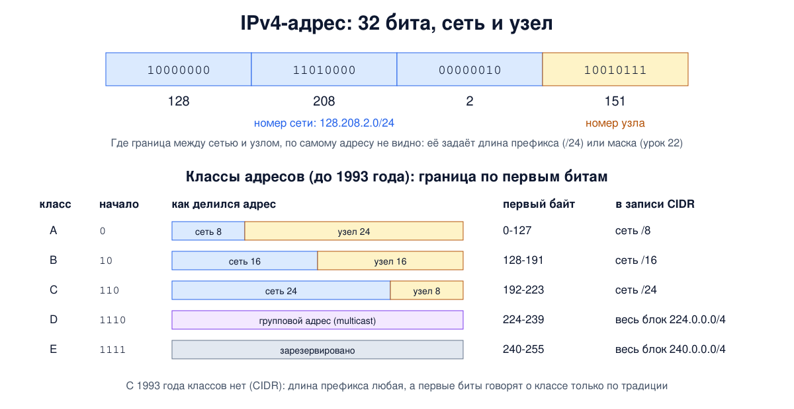

# Урок 21. IPv4-адрес: как он устроен, классы и особые адреса

Блок 2 научил нас передавать кадры внутри одной сети: по MAC-адресам, через коммутаторы и точки доступа. Но MAC-адрес ничего не говорит о том, **где** находится устройство, и таблица коммутатора не может вместить весь мир. Чтобы соединить миллионы сетей в одну, нужен адрес другого рода - такой, по которому можно понять, в какую сеть везти пакет. Это IP-адрес. Сегодня разберём, как устроен адрес IPv4, откуда взялись классы адресов и почему от них отказались, какие адреса особые, и посмотрим на всё это в Linux. Маски и деление на подсети - в уроке 22, частные адреса и то, кто раздаёт адреса, - в уроке 23.

## Три вида адресов

Олифер перечисляет три вида адресов в стеке TCP/IP:

- **локальные (аппаратные)** - адреса технологии, на которой построена конкретная сеть; в Ethernet и Wi-Fi это MAC-адреса (урок 15). "Локальный" здесь значит "действует только внутри одной сети";
- **сетевые, или IP-адреса** - единая система адресации для всей составной сети, то есть для интернета;
- **символьные, или доменные имена** вроде `example.com` - для людей (блок 7).

Между ними нет никакой формулы: по MAC-адресу нельзя вычислить IP-адрес и наоборот. Связь устанавливают таблицы и специальные протоколы: IP-адрес с MAC-адресом связывает ARP (урок 24), имя с IP-адресом - DNS.

## Устройство адреса IPv4

Адрес IPv4 - это **32 бита**. Всего таких адресов 2^32, примерно 4,3 миллиарда. Для людей его записывают как четыре байта в десятичном виде через точку: `128.208.2.151`. Это тот же адрес, что `10000000.11010000.00000010.10010111` в двоичном виде и `0x80D00297` в шестнадцатеричном (урок 2). Мы увидим это в опыте.

Два важных свойства:

- **Адрес принадлежит интерфейсу, а не устройству.** Таненбаум подчёркивает: компьютер, подключённый к двум сетям, имеет два IP-адреса. У маршрутизатора их обычно несколько, по одному на каждый интерфейс. Олифер добавляет, что и у одного интерфейса может быть несколько адресов.
- **Адрес иерархический.** Старшие биты задают **номер сети**, младшие - **номер узла** в этой сети. У всех узлов одной сети номер сети одинаковый, поэтому маршрутизатору достаточно знать путь к сети, а не к каждому узлу. Это и позволяет интернету работать: полная таблица маршрутов интернета содержит около миллиона записей (у Таненбаума, по более старым данным, - 200-300 тысяч), а не миллиарды. Обратная сторона, о которой пишет Таненбаум: IP-адрес зависит от того, **где** устройство подключено. Унёс ноутбук в другую сеть - получил другой адрес. Заводской MAC-адрес от места подключения не зависит (если система не подменяет его ради приватности, урок 15), а IP-адрес - зависит.

Сеть записывают как её наименьший адрес и **длину префикса** - число бит, отведённых под номер сети: `128.208.2.0/24` значит, что первые 24 бита - номер сети, а на узлы остаётся 8 бит. По самому адресу `128.208.2.151` граница не видна, её нужно знать отдельно: из длины префикса или маски. Как с ними считать - тема урока 22.



## Классы адресов: как было и почему отказались

Как узнать, где граница между сетью и узлом, если в адресе она не записана? Первое решение, из стандарта IP (RFC 791, 1981), - **классы**: граница определяется первыми битами самого адреса.

- **Класс A** - первый бит `0`, первый байт от 0 до 127. Под сеть 8 бит, под узел 24: 128 сетей по 16 миллионов адресов (сети 0 и 127 особые).
- **Класс B** - начало `10`, от 128 до 191. Сеть 16 бит, узел 16: около 16 тысяч сетей по 65 536 адресов.
- **Класс C** - начало `110`, от 192 до 223. Сеть 24 бита, узел 8: около 2 миллионов сетей по 256 адресов.
- **Класс D** - начало `1110`, от 224 до 239: групповые адреса (multicast), один адрес на группу получателей.
- **Класс E** - начало `1111`, от 240 до 255: зарезервировано "на будущее".

(Строго говоря, RFC 791 определил классы A, B и C; D и E добавились позже, вместе с групповой рассылкой: RFC 988, 1986, и RFC 1112, 1989.)

Для маршрутизаторов того времени это было удобно: взглянул на первые биты - и знаешь, сколько байт занимает номер сети. Но у схемы оказался фатальный недостаток - **всего три размера сетей**. Таненбаум называет это "проблемой трёх медведей": класс A слишком велик почти для всех, класс C с его 256 адресами слишком мал, а класс B в самый раз - и все хотели именно B. Исследования показывали, что больше чем в половине сетей класса B было меньше 50 узлов. Адреса расходовались с огромными потерями, а сетей класса B было всего около 16 тысяч.

Поэтому в 1993 году классы отменили и перешли на **CIDR** (бесклассовую междоменную маршрутизацию): длина префикса может быть любой, от /0 до /32. Её указывают при настройке адреса и передают в протоколах маршрутизации вместе с префиксом, а в самом IP-пакете её нет. Классы остались только в истории, в старых учебниках и в привычке называть сеть /24 "сетью класса C". Олифер тоже подробно описывает классы - полезно для понимания, но на практике сегодня важна только длина префикса.

Осторожно с таблицей классов у Олифера: класс E там описан неточно (начало `11110`, до 247.255.255.255), как в некоторых старых учебниках; по стандарту это `1111`, то есть всё от 240.0.0.0 до 255.255.255.255 (240.0.0.0/4). И в разделе про маски (с. 409) в двоичной записи адреса 129.64.134.5 у него потерян первый бит: 129 - это `10000001`.

## Особые адреса

Некоторые адреса и блоки зарезервированы под особые цели. Их полный список ведёт IANA (реестр адресов специального назначения, RFC 6890). Главные:

| Адрес или блок | Что значит |
|---|---|
| `0.0.0.0` | "этот узел, адрес пока неизвестен". Так подписывается отправитель, у которого ещё нет адреса, например при получении адреса по DHCP (урок 29). У сервера, который слушает на `0.0.0.0`, это значит "на всех своих адресах" (увидим в опыте), а в таблице маршрутов `0.0.0.0/0` - маршрут по умолчанию (урок 26) |
| номер узла из одних нулей | адрес самой сети, например `192.0.2.0` для сети `192.0.2.0/24`. Узлу его не дают |
| номер узла из одних единиц | широковещательный адрес этой сети, например `192.0.2.255`: пакет всем узлам сети. Узлу его тоже не дают |
| `255.255.255.255` | ограниченное широковещание: всем в своей сети, за маршрутизатор такой пакет не выходит никогда |
| `127.0.0.0/8` | **обратная петля** (loopback): пакет не уходит в сеть, а возвращается этому же компьютеру. Обычно пользуются `127.0.0.1`, но петлёй является весь блок |
| `169.254.0.0/16` | адреса канала (link-local): их назначают себе сами Windows, macOS и многие устройства, если не получили адрес по DHCP (в Linux это обычно выключено). Увидел на Windows 169.254.x.x - скорее всего, DHCP не ответил |
| `224.0.0.0/4` | групповые адреса (бывший класс D), например `224.0.0.1` - все узлы в своей сети |
| `240.0.0.0/4` | зарезервировано (бывший класс E) |
| `100.64.0.0/10` | общее адресное пространство для NAT провайдера, RFC 6598 (урок 12, подробнее - урок 58) |
| `192.0.2.0/24`, `198.51.100.0/24`, `203.0.113.0/24` | адреса для документации (RFC 5737). В интернете их нет, и именно их мы используем в курсе вместо настоящих адресов серверов |
| `10.0.0.0/8`, `172.16.0.0/12`, `192.168.0.0/16` | частные адреса для внутренних сетей (урок 23) |

Из правил про номер сети и широковещательный адрес следует, что в сети из 256 адресов (/24) узлам достаётся 254: первый и последний заняты. Олифер отмечает важное следствие: в IP нет способа отправить пакет "всем узлам всех сетей". Широковещание всегда ограничено одной сетью, поэтому маршрутизаторы останавливают широковещательный шторм (урок 16). Более того, пакеты на широковещательный адрес **чужой** сети (Таненбаум называет это широковещанием в удалённой сети) маршрутизаторы сегодня по умолчанию не пропускают: когда-то этим пользовались, чтобы одним пакетом вызвать шквал ответов от всей чужой сети, и в конце 1990-х пересылку таких пакетов по умолчанию отключили.

## Как это увидеть в Linux

Сначала посмотрим, как один адрес выглядит в разных системах счисления и к какому классу он отнёсся бы раньше. Затем создадим учебную "машину" - сетевое пространство имён с одним интерфейсом и документационным адресом `192.0.2.10/24` - и посмотрим, какие адреса ядро считает своими. Нужны Linux (подойдёт и WSL2), права sudo, python3 и curl; всё создаётся в пространстве имён `hbh-ip` и в конце удаляется.

Создай файл `ip-lab.sh` и запусти `bash ip-lab.sh`:

```
set -u
# адрес в двоичном, шестнадцатеричном и десятичном виде
bin8() { local s="" i; for i in 7 6 5 4 3 2 1 0; do s+=$(( ($1 >> i) & 1 )); done; printf '%s' "$s"; }
show() {
  IFS=. read -r a b c d <<< "$1"
  echo "$1 = $(bin8 $a).$(bin8 $b).$(bin8 $c).$(bin8 $d) = 0x$(printf '%02X%02X%02X%02X' $a $b $c $d) = $(( (a << 24) | (b << 16) | (c << 8) | d ))"
}
cls() {
  IFS=. read -r a b c d <<< "$1"
  if   (( a < 128 )); then k=A; elif (( a < 192 )); then k=B; elif (( a < 224 )); then k=C; elif (( a < 240 )); then k=D; else k=E; fi
  echo "$1 first bits $(bin8 $a | cut -c1-4) -> class $k"
}
echo '--- 1. one address, three notations'
show 128.208.2.151
show 192.0.2.10
echo '--- 2. old classes by the first bits'
for x in 10.1.2.3 172.16.5.4 192.168.1.1 224.0.0.1 240.0.0.1; do cls $x; done
# учебная "машина": пространство имён с адресом 192.0.2.10/24
sudo ip netns del hbh-ip 2>/dev/null
sudo ip netns add hbh-ip
sudo ip netns exec hbh-ip ip link set lo up
sudo ip netns exec hbh-ip ip link add d0 type dummy
sudo ip netns exec hbh-ip ip addr add 192.0.2.10/24 dev d0
sudo ip netns exec hbh-ip ip link set d0 up
echo '--- 3. addresses and the local routing table'
sudo ip netns exec hbh-ip ip -4 -br addr
sudo ip netns exec hbh-ip ip route show table local
echo '--- 4. the whole 127.0.0.0/8 is loopback'
sudo ip netns exec hbh-ip ping -c 1 -q 127.45.67.89 | grep -E '^PING|packets'
echo '--- 5. other spellings of 127.0.0.1'
for x in 2130706433 127.1 0x7f.1 0177.0.0.1; do sudo ip netns exec hbh-ip ping -c 1 -q $x | head -1; done
echo '--- 6. listening on 0.0.0.0 = on all addresses of this host'
sudo ip netns exec hbh-ip python3 -m http.server --bind 0.0.0.0 8080 >/dev/null 2>&1 &
sleep 1
sudo ip netns exec hbh-ip ss -ltn | grep 8080
for x in 127.0.0.1 192.0.2.10; do
  echo "$x: HTTP $(sudo ip netns exec hbh-ip curl -s -o /dev/null -w '%{http_code}' http://$x:8080/)"
done
echo '--- cleanup'
sudo ip netns pids hbh-ip | xargs -r sudo kill
sudo ip netns del hbh-ip
ip netns list | grep -c '^hbh-ip'
```

Вот что получилось на нашем сервере (в WSL2 результат тот же):

```
--- 1. one address, three notations
128.208.2.151 = 10000000.11010000.00000010.10010111 = 0x80D00297 = 2161115799
192.0.2.10 = 11000000.00000000.00000010.00001010 = 0xC000020A = 3221225994
--- 2. old classes by the first bits
10.1.2.3 first bits 0000 -> class A
172.16.5.4 first bits 1010 -> class B
192.168.1.1 first bits 1100 -> class C
224.0.0.1 first bits 1110 -> class D
240.0.0.1 first bits 1111 -> class E
--- 3. addresses and the local routing table
lo               UNKNOWN        127.0.0.1/8 
d0               UNKNOWN        192.0.2.10/24 
local 127.0.0.0/8 dev lo proto kernel scope host src 127.0.0.1 
local 127.0.0.1 dev lo proto kernel scope host src 127.0.0.1 
broadcast 127.255.255.255 dev lo proto kernel scope link src 127.0.0.1 
local 192.0.2.10 dev d0 proto kernel scope host src 192.0.2.10 
broadcast 192.0.2.255 dev d0 proto kernel scope link src 192.0.2.10 
--- 4. the whole 127.0.0.0/8 is loopback
PING 127.45.67.89 (127.45.67.89) 56(84) bytes of data.
1 packets transmitted, 1 received, 0% packet loss, time 0ms
--- 5. other spellings of 127.0.0.1
PING 2130706433 (127.0.0.1) 56(84) bytes of data.
PING 127.1 (127.0.0.1) 56(84) bytes of data.
PING 0x7f.1 (127.0.0.1) 56(84) bytes of data.
PING 0177.0.0.1 (127.0.0.1) 56(84) bytes of data.
--- 6. listening on 0.0.0.0 = on all addresses of this host
LISTEN 0      5            0.0.0.0:8080      0.0.0.0:*          
127.0.0.1: HTTP 200
192.0.2.10: HTTP 200
--- cleanup
0
```

Разберём по шагам.

- **Шаг 1: три записи одного адреса.** `128.208.2.151` - пример Таненбаума: в шестнадцатеричном виде `0x80D00297`, как у него в книге. Последнее число - тот же адрес как одно 32-битное целое: именно так его видит процессор. Функция `show` делает то, что мы в уроке 2 делали вручную: раскладывает каждый байт на биты.
- **Шаг 2: классы.** По первым битам: `0` - A, `10` - B, `110` - C, `1110` - D, `1111` - E. Мы выводим первые четыре бита, но для класса A важен только первый. Заметь: `10.1.2.3`, `172.16.5.4` и `192.168.1.1` - частные адреса, и по старой классификации они попадают в три разных класса. Сегодня это ничего не значит.
- **Шаг 3: свои адреса.** `ip -br addr` показывает два интерфейса: петлю `lo` с адресом `127.0.0.1/8` и наш `d0` с `192.0.2.10/24`. А **локальная таблица маршрутов** (`table local`) показывает, что ядро считает своим. Строка `local 127.0.0.0/8` - весь блок петли принадлежит этой машине, а `local 127.0.0.1` - сам адрес петли, назначенный интерфейсу `lo`. `local 192.0.2.10` - наш адрес. `broadcast 192.0.2.255` и `broadcast 127.255.255.255` - широковещательные адреса сетей: ядро само вычислило их из длины префикса. Пакеты на эти адреса машина примет как адресованные ей. Строки для адреса сети `192.0.2.0` в нашем ядре нет. В старых версиях Linux (например, в Ubuntu 20.04 с ядром 5.4) была и такая строка, тоже с пометкой broadcast; новые ядра так не делают.
- **Шаг 4: петля - это целый блок.** Мы пингуем `127.45.67.89`, которого никто явно не назначал, и ответ приходит: по строке `local 127.0.0.0/8` ядро отвечает на любой адрес из этого блока.
- **Шаг 5: другие записи того же адреса.** `ping 2130706433` пингует `127.0.0.1`: это тот же адрес, записанный одним десятичным числом (как в шаге 1). `127.1` - короткая запись: последнее число заполняет все оставшиеся байты, поэтому получается 127.0.0.1 (а `127.256` дало бы 127.0.1.0). `0x7f.1` - первый байт в шестнадцатеричном виде. `0177.0.0.1` - первый байт в **восьмеричном**: ведущий ноль превращает `0177` в 127. Эти старые форматы понимают функции `inet_aton` и `getaddrinfo` из стандартной библиотеки C, которыми пользуются многие программы, в том числе ping. Отсюда ловушка: `010.0.0.1` для такой программы - это `8.0.0.1`, а не `10.0.0.1`.
- **Шаг 6: адрес 0.0.0.0 у сервера.** Мы запустили учебный веб-сервер, указав адрес `0.0.0.0`. В `ss -ltn` видно `0.0.0.0:8080`: сервер слушает **на всех адресах** машины, и запрос приходит и на `127.0.0.1`, и на `192.0.2.10` (код ответа `200` - успешно). Если бы сервер слушал только на `127.0.0.1`, снаружи до него было бы не достучаться. Это частый источник проблем с безопасностью: служба, которая должна быть доступна только самой машине (например, база данных или панель администратора), по ошибке слушает на `0.0.0.0` и становится видна всей сети. Проверять это полезно на своих серверах командой `ss -ltn`; `[::]` и `*` в её выводе означают то же самое для IPv6 или сразу для обоих протоколов (урок 30).
- В конце `0`: учебное пространство имён удалено.

## Почему это важно для безопасности

Хотя в программе у этого урока нет отдельной темы атак, два вывода из опыта стоит запомнить.

- **Где слушает служба.** `0.0.0.0` - все адреса, `127.0.0.1` - только сама машина. Проверяй, на каких адресах слушают службы, и открывай наружу только то, что должно быть доступно (межсетевые экраны - блок 6).
- **Один адрес - много записей.** Если программа проверяет адрес как строку (например, "запретить запросы на `127.0.0.1`"), а потом передаёт его библиотеке, которая понимает `2130706433` или `0177.0.0.1`, проверка ничего не стоит. Правильно - разобрать адрес в 32-битное число строгой функцией вроде `inet_pton`, которая принимает только обычную запись из четырёх десятичных чисел, а если строка не разбирается - отказать. Проверять и дальше использовать уже полученное число, а не исходную строку, причём целыми блоками: не только `127.0.0.1`, а весь `127.0.0.0/8`, и заодно другие особые блоки. Если на вход приходит имя, проверять нужно адрес, в который оно разрешилось (блок 7).

## Итог

- В TCP/IP три вида адресов: локальные (MAC), IP-адреса и доменные имена; связь между ними дают таблицы, ARP и DNS.
- Адрес IPv4 - 32 бита, записывается четырьмя десятичными байтами через точку. Он принадлежит интерфейсу, а не устройству, и зависит от того, где устройство подключено.
- Адрес делится на номер сети и номер узла; границу задаёт длина префикса (`/24`) или маска (урок 22), в самом адресе её не видно.
- Классы (A, B, C - с 1981 года, позже добавились D и E) определяли границу по первым битам, но давали всего три размера сетей и расточали адреса. С 1993 года используется CIDR, классы - история.
- Особые адреса: `0.0.0.0`, адрес сети и широковещательный адрес, `255.255.255.255`, петля `127.0.0.0/8`, link-local `169.254.0.0/16`, групповые `224.0.0.0/4`, резерв `240.0.0.0/4`, документационные блоки, частные адреса.
- Один и тот же адрес можно записать по-разному (целым числом, коротко, в шестнадцатеричном и восьмеричном виде), поэтому проверять адреса нужно после приведения к единому виду.

## Что почитать

- Олифер, "Компьютерные сети", глава 13, с. 404-409: типы адресов в стеке TCP/IP, формат IP-адреса, классы, особые адреса, обратная петля. Учти неточности про класс E и двоичную запись, о которых шла речь выше.
- Таненбаум, "Компьютерные сети", раздел 5.7.2, с. 505-507 и 512-515: IP-адреса, префиксы, классовая адресация и "проблема трёх медведей", специальные адреса. Подсети и CIDR (с. 507-512) - к уроку 22, частные адреса (с. 516) - к уроку 23, NAT - к урокам 56-58.
