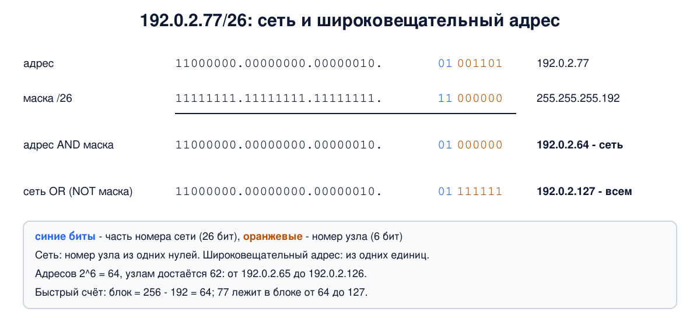
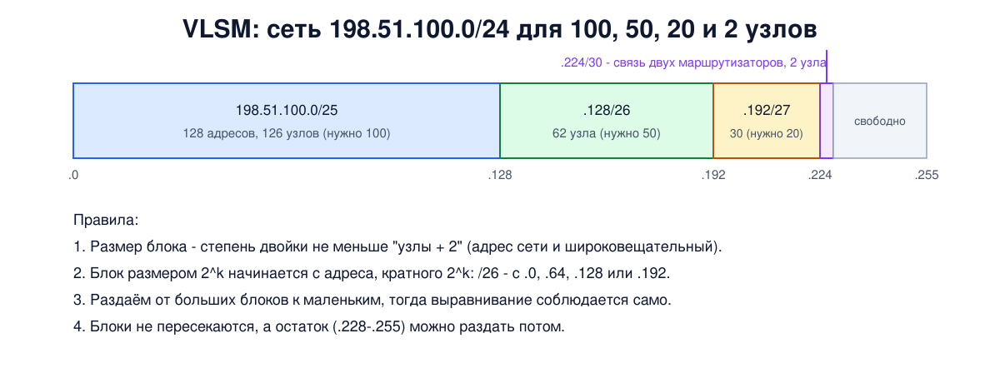

# Урок 22. Маски, CIDR и VLSM: считаем руками

В уроке 21 мы узнали, что IP-адрес делится на номер сети и номер узла, а граница между ними в самом адресе не видна. Её задаёт **маска** или **длина префикса**. Сегодня научимся с ними считать: по адресу и маске находить сеть, широковещательный адрес и диапазон адресов для узлов, делить сеть на подсети одинакового и разного размера и, наоборот, объединять несколько сетей в одну запись. Это ежедневная работа сетевого инженера, и её полезно уметь делать в уме. А проверять себя будем в Linux: скриптом на bash, модулем Python и самим ядром.

## Маска и длина префикса

**Маска** - это 32-битное число, в котором сначала идут единицы (столько, сколько бит занимает номер сети), а потом нули. Единицы "закрывают" номер сети, нули - номер узла. Олифер подчёркивает главное свойство: единицы идут **непрерывно**, без пропусков. Поэтому маску можно записать одним числом - количеством единиц. Это и есть **длина префикса**: `/24` и `255.255.255.0` - одно и то же (урок 2: `ff ff ff 00`).

Маску записывают так же, как адрес, по байтам. Внутри байта возможны всего девять значений, и их стоит запомнить:

| Единиц в байте | 0 | 1 | 2 | 3 | 4 | 5 | 6 | 7 | 8 |
|---|---|---|---|---|---|---|---|---|---|
| Значение байта | 0 | 128 | 192 | 224 | 240 | 248 | 252 | 254 | 255 |

Например, `/26` - это 8 + 8 + 8 + 2 единицы, то есть `255.255.255.192`, а `/18` - 8 + 8 + 2, то есть `255.255.192.0`.

В сети с префиксом `/n` на номер узла остаётся `32 - n` бит, значит, в ней **2^(32-n) адресов**. Два из них заняты (урок 21): адрес самой сети (номер узла из одних нулей) и широковещательный (из одних единиц). Узлам достаётся **2^(32-n) - 2**: в `/24` - 254, в `/26` - 62, в `/30` - 2. Два исключения: в `/31` по стандарту RFC 3021 оба адреса можно отдать двум концам двухточечной линии (о таком варианте пишет и Олифер), а `/32` - это один конкретный адрес, например в таблице маршрутов.

## Считаем сеть по адресу и маске

Все расчёты сводятся к трём логическим операциям над битами:

- **адрес сети = адрес AND маска** - обнуляем номер узла. Олифер называет это "наложением маски";
- **широковещательный адрес = адрес сети OR (NOT маска)** - заполняем номер узла единицами (можно брать и сам адрес вместо адреса сети - результат тот же);
- адреса узлов - всё, что между ними.



Возьмём `192.0.2.77/26`. Первые три байта маска `255.255.255` оставляет как есть: там только номер сети. Считать нужно только последний байт: `77 = 01001101`, маска `192 = 11000000`. AND даёт `01000000 = 64`, значит, сеть `192.0.2.64/26`. Заполняем 6 младших бит единицами: `01111111 = 127`, широковещательный адрес `192.0.2.127`. Узлы - от `.65` до `.126`, их 62.

С опытом двоичная запись становится не нужна. **Быстрый способ**: найди байт, где маска не 255 и не 0, - это "интересный" байт (если такого байта нет, граница идёт ровно по байту и считать нечего). Размер блока в нём - `256 - значение маски`. Сеть начинается с ближайшего снизу числа, кратного размеру блока, а заканчивается перед следующим. Для `/26`: блок `256 - 192 = 64`, блоки начинаются с 0, 64, 128, 192. Число 77 попадает в блок 64-127 - готово.

Ещё пример - адрес из примера маршрутизации у Олифера (с. 454): `129.44.78.200/18`. Маска `255.255.192.0`, интересный байт третий, блок `256 - 192 = 64`. Число 78 попадает в блок 64-127. Значит, сеть `129.44.64.0/18`, широковещательный адрес `129.44.127.255`, узлов 2^14 - 2 = 16 382.

**Правильная запись сети.** Запись `адрес/n` описывает сеть, только если номер узла в адресе состоит из одних нулей. Олифер приводит пример: `193.20.0.0/14` - правильная сеть, а `193.20.0.0/12` - нет. Для /12 сеть начиналась бы с `193.16.0.0`, а у `193.20.0.0` в номере узла есть единица. (У Олифера в этом месте нули ошибочно ищут "в поле номера сети", хотя речь о номере узла.) Модуль Python в нашем опыте именно так и ругается: "has host bits set".

## Деление на подсети

Организация получила одну сеть, а ей нужно несколько: отделы, серверы, гостевой Wi-Fi (уроки 18 и 20). Решение - **деление на подсети** (subnetting): удлиняем префикс, забирая старшие биты номера узла под номер подсети. Олифер разбирает пример: сеть `129.44.0.0/16` делят на четыре равные части, забрав 2 бита. Получаются `129.44.0.0/18`, `129.44.64.0/18`, `129.44.128.0/18` и `129.44.192.0/18`, в каждой по 2^14 адресов. Снаружи сеть по-прежнему видна как один блок `/16`, а внутренний маршрутизатор разводит пакеты по подсетям, сравнивая адрес назначения с каждой подсетью по маске. Таненбаум показывает деление на примере университета, причём части у него разного размера: факультеты получают /17, /18 и /19 из одного /16 (по сути это уже VLSM, о нём ниже).

(Олифер упоминает старое правило RFC 950, по которому нельзя было использовать подсети с номером из одних нулей или одних единиц, `129.44.0.0/18` и `129.44.192.0/18` в этом примере. Сегодня это ограничение снято, и такие подсети используют наравне с остальными.)

## VLSM: подсети разного размера

Делить на равные части расточительно: связи между двумя маршрутизаторами нужно 2 адреса, а в равном делении она получит столько же, сколько большой отдел. Олифер показывает это на своём примере: подсеть из 16 тысяч адресов, в которой заняты два. Поэтому используют **маски переменной длины** (VLSM, variable length subnet mask): каждая подсеть получает ровно столько, сколько ей нужно, с округлением до степени двойки.

Правила простые:

1. Для каждой подсети выбираем наименьший блок 2^k, в котором помещаются все узлы **плюс два** служебных адреса.
2. **Выравнивание**: блок размером 2^k должен начинаться с адреса, кратного 2^k. Таненбаум показывает это на примере: университету нужно 4096 адресов, и блок `194.24.8.0` ему не подходит, потому что 8 не кратно 16, - он получает `194.24.16.0/20`.
3. Раздаём от больших блоков к маленьким: тогда выравнивание получается само, и дырок не остаётся.

Пример: из сети `198.51.100.0/24` нужны подсети на 100, 50, 20 и 2 узла. На 100 узлов нужен блок 128 (/25), на 50 - 64 (/26), на 20 - 32 (/27), на 2 - 4 (/30). Раздаём по порядку: `198.51.100.0/25`, `198.51.100.128/26`, `198.51.100.192/27`, `198.51.100.224/30`. Остаются свободными адреса с `.228` по `.255`, их можно раздать потом.



Олифер предупреждает о важной детали: маска в IP-пакете не передаётся. Если подсети разного размера, маршрутизаторы должны узнавать маски друг от друга, поэтому из протоколов динамической маршрутизации для VLSM годятся только те, что передают маски (например, OSPF и RIPv2, а старый RIP - нет; урок 32).

Осторожно с примером VLSM у Олифера: для связи маршрутизаторов `129.44.192.0` в тексте выбрана маска `255.255.255.252` (/30), а в таблицах маршрутизации к этой же сети стоят `255.255.255.248` и `255.255.255.192`, и там же встречается адрес порта `129.44.191.2`, которого в этой схеме нет. Правильно - `/30`, как в тексте.

## CIDR: объединяем сети

Обратная операция - **агрегация** (Олифер называет её ещё супернетингом): несколько соседних сетей с общим префиксом записываются одной строкой с более коротким префиксом. Это главный инструмент **CIDR** (бесклассовой междоменной маршрутизации, урок 21), который резко замедлил рост таблиц маршрутизации в интернете.

Таненбаум разбирает пример: из блока `194.24.0.0` Кембридж получил `194.24.0.0/21` (2048 адресов), Эдинбург - `194.24.8.0/22` (1024), Оксфорд - `194.24.16.0/20` (4096), а `194.24.12.0/22` пока свободен. Все четыре блока лежат внутри `194.24.0.0/19` (8192 адреса), и далёкому маршрутизатору в Нью-Йорке достаточно одной записи `194.24.0.0/19` - "всё это в Лондон". Как быть, если свободный блок потом отдадут в другое место, решает правило **самого длинного совпадающего префикса**: из подходящих записей выбирается самая точная. Подробно - в уроке 26. (На рисунках Таненбаума в этом примере адреса напечатаны как `192.24...`, а в таблице и тексте `194.24...`; правильно `194.24`.)

Олифер добавляет условие, без которого агрегация не работает: адреса соседних сетей должны лежать рядом в адресном пространстве. Поэтому провайдеры получают непрерывные блоки и раздают клиентам части этих блоков, о чём в уроке 23.

## Как это увидеть в Linux

Проверим расчёты тремя способами: своей функцией на bash, стандартным модулем Python `ipaddress` и самим ядром Linux. Нужны Linux (подойдёт и WSL2), права sudo и python3; ядру мы дадим адрес в учебном пространстве имён `hbh-mask`, которое скрипт в конце удаляет.

Создай файл `mask-lab.sh` и запусти `bash mask-lab.sh`:

```
set -u
# адрес <-> 32-битное число
ip2int() { IFS=. read -r a b c d <<< "$1"; echo $(( (a << 24) | (b << 16) | (c << 8) | d )); }
int2ip() { echo "$(( $1 >> 24 & 255 )).$(( $1 >> 16 & 255 )).$(( $1 >> 8 & 255 )).$(( $1 & 255 ))"; }
# расчёт сети по адресу с префиксом: всё через AND, OR и NOT
calc() {
  local a=${1%/*} l=${1#*/}
  local ip=$(ip2int $a)
  local mask=$(( (0xFFFFFFFF << (32 - l)) & 0xFFFFFFFF ))
  local net=$(( ip & mask ))
  local bc=$(( net | (~mask & 0xFFFFFFFF) ))
  echo "$1"
  echo "  mask $(int2ip $mask), network $(int2ip $net)/$l, broadcast $(int2ip $bc)"
  echo "  hosts $(int2ip $((net + 1))) - $(int2ip $((bc - 1))), usable $((bc - net - 1)) of $((bc - net + 1))"
}
echo '--- 1. by hand (bash)'
calc 192.0.2.77/26
calc 129.44.78.200/18
calc 193.20.30.5/28
echo '--- 2. the same with the python ipaddress module'
python3 - <<'EOF'
import ipaddress
for s in ["192.0.2.77/26", "129.44.78.200/18", "193.20.30.5/28"]:
    n = ipaddress.ip_interface(s).network
    print(f"{s}: network {n}, broadcast {n.broadcast_address}, addresses {n.num_addresses}")
for s in ["193.20.0.0/12", "193.20.0.0/14"]:
    try:
        print(s, "->", ipaddress.ip_network(s))
    except ValueError as e:
        print(s, "->", e)
EOF
echo '--- 3. the kernel computes the connected network itself'
sudo ip netns del hbh-mask 2>/dev/null
sudo ip netns add hbh-mask
sudo ip netns exec hbh-mask ip link add d0 type dummy
sudo ip netns exec hbh-mask ip addr add 192.0.2.77/26 dev d0
sudo ip netns exec hbh-mask ip link set d0 up
sudo ip netns exec hbh-mask ip route
sudo ip netns exec hbh-mask ip route show table local | grep d0
sudo ip netns del hbh-mask
echo '--- 4. VLSM: split 198.51.100.0/24 for 100, 50, 20 and 2 hosts'
python3 - <<'EOF'
import ipaddress, math
free = ipaddress.ip_network("198.51.100.0/24")
cursor = int(free.network_address)
nets = []
for need in sorted([100, 50, 20, 2], reverse=True):
    size = 2 ** math.ceil(math.log2(need + 2))   # + адрес сети и широковещательный
    net = ipaddress.ip_network((cursor, 32 - int(math.log2(size))))
    nets.append(net)
    print(f"{need:>3} hosts -> {net} ({size} addresses, {size - 2} usable)")
    cursor += size
print("left free from", ipaddress.ip_address(cursor))
print("all inside the /24:", all(n.subnet_of(free) for n in nets))
print("no overlaps:", not any(a.overlaps(b) for i, a in enumerate(nets) for b in nets[i + 1:]))
EOF
ip netns list | grep -c '^hbh-mask'
```

Вот что получилось на нашем сервере (в WSL2 вывод совпал до символа):

```
--- 1. by hand (bash)
192.0.2.77/26
  mask 255.255.255.192, network 192.0.2.64/26, broadcast 192.0.2.127
  hosts 192.0.2.65 - 192.0.2.126, usable 62 of 64
129.44.78.200/18
  mask 255.255.192.0, network 129.44.64.0/18, broadcast 129.44.127.255
  hosts 129.44.64.1 - 129.44.127.254, usable 16382 of 16384
193.20.30.5/28
  mask 255.255.255.240, network 193.20.30.0/28, broadcast 193.20.30.15
  hosts 193.20.30.1 - 193.20.30.14, usable 14 of 16
--- 2. the same with the python ipaddress module
192.0.2.77/26: network 192.0.2.64/26, broadcast 192.0.2.127, addresses 64
129.44.78.200/18: network 129.44.64.0/18, broadcast 129.44.127.255, addresses 16384
193.20.30.5/28: network 193.20.30.0/28, broadcast 193.20.30.15, addresses 16
193.20.0.0/12 -> 193.20.0.0/12 has host bits set
193.20.0.0/14 -> 193.20.0.0/14
--- 3. the kernel computes the connected network itself
192.0.2.64/26 dev d0 proto kernel scope link src 192.0.2.77 
local 192.0.2.77 dev d0 proto kernel scope host src 192.0.2.77 
broadcast 192.0.2.127 dev d0 proto kernel scope link src 192.0.2.77 
--- 4. VLSM: split 198.51.100.0/24 for 100, 50, 20 and 2 hosts
100 hosts -> 198.51.100.0/25 (128 addresses, 126 usable)
 50 hosts -> 198.51.100.128/26 (64 addresses, 62 usable)
 20 hosts -> 198.51.100.192/27 (32 addresses, 30 usable)
  2 hosts -> 198.51.100.224/30 (4 addresses, 2 usable)
left free from 198.51.100.228
all inside the /24: True
no overlaps: True
0
```

Разберём по шагам.

- **Шаг 1: bash.** Функция `calc` переводит адрес в 32-битное число и делает ровно то, что мы делали руками: строит маску сдвигом единиц влево, находит сеть через AND и широковещательный адрес через OR с инверсией маски. Результаты совпадают с нашими расчётами: `192.0.2.64/26`, `129.44.64.0/18`. Третий пример - клиент из книги Олифера, которому нужно 13 адресов: блок `/28` даёт 16 адресов и 14 узлов. Функция рассчитана на префиксы до /30: для /31 и /32 правило "минус два" не действует, и она покажет бессмыслицу.
- **Шаг 2: Python.** Модуль `ipaddress` даёт те же ответы. А попытка записать `193.20.0.0/12` как сеть заканчивается ошибкой `has host bits set`: в номере узла есть единицы, это не адрес сети. `193.20.0.0/14` - правильная сеть.
- **Шаг 3: ядро.** Мы только назначили интерфейсу адрес `192.0.2.77/26`, а ядро само вычислило сеть и добавило маршрут `192.0.2.64/26 dev d0`: всё, что в этой сети, доступно напрямую через этот интерфейс. В локальной таблице - наш адрес и широковещательный `192.0.2.127`. Поэтому маска при настройке так важна: с неверной маской машина будет считать "своими" не те адреса и пытаться достать напрямую тех, кто на самом деле за маршрутизатором, или наоборот.
- **Шаг 4: VLSM.** Небольшая программа делает то же, что мы делали вручную: для каждой потребности берёт наименьший подходящий блок, идёт от больших к маленьким и в конце проверяет, что все подсети лежат внутри `/24` и не пересекаются.
- В конце `0`: учебное пространство имён удалено.

Если под рукой нет скрипта, для быстрых расчётов подойдут и готовые утилиты, например `ipcalc` (`sudo apt install ipcalc`), но считать самому полезнее: так быстрее находишь ошибки в чужих настройках.

## Почему это важно для безопасности

Правила межсетевых экранов, списки доступа и настройки служб почти всегда пишутся через префиксы: "разрешить `10.20.30.0/24`". Ошибка в одной цифре может изменить размер блока в разы, а то и в сотни раз. `/16` вместо `/24` откроет доступ не 256 адресам, а 65 536, а `0.0.0.0/0` - всему интернету. А правило для `10.20.30.64/26`, записанное как `10.20.30.70/26`, одни программы молча приведут к `10.20.30.64/26` (так делает iptables), а другие отвергнут (ip route и модуль Python). Поэтому правила стоит проверять тем же способом, что и в уроке: считать границы блока и сверять их с тем, что задумано.

## Итог

- Маска - 32 бита: непрерывные единицы (номер сети), затем нули (номер узла). Длина префикса `/n` - число единиц. Значения байта маски: 0, 128, 192, 224, 240, 248, 252, 254, 255.
- В сети `/n` 2^(32-n) адресов, узлам достаётся на два меньше; исключения - `/31` для двухточечных линий и `/32`.
- Сеть = адрес AND маска, широковещательный = сеть OR (NOT маска). Быстро: блок = 256 - значение маски в "интересном" байте.
- Запись `адрес/n` - сеть, только если номер узла из одних нулей.
- Деление на подсети удлиняет префикс; VLSM даёт подсети разного размера: блок 2^k не меньше "узлы + 2", выравнивание по кратности 2^k, раздача от больших к меньшим.
- CIDR объединяет соседние сети в одну запись с коротким префиксом, а из нескольких подходящих записей выбирается самая длинная (урок 26).

## Что почитать

- Олифер, "Компьютерные сети", глава 13, с. 406 и 409-413: маски, запись с префиксом, CIDR и выделение адресов провайдером; глава 14, с. 450-458: деление сети масками одинаковой и переменной длины, маршрутизация с масками, агрегация. Учти неточности в таблицах примера VLSM, о которых шла речь выше.
- Таненбаум, "Компьютерные сети", раздел 5.7.2, с. 506-512: префиксы и маски, подсети, CIDR, агрегация и самый длинный совпадающий префикс.
