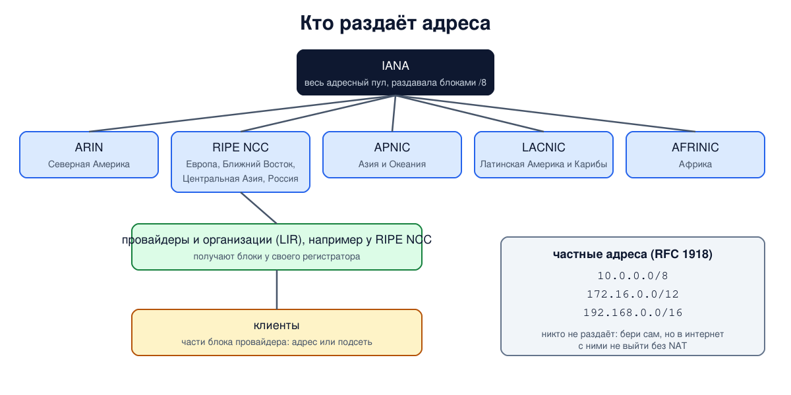

# Урок 23. Частные адреса и кто раздаёт адреса: IANA, RIR и провайдеры

Мы уже знаем, как устроен адрес (урок 21) и как делить адресные блоки (урок 22). Остались два практических вопроса. Откуда берутся адреса, чтобы в интернете не оказалось двух одинаковых? И почему у тебя дома адрес вроде `192.168.1.10`, а у соседа точно такой же, и это никому не мешает? Сегодня разберём иерархию раздачи адресов от IANA до провайдера, частные адреса и их границы, а в опыте спросим у самих регистраторов, кому принадлежат несколько известных адресов.

## Зачем нужна централизованная раздача

Олифер начинает с простого требования: адрес должен однозначно указывать на интерфейс. Значит, номера сетей в интернете не должны повторяться, а назначать их должен кто-то один. В отдельной сети, не подключённой к интернету, администратор может брать любые адреса: совпадение с адресами других изолированных сетей ни на что не влияет. Но если такую сеть потом подключить к интернету, её произвольные адреса могут совпасть с чужими, уже занятыми в интернете. Отсюда два решения: централизованная раздача **публичных** (глобальных) адресов и специально выделенные **частные** адреса для внутренних сетей.

## Иерархия: IANA, региональные регистраторы, провайдеры

Адреса раздаются по цепочке, и каждое звено получает блок из блока звена выше. Так адреса провайдера лежат рядом, и маршруты к ним можно объединять (урок 22).

- **IANA** (Internet Assigned Numbers Authority) распоряжается всем адресным пространством. С 1998 года за функцию IANA отвечает некоммерческая организация **ICANN**, о которой пишут и Олифер, и Таненбаум (с 2016 года её выполняет дочерняя организация ICANN - PTI). IANA выдавала адреса крупными блоками `/8` региональным регистраторам, а после 2011 года раздаёт лишь небольшие возвращённые блоки.
- **Региональные интернет-регистраторы** (RIR, Regional Internet Registry). Их пять: **ARIN** (Северная Америка), **RIPE NCC** (Европа, Ближний Восток, Центральная Азия, в том числе Россия), **APNIC** (Азия и Тихоокеанский регион), **LACNIC** (Латинская Америка и Карибы) и **AFRINIC** (Африка). Олифер перечисляет только первые три: LACNIC официально признан в 2002 году, AFRINIC в 2005-м, и этот фрагмент книги, видимо, остался от ранних изданий.
- **Локальные регистраторы** (LIR) - обычно провайдеры и крупные организации. Они получают блоки у своего RIR и раздают части клиентам.
- **Клиенты** получают от провайдера один адрес, несколько или целую подсеть. Такие адреса называют **зависимыми от провайдера** (PA, provider aggregatable): уходя к другому провайдеру, их отдают обратно. Крупные организации могут получить у RIR и **независимые** адреса (PI), которые остаются с ними при смене провайдера.



Правила раздачи когда-то описывал RFC 2050, на который ссылается Олифер. Его заменил RFC 7020, который описывает устройство системы регистраторов, а конкретные правила принимают сообщества самих регистраторов.

## Адреса закончились

2^32 - это около 4,3 миллиарда адресов, и часть из них особые (урок 21). Уже в 1990-е стало ясно, что их не хватит. Олифер отмечает, что получить блок класса B давно трудно, а класса A невозможно, и что дефицит вызван не только ростом сети, но и расточительной раздачей в эпоху классов.

Последние свободные блоки `/8` IANA раздала региональным регистраторам в феврале 2011 года. Дальше регистраторы шли к концу по-разному. APNIC перешёл на раздачу последнего блока `/8` малыми порциями в апреле 2011 года, RIPE NCC - в сентябре 2012-го. Полностью свободные адреса закончились у ARIN в сентябре 2015 года, у RIPE NCC 25 ноября 2019 года (эту дату Таненбаум называет как момент, когда были выделены последние адреса IPv4, но относится она именно к RIPE NCC), у LACNIC в августе 2020 года; AFRINIC раздаёт последние остатки. Сегодня новые организации получают совсем маленькие блоки из возвращённых адресов, стоят в очереди или покупают адреса у тех, у кого они есть: появился рынок адресов IPv4.

Как с этим живут: **CIDR** (урок 22) позволил раздавать ровно столько, сколько нужно; **NAT** (уроки 56-58) позволяет целой сети выходить в интернет через один публичный адрес; а принципиальное решение - **IPv6** со 128-битными адресами (урок 30).

## Частные адреса

Для внутренних сетей стандарт RFC 1918 (1996) выделил три блока (впервые их определил RFC 1597 в 1994 году), которые никому не раздаются и в интернете не маршрутизируются:

| Блок | Диапазон | Адресов | Бывший класс |
|---|---|---|---|
| `10.0.0.0/8` | 10.0.0.0 - 10.255.255.255 | 16 777 216 | одна сеть A |
| `172.16.0.0/12` | 172.16.0.0 - 172.31.255.255 | 1 048 576 | 16 сетей B |
| `192.168.0.0/16` | 192.168.0.0 - 192.168.255.255 | 65 536 | 256 сетей C |

Числа адресов приводит Таненбаум. (У Олифера для третьего блока написано "255 сетей" - это ошибка: от 192.168.0.0 до 192.168.255.0 их 256.)

Главные свойства частных адресов:

- **их не нужно ни у кого получать**: любая организация и любой дом могут пользоваться ими как угодно, поэтому одинаковые частные адреса есть в миллионах сетей одновременно;
- **в интернете их быть не должно**: Таненбаум формулирует это правило жёстко, как запрет без исключений. Маршрутизаторы на границе должны отбрасывать такие пакеты (на практике это делают не все). А в трассировке (уроки 12 и 28) ты можешь увидеть частные адреса или 100.64.x у узлов внутри сети провайдера: это его внутренние маршрутизаторы, а не нарушение правила;
- **чтобы выйти в интернет, нужен NAT**: маршрутизатор на выходе подменяет частный адрес отправителя своим публичным (уроки 56-58). Так работает почти каждая домашняя сеть.

Частая ошибка - считать частным весь `172.x.x.x`. Частный только диапазон с `172.16` по `172.31`, а `172.32.0.1` - обычный публичный адрес, мы увидим это в опыте. Помимо RFC 1918, есть и другие непубличные блоки (урок 21): `100.64.0.0/10` для NAT провайдеров, link-local `169.254.0.0/16`, документационные. Они тоже не частные в смысле RFC 1918, но и в интернете их быть не должно.

## Как это увидеть в Linux

Проверим, какие адреса частные, и спросим регистраторов о нескольких публичных адресах. Для этого есть протокол **RDAP** (Registration Data Access Protocol): преемник старого whois, который отдаёт данные регистраторов в формате JSON. А IANA публикует файл, в котором записано, какой регистратор обслуживает какой блок `/8`. Нужны Linux (подойдёт WSL2), python3, curl и доступ в интернет; скрипт только читает открытые данные и ничего в системе не меняет.

Создай файл `rir-lab.sh` и запусти `bash rir-lab.sh`:

```
set -u
for c in curl python3; do
  command -v $c >/dev/null || { echo "нужен $c: sudo apt install $c"; exit 1; }
done
echo '--- 1. private or public?'
python3 - <<'EOF'
import ipaddress
private = [ipaddress.ip_network(n) for n in ("10.0.0.0/8", "172.16.0.0/12", "192.168.0.0/16")]
for s in ["10.1.2.3", "172.20.0.5", "172.32.0.1", "192.168.1.10", "100.64.1.1",
          "169.254.1.1", "192.0.2.1", "8.8.8.8", "1.1.1.1"]:
    a = ipaddress.ip_address(s)
    rfc1918 = any(a in n for n in private)
    print(f"{s:<13} RFC 1918: {'yes' if rfc1918 else 'no ':<3}  global: {'yes' if a.is_global else 'no'}")
EOF
echo '--- 2. IANA: which regional registry serves which block'
curl -s --max-time 20 https://data.iana.org/rdap/ipv4.json | python3 -c '
import json, sys, ipaddress
data = json.load(sys.stdin)
for ip in ["8.8.8.8", "193.0.14.129", "1.1.1.1", "200.160.0.8", "196.216.2.1"]:
    a = ipaddress.ip_address(ip)
    for blocks, urls in data["services"]:
        if any(a in ipaddress.ip_network(b) for b in blocks):
            best = [b for b in blocks if a in ipaddress.ip_network(b)][0]
            print(f"{ip:<14} in {best:<12} -> {urls[0]}")
'
echo '--- 3. the registry record for two addresses'
f=$(mktemp)
for u in https://rdap.arin.net/registry/ip/8.8.8.8 https://rdap.db.ripe.net/ip/193.0.14.129; do
  curl -sL --max-time 20 "$u" > "$f"
  python3 - "$f" <<'EOF'
import json, sys
d = json.load(open(sys.argv[1]))
print(d.get("startAddress"), "-", d.get("endAddress"), " name", d.get("name"),
      " country", d.get("country", "-"), " type", d.get("type", "-"))
EOF
done
rm -f "$f"
```

Вот что получилось на нашем сервере:

```
--- 1. private or public?
10.1.2.3      RFC 1918: yes  global: no
172.20.0.5    RFC 1918: yes  global: no
172.32.0.1    RFC 1918: no   global: yes
192.168.1.10  RFC 1918: yes  global: no
100.64.1.1    RFC 1918: no   global: no
169.254.1.1   RFC 1918: no   global: no
192.0.2.1     RFC 1918: no   global: no
8.8.8.8       RFC 1918: no   global: yes
1.1.1.1       RFC 1918: no   global: yes
--- 2. IANA: which regional registry serves which block
8.8.8.8        in 8.0.0.0/8    -> https://rdap.arin.net/registry/
193.0.14.129   in 193.0.0.0/8  -> https://rdap.db.ripe.net/
1.1.1.1        in 1.0.0.0/8    -> https://rdap.apnic.net/
200.160.0.8    in 200.0.0.0/8  -> https://rdap.lacnic.net/rdap/
196.216.2.1    in 196.0.0.0/8  -> https://rdap.afrinic.net/rdap/
--- 3. the registry record for two addresses
8.8.8.0 - 8.8.8.255  name GOGL  country -  type DIRECT ALLOCATION
193.0.14.0 - 193.0.15.255  name RIPE-NCC-K-ROOT  country NL  type ASSIGNED PA
```

Разберём по шагам.

- **Шаг 1: частный или публичный.** Колонка `RFC 1918` проверяет три частных блока, колонка `global` - встроенное в модуль `ipaddress` понятие "глобально доступный адрес", основанное на реестре особых адресов IANA. `10.1.2.3`, `172.20.0.5` и `192.168.1.10` - частные. `172.32.0.1` - уже нет: он за границей блока `172.16.0.0/12` и является обычным публичным адресом. `100.64.1.1`, `169.254.1.1` и `192.0.2.1` не частные в смысле RFC 1918, но и не глобальные: это NAT провайдера, link-local и документация. `8.8.8.8` и `1.1.1.1` - публичные адреса известных DNS-серверов (блок 7). Заметь: в библиотеках слово "private" часто означает не только RFC 1918, а почти любые неглобальные адреса, поэтому проверяй, что именно считает твоя библиотека.
- **Шаг 2: IANA.** По файлу IANA видно, какой регистратор отвечает за блок: `8.0.0.0/8` - ARIN, `193.0.0.0/8` - RIPE NCC, `1.0.0.0/8` - APNIC, `200.0.0.0/8` - LACNIC, `196.0.0.0/8` - AFRINIC. Это и есть верхний уровень иерархии.
- **Шаг 3: запись у регистратора.** ARIN сообщает, что `8.8.8.0 - 8.8.8.255` зарегистрирован за Google (имя сети `GOGL` - это код Google в ARIN), тип `DIRECT ALLOCATION` - блок выделен напрямую регистратором. RIPE NCC отвечает, что `193.0.14.0 - 193.0.15.255` - это `RIPE-NCC-K-ROOT`: адрес `193.0.14.129` принадлежит корневому DNS-серверу K, который обслуживает сам RIPE NCC (блок 7), страна `NL` (это страна в регистрационной записи; сам сервер K работает во многих точках мира через anycast), тип `ASSIGNED PA` - назначен из блока, зависимого от провайдера. Такие запросы полезны в работе: так узнают, какой сети принадлежит адрес, с которого идёт атака, и куда писать жалобу (у записей регистраторов есть контакты для жалоб, abuse). Помни, что адрес отправителя мог быть подделан (урок 25), а владелец сети - обычно не сам атакующий, а провайдер или хостинг заражённой машины.

## Почему это важно на практике

- **Фильтрация на границе.** Пакет, пришедший из интернета с частным или другим особым адресом отправителя, - поддельный или ошибочный: законно таких адресов отправителя в интернете быть не должно. Поэтому провайдеры и администраторы должны отбрасывать такие пакеты на границе сети (списки "невозможных" адресов называют bogons). Подмену адреса отправителя мы разберём в уроке 25.
- **Совпадение частных сетей.** Если дома и в офисе одна и та же сеть `192.168.1.0/24`, при подключении к офису через VPN компьютер не поймёт, какой `192.168.1.10` имеется в виду. Для своих сетей удобно выбирать менее популярные диапазоны, например случайную подсеть внутри `10.0.0.0/8`.
- **Частный адрес - не защита.** Сам по себе частный адрес не делает устройство недоступным: от входящих подключений его защищает межсетевой экран на маршрутизаторе (блок 6), NAT мешает им лишь как побочный эффект (урок 56), а внутри сети устройство доступно всем соседям.

## Итог

- Уникальность публичных адресов обеспечивает иерархия: IANA (функция ICANN) раздаёт блоки пяти региональным регистраторам (ARIN, RIPE NCC, APNIC, LACNIC, AFRINIC), те - провайдерам и организациям, провайдеры - клиентам.
- Адреса провайдера (PA) возвращаются при смене провайдера, независимые (PI) остаются у организации.
- Свободные адреса IPv4 закончились: у IANA в 2011 году, у регистраторов - в 2011-2020 годах (AFRINIC ещё раздаёт остатки). Спасают CIDR, NAT и переход на IPv6.
- Частные адреса RFC 1918: `10.0.0.0/8`, `172.16.0.0/12` (только 172.16-172.31), `192.168.0.0/16`. Их берут без разрешения, в интернете их быть не должно, для выхода наружу нужен NAT.
- Регистраторы отвечают на запросы RDAP: так узнают, кому принадлежит адрес.

## Что почитать

- Олифер, "Компьютерные сети", глава 13, с. 410-413: порядок назначения адресов, частные адреса, ICANN и региональные регистраторы, NAT и CIDR как ответ на дефицит. Учти, что список регистраторов там неполный, а число сетей в блоке 192.168 указано неверно.
- Таненбаум, "Компьютерные сети", раздел 5.7.2, с. 507 и 515-516: кто назначает номера сетей (ICANN и региональные органы), дефицит адресов и три частных диапазона; дата исчерпания - раздел 5.7.3, с. 519.
