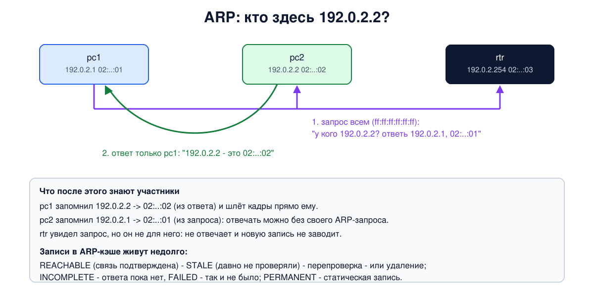

# Урок 24. ARP и Proxy-ARP: как IP-адрес превращается в MAC-адрес

У нас есть два мира адресов. IP-адрес говорит, куда в конечном счёте должен попасть пакет (уроки 21-23). MAC-адрес нужен, чтобы доставить кадр по конкретной сети Ethernet или Wi-Fi (урок 15). Сетевая карта понятия не имеет об IP-адресах, и чтобы отправить пакет соседу или маршрутизатору, компьютер должен узнать его MAC-адрес. Этим занимается протокол **ARP**. Сегодня разберём, как он работает, как устроен ARP-кэш, что такое Proxy-ARP, посмотрим всё это в Linux, а в конце обсудим, почему ARP - одно из самых доверчивых мест локальной сети и как его защищают.

## Зачем нужен ARP

Олифер подчёркивает, что между IP-адресом и MAC-адресом нет никакой формулы (урок 21), значит, соответствие можно только узнать и запомнить. Таненбаум показывает, когда это нужно. Компьютер отправляет пакет:

- **соседу в своей сети** - тогда нужен MAC-адрес самого соседа;
- **узлу в другой сети** - тогда пакет идёт через маршрутизатор (шлюз по умолчанию, урок 26), и нужен MAC-адрес **маршрутизатора**, а не далёкого получателя.

Таненбаум замечает важное следствие: на каждом участке пути MAC-адреса в кадре меняются, а IP-адреса отправителя и получателя остаются прежними, потому что указывают на конечные точки. Мы видели это в уроке 18, когда маршрутизатор пересылал пинг между VLAN со своим MAC-адресом.

## Как работает ARP

ARP описан в RFC 826 (1982). Когда IP-модулю нужен MAC-адрес для адреса `192.0.2.2`, происходит следующее (Олифер разбирает это по шагам):

1. Сначала компьютер смотрит в свой **ARP-кэш** - таблицу соответствий. Если запись есть, ARP больше ничего не делает.
2. Если записи нет, компьютер рассылает **ARP-запрос** всем в своей сети, на широковещательный MAC-адрес `ff:ff:ff:ff:ff:ff`: "у кого IP-адрес 192.0.2.2? Ответь 192.0.2.1, мой MAC такой-то".
3. Запрос получают все в широковещательном домене (урок 16), но отвечает только тот, чей это адрес. **ARP-ответ** идёт адресно, только спросившему: "192.0.2.2 - это MAC 02:...:02".
4. Спросивший записывает ответ в кэш и отправляет пакет.

Олифер отмечает, что запрос не выходит за маршрутизатор: широковещательные кадры он не пересылает. Поэтому ARP работает только внутри одной сети, а для пакетов наружу спрашивают MAC-адрес маршрутизатора.

ARP-сообщение едет прямо в кадре Ethernet с EtherType `0x0806` (урок 15), без IP. Олифер приводит его поля: тип сети (1 - Ethernet), тип протокола (`0x0800` - IPv4), длины адресов (6 и 4 байта), код операции (1 - запрос, 2 - ответ), а затем MAC- и IP-адреса отправителя и получателя. В запросе MAC-адрес получателя неизвестен и заполнен нулями. (В таблице ARP-ответа у Олифера в поле операции напечатано "2 (0x1)" - опечатка, должно быть `0x2`.)



Два приёма экономят запросы. Во-первых, кэш: результат запоминается. Во-вторых, в каждом запросе есть IP- и MAC-адрес спрашивающего, поэтому получатель запроса сразу запоминает его и может ответить, не задавая встречного вопроса. Олифер пишет, что пополнить кэш из запроса могут вообще все, кто его услышал; современные системы так обычно не делают: они обновляют уже существующие записи, но не заводят новые для всех подряд.

## ARP-кэш и его жизнь

Записи бывают двух видов:

- **динамические** появляются из ARP-обмена и живут недолго: Олифер и Таненбаум говорят о минутах (в главе 8 Таненбаум - о десятках минут). Если компьютер сменил сетевую карту или адрес перешёл к другому устройству, старая запись не должна жить вечно;
- **статические** вносит администратор, они не устаревают.

В Linux жизнь динамической записи сложнее, чем "запомнил и забыл через несколько минут". Ядро ведёт таблицу **соседей** (neighbour table, команда `ip neigh`), и у записи есть состояния:

- `REACHABLE` - связь с соседом недавно подтвердилась (ответом на ARP или, например, ответами TCP). Это состояние длится около `base_reachable_time` - 30 секунд, со случайным разбросом от половины до полутора;
- `STALE` - запись давно не подтверждалась, но пользоваться ей можно;
- `DELAY` и `PROBE` - запись снова понадобилась, и ядро проверяет её: сначала немного ждёт, не подтвердится ли связь сама, потом отправляет адресный ARP-запрос;
- `INCOMPLETE` - запрос отправлен, ответа ещё нет; `FAILED` - ответа так и не было;
- `PERMANENT` - статическая запись.

Когда таблица большая (больше `gc_thresh1`, по умолчанию 128 записей), ядро удаляет записи, которые не использовались дольше `gc_stale_time` (60 секунд). В маленькой таблице записи `STALE` могут жить долго: они не мешают, потому что перед использованием всё равно перепроверяются.

**Добровольный ARP** (gratuitous ARP). Таненбаум описывает приём: при настройке интерфейса компьютер рассылает ARP-запрос о **собственном** адресе. Ответа быть не должно, а все соседи обновляют у себя его запись. Если же ответ пришёл, значит, этот адрес уже кто-то занял, и это конфликт адресов. На практике (это уже не из книги) такие сообщения используют и для быстрого переключения: когда адрес переезжает на резервный сервер, тот объявляет его, и соседи сразу начинают слать кадры по новому MAC-адресу. (А свободен ли адрес, сегодня обычно проверяют специальной ARP-пробой, RFC 5227.)

Для IPv6 вместо ARP работает протокол обнаружения соседей NDP (урок 31); механизм соседей с теми же состояниями и команда `ip neigh` в Linux у них общие.

## Proxy-ARP

Иногда устройство отвечает на ARP-запрос **за другого**. Олифер и Таненбаум описывают **Proxy-ARP**: маршрутизатор отвечает за узел, которого на самом деле нет в этом широковещательном домене. У Олифера это удалённый компьютер с адресом из этой же сети, подключённый через модем по PPP, у Таненбаума - хост соседней сети, о чём отправитель не должен знать. На ARP-запрос об этом адресе маршрутизатор отвечает своим MAC-адресом. Спрашивающий думает, что получатель рядом, отправляет кадр маршрутизатору, а тот пересылает пакет дальше.

Олифер называет такой ответ "ложным", и в этом слове суть: ответ не про того, о ком спрашивали. Здесь это законный приём, который включает администратор, но он показывает главное свойство ARP: ответ никак не проверяется. (Олифер пишет, что Proxy-ARP работает, "даже в тех случаях, когда искомый узел находится за пределами данного домена коллизий"; точнее - за пределами широковещательного домена, то есть там, куда ARP-запрос не доходит.) Сегодня Proxy-ARP встречается реже: например, у некоторых хостинг-провайдеров и в VPN-серверах, которые раздают клиентам адреса из локальной сети. А на маршрутизаторах Cisco он включён по умолчанию и из-за этого может незаметно "чинить" неверные маски и отсутствующий шлюз у компьютеров.

## Как это увидеть в Linux

Соберём сеть, похожую на ту, что в уроке 16: коммутатор `hbh-sw` и два компьютера `pc1` (`192.0.2.1`) и `pc2` (`192.0.2.2`), плюс маршрутизатор `rtr` (`192.0.2.254`). За маршрутизатором отдельным кабелем подключим ещё один компьютер `pc3`, но с адресом `192.0.2.50` из той же сети - для опыта с Proxy-ARP. Нужны Linux (подойдёт WSL2), права sudo и tcpdump; всё создаётся в пространствах имён `hbh-*` и в конце удаляется.

Создай файл `arp-lab.sh` и запусти `bash arp-lab.sh`:

```
set -u
command -v tcpdump >/dev/null || { echo "нужен tcpdump: sudo apt install tcpdump"; exit 1; }
# убрать остатки прошлого запуска
for n in hbh-sw hbh-pc1 hbh-pc2 hbh-rtr hbh-pc3; do sudo ip netns del $n 2>/dev/null; done
# коммутатор hbh-sw, компьютеры pc1, pc2 и маршрутизатор rtr в сети 192.0.2.0/24;
# за маршрутизатором ещё один компьютер pc3
for n in hbh-sw hbh-pc1 hbh-pc2 hbh-rtr hbh-pc3; do
  sudo ip netns add $n
  sudo ip netns exec $n sysctl -qw net.ipv6.conf.all.disable_ipv6=1 net.ipv6.conf.default.disable_ipv6=1
  sudo ip netns exec $n ip link set lo up
done
sudo ip netns exec hbh-sw ip link add br0 type bridge
sudo ip netns exec hbh-sw ip link set br0 up
i=1
for n in pc1 pc2 rtr; do
  sudo ip link add p$i netns hbh-sw type veth peer name eth0 netns hbh-$n
  sudo ip netns exec hbh-$n ip link set eth0 address 02:00:00:00:00:0$i
  sudo ip netns exec hbh-sw ip link set p$i master br0
  sudo ip netns exec hbh-sw ip link set p$i up
  sudo ip netns exec hbh-$n ip link set eth0 up
  i=$((i+1))
done
sudo ip netns exec hbh-pc1 ip addr add 192.0.2.1/24 dev eth0
sudo ip netns exec hbh-pc2 ip addr add 192.0.2.2/24 dev eth0
sudo ip netns exec hbh-rtr ip addr add 192.0.2.254/24 dev eth0
# pc3 подключён к маршрутизатору отдельным кабелем, но его адрес - из сети 192.0.2.0/24
sudo ip link add eth1 netns hbh-rtr type veth peer name eth0 netns hbh-pc3
sudo ip netns exec hbh-pc3 ip addr add 192.0.2.50/32 dev eth0
sudo ip netns exec hbh-pc3 ip link set eth0 up
sudo ip netns exec hbh-pc3 ip route add 192.0.2.254 dev eth0
sudo ip netns exec hbh-pc3 ip route add default via 192.0.2.254
sudo ip netns exec hbh-rtr ip link set eth1 up
sudo ip netns exec hbh-rtr ip route add 192.0.2.50/32 dev eth1
sudo ip netns exec hbh-rtr sysctl -qw net.ipv4.ip_forward=1
sleep 1
echo '--- 1. ARP cache of pc1 before'
sudo ip netns exec hbh-pc1 ip neigh show
echo '--- 2. pc1 pings pc2, pc2 listens to ARP'
f=$(mktemp)
sudo ip netns exec hbh-pc2 timeout 4 tcpdump -i eth0 -n -e -l arp 2>/dev/null > "$f" &
sleep 1
sudo ip netns exec hbh-pc1 ping -c 1 -q 192.0.2.2 | grep packets
wait
sed -E 's/^[0-9:.]+ //' "$f"; rm -f "$f"
echo '--- 3. ARP caches after'
echo "pc1:"; sudo ip netns exec hbh-pc1 ip neigh show
echo "pc2:"; sudo ip netns exec hbh-pc2 ip neigh show
echo '--- 4. nobody has 192.0.2.99'
sudo ip netns exec hbh-pc1 ping -c 1 -q -W 1 192.0.2.99 | grep packets
sleep 3
sudo ip netns exec hbh-pc1 ip neigh show 192.0.2.99
echo '--- 5. static entry for the router'
sudo ip netns exec hbh-pc1 ip neigh replace 192.0.2.254 lladdr 02:00:00:00:00:03 dev eth0 nud permanent
sudo ip netns exec hbh-pc1 ip neigh show 192.0.2.254
echo '--- 6. pc3 behind the router, without and with proxy ARP'
sudo ip netns exec hbh-pc1 ping -c 1 -q -W 1 192.0.2.50 | grep packets
sudo ip netns exec hbh-rtr sysctl -qw net.ipv4.conf.eth0.proxy_arp=1
sudo ip netns exec hbh-pc1 ip neigh flush 192.0.2.50 dev eth0
sudo ip netns exec hbh-pc1 ping -c 1 -q -W 1 192.0.2.50 | grep packets
sudo ip netns exec hbh-pc1 ip neigh show 192.0.2.50
echo '--- 7. timers'
sudo ip netns exec hbh-pc1 sysctl net.ipv4.neigh.eth0.base_reachable_time_ms net.ipv4.neigh.eth0.gc_stale_time
echo '--- cleanup'
for n in hbh-sw hbh-pc1 hbh-pc2 hbh-rtr hbh-pc3; do sudo ip netns del $n; done
ip netns list | grep -c '^hbh-'
```

Вот что получилось на нашем сервере (в WSL2 вывод совпал):

```
--- 1. ARP cache of pc1 before
--- 2. pc1 pings pc2, pc2 listens to ARP
1 packets transmitted, 1 received, 0% packet loss, time 0ms
02:00:00:00:00:01 > ff:ff:ff:ff:ff:ff, ethertype ARP (0x0806), length 42: Request who-has 192.0.2.2 tell 192.0.2.1, length 28
02:00:00:00:00:02 > 02:00:00:00:00:01, ethertype ARP (0x0806), length 42: Reply 192.0.2.2 is-at 02:00:00:00:00:02, length 28

--- 3. ARP caches after
pc1:
192.0.2.2 dev eth0 lladdr 02:00:00:00:00:02 REACHABLE 
pc2:
192.0.2.1 dev eth0 lladdr 02:00:00:00:00:01 DELAY 
--- 4. nobody has 192.0.2.99
1 packets transmitted, 0 received, 100% packet loss, time 0ms
192.0.2.99 dev eth0 FAILED 
--- 5. static entry for the router
192.0.2.254 dev eth0 lladdr 02:00:00:00:00:03 PERMANENT 
--- 6. pc3 behind the router, without and with proxy ARP
1 packets transmitted, 0 received, 100% packet loss, time 0ms
1 packets transmitted, 1 received, 0% packet loss, time 0ms
192.0.2.50 dev eth0 lladdr 02:00:00:00:00:03 REACHABLE 
--- 7. timers
net.ipv4.neigh.eth0.base_reachable_time_ms = 30000
net.ipv4.neigh.eth0.gc_stale_time = 60
--- cleanup
0
```

Разберём по шагам.

- **Шаг 1.** Кэш pc1 пуст: он ещё ни с кем не общался.
- **Шаг 2: запрос и ответ.** pc2 слушает ARP. Первый кадр - запрос от pc1 (`02:00:00:00:00:01`) на широковещательный адрес: `Request who-has 192.0.2.2 tell 192.0.2.1`. Второй - ответ pc2 адресно pc1: `Reply 192.0.2.2 is-at 02:00:00:00:00:02`. Длина 42 байта: 14 байт заголовка Ethernet и 28 байт ARP-сообщения (в сети кадр дополнится до минимальных 60 байт без FCS, урок 15). Пустая строка после вывода - от самого tcpdump (урок 16).
- **Шаг 3: кэши после.** У pc1 запись о pc2 в состоянии `REACHABLE`: ответ только что пришёл. У pc2 тоже появилась запись о pc1: он узнал её из запроса и сразу ответил на пинг. Она в состоянии `DELAY`: ядро pc2 создало её из запроса pc1 (такие записи сразу считаются непроверенными, `STALE`), а когда pc2 отправил по ней ответ на пинг, запись перешла в `DELAY` - через несколько секунд ядро проверит её само. Это та самая экономия из раздела выше.
- **Шаг 4: никого нет.** Адрес `192.0.2.99` никому не принадлежит. Пинг не прошёл, а запись в кэше перешла в `FAILED`: ядро несколько раз спросило и не дождалось ответа. Олифер пишет, что пакеты на такой адрес уничтожаются.
- **Шаг 5: статическая запись.** Мы вручную записали MAC-адрес маршрутизатора с `nud permanent`, и запись стала `PERMANENT`: она не устареет и не изменится от ARP-сообщений.
- **Шаг 6: Proxy-ARP.** pc3 с адресом `192.0.2.50` подключён к маршрутизатору, а не к коммутатору. pc1 считает этот адрес своим соседом (он из его сети `/24`) и спрашивает ARP, но запрос до pc3 не доходит, и пинг не проходит. Включаем `proxy_arp=1` на интерфейсе маршрутизатора `eth0`, куда приходят запросы pc1 (у маршрутизатора есть маршрут к `192.0.2.50` через второй кабель), очищаем кэш - и пинг проходит. Посмотри на запись в кэше pc1: `192.0.2.50 ... lladdr 02:00:00:00:00:03`. Это MAC-адрес **маршрутизатора**: он ответил за pc3. pc1 об этом не знает и доволен.
- **Шаг 7: таймеры.** `base_reachable_time_ms = 30000` - те самые 30 секунд для `REACHABLE`, `gc_stale_time = 60` - неиспользуемая дольше этого запись становится кандидатом на удаление, когда таблица разрастается.
- В конце `0`: учебные пространства имён удалены.

## Атаки и защита: подмена ответов ARP

Шаг 6 показал главное: **ARP верит любому ответу**. В протоколе нет никакой проверки, что ответ пришёл от настоящего владельца адреса. Proxy-ARP пользуется этим законно, по решению администратора. Но тот же принцип открывает возможность и для злоупотребления - **подмены ARP** (ARP spoofing, ARP poisoning). Таненбаум описывает её в главе о сетевых атаках, разберём только принцип.

Устройство злоумышленника в той же сети может сообщать соседям, что IP-адрес шлюза или другого узла соответствует **его** MAC-адресу. Если соседи поверят, их кадры для этого адреса пойдут к злоумышленнику, а не к настоящему получателю. Дальше два варианта:

- кадры просто теряются - это отказ в обслуживании: компьютеры "теряют" шлюз или соседа;
- злоумышленник пересылает их дальше настоящему получателю, и связь продолжает работать, но весь трафик проходит через его устройство. Это позиция "человека посередине" (уроки 8 и 19): он может читать и изменять всё, что не защищено шифрованием.

Коммутатор (урок 16) от этого не спасает: с его точки зрения всё честно, кадры идут на тот MAC-адрес, который указан в кадре. А ещё атака работает только внутри одного широковещательного домена: злоумышленнику нужно быть в той же сети, например в том же Wi-Fi кафе или офисной VLAN.

Как защищаются:

- **Шифрование трафика.** Главная защита, как и в уроках о канальном уровне (блок 2): HTTPS, TLS, SSH, VPN (блоки 9 и 10). Даже если трафик пошёл через чужое устройство, прочитать и незаметно изменить его нельзя, а подмена сервера обнаруживается по сертификату (у SSH - по ключу сервера).
- **Защита на коммутаторах.** Управляемые коммутаторы умеют **DHCP snooping**: они запоминают, какой IP-адрес выдан какому порту и MAC-адресу (урок 29). На основе этой таблицы работает **Dynamic ARP Inspection**: ARP-сообщения, не совпадающие с таблицей, коммутатор отбрасывает. Это защищает сразу все порты таких коммутаторов, а не одну машину (узлам со статическими адресами нужны отдельные правила).
- **Статические записи** (как в шаге 5) для самых важных адресов, например шлюза на критичных серверах. Для большой сети это неудобно, зато защищает эту машину от подмены адреса шлюза. Но только в одну сторону: запись о самой машине на шлюзе остаётся уязвимой, поэтому статические записи - дополнение, а не замена DAI и шифрования.
- **Сегментация.** Чем меньше широковещательный домен (VLAN, урок 18) и чем меньше в нём посторонних, тем меньше тех, кто вообще может отправить ARP-ответ. Гостевой Wi-Fi - отдельно (урок 20). Многие точки доступа умеют изолировать клиентов друг от друга.
- **Наблюдение.** Программы мониторинга (например, arpwatch) записывают пары "IP - MAC" и сообщают, когда MAC-адрес шлюза внезапно меняется. Системы обнаружения вторжений ловят и поток лишних ARP-ответов.

## Итог

- ARP (RFC 826) находит MAC-адрес по IP-адресу внутри одной сети: широковещательный запрос "у кого этот адрес?", адресный ответ владельца. Для пакетов в другие сети спрашивают MAC-адрес маршрутизатора.
- ARP-сообщение едет прямо в кадре Ethernet (EtherType 0x0806): тип сети и протокола, длины адресов, операция, адреса отправителя и получателя.
- Ответы запоминаются в ARP-кэше. Динамические записи устаревают, статические - нет. В Linux у записей есть состояния REACHABLE, STALE, DELAY, PROBE, INCOMPLETE, FAILED, PERMANENT.
- Добровольный ARP объявляет свой адрес и выявляет конфликты; Proxy-ARP - ответ маршрутизатора за узел, который за ним.
- ARP верит любому ответу, поэтому возможна подмена: трафик уходит на чужое устройство (отказ в обслуживании или "человек посередине"). Защита: шифрование, DHCP snooping и Dynamic ARP Inspection на коммутаторах, статические записи, сегментация, наблюдение.

## Что почитать

- Олифер, "Компьютерные сети", глава 13, с. 413-419: отображение IP-адресов на локальные, протокол ARP, формат сообщений, ARP-таблица, Proxy-ARP.
- Таненбаум, "Компьютерные сети", раздел 5.7.4, с. 531-534: ARP, кэширование, добровольный ARP, шлюз по умолчанию, ARP-прокси; раздел 8.2.2, с. 825-827: прослушивание в коммутируемых сетях и подмена ARP.
