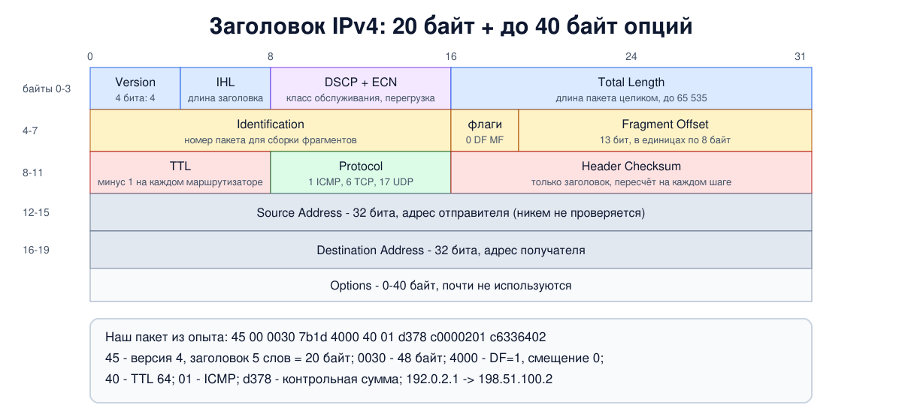

# Урок 25. IP-пакет: заголовок поле за полем

В уроке 6 мы впервые увидели IP-заголовок в шестнадцатеричном дампе и нашли в нём адреса. Сегодня разберём его целиком: что значит каждое поле, что с ним делает маршрутизатор и почему заголовок устроен именно так. В опыте поймаем один пакет до и после маршрутизатора и расшифруем его вручную, а в конце поговорим о том, что адрес отправителя в IP никто не проверяет, и о том, как с этим живут.

## Что обещает IP

Олифер в начале главы о протоколе IP подчёркивает: IP работает **без установления соединения** и доставляет пакеты **по возможности** (best effort, уроки 1 и 4). Каждый пакет обрабатывается сам по себе, независимо от соседних. Если пакет потерялся или испорчен, IP сам ничего не исправляет: этим займутся транспортный уровень (TCP, блок 4) или приложение. Олифер добавляет наблюдение: чем проще заголовок, тем проще протокол, поэтому, разобрав поля заголовка, мы познакомимся и с основными функциями IP.

Таненбаум напоминает, что пакет может достигать 64 Кбайт, но на практике обычно не больше 1500 байт, чтобы поместиться в один кадр Ethernet (урок 15). И что поля заголовка передаются, начиная со старшего байта (big-endian, "сетевой порядок байтов", урок 2).

## Поля заголовка

Заголовок IPv4 состоит из обязательной части в **20 байт** и необязательных **опций** до 40 байт.



- **Version** (4 бита) - версия протокола, для IPv4 это 4. Таненбаум замечает, что благодаря этому полю версии могут сосуществовать годами: IPv6 (урок 30) начинается с того же поля со значением 6.
- **IHL** (Internet Header Length, 4 бита) - длина заголовка в 32-битных словах. Минимум 5 (20 байт, без опций), максимум 15 (60 байт), значит, на опции остаётся не больше 40 байт.
- **DSCP и ECN** (1 байт). Раньше это поле называлось **Type of Service**: 3 бита приоритета и биты с пожеланиями "меньше задержка", "больше пропускная способность", "выше надёжность". Таненбаум пишет, что никто толком не знал, что с ними делать, и маршрутизаторы их годами игнорировали. В 1998 году старшие 6 бит отдали под **DSCP** - класс обслуживания для QoS, а в 2001-м младшие 2 бита заняло **ECN** - явное уведомление о перегрузке (блок 4). (Олифер пишет, что два младших бита зарезервированы; это устарело - с 2001 года их занимает ECN.)
- **Total Length** (2 байта) - длина всего пакета: заголовок плюс данные. Максимум 65 535 байт. Олифер добавляет, что любой хост обязан уметь принять пакет длиной до 576 байт (целиком или по фрагментам).
- **Identification** (2 байта), **флаги** (3 бита) и **Fragment Offset** (13 бит) нужны для **фрагментации** - деления пакета на части, если он не помещается в следующую сеть. У всех частей одного пакета одинаковый Identification. Флаги: первый бит зарезервирован, **DF** (Don't Fragment) запрещает делить пакет, **MF** (More Fragments) стоит у всех частей, кроме последней. Смещение показывает, где часть лежит в исходном пакете, в единицах по 8 байт. Подробно - в уроке 27. (Таненбаум вспоминает первоапрельскую шутку RFC 3514: объявить зарезервированный бит "злым битом", который обязаны ставить злоумышленники.)
- **TTL** (Time To Live, 1 байт) - "время жизни". Изначально - в секундах, но на практике каждый маршрутизатор просто уменьшает его на 1. Когда TTL доходит до нуля, пакет уничтожается, а отправителю обычно уходит сообщение ICMP (урок 28). Так пакеты не кружат вечно, если маршруты зациклились, - то, чего у кадра Ethernet не было (урок 17). На этом же поле построена утилита traceroute (урок 28).
- **Protocol** (1 байт) - кому отдать содержимое: 1 - ICMP, 6 - TCP, 17 - UDP и т. д. Список ведёт IANA. Это то самое поле-указатель на следующий уровень из уроков 5-6.
- **Header Checksum** (2 байта) - контрольная сумма **только заголовка**: сумма 16-битных слов в арифметике с переносом по кругу (дополнение до единицы), инвертированная. Данные ею не защищены: за них отвечают TCP и UDP, у которых своя контрольная сумма, и CRC канального уровня (урок 11). Раз TTL меняется на каждом маршрутизаторе, контрольную сумму приходится пересчитывать на каждом шаге - мы увидим это в опыте. Это обычная проверка от случайных ошибок, а не защита от подделки: пересчитать её может кто угодно.
- **Source Address** и **Destination Address** (по 4 байта) - адреса отправителя и получателя (урок 21). Обычный маршрутизатор их не меняет, в отличие от MAC-адресов (урок 24); меняет их NAT (уроки 56-58).
- **Options** (0-40 байт) - необязательные поля: запись пройденного маршрута, временные метки, маршрутизация от источника (отправитель сам задаёт, через какие маршрутизаторы идти) и другие. Таненбаум пишет, что опции теряют значимость: маршрутизаторы либо игнорируют их, либо обрабатывают медленно, по отдельному пути. О причине - в разделе про безопасность.

## Что маршрутизатор делает с заголовком

Для каждого пакета маршрутизатор:

1. проверяет контрольную сумму заголовка, и если она не сходится, отбрасывает пакет (Олифер);
2. уменьшает TTL на 1 и отбрасывает пакет, если получился ноль;
3. ищет по адресу получателя, куда отправить пакет (урок 26);
4. если пакет не помещается в следующую сеть, делит его на фрагменты или, при DF, отбрасывает и сообщает отправителю (урок 27);
5. пересчитывает контрольную сумму, ведь TTL изменился, и отправляет пакет в новом кадре со своим MAC-адресом.

Адрес отправителя маршрутизатор не проверяет: он лишь использует его, чтобы отправить сообщение об ошибке. Это важно для раздела про безопасность.

## Как это увидеть в Linux

Соберём цепочку из трёх пространств имён: компьютер `a` (`192.0.2.1`), маршрутизатор `r` и компьютер `b` (`198.51.100.2`) в другой сети. Отправим один пинг из `a` в `b` и поймаем его на маршрутизаторе дважды: на входе и на выходе. Затем разберём заголовок своей программой на Python и заодно пересчитаем контрольную сумму. Нужны Linux (подойдёт WSL2), права sudo, tcpdump и python3; всё создаётся в пространствах имён `hbh-*` и в конце удаляется.

Создай файл `iphdr-lab.sh` и запусти `bash iphdr-lab.sh`:

```
set -u
for c in tcpdump python3; do
  command -v $c >/dev/null || { echo "нужен $c: sudo apt install $c"; exit 1; }
done
# убрать остатки прошлого запуска
for n in hbh-a hbh-r hbh-b; do sudo ip netns del $n 2>/dev/null; done
# a (192.0.2.1) - маршрутизатор r - b (198.51.100.2)
for n in hbh-a hbh-r hbh-b; do sudo ip netns add $n; done
sudo ip link add eth0 netns hbh-a type veth peer name eth0 netns hbh-r
sudo ip link add eth1 netns hbh-r type veth peer name eth0 netns hbh-b
sudo ip netns exec hbh-a ip addr add 192.0.2.1/24 dev eth0
sudo ip netns exec hbh-r ip addr add 192.0.2.254/24 dev eth0
sudo ip netns exec hbh-r ip addr add 198.51.100.254/24 dev eth1
sudo ip netns exec hbh-b ip addr add 198.51.100.2/24 dev eth0
for n in hbh-a hbh-r hbh-b; do
  for i in $(sudo ip netns exec $n ls /sys/class/net); do sudo ip netns exec $n ip link set $i up; done
done
sudo ip netns exec hbh-a ip route add default via 192.0.2.254
sudo ip netns exec hbh-b ip route add default via 198.51.100.254
sudo ip netns exec hbh-r sysctl -qw net.ipv4.ip_forward=1
sleep 1
d=$(mktemp -d)
# слушаем по обе стороны маршрутизатора и отправляем один пинг из a в b
sudo ip netns exec hbh-r timeout 4 tcpdump -i eth0 -n -x -c 1 'icmp[icmptype] = icmp-echo' 2>/dev/null > "$d/before" &
sudo ip netns exec hbh-r timeout 4 tcpdump -i eth1 -n -x -c 1 'icmp[icmptype] = icmp-echo' 2>/dev/null > "$d/after" &
sleep 1
sudo ip netns exec hbh-a ping -c 1 -q -s 20 198.51.100.2 | grep packets
wait
echo '--- 1. the IP header before the router (hex)'
sed -n '2,3p' "$d/before"
echo '--- 2. decoded before and after the router'
python3 - "$d/before" "$d/after" <<'EOF'
import sys
def header(path):
    hexes = []
    for line in open(path).read().splitlines()[1:]:
        hexes += line.split(":", 1)[1].split()
    b = bytes.fromhex("".join(hexes))
    return b[: (b[0] & 0x0F) * 4]
def checksum(h):
    h = h[:10] + b"\0\0" + h[12:]
    s = sum(int.from_bytes(h[i:i + 2], "big") for i in range(0, len(h), 2))
    while s >> 16:
        s = (s & 0xFFFF) + (s >> 16)
    return ~s & 0xFFFF
for name in sys.argv[1:]:
    h = header(name)
    flags = h[6] >> 5
    print(f"{name.split('/')[-1]:>6}: version {h[0] >> 4}, IHL {h[0] & 15} ({(h[0] & 15) * 4} bytes), "
          f"DSCP/ECN 0x{h[1]:02x}, total length {int.from_bytes(h[2:4], 'big')}, "
          f"ID 0x{h[4:6].hex()}, DF {flags >> 1 & 1}, MF {flags & 1}, offset {int.from_bytes(h[6:8], 'big') & 0x1FFF}")
    print(f"        TTL {h[8]}, protocol {h[9]}, checksum 0x{h[10:12].hex()} (computed 0x{checksum(h):04x}), "
          f"{'.'.join(map(str, h[12:16]))} -> {'.'.join(map(str, h[16:20]))}")
EOF
echo '--- 3. reverse path filter on this system'
sysctl net.ipv4.conf.all.rp_filter net.ipv4.conf.default.rp_filter
echo '--- cleanup'
for n in hbh-a hbh-r hbh-b; do sudo ip netns del $n; done
rm -rf "$d"
ip netns list | grep -c '^hbh-'
```

Вот что получилось на нашем сервере:

```
1 packets transmitted, 1 received, 0% packet loss, time 0ms
--- 1. the IP header before the router (hex)
	0x0000:  4500 0030 7b1d 4000 4001 d378 c000 0201
	0x0010:  c633 6402 0800 e719 2aa8 0001 7fdd bb6a
--- 2. decoded before and after the router
before: version 4, IHL 5 (20 bytes), DSCP/ECN 0x00, total length 48, ID 0x7b1d, DF 1, MF 0, offset 0
        TTL 64, protocol 1, checksum 0xd378 (computed 0xd378), 192.0.2.1 -> 198.51.100.2
 after: version 4, IHL 5 (20 bytes), DSCP/ECN 0x00, total length 48, ID 0x7b1d, DF 1, MF 0, offset 0
        TTL 63, protocol 1, checksum 0xd478 (computed 0xd478), 192.0.2.1 -> 198.51.100.2
--- 3. reverse path filter on this system
net.ipv4.conf.all.rp_filter = 2
net.ipv4.conf.default.rp_filter = 2
--- cleanup
0
```

Разберём по шагам.

- **Шаг 1: дамп.** Первые 20 байт - заголовок IP (tcpdump с `-x` показывает пакет без заголовка Ethernet). Читаем по байтам: `45` - версия 4 и IHL 5, то есть 20 байт; `00` - DSCP и ECN нулевые; `0030` - общая длина 48 байт (20 байт заголовка, 8 байт заголовка ICMP и 20 байт данных, мы задали `-s 20`); `7b1d` - Identification; `4000` - флаги и смещение: `0100 0000 0000 0000`, стоит только бит DF; `40` - TTL 64; `01` - протокол ICMP; `d378` - контрольная сумма; `c0000201` - `192.0.2.1`; `c6336402` - `198.51.100.2`. Дальше, с `08 00`, начинается уже ICMP (урок 28). Значения Identification и контрольной суммы у тебя будут другими: Identification меняется от пакета к пакету, а вместе с ним и сумма.
- **Шаг 2: до и после маршрутизатора.** Программа разобрала оба захвата. Почти все поля одинаковы: версия, длина, Identification, флаги, адреса. Изменились только **TTL** (64 → 63) и **контрольная сумма** (`0xd378` → `0xd478`): маршрутизатор уменьшил TTL и пересчитал сумму. Наша программа посчитала сумму сама, и она совпала с той, что в пакете, - значит, алгоритм мы поняли правильно. Заметь, что сумма выросла ровно на `0x0100`: TTL стоит в старшем байте 16-битного слова вместе с полем Protocol, и когда он уменьшился на 1, инвертированная сумма увеличилась на `0x0100`. Маршрутизаторы этим пользуются: сумму не считают заново, а поправляют (RFC 1624).
- **Бит DF.** Linux по умолчанию ставит DF в своих пакетах: он сам определяет, какой размер пакета проходит по пути, и не полагается на фрагментацию (урок 27).
- **Шаг 3: rp_filter.** Это настройка проверки обратного пути, о ней - в следующем разделе. У нас 2: так настраивает Ubuntu через файлы в `/usr/lib/sysctl.d` и `/etc/sysctl.d`, у самого ядра по умолчанию 0 - проверки нет. У тебя значение может отличаться.
- В конце `0`: учебные пространства имён удалены.

## Атаки и защита: подмена адреса отправителя

Вернёмся к списку действий маршрутизатора: он смотрит на адрес **получателя**, а адрес **отправителя** просто переносит дальше. В IP нет никакой проверки, что пакет действительно отправлен с того адреса, который в нём указан. Отправитель может записать туда что угодно. Это называют **подменой IP-адреса** (IP spoofing). Разберём принцип и защиту, не инструменты.

Главное ограничение подмены: ответы уходят на подставленный адрес, а не подменившему, если он не стоит на пути этих ответов. Поэтому с поддельного адреса нельзя нормально "поговорить" - например, установить TCP-соединение: для этого нужно получить ответ (рукопожатие TCP, блок 4). Подмена годится для одностороннего воздействия:

- **затопление** с поддельных адресов: жертве сложно понять, откуда идёт поток, и заблокировать его по адресу отправителя;
- **отражение и усиление**: запросы с адресом жертвы в поле отправителя отправляют множеству чужих серверов, и те шлют ответы жертве. Если ответ больше запроса, поток усиливается. Олифер разбирает старые варианты таких атак, в которых отражателем служили широковещательные адреса сетей (урок 21) и служебные сервисы; настройки защиты от них - в уроке 28 (ICMP), к самим атакам вернёмся в уроке 35 (UDP) и в блоке 7 (DNS);
- **обход фильтров**, которые доверяют "своим" адресам: поэтому доверие по одному только IP-адресу - плохая идея.

Отдельно Олифер описывает атаку на сами маршрутизаторы через **опции**: обычные пакеты маршрутизатор продвигает быстро на специализированных микросхемах, а пакеты с опциями уходят на центральный процессор. Поток таких пакетов может перегрузить маршрутизатор. Поэтому пакеты с опциями сегодня часто просто отбрасывают на границе сети.

Как защищаются:

- **Фильтрация на входе у провайдера** (ingress filtering, BCP 38, RFC 2827, 2000). Провайдер знает, какие адреса у его клиентов, и не выпускает в интернет пакеты с чужими адресами отправителя. Если бы все провайдеры это делали, клиенты могли бы подделать только адреса из своей же сети. Увы, делают не все, поэтому подмена до сих пор работает.
- **Проверка обратного пути** (uRPF, в Linux - `rp_filter`). Маршрутизатор или компьютер проверяет: а пошёл бы ответ на адрес отправителя через тот же интерфейс, откуда пакет пришёл? Строгий режим (`rp_filter = 1`) требует именно этого, свободный (`2`) - лишь чтобы адрес отправителя вообще был достижим хоть через какой-то интерфейс. Строгий режим надёжнее, но ломает сети, где пути туда и обратно разные.
- **Отбрасывание невозможных адресов** (bogons, урок 23): частные и особые адреса отправителя на границе с интернетом.
- **Не доверять адресу отправителя.** Проверка подлинности должна быть криптографической: TLS (блок 9), SSH, IPsec, VPN (блок 10). А TCP с его рукопожатием уже сам по себе мешает подделать соединение, пока номера последовательности непредсказуемы (блок 4).
- **Защита служб от роли отражателя**: не держать открытыми для всего интернета сервисы, которые отвечают большим ответом на маленький запрос, и ограничивать частоту ответов.

## Итог

- IP доставляет пакеты без соединения и по возможности: каждый пакет независим, ошибки исправляют верхние уровни.
- Заголовок IPv4 - 20 байт плюс до 40 байт опций: версия, длина заголовка, DSCP и ECN, общая длина, поля фрагментации (Identification, DF, MF, смещение), TTL, протокол, контрольная сумма заголовка, адреса отправителя и получателя.
- Маршрутизатор проверяет сумму, уменьшает TTL, выбирает путь по адресу получателя и пересчитывает сумму. Мы видели: TTL 64 → 63, сумма изменилась на 0x0100.
- Контрольная сумма защищает только заголовок и только от случайных ошибок.
- Сам протокол IP адрес отправителя не проверяет, поэтому возможна подмена: затопление, отражение и усиление, обход наивных фильтров. Защита: фильтрация у провайдеров (BCP 38), проверка обратного пути (rp_filter), отбрасывание невозможных адресов, криптографическая аутентификация вместо доверия по IP.

## Что почитать

- Олифер, "Компьютерные сети", глава 14, с. 432-435: IP-пакет, поля заголовка, пример реального заголовка; глава 29, с. 909-910: атаки на IP-опции и фрагментацию. Учти, что про два младших бита байта ToS сведения устарели.
- Таненбаум, "Компьютерные сети", раздел 5.7, с. 500-505: протокол IPv4, формат заголовка, опции.
