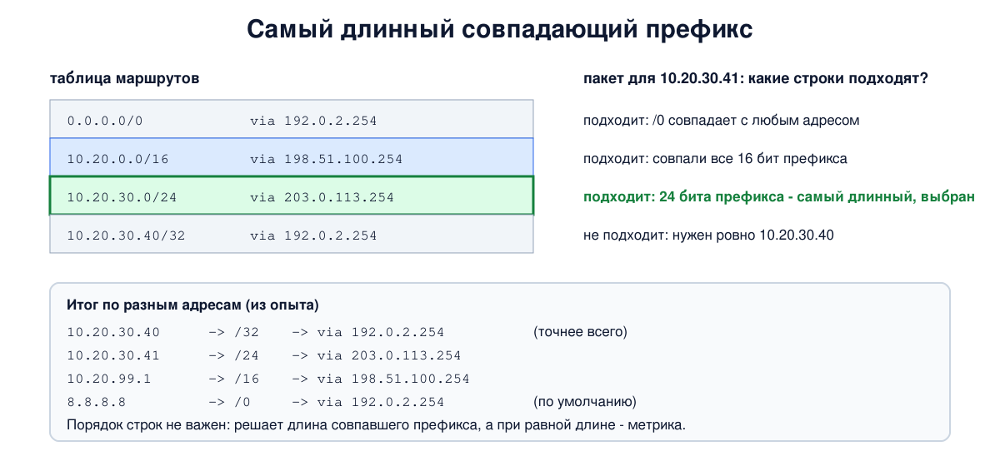

# Урок 26. Маршрутизация: таблица маршрутов, самый длинный префикс и шлюз по умолчанию

Мы знаем, как устроен IP-адрес (уроки 21-23), как IP-адрес превращается в MAC-адрес (урок 24) и что маршрутизатор делает с заголовком пакета (урок 25). Остался главный вопрос: **куда** отправить пакет? Ответ даёт таблица маршрутов. Сегодня разберём, из чего она состоит, откуда берутся её записи, как по ней выбирается путь (правило самого длинного совпадающего префикса) и что такое шлюз по умолчанию. В опыте соберём учебный маршрутизатор и спросим у ядра Linux, куда оно отправило бы пакеты на разные адреса.

## Маршрутизируют все

Олифер подчёркивает: выбирают маршрут не только маршрутизаторы, но и **конечные узлы**. Прежде чем отправить пакет, твой компьютер решает:

- получатель **в моей сети**? Тогда пакет доставляется напрямую: ARP спрашивает MAC-адрес самого получателя (урок 24);
- получатель **в другой сети**? Тогда пакет отдаётся **следующему маршрутизатору** (next hop, "следующий переход"): ARP спрашивает MAC-адрес маршрутизатора, а IP-адрес получателя в пакете остаётся прежним.

Маршрутизатор, получив пакет, решает ту же задачу: либо сеть получателя подключена к нему напрямую, и он доставляет пакет сам, либо он передаёт пакет следующему маршрутизатору. И так шаг за шагом, отсюда и название курса: hop by hop. В таблице маршрутов каждый маршрутизатор хранит только **следующий шаг**, а не весь путь.

## Из чего состоит таблица маршрутов

Олифер показывает, что таблицы у разных систем выглядят по-разному, но три ключевых поля есть в каждой: сеть назначения, следующий маршрутизатор и выходной интерфейс. Кроме них почти всегда есть маска (сегодня это стандарт) и часто метрика. Вместе это выглядит так:

- **сеть назначения** - адрес сети и маска (длина префикса, урок 22);
- **следующий маршрутизатор** (шлюз, gateway) - куда отдать пакет. Для сетей, подключённых напрямую, его нет: пакет доставляется сам;
- **выходной интерфейс** - через какой порт отправить. Иногда его не пишут, потому что он следует из адреса шлюза: непосредственный следующий шаг должен быть доступен напрямую, в одной из подключённых сетей;
- **метрика** - "стоимость" маршрута, чтобы выбирать между несколькими путями к одной и той же сети. Олифер замечает, что в простых таблицах её может и не быть.

Олифер описывает и флаги в старых таблицах Unix, которые показывают команды `route -n` и `netstat -rn` (они из пакета net-tools, в Ubuntu он по умолчанию не установлен): **U** - маршрут работает, **G** - через шлюз, **H** - маршрут к одному узлу, **D** - получен из сообщения ICMP Redirect (урок 28; современный Linux хранит такие поправки отдельно, их видно через `ip route get`).

## Откуда берутся записи

Олифер называет три источника:

1. **Подключённые сети.** Как только интерфейсу назначен адрес с префиксом, система сама добавляет маршрут к его сети. Мы видели это в уроке 22: адрес `192.0.2.77/26` дал маршрут `192.0.2.64/26`.
2. **Статические маршруты** вносит администратор вручную или из файлов настройки. На серверах так часто задают и маршрут по умолчанию, а обычные компьютеры получают шлюз автоматически по DHCP (урок 29; в Linux такой маршрут помечен `proto dhcp`).
3. **Динамические маршруты** маршрутизаторы узнают друг от друга по протоколам маршрутизации: RIP, OSPF (урок 32) и BGP (урок 33). Такие маршруты сами меняются при отказах.

## Маршрут по умолчанию

Хранить путь к каждой сети интернета - это около миллиона записей (урок 21). Большинству устройств это не нужно. Олифер объясняет приём, который решает проблему: **маршрут по умолчанию** (default route). Для всех сетей, о которых нет отдельной записи, пакет отдают одному маршрутизатору - **шлюзу по умолчанию**. В таблице он записывается как сеть `0.0.0.0/0`: префикс нулевой длины совпадает с любым адресом.

У домашнего компьютера таблица обычно крошечная: своя сеть и маршрут по умолчанию на домашний роутер. У роутера - сеть квартиры и маршрут по умолчанию к провайдеру. И только крупные маршрутизаторы в ядре интернета работают без маршрута по умолчанию: Таненбаум называет это "зоной, свободной от умолчаний" (default-free zone). Они обязаны знать путь к каждому префиксу.

Если маршрута по умолчанию нет и ни одна запись не подошла, пакет отбрасывается, а отправителю обычно сообщается, что сеть недоступна. Олифер отмечает, что такая таблица допустима: стандарты не требуют ни маршрута для любого адреса, ни даже маршрута по умолчанию.

## Как выбирается маршрут: самый длинный префикс

Для адреса получателя может подойти несколько записей: маршрут по умолчанию подходит всегда, а ещё может подойти и крупный агрегат, и его подсеть. Правило выбора, о котором мы говорили в уроке 22, - **самый длинный совпадающий префикс** (longest prefix match): побеждает запись, у которой совпало больше всего бит, то есть самая точная.



Олифер описывает это по-своему, в несколько фаз: сначала ищется маршрут к конкретному узлу (`/32`), потом к сети, потом используется маршрут по умолчанию, а если совпадений несколько - выбирается запись, в которой совпало больше всего двоичных разрядов. Это то же самое правило: `/32` длиннее любой сети, а `/0` короче всех. И Олифер подчёркивает важное следствие: **порядок строк в таблице не влияет** на результат. Таненбаум добавляет, что просмотр таблицы строка за строкой был бы слишком медленным, поэтому маршрутизаторы используют специальные структуры данных и микросхемы.

Зачем нужны записи разной длины:

- **агрегат плюс исключение**: вся сеть `10.20.0.0/16` идёт через одного соседа, а её часть `10.20.30.0/24` - через другого (как в примере Таненбаума из урока 22: свободный блок внутри лондонского агрегата отдали Сан-Франциско, с. 511-512);
- **маршрут к одному узлу** (`/32`): Олифер приводит пример, когда администратор из соображений безопасности отправляет пакеты для одного узла другим путём;
- **запрещённые сети**: маршрут типа `unreachable` или `blackhole` для сети, куда пакеты отправлять нельзя. Первый отвечает отправителю "нет маршрута", второй молча выбрасывает, а третий тип, `prohibit`, отвечает "запрещено администратором". Их используют, например, чтобы частные адреса случайно не ушли к провайдеру.

Если у двух записей **одинаковая** длина префикса, выбирает **метрика**: меньшая лучше. Так задают основной и резервный путь. (На маршрутизаторах, когда записи пришли из разных источников - подключённая сеть, статический маршрут, разные протоколы, - сначала сравнивают доверие к источнику, а метрики разных протоколов между собой несравнимы; урок 32.)

## Как это увидеть в Linux

Сделаем учебный маршрутизатор: пространство имён `hbh-rt` с тремя интерфейсами в сетях `192.0.2.0/24`, `198.51.100.0/24` и `203.0.113.0/24` и несколько маршрутов разной длины. Настоящие соседи-маршрутизаторы нам не нужны: команда `ip route get` не отправляет пакет, а только показывает, какой маршрут ядро **выбрало бы**. Нужны Linux (подойдёт WSL2) и права sudo; всё создаётся в пространстве имён `hbh-rt` и в конце удаляется.

Создай файл `route-lab.sh` и запусти `bash route-lab.sh`:

```
set -u
# убрать остатки прошлого запуска
sudo ip netns del hbh-rt 2>/dev/null
# учебный маршрутизатор с тремя интерфейсами (dummy) и таблицей маршрутов
sudo ip netns add hbh-rt
for i in 0 1 2; do sudo ip netns exec hbh-rt ip link add eth$i type dummy; done
sudo ip netns exec hbh-rt ip addr add 192.0.2.1/24 dev eth0
sudo ip netns exec hbh-rt ip addr add 198.51.100.1/24 dev eth1
sudo ip netns exec hbh-rt ip addr add 203.0.113.1/24 dev eth2
for i in lo eth0 eth1 eth2; do sudo ip netns exec hbh-rt ip link set $i up; done
# маршруты: по умолчанию, агрегат /16, более точный /24 внутри него, узел /32, запрещённая сеть
sudo ip netns exec hbh-rt ip route add default via 192.0.2.254
sudo ip netns exec hbh-rt ip route add 10.20.0.0/16 via 198.51.100.254
sudo ip netns exec hbh-rt ip route add 10.20.30.0/24 via 203.0.113.254
sudo ip netns exec hbh-rt ip route add 10.20.30.40/32 via 192.0.2.254
sudo ip netns exec hbh-rt ip route add unreachable 10.99.0.0/16
echo '--- 1. the routing table'
sudo ip netns exec hbh-rt ip route show
echo '--- 2. which route wins: longest matching prefix'
for dst in 10.20.30.40 10.20.30.41 10.20.99.1 8.8.8.8 198.51.100.77 10.99.1.1; do
  printf '%-14s -> ' $dst
  sudo ip netns exec hbh-rt ip route get $dst 2>&1 | head -1 | sed -E 's/ uid [0-9]+//; s/ +$//'
done
echo '--- 3. two routes to the same prefix: the lower metric wins'
sudo ip netns exec hbh-rt ip route add 172.16.0.0/12 via 198.51.100.254 metric 100
sudo ip netns exec hbh-rt ip route add 172.16.0.0/12 via 203.0.113.254 metric 50
sudo ip netns exec hbh-rt ip route show 172.16.0.0/12
sudo ip netns exec hbh-rt ip route get 172.20.1.1 | head -1 | sed -E 's/ uid [0-9]+//; s/ +$//'
echo '--- 4. without a default route'
sudo ip netns exec hbh-rt ip route del default
sudo ip netns exec hbh-rt ip route get 8.8.8.8 2>&1 | head -1
echo '--- 5. a gateway must be reachable directly'
sudo ip netns exec hbh-rt ip route add 10.50.0.0/16 via 10.20.30.1 2>&1 | head -1
echo '--- cleanup'
sudo ip netns del hbh-rt
ip netns list | grep -c '^hbh-rt'
```

Вот что получилось на нашем сервере:

```
--- 1. the routing table
default via 192.0.2.254 dev eth0 
10.20.0.0/16 via 198.51.100.254 dev eth1 
10.20.30.0/24 via 203.0.113.254 dev eth2 
10.20.30.40 via 192.0.2.254 dev eth0 
unreachable 10.99.0.0/16 
192.0.2.0/24 dev eth0 proto kernel scope link src 192.0.2.1 
198.51.100.0/24 dev eth1 proto kernel scope link src 198.51.100.1 
203.0.113.0/24 dev eth2 proto kernel scope link src 203.0.113.1 
--- 2. which route wins: longest matching prefix
10.20.30.40    -> 10.20.30.40 via 192.0.2.254 dev eth0 src 192.0.2.1
10.20.30.41    -> 10.20.30.41 via 203.0.113.254 dev eth2 src 203.0.113.1
10.20.99.1     -> 10.20.99.1 via 198.51.100.254 dev eth1 src 198.51.100.1
8.8.8.8        -> 8.8.8.8 via 192.0.2.254 dev eth0 src 192.0.2.1
198.51.100.77  -> 198.51.100.77 dev eth1 src 198.51.100.1
10.99.1.1      -> RTNETLINK answers: No route to host
--- 3. two routes to the same prefix: the lower metric wins
172.16.0.0/12 via 203.0.113.254 dev eth2 metric 50 
172.16.0.0/12 via 198.51.100.254 dev eth1 metric 100 
172.20.1.1 via 203.0.113.254 dev eth2 src 203.0.113.1
--- 4. without a default route
RTNETLINK answers: Network is unreachable
--- 5. a gateway must be reachable directly
Error: Nexthop has invalid gateway.
--- cleanup
0
```

Разберём по шагам.

- **Шаг 1: таблица.** Сверху записи, которые мы добавили: `default via 192.0.2.254` - маршрут по умолчанию; `/16` и `/24` через разных соседей; `10.20.30.40` без префикса - это `/32`, маршрут к одному узлу (`ip` не пишет `/32`); `unreachable 10.99.0.0/16` - запрещённая сеть. Внизу три строки `proto kernel scope link` - подключённые сети, их ядро добавило само, когда мы назначили адреса. У них нет `via`: получатели в этих сетях доступны напрямую.
- **Шаг 2: кто побеждает.** `10.20.30.40` подходит под `/0`, `/16`, `/24` и `/32`, выиграл самый длинный `/32` - через `192.0.2.254`. `10.20.30.41` в `/32` не попадает, лучший - `/24` через `203.0.113.254`. `10.20.99.1` вне `/24`, остаётся `/16` через `198.51.100.254`. `8.8.8.8` не подходит ни под что, кроме `/0`, - уходит на шлюз по умолчанию. `198.51.100.77` в подключённой сети: `via` нет, доставка напрямую. `10.99.1.1` попал в запрещённую сеть: `No route to host`. `src` - адрес, который ядро поставит отправителем, если пакет создаёт сам этот узел (обычно основной адрес выходного интерфейса). У чужих транзитных пакетов адрес отправителя не меняется (урок 25).
- **Шаг 3: метрика.** Два маршрута к `172.16.0.0/12` с одинаковой длиной префикса. Выбран тот, у которого метрика меньше (`50`), второй (`100`) - запасной: если первый исчезнет, пакеты пойдут по нему. Но сам Linux не проверяет, отвечает ли шлюз: резерв включится, только когда основной маршрут удалят (вручную, демоном маршрутизации или при выключении интерфейса).
- **Шаг 4: без маршрута по умолчанию.** Удалили `default`, и для `8.8.8.8` нет ни одной подходящей записи: `Network is unreachable`. Именно это ты увидишь, если у компьютера не настроен шлюз.
- **Шаг 5: шлюз должен быть рядом.** Попытка указать шлюзом `10.20.30.1`, который не лежит ни в одной подключённой сети, отвергнута: `Nexthop has invalid gateway`. Олифер объясняет почему: шлюзу нужно передать кадр напрямую, через ARP, значит, он должен быть в одной из сетей этого маршрутизатора. (Маршрутизаторы умеют находить непосредственный шаг и через другую запись таблицы, рекурсивно, - это встретится в BGP, урок 33.)
- В конце `0`: пространство имён удалено.

Посмотреть таблицу своего компьютера можно командой `ip route` (в Windows - `route print`), а `ip route get <адрес>` покажет, через какой шлюз и интерфейс уйдёт пакет к нужному адресу. Это первое, что стоит проверить, когда "не работает интернет".

В Linux на самом деле несколько таблиц маршрутов и правила выбора между ними: мы уже видели таблицу `local` в уроке 21, а управлять ими будем в уроке 48 (policy routing).

## Почему это важно для безопасности

Хотя отдельной темы атак у урока нет, маршрутизация - частая цель. Кто управляет таблицей маршрутов, тот решает, куда пойдёт трафик. Поэтому:

- **Маршрут к одному узлу побеждает все общие маршруты в той же таблице.** Если кто-то сумел добавить на компьютер или маршрутизатор более точный маршрут, трафик для этого адреса уйдёт туда, куда указал он, несмотря на все общие правила. Так же работает и законная защита: VPN-клиент ставит свои маршруты, чтобы трафик шёл в туннель (блок 10), например две записи `0.0.0.0/1` и `128.0.0.0/1`, которые длиннее маршрута по умолчанию и перекрывают его, не удаляя. По той же причине опасны поддельные маршруты, которые компьютер может получить от чужого DHCP-сервера (урок 29) или из поддельных объявлений IPv6-маршрутизатора (урок 31). Поэтому стоит проверять `ip route` на своих серверах и следить за неожиданными записями.
- **Ложные маршруты от соседей.** Динамические маршруты приходят от других маршрутизаторов, и если им безоглядно верить, чужой маршрутизатор может перехватить трафик. Это тема уроков 32 и 33 (подмена маршрутов в OSPF и BGP) и урока 28 (ICMP Redirect, который может менять маршруты компьютера).
- **Запрещённые маршруты как защита.** `unreachable` и `blackhole` для частных и особых сетей не дают пакетам с такими адресами назначения уйти к провайдеру, а маршруты в "чёрную дыру" провайдеры используют и для защиты от DDoS: трафик на атакуемый адрес отбрасывают, не пуская дальше. Цена - этот адрес становится недоступен для всех, зато остальная сеть остаётся работоспособной.

## Итог

- Маршрутизируют все: компьютер решает, доставить пакет напрямую или отдать шлюзу, маршрутизатор - отдать сам или передать следующему. В таблице каждый хранит только следующий шаг.
- Запись в таблице: сеть назначения с маской, следующий маршрутизатор, интерфейс, метрика. Непосредственный следующий шаг должен быть доступен напрямую.
- Записи бывают подключённые (из адресов интерфейсов), статические (от администратора; на обычных компьютерах шлюз приходит по DHCP) и динамические (от протоколов маршрутизации).
- Маршрут по умолчанию `0.0.0.0/0` подходит к любому адресу; без него пакет в неизвестную сеть отбрасывается.
- Выбор - по самому длинному совпадающему префиксу, при равной длине - по метрике. Порядок строк не важен.
- `ip route` показывает таблицу, `ip route get` - выбранный маршрут.

## Что почитать

- Олифер, "Компьютерные сети", глава 14, с. 435-458: схема IP-маршрутизации, таблицы маршрутизации маршрутизаторов и конечных узлов, маршрут по умолчанию, форматы таблиц, источники записей, просмотр таблиц без масок и с масками.
- Таненбаум, "Компьютерные сети", раздел 5.7.2, с. 509-512: зона, свободная от умолчаний, и маршрутизация по самому длинному совпадающему префиксу.
