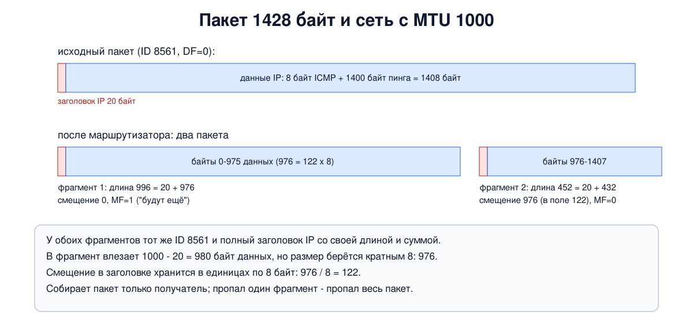

# Урок 27. Фрагментация, MTU и Path MTU Discovery

В уроке 25 мы видели в заголовке IP поля Identification, флаги DF и MF и смещение фрагмента, но отложили разговор о них. Сегодня разберём, зачем они нужны. Разные сети пропускают пакеты разного наибольшего размера, и пакет, спокойно прошедший по одной сети, может не поместиться в следующую. Что тогда делать: резать пакет по дороге или заранее узнать, какой размер проходит? В опыте устроим узкое место на пути и посмотрим на оба способа.

## MTU

**MTU** (Maximum Transmission Unit) - наибольший размер IP-пакета, который помещается в кадр данной сети. Для Ethernet это 1500 байт (урок 15), у 802.11 Таненбаум называет 2272 байта, а у туннелей и VPN MTU обычно меньше, потому что часть места занимают их собственные заголовки (блок 10). Таненбаум перечисляет, откуда берутся ограничения: оборудование, буферы операционной системы, поля длины в протоколах, стандарты, желание уменьшить число повторных передач при ошибках и не занимать канал одним пакетом слишком долго.

Сам IP позволяет пакет до 65 535 байт (урок 25), но важнее другое: пакет должен пройти по каждой сети на пути. Значит, решает **MTU пути** (Path MTU) - самый маленький MTU среди всех участков. Отправитель его обычно не знает, а путь в интернете может меняться.

## Фрагментация в IP

Первое решение - **фрагментация**: маршрутизатор, которому пакет не помещается в следующую сеть, делит его на части, **фрагменты**, и каждую отправляет как отдельный IP-пакет с полным заголовком. Таненбаум описывает два подхода: **прозрачный**, когда фрагменты собирает обратно маршрутизатор на выходе из "узкой" сети, и **непрозрачный**, когда фрагменты идут до самого получателя. IP использует второй. Олифер объясняет почему: фрагменты могут пойти разными путями, и нет гарантии, что все они пройдут через один маршрутизатор. Поэтому маршрутизаторы фрагменты не собирают, а если на пути встретится ещё более узкая сеть, фрагмент поделят ещё раз. В IPv6 маршрутизаторы пакеты вообще не делят, это может сделать только отправитель (урок 30).

Для сборки служат поля заголовка:

- **Identification** одинаков у всех фрагментов одного пакета. Получатель складывает в один буфер фрагменты с одинаковыми адресами отправителя и получателя, протоколом и Identification;
- **смещение фрагмента** показывает, где кусок лежит в исходных данных. Оно хранится в единицах по 8 байт, поэтому данные каждого фрагмента, кроме последнего, кратны 8 байтам. (Олифер пишет, что смещение "задаётся в байтах", а Таненбаум - про "абсолютное байтовое смещение"; точнее - в восьмибайтовых единицах, а tcpdump для удобства показывает его уже в байтах);
- **MF** (More Fragments) стоит у всех фрагментов, кроме последнего;
- **DF** (Don't Fragment) запрещает делить пакет. Если пакет с DF не помещается, маршрутизатор его уничтожает и сообщает отправителю по ICMP (урок 28). (В примере фрагментации у Олифера сказано, что DF устанавливается в 1, "это означает, что данный пакет можно фрагментировать", - это опечатка: по смыслу примера должно быть DF=0, ведь пакет дальше делят; DF=1 как раз запрещает фрагментацию.)

Получив первый пришедший фрагмент пакета, получатель запускает таймер (Олифер называет 60-120 секунд по рекомендации RFC, в Linux - 30 секунд, параметр `ipfrag_time`). Если какого-то фрагмента нет к его истечению, все собранные части выбрасываются, а отправителю может уйти сообщение ICMP "время сборки истекло" (урок 28). Повторно ничего не отправляется: это снова доставка "по возможности".

## Почему фрагментации стараются избегать

Таненбаум ссылается на работу Кента и Могула (1987): фрагментация вредна. Потеря **одного** фрагмента означает потерю **всего** пакета, заголовки повторяются в каждом фрагменте, а сборка нагружает получателя больше, чем ожидали создатели IP. Олифер добавляет, что отправитель обычно и сам не пользуется фрагментацией: TCP заранее нарезает поток на сегменты, которые помещаются в кадр, например по 1460 байт данных для Ethernet (1500 минус 20 байт IP и 20 байт TCP).

## Path MTU Discovery

Поэтому современный интернет пользуется **поиском MTU пути** (Path MTU Discovery, Могул и Диринг, 1990). Отправитель ставит в своих пакетах флаг DF. Если по дороге встретится узкое место, маршрутизатор пакет не делит, а уничтожает и отправляет ICMP-сообщение "нужна фрагментация, но стоит DF", указав MTU следующего участка. Отправитель запоминает этот MTU для данного получателя и дальше отправляет пакеты поменьше. Если на пути дальше окажется ещё более узкое место, всё повторится. Таненбаум замечает, что за это приходится платить задержкой: пока размер не подобран, отправителю приходится повторять отправку.

У этого механизма есть известная слабость. Он работает, только если ICMP-сообщения доходят до отправителя. Если где-то на пути межсетевой экран выбрасывает весь ICMP "на всякий случай", отправитель так и не узнаёт, что его пакеты слишком велики. Маленькие пакеты проходят, большие молча пропадают: соединение устанавливается, а потом "зависает" на передаче данных. Такое место называют **чёрной дырой PMTU**. Лечится это двумя способами: не блокировать нужные ICMP-сообщения (урок 28) и уменьшать размер сегментов TCP прямо на маршрутизаторе (MSS clamping), что обычно делают на VPN-шлюзах и домашних роутерах с PPPoE. Это помогает только TCP: протоколы поверх UDP должны сами выбирать размер пакетов.

## Как это увидеть в Linux

Соберём цепочку `a` - маршрутизатор `r` - `b`, в которой участок от `r` до `b` узкий: MTU 1000 вместо обычных 1500. Отправим большой пинг сначала без DF, потом с DF. Нужны Linux (подойдёт WSL2), права sudo и tcpdump; всё создаётся в пространствах имён `hbh-*` и в конце удаляется.

Создай файл `mtu-lab.sh` и запусти `bash mtu-lab.sh`:

```
set -u
command -v tcpdump >/dev/null || { echo "нужен tcpdump: sudo apt install tcpdump"; exit 1; }
# убрать остатки прошлого запуска
for n in hbh-a hbh-r hbh-b; do sudo ip netns del $n 2>/dev/null; done
# a (192.0.2.1) - r - b (198.51.100.2); участок r - b узкий: MTU 1000
for n in hbh-a hbh-r hbh-b; do sudo ip netns add $n; done
sudo ip link add eth0 netns hbh-a type veth peer name eth0 netns hbh-r
sudo ip link add eth1 netns hbh-r type veth peer name eth0 netns hbh-b
sudo ip netns exec hbh-r ip link set eth1 mtu 1000
sudo ip netns exec hbh-b ip link set eth0 mtu 1000
sudo ip netns exec hbh-a ip addr add 192.0.2.1/24 dev eth0
sudo ip netns exec hbh-r ip addr add 192.0.2.254/24 dev eth0
sudo ip netns exec hbh-r ip addr add 198.51.100.254/24 dev eth1
sudo ip netns exec hbh-b ip addr add 198.51.100.2/24 dev eth0
for n in hbh-a hbh-r hbh-b; do
  for i in $(sudo ip netns exec $n ls /sys/class/net); do sudo ip netns exec $n ip link set $i up; done
done
sudo ip netns exec hbh-a ip route add default via 192.0.2.254
sudo ip netns exec hbh-b ip route add default via 198.51.100.254
sudo ip netns exec hbh-r sysctl -qw net.ipv4.ip_forward=1
sleep 1
echo '--- 1. MTU of the links'
for x in hbh-a:eth0 hbh-r:eth0 hbh-r:eth1 hbh-b:eth0; do
  echo "${x%:*} ${x#*:}: $(sudo ip netns exec ${x%:*} ip link show ${x#*:} | grep -o 'mtu [0-9]*')"
done
echo '--- 2. a 1400-byte ping, fragmentation allowed (DF not set)'
f=$(mktemp)
sudo ip netns exec hbh-b timeout 4 tcpdump -i eth0 -n -v -l icmp 2>/dev/null > "$f" &
sleep 1
sudo ip netns exec hbh-a ping -c 1 -q -M dont -s 1400 198.51.100.2 | grep packets
wait
grep -oE 'id [0-9]+, offset [0-9]+, flags \[[^]]*\].*length [0-9]+\)' "$f" | head -4
rm -f "$f"
echo '--- 3. the same with DF set: the router refuses'
sudo ip netns exec hbh-a ip route flush cache
sudo ip netns exec hbh-a ping -c 2 -M do -s 1400 198.51.100.2 2>&1 | grep -E 'Frag needed|too long|packets'
echo '--- 4. the sender remembered the path MTU'
sudo ip netns exec hbh-a ip route get 198.51.100.2 | head -2 | sed -E 's/ uid [0-9]+//; s/ +$//'
echo '--- 5. a ping that fits into 1000 bytes goes through with DF'
sudo ip netns exec hbh-a ping -c 1 -q -M do -s 972 198.51.100.2 | grep packets
echo '--- cleanup'
for n in hbh-a hbh-r hbh-b; do sudo ip netns del $n; done
ip netns list | grep -c '^hbh-'
```

Вот что получилось на нашем сервере:

```
--- 1. MTU of the links
hbh-a eth0: mtu 1500
hbh-r eth0: mtu 1500
hbh-r eth1: mtu 1000
hbh-b eth0: mtu 1000
--- 2. a 1400-byte ping, fragmentation allowed (DF not set)
1 packets transmitted, 1 received, 0% packet loss, time 0ms
id 8561, offset 0, flags [+], proto ICMP (1), length 996)
id 8561, offset 976, flags [none], proto ICMP (1), length 452)
id 34192, offset 0, flags [+], proto ICMP (1), length 996)
id 34192, offset 976, flags [none], proto ICMP (1), length 452)
--- 3. the same with DF set: the router refuses
From 192.0.2.254 icmp_seq=1 Frag needed and DF set (mtu = 1000)
ping: local error: message too long, mtu=1000
2 packets transmitted, 0 received, +2 errors, 100% packet loss, time 1063ms
--- 4. the sender remembered the path MTU
198.51.100.2 via 192.0.2.254 dev eth0 src 192.0.2.1
    cache expires 597sec mtu 1000
--- 5. a ping that fits into 1000 bytes goes through with DF
1 packets transmitted, 1 received, 0% packet loss, time 0ms
--- cleanup
0
```

Разберём по шагам.

- **Шаг 1: MTU.** У `a` и входа маршрутизатора 1500, а у участка `r` - `b` 1000.
- **Шаг 2: фрагментация.** `-s 1400` - 1400 байт данных пинга, плюс 8 байт заголовка ICMP и 20 байт IP: пакет в 1428 байт. `-M dont` не ставит DF (по умолчанию ping в Linux его ставит, урок 25), поэтому маршрутизатор пакет поделил. На `b` пришли два фрагмента с одинаковым `id`: первый длиной 996 байт со смещением 0 и флагом `[+]` (так tcpdump показывает MF), второй - 452 байта со смещением 976 и без флагов, последний. В фрагмент влезает 1000 - 20 = 980 байт данных, но размер должен быть кратен 8, поэтому 976; остаток 1408 - 976 = 432 байта. Вторая пара с другим `id` - ответ `b`: у него самого MTU 1000, и свой большой ответ он поделил сам ещё при отправке (ядро отвечает на пинг без DF). Пинг прошёл: `b` собрал запрос, `a` собрал ответ.



- **Шаг 3: запрет фрагментации.** На всякий случай сбрасываем запомненные MTU (`ip route flush cache`) и отправляем тот же пинг с `-M do` (флаг DF). Первый пакет дошёл до маршрутизатора и был уничтожен, а `a` получил от него ответ `Frag needed and DF set (mtu = 1000)` - это ICMP-сообщение Path MTU Discovery. Второй пакет даже не ушёл: `a` уже запомнил, что путь пропускает 1000 байт, и сам отказал: `message too long, mtu=1000`.
- **Шаг 4: память отправителя.** `ip route get` показывает запомненное значение: `mtu 1000`, и `cache expires 597sec`. Запись живёт 10 минут (параметр `mtu_expires`), потом ядро снова попробует большие пакеты, вдруг путь изменился.
- **Шаг 5: пакет, который помещается.** 972 байта данных + 8 байт ICMP + 20 байт IP = ровно 1000. С DF такой пинг проходит без всякой фрагментации. Именно так и работает TCP с Path MTU Discovery: подгоняет размер сегментов под путь.
- В конце `0`: пространства имён удалены.

Проверить, какой размер проходит до нужного сервера, можно тем же приёмом у себя: `ping -M do -s <размер> <адрес>`, уменьшая размер, пока пинг не пройдёт (если по пути не блокируют ICMP).

## Защита: как безопасно обращаться с фрагментами

Фрагменты исторически доставляли немало хлопот средствам защиты и самим системам: сборка пакета из частей - сложная операция, и в разные годы ошибки в ней приводили к сбоям, которые давно исправлены. Сегодня практика такая:

- **Собирать перед проверкой.** Межсетевой экран должен принимать решение по целому пакету, а не по отдельным частям. В Linux модуль дефрагментации, на который опирается conntrack (урок 55), собирает фрагменты для проверки правилами (блок 6), а дальше пакет уходит снова фрагментами. Протокол IP такой сборки на маршрутизаторе не требует - это особенность межсетевого экрана.
- **Отбрасывать подозрительные фрагменты.** Современные ОС, в том числе Linux, отбрасывают фрагменты с противоречивыми или перекрывающимися данными; в IPv6 перекрывающиеся фрагменты прямо запрещены стандартом (урок 30).
- **Ограничивать ресурсы на сборку.** Ядро держит недособранные пакеты ограниченное время и в ограниченном объёме памяти (в Linux параметры `ipfrag_time` и `ipfrag_high_thresh`), чтобы поток фрагментов не занял всю память.
- **Не ломать Path MTU Discovery.** Не блокировать ICMP-сообщения "нужна фрагментация" (урок 28), на туннелях и VPN уменьшать MSS. Иначе вместо безопасности получится "чёрная дыра", и часть соединений будет зависать.
- **По возможности обходиться без фрагментации.** Многие протоколы и сервисы специально выбирают размер пакетов меньше MTU пути, чтобы фрагменты не возникали вовсе.

## Итог

- MTU - наибольший размер пакета в данной сети, MTU пути - наименьший на всём пути.
- Фрагментация в IPv4 непрозрачная: маршрутизатор делит пакет, собирает только получатель (в IPv6 делит только отправитель). Для сборки служат Identification, смещение (в единицах по 8 байт), MF и DF.
- Фрагментация вредна: потеря одного фрагмента губит весь пакет, растут накладные расходы.
- Path MTU Discovery: пакеты с DF, маршрутизатор при нехватке места уничтожает пакет и сообщает MTU по ICMP, отправитель запоминает его. Блокировка этих ICMP создаёт "чёрные дыры".
- Фрагменты безопаснее собирать перед проверкой, отбрасывать подозрительные, ограничивать ресурсы на сборку и не ломать Path MTU Discovery.

## Что почитать

- Олифер, "Компьютерные сети", глава 14, с. 458-462: фрагментация IP-пакетов, её параметры и механизм, сборка на получателе. Учти опечатку про флаг DF в примере.
- Таненбаум, "Компьютерные сети", раздел 5.5.6, с. 488-492: ограничения размера пакета, прозрачная и непрозрачная фрагментация, поиск путевого значения MTU.
