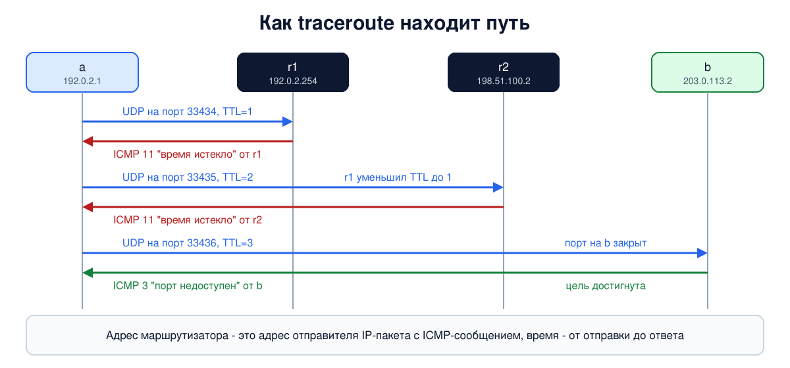

# Урок 28. ICMP: ping, traceroute и служебные сообщения IP

В уроках 25-27 маршрутизаторы то и дело "сообщали отправителю": что время жизни пакета истекло, что сети нет, что пакет не помещается. Сегодня разберём, как они это делают. Протокол ICMP - служебный голос IP: с его помощью сеть сообщает об ошибках и отвечает на проверки. На нём построены две главные утилиты сетевого инженера, ping и traceroute. В опыте соберём цепочку из двух маршрутизаторов и увидим все основные сообщения ICMP, а в конце разберём, как правильно настроить их пропуск.

## Что такое ICMP

**ICMP** (Internet Control Message Protocol) описан в RFC 792 (1981). Олифер называет его вспомогательным протоколом для диагностики и мониторинга. Главное:

- ICMP **ничего не исправляет**. Если пакет потерян, ICMP не отправит его заново, это дело TCP или приложения (блок 4). Его задача - сообщить отправителю, что с пакетом что-то случилось.
- Сообщение ICMP едет **внутри IP-пакета** с полем Protocol = 1 (урок 25). Получатель сообщения - отправитель исходного пакета.
- Как поступить с сообщением, решает тот, кто его получил: ядро, программа или никто. Олифер подчёркивает, что это не входит в обязанности самого ICMP.
- О проблемах с пакетами, которые **сами** несут ICMP-сообщения об ошибках, сообщения не отправляются. Так сеть избегает лавины служебного трафика.

Таненбаум относит ICMP к управляющим протоколам сетевого уровня вместе с ARP (урок 24) и DHCP (урок 29).

## Формат и основные сообщения

Заголовок ICMP - 8 байт: **тип** (1 байт), **код** (1 байт, уточняет тип), **контрольная сумма** (2 байта, по всему сообщению) и ещё 4 байта, смысл которых зависит от типа. Олифер делит сообщения на две группы: сообщения об ошибках и пары "запрос - ответ".

| Тип | Название | Когда появляется |
|---|---|---|
| 8 и 0 | эхо-запрос и эхо-ответ | проверка доступности, утилита ping |
| 3 | адресат недоступен | код уточняет: 0 - сеть, 1 - узел, 3 - порт, 4 - нужна фрагментация (урок 27) |
| 11 | время истекло | TTL дошёл до нуля (урок 25) или не успела сборка фрагментов (урок 27) |
| 5 | перенаправление (Redirect) | маршрутизатор подсказывает узлу более удачный шлюз в той же сети |
| 12 | проблема с параметрами | ошибка в заголовке пакета |

Таненбаум упоминает ещё редко используемое сообщение "подавление источника" (Source Quench, официально отменено в RFC 6633 в 2012 году): когда-то им просили отправителя замедлиться, но при перегрузке оно лишь добавляло трафика, и сегодня с перегрузкой справляется транспортный уровень (блок 4).

Важная деталь сообщений об ошибках: Олифер пишет, что в поле данных кладутся **заголовок IP и первые 8 байт данных** пакета, вызвавшего ошибку. В этих 8 байтах лежат порты TCP или UDP, поэтому отправитель понимает, к какому соединению и какой программе относится ошибка, и может ей сообщить. Это минимум по RFC 792; маршрутизаторы по RFC 1812 и Linux вкладывают больше, так чтобы весь IP-пакет с сообщением не превышал 576 байт. В опыте ниже это видно: `length 68` - это 8 байт заголовка ICMP плюс вся 60-байтовая проба traceroute.

## ping

Утилита **ping** отправляет эхо-запросы и ждёт эхо-ответов. Олифер разбирает формат: тип 8 для запроса и 0 для ответа, код 0, дальше **идентификатор** и **порядковый номер**. Отвечающий копирует их в ответ вместе с данными, и по ним ping сопоставляет ответы с запросами. В выводе ping видно время оборота (RTT, урок 7) и TTL пришедшего ответа.

Удачный ping говорит, что узел доступен и вся цепочка сетей работает в обе стороны. А вот неудачный ping сам по себе мало что доказывает: многие узлы и сети эхо-запросы не пропускают, хотя сами прекрасно работают.

## traceroute

Утилиту **traceroute** в 1987 году предложил Ван Джейкобсон, пишет Таненбаум, и называет её, возможно, самым полезным инструментом отладки сети за всю историю. Идея использует поле TTL (урок 25):

1. Отправляется пакет с TTL = 1. Первый маршрутизатор уменьшает TTL до нуля, уничтожает пакет и присылает ICMP "время истекло". Адрес первого маршрутизатора traceroute берёт из поля "адрес отправителя" в заголовке IP-пакета, в котором пришло это сообщение.
2. Затем пакет с TTL = 2 - его уничтожит второй маршрутизатор, и так далее.
3. Когда пакет доходит до цели, та отвечает по-другому. Классический traceroute в Linux и Unix шлёт UDP на заведомо закрытый порт, и цель отвечает "порт недоступен". Tracert в Windows шлёт эхо-запросы и получает эхо-ответ.



Олифер подчёркивает: время в каждой строке - это путь **туда и обратно** до этого маршрутизатора, а не время между соседними узлами. Оно не обязано расти от строки к строке: загрузка маршрутизаторов всё время меняется (Олифер), а путь обратно может отличаться от пути туда (урок 12). Звёздочка `*` означает, что ответ не пришёл за отведённое время: маршрутизатор мог его не отправить (в том числе из-за ограничения частоты ICMP, о нём ниже), проба или ответ могли потеряться, ответ мог отбросить межсетевой экран.

## Redirect

Сообщение **Redirect** (тип 5) маршрутизатор отправляет узлу, если видит, что тот отдал ему пакет, хотя в той же сети есть шлюз получше. Узел может запомнить подсказку, как в уроке 26 с флагом D. В Linux обычный компьютер по умолчанию принимает Redirect, но только от своего текущего шлюза (`secure_redirects = 1`), а машина, которая сама пересылает пакеты, их игнорирует. Поскольку такие подсказки меняют маршруты, на серверах их приём обычно выключают явно (об этом ниже).

## Как это увидеть в Linux

Соберём цепочку `a` - `r1` - `r2` - `b`: компьютер, два маршрутизатора и ещё один компьютер. Отправим ping, запустим traceroute и попробуем добраться до сети, которой нет, а на `a` будем записывать все сообщения ICMP. Нужны Linux (подойдёт WSL2), права sudo, tcpdump и traceroute (`sudo apt install tcpdump traceroute`); всё создаётся в пространствах имён `hbh-*` и в конце удаляется.

Создай файл `icmp-lab.sh` и запусти `bash icmp-lab.sh`:

```
set -u
for c in tcpdump traceroute; do
  command -v $c >/dev/null || { echo "нужен $c: sudo apt install $c"; exit 1; }
done
# убрать остатки прошлого запуска
for n in hbh-a hbh-r1 hbh-r2 hbh-b; do sudo ip netns del $n 2>/dev/null; done
# цепочка: a (192.0.2.1) - r1 - r2 - b (203.0.113.2)
for n in hbh-a hbh-r1 hbh-r2 hbh-b; do sudo ip netns add $n; done
sudo ip link add eth0 netns hbh-a type veth peer name eth0 netns hbh-r1
sudo ip link add eth1 netns hbh-r1 type veth peer name eth0 netns hbh-r2
sudo ip link add eth1 netns hbh-r2 type veth peer name eth0 netns hbh-b
sudo ip netns exec hbh-a ip addr add 192.0.2.1/24 dev eth0
sudo ip netns exec hbh-r1 ip addr add 192.0.2.254/24 dev eth0
sudo ip netns exec hbh-r1 ip addr add 198.51.100.1/24 dev eth1
sudo ip netns exec hbh-r2 ip addr add 198.51.100.2/24 dev eth0
sudo ip netns exec hbh-r2 ip addr add 203.0.113.254/24 dev eth1
sudo ip netns exec hbh-b ip addr add 203.0.113.2/24 dev eth0
for n in hbh-a hbh-r1 hbh-r2 hbh-b; do
  for i in $(sudo ip netns exec $n ls /sys/class/net); do sudo ip netns exec $n ip link set $i up; done
done
sudo ip netns exec hbh-a ip route add default via 192.0.2.254
sudo ip netns exec hbh-r1 ip route add 203.0.113.0/24 via 198.51.100.2
sudo ip netns exec hbh-r2 ip route add 192.0.2.0/24 via 198.51.100.1
sudo ip netns exec hbh-b ip route add default via 203.0.113.254
for n in hbh-r1 hbh-r2; do sudo ip netns exec $n sysctl -qw net.ipv4.ip_forward=1; done
sleep 1
d=$(mktemp -d)
sudo ip netns exec hbh-a timeout 12 tcpdump -i eth0 -n -l icmp 2>/dev/null > "$d/icmp" &
sleep 1
echo '--- 1. ping: echo request and echo reply'
sudo ip netns exec hbh-a ping -c 2 203.0.113.2 | grep -E 'bytes from|packets'
echo '--- 2. traceroute: TTL 1, 2, 3...'
sudo ip netns exec hbh-a traceroute -n -N 1 -q 1 -w 1 203.0.113.2
echo '--- 3. a network nobody knows'
sudo ip netns exec hbh-a ping -c 1 -W 1 198.18.0.1 | grep -E 'From|packets'
wait
echo '--- 4. ICMP messages seen by a'
sed -E 's/^[0-9:.]+ //' "$d/icmp"
echo '--- 5. ICMP settings of this system'
sysctl net.ipv4.icmp_echo_ignore_broadcasts net.ipv4.icmp_ratelimit net.ipv4.conf.all.accept_redirects
echo '--- cleanup'
for n in hbh-a hbh-r1 hbh-r2 hbh-b; do sudo ip netns del $n; done
rm -rf "$d"
ip netns list | grep -cE '^hbh-(a|r1|r2|b)( |$)'
```

Вот что получилось на нашем сервере:

```
--- 1. ping: echo request and echo reply
64 bytes from 203.0.113.2: icmp_seq=1 ttl=62 time=0.132 ms
64 bytes from 203.0.113.2: icmp_seq=2 ttl=62 time=0.075 ms
2 packets transmitted, 2 received, 0% packet loss, time 1036ms
--- 2. traceroute: TTL 1, 2, 3...
traceroute to 203.0.113.2 (203.0.113.2), 30 hops max, 60 byte packets
 1  192.0.2.254  0.035 ms
 2  198.51.100.2  0.022 ms
 3  203.0.113.2  0.037 ms
--- 3. a network nobody knows
From 192.0.2.254 icmp_seq=1 Destination Net Unreachable
1 packets transmitted, 0 received, +1 errors, 100% packet loss, time 0ms
--- 4. ICMP messages seen by a
IP 192.0.2.1 > 203.0.113.2: ICMP echo request, id 14441, seq 1, length 64
IP 203.0.113.2 > 192.0.2.1: ICMP echo reply, id 14441, seq 1, length 64
IP 192.0.2.1 > 203.0.113.2: ICMP echo request, id 14441, seq 2, length 64
IP 203.0.113.2 > 192.0.2.1: ICMP echo reply, id 14441, seq 2, length 64
IP 192.0.2.254 > 192.0.2.1: ICMP time exceeded in-transit, length 68
IP 198.51.100.2 > 192.0.2.1: ICMP time exceeded in-transit, length 68
IP 203.0.113.2 > 192.0.2.1: ICMP 203.0.113.2 udp port 33436 unreachable, length 68
IP 192.0.2.1 > 198.18.0.1: ICMP echo request, id 14446, seq 1, length 64
IP 192.0.2.254 > 192.0.2.1: ICMP net 198.18.0.1 unreachable, length 92

--- 5. ICMP settings of this system
net.ipv4.icmp_echo_ignore_broadcasts = 1
net.ipv4.icmp_ratelimit = 1000
net.ipv4.conf.all.accept_redirects = 0
--- cleanup
0
```

Разберём по шагам.

- **Шаг 1: ping.** Два ответа от `b`, у каждого `ttl=62`: ответ отправлен с TTL 64 и прошёл два маршрутизатора. Время - доли миллисекунды, ведь всё происходит внутри одной машины.
- **Шаг 2: traceroute.** Три строки: `r1` (`192.0.2.254`), `r2` (`198.51.100.2`) и сама цель `203.0.113.2`. Флаг `-N 1` заставляет traceroute отправлять пробы по одной (по умолчанию он отправляет несколько сразу, чтобы работать быстрее), `-q 1` - одну пробу на шаг, `-w 1` - ждать ответа не больше секунды. Пробы по одной помогают и с ограничением частоты ICMP: если отправить много проб сразу, часть ответов маршрутизатор может не прислать. `60 byte packets` - это 20 байт заголовка IP, 8 байт заголовка UDP и 32 байта данных.
- **Шаг 3: сети нет.** У `a` есть маршрут по умолчанию, и пакет к `198.18.0.1` уходит на `r1`. А у `r1` нет ни маршрута к этой сети, ни маршрута по умолчанию, поэтому он отвечает `Destination Net Unreachable`.
- **Шаг 4: все сообщения ICMP, которые видел `a`.** Два эхо-запроса и два эхо-ответа с одинаковым идентификатором (`id`) и номерами `seq 1` и `seq 2` - так ping сопоставляет ответы с запросами. Два сообщения `time exceeded in-transit` - от `r1` и от `r2`, это ответы на пробы traceroute с TTL 1 и 2. Сообщение `udp port 33436 unreachable` - от самой цели: проба дошла, но порт закрыт, и traceroute понял, что путь пройден (порты начинаются с 33434 и растут с каждой пробой, поэтому третья проба ушла на 33436). И `net 198.18.0.1 unreachable` от `r1` - ответ на шаг 3.
- **Шаг 5: настройки ICMP на этой машине.** `icmp_echo_ignore_broadcasts = 1` - не отвечать на эхо-запросы, отправленные на широковещательный адрес; `icmp_ratelimit = 1000` - ограничение частоты сообщений об ошибках: примерно одно сообщение в 1000 мс на одного получателя, с небольшим запасом подряд (подробнее ниже); `accept_redirects = 0` - не принимать подсказки Redirect. Все три - защитные настройки, о них следующий раздел. На домашнем компьютере или в WSL в последней строке, скорее всего, будет 1: у нашего сервера включена пересылка пакетов, а при ней Linux сам выключает приём Redirect.
- В конце `0`: пространства имён удалены.

## Защита: какие ICMP пропускать и как ограничивать

Первое желание при настройке межсетевого экрана - запретить ICMP целиком. Так делать нельзя: без ICMP ломаются важные механизмы сети. Разумная политика такая:

- **Обязательно пропускать** сообщения "адресат недоступен", особенно "нужна фрагментация" (тип 3, код 4): без них не работает Path MTU Discovery, и появляются "чёрные дыры" (урок 27). Также "время истекло" (тип 11) и "проблема с параметрами" (тип 12) для ответов на собственный трафик. Межсетевые экраны с отслеживанием соединений (блок 6) умеют пропускать их только как ответ на реально отправленные пакеты: соединение они находят как раз по вложенному в сообщение заголовку исходного пакета и его первым байтам.
- **Эхо-ответы** (тип 0) на собственные пинги пропускают так же - как ответ на отправленный запрос.
- **Эхо-запросы** - по решению администратора. Отвечать на ping удобно для диагностики, и большинство публичных серверов отвечает. Если не отвечать, это немного уменьшает видимость узла, но не защищает его: служба на открытом порту всё равно видна.
- **Не отвечать на эхо-запросы на широковещательный адрес** (`icmp_echo_ignore_broadcasts = 1`, так по умолчанию в Linux) и не пересылать широковещание в чужие сети через маршрутизаторы (урок 21).
- **Ограничивать частоту** сообщений ICMP. В Linux `icmp_ratelimit` задаёт частоту для одного получателя, а маска `icmp_ratemask` - к каким типам она применяется: по умолчанию это типы 3, 11 и 12, эхо-ответы - только если добавить их в маску. Общий потолок для тех же типов на всех получателей задаёт `icmp_msgs_per_sec`. "Нужна фрагментация" Linux не ограничивает, чтобы не ломать Path MTU Discovery. На маршрутизаторах - свои настройки. Это защищает и сам узел, и сеть от лавины служебного трафика.
- **Не принимать Redirect** на серверах и маршрутизаторах: `accept_redirects = 0` одновременно в `all` и `default` (и для уже существующих интерфейсов), потому что на обычном компьютере Linux принимает Redirect, если параметр включён хотя бы в одном из мест. На машинах, которые пересылают пакеты, но не служат маршрутизаторами сети (VPN-сервер, хост с контейнерами), выключают и отправку: `send_redirects = 0` тоже в `all` и `default` (и для существующих интерфейсов) - ядро отправляет Redirect, если параметр включён хотя бы в одном из мест. Маршруты должны задавать администратор и протоколы маршрутизации, а не случайные подсказки.
- **Отбрасывать на внешней границе** остальные типы, которые там обычно не нужны: Redirect снаружи (5), запросы времени (13 и 14), устаревшие запросы маски (17 и 18), объявления и поиск маршрутизаторов (9 и 10).
- **Следить** за необычным ростом ICMP-трафика: это повод разобраться, что происходит в сети.

## Итог

- ICMP сообщает отправителю о проблемах с его пакетами и отвечает на проверки, но ничего не исправляет. Сообщения едут внутри IP (Protocol = 1).
- Заголовок - тип, код, контрольная сумма и 4 байта по типу. Главные сообщения: эхо-запрос и ответ (8 и 0), адресат недоступен (3, с кодами), время истекло (11), Redirect (5).
- В сообщение об ошибке кладут заголовок IP и как минимум первые 8 байт данных исходного пакета, поэтому отправитель узнаёт, к какому соединению относится ошибка.
- ping проверяет доступность и измеряет время оборота; traceroute по сообщениям "время истекло" находит маршрутизаторы на пути.
- ICMP нельзя запрещать целиком: нужные сообщения пропускают как ответы на свой трафик, эхо разрешают по решению администратора, частоту ограничивают, Redirect не принимают.

## Что почитать

- Олифер, "Компьютерные сети", глава 14, с. 462-467: протокол ICMP, формат, типы и коды, недостижимость узла и traceroute, эхо-запрос и ping.
- Таненбаум, "Компьютерные сети", раздел 5.7.4, с. 530-531: управляющие протоколы интернета, основные сообщения ICMP, traceroute.
