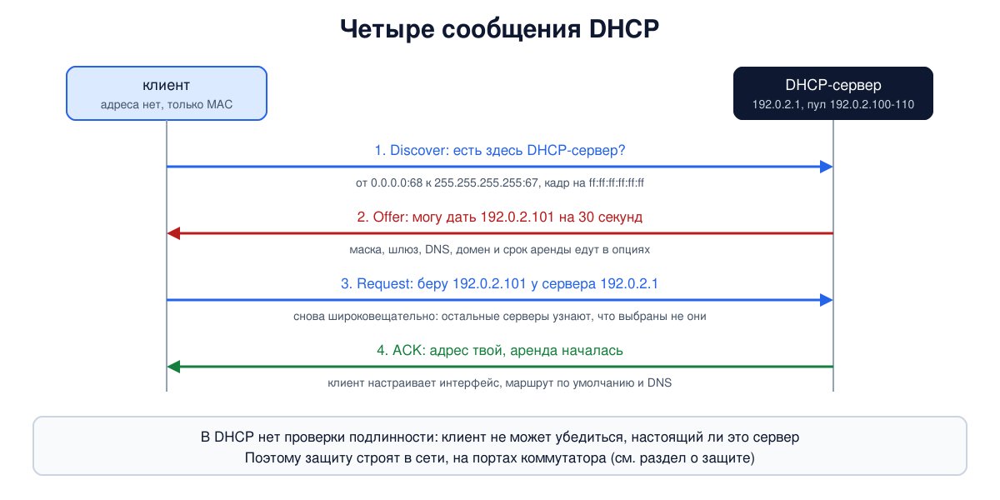
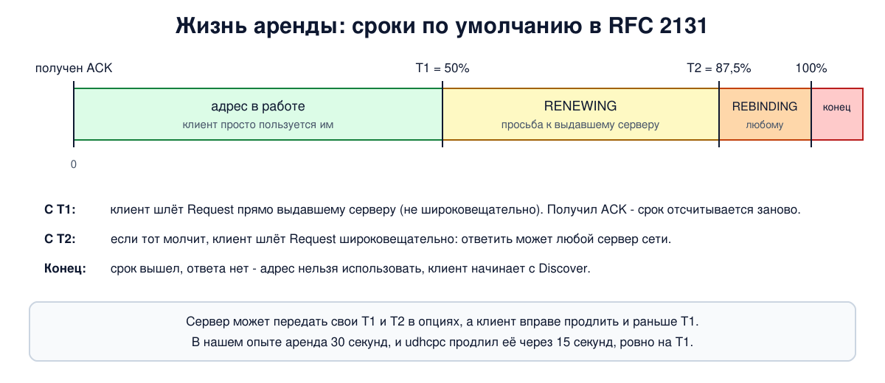

# Урок 29. DHCP: как компьютер получает адрес и настройки

До сих пор мы задавали адреса руками: `ip addr add`. Дома и в офисе так не делают: телефон, подключившись к Wi-Fi, сам получает адрес, шлюз и DNS-сервер за долю секунды. За это отвечает протокол DHCP. У него есть любопытная задача: компьютеру, у которого ещё нет адреса, нужно найти сервер, адреса которого он не знает. В опыте мы поднимем DHCP-сервер и двух клиентов, увидим все сообщения в tcpdump и продление аренды, а в конце разберём, чем DHCP опасен и как его защищают.

## Зачем нужен DHCP

Олифер начинает с проблемы ручной настройки. Каждому интерфейсу нужен адрес, маска, адрес шлюза по умолчанию, адрес DNS-сервера, иногда доменное имя. Администратору приходится помнить, какие адреса уже заняты, и даже в небольшой сети это утомительно и ведёт к ошибкам. Протокол динамического конфигурирования хостов (**DHCP**, Dynamic Host Configuration Protocol) автоматизирует настройку и, как пишет Олифер, гарантирует отсутствие дублирования адресов за счёт централизованного управления. Оговорка: гарантия действует, если все адреса в сети раздаёт он; узел с адресом, заданным вручную, может совпасть с адресом из пула, поэтому серверы и клиенты дополнительно проверяют адрес (об этом ниже).

Таненбаум добавляет, что DHCP описан в RFC 2131 и 2132, что им пользуются и провайдеры для настройки устройств абонентов, и что он во многом заменил более ранние протоколы RARP и BOOTP. Из самого RFC 2131: формат сообщений и порты UDP 67 и 68 DHCP унаследовал от BOOTP, поэтому tcpdump до сих пор подписывает его пакеты `BOOTP/DHCP`.

Что раздаёт DHCP: чаще всего это адрес с маской, шлюз по умолчанию (урок 26) и адреса DNS-серверов (блок 7), а также доменное имя, серверы времени и другое. Сам адрес лежит в отдельном поле сообщения (`yiaddr`, "твой адрес"), а все остальные параметры передаются в **опциях**: числовой код, длина и значение.

## Три режима работы сервера

Олифер выделяет три режима. Во всех администратор сообщает серверу диапазон адресов, причём все они из одной сети.

1. **Ручное назначение**: администратор жёстко связывает адрес с MAC-адресом или другим идентификатором клиента, и сервер всегда выдаёт этому клиенту один и тот же адрес. На практике так поступают с серверами и принтерами: адрес у них постоянный, но настраиваются они централизованно.
2. **Автоматическое назначение статических адресов**: сервер сам выбирает клиенту адрес из пула при первой просьбе и потом всегда выдаёт его же.
3. **Динамическое распределение**: адрес выдаётся на ограниченное время, на **срок аренды**. Когда клиент уходит из сети, адрес освобождается и достаётся другому. Олифер пишет, что это происходит автоматически; технически сервер узнаёт об уходе, когда клиент сам возвращает адрес (сообщение RELEASE, о нём ниже) или когда аренда истекает. Динамический режим позволяет обслуживать больше устройств, чем есть адресов, если они не работают все сразу: у Олифера 500 мобильных сотрудников делят пул из 64 адресов, потому что в офисе одновременно не больше 50.

Динамический режим - основной в жизни. Срок аренды выбирает администратор по образу работы пользователей: у Олифера для учебной лаборатории он равен длине занятия, для офиса - несколько дней или недель. В домашних роутерах чаще всего от нескольких часов до суток.

## Как клиент находит сервер

Сложность в том, что у клиента нет адреса, а адреса сервера он не знает. Решение: широковещание (уроки 15, 16 и 21).

- Клиент отправляет IP-пакет **на адрес `255.255.255.255`** (ограниченное широковещание, оно не выходит за пределы своей сети, урок 21; у Олифера - "адрес из одних единиц"). В поле отправителя по RFC 2131 стоит `0.0.0.0`: своего адреса ещё нет. Это UDP: у клиента порт **68**, у сервера порт **67**.
- В кадре Ethernet адрес назначения `ff:ff:ff:ff:ff:ff`, поэтому кадр коммутатор рассылает на все порты сети (урок 16), и серверу не нужно знать клиента заранее. Таненбаум отмечает, что сервер опознаёт клиента по его MAC-адресу, который есть в пакете Discover.

Олифер уточняет, что сервер должен быть в той же сети, что и клиенты, раз запросы широковещательные (о том, как обойти это ограничение - в разделе про ретранслятор).

## Четыре сообщения: Discover, Offer, Request, ACK

Олифер описывает обмен в шесть шагов; в терминах стандарта его удобно свести к четырём сообщениям (в английской литературе - DORA).



1. **Discover** (у Олифера "DHCP-поиск"). Клиент спрашивает всю сеть: есть тут DHCP-серверы?
2. **Offer** ("предложение"). Каждый сервер, получивший запрос, предлагает адрес и параметры. Серверов может быть несколько, например основной и резервный.
3. **Request** ("запрос"). Клиент выбирает предложение (Олифер: как правило, первое из поступивших) и отправляет **широковещательный** Request. В нём указано, чьё предложение принято и какие параметры. Зачем широковещательный, если сервер уже выбран? Затем, что об этом должны узнать и остальные серверы: они аннулируют свои предложения и возвращают адреса в пулы.
4. **ACK** ("квитанция"). Выбранный сервер подтверждает адрес и параметры аренды, и клиент переходит в рабочее состояние: настраивает интерфейс.

В RFC 2131 есть и другие сообщения; назовём три (в книгах они не названы по имени, хотя по смыслу Олифер описывает отказ сервера и досрочный отказ клиента). Если запрошенный адрес неверен или больше недоступен (например, клиент переехал в другую сеть или аренда уже истекла), сервер отвечает отрицательным подтверждением NAK, и клиент начинает заново с Discover. Если клиент, получив ACK, обнаружит, что адрес уже кем-то используется (стандарт советует проверять это ARP-запросом, урок 24), он отправляет серверу сообщение DECLINE и тоже начинает заново с Discover. А уходя из сети, клиент может по своей инициативе досрочно вернуть адрес сообщением RELEASE (Олифер: клиент может досрочно отказаться от выделенных параметров).

Сервер тоже старается не выдать занятый адрес. Например, BusyBox udhcpd перед предложением проверяет адрес ARP-запросом; вы увидите это в опыте.

## Аренда и продление

Зачем нужна аренда, Таненбаум объясняет так. Выданный навсегда адрес пропадёт, если хост исчезнет из сети, не вернув его, и пул будет постепенно таять. Срок решает проблему: не продлил вовремя - адрес снова свободен.

Олифер описывает так: первую попытку клиент делает задолго до конца срока, обращаясь к тому серверу, от которого получил параметры. Если ответа нет, через некоторое время повторяет; если все попытки безуспешны, обращается к другому серверу; если отказ и там, теряет конфигурацию. Стандарт (RFC 2131) уточняет по срокам:



- **T1**, по умолчанию 50% срока: клиент отправляет Request **прямо выдавшему серверу**, не широковещательно (состояние RENEWING). Получил ACK - срок начинается заново.
- **T2**, по умолчанию 87,5% срока: если тот молчит, клиент рассылает Request широковещательно, и ответить может любой сервер (REBINDING).
- Срок вышел, а ответа нет: адрес нужно перестать использовать и начать с Discover.

Сервер может передать свои T1 и T2 в опциях, а клиент вправе продлить аренду и раньше T1; в момент T1 он переходит к продлению. В опыте продление придётся ровно на половину срока. Если DHCP-сервер недоступен, разные системы ведут себя по-разному. Windows и macOS обычно назначают себе адрес из блока `169.254.0.0/16` (link-local, RFC 3927, урок 21) и продолжают работать в локальной сети; в Linux это зависит от программы-клиента и её настроек (NetworkManager, systemd-networkd), по умолчанию они обычно просто повторяют попытки.

## Ретранслятор (relay)

Широковещательный Discover не проходит через маршрутизатор, и, казалось бы, в каждой сети нужен свой сервер. Но это не обязательно: на маршрутизаторе запускают **DHCP-ретранслятор** (у Олифера "связной DHCP-агент", у Таненбаума - ретрансляция). Он ловит широковещательные запросы клиентов, пересылает их **обычным пакетом** известному ему серверу в другой сети, дописав в запрос адрес своего интерфейса в сети клиента (поле `giaddr`; RFC 1542 и 2131), и возвращает ответ клиенту. По этому адресу сервер понимает, из какой сети пришёл запрос и из какого пула выбрать адрес. Один сервер обслуживает много сетей (например, по одной на VLAN, урок 18); Олифер показывает на рисунке 13.11 схемы с резервным сервером и ретранслятором.

## Влияние DHCP на файервол и журналы

К этой мысли Олифер возвращается дважды, в главе об адресации и в главе о безопасности: когда адреса динамические, заранее не известно, какой адрес у узла в данный момент. У него это усложняет работу DNS, удалённое управление и мониторинг и фильтрацию пакетов по IP-адресам. Для сетей с файерволом он предлагает два подхода:

- использовать DHCP только для клиентских компьютеров, а серверам ставить постоянные статические адреса;
- использовать DHCP и для серверов, но создать для них **статические записи** на DHCP-сервере, где MAC-адрес всегда получает один и тот же IP-адрес.

В опыте ниже одна такая запись есть. От себя добавим то же про журналы: в записи "в 15:00 подключались с адреса 192.0.2.105" мало толку, если не знать, кому этот адрес был выдан в 15:00. Поэтому журнал аренд хранят вместе с остальными журналами.

## Как это увидеть в Linux

Сделаем в пространствах имён сеть: сервер DHCP (`hbh-srv`, адрес `192.0.2.1`), коммутатор (`hbh-sw`, мост) и два клиента без адресов (`hbh-c1` и `hbh-c2`). Сервер и клиент - из BusyBox: `udhcpd` и `udhcpc`, в Ubuntu их даёт пакет `busybox`. На сервере пул `192.0.2.100-110`, срок аренды 30 секунд (для урока, в жизни так мало не делают; меньше 30 секунд клиент udhcpc всё равно не принимает и считает такую аренду 30-секундной), и одна закреплённая запись: клиент `c2` с MAC `02:00:00:00:00:42` всегда получает `192.0.2.50`. На сервере будем записывать пакеты DHCP и ARP. Нужны Linux (подойдёт WSL2), права sudo, tcpdump и busybox (`sudo apt install busybox tcpdump`); всё создаётся в пространствах имён `hbh-*` и в конце удаляется. Скрипт идёт около 35 секунд. Клиентский скрипт `client.sh` в опыте упрощённый: он ставит адрес с маской и маршрут по умолчанию, а DNS-сервер и домен только печатает. Настоящие клиенты (NetworkManager, systemd-networkd) записывают и их в настройки системы.

Создай файл `dhcp-lab.sh` и запусти `bash dhcp-lab.sh`:

```
set -u
for c in busybox tcpdump; do
  command -v $c >/dev/null || { echo "нужен $c: sudo apt install $c"; exit 1; }
done
# убрать остатки прошлого запуска
for n in hbh-srv hbh-sw hbh-c1 hbh-c2; do
  sudo ip netns pids $n 2>/dev/null | xargs -r sudo kill
  sudo ip netns del $n 2>/dev/null
done
d=$(mktemp -d)
chmod 755 "$d"
# сервер (192.0.2.1) и два клиента без адресов, соединённые через коммутатор (мост в hbh-sw)
for n in hbh-srv hbh-sw hbh-c1 hbh-c2; do sudo ip netns add $n; done
sudo ip link add eth0 netns hbh-srv type veth peer name p0 netns hbh-sw
sudo ip link add eth0 netns hbh-c1 type veth peer name p1 netns hbh-sw
sudo ip link add eth0 netns hbh-c2 type veth peer name p2 netns hbh-sw
sudo ip netns exec hbh-c1 ip link set eth0 address 02:00:00:00:00:41
sudo ip netns exec hbh-c2 ip link set eth0 address 02:00:00:00:00:42
sudo ip netns exec hbh-srv ip addr add 192.0.2.1/24 dev eth0
sudo ip netns exec hbh-sw ip link add br0 type bridge
for p in p0 p1 p2; do sudo ip netns exec hbh-sw ip link set $p master br0; done
for n in hbh-srv hbh-sw hbh-c1 hbh-c2; do
  for i in $(sudo ip netns exec $n ls /sys/class/net); do sudo ip netns exec $n ip link set $i up; done
done
# настройки сервера: пул адресов, срок аренды, то, что раздаётся вместе с адресом, и одна закреплённая запись
cat > "$d/udhcpd.conf" <<EOF
start 192.0.2.100
end 192.0.2.110
interface eth0
lease_file $d/leases
auto_time 1
option subnet 255.255.255.0
option router 192.0.2.1
option dns 192.0.2.53
option domain lab.example
option lease 30
static_lease 02:00:00:00:00:42 192.0.2.50
EOF
: > "$d/leases"
# скрипт клиента: udhcpc вызывает его при каждом событии и передаёт значения в переменных
cat > "$d/client.sh" <<'EOF'
#!/bin/sh
case "$1" in
  bound|renew)
    # $mask - длина префикса, которую udhcpc вычислил из маски в ответе сервера
    echo "client event: $1 ip=$ip mask=$subnet (/$mask) router=$router dns=$dns domain=$domain lease=$lease server=$serverid"
    ip addr replace "$ip/$mask" dev eth0
    ip route replace default via "$router"
    ;;
  deconfig)
    echo "client event: deconfig"
    ip addr flush dev eth0
    ;;
esac
EOF
chmod 755 "$d/client.sh"
# сводка по пакетам: по одной строке на пакет
cat > "$d/sum.awk" <<'EOF'
function flush() { if (n) print ts, smac, ">", dmac, "|", src, ">", dst, "|", type extra; n = 0; extra = "" }
/^[0-9]+\.[0-9]+ / { flush(); n = 1; src = "-"; dst = "-"; type = ""; if (!t0) t0 = $1; ts = sprintf("%5.1fs", $1 - t0); smac = $2; dmac = $4; sub(/,$/, "", dmac); if ($0 ~ /ethertype ARP/) { l = $0; sub(/.*\(len 4\), /, "", l); sub(/, length.*/, "", l); type = "ARP: " l } next }
/^ +[0-9]+\.[0-9]+\.[0-9]+\.[0-9]+\.[0-9]+ > / { src = $1; dst = $3; sub(/:$/, "", dst); next }
/DHCP-Message/ { type = $NF }
/Requested-IP/ { extra = extra " requested=" $NF }
/Server-ID/ { extra = extra " server=" $NF }
/Your-IP/ { extra = extra " yiaddr=" $NF }
/Client-IP/ { extra = extra " ciaddr=" $NF }
/Lease-Time/ { extra = extra " lease=" $NF }
/Vendor-Class/ { v = $0; sub(/.*: /, "", v); extra = extra " vendor=" v }
END { flush() }
EOF
echo '--- 1. clients before DHCP: IPv4 addresses on eth0'
for c in hbh-c1 hbh-c2; do sudo ip netns exec $c ip -4 addr show dev eth0 | grep -c inet; done
sudo ip netns exec hbh-srv busybox udhcpd -f "$d/udhcpd.conf" 2>/dev/null &
sleep 2
sudo ip netns exec hbh-srv timeout 34 tcpdump -i eth0 -n -e -l -tt -v port 67 or port 68 or arp 2>/dev/null > "$d/pkts" &
sleep 1
echo '--- 2. both clients run for 26 s, the lease is 30 s'
sudo ip netns exec hbh-c1 timeout 26 busybox udhcpc -f -i eth0 -s "$d/client.sh" 2>&1 | grep -E 'client event|obtained' | sed 's/^/c1: /' > "$d/c1.log" &
sleep 1
sudo ip netns exec hbh-c2 timeout 26 busybox udhcpc -f -i eth0 -s "$d/client.sh" 2>&1 | grep -E 'client event|obtained' | sed 's/^/c2: /' > "$d/c2.log" &
sleep 20
echo '--- 3. clients in the middle of the run'
for c in hbh-c1 hbh-c2; do sudo ip netns exec $c ip -4 addr show dev eth0 | grep inet; done
sudo ip netns exec hbh-c1 ip route show
echo '--- 4. server view: lease table'
sudo ip netns exec hbh-srv busybox dumpleases -f "$d/leases"
sleep 10
echo '--- 5. what the clients logged'
cat "$d/c1.log" "$d/c2.log"
echo '--- 6. packets on the wire (time, MAC, IP, message)'
awk -f "$d/sum.awk" "$d/pkts"
echo '--- cleanup'
for n in hbh-srv hbh-sw hbh-c1 hbh-c2; do
  sudo ip netns pids $n 2>/dev/null | xargs -r sudo kill
  sudo ip netns del $n
done
rm -rf "$d"
ip netns list | grep -cE '^hbh-(srv|sw|c1|c2)( |$)'
```

Вот что получилось на нашем сервере (под заголовком шага 2 ничего не печатается: вывод клиентов мы собираем в файлы и показываем в шаге 5):

```
--- 1. clients before DHCP: IPv4 addresses on eth0
0
0
--- 2. both clients run for 26 s, the lease is 30 s
--- 3. clients in the middle of the run
    inet 192.0.2.101/24 scope global eth0
    inet 192.0.2.50/24 scope global eth0
default via 192.0.2.1 dev eth0 
192.0.2.0/24 dev eth0 proto kernel scope link src 192.0.2.101 
--- 4. server view: lease table
Mac Address       IP Address      Host Name           Expires in
02:00:00:00:00:42 192.0.2.50                          00:00:26
02:00:00:00:00:41 192.0.2.101                         00:00:26
--- 5. what the clients logged
c1: client event: deconfig
c1: udhcpc: lease of 192.0.2.101 obtained from 192.0.2.1, lease time 30
c1: client event: bound ip=192.0.2.101 mask=255.255.255.0 (/24) router=192.0.2.1 dns=192.0.2.53 domain=lab.example lease=30 server=192.0.2.1
c1: udhcpc: lease of 192.0.2.101 obtained from 192.0.2.1, lease time 30
c1: client event: renew ip=192.0.2.101 mask=255.255.255.0 (/24) router=192.0.2.1 dns=192.0.2.53 domain=lab.example lease=30 server=192.0.2.1
c2: client event: deconfig
c2: udhcpc: lease of 192.0.2.50 obtained from 192.0.2.1, lease time 30
c2: client event: bound ip=192.0.2.50 mask=255.255.255.0 (/24) router=192.0.2.1 dns=192.0.2.53 domain=lab.example lease=30 server=192.0.2.1
c2: udhcpc: lease of 192.0.2.50 obtained from 192.0.2.1, lease time 30
c2: client event: renew ip=192.0.2.50 mask=255.255.255.0 (/24) router=192.0.2.1 dns=192.0.2.53 domain=lab.example lease=30 server=192.0.2.1
--- 6. packets on the wire (time, MAC, IP, message)
  0.0s 02:00:00:00:00:41 > ff:ff:ff:ff:ff:ff | 0.0.0.0.68 > 255.255.255.255.67 | Discover vendor="udhcp 1.36.1"
  0.0s 32:47:3b:9c:f7:b5 > ff:ff:ff:ff:ff:ff | - > - | ARP: Request who-has 192.0.2.101 tell 192.0.2.1
  1.0s 02:00:00:00:00:42 > ff:ff:ff:ff:ff:ff | 0.0.0.0.68 > 255.255.255.255.67 | Discover vendor="udhcp 1.36.1"
  2.0s 32:47:3b:9c:f7:b5 > ff:ff:ff:ff:ff:ff | 192.0.2.1.67 > 255.255.255.255.68 | Offer yiaddr=192.0.2.101 server=192.0.2.1 lease=30
  2.0s 02:00:00:00:00:41 > ff:ff:ff:ff:ff:ff | 0.0.0.0.68 > 255.255.255.255.67 | Request requested=192.0.2.101 server=192.0.2.1 vendor="udhcp 1.36.1"
  2.0s 32:47:3b:9c:f7:b5 > ff:ff:ff:ff:ff:ff | 192.0.2.1.67 > 255.255.255.255.68 | Offer yiaddr=192.0.2.50 server=192.0.2.1 lease=30
  2.0s 02:00:00:00:00:42 > ff:ff:ff:ff:ff:ff | 0.0.0.0.68 > 255.255.255.255.67 | Request requested=192.0.2.50 server=192.0.2.1 vendor="udhcp 1.36.1"
  2.0s 32:47:3b:9c:f7:b5 > ff:ff:ff:ff:ff:ff | 192.0.2.1.67 > 255.255.255.255.68 | ACK yiaddr=192.0.2.101 server=192.0.2.1 lease=30
  2.1s 32:47:3b:9c:f7:b5 > ff:ff:ff:ff:ff:ff | 192.0.2.1.67 > 255.255.255.255.68 | ACK yiaddr=192.0.2.50 server=192.0.2.1 lease=30
 17.1s 02:00:00:00:00:42 > ff:ff:ff:ff:ff:ff | - > - | ARP: Request who-has 192.0.2.1 tell 192.0.2.50
 17.1s 32:47:3b:9c:f7:b5 > 02:00:00:00:00:42 | - > - | ARP: Reply 192.0.2.1 is-at 32:47:3b:9c:f7:b5
 17.1s 02:00:00:00:00:42 > 32:47:3b:9c:f7:b5 | 192.0.2.50.68 > 192.0.2.1.67 | Request ciaddr=192.0.2.50 vendor="udhcp 1.36.1"
 17.1s 02:00:00:00:00:41 > ff:ff:ff:ff:ff:ff | - > - | ARP: Request who-has 192.0.2.1 tell 192.0.2.101
 17.1s 32:47:3b:9c:f7:b5 > 02:00:00:00:00:41 | - > - | ARP: Reply 192.0.2.1 is-at 32:47:3b:9c:f7:b5
 17.1s 02:00:00:00:00:41 > 32:47:3b:9c:f7:b5 | 192.0.2.101.68 > 192.0.2.1.67 | Request ciaddr=192.0.2.101 vendor="udhcp 1.36.1"
 17.1s 32:47:3b:9c:f7:b5 > 02:00:00:00:00:42 | 192.0.2.1.67 > 192.0.2.50.68 | ACK ciaddr=192.0.2.50 yiaddr=192.0.2.50 server=192.0.2.1 lease=30
 17.1s 32:47:3b:9c:f7:b5 > 02:00:00:00:00:41 | 192.0.2.1.67 > 192.0.2.101.68 | ACK ciaddr=192.0.2.101 yiaddr=192.0.2.101 server=192.0.2.1 lease=30
--- cleanup
0
```

Разберём по шагам.

- **Шаг 1.** До запуска у обоих клиентов нет ни одного адреса IPv4 (`0` и `0`).
- **Шаг 3: клиенты в середине опыта.** Первый адрес принадлежит `c1`, второй - `c2`. `c1` получил `192.0.2.101` из пула, а `c2` - закреплённый `192.0.2.50`, потому что его MAC есть в записи `static_lease`. Клиентский скрипт настроил адрес, маску `/24` (`192.0.2.0/24 dev eth0 ... src 192.0.2.101`) и маршрут по умолчанию через `192.0.2.1`. Ни маску, ни шлюз мы в скрипте не писали: сервер прислал маску `255.255.255.0`, udhcpc передал её скрипту и в виде длины префикса (`$mask`, в шаге 5 она видна как `(/24)`), а шлюз - в переменной `$router`.
- **Шаг 4: таблица аренд сервера.** Два клиента, у обоих осталось около 26 секунд из 30: аренда недавно продлена (в шаге 6 видно, когда). Если запустишь у себя, от запуска к запуску будут отличаться MAC-адрес сервера (его ядро выбирает случайно), версия BusyBox в `vendor=` и время на десятую долю секунды.
- **Шаг 5: что видел клиентский скрипт.** Сначала событие `deconfig` (сброс), потом `bound` - адрес получен, со значениями из ответа: маска, шлюз, DNS `192.0.2.53`, домен, срок 30, сервер. Потом `renew` - продление. При продлении наш скрипт адрес не снимает, а только обновляет (`ip addr replace`), как и настоящие клиенты: соединения не рвутся.
- **Шаг 6: пакеты.** Первая строка - Discover от `c1`: с `0.0.0.0` на `255.255.255.255`, порты 68 и 67, в кадре `ff:ff:ff:ff:ff:ff`. Вторая строка - ARP-запрос сервера "кто владеет `192.0.2.101`?": так udhcpd проверяет, что адрес из пула свободен, и предложение для `c1` появляется только через 2 секунды, когда ответа так и не пришло. За это время `c2` успевает отправить свой Discover. Закреплённый адрес `192.0.2.50` сервер ARP-запросом не проверял (такой строки нет), но ответил `c2` тоже лишь около 2-й секунды: udhcpd обрабатывает запросы по одному и всё это время ждал ответа на ARP-запрос для `c1`. Дальше видны Offer, Request, ACK для обоих клиентов. **Первые Offer и ACK этот сервер отправил широковещательно** (стандарт позволяет отвечать и напрямую клиенту, это зависит от сервера и от флага в запросе клиента). Request клиентов указывает, чьё предложение принято (`server=192.0.2.1`) и какой адрес запрошен. Во всех сообщениях клиента есть `vendor="udhcp 1.36.1"`: DHCP-клиент сообщает, какая он программа. В строках `17.1s` - продление: сначала ARP-запрос клиента о MAC-адресе сервера (раньше клиент к серверу напрямую не обращался, урок 24), затем **Request прямо серверу** с `ciaddr=` - собственным адресом клиента, и ACK в ответ, **тоже напрямую**, на адрес клиента. Продление пришлось на 17-ю секунду при выдаче на 2-й, то есть через 15 секунд из 30 - ровно на T1 = 50%. (udhcpc продлевает на половине срока и значения T1 и T2 из опций сервера не читает.)
- В конце `0`: пространства имён удалены.

## Как DHCP используют во вред: принципы

В DHCP нет проверки подлинности: клиент не может убедиться, что предложение прислал настоящий сервер, а сервер - что клиент тот, за кого себя выдаёт (расширение для проверки подлинности сообщений, RFC 3118, на практике почти не применяется). Отсюда три принципа, на уровне идеи и без деталей исполнения.

- **Чужой сервер в сети.** Клиент обычно берёт первое пришедшее предложение (Олифер). Тот, чей ответ придёт раньше, определяет для клиента шлюз и DNS-серверы, то есть путь всего его трафика (урок 26) и то, кому клиент доверяет в вопросе имён (блок 7). Без всякого злого умысла так случается, когда сотрудник включает в офисную розетку домашний роутер с включённым DHCP; со злым умыслом - когда в сеть подключают устройство, выдающее клиентам выгодные для его хозяина настройки.
- **Конечный пул.** Адресов в пуле ограниченное число. Если кто-то в сети завалит сервер запросами от множества выдуманных клиентов, весь пул окажется занят, и настоящим клиентам адресов не достанется: сеть перестанет принимать новых пользователей.
- **Утечка информации.** Сообщения DHCP широковещательные и открытые: в них имя клиента, тип программы, список запрашиваемых параметров. По ним устройство можно опознать, а на публичном Wi-Fi это сведения о вас для всех в сети.

## Защита

- **DHCP snooping** на коммутаторе (так функцию называет большинство производителей). Порты делят на доверенные (те, к которым подключены настоящий DHCP-сервер, ретранслятор или соседний коммутатор) и недоверенные (все пользовательские). Ответы сервера (Offer, ACK, NAK) с недоверенных портов коммутатор отбрасывает. Это закрывает проблему чужого сервера, в том числе случайного, при условии, что snooping включён на всех коммутаторах доступа и во всех нужных VLAN и доверенными отмечены только нужные порты. В Wi-Fi клиенты одной точки доступа обмениваются кадрами через неё, минуя коммутатор, поэтому фильтровать DHCP-ответы должна сама точка доступа или контроллер; помогает и изоляция клиентов.
- **Таблица привязок.** Snooping запоминает, какому MAC, на каком порту и в какой VLAN выдан какой адрес и до какого времени. Эту таблицу используют другие средства защиты: проверка ARP (у Cisco - Dynamic ARP Inspection, урок 24) и проверка адреса отправителя на порту (у Cisco - IP Source Guard, вспомним урок 25 про подмену адреса отправителя); у других производителей названия другие, а суть та же. Узлы со статическими адресами в таблицу по DHCP не попадают, их вносят вручную.
- **Ограничение числа MAC-адресов на порту** (port security, урок 16) и **ограничение скорости DHCP-запросов** на недоверенных портах: они мешают исчерпать пул. Коммутатор может проверять и то, что MAC-адрес отправителя в кадре совпадает с полем `chaddr` (аппаратный адрес клиента) внутри DHCP-сообщения.
- **Аутентификация на порту** (802.1X, уроки 16 и 20): устройство получает доступ в сеть, и тем более адрес, только после проверки.
- **Разумные пулы и срок аренды.** Гостевые сети и сети с частой сменой устройств получают короткую аренду и пул с запасом; заполнение пула отслеживают и подают сигнал, когда свободных адресов остаётся мало. Сети с разными ролями (гости, устройства IoT, серверы) разделяют на VLAN (урок 18) с отдельными пулами.
- **Ретранслятор с информацией о порту** (option 82, RFC 3046): ретранслятор или коммутатор добавляет к запросу номер порта и устройство, и сервер выдаёт адрес по политике порта, а не только по заявлению клиента. Это средство учёта и политики, а не защита от чужого сервера. Сама такая информация должна приходить только от доверенного оборудования: запросы, в которые её вписал клиент, коммутатор на недоверенных портах отбрасывает.
- **Статические записи для серверов и сетевого оборудования** (мы видели `static_lease`) и **журнал аренд**: по нему всегда можно установить, кто был на адресе в нужный момент.
- **Наблюдение**: следить за DHCP-ответами от неизвестных серверов и за резким ростом числа запросов.
- **Приватность клиента**: на ноутбуках и телефонах в публичных сетях можно не сообщать настоящее имя устройства и использовать случайный MAC (урок 15; как DHCP-клиенту раскрывать о себе поменьше, описывает RFC 7844). А свой трафик в чужой сети защищать шифрованием (блоки 8 и 9).
- В IPv6 адреса раздают иначе: объявления маршрутизаторов и автонастройка (урок 31) или DHCPv6. У объявлений маршрутизаторов те же слабости и похожая защита на коммутаторе, это тоже тема урока 31.

## Итог

- DHCP автоматически выдаёт адрес, маску, шлюз, DNS и другие параметры. Клиент находит сервер широковещательным запросом на `255.255.255.255` с адреса `0.0.0.0` (UDP: порт клиента 68, сервера 67).
- Четыре сообщения: Discover, Offer, Request, ACK. Request широковещательный, чтобы остальные серверы узнали, что их предложение не принято.
- Адрес выдаётся в аренду. По умолчанию на 50% срока клиент просит продлить у своего сервера, на 87,5% - у любого; истёк срок - начинаем заново.
- Ретранслятор на маршрутизаторе позволяет одному серверу обслуживать несколько сетей.
- Серверам обычно нужны постоянные адреса; для них делают статические записи, а журнал аренд помогает расследованиям.
- В DHCP нет проверки подлинности. От чужого сервера, исчерпания пула и утечки сведений защищаются на коммутаторе и точке доступа (snooping, ограничения на порту, 802.1X, изоляция клиентов), грамотной настройкой пулов и наблюдением.

## Что почитать

- Олифер, "Компьютерные сети", глава 13, с. 427-431: протокол DHCP, режимы, динамическое назначение, схема обмена, ретранслятор, проблемы динамических адресов.
- Олифер, глава 28, с. 876: влияние DHCP на работу файервола.
- Таненбаум, "Компьютерные сети", раздел 5.7.4, с. 534-535: DHCP, аренда, RFC 2131 и 2132.
- RFC 2131: сам протокол, форматы сообщений, состояния клиента, сроки T1 и T2.
