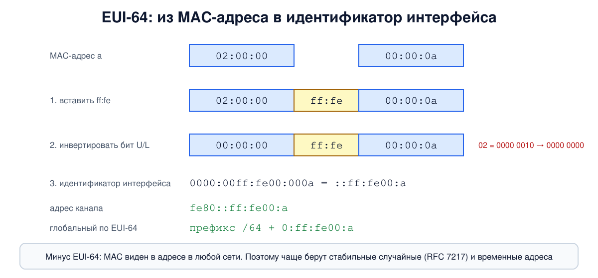
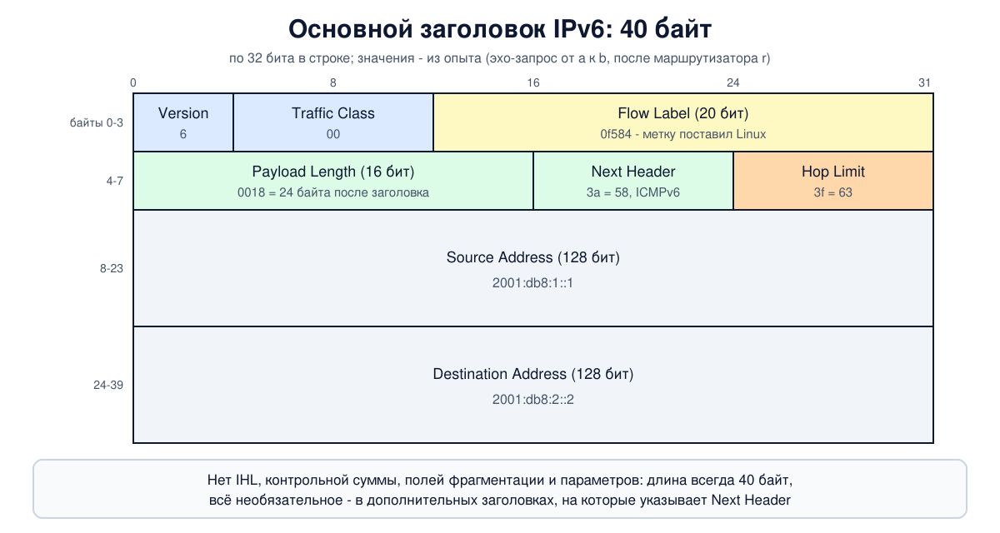

# Урок 30. IPv6: адреса и заголовок

Адреса IPv4 закончились (урок 23), и спасает их пока NAT. Настоящий выход, который готовили с начала 90-х, - новая версия протокола, IPv6. Сегодня это уже не экзотика: 28 марта 2026 года, по статистике Google, доля пользователей, заходящих к нему по IPv6, впервые перевалила за половину (пока в отдельные дни, в среднем чуть меньше половины). В этом уроке разберём, как устроены адреса IPv6, каких типов они бывают, почему у одного интерфейса их сразу несколько и чем заголовок IPv6 отличается от заголовка IPv4 (урок 25). В опыте соберём маленькую сеть IPv6, прочитаем заголовок по байтам и увидим, как в IPv6 работает фрагментация. Как узлы IPv6 находят соседей и сами получают адреса, - тема урока 31.

## Зачем понадобилась новая версия

Таненбаум рассказывает, что IETF начал работу над новой версией IP в 1990 году, предвидя нехватку адресов. Цели были шире, чем просто длинные адреса: сократить таблицы маршрутизации, упростить обработку пакетов маршрутизаторами, лучше поддержать безопасность, качество обслуживания и групповую рассылку, дать протоколу возможность развиваться дальше и сосуществовать со старым IPv4. Из нескольких предложений выбрали объединённый вариант Диринга и Фрэнсиса (SIPP) и назвали его IPv6. Олифер перечисляет похожие цели: масштабируемая адресация, автоматическая настройка, меньше работы маршрутизаторам, качество обслуживания и защита данных.

Первая спецификация вышла в 1995 году, основной стандарт - в 1998-м (RFC 2460); в 2017 году его заменил RFC 8200, и протокол получил статус полноценного стандарта интернета. Архитектура адресов - RFC 4291. IPv6 **несовместим** с IPv4: это отдельный протокол, и узел, знающий только IPv4, пакет IPv6 не поймёт. Поэтому переход идёт десятилетиями, а сети долго живут с обоими протоколами сразу (урок 31).

## Адрес: 128 бит и как их записывать

Адрес IPv6 занимает **16 байт** вместо 4. Всего таких адресов 2^128, примерно 3,4 × 10^38. Таненбаум видит в 128 битах решение главной задачи - практически неограниченный запас адресов. Олифер подчёркивает другое: цель была не только в количестве, длинный адрес позволяет строить удобную иерархию и настраивать адреса автоматически.

Записывают адрес **восемью группами по четыре шестнадцатеричные цифры** (по 16 бит), через двоеточие (урок 2 про шестнадцатеричную запись): `2001:0db8:0000:0000:0001:0000:0000:0001`. Сокращения:

1. **Ведущие нули** в группе можно опускать: `0db8` → `db8`, `0000` → `0`.
2. **Одну** подряд идущую цепочку нулевых групп можно заменить на `::`. Только одну: если бы `::` встречалось дважды, нельзя было бы понять, сколько нулей скрыто в каждом месте.

Отсюда путаница: один адрес можно записать по-разному. Поэтому в RFC 5952 (2010) договорились о **единой форме**: строчные буквы, ведущие нули опускать, `::` ставить на самую длинную цепочку нулей (при равной длине - на первую) и не заменять `::` одну-единственную нулевую группу. В опыте Python выведет эту форму: и `2001:0db8:0000:0000:0001:0000:0000:0001`, и `2001:db8:0:0:1::1` превращаются в `2001:db8::1:0:0:1`. Две цепочки нулей там одинаковой длины (по две группы), и `::` ставится на первую. Поэтому адреса в журналах и конфигурациях перед сравнением приводят к единой форме (или сравнивают как числа), а не сравнивают записи как есть.

Длина префикса пишется как в CIDR (урок 22): `2001:db8:1::/64`. Классов адресов в IPv6 нет. А в URL адрес берут в квадратные скобки, чтобы двоеточия не спутались с номером порта: `http://[2001:db8::1]:8080/`.

Все адреса в этом уроке - из блока `2001:db8::/32`, который RFC 3849 отвёл для документации, как `192.0.2.0/24` для IPv4.

## Структура глобального адреса: префикс и идентификатор интерфейса

Олифер показывает типичное деление глобального адреса:

| Поле | Длина | Кто задаёт |
|---|---|---|
| глобальный префикс маршрутизации | 48 бит (включая первые биты `001`) | регистратор и провайдер (урок 23) |
| идентификатор подсети | 16 бит | администратор сети |
| **идентификатор интерфейса** | **64 бита** | узел сам или администратор |

Первые 64 бита - аналог номера сети, по ним работает маршрутизация. Последние 64 бита - аналог номера узла, и их длина, в отличие от IPv4, **фиксирована**: обычная подсеть IPv6 - это почти всегда `/64` (RFC 4291 требует 64-битный идентификатор для всех индивидуальных адресов, кроме начинающихся с двоичного `000`; позже RFC 6164 разрешил `/127` на каналах между маршрутизаторами). На 16 битах идентификатора подсети организация может сделать 65 536 подсетей, каждую на 2^64 узлов. Маски для экономии адресов, как в уроке 22, теряют смысл, пишет Олифер, зато важно агрегирование: объединять подсети, чтобы таблицы маршрутизации оставались маленькими.

Длина глобального префикса на деле зависит от провайдера: организации часто получают `/48`, домашним абонентам выдают `/56`, `/60` или `/64`. А вот `/64` на подсеть - правило почти всегда.

## Откуда берётся идентификатор интерфейса

Олифер перечисляет способы: вручную, от DHCP-сервера, случайным числом или из MAC-адреса. Способ с MAC-адресом называется **EUI-64**, и его стоит разобрать, потому что в опыте его видно:



1. MAC-адрес (48 бит) делят пополам и вставляют между половинами `ff:fe`: из `02:00:00:00:00:0a` получается `02:00:00:ff:fe:00:00:0a`.
2. Инвертируют второй младший бит первого байта (`0x02`) - бит "локальный или глобальный" адрес из урока 15: `02` → `00`.
3. Получается идентификатор `0000:00ff:fe00:000a`, коротко `::ff:fe00:a`, и адрес канала `fe80::ff:fe00:a`.

Недостаток EUI-64 заметили давно: MAC-адрес виден в каждом адресе IPv6 и не меняется, когда устройство переходит из сети в сеть. По идентификатору интерфейса можно узнать производителя и следить за устройством в разных сетях. Поэтому сегодня чаще применяют:

- **стабильные случайные идентификаторы** (RFC 7217): для каждой сети свой, но постоянный, из MAC их не вывести. В опыте так настроен узел `b` (`stable-privacy`);
- **временные адреса** (RFC 8981): дополнительные случайные адреса, которые система меняет, например, раз в сутки и использует для исходящих соединений.

Windows и macOS по умолчанию применяют случайные идентификаторы. В Linux это зависит от настроек: само ядро по умолчанию берёт EUI-64 (как у узла `a` в опыте), а NetworkManager на настольных системах обычно включает `stable-privacy`.

## Типы адресов

Олифер, следуя RFC 4291, выделяет три типа:

- **Индивидуальный** (unicast) - один интерфейс.
- **Групповой** (multicast) - группа интерфейсов, пакет получают все участники. **Широковещательных адресов в IPv6 нет** совсем: их роль играют групповые.
- **Произвольной рассылки** (anycast) - группа интерфейсов, пакет получает один из них, обычно ближайший по мнению маршрутизации. По записи anycast-адрес не отличить от обычного индивидуального. Олифер пишет, что такой адрес можно назначать только маршрутизаторам; это ограничение было в старом стандарте, а в RFC 4291 (2006) его уже нет. Anycast сегодня широко используют, например, для корневых серверов DNS (блок 7).

Основные блоки:

| Блок | Что это | Аналог в IPv4 |
|---|---|---|
| `::/128` | неопределённый адрес: "адреса ещё нет" | `0.0.0.0` (уроки 21 и 29) |
| `::1/128` | петля, сам узел | `127.0.0.1` |
| `fe80::/10` | адреса канала (link-local) | `169.254.0.0/16` (урок 21) |
| `fc00::/7` | уникальные локальные (ULA), на деле `fd00::/8` | частные адреса (урок 23) |
| `ff00::/8` | групповые | `224.0.0.0/4` |
| `2000::/3` | глобальные индивидуальные | публичные адреса |
| `::ffff:0:0/96` | IPv4-адрес, отображённый в IPv6 (`::ffff:192.0.2.1`) | - |
| `2001:db8::/32` | для документации | `192.0.2.0/24` и др. |

Про некоторые записи в книгах - уточнения. Олифер пишет, что IANA оставила для использования только блок с первыми битами `001` (`2000::/3`), а большая часть глобальных адресов начинается с `2001::/16`. Первое верно: `2000::/3` - это 1/8 пространства, а остальное, кроме нескольких служебных блоков (`fe80::/10`, `fc00::/7`, `ff00::/8` и др.), в резерве, так что его "85%" - разумное округление. А второе устарело: регистраторы давно раздают адреса и из других частей `2000::/3`: адреса, начинающиеся с `2a00:`, `2400:`, `2600:`, встречаются постоянно. Таненбаум приводит запись `::192.31.20.46` - это старый вид "IPv4-совместимых" адресов, в RFC 4291 он объявлен устаревшим; для IPv4-адресов внутри IPv6 используют `::ffff:` (запись Олифера). ULA работают как частные адреса: во внешние сети они не маршрутизируются (RFC 4193).

**Адрес канала** (link-local, `fe80::`) есть у **каждого** интерфейса IPv6, даже если глобального адреса нет: его узел назначает себе сам сразу при включении. Олифер подчёркивает, что эти адреса не маршрутизируются: маршрутизатор не отправит пакет с таким адресом в другую сеть. Именно по адресам канала работают служебные протоколы: поиск соседей и маршрутизаторов (урок 31). Поскольку сеть `fe80::/64` есть на каждом интерфейсе, при обращении к адресу канала указывают интерфейс: `ping fe80::1%eth0`.

## Области действия и групповые адреса

Олифер называет важным новшеством **область действия** (scope): каждый адрес действует только в своей части сети. Адрес канала - в пределах одного канала, глобальный - во всём интернете. Узлы и маршрутизаторы это учитывают: узел выбирает адрес отправителя той же области действия, что и у получателя (Олифер формулирует это как запрет, в RFC 6724 это правило предпочтения), а маршрутизатор пакет с адресом канала в другую сеть не передаст.

У групповых адресов область действия записана прямо в адресе: `ffFS::...`, где `F` - флаги (у постоянных групп 0, поэтому они начинаются с `ff0`), а `S` - одна шестнадцатеричная цифра области: `1` - интерфейс, `2` - канал, `5` - площадка, `8` - организация, `e` - весь интернет. Самые нужные группы:

- `ff02::1` - все узлы канала. Олифер отмечает, что именно она заменяет широковещательный `255.255.255.255`;
- `ff02::2` - все маршрутизаторы канала;
- `ff02::1:ffXX:XXXX` - **группа запрашиваемого узла** (solicited-node). Её адрес строится из младших 24 бит индивидуального адреса, и интерфейс вступает в неё автоматически для каждого своего адреса.

Зачем последняя? В IPv4 ARP спрашивает "чей это адрес?" широковещательным кадром, и его обрабатывают все узлы сегмента (урок 24). В IPv6 такой же вопрос отправляют в группу запрашиваемого узла, куда почти наверняка входит только нужный узел. Групповые адреса IPv6 отображаются на MAC-адреса вида `33:33:xx:xx:xx:xx` (последние 32 бита группы), и сетевая карта остальных узлов обычно отсеет такой кадр, не беспокоя процессор. Подробно этот механизм разберём в уроке 31.

У Олифера в примере группы запрашиваемого узла (`FF02:0:0:0:1:FF54:3210`) пропущена одна нулевая группа: полностью это `ff02:0:0:0:0:1:ff54:3210`, коротко `ff02::1:ff54:3210`. А в примере EUI-64 идентификатор в тексте дважды напечатан как `...:FEEB:7960` вместо `...:FEEB:7E60`; верный вариант виден на его же рисунке. И про флаг постоянной группы у Олифера сказано наоборот: по RFC 4291 значение 0 означает постоянную группу (поэтому `ff02::1` начинается с `ff0`), а 1 - временную.

## Много адресов на одном интерфейсе

В IPv4 у интерфейса обычно один адрес. В IPv6 у него всегда несколько, и Олифер приводит типичный набор: адрес канала, один или несколько глобальных, петля, группы "все узлы" и группы запрашиваемого узла для каждого индивидуального адреса, плюс группы, в которые узел вступил сам. У маршрутизатора добавляются "все маршрутизаторы" и адреса произвольной рассылки. Какой из адресов выбрать отправителем в конкретном случае, решают правила RFC 6724 (Олифер ссылается на прежнюю версию, RFC 3484): например, к глобальному адресу получателя идут с глобального адреса, а не с адреса канала. В опыте весь набор будет виден.

## Заголовок IPv6

Основной заголовок IPv6 - **ровно 40 байт**, длина фиксирована.



- **Version** (4 бита) - 6.
- **Traffic Class** (8 бит) - класс трафика: то же, что DSCP и ECN в IPv4 (урок 25). У Таненбаума оно называется Differentiated services, и он отмечает, что младшие 2 бита тоже отведены под ECN.
- **Flow Label** (20 бит) - метка потока; у этого поля нет аналога в IPv4. Авторы описывают первоначальную идею по-разному: у Таненбаума поток заранее устанавливают с маршрутизаторами, у Олифера маршрутизатор сам запоминает метку после первого пакета на несколько секунд; в обоих случаях цель - обрабатывать пакеты потока быстрее или особо. На практике так её почти не применяют. Сегодняшние правила (RFC 6437, 2011): метку ставит отправитель, одинаковую для всех пакетов одного потока, а маршрутизаторы используют её, чтобы раскладывать потоки по параллельным путям, не заглядывая в заголовки TCP и UDP. Linux ставит метку сам (параметр `net.ipv6.auto_flowlabels`), в опыте её видно.
- **Payload Length** (16 бит) - длина **всего, что идёт после** 40-байтного заголовка: дополнительных заголовков и данных. В IPv4 поле Total Length включало и заголовок; Таненбаум замечает, что поэтому данных теперь помещается 65 535 байт, а не 65 515.
- **Next Header** (8 бит) - что идёт следом: дополнительный заголовок или протокол верхнего уровня. Коды те же, что в поле Protocol IPv4 (6 - TCP, 17 - UDP), а у ICMP для IPv6 свой код: **58** (ICMPv6).
- **Hop Limit** (8 бит) - число оставшихся шагов. Работает ровно как TTL в IPv4 (урок 25): каждый маршрутизатор вычитает 1, на нуле пакет уничтожается и отправителю уходит сообщение ICMPv6 "время истекло". Таненбаум объясняет: раз по времени TTL никто не считал, поле и назвали по тому, как им пользуются.
- **Source Address** и **Destination Address** - по 16 байт.

Таненбаум насчитывает в заголовке 7 полей против 13 у IPv4 (на рисунке их восемь, если адреса отправителя и получателя считать двумя полями). Важнее, **чего не стало**:

- **IHL** не нужно: длина заголовка всегда 40 байт.
- **Контрольной суммы заголовка нет.** Оба автора объясняют, что целостность и так проверяют канальный уровень (FCS в Ethernet, урок 15) и транспортный (TCP, UDP); Таненбаум добавляет, что пересчитывать сумму на каждом маршрутизаторе, когда меняется Hop Limit, дорого. Зато в IPv6 контрольная сумма UDP стала обязательной, кроме особых случаев с туннелями (в IPv4 её можно не считать), и она, как и у TCP и ICMPv6, охватывает адреса отправителя и получателя (блок 4).
- **Полей фрагментации** (Identification, флаги, смещение) в основном заголовке нет: они переехали в дополнительный заголовок и нужны редко.
- **Параметров (Options)** нет: их роль играют дополнительные заголовки.

## Дополнительные заголовки

Всё необязательное в IPv6 вынесено в **дополнительные заголовки** (extension headers). Они выстраиваются цепочкой между основным заголовком и данными, и каждый в своём поле Next Header указывает, что идёт после него:

| Код | Заголовок | Кто обрабатывает |
|---|---|---|
| 0 | Hop-by-Hop Options, транзитные параметры | узлы на пути (по RFC 8200 маршрутизатор читает их, только если так настроен) |
| 43 | Routing, маршрутизация | узлы, перечисленные в заголовке |
| 44 | Fragment, фрагментация | только получатель |
| 50 и 51 | ESP и AH, защита IPsec (блок 10) | только получатель |
| 60 | Destination Options, параметры для получателя | получатель (или узлы из заголовка Routing, если стоит перед ним) |

Порядок в пакете рекомендован стандартом (RFC 8200), и транзитные параметры, если есть, всегда идут первыми: они предназначены узлам на пути. Остальные заголовки маршрутизатор не трогает, и это одна из главных идей IPv6: для пересылки нужен только простой основной заголовок фиксированной длины.

У параметров внутри Hop-by-Hop и Destination Options оба автора отмечают полезную деталь: по старшим битам типа параметра узел, который этот параметр не понимает, знает, что делать - пропустить параметр или отбросить пакет (с сообщением ICMPv6 или без). Так протокол можно расширять, не ломая старые узлы. Пример параметра - **джамбограммы**: пакеты больше 65 535 байт для суперкомпьютерных сетей; тогда Payload Length равно 0, а настоящая длина лежит в 32-битном параметре.

**Фрагментация** в IPv6 устроена иначе, чем в уроке 27: **делить пакет может только отправитель**. Маршрутизатор слишком большой пакет не делит, а уничтожает и отвечает ICMPv6 "пакет слишком велик" (Packet Too Big) с нужным MTU. Отправитель запоминает MTU пути и, если приложение само не уменьшает пакеты, делит их, добавляя заголовок Fragment (код 44). Можно считать, что в IPv6 флаг DF стоит всегда. Минимальный MTU, который обязан пропускать любой канал IPv6, - **1280 байт** (в IPv4 - 68, а принимать узлы были обязаны пакеты в 576 байт). Раз без "пакет слишком велик" большие пакеты перестают проходить, запрещать это сообщение ICMPv6 нельзя - то же правило, что в уроке 28, только строже.

**Маршрутизация от источника.** Олифер пишет о широком применении заголовка маршрутизации, в котором отправитель задаёт список узлов на пути. В реальности первый вариант этого заголовка (тип 0) запретили в 2007 году (RFC 5095): им можно было заставить пакет многократно ходить между двумя узлами, усиливая трафик, а ещё он мешал фильтрации (RFC 4942). Сегодня используются только специальные типы для отдельных задач (например, мобильного IPv6 и сегментной маршрутизации в сетях операторов).

## Как это увидеть в Linux

Соберём цепочку `a` - `r` - `b`: два узла и маршрутизатор между ними, только на IPv6. У `a` зададим MAC `02:00:00:00:00:0a`, чтобы увидеть EUI-64, а у `b` включим стабильный случайный идентификатор. Участок `r` - `b` сделаем с MTU 1400, чтобы увидеть фрагментацию. Нужны Linux (подойдёт WSL2), права sudo, tcpdump и python3 (`sudo apt install tcpdump python3`); всё создаётся в пространствах имён `hbh-*` и в конце удаляется.

Создай файл `ipv6-lab.sh` и запусти `bash ipv6-lab.sh`:

```
set -u
for c in tcpdump python3; do
  command -v $c >/dev/null || { echo "нужен $c: sudo apt install $c"; exit 1; }
done
# убрать остатки прошлого запуска
for n in hbh-a hbh-r hbh-b; do sudo ip netns del $n 2>/dev/null; done
# a (2001:db8:1::1) - r - b (2001:db8:2::2); участок r - b с MTU 1400
for n in hbh-a hbh-r hbh-b; do sudo ip netns add $n; done
sudo ip link add eth0 netns hbh-a type veth peer name eth0 netns hbh-r
sudo ip link add eth1 netns hbh-r type veth peer name eth0 netns hbh-b
sudo ip netns exec hbh-a ip link set eth0 address 02:00:00:00:00:0a
sudo ip netns exec hbh-r ip link set eth0 address 02:00:00:00:00:01
sudo ip netns exec hbh-r ip link set eth1 address 02:00:00:00:00:02
sudo ip netns exec hbh-b ip link set eth0 address 02:00:00:00:00:0b
sudo ip netns exec hbh-r ip link set eth1 mtu 1400
sudo ip netns exec hbh-b ip link set eth0 mtu 1400
# у b идентификатор интерфейса не из MAC, а случайный стабильный (режим stable-privacy)
sudo ip netns exec hbh-b sysctl -qw net.ipv6.conf.eth0.addr_gen_mode=3
sudo ip netns exec hbh-r sysctl -qw net.ipv6.conf.all.forwarding=1
for n in hbh-a hbh-r hbh-b; do
  for i in $(sudo ip netns exec $n ls /sys/class/net); do sudo ip netns exec $n ip link set $i up; done
done
sudo ip netns exec hbh-a ip -6 addr add 2001:db8:1::1/64 dev eth0
sudo ip netns exec hbh-r ip -6 addr add 2001:db8:1::fe/64 dev eth0
sudo ip netns exec hbh-r ip -6 addr add 2001:db8:2::fe/64 dev eth1
sudo ip netns exec hbh-b ip -6 addr add 2001:db8:2::2/64 dev eth0
sudo ip netns exec hbh-a ip -6 route add default via 2001:db8:1::fe
sudo ip netns exec hbh-b ip -6 route add default via 2001:db8:2::fe
sleep 3
echo '--- 1. addresses of a (MAC 02:00:00:00:00:0a)'
sudo ip netns exec hbh-a ip -6 addr show dev eth0 | grep inet6
echo '--- 2. addresses of b (stable-privacy)'
sudo ip netns exec hbh-b ip -6 addr show dev eth0 | grep inet6
echo '--- 3. multicast groups of a'
sudo ip netns exec hbh-a ip maddr show dev eth0 | grep -E 'link|inet6'
echo '--- 4. the same address, three ways to write it'
python3 -c '
import ipaddress
for s in ["2001:0db8:0000:0000:0001:0000:0000:0001", "2001:db8:0:0:1::1", "fe80::ff:fe00:a"]:
    a = ipaddress.IPv6Address(s)
    print(s, "->", a.compressed, "| full:", a.exploded)
'
d=$(mktemp -d)
sudo ip netns exec hbh-b timeout 4 tcpdump -i eth0 -n -x -c 1 'icmp6 and ip6[40] = 128' 2>/dev/null > "$d/hdr" &
sleep 1
echo '--- 5. ping from a to b through r'
sudo ip netns exec hbh-a ping -6 -c 1 -s 16 2001:db8:2::2 | grep -E 'bytes from|packets'
wait
echo '--- 6. the IPv6 header as b received it'
cat "$d/hdr"
sudo ip netns exec hbh-a timeout 6 tcpdump -i eth0 -n -v -l 'ip6 and not icmp6[0] = 135 and not icmp6[0] = 136' 2>/dev/null > "$d/big" &
sleep 1
echo '--- 7. a big ping (1450 bytes of data) over the 1400-byte link'
sudo ip netns exec hbh-a ping -6 -c 2 -i 1 -s 1450 2001:db8:2::2 | grep -E 'bytes from|Packet too big|mtu|packets'
wait
echo '--- 8. what a sent and received during step 7'
grep -E 'frag|too big|echo|IP6 \(' "$d/big" | sed -E 's/^[0-9:.]+ //'
echo '--- 9. path MTU that a remembered'
sudo ip netns exec hbh-a ip -6 route get 2001:db8:2::2
echo '--- cleanup'
for n in hbh-a hbh-r hbh-b; do sudo ip netns del $n; done
rm -rf "$d"
ip netns list | grep -cE '^hbh-(a|r|b)( |$)'
```

Вот что получилось на нашем сервере (в более новых версиях `ip` и tcpdump вывод немного отличается: например, `ip` дописывает `proto kernel_ll`):

```
--- 1. addresses of a (MAC 02:00:00:00:00:0a)
    inet6 2001:db8:1::1/64 scope global 
    inet6 fe80::ff:fe00:a/64 scope link 
--- 2. addresses of b (stable-privacy)
    inet6 2001:db8:2::2/64 scope global 
    inet6 fe80::4f09:5562:6072:6f78/64 scope link stable-privacy 
--- 3. multicast groups of a
	link  33:33:00:00:00:01
	link  01:00:5e:00:00:01
	link  33:33:ff:00:00:0a
	link  33:33:ff:00:00:01
	inet6 ff02::1:ff00:1
	inet6 ff02::1:ff00:a
	inet6 ff02::1
	inet6 ff01::1
--- 4. the same address, three ways to write it
2001:0db8:0000:0000:0001:0000:0000:0001 -> 2001:db8::1:0:0:1 | full: 2001:0db8:0000:0000:0001:0000:0000:0001
2001:db8:0:0:1::1 -> 2001:db8::1:0:0:1 | full: 2001:0db8:0000:0000:0001:0000:0000:0001
fe80::ff:fe00:a -> fe80::ff:fe00:a | full: fe80:0000:0000:0000:0000:00ff:fe00:000a
--- 5. ping from a to b through r
24 bytes from 2001:db8:2::2: icmp_seq=1 ttl=63 time=0.149 ms
1 packets transmitted, 1 received, 0% packet loss, time 0ms
--- 6. the IPv6 header as b received it
16:50:06.560718 IP6 2001:db8:1::1 > 2001:db8:2::2: ICMP6, echo request, id 20682, seq 1, length 24
	0x0000:  6000 f584 0018 3a3f 2001 0db8 0001 0000
	0x0010:  0000 0000 0000 0001 2001 0db8 0002 0000
	0x0020:  0000 0000 0000 0002 8000 ee84 50ca 0001
	0x0030:  3eec bb6a 0000 0000 e28d 0800 0000 0000
--- 7. a big ping (1450 bytes of data) over the 1400-byte link
From 2001:db8:1::fe icmp_seq=1 Packet too big: mtu=1400
1458 bytes from 2001:db8:2::2: icmp_seq=2 ttl=63 time=0.114 ms
2 packets transmitted, 1 received, +1 errors, 50% packet loss, time 1004ms
--- 8. what a sent and received during step 7
IP6 (flowlabel 0x0f584, hlim 64, next-header ICMPv6 (58) payload length: 1458) 2001:db8:1::1 > 2001:db8:2::2: [icmp6 sum ok] ICMP6, echo request, id 20690, seq 1
IP6 (flowlabel 0x7351e, hlim 64, next-header ICMPv6 (58) payload length: 1240) 2001:db8:1::fe > 2001:db8:1::1: [icmp6 sum ok] ICMP6, packet too big, mtu 1400
IP6 (hlim 255, next-header ICMPv6 (58) payload length: 16) fe80::ff:fe00:a > ff02::2: [icmp6 sum ok] ICMP6, router solicitation, length 16
IP6 (flowlabel 0x0f584, hlim 64, next-header Fragment (44) payload length: 1360) 2001:db8:1::1 > 2001:db8:2::2: frag (0x1a6dfd4f:0|1352) ICMP6, echo request, id 20690, seq 2
IP6 (flowlabel 0x0f584, hlim 64, next-header Fragment (44) payload length: 114) 2001:db8:1::1 > 2001:db8:2::2: frag (0x1a6dfd4f:1352|106)
IP6 (flowlabel 0x47e45, hlim 63, next-header Fragment (44) payload length: 1360) 2001:db8:2::2 > 2001:db8:1::1: frag (0x18df1052:0|1352) ICMP6, echo reply, id 20690, seq 2
IP6 (flowlabel 0x47e45, hlim 63, next-header Fragment (44) payload length: 114) 2001:db8:2::2 > 2001:db8:1::1: frag (0x18df1052:1352|106)
--- 9. path MTU that a remembered
2001:db8:2::2 from :: via 2001:db8:1::fe dev eth0 src 2001:db8:1::1 metric 1024 expires 594sec mtu 1400 pref medium
--- cleanup
0
```

Разберём по шагам.

- **Шаг 1: адреса `a`.** Глобальный `2001:db8:1::1/64` (`scope global`) мы задали сами. А `fe80::ff:fe00:a/64` (`scope link`) узел назначил себе сам, как только интерфейс включился: это EUI-64 из MAC `02:00:00:00:00:0a`, ровно как на картинке выше.
- **Шаг 2: адреса `b`.** Адрес канала `b` выглядит случайным, и ядро пометило его `stable-privacy`: MAC `02:00:00:00:00:0b` по нему не узнать. У тебя эти цифры будут другими: они зависят от секрета, который ядро выбирает случайно.
- **Шаг 3: группы `a`.** Внизу - группы IPv6: `ff01::1` и `ff02::1` (все узлы на интерфейсе и в канале), `ff02::1:ff00:a` и `ff02::1:ff00:1` - группы запрашиваемого узла для адреса канала (оканчивается на `00:a`) и глобального адреса (оканчивается на `00:1`). Вверху - соответствующие им MAC-адреса: `33:33:00:00:00:01` для `ff02::1`, `33:33:ff:00:00:0a` и `33:33:ff:00:00:01` для групп запрашиваемого узла. Строка `01:00:5e:00:00:01` - из IPv4: это группа всех узлов IPv4 `224.0.0.1` (саму строку с этим адресом отсёк наш `grep`). Ядро вступает в неё на каждом интерфейсе, даже если адреса IPv4 на нём нет.
- **Шаг 4: запись адреса.** Полная запись и запись с сокращениями дают одну и ту же единую форму `2001:db8::1:0:0:1`: `::` стоит на первой из двух одинаковых цепочек нулей. Адрес канала `a` в полной записи показывает все 128 бит.
- **Шаг 5: ping.** В выводе ping стоит `ttl=63`, хотя в IPv6 это поле называется Hop Limit: `b` ответил с 64, а `r` вычел единицу.
- **Шаг 6: заголовок по байтам.** tcpdump показывает пакет, начиная с заголовка IPv6. Первые 40 байт:
  - `6` - версия; `00` - Traffic Class; `0f584` - метка потока (Linux поставил её сам);
  - `0018` - Payload Length, 24 байта: 8 байт заголовка ICMPv6 и 16 байт данных (`-s 16`);
  - `3a` - Next Header, 58, то есть ICMPv6; `3f` - Hop Limit, 63: пакет вышел из `a` с 64 и прошёл `r`;
  - дальше два адреса по 16 байт: `2001 0db8 0001 0000 0000 0000 0000 0001` и `2001 0db8 0002 ... 0002`.
  - Сразу после адресов начинается ICMPv6: `80` - тип 128, эхо-запрос. Контрольной суммы заголовка IP нигде нет.
- **Шаг 7: большой ping.** 1450 байт данных + 8 байт ICMPv6 + 40 байт заголовка = 1498 байт, а на участке `r` - `b` помещается только 1400. Первый пакет `r` уничтожил и ответил `Packet too big: mtu=1400`. Второй дошёл, и ответ пришёл (`1458 bytes from`).
- **Шаг 8: что было в проводе.**
  - Первый эхо-запрос целиком, `payload length: 1458`, `next-header ICMPv6 (58)`.
  - Ответ `r`: `packet too big, mtu 1400`. Его длина 1240 + 40 = 1280 байт, минимальный MTU IPv6: в сообщение об ошибке вкладывают столько исходного пакета, сколько помещается в 1280 байт.
  - `router solicitation` от адреса канала `a` к `ff02::2` - `a` спрашивает, есть ли в канале маршрутизаторы. Это тема урока 31, здесь просто совпало по времени.
  - Второй эхо-запрос уже разделён **самим `a`**: `next-header Fragment (44)`, два фрагмента. Запись `frag (0x1a6dfd4f:0|1352)` - идентификатор, смещение 0 и 1352 байта данных; второй фрагмент - со смещения 1352, 106 байт. Всего 1352 + 106 = 1458, как в первом пакете. Первый фрагмент - 40 + 8 (заголовок Fragment) + 1352 = 1400 байт, ровно MTU.
  - Ответ `b` тоже пришёл двумя фрагментами: у `b` MTU интерфейса 1400, и большой ответ он разделил сам ещё до отправки. Hop Limit у ответа 63: его уменьшил `r`, а фрагментировать его `r` не пришлось.
  - Метка потока одинакова у всех пакетов от `a` к `b` (`0x0f584`), и даже у ping из шага 6, хотя это был другой запуск. Для пингов и других сокетов без соединения ядро вычисляет метку как хеш адресов, протокола и портов (у ICMP вместо портов - тип и код, у всех эхо-запросов они одинаковы, а идентификатор ping в хеш не входит), поэтому у всех пингов от `a` к `b` метка одна. У TCP метка - случайное число на каждое соединение. Хеш зависит и от случайного секрета ядра, так что у тебя значения будут другими. У пакетов от `b` к `a` метка своя.
- **Шаг 9: запомненный MTU.** `ip -6 route get` показывает `mtu 1400` для пути к `b` и срок `expires 594sec`: через 10 минут `a` снова попробует большие пакеты (так же, как в уроке 27 для IPv4).
- В конце `0`: пространства имён удалены.

## Что это значит для безопасности

В программе у этого урока нет отдельной темы ИБ, но несколько следствий нового устройства адресов и заголовка стоит знать уже сейчас.

- **Приватность адреса.** Адреса EUI-64 выдают MAC и позволяют узнавать устройство в разных сетях. На клиентских устройствах используют стабильные случайные идентификаторы и временные адреса, на серверах - понятные адреса, заданные администратором.
- **Большая подсеть - не защита.** В подсети `/64` 2^64 адресов, перебрать их вслепую нереально. Но адреса утекают другими путями: через DNS, журналы, предсказуемые схемы (`::1`, `::2`, EUI-64 известных производителей). Защищают узел межсетевой экран и отключение лишних служб, а не размер подсети.
- **NAT в IPv6 обычно нет**, и каждый узел может иметь глобальный адрес. Защита от входящих соединений - межсетевой экран с отслеживанием соединений (блок 6, уроки 51 и 55; почему NAT не защита - урок 56), а не отсутствие адреса.
- **IPv6 уже включён.** Современные системы включают IPv6 по умолчанию, даже если администратор считает сеть "только IPv4". Правила межсетевого экрана нужно писать для обоих протоколов (в Linux - в nftables с семейством `inet` или отдельно в ip6tables, уроки 53 и 54), иначе IPv6 окажется открытой дверью. Подробнее - в уроке 31.
- **ICMPv6 нельзя закрывать целиком.** Без него не работают поиск соседей (урок 31) и поиск MTU пути, и это жёстче, чем в IPv4 (урок 28). Какие сообщения пропускать, рекомендует RFC 4890.
- **Дополнительные заголовки.** Межсетевой экран должен уметь пройти всю цепочку, чтобы найти настоящий протокол и порты. Пакеты с устаревшим заголовком маршрутизации типа 0 отбрасывают, а фрагменты обрабатывают так же осторожно, как в уроке 27 (в IPv6 все заголовки, включая заголовок TCP или UDP, обязаны быть в первом фрагменте, RFC 7112).

## Итог

- IPv6 - новая версия IP со 128-битными адресами, несовместимая с IPv4. Стандарт 1998 года, действующее описание - RFC 8200, адреса - RFC 4291.
- Адрес записывают восемью группами по 16 бит; ведущие нули опускают, одну цепочку нулей заменяют на `::`; единая форма - по RFC 5952.
- Обычная подсеть - `/64`: первые 64 бита для маршрутизации, последние 64 - идентификатор интерфейса (EUI-64 из MAC, стабильный случайный или временный).
- Типы адресов: индивидуальные (глобальные `2000::/3`, канала `fe80::/10`, ULA `fd00::/8`), групповые `ff00::/8` и произвольной рассылки. Широковещания нет, его заменяют группы, например `ff02::1` и группы запрашиваемого узла.
- У интерфейса всегда несколько адресов, и у каждого своя область действия.
- Основной заголовок - 40 байт и 8 полей: без контрольной суммы, IHL и полей фрагментации; Hop Limit вместо TTL, Next Header вместо Protocol.
- Необязательное вынесено в дополнительные заголовки; фрагментирует только отправитель, маршрутизатор присылает "пакет слишком велик"; минимальный MTU - 1280 байт.

## Что почитать

- Олифер, "Компьютерные сети", глава 17, с. 540-553: цели IPv6, адресация, типы адресов, EUI-64, групповые адреса, набор адресов интерфейса, формат пакета и дополнительные заголовки.
- Таненбаум, "Компьютерные сети", раздел 5.7.3, с. 519-529: история IPv6, основной заголовок, запись адресов, дополнительные заголовки и споры вокруг них.
- RFC 8200 (протокол IPv6), RFC 4291 (архитектура адресов), RFC 5952 (запись адресов).
