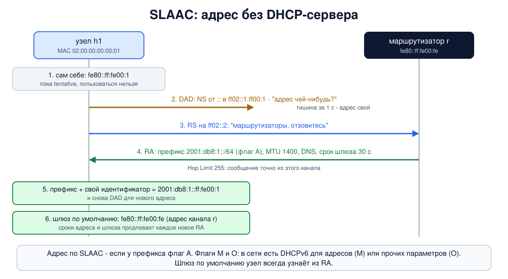

# Урок 31. IPv6: поиск соседей, автонастройка и жизнь рядом с IPv4

В уроке 30 мы задавали адреса IPv6 руками и видели, что адрес канала узел назначает себе сам. Но как узел получает глобальный адрес, шлюз и DNS-сервер, если руками их никто не задал? И как, не имея ARP, узнаёт MAC-адрес соседа? В IPv6 обе задачи решает один протокол - **Neighbor Discovery** (ND), поиск соседей, построенный на ICMPv6. В опыте мы запустим маршрутизатор, который рассылает объявления, и увидим, как узлы сами получают адреса, как ищут соседей и как проверяют, не занят ли адрес. А в конце разберём, как IPv6 уживается с IPv4 и какие риски это создаёт.

## ICMPv6: больше, чем ICMP

Олифер начинает с того, что IPv6 не работает без вспомогательных протоколов. В IPv4 эту роль играли ARP, ICMP, DHCP. В IPv6 одни из них лишь подправили, другие заменили, и главная замена - протокол **обнаружения соседей** (ND, сейчас RFC 4861; Олифер ссылается на прежний RFC 2461). Он взял на себя работу ARP (урок 24), поиска маршрутизаторов и Redirect из ICMP (урок 28).

Все сообщения ND - это сообщения **ICMPv6** (RFC 4443, Next Header 58, урок 30). Поэтому ICMPv6 играет в IPv6 куда большую роль, чем ICMP в IPv4, пишет Олифер. Остальное в ICMPv6 похоже на старый ICMP: те же две группы - ошибки и информационные сообщения (эхо, а теперь и сообщения ND), но номера типов другие, и есть новые сообщения, например "пакет слишком велик" (Packet Too Big, урок 30).

Задачи ND по Олиферу:

- **разрешение адресов** - по IP-адресу соседа узнать его MAC, как ARP;
- **поиск маршрутизаторов** и выбор маршрутизатора по умолчанию;
- передача узлам **параметров канала**: MTU, Hop Limit по умолчанию, префиксы;
- **автонастройка адресов**;
- **обнаружение дубликатов адресов**;
- **перенаправление** (Redirect).

## Пять сообщений ND

| Тип | Сообщение | Кто, кому | Зачем |
|---|---|---|---|
| 133 | Router Solicitation (RS), запрос маршрутизатора | узел → `ff02::2`, все маршрутизаторы | "есть тут маршрутизаторы? ответьте сейчас" |
| 134 | Router Advertisement (RA), объявление маршрутизатора | маршрутизатор → `ff02::1` время от времени или в ответ на RS | префиксы, MTU, шлюз, DNS, флаги |
| 135 | Neighbor Solicitation (NS), запрос соседа | узел → группа запрашиваемого узла; при проверке доступности - прямо соседу | узнать MAC соседа, проверить доступность, проверить дубликат адреса |
| 136 | Neighbor Advertisement (NA), объявление соседа | ответ на NS или по своей инициативе | "этот адрес мой, вот мой MAC" |
| 137 | Redirect | маршрутизатор → узел | как в IPv4: "для этого получателя есть шлюз получше" |

Параметры сообщений (префикс, MAC-адрес, MTU и т. д.) передаются в **опциях** того же вида "тип - длина - значение", что и в дополнительных заголовках, только длина считается в блоках по 8 байт, включая поля типа и длины.

Одна важная деталь, которую Олифер подчёркивает: все сообщения ND отправляются с **Hop Limit = 255**, и получатель отбрасывает сообщение, если значение меньше. Маршрутизатор уменьшил бы 255 до 254, поэтому сообщение со значением 255 точно пришло из того же канала, а не снаружи. Так ND защищён от поддельных сообщений **из других сетей**. Но от соседа по тому же каналу эта проверка не защищает; к этому вернёмся в разделе о безопасности.

Про объявление маршрутизатора у Олифера есть неточность. Приоритет маршрутизатора (RFC 4191) кодируется двумя битами: `01` - высокий, `00` - средний, `11` - низкий, `10` - зарезервировано. У Олифера `00` указан дважды, в том числе как "маршрутизатор вообще не может быть использован" в этом качестве. На деле маршрутизатор отказывается быть шлюзом по умолчанию иначе: объявляет **Router Lifetime = 0**.

## Разрешение адресов: вместо ARP

Узел `A` хочет отправить пакет соседу `B` и знает его IPv6-адрес, но не MAC. В IPv4 он спросил бы широковещательно (урок 24). В IPv6:

1. `A` отправляет **Neighbor Solicitation** в **группу запрашиваемого узла** `B`: `ff02::1:ff` плюс младшие 24 бита адреса `B` (урок 30). В кадре Ethernet адрес получателя - соответствующий групповой MAC `33:33:ff:xx:xx:xx`. В сообщении есть и MAC самого `A`.
2. Этот кадр принимают только узлы, вступившие в эту группу, то есть почти наверняка только `B`. Остальные сетевые карты его отбросят, не беспокоя процессор.
3. `B` отвечает **Neighbor Advertisement** прямо `A` (адрес `A` он теперь знает), со своим MAC-адресом.
4. `A` записывает пару в **таблицу соседей** - тот же `ip neigh` из урока 24, с теми же состояниями `REACHABLE`, `STALE` и др.

У Олифера в описании этого обмена в одном месте сказано, что `B` отвечает "на индивидуальный адрес узла Б"; по смыслу и на его же рисунке ответ идёт узлу `A`.

## Автонастройка адреса: SLAAC

Олифер называет развитую автонастройку одним из самых полезных свойств IPv6 (с. 542). Автонастройка без сервера (SLAAC, Stateless Address Autoconfiguration, RFC 4862) идёт так:



1. **Адрес канала.** При включении интерфейса узел сам назначает себе адрес `fe80::` + идентификатор интерфейса (урок 30).
2. **Проверка дубликата** (DAD, Duplicate Address Detection). Пока адрес не проверен, он **предварительный** (tentative): им нельзя пользоваться. Узел отправляет NS "кто владеет этим адресом?" **с неопределённого адреса `::`** (своего адреса ещё нет) в группу запрашиваемого узла для этого адреса. Если за секунду никто не ответил, адрес свой. Если кто-то ответил NA, адрес занят, и узел им не пользуется.
3. **Поиск маршрутизатора.** Узел отправляет RS на `ff02::2`, маршрутизатор отвечает RA (а кроме того рассылает RA сам время от времени).
4. **Глобальный адрес.** В RA есть **префикс** (для SLAAC в Ethernet - ровно `/64`: префикс и 64-битный идентификатор должны вместе дать 128 бит) с флагом `A` ("автономная настройка разрешена"). Узел добавляет к нему свой идентификатор интерфейса, снова проверяет адрес на дубликат, и адрес готов.
5. **Шлюз и остальное.** Отправитель RA, если он объявил ненулевой Router Lifetime, становится **маршрутизатором по умолчанию**, причём по его **адресу канала**: в таблице маршрутов шлюз выглядит как `fe80::...`. Из RA же узел берёт MTU канала, Hop Limit по умолчанию и, если есть, адреса **DNS-серверов** (опция RDNSS, RFC 8106).

У каждого адреса из RA два срока: **предпочтительный** (preferred lifetime) - пока им можно начинать новые соединения, и **действительный** (valid lifetime) - пока он вообще работает. Маршрутизатор продлевает их каждым новым объявлением. Это похоже на аренду в DHCP (урок 29), только продлевает сам маршрутизатор, рассылая RA. На этом построены и **временные адреса** (RFC 8981, урок 30): узел заводит к префиксу дополнительный случайный адрес с коротким предпочтительным сроком и время от времени меняет его на новый.

## DHCPv6

DHCP для IPv6 тоже есть (DHCPv6, сейчас RFC 8415). Работает он поверх UDP, порты 546 (клиент) и 547 (сервер), а сервер клиент ищет по групповому адресу `ff02::1:2`: широковещания ведь нет. Кто чем занимается, решают флаги в RA:

- строить ли адрес самому, решает флаг `A` у **префикса**: есть флаг - узел делает адрес по SLAAC;
- флаг `M` (Managed) сообщает, что в сети есть DHCPv6-сервер, который выдаёт **адреса** (так называемый stateful-режим);
- флаг `O` (Other) сообщает, что у DHCPv6 можно получить **прочие параметры**, например DNS-серверы.

Флаги независимы: при `M` и `A` сразу у узла могут быть оба адреса, и от SLAAC, и от DHCPv6 (если ОС вообще запрашивает адреса по DHCPv6).

Одна важная особенность: **шлюз по умолчанию DHCPv6 не раздаёт**, его узел всегда узнаёт из RA. Поэтому маршрутизатор с RA нужен в любой сети IPv6, где узлы настраиваются автоматически. А ещё DHCPv6 умеет раздавать не только адреса, но и целые **префиксы** (prefix delegation): так домашний роутер получает у провайдера, например, `/56` и нарезает из него `/64` для своих сетей. Поддержка DHCPv6 в ОС разная: например, Android отдельные адреса по DHCPv6 не получает, их он строит по SLAAC, а с 2025 года умеет запрашивать по DHCPv6 целый префикс `/64` для себя.

## Как это увидеть в Linux

Соберём сеть: маршрутизатор `r` с программой **radvd**, которая рассылает объявления маршрутизатора, и три узла за коммутатором (мостом): `h1` в обычном режиме (идентификатор из MAC), `h2` со стабильным случайным идентификатором и временными адресами, `h3` с защитной настройкой сервера: **не принимать RA** (`accept_ra=0`). Утилита `rdisc6` из пакета ndisc6 отправит запрос маршрутизатора и расшифрует ответ. Нужны Linux (подойдёт WSL2), права sudo и пакеты `radvd`, `ndisc6` и `tcpdump` (`sudo apt install radvd ndisc6 tcpdump`; после установки служба radvd может попытаться запуститься на твоём компьютере, её лучше выключить: `sudo systemctl disable --now radvd`). Всё создаётся в пространствах имён `hbh-*` и в конце удаляется.

Создай файл `nd-lab.sh` и запусти `bash nd-lab.sh`:

```
set -u
for c in radvd rdisc6 tcpdump; do
  command -v $c >/dev/null || { echo "нужен $c: sudo apt install radvd ndisc6 tcpdump"; exit 1; }
done
# убрать остатки прошлого запуска
for n in hbh-r hbh-sw hbh-h1 hbh-h2 hbh-h3; do
  sudo ip netns pids $n 2>/dev/null | xargs -r sudo kill
  sudo ip netns del $n 2>/dev/null
done
d=$(mktemp -d)
chmod 755 "$d"
# маршрутизатор r и три узла за коммутатором (мост в hbh-sw)
for n in hbh-r hbh-sw hbh-h1 hbh-h2 hbh-h3; do sudo ip netns add $n; done
sudo ip netns exec hbh-sw ip link add br0 type bridge
i=0
for n in hbh-r hbh-h1 hbh-h2 hbh-h3; do
  sudo ip link add eth0 netns $n type veth peer name p$i netns hbh-sw
  sudo ip netns exec hbh-sw ip link set p$i master br0
  i=$((i+1))
done
sudo ip netns exec hbh-r ip link set eth0 address 02:00:00:00:00:fe
sudo ip netns exec hbh-h1 ip link set eth0 address 02:00:00:00:00:01
sudo ip netns exec hbh-h2 ip link set eth0 address 02:00:00:00:00:02
sudo ip netns exec hbh-h3 ip link set eth0 address 02:00:00:00:00:03
# h1 - как есть (адрес из MAC); h2 - стабильный случайный адрес и временные адреса;
# h3 - защитная настройка сервера: объявления маршрутизаторов не принимать
sudo ip netns exec hbh-h2 sysctl -qw net.ipv6.conf.eth0.addr_gen_mode=3 net.ipv6.conf.eth0.use_tempaddr=2
sudo ip netns exec hbh-h3 sysctl -qw net.ipv6.conf.eth0.accept_ra=0
sudo ip netns exec hbh-r sysctl -qw net.ipv6.conf.all.forwarding=1
for n in hbh-r hbh-sw hbh-h1 hbh-h2 hbh-h3; do
  for l in $(sudo ip netns exec $n ls /sys/class/net); do sudo ip netns exec $n ip link set $l up; done
done
sudo ip netns exec hbh-r ip -6 addr add 2001:db8:1::1/64 dev eth0
# что маршрутизатор объявляет: префикс для автонастройки, MTU и DNS-сервер
cat > "$d/radvd.conf" <<EOF
interface eth0 {
  AdvSendAdvert on;
  MinRtrAdvInterval 3;
  MaxRtrAdvInterval 10;
  AdvLinkMTU 1400;
  prefix 2001:db8:1::/64 {
    AdvOnLink on;
    AdvAutonomous on;
    AdvValidLifetime 3600;
    AdvPreferredLifetime 1800;
  };
  RDNSS 2001:db8:1::53 {
    AdvRDNSSLifetime 30;
  };
};
EOF
sleep 2
echo '--- 1. h1 before the router speaks'
sudo ip netns exec hbh-h1 ip -6 addr show dev eth0 | grep inet6
sudo ip netns exec hbh-h1 ip -6 route show default | grep -c default
sudo ip netns exec hbh-r radvd -C "$d/radvd.conf" -p "$d/radvd.pid" -m logfile -l "$d/radvd.log"
sleep 1
echo '--- 2. h1 asks for routers (rdisc6 sends a Router Solicitation)'
sudo ip netns exec hbh-h1 rdisc6 -1 eth0 | grep -vE '^$|Soliciting'
sleep 4
echo '--- 3. h1 after the Router Advertisement'
sudo ip netns exec hbh-h1 ip -6 addr show dev eth0 | grep -A1 inet6
sudo ip netns exec hbh-h1 ip -6 route show | grep -vE '^(fe80|multicast)'
echo '--- 4. h2: stable-privacy and a temporary address'
sudo ip netns exec hbh-h2 ip -6 addr show dev eth0 | grep inet6
echo '--- 5. h3 with accept_ra=0'
sudo ip netns exec hbh-h3 ip -6 addr show dev eth0 | grep inet6
sudo ip netns exec hbh-h3 ip -6 route show default | grep -c default
echo '--- 6. neighbor discovery: h2 pings h1'
g1=$(sudo ip netns exec hbh-h1 ip -6 -o addr show dev eth0 scope global | awk '{print $4}' | cut -d/ -f1)
sudo ip netns exec hbh-h2 timeout 5 tcpdump -i eth0 -n -e -l -v 'icmp6 and (ip6[40] = 135 or ip6[40] = 136)' 2>/dev/null > "$d/nd" &
sleep 1
sudo ip netns exec hbh-h2 ping -6 -c 1 "$g1" | grep -E 'bytes from'
sleep 4
grep -E 'neighbor (solicitation|advertisement)|hlim|flags \[' "$d/nd" | sed -E 's/^[0-9:.]+ //; s/, length [0-9]+//'
sudo ip netns exec hbh-h2 ip -6 neigh show dev eth0 | grep -v fe80 | grep "$g1"
echo '--- 7. duplicate address detection: h3 tries to take the address of h1'
sudo ip netns exec hbh-h3 timeout 4 tcpdump -i eth0 -n -l 'icmp6 and (ip6[40] = 135 or ip6[40] = 136)' 2>/dev/null > "$d/dad" &
sleep 1
sudo ip netns exec hbh-h3 ip -6 addr add "$g1/64" dev eth0
sleep 3
sed -E 's/^[0-9:.]+ //; s/, length [0-9]+//' "$d/dad"
sudo ip netns exec hbh-h3 ip -6 addr show dev eth0 | grep "$g1"
echo '--- cleanup'
for n in hbh-r hbh-sw hbh-h1 hbh-h2 hbh-h3; do
  sudo ip netns pids $n 2>/dev/null | xargs -r sudo kill
  sudo ip netns del $n
done
rm -rf "$d"
ip netns list | grep -cE '^hbh-(r|sw|h1|h2|h3)( |$)'
```

Вот что получилось на нашем сервере (в новых версиях `ip` к адресам добавляются пометки `proto kernel_ll` и `proto kernel_ra`):

```
--- 1. h1 before the router speaks
    inet6 fe80::ff:fe00:1/64 scope link 
0
--- 2. h1 asks for routers (rdisc6 sends a Router Solicitation)
Hop limit                 :           64 (      0x40)
Stateful address conf.    :           No
Stateful other conf.      :           No
Mobile home agent         :           No
Router preference         :       medium
Neighbor discovery proxy  :           No
Router lifetime           :           30 (0x0000001e) seconds
Reachable time            :  unspecified (0x00000000)
Retransmit time           :  unspecified (0x00000000)
 Prefix                   : 2001:db8:1::/64
  On-link                 :          Yes
  Autonomous address conf.:          Yes
  Valid time              :         3600 (0x00000e10) seconds
  Pref. time              :         1800 (0x00000708) seconds
 Recursive DNS server     : 2001:db8:1::53
  DNS server lifetime     :           30 (0x0000001e) seconds
 MTU                      :         1400 bytes (valid)
 Source link-layer address: 02:00:00:00:00:FE
 from fe80::ff:fe00:fe
--- 3. h1 after the Router Advertisement
    inet6 2001:db8:1::ff:fe00:1/64 scope global dynamic mngtmpaddr 
       valid_lft 3596sec preferred_lft 1796sec
    inet6 fe80::ff:fe00:1/64 scope link 
       valid_lft forever preferred_lft forever
2001:db8:1::/64 dev eth0 proto kernel metric 256 expires 3595sec pref medium
default via fe80::ff:fe00:fe dev eth0 proto ra metric 1024 expires 25sec mtu 1400 hoplimit 64 pref medium
--- 4. h2: stable-privacy and a temporary address
    inet6 2001:db8:1:0:3b1:ca62:d55d:4a50/64 scope global temporary dynamic 
    inet6 2001:db8:1:0:3998:708b:6219:17b4/64 scope global dynamic mngtmpaddr stable-privacy 
    inet6 fe80::1d64:7769:4386:c5e7/64 scope link stable-privacy 
--- 5. h3 with accept_ra=0
    inet6 fe80::ff:fe00:3/64 scope link 
0
--- 6. neighbor discovery: h2 pings h1
64 bytes from 2001:db8:1::ff:fe00:1: icmp_seq=1 ttl=64 time=0.119 ms
02:00:00:00:00:02 > 33:33:ff:00:00:01, ethertype IPv6 (0x86dd): (hlim 255, next-header ICMPv6 (58) payload length: 32) 2001:db8:1:0:3b1:ca62:d55d:4a50 > ff02::1:ff00:1: [icmp6 sum ok] ICMP6, neighbor solicitation, length 32, who has 2001:db8:1::ff:fe00:1
02:00:00:00:00:01 > 02:00:00:00:00:02, ethertype IPv6 (0x86dd): (hlim 255, next-header ICMPv6 (58) payload length: 32) 2001:db8:1::ff:fe00:1 > 2001:db8:1:0:3b1:ca62:d55d:4a50: [icmp6 sum ok] ICMP6, neighbor advertisement, length 32, tgt is 2001:db8:1::ff:fe00:1, Flags [solicited, override]
2001:db8:1::ff:fe00:1 lladdr 02:00:00:00:00:01 REACHABLE 
--- 7. duplicate address detection: h3 tries to take the address of h1
IP6 :: > ff02::1:ff00:1: ICMP6, neighbor solicitation, who has 2001:db8:1::ff:fe00:1
IP6 2001:db8:1::ff:fe00:1 > ff02::1: ICMP6, neighbor advertisement, tgt is 2001:db8:1::ff:fe00:1

    inet6 2001:db8:1::ff:fe00:1/64 scope global dadfailed tentative 
--- cleanup
0
```

Разберём по шагам.

- **Шаг 1: до объявлений.** У `h1` только адрес канала `fe80::ff:fe00:1` (EUI-64 из MAC `02:00:00:00:00:01`, урок 30) и нет маршрута по умолчанию (`0`).
- **Шаг 2: объявление маршрутизатора**, как его расшифровал `rdisc6`:
  - `Stateful address conf.: No` и `Stateful other conf.: No` - флаги `M` и `O` сброшены: DHCPv6 не нужен, только SLAAC;
  - `Router preference: medium` - приоритет по умолчанию; `Router lifetime: 30` - сколько секунд считать `r` шлюзом по умолчанию, если объявления прекратятся (radvd по умолчанию берёт утроенный наибольший интервал между объявлениями, у нас 3 × 10);
  - `Hop limit: 64` - какое значение ставить в своих пакетах;
  - `Prefix: 2001:db8:1::/64` с `On-link: Yes` (эта сеть доступна напрямую, без шлюза) и `Autonomous address conf.: Yes` (флаг `A`: адрес можно построить самому); сроки 3600 и 1800 секунд;
  - `Recursive DNS server: 2001:db8:1::53` - опция RDNSS; `MTU: 1400`; `Source link-layer address` - MAC маршрутизатора, чтобы узлу не пришлось его отдельно спрашивать;
  - `from fe80::ff:fe00:fe` - RA всегда отправляют с адреса канала.
- **Шаг 3: `h1` после объявления.**
  - Появился глобальный адрес `2001:db8:1::ff:fe00:1`: префикс из RA плюс тот же идентификатор из MAC. Пометки: `dynamic` - получен автоматически и имеет срок (`valid_lft` и `preferred_lft` - оставшиеся секунды из 3600 и 1800); `mngtmpaddr` - от этого адреса ядро будет делать временные адреса, если их включить.
  - Маршрут `2001:db8:1::/64` - к подсети, её узлы доступны напрямую.
  - Маршрут по умолчанию `via fe80::ff:fe00:fe` - шлюз по **адресу канала** `r`, `proto ra` - получен из объявления, `expires 25sec` - срок из Router lifetime, который продлит следующее RA; `mtu 1400` и `hoplimit 64` - тоже из объявления.
  - DNS-сервер ядро само не настраивает: его забирает программа, управляющая сетью (systemd-networkd, NetworkManager).
- **Шаг 4: `h2`.** Здесь три адреса. Адрес канала и основной глобальный адрес с пометкой `stable-privacy` (из MAC не выводится, урок 30), и ещё **временный** (`temporary`) со своим случайным идентификатором. У тебя цифры будут другими.
- **Шаг 5: `h3`.** С `accept_ra=0` узел объявления игнорирует: только адрес канала и нет маршрута по умолчанию (`0`). Так настраивают серверы со статическими адресами, чтобы их конфигурацию не менял никто, кроме администратора.
- **Шаг 6: поиск соседа.** `h2` пингует глобальный адрес `h1`, а tcpdump на `h2` показывает два сообщения ND.
  - Запрос соседа (`neighbor solicitation ... who has 2001:db8:1::ff:fe00:1`) ушёл на IPv6-адрес `ff02::1:ff00:1` - группу запрашиваемого узла для адреса `h1` - и на MAC `33:33:ff:00:00:01`. Не широковещательно.
  - Ответ (`neighbor advertisement ... tgt is 2001:db8:1::ff:fe00:1`) пришёл уже **напрямую** на MAC `h2`. Флаги: `solicited` - это ответ на запрос, `override` - обновить запись, если она есть.
  - У обоих сообщений `hlim 255`: признак того, что они не прошли через маршрутизатор.
  - Запрос `h2` отправил со своего **временного** адреса. Запрос соседа берёт адрес отправителя из пакета, который его вызвал (RFC 4861), то есть из ping. А ping ушёл с временного адреса, потому что у `h2` включено `use_tempaddr=2` - "предпочитать временные адреса" (правило 7 в RFC 6724). В самом ядре Linux по умолчанию это выключено (0), но многие дистрибутивы включают своими настройками: в Ubuntu 24.04 файл `/etc/sysctl.d/10-ipv6-privacy.conf` ставит `use_tempaddr = 2`. У `h1` в опыте временных адресов нет, потому что новое пространство имён получает значения ядра по умолчанию, а не настройки системы.
  - Последняя строка - запись в таблице соседей `h2`: адрес `h1`, его MAC `02:00:00:00:00:01` и состояние `REACHABLE`.
- **Шаг 7: проверка дубликата.** Мы попробовали вручную назначить `h3` адрес, который уже есть у `h1`.
  - `h3` отправил запрос соседа **с адреса `::`** ("своего адреса у меня пока нет") в группу запрашиваемого узла для этого адреса.
  - `h1` ответил объявлением на `ff02::1`, всем узлам канала: адрес отправителя запроса неизвестен, поэтому ответ рассылается всем.
  - Итог у `h3` - пометка `dadfailed tentative`: адрес занят, и ядро им не пользуется. Конфликта адресов, как бывает в IPv4 при ручной настройке, не случилось.
- В конце `0`: пространства имён удалены.

## Жизнь рядом с IPv4

IPv6 несовместим с IPv4, а заменить весь интернет за одну ночь невозможно. Олифер разбирает общие способы связать сети с разными протоколами - двойной стек, трансляцию и туннелирование - и то, как они применяются к IPv4 и IPv6.

**Двойной стек** (dual stack). У узла работают оба протокола сразу, с двумя наборами настроек: адреса, шлюзы и DNS-серверы для каждого. С узлами IPv6 он говорит по IPv6, со старыми - по IPv4. Это сегодня основной способ, и почти все ОС поддерживают его давно. Когда у сайта есть оба адреса (записи DNS `A` и `AAAA`, блок 7), программа выбирает, каким воспользоваться. По правилам RFC 6724 IPv6 обычно предпочтительнее. А чтобы плохо работающий IPv6 не заставлял пользователя ждать, браузеры применяют алгоритм **Happy Eyeballs** (RFC 8305, первая версия - RFC 6555). Олифер описывает его как "отправить запросы по обоим адресам и выбрать тот, что ответил быстрее"; точнее так: программа сначала пробует IPv6, и если соединение не установилось за короткое время (рекомендуется около 250 мс), параллельно пробует IPv4 и работает по тому, что соединится первым.

**Туннелирование.** Пакеты IPv6 целиком кладут в поле данных пакетов IPv4 и везут через сеть, которая IPv6 не знает. При прямой упаковке (6in4, 6to4) в заголовке IPv4 такой пакет помечается **Protocol = 41**. На концах туннеля стоят устройства с двумя стеками: одно упаковывает, другое извлекает (Олифер показывает схемы "маршрутизатор - маршрутизатор" и "узел - маршрутизатор"). Туннели бывают настроенными вручную (Олифер приводит в пример GRE; у GRE в заголовке IPv4 Protocol = 47) и автоматическими; Олифер упоминает автоматический 6to4 с префиксом `2002::/16`. Он работал ненадёжно: его вариант с общим anycast-адресом ретрансляторов в 2015 году упразднили (RFC 7526), а на узлах (не маршрутизаторах) 6to4 обязаны держать выключенным по умолчанию; сам префикс `2002::/16` не упразднён. Туннели вообще - тема блока 10.

**Трансляция.** Когда узлу, у которого есть только IPv6, нужно поговорить с узлом, у которого есть только IPv4, между ними ставят переводчик. Самый распространённый - **NAT64** (RFC 6146) вместе с **DNS64** (RFC 6147):

1. Узел спрашивает DNS-сервер об адресе IPv6 сайта, у которого есть только IPv4.
2. DNS64 сам "синтезирует" ответ: приклеивает адрес IPv4 к особому префиксу `64:ff9b::/96` (RFC 6052), например `64:ff9b::192.0.2.1`.
3. Узел шлёт пакет IPv6 на этот адрес, маршрутизация приводит его к шлюзу NAT64.
4. Шлюз переводит заголовок IPv6 в IPv4, подставляет свой IPv4-адрес и порт (как NAT из урока 56) и запоминает соответствие, чтобы перевести ответ обратно.

У Олифера в этом примере есть опечатки: на рисунке 17.19 префикс записан как `64:ff9d::`, а адрес шлюза `203.0.113.1` местами превратился в `2003.0.113.1`, чего в IPv4 не бывает. Мобильные операторы часто строят сети только на IPv6 и добавляют к NAT64 ещё один шаг - **464XLAT** (RFC 6877): телефон сам переводит пакеты IPv4 от старых программ в IPv6, а на выходе из сети оператора NAT64 переводит их обратно.

Олифер пишет и о стратегиях: ничего не менять и жить на NAT, строить сеть только на IPv6 или переходить постепенно, сохраняя IPv4. Самой взвешенной многие эксперты, по его словам, считают последнюю, и в каждой части сети применяют свой способ.

## Безопасность: поддельные объявления и утечки мимо туннеля

Разберём два риска на уровне принципа и защиты.

**Поддельные объявления маршрутизатора.** Узел верит любому RA из своего канала: проверка Hop Limit = 255 отсекает только чужие сети. Поэтому устройство в той же сети, которое начнёт рассылать свои объявления, может стать для соседей шлюзом по умолчанию или раздать им свои DNS-серверы, - принцип тот же, что у чужого DHCP-сервера (урок 29). Часто это происходит без злого умысла: например, компьютер с включённой раздачей интернета начинает объявлять себя маршрутизатором. Причём это касается и сетей, которые администратор считает "только IPv4": IPv6 на узлах включён по умолчанию и слушает RA. Защита:

- **RA Guard** на коммутаторе (RFC 6105): объявления маршрутизатора разрешены только с портов, где стоят настоящие маршрутизаторы, как доверенные порты у DHCP snooping. У неё есть ограничения (RFC 7113 разбирает, почему её реализации должны уметь разбирать всю цепочку дополнительных заголовков), поэтому её дополняют другими мерами;
- аналоги защит из урока 29 для IPv6: отслеживание ND и DHCPv6 на коммутаторе, проверка адреса отправителя на порту;
- на серверах со статической настройкой - **`accept_ra=0`**, как у `h3` в опыте; если IPv6 на узле не нужен, его выключают осознанно, а не оставляют без присмотра;
- **SEND** (Secure Neighbor Discovery, RFC 3971) подписывает сообщения ND, но на практике почти не применяется;
- наблюдение: RA от неизвестных адресов - повод для тревоги.

**Утечки трафика мимо VPN через IPv6.** Принцип: если VPN-клиент заворачивает в туннель только IPv4, а на компьютере работает и IPv6, то соединения к сайтам с адресами IPv6 пойдут напрямую, мимо туннеля, - двойной стек сам выберет IPv6 (выше). Для корпоративного VPN это значит, что часть трафика не проходит через защиту компании; для пользователя - что его настоящий адрес виден сайтам. Та же проблема бывает с DNS: запросы могут уйти к DNS-серверу из RA, а не к тому, что задан в туннеле. Защита:

- VPN-клиент должен обрабатывать **оба протокола**: либо везти IPv6 через туннель, либо на время соединения запрещать IPv6 вне туннеля;
- правила межсетевого экрана, которые на время VPN разрешают трафик только в туннель, - для обоих протоколов (о межсетевых экранах в Linux - блок 6);
- DNS-серверы внутри туннеля и запрет запросов мимо него (утечки DNS разберём в уроке 67);
- проверка после настройки: на тестовой странице или по журналам убедиться, что наружу видны только адреса туннеля.

## Итог

- В IPv6 нет ARP: соседей ищет протокол Neighbor Discovery на сообщениях ICMPv6 (RS, RA, NS, NA, Redirect). Все они идут с Hop Limit 255, чтобы отсечь сообщения из других сетей.
- MAC соседа узнают запросом NS в группу запрашиваемого узла, а не широковещанием; ответ NA приходит напрямую.
- Автонастройка SLAAC: адрес канала → проверка дубликата с адреса `::` → RS/RA → глобальный адрес из префикса и своего идентификатора. Шлюз - отправитель RA, по адресу канала.
- Адрес по SLAAC узел строит, если у префикса есть флаг `A`; флаги `M` и `O` сообщают, что DHCPv6 выдаёт адреса или прочие параметры. DHCPv6 умеет делегировать префиксы, но шлюз не раздаёт.
- С IPv4 живут через двойной стек (с Happy Eyeballs), туннели (прямая упаковка - Protocol 41) и трансляцию (NAT64 и DNS64, 464XLAT).
- Риски: поддельные RA (защита - RA Guard, `accept_ra=0` на серверах, наблюдение) и утечки мимо VPN через IPv6 (защита - обрабатывать оба протокола и DNS).

## Что почитать

- Олифер, "Компьютерные сети", глава 17, с. 554-571: протокол обнаружения соседей и ICMPv6, проверка дубликата, разрешение адресов, двойной стек, туннелирование и трансляция, NAT64.
- RFC 4861 (Neighbor Discovery), RFC 4862 (SLAAC), RFC 8415 (DHCPv6), RFC 8305 (Happy Eyeballs).
