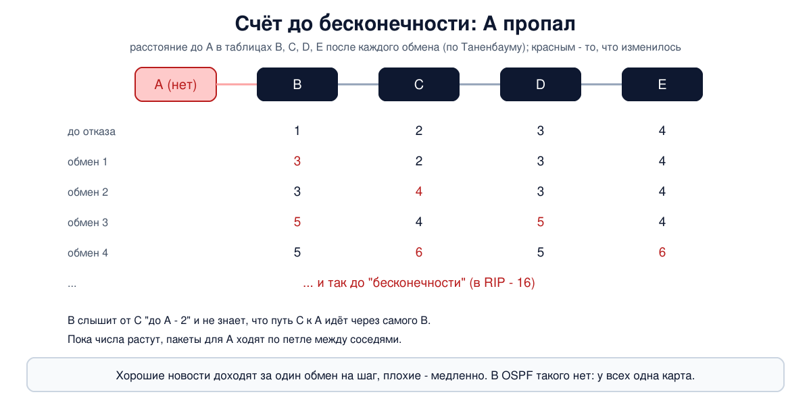

# Урок 32. Протоколы маршрутизации: RIP и OSPF

В уроке 26 маршруты в таблицу мы вписывали руками. В сети из трёх маршрутизаторов это терпимо, а в сети из сотни - нет: каждый отказ линии пришлось бы исправлять вручную на всех устройствах. Эту работу делают **протоколы маршрутизации**: маршрутизаторы сами рассказывают друг другу о сетях и сами пересчитывают пути, когда что-то ломается. Разберём два главных подхода - вектор расстояний (RIP) и состояние связей (OSPF), соберём кольцо из четырёх маршрутизаторов и посмотрим, как они находят пути, делят нагрузку и переживают отказ линии. А в конце - почему маршрутизаторам нельзя верить всем подряд.

## Статическая и динамическая маршрутизация

Олифер делит маршрутизацию на **статическую** и **адаптивную** (динамическую).

- При **статической** записи вводит администратор, и живут они бессрочно. Изменилась сеть - администратор должен срочно поправить таблицы, иначе они рассогласуются. Так мы делали в уроке 26.
- При **адаптивной** записи создают протоколы маршрутизации. Они собирают сведения о сети, и у записей есть **время жизни**: если протокол перестал подтверждать маршрут, тот считается нерабочим.

Задача протокола - сделать таблицы на всех маршрутизаторах **согласованными**: чтобы пакет из любой сети дошёл до любой другой за конечное число шагов, без петель. Пока после изменения таблицы снова не согласовались, в сети бывают петли и "чёрные дыры"; время до нового согласия называют **временем схождения** (конвергенции).

Протоколы бывают **централизованными** (один сервер маршрутов считает таблицы для всех) и **распределёнными** (каждый маршрутизатор считает сам по сведениям от соседей). Олифер отмечает, что централизованный подход даёт лучшие маршруты, но плохо масштабируется, поэтому в интернете царят распределённые протоколы. Они делятся на два семейства:

| | Вектор расстояний (distance vector) | Состояние связей (link state) |
|---|---|---|
| Что рассказывает маршрутизатор | "до сети X мне столько-то" | "вот мои соседи и стоимость связи с каждым" |
| Кому | только соседям | всем маршрутизаторам области (лавиной) |
| Что знает маршрутизатор | только расстояния и следующий шаг | полную карту сети (граф) |
| Как считает путь | берёт лучшее из предложений соседей | сам, алгоритмом Дейкстры по карте |
| Пример | RIP | OSPF, IS-IS |

И ещё одно деление, о котором пишет Таненбаум: протоколы **внутри одной организации** (IGP - Interior Gateway Protocol: RIP, OSPF, IS-IS) и протокол **между организациями** (BGP, урок 33). Первые ищут самый короткий путь, второй выполняет политику: кому через кого можно ходить.

## Вектор расстояний и RIP

Идея, по Таненбауму, восходит к алгоритму Беллмана - Форда. Каждый маршрутизатор время от времени отправляет соседям свой **вектор**: список всех известных ему сетей с расстоянием до каждой. Получив вектор от соседа, маршрутизатор прибавляет расстояние до самого соседа и сравнивает: если через этого соседа до какой-то сети ближе, чем было, запись меняется, а сосед становится **следующим шагом** (next hop). Постепенно каждый узнаёт обо всех сетях.

**RIP** (Routing Information Protocol) - самый известный такой протокол. Основное по Олиферу и стандарту (RIPv2 - RFC 2453):

- **метрика** - число шагов (hop count): сколько маршрутизаторов пройти до сети. Стандарт разрешает и другие метрики, но на практике почти всегда считают шаги;
- сообщения ходят в **UDP, порт 520**; RIPv2 рассылает их на групповой адрес `224.0.0.9`;
- вектор рассылается **каждые 30 секунд**; если маршрут не подтверждался **180 секунд** (шесть периодов - запас на потерю сообщений, ведь UDP ничего не гарантирует), он считается недействительным;
- **16 - это бесконечность**: сеть с метрикой 16 недоступна. Поэтому RIP годится только для сетей, где путь не длиннее 15 маршрутизаторов;
- **RIPv1** не передаёт маски (подходит только для классовых сетей или подсетей одной длины, уроки 21-22), **RIPv2** передаёт маску и умеет проверять подлинность сообщений.

Олифер подробно разбирает на примере четырёх маршрутизаторов, как из минимальных таблиц (только свои сети) после нескольких обменов складываются полные. Важное правило RIP: новая запись заменяет старую, только если она **лучше**, а при равенстве остаётся пришедшая первой. Исключение - если хуже стало у того же соседа, от которого пришла текущая запись: ему приходится верить. Так в классическом RIP; современные реализации, например BIRD, умеют ставить все равные пути сразу (ECMP) - увидим в опыте.

### Счёт до бесконечности

Слабость вектора расстояний хорошо объясняет Таненбаум: **хорошие новости распространяются быстро, плохие - медленно**. Представим цепочку `A - B - C - D - E`, и `A` пропал. `B` больше не слышит `A`, но `C` сообщает: "у меня до `A` два шага". `B` не знает, что путь `C` к `A` проходит через самого `B`, и записывает: "до `A` три шага через `C`". Затем `C` видит у `B` тройку и ставит себе четыре... Расстояние растёт на единицу за обмен, и пакеты всё это время ходят по петле между `B` и `C`. Олифер на своём примере насчитывает, что без хитростей такая неразбериха длилась бы 36 минут. Именно поэтому "бесконечность" в RIP такая маленькая: счёт до 16 заканчивается быстро.



Против этого придуманы приёмы (Олифер подробно описывает расщепление горизонта, мгновенные обновления и замораживание, а отравленный обратный маршрут упоминает Таненбаум; все они есть в RFC 2453, кроме замораживания):

- **Расщепление горизонта** (split horizon): не сообщать соседу о маршруте, который узнал от него же. Надёжно лечит петлю из двух маршрутизаторов.
- **Отравленный обратный маршрут** (poisoned reverse): сообщать, но с метрикой 16 - "через меня туда не ходи". Мы увидим это в опыте.
- **Мгновенные обновления** (triggered updates): при изменении метрики рассылать новость сразу, не дожидаясь 30 секунд, а следующие такие обновления - не чаще раза в 1-5 секунд, чтобы не перегружать сеть.
- **Замораживание** (hold-down, есть не во всех реализациях): какое-то время не принимать новых сведений о сети, которая только что пропала, чтобы до маршрутизатора не успели дойти устаревшие вести.

Таненбаум оценивает эти приёмы строже и называет эвристики на практике бесполезными, потому что маршрутизатор не может узнать, не лежит ли он сам на предлагаемом пути. Противоречия тут нет: Олифер тоже пишет, что расщепление горизонта не помогает, если петлю образуют три маршрутизатора и больше. Приёмы сокращают число и длительность петель, но не исключают их совсем. Поэтому в больших сетях RIP уступил место протоколам состояния связей.

## Состояние связей и OSPF

Таненбаум излагает идею **маршрутизации по состоянию связей** пятью шагами. Каждый маршрутизатор должен:

1. **Узнать соседей** - разослать по всем линиям сообщения **Hello**.
2. **Оценить стоимость** связи с каждым соседом, обычно обратно пропорционально скорости линии.
3. **Составить пакет** о состоянии своих связей: кто мои соседи и сколько стоит связь с каждым (LSA, Link State Advertisement).
4. **Разослать пакет всем** маршрутизаторам лавиной (flooding) и принять их пакеты. Транзитные маршрутизаторы передают LSA **не меняя**, пишет Олифер, поэтому у всех оказывается одна и та же карта. Чтобы старые копии не путали картину, в LSA есть порядковый номер и возраст.
5. **Посчитать кратчайшие пути** по полученной карте **алгоритмом Дейкстры** и занести в таблицу только первый шаг каждого пути.

Главное отличие от вектора расстояний: сведения приходят **из первых рук**. Никто не пересказывает чужие расстояния, каждый описывает только свои связи, а путь каждый считает сам. Поэтому схождение быстрое, а счёта до бесконечности нет. Цена - больше памяти и вычислений, и Олифер отмечает, что сложность быстро растёт с размером сети.

**OSPF** (Open Shortest Path First) - главный протокол этого типа. IETF начал работу над ним в 1988 году, стандартом он стал в 1990-м, пишет Таненбаум, а действующая версия для IPv4 - OSPFv2, RFC 2328 (для IPv6 есть OSPFv3). Основное:

- сообщения OSPF едут **прямо в IP** с номером протокола **89** (урок 25), без UDP и TCP; Hello и обновления рассылаются на групповой адрес `224.0.0.5` (все маршрутизаторы OSPF), а в общих сетях обновления для DR и BDR - на `224.0.0.6`;
- **Hello** по умолчанию каждые **10 секунд**; если соседа не слышно **40 секунд** (dead interval), он считается пропавшим, и об этом рассылается новое LSA. Если ничего не меняется, LSA не рассылаются, но раз в **30 минут** каждый маршрутизатор заново рассылает свои LSA (RFC 2328; Олифер пишет об обмене всей базой, что неточно);
- **стоимость** (cost) задаёт администратор; стандарт значения по умолчанию не определяет. У многих производителей она по умолчанию обратно пропорциональна скорости: эталонная скорость (обычно 100 Мбит/с) делённая на скорость линии, а в BIRD по умолчанию просто 10 на любом интерфейсе (так в опыте). По этой формуле получаются значения у Олифера: Ethernet 10 Мбит/с - 10, Fast Ethernet - 1. Стоимость относится к **выходу** интерфейса: в каждом направлении линии своя. На гигабитных линиях получится тоже 1, поэтому, как советует Олифер, для быстрых сетей эталон поднимают;
- путь с наименьшей **суммой** стоимостей побеждает; у Олифера пример: два канала T1 по 65 выгоднее прямого канала 56 Кбит/с со стоимостью 1785;
- если путей с равной стоимостью несколько, OSPF ставит **все** и делит между ними трафик (ECMP, Equal-Cost Multi-Path);
- пять типов сообщений (Таненбаум): Hello, Database Description (что у меня есть), Link State Request (пришли недостающее), Link State Update (вот LSA), Link State Ack (получил).

Олифер пишет ещё, что OSPF строит отдельные таблицы для разных битов TOS (задержка, пропускная способность, надёжность). Это устарело: Таненбаум объясняет, что поле TOS в OSPF так и не использовали и убрали; в RFC 2328 маршрутизации по TOS больше нет.

**Соседи и смежность.** На линиях "точка - точка" каждые два соседа обмениваются картами напрямую. А в общей сети (Ethernet с несколькими маршрутизаторами) обмен "каждый с каждым" расточителен. Поэтому маршрутизаторы выбирают **назначенный маршрутизатор** (DR, Designated Router) и резервный (BDR): остальные устанавливают полный обмен (смежность, adjacency) только с ними, а DR представляет общую сеть на карте как отдельный узел, пишет Таненбаум.

**Области.** Чтобы карта не разрасталась, большую сеть делят на **области** (areas). Внутри области у всех одна карта, а наружу пограничный маршрутизатор области (ABR) сообщает только список сетей и стоимость до них, без подробной топологии. Все области соединяются через **магистральную область 0** (backbone): трафик между областями идёт по схеме "звезда" - к магистрали, по ней и в нужную область. Область с единственным выходом можно сделать **тупиковой** (stub): ей хватит маршрута по умолчанию. **Пограничный маршрутизатор автономной системы** (ASBR) приносит маршруты извне, например из BGP (урок 33).

**IS-IS** работает по тем же принципам. Таненбаум пишет, что различий между ним и OSPF почти нет; OSPF чаще встречается в сетях организаций, IS-IS - у провайдеров.

В книгах есть и неточности. У Таненбаума сказано, что RIP "в мае 1979 года был заменён протоколом состояния каналов"; на самом деле в 1979 году сменили алгоритм в сети ARPANET, а RIP как протокол интернета описан позже (RFC 1058, 1988) и в небольших сетях жив до сих пор. У Олифера в примере с несколькими протоколами опечатка: маршрутизатор 1 общается по OSPF с маршрутизатором 3, а не 2.

## Когда протоколов несколько

На одном маршрутизаторе могут работать несколько протоколов сразу, и о какой-то сети могут сообщить двое. Метрики разных протоколов несравнимы (шаги RIP и стоимость OSPF - разные величины), поэтому у каждого протокола есть **приоритет доверия** (в уроке 26 мы говорили: сначала сравнивают доверие, потом метрику). Олифер отмечает, что обычно предпочитают протоколы состояния связей, как знающие о сети больше. Числа у производителей свои: у Cisco это "административное расстояние", где меньше - лучше (OSPF 110, RIP 120), а в BIRD, который мы используем в опыте, это "preference", где больше - лучше (OSPF 150, RIP 120). Смысл один: OSPF побеждает RIP.

## Как это увидеть в Linux

В Linux маршруты по протоколам ведёт отдельная программа, которая записывает их в таблицу ядра. Мы возьмём **BIRD** - её используют и в крупных точках обмена трафиком. Соберём кольцо из четырёх маршрутизаторов `r1` - `r2` - `r3` - `r4` - `r1`, у каждого - своя локальная сеть `lan0` (`198.51.100.0/26`, `.64/26`, `.128/26`, `.192/26`), а линии между ними - сети `/30` из `192.0.2.0/24`. Сначала запустим RIP, потом OSPF, поменяем стоимость линии, "тихо" сломаем линию и подключим маршрутизатор с неверным ключом. Нужны Linux (подойдёт WSL2), права sudo и пакеты `bird2` и `tcpdump` (`sudo apt install bird2 tcpdump`; после установки служба bird может запуститься на твоём компьютере, и если ты ею не пользуешься, её лучше выключить: `sudo systemctl disable --now bird`). Всё создаётся в пространствах имён `hbh-*` и в конце удаляется. Скрипт идёт около полутора минут.

Hello в опыте раз в 5 секунд (по умолчанию 10), чтобы не ждать долго, а dead interval - 20 секунд. Чаще, чем раз в 5 секунд, BIRD с криптографической проверкой подлинности в OSPFv2 ставить не советует: при чтении настроек предупреждает, что это облегчает повтор старых пакетов.

Создай файл `routing-lab.sh` и запусти `bash routing-lab.sh`:

```
set -u
for c in bird birdc tcpdump tc; do
  command -v $c >/dev/null || { echo "нужен $c: sudo apt install bird2 tcpdump iproute2"; exit 1; }
done
R="hbh-r1 hbh-r2 hbh-r3 hbh-r4 hbh-r5"
# убрать остатки прошлого запуска
for n in $R; do
  sudo ip netns pids $n 2>/dev/null | xargs -r sudo kill
  sudo ip netns del $n 2>/dev/null
done
d=$(mktemp -d)
chmod 755 "$d"
# кольцо r1 - r2 - r3 - r4 - r1, у каждого своя локальная сеть lan0
for n in $R; do sudo ip netns add $n; done
link() { sudo ip link add $2 netns $1 type veth peer name $4 netns $3; }
addr() { sudo ip netns exec $1 ip addr add $3 dev $2; }
link hbh-r1 eth0 hbh-r2 eth1; addr hbh-r1 eth0 192.0.2.1/30;  addr hbh-r2 eth1 192.0.2.2/30
link hbh-r2 eth0 hbh-r3 eth1; addr hbh-r2 eth0 192.0.2.5/30;  addr hbh-r3 eth1 192.0.2.6/30
link hbh-r3 eth0 hbh-r4 eth1; addr hbh-r3 eth0 192.0.2.9/30;  addr hbh-r4 eth1 192.0.2.10/30
link hbh-r4 eth0 hbh-r1 eth1; addr hbh-r4 eth0 192.0.2.13/30; addr hbh-r1 eth1 192.0.2.14/30
link hbh-r1 eth2 hbh-r5 eth0; addr hbh-r1 eth2 192.0.2.17/30; addr hbh-r5 eth0 192.0.2.18/30
for k in 1 2 3 4; do
  sudo ip netns exec hbh-r$k ip link add lan0 type dummy
  addr hbh-r$k lan0 198.51.100.$(( (k-1)*64 + 1 ))/26
done
for n in $R; do
  for l in $(sudo ip netns exec $n ls /sys/class/net); do sudo ip netns exec $n ip link set $l up; done
  sudo ip netns exec $n sysctl -qw net.ipv4.ip_forward=1
done
bc() { sudo ip netns exec $1 birdc -s "$d/$1.ctl" "$2" | sed 1d; }
start() { sudo ip netns exec $1 bird -c "$d/$1.conf" -s "$d/$1.ctl" -P "$d/$1.pid"; }
stop() { for n in $*; do sudo kill $(cat "$d/$n.pid"); done; sleep 1; }
# общая часть настройки BIRD: журнал, свои сети, запись маршрутов в ядро
common() {
cat <<EOF
log "$d/hbh-r$1.log" all;
router id 0.0.0.$1;
protocol device { }
protocol direct { ipv4; interface "lan0"; }
protocol kernel { ipv4 { import none; export all; }; }
EOF
}
# OSPF: канал точка-точка, стоимость, Hello каждые 5 с (по умолчанию 10), проверка подлинности
ospf() {
cat <<EOF
protocol ospf v2 {
  ipv4 { import all; export all; };
  ecmp yes;
  area 0 {
    interface "lan0" { stub yes; };
    interface "$2" {
      type ptp; cost $3; hello 5; dead 20;
      authentication cryptographic;
      password "$4" { id 1; algorithm hmac sha256; };
    };
    interface "eth*" {
      type ptp; cost 10; hello 5; dead 20;
      authentication cryptographic;
      password "$4" { id 1; algorithm hmac sha256; };
    };
  };
}
EOF
}

echo '=== PART 1: RIP'
for k in 1 2 3 4; do
  { common $k; cat <<EOF
protocol rip {
  ipv4 { import all; export all; };
  interface "eth0", "eth1" { update time 5; };
}
EOF
  } > "$d/hbh-r$k.conf"
done
for k in 1 2 3 4; do start hbh-r$k; done
sleep 8
# ловим очередное периодическое обновление от r2, когда всё уже сошлось
sudo ip netns exec hbh-r1 timeout 7 tcpdump -i eth0 -n -v -c 1 'udp port 520 and src 192.0.2.2' 2>/dev/null > "$d/rip"

echo '--- 1. routes of r1 learned by RIP'
bc hbh-r1 'show route protocol rip1'
echo '--- 2. one RIP message from r2 to r1'
sed -E 's/^[0-9:.]+ //' "$d/rip"
stop hbh-r1 hbh-r2 hbh-r3 hbh-r4

echo '=== PART 2: OSPF'
for k in 1 2 3 4; do { common $k; ospf $k eth0 10 lab-secret; } > "$d/hbh-r$k.conf"; done
for k in 1 2 3 4; do start hbh-r$k; done
sleep 25
echo '--- 3. neighbors of r1'
bc hbh-r1 'show ospf neighbors'
echo '--- 4. what r1 knows about the area: routers and their links'
bc hbh-r1 'show ospf state' | grep -E '^\s+(router|stubnet)' | sed -E 's/^\s+//'
echo '--- 5. kernel routes of r1: two equal paths to the LAN of r3'
sudo ip netns exec hbh-r1 ip route show proto bird
echo '--- 6. r1 makes its link to r2 expensive (cost 30)'
{ common 1; ospf 1 eth0 30 lab-secret; } > "$d/hbh-r1.conf"
bc hbh-r1 configure
sleep 3
sudo ip netns exec hbh-r1 ip route show proto bird
echo '--- 7. the r1 - r4 link silently stops passing packets'
sudo ip netns exec hbh-r1 tc qdisc add dev eth1 root netem loss 100%
sudo ip netns exec hbh-r4 tc qdisc add dev eth0 root netem loss 100%
t0=$(date +%s)
for i in $(seq 120); do  # не дольше минуты
  sudo ip netns exec hbh-r1 ip route show 198.51.100.192/26 | grep -q 'via 192.0.2.2' && break
  sleep 0.5
done
echo "r1 switched to a new path after about $(( $(date +%s) - t0 )) s:"
sudo ip netns exec hbh-r1 ip route show 198.51.100.192/26
echo '--- 8. r5 with a wrong key is connected to r1'
{ common 5; cat <<EOF
protocol ospf v2 {
  ipv4 { import all; export all; };
  area 0 {
    interface "eth0" {
      type ptp; hello 5; dead 20;
      authentication cryptographic;
      password "wrong-secret" { id 1; algorithm hmac sha256; };
    };
  };
}
EOF
} > "$d/hbh-r5.conf"
start hbh-r5
sleep 15
bc hbh-r1 'show ospf neighbors'
grep -iE 'auth|bad packet' "$d/hbh-r1.log" | sed -E 's/^[0-9-]+ [0-9:.]+ //' | head -1
echo '--- cleanup'
for n in $R; do
  sudo ip netns pids $n 2>/dev/null | xargs -r sudo kill
  sudo ip netns del $n
done
rm -rf "$d"
ip netns list | grep -cE '^hbh-r[1-5]( |$)'
```

Вот что получилось на нашем сервере:

```
=== PART 1: RIP
--- 1. routes of r1 learned by RIP
Table master4:
198.51.100.192/26    unicast [rip1 17:35:57.060] * (120/2)
	via 192.0.2.13 on eth1
198.51.100.128/26    unicast [rip1 17:35:57.168] * (120/3)
	via 192.0.2.2 on eth0 weight 1
	via 192.0.2.13 on eth1 weight 1
198.51.100.64/26     unicast [rip1 17:35:57.018] * (120/2)
	via 192.0.2.2 on eth0
--- 2. one RIP message from r2 to r1
IP (tos 0xc0, ttl 1, id 63469, offset 0, flags [none], proto UDP (17), length 112)
    192.0.2.2.520 > 224.0.0.9.520: 
	RIPv2, Response, length: 84, routes: 4 or less
	  AFI IPv4,    198.51.100.0/26, tag 0x0000, metric: 16, next-hop: self
	  AFI IPv4,  198.51.100.192/26, tag 0x0000, metric: 16, next-hop: self
	  AFI IPv4,  198.51.100.128/26, tag 0x0000, metric: 2, next-hop: self
	  AFI IPv4,   198.51.100.64/26, tag 0x0000, metric: 1, next-hop: self
=== PART 2: OSPF
--- 3. neighbors of r1
ospf1:
Router ID   	Pri	     State     	DTime	Interface  Router IP
0.0.0.2     	  1	Full/PtP  	19.923	eth0       192.0.2.2
0.0.0.4     	  1	Full/PtP  	19.981	eth1       192.0.2.13
--- 4. what r1 knows about the area: routers and their links
router 0.0.0.1
router 0.0.0.2 metric 10
router 0.0.0.4 metric 10
stubnet 192.0.2.0/30 metric 10
stubnet 192.0.2.12/30 metric 10
stubnet 192.0.2.16/30 metric 10
stubnet 198.51.100.0/26 metric 10
router 0.0.0.2
router 0.0.0.1 metric 10
router 0.0.0.3 metric 10
stubnet 192.0.2.0/30 metric 10
stubnet 192.0.2.4/30 metric 10
stubnet 198.51.100.64/26 metric 10
router 0.0.0.3
router 0.0.0.2 metric 10
router 0.0.0.4 metric 10
stubnet 192.0.2.4/30 metric 10
stubnet 192.0.2.8/30 metric 10
stubnet 198.51.100.128/26 metric 10
router 0.0.0.4
router 0.0.0.3 metric 10
router 0.0.0.1 metric 10
stubnet 192.0.2.8/30 metric 10
stubnet 192.0.2.12/30 metric 10
stubnet 198.51.100.192/26 metric 10
--- 5. kernel routes of r1: two equal paths to the LAN of r3
192.0.2.0/30 dev eth0 scope link metric 32 
192.0.2.4/30 via 192.0.2.2 dev eth0 metric 32 
192.0.2.8/30 via 192.0.2.13 dev eth1 metric 32 
192.0.2.12/30 dev eth1 scope link metric 32 
192.0.2.16/30 dev eth2 scope link metric 32 
198.51.100.0/26 dev lan0 scope link metric 32 
198.51.100.64/26 via 192.0.2.2 dev eth0 metric 32 
198.51.100.128/26 metric 32 
	nexthop via 192.0.2.2 dev eth0 weight 1 
	nexthop via 192.0.2.13 dev eth1 weight 1 
198.51.100.192/26 via 192.0.2.13 dev eth1 metric 32 
--- 6. r1 makes its link to r2 expensive (cost 30)
Reading configuration from /tmp/tmp.rKnN60TrKa/hbh-r1.conf
Reconfigured
192.0.2.0/30 dev eth0 scope link metric 32 
192.0.2.4/30 via 192.0.2.13 dev eth1 metric 32 
192.0.2.8/30 via 192.0.2.13 dev eth1 metric 32 
192.0.2.12/30 dev eth1 scope link metric 32 
192.0.2.16/30 dev eth2 scope link metric 32 
198.51.100.0/26 dev lan0 scope link metric 32 
198.51.100.64/26 metric 32 
	nexthop via 192.0.2.2 dev eth0 weight 1 
	nexthop via 192.0.2.13 dev eth1 weight 1 
198.51.100.128/26 via 192.0.2.13 dev eth1 metric 32 
198.51.100.192/26 via 192.0.2.13 dev eth1 metric 32 
--- 7. the r1 - r4 link silently stops passing packets
r1 switched to a new path after about 18 s:
198.51.100.192/26 via 192.0.2.2 dev eth0 proto bird metric 32 
--- 8. r5 with a wrong key is connected to r1
ospf1:
Router ID   	Pri	     State     	DTime	Interface  Router IP
0.0.0.2     	  1	Full/PtP  	18.514	eth0       192.0.2.2
<AUTH> ospf1: Authentication failed for nbr 0.0.0.5 on eth2 - wrong authentication code (1)
--- cleanup
0
```

Разберём по шагам.

- **Шаг 1: маршруты RIP у `r1`.** Три чужие локальные сети. Запись вида `(120/2)` - это приоритет RIP в BIRD (120) и метрика: до сетей соседей `r2` и `r4` - 2 (своя сеть соседа стоит 1, плюс один шаг), до сети `r3` - 3. До `r3` два одинаковых пути, через `r2` и через `r4`, и BIRD поставил оба (`weight 1` у каждого).
- **Шаг 2: сообщение RIP.** `r2` отправил вектор на групповой адрес `224.0.0.9`, порт 520, с `ttl 1` - дальше соседа такой пакет не уйдёт. `RIPv2, Response` - это рассылка вектора, в ней четыре сети. Своя сеть `r2` (`198.51.100.64/26`) - с метрикой 1, сеть `r3` - 2. А две сети - с метрикой **16**, то есть "недоступно": сеть самого `r1` (`198.51.100.0/26`) и сеть `r4`. Это **отравленный обратный маршрут**: `r2` знает сеть `r1` через самого `r1` и сообщает ему, что через `r2` туда не надо. Так соседи не заведут петлю, если `r1` потеряет свою сеть. С сетью `r4` тоньше: до неё у `r2` два равных пути, через `r1` и через `r3`, а BIRD применяет правило к интерфейсу первого из них, и это `r1`.
- **Шаг 3: соседи OSPF у `r1`.** Два соседа, `r2` и `r4` (идентификаторы `0.0.0.2` и `0.0.0.4`), состояние `Full/PtP` - карты полностью обменены, линия точка - точка (поэтому без DR). `DTime` - сколько секунд осталось до объявления соседа пропавшим, если не придёт следующий Hello; каждый Hello сбрасывает его к 20.
- **Шаг 4: карта области.** Это база состояния связей `r1`, и у всех четырёх она одинаковая. Каждый блок `router` - LSA одного маршрутизатора: его соседи (`router 0.0.0.2 metric 10`) и его сети (`stubnet` - адресные префиксы, до которых можно дойти, но транзита через них нет: подсети линий `/30`, сосед по которым описан отдельной строкой `router`, и локальные сети). У `r1` есть ещё `192.0.2.16/30` - линия к `r5`, которого пока нет. Из этой карты каждый маршрутизатор сам считает пути.
- **Шаг 5: таблица ядра у `r1`.** Маршруты, которые BIRD записал в ядро (`metric 32` - это приоритет маршрутов BIRD в таблице ядра, где меньше - лучше, а не стоимость OSPF; подключённые сети BIRD тоже записал, но работают для них маршруты ядра `proto kernel` с приоритетом 0, как в уроке 26). До сети `r3` - два пути одинаковой стоимости (10 + 10 + 10 через `r2` или через `r4`), и в ядре стоит маршрут с двумя `nexthop`: пакеты будут делиться между ними (ECMP).
- **Шаг 6: дорогая линия.** Мы подняли стоимость выхода `r1` в сторону `r2` до 30 (у `r2` в сторону `r1` осталось 10) и перечитали настройки (`Reconfigured`). Теперь до сети `r3` выгоднее через `r4` (10 + 10 + 10 = 30 против 30 + 10 + 10 = 50), и маршрут стал одиночным. А до сети `r2` появилось два равных пути: напрямую 30 + 10 = 40 и в обход через `r4` и `r3` 10 + 10 + 10 + 10 = 40. Никаких команд на других маршрутизаторах: новое LSA `r1` получили все и пересчитали пути. Изменились они у тех, чьи кратчайшие пути шли по направлению `r1` -> `r2`: у самого `r1` и у `r4` (до сети `r2` у него было два равных пути, через `r1` и через `r3`, теперь остался только через `r3`). У `r2` и `r3` всё прежнее: стоимость `r2` -> `r1` не менялась.
- **Шаг 7: тихий отказ.** Мы не отключали интерфейсы, а заставили линию `r1` - `r4` терять все пакеты: так бывает, когда портится кабель или промежуточное оборудование. Сигнала "линия упала" нет, и `r1` узнал о проблеме, только когда перестал слышать Hello от `r4`: через 20 секунд после последнего полученного Hello, то есть через 15-20 секунд после начала потерь, плюс около секунды на пересчёт (у нас вышло 18). После этого сеть `r4` пошла через `r2`. Со стандартными 10 и 40 секундами ждать пришлось бы до 40 секунд, а RIP ждал бы 180. Если важна скорость, к протоколу добавляют быстрые механизмы проверки линии, например BFD.
- **Шаг 8: чужой с неверным ключом.** Все маршрутизаторы кольца проверяют сообщения OSPF по общему ключу (HMAC-SHA-256). Мы подключили к `r1` маршрутизатор `r5` с другим ключом: в списке соседей `r1` его нет (там только `r2`, а `r4` пропал в шаге 7), а в журнале `r1` - `Authentication failed ... wrong authentication code`. Сообщения `r5` просто отброшены, и его маршруты в сеть не попали.
- В конце `0`: пространства имён удалены.

## Безопасность: ложные маршруты и как их не пустить

Протокол маршрутизации устроен на доверии: маршрутизатор верит тому, что говорят соседи, и передаёт это дальше. Таненбаум отмечает, что даже без злого умысла один неисправный маршрутизатор, объявивший несуществующую линию, портит карту для всей сети. Отсюда принцип угрозы: устройство, которому удалось стать "соседом" и говорить на протоколе маршрутизации, может объявить ложные маршруты - и трафик пойдёт к нему или в никуда. Недаром среди требований к OSPF Таненбаум называет защиту от "шутников, присылающих неверную информацию о пути". Защита:

- **Проверка подлинности сообщений** на всех линиях, как в опыте. Для OSPFv2 - криптографическая (HMAC-SHA по RFC 5709; простой пароль открытым текстом не защищает), для RIPv2 - по RFC 4822. Ключи меняют по графику; против повтора старых пакетов в OSPFv2 есть расширенные порядковые номера (RFC 7474), а BIRD предупреждает, если Hello чаще раза в 5 секунд.
- **Пассивные интерфейсы**: в сторону пользователей протокол маршрутизации не включают вовсе, сети этих интерфейсов только объявляют. В опыте так настроена `lan0` (`stub yes`): туда не уходят Hello, и соседом оттуда не стать.
- **Фильтры на границе доступа**: с пользовательских портов не пропускать пакеты протоколов маршрутизации (IP-протокол 89, UDP 520) - межсетевые экраны разберём в блоке 6.
- **Фильтры маршрутов**: принимать и передавать дальше только ожидаемые префиксы, не впускать извне маршрут по умолчанию и чужие сети, ограничивать число принимаемых маршрутов.
- **Отдельная сеть для управления** оборудованием и физическая защита линий между маршрутизаторами.
- **Наблюдение**: новые соседи, неожиданные LSA и резкие изменения карты - повод разобраться. Подмену маршрутов между организациями (BGP) разберём в уроке 33.

## Итог

- Статические маршруты вводит администратор, динамические строят протоколы маршрутизации; их цель - согласованные таблицы и быстрое схождение после изменений.
- Вектор расстояний (RIP): соседи обмениваются списками "сеть - расстояние", метрика - число шагов, обновления каждые 30 секунд, 16 - бесконечность. Слабость - счёт до бесконечности; расщепление горизонта, отравленный обратный маршрут, мгновенные обновления и замораживание её смягчают, но не убирают.
- Состояние связей (OSPF, IS-IS): каждый рассылает всем описание своих связей, у всех одна карта, пути каждый считает алгоритмом Дейкстры. Hello 10 и 40 секунд, стоимость от скорости линии, ECMP, DR в общих сетях, области вокруг магистральной области 0.
- Между протоколами выбирают по приоритету доверия, внутри протокола - по метрике.
- Протоколы маршрутизации доверяют соседям; защита - проверка подлинности, пассивные интерфейсы, фильтры пакетов и маршрутов, наблюдение.

## Что почитать

- Олифер, "Компьютерные сети", глава 16, с. 493-506: классификация протоколов, RIP (построение таблиц, адаптация, петли и методы борьбы с ними), OSPF, несколько протоколов в одной сети.
- Таненбаум, "Компьютерные сети", разделы 5.2.4-5.2.5, с. 427-436: маршрутизация по вектору расстояний и счёт до бесконечности, маршрутизация по состоянию линий; раздел 5.7.6, с. 538-544: протокол OSPF.
- RFC 2453 (RIPv2), RFC 2328 (OSPFv2).
