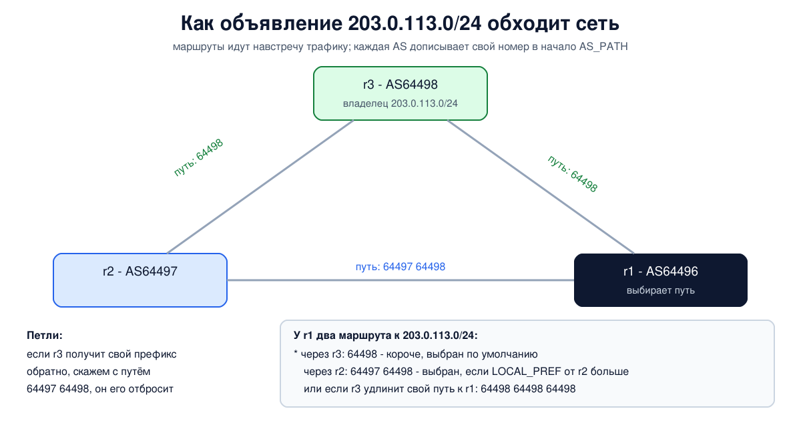

# Урок 33. BGP и устройство интернета: автономные системы и пиринг

RIP и OSPF из урока 32 работают внутри одной организации, где все маршрутизаторы под одним управлением и цель одна - короткий путь. Интернет устроен иначе: это десятки тысяч независимых сетей, у каждой свои хозяева, деньги и договоры, и никто не обязан возить чужой трафик бесплатно. Связывает их единственный протокол - **BGP**. В этом уроке разберём автономные системы, отношения между провайдерами, то, как BGP выбирает путь, и почему маршрутизацию интернета называют одним из самых уязвимых его мест. В опыте поднимем четыре автономные системы и увидим, как политика перебивает длину пути и как проверка происхождения маршрутов отсекает чужие объявления.

## Автономные системы

Олифер определяет **автономную систему** (AS, Autonomous System) как совокупность сетей под единым административным управлением с общей политикой маршрутизации. Обычно это сеть одного провайдера, крупной компании или облака. Внутри AS хозяин выбирает любой протокол маршрутизации (урок 32), а **между** AS всегда говорят на одном языке, BGP; Олифер сравнивает его с эсперанто. Так у маршрутизации появляется третий уровень: сначала путь как цепочка автономных систем, затем как цепочка сетей внутри каждой AS, и уже потом - до узла.

Протоколы внутри AS называют **внутренними шлюзовыми** (IGP: RIP, OSPF, IS-IS), протокол между AS - **внешним шлюзовым** (EGP), и сегодня это BGP версии 4 (RFC 4271).

У каждой AS есть **номер** (ASN). Номера, как и адреса, раздают регистраторы (урок 23). Олифер пишет, что номер 16-разрядный; это устарело: с 2007 года (RFC 4893, сейчас RFC 6793) номера 32-разрядные, потому что 65 536 штук стало мало. Некоторые блоки отведены особо: `64512-65534` - частные номера для внутреннего использования (RFC 6996), `64496-64511` - для документации (RFC 5398), их мы и возьмём в опыте.

## Кто кому платит: транзит и пиринг

Таненбаум начинает BGP не с формата сообщений, а с денег, и это правильно: политика маршрутизации отражает договоры между сетями.

- **Транзит** (transit). Клиент платит провайдеру за доступ ко всему интернету. Провайдер сообщает клиенту маршруты ко всем адресам, а клиент провайдеру - только к своим сетям: чужой трафик через себя клиент возить не хочет.
- **Пиринг** (peering; чаще всего без взаиморасчётов, settlement-free). Две сети с большим взаимным трафиком договариваются обмениваться им напрямую, обычно бесплатно: каждая объявляет другой только свои сети и сети своих клиентов. Таненбаум подчёркивает, что пиринг **не транзитивен**: если `AS3` пирингует и с `AS2`, и с `AS4`, это не значит, что `AS4` может ходить через `AS3` к `AS2`.
- Из этого вырастает правило предпочтений: маршрут от клиента (он платит нам) лучше маршрута от пира (бесплатно), а тот лучше маршрута от провайдера (платим мы). И правило объявлений: клиентам - всё, пирам и провайдерам - только своё и клиентское.

Олифер описывает неофициальные **уровни** провайдеров: Tier 1 достигают всего интернета без платы за транзит (пирингуют друг с другом), Tier 2 часть трафика обменивают бесплатно, часть покупают, Tier 3 только покупают транзит. Встречаются сети в **точках обмена трафиком** (IXP, Internet eXchange Point). Олифер описывает её как помещение со стойками, где провайдеры ставят оборудование и сами соединяются по пиринговым договорам; сегодня обычно это общий коммутатор, а маршрутизируют трафик сами провайдеры.

Небольшой клиент с одним подключением BGP не нужен: ему хватит маршрута по умолчанию в сторону провайдера (урок 26). Таненбаум называет такую сеть тупиковой. BGP нужен, когда подключений несколько (**multihoming**) - ради надёжности или выбора пути.

## Как работает BGP

**Соседей задают вручную.** Олифер подчёркивает отличие от RIP и OSPF: маршрутизатор BGP общается только с теми, кого администратор явно указал соседом (адрес и номер AS). Сеанс идёт по **TCP, порт 179**, поэтому BGP не нужно заботиться о надёжной доставке сам.

**Сообщения** (RFC 4271): OPEN - открыть сеанс и договориться о параметрах; UPDATE - объявить новые маршруты и отозвать пропавшие; KEEPALIVE - "я жив"; NOTIFICATION - ошибка, сеанс закрывается. Олифер отмечает, что UPDATE отправляется при изменениях (триггерно); Таненбаум подчёркивает отличие от периодических рассылок RIP.

**Вектор путей.** Таненбаум называет BGP протоколом **вектора путей** (path vector). Это родственник вектора расстояний, но сосед сообщает не "до сети 3 шага", а **весь путь** в автономных системах. Маршрут BGP - это префикс и набор **атрибутов**:

- **AS_PATH** - список AS, через которые идёт путь; каждая AS, передавая маршрут соседу, дописывает свой номер **в начало**;
- **NEXT_HOP** - адрес маршрутизатора, которому передавать пакеты;
- **LOCAL_PREF** - предпочтение внутри своей AS (соседям в другие AS не передаётся);
- **MED** - подсказка соседу, через какую из нескольких точек лучше входить;
- **ORIGIN** - как маршрут попал в BGP (`i` - сеть внутренняя для AS-источника, `?` - происхождение неизвестно, обычно при перераспределении из другого протокола).



**Петли** BGP отсекает по AS_PATH: получив маршрут, в пути которого уже есть свой номер, маршрутизатор его отбрасывает. Олифер разбирает это на примере; в его тексте одна опечатка - маршрутизатор `EG3` добавляет номер своей AS 363, а не 520, что видно и из приведённого там же пути `AS 363, AS 1021`. Таненбаум добавляет, что и BGP не свободен от медленного схождения: в конце 1990-х обнаружили, что он страдает разновидностью счёта до бесконечности и после отказов может ненадолго образовывать петли.

**eBGP и iBGP.** Сеанс между разными AS - **внешний** BGP (eBGP). Но у большой AS несколько пограничных маршрутизаторов, и маршрут, полученный на одном краю сети, нужно донести до другого края, чтобы объявить его дальше, - сохранив AS_PATH, которого в OSPF нет. Для этого пограничные маршрутизаторы одной AS тоже устанавливают сеансы BGP между собой - **внутренний** BGP (iBGP), пишут оба автора.

## Как BGP выбирает путь

Маршруты к одному префиксу сравнивают по очереди, пока не останется один:

1. наибольший **LOCAL_PREF** - сюда администратор закладывает политику ("клиенты лучше пиров, пиры лучше провайдеров");
2. самый короткий **AS_PATH**;
3. меньший **ORIGIN** (`i` лучше `?`);
4. меньший **MED** (если маршруты от одной соседней AS);
5. полученный по eBGP лучше полученного по iBGP;
6. меньшая стоимость пути внутри своей AS до NEXT_HOP - **ранний выход** или "горячая картошка" (hot potato): отдать пакет соседней сети как можно быстрее;
7. при полном равенстве - меньший идентификатор BGP соседа.

Это порядок из RFC 4271 (раздел 9.1.2.2). У Таненбаума он приведён упрощённо: ORIGIN пропущен, а MED и "eBGP лучше iBGP" переставлены местами.

У производителей шагов больше, но смысл тот же: **сначала политика, потом длина пути**. Таненбаум замечает, что короткий AS_PATH - грубая мера: путь через три маленькие AS может оказаться короче и быстрее, чем через одну огромную, хотя по AS_PATH он длиннее; а внутренние стоимости разных сетей несравнимы. И ещё одно следствие: из-за раннего выхода пути туда и обратно часто **несимметричны** (урок 25).

Ещё важнее вот что: BGP выбирает только между маршрутами к **одному и тому же** префиксу. А при пересылке, как в уроке 26, **самый длинный совпадающий префикс побеждает** любой атрибут BGP. Это пригодится в разделе о безопасности.

**Управление трафиком.** Своим **исходящим** трафиком AS управляет просто: ставит LOCAL_PREF, и её маршрутизаторы выбирают нужный выход. Повлиять на **входящий** трафик сложнее: чужие AS сами решают, как к нам идти. Остаются косвенные способы - удлинить свой путь для одних соседей, повторив свой номер в AS_PATH несколько раз (**prepend**), или объявлять более длинные префиксы через нужное подключение. В книге Таненбаума (мы сверяли по русскому изданию) в этом месте "входящий" и "исходящий" трафик поменяны местами: LOCAL_PREF там назван средством для входящего трафика; по смыслу его же рассуждения (и по RFC 4271, где LOCAL_PREF влияет только на выбор своих маршрутизаторов) - это средство для исходящего. А ссылка на спецификацию BGP напечатана как RFC 427, правильно - RFC 4271.

## Как это увидеть в Linux

Поднимем четыре автономные системы на BIRD: `r1` (AS64496), `r2` (AS64497), `r3` (AS64498) и `r4` (AS64499). `r1`, `r2` и `r3` связаны треугольником, `r4` - клиент `r1`. У каждой AS своя сеть: у `r3` это `203.0.113.0/24`, у `r4` - `198.51.100.128/25`. Посмотрим сеансы, выбор между двумя путями, сдвинем выбор политикой (LOCAL_PREF), затем удлинением пути (prepend), а на сеансе с клиентом `r4` включим защитную проверку: принимать только его префиксы и проверять происхождение по таблице **ROA** (о ней - в разделе о безопасности). Нужны Linux (подойдёт WSL2), права sudo и пакет `bird2` (`sudo apt install bird2`, службу лучше выключить: `sudo systemctl disable --now bird`). Всё создаётся в пространствах имён `hbh-*` и в конце удаляется.

Создай файл `bgp-lab.sh` и запусти `bash bgp-lab.sh`:

```
set -u
for c in bird birdc; do
  command -v $c >/dev/null || { echo "нужен $c: sudo apt install bird2"; exit 1; }
done
R="hbh-r1 hbh-r2 hbh-r3 hbh-r4"
# убрать остатки прошлого запуска
for n in $R; do
  sudo ip netns pids $n 2>/dev/null | xargs -r sudo kill
  sudo ip netns del $n 2>/dev/null
done
d=$(mktemp -d)
chmod 755 "$d"
# четыре автономные системы (номера из блока для документации 64496-64511):
# r1 - AS64496, r2 - AS64497, r3 - AS64498, r4 - AS64499
for n in $R; do sudo ip netns add $n; done
link() { sudo ip link add $2 netns $1 type veth peer name $4 netns $3; }
addr() { sudo ip netns exec $1 ip addr add $3 dev $2; }
link hbh-r1 eth0 hbh-r2 eth0; addr hbh-r1 eth0 192.0.2.1/30;  addr hbh-r2 eth0 192.0.2.2/30
link hbh-r2 eth1 hbh-r3 eth0; addr hbh-r2 eth1 192.0.2.5/30;  addr hbh-r3 eth0 192.0.2.6/30
link hbh-r1 eth1 hbh-r3 eth1; addr hbh-r1 eth1 192.0.2.9/30;  addr hbh-r3 eth1 192.0.2.10/30
link hbh-r1 eth2 hbh-r4 eth0; addr hbh-r1 eth2 192.0.2.13/30; addr hbh-r4 eth0 192.0.2.14/30
# у каждой AS своя сеть, которую она объявляет
lan() { sudo ip netns exec $1 ip link add lan0 type dummy; addr $1 lan0 $2; }
lan hbh-r1 192.0.2.129/25
lan hbh-r2 198.51.100.1/25
lan hbh-r3 203.0.113.1/24
lan hbh-r4 198.51.100.129/25
for n in $R; do
  for l in $(sudo ip netns exec $n ls /sys/class/net); do sudo ip netns exec $n ip link set $l up; done
  sudo ip netns exec $n sysctl -qw net.ipv4.ip_forward=1
done
bc() { sudo ip netns exec $1 birdc -s "$d/$1.ctl" "$2" | sed 1d; }
start() { sudo ip netns exec $1 bird -c "$d/$1.conf" -s "$d/$1.ctl" -P "$d/$1.pid"; }
reconf() { bc $1 configure | grep -vE '^Reading'; }
# общая часть: свою сеть объявляем в BGP, выученные маршруты пишем в ядро
common() {
cat <<EOF
log "$d/$1.log" all;
router id $2;
protocol device { }
protocol direct { ipv4; interface "lan0"; }
protocol kernel { ipv4 { import none; export where source = RTS_BGP; }; }
EOF
}
# сеанс BGP: имя, свой адрес и AS, адрес и AS соседа, фильтры
bgp() {
cat <<EOF
protocol bgp $1 {
  local $2 as $3;
  neighbor $4 as $5;
  ipv4 { import $6; export $7; };
}
EOF
}
EXP='where source ~ [ RTS_DEVICE, RTS_BGP ]'
conf_r1() {  # $1 - фильтр импорта от r2
  { common hbh-r1 0.0.0.1
    bgp r2 192.0.2.1 64496 192.0.2.2 64497 "$1" "$EXP"
    bgp r3 192.0.2.9 64496 192.0.2.10 64498 all "$EXP"
    cat <<EOF
# защита: таблица разрешений на происхождение (ROA), как из RPKI
roa4 table roas;
protocol static {
  roa4 { table roas; };
  route 203.0.113.0/24 max 24 as 64498;
  route 198.51.100.0/25 max 25 as 64497;
  route 198.51.100.128/25 max 25 as 64499;
}
filter from_customer_r4 {
  if roa_check(roas, net, bgp_path.last) = ROA_INVALID then {
    print "r1: rejected ", net, " from AS", bgp_path.last, ": ROA invalid";
    reject;
  }
  if net ~ [ 198.51.100.128/25 ] then accept;
  print "r1: rejected ", net, ": not in the list of r4 prefixes";
  reject;
}
EOF
    bgp r4 192.0.2.13 64496 192.0.2.14 64499 "filter from_customer_r4" "$EXP"
  } > "$d/hbh-r1.conf"
}
conf_r3() {  # $1 - фильтр экспорта к r1
  { common hbh-r3 0.0.0.3
    bgp r2 192.0.2.6 64498 192.0.2.5 64497 all "$EXP"
    bgp r1 192.0.2.10 64498 192.0.2.9 64496 all "$1"
  } > "$d/hbh-r3.conf"
}
conf_r1 all
{ common hbh-r2 0.0.0.2
  bgp r1 192.0.2.2 64497 192.0.2.1 64496 all "$EXP"
  bgp r3 192.0.2.5 64497 192.0.2.6 64498 all "$EXP"
} > "$d/hbh-r2.conf"
conf_r3 "$EXP"
# r4 объявляет свою сеть и, по ошибке в настройке, ещё и чужую
{ common hbh-r4 0.0.0.4
  cat <<EOF
protocol static { ipv4; route 203.0.113.0/25 blackhole; }
EOF
  bgp r1 192.0.2.14 64499 192.0.2.13 64496 all 'where source ~ [ RTS_DEVICE, RTS_STATIC ]'
} > "$d/hbh-r4.conf"
for n in $R; do start $n; done
sleep 12
echo '--- 1. BGP sessions of r1 (TCP port 179)'
bc hbh-r1 'show protocols' | grep -E 'Name|BGP'
sudo ip netns exec hbh-r1 ss -tn state established '( sport = :179 or dport = :179 )' | sed 1d | awk '{print $3, "<->", $4}'
echo '--- 2. r1: two routes to 203.0.113.0/24, the shorter AS path wins'
bc hbh-r1 'show route 203.0.113.0/24 all' | grep -E 'unicast|BGP.as_path|BGP.next_hop|BGP.local_pref'
echo '--- 3. r1 prefers routes from r2 (local preference 200)'
conf_r1 'filter { bgp_local_pref = 200; accept; }'
reconf hbh-r1
sleep 3
bc hbh-r1 'show route 203.0.113.0/24 all' | grep -E 'unicast|BGP.as_path|BGP.local_pref'
echo '--- 4. back to default; now r3 makes its path to r1 longer (prepend)'
conf_r1 all; reconf hbh-r1
conf_r3 'filter { if net = 203.0.113.0/24 then { bgp_path.prepend(64498); bgp_path.prepend(64498); } if source ~ [ RTS_DEVICE, RTS_BGP ] then accept; reject; }'
reconf hbh-r3
sleep 3
bc hbh-r1 'show route 203.0.113.0/24 all' | grep -E 'unicast|BGP.as_path'
echo '--- 5. kernel route of r1 to 203.0.113.0/24'
sudo ip netns exec hbh-r1 ip route show 203.0.113.0/24
echo '--- 6. what r1 accepted from r4 (the customer)'
bc hbh-r1 'show route protocol r4'
grep -h 'r1: rejected' "$d/hbh-r1.log" | sed -E 's/^[0-9-]+ [0-9:.]+ <[A-Z]+> //' | sort -u
echo '--- 7. the same check by hand: origin validation of four announcements'
for q in '203.0.113.0/24, 64498' '203.0.113.0/25, 64499' '198.51.100.128/25, 64499' '192.0.2.128/25, 64496'; do
  case $(bc hbh-r1 "eval roa_check(roas, $q)" | tail -c 2) in
    0) s=unknown ;; 1) s=valid ;; 2) s=invalid ;; *) s='?' ;;
  esac
  echo "prefix $q -> $s"
done
echo '--- cleanup'
for n in $R; do
  sudo ip netns pids $n 2>/dev/null | xargs -r sudo kill
  sudo ip netns del $n
done
rm -rf "$d"
ip netns list | grep -cE '^hbh-r[1-4]( |$)'
```

Вот что получилось на нашем сервере:

```
--- 1. BGP sessions of r1 (TCP port 179)
Name       Proto      Table      State  Since         Info
r2         BGP        ---        up     17:38:10.630  Established   
r3         BGP        ---        up     17:38:10.447  Established   
r4         BGP        ---        up     17:38:11.229  Established   
192.0.2.1%eth0:35191 <-> 192.0.2.2:179
192.0.2.9:179 <-> 192.0.2.10:55019
192.0.2.13%eth2:60607 <-> 192.0.2.14:179
--- 2. r1: two routes to 203.0.113.0/24, the shorter AS path wins
203.0.113.0/24       unicast [r3 17:38:10.447] * (100) [AS64498i]
	BGP.as_path: 64498
	BGP.next_hop: 192.0.2.10
	BGP.local_pref: 100
                     unicast [r2 17:38:10.655] (100) [AS64498i]
	BGP.as_path: 64497 64498
	BGP.next_hop: 192.0.2.2
	BGP.local_pref: 100
--- 3. r1 prefers routes from r2 (local preference 200)
Reconfigured
203.0.113.0/24       unicast [r2 17:38:18.881] * (100) [AS64498i]
	BGP.as_path: 64497 64498
	BGP.local_pref: 200
                     unicast [r3 17:38:10.447] (100) [AS64498i]
	BGP.as_path: 64498
	BGP.local_pref: 100
--- 4. back to default; now r3 makes its path to r1 longer (prepend)
Reconfigured
Reconfigured
203.0.113.0/24       unicast [r2 17:38:21.937] * (100) [AS64498i]
	BGP.as_path: 64497 64498
                     unicast [r3 17:38:21.924] (100) [AS64498i]
	BGP.as_path: 64498 64498 64498
--- 5. kernel route of r1 to 203.0.113.0/24
203.0.113.0/24 via 192.0.2.2 dev eth0 proto bird metric 32 
--- 6. what r1 accepted from r4 (the customer)
Table master4:
198.51.100.128/25    unicast [r4 17:38:11.229] * (100) [AS64499i]
	via 192.0.2.14 on eth2
r1: rejected 203.0.113.0/25 from AS64499: ROA invalid
--- 7. the same check by hand: origin validation of four announcements
prefix 203.0.113.0/24, 64498 -> valid
prefix 203.0.113.0/25, 64499 -> invalid
prefix 198.51.100.128/25, 64499 -> valid
prefix 192.0.2.128/25, 64496 -> unknown
--- cleanup
0
```

Разберём по шагам.

- **Шаг 1: сеансы.** У `r1` три сеанса BGP (`r2`, `r3`, `r4`), все в состоянии `Established`. Строки из `ss` - это TCP-соединения: у каждого с одной стороны порт `179`. Кто к кому подключился, решил случай: в этом запуске соединения с `r2` и `r4` открыл сам `r1` (у него случайный порт, у соседа 179), а с `r3` - `r3` (порт 179 у `r1`). Пометки `%eth0` и `%eth2` стоят как раз у соединений, которые открыл `r1`: BIRD привязал их к интерфейсу, через который виден сосед. Если обе стороны открыли соединения одновременно, по RFC 4271 остаётся то, которое открыла сторона с большим идентификатором BGP. Здесь столкновений не было: у `r1` наименьший идентификатор (`0.0.0.1`), и при столкновении остались бы соединения, открытые соседями.
- **Шаг 2: выбор пути.** У `r1` два маршрута к `203.0.113.0/24`: напрямую от `r3` с путём `64498` и от `r2` с путём `64497 64498`. Звёздочка `*` - выбранный: путь короче. `(100)` - приоритет протокола BGP в BIRD, `[AS64498i]` - AS-источник и ORIGIN `i`. `BGP.next_hop` - кому передавать пакеты, `BGP.local_pref: 100` - значение по умолчанию.
- **Шаг 3: политика.** Мы поставили маршрутам от `r2` `local_pref 200` и перечитали настройки (`Reconfigured`). Теперь выбран путь через `r2`, хотя он длиннее: LOCAL_PREF сравнивается первым. Так провайдер задаёт политику, например предпочитает маршруты от платящего клиента.
- **Шаг 4: удлинение пути.** Вернули `r1` настройки по умолчанию, а `r3` теперь в сторону `r1` дважды повторяет свой номер. `r1` видит путь `64498 64498 64498` (третий раз номер добавил сам BIRD, как и положено при передаче соседу) против `64497 64498` через `r2` и выбирает `r2`. Так `r3` повлиял на то, как к нему приходит трафик, не имея доступа к настройкам `r1`.
- **Шаг 5: таблица ядра.** В ядро BIRD записал выбранный маршрут: `203.0.113.0/24 via 192.0.2.2` - через `r2`.
- **Шаг 6: защита на сеансе с клиентом.** `r4` объявил свою сеть `198.51.100.128/25` и, из-за ошибки в настройке, ещё и `203.0.113.0/25` - часть чужой сети `r3`. `r1` принял только первое. Второе отброшено с пометкой в журнале `ROA invalid`: по таблице разрешений этот адресный блок может объявлять только AS64498 и только как `/24`. Без фильтров более длинный `/25` победил бы честный `/24` у всех, кто его принял.
- **Шаг 7: проверка вручную.** Три возможных ответа проверки происхождения: `valid` - есть разрешение для этой пары "префикс - AS"; `invalid` - на этот блок есть разрешения, но не для этой AS или не для такой длины префикса; `unknown` - на этот блок разрешений нет вообще (так в 2026 году примерно с третью объявленных в интернете префиксов), и такие маршруты обычно принимают.
- В конце `0`: пространства имён удалены.

## Безопасность: перехват префиксов и как от него защищаются

Олифер называет маршрутизацию на BGP, наряду с DNS, одним из самых уязвимых элементов интернета. Причина в принципе работы: маршрут складывается шаг за шагом многими независимыми сетями, и проверить, честно ли каждый шаг, протокол сам по себе не может. BGP создавался в расчёте на добрую волю всех участников.

Главные виды проблем на уровне принципа:

- **Перехват префикса** (prefix hijack): AS объявляет чужой адресный блок как свой. Если объявление более длинное (более специфичное), оно побеждает честное везде, куда дошло, - по правилу самого длинного префикса. А объявление той же длины перетянет трафик в той части интернета, которой фальшивый путь покажется лучше. Трафик уходит не туда и теряется или проходит через чужую сеть.
- **Утечка маршрутов** (route leak): AS передаёт маршруты не тем, кому положено, например маршруты от одного провайдера другому провайдеру, и невольно становится транзитом для чужого трафика.

Олифер подчёркивает, что снаружи трудно отличить ошибку настройки от атаки, поэтому говорят об инцидентах; оба его примера ниже оказались ошибками. Классические примеры из его книги: в 1997 году маршрутизатор одной небольшой AS после перенастройки объявил чужие сети как свои, и значительная часть интернета стала недоступна; в 2008 году оператор хотел ограничить доступ к YouTube внутри своей страны, но объявление более специфичного маршрута вышло за её пределы (это перехват, а не утечка в смысле выше), и значительная часть мирового трафика сервиса около двух часов уходила в его сеть.

Защита строится слоями:

- **Фильтры на сеансах с клиентами.** Принимать от клиента только его префиксы (списки составляют по договорам и базам маршрутной информации IRR), как `r1` в опыте. Ограничивать число принимаемых маршрутов (max-prefix), чтобы ошибка соседа не залила таблицу.
- **RPKI и проверка происхождения** (ROV, RFC 6811). Владелец адресов публикует в RPKI (RFC 6480) подписанное **разрешение ROA**: "этот блок, до такой-то длины, объявляет AS номер N". Проверяющие серверы (валидаторы) сами скачивают ROA из RPKI и проверяют подписи, а маршрутизаторам отдают уже проверенный список разрешений (RFC 8210); маршрутизаторы отбрасывают маршруты со статусом `invalid`, как в опыте. Ограничение: ROV проверяет только **происхождение**, а не весь путь, поэтому разрабатывают ASPA - проверку правдоподобности пути по отношениям "клиент - провайдер", прежде всего против утечек (на 2026 год это ещё черновик IETF, но регистраторы уже принимают такие объекты), а BGPsec (RFC 8205) подписывает весь путь, но почти не внедрён.
- **Правила фильтрации по ролям** (клиент, пир, провайдер) против утечек, например роли соседей в OPEN (RFC 9234).
- **Защита самих сеансов**: проверка подлинности TCP (TCP-AO, RFC 5925; раньше - MD5, RFC 2385), проверка TTL (GTSM, RFC 5082) - принимать пакеты сеанса только от непосредственного соседа.
- **Наблюдение**: сервисы, которые собирают таблицы BGP по всему миру, сообщают владельцу, если его префиксы кто-то объявил. Добровольная инициатива MANRS собирает эти меры в минимальный набор, который её участники обязуются выполнять.
- А на уровне приложений от подмены пути страхует шифрование с проверкой подлинности (блоки 8 и 9): даже если трафик ушёл не туда, прочитать или незаметно подменить его без ключей нельзя. Недоступность, впрочем, шифрование не лечит.

## Итог

- Интернет - это автономные системы под разным управлением. Внутри AS работают IGP (RIP, OSPF, IS-IS), между AS - BGP-4. Номера AS сегодня 32-разрядные.
- Отношения сетей - транзит (за деньги) и пиринг (обычно бесплатный, не транзитивный); встречаются сети в точках обмена трафиком.
- BGP - протокол вектора путей поверх TCP, порт 179, соседи задаются вручную. Маршрут - префикс с атрибутами AS_PATH, NEXT_HOP, LOCAL_PREF, MED; петли отсекаются по AS_PATH; eBGP между AS, iBGP внутри.
- Выбор пути по RFC 4271: сначала LOCAL_PREF (политика), потом длина AS_PATH, ORIGIN, MED, eBGP лучше iBGP, ранний выход. Входящий трафик сдвигают удлинением пути и более длинными префиксами.
- BGP доверяет объявлениям, отсюда перехваты и утечки маршрутов. Защита - фильтры на сеансах, лимиты, RPKI и проверка происхождения, защита сеансов, наблюдение.

## Что почитать

- Олифер, "Компьютерные сети", глава 16, с. 507-511: автономные системы, внутренние и внешние шлюзовые протоколы, BGP; глава 18, с. 588-590: организация интернета, пиринг, IXP, уровни провайдеров; глава 29, с. 916-919: безопасность маршрутизации на BGP, инциденты.
- Таненбаум, "Компьютерные сети", раздел 5.7.7, с. 544-551: BGP, транзит и пиринг, вектор путей, iBGP, выбор маршрута, управление трафиком.
- RFC 4271 (BGP-4), RFC 6811 (проверка происхождения по RPKI).
