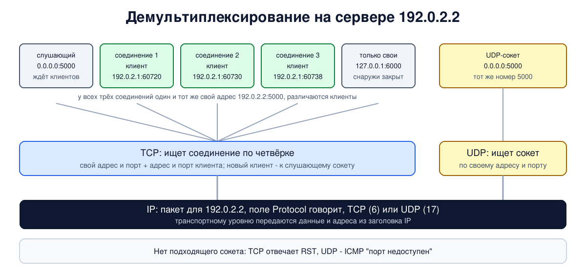

# Урок 34. Порты, сокеты и мультиплексирование

Начинаем блок 4, транспортный уровень. Сетевой уровень (блок 3) доставляет пакет до нужного **компьютера**. Но на компьютере работают десятки программ: браузер, почтовый клиент, мессенджер, служба обновлений. Какой из них отдать пришедшие данные? Эту задачу решают **порты**, а пара "адрес и порт" называется **сокетом**. Разберём, как транспортный уровень раздаёт данные программам и собирает их обратно, какие бывают номера портов, как программы работают с сокетами, и увидим в опыте, что происходит, когда стучишься в открытый и в закрытый порт. В конце - почему сканирование портов считают первым шагом разведки и как от него защищаться.

## Зачем нужен транспортный уровень

Таненбаум в начале главы задаёт вопрос: если транспортные службы так похожи на сетевые, зачем два уровня? Ответ в том, где они работают. Сетевой уровень живёт в основном на маршрутизаторах, которые принадлежат операторам, и пользователь не может сделать его надёжнее. Транспортный уровень работает целиком **на конечных узлах**, и именно он может превратить ненадёжную доставку пакетов "по возможности" (урок 25) в надёжный поток данных: заметить потерю и отправить заново. Заодно он отделяет программы от подробностей сети: программист пишет код для стандартного интерфейса и не думает, Ethernet под ним или Wi-Fi.

Два главных транспортных протокола интернета:

- **UDP** - просто доставить сообщение нужной программе, без гарантий (урок 35);
- **TCP** - надёжный упорядоченный поток байтов с установлением соединения (уроки 36-41).

Сообщение транспортного уровня называют **сегментом** (у TCP) или **дейтаграммой** (у UDP). Сегмент едет в поле данных IP-пакета, пакет - в кадре Ethernet (урок 6).

## Мультиплексирование и демультиплексирование

Олифер называет раздачу пришедших пакетов программам **демультиплексированием**, а обратную задачу - собрать данные от многих программ и отдать их одному модулю IP - **мультиплексированием**. Делают это TCP и UDP, а различают программы по **номеру порта**: 16-битному числу в заголовке транспортного протокола. В каждом сегменте два номера - порт отправителя и порт получателя.

Олифер описывает порт как пару системных очередей программы - входящих и исходящих данных; с точки зрения программы порт - это просто номер, к которому она привязалась. И сразу предупреждает: порты программ не надо путать с портами оборудования (разъёмами коммутатора из урока 16).

Важная деталь, которую подчёркивает Олифер: номера портов TCP и UDP **независимы**. TCP-порт 5000 и UDP-порт 5000 - разные порты, и их могут занимать разные программы. Одинаковые номера дают только ради удобства, если служба работает по обоим протоколам: DNS - 53 и в TCP, и в UDP.



## Номера портов

Номер порта - 16 бит, то есть от 0 до 65 535. IANA делит их на три диапазона (RFC 6335):

| Диапазон | Название | Кто назначает |
|---|---|---|
| 0-1023 | системные, "хорошо известные" (well-known) | IANA, для стандартных служб: 22 SSH, 53 DNS, 80 HTTP, 443 HTTPS, 179 BGP (урок 33) |
| 1024-49151 | зарегистрированные | IANA по заявке разработчиков |
| 49152-65535 | динамические | никем, для временного использования |

Диапазоны IANA - это правила для реестра, а не для ОС: временные порты клиентов ОС берёт из своего диапазона, и он может не совпадать с "динамическим": у Linux не совпадает, у Windows совпадает. Двухчастное деление Олифера (0-1023 назначенные, 1024-65535 динамические) устарело относительно RFC 6335.

Список известных номеров ведёт IANA (раньше его публиковали в RFC 1700, потом RFC 3232 объявил, что список живёт в онлайн-базе IANA). В Linux его сокращённая копия лежит в файле `/etc/services`.

Серверу нужен **известный** номер, чтобы клиенты знали, куда стучаться. Клиенту всё равно, какой у него номер, поэтому ОС выдаёт ему **временный** (эфемерный) порт при подключении. Олифер описывает это как "первый свободный номер" из диапазона 1024-65535, но современные системы делают иначе. Диапазон у каждой ОС свой: в Linux его задаёт `net.ipv4.ip_local_port_range`, по умолчанию 32768-60999 (то есть частично из "зарегистрированных"), в Windows - 49152-65535. А номер выбирается так, чтобы посторонний не мог его угадать (RFC 6056 объясняет, зачем, об этом урок 38): Linux вычисляет стартовую точку секретным хешем от адресов, порта сервера и текущего 10-секундного интервала, а соединения к тому же серверу в пределах этого интервала получают номера рядом, с небольшим случайным шагом. В опыте это видно.

В Unix номера ниже 1024 может занять только привилегированная программа. Таненбаум упоминает это в разборе своего примера сервера. В Linux граница настраивается (`net.ipv4.ip_unprivileged_port_start`, по умолчанию 1024), а обычной программе вместо прав root можно выдать одну способность `CAP_NET_BIND_SERVICE`.

## Сокеты

Олифер определяет **сокет** как пару (IP-адрес, номер порта): она однозначно указывает программу в сети. Его пример: на одном компьютере работают две копии DNS-сервера, обе на UDP-порту 53; различить их можно, только если у компьютера два IP-адреса и каждая копия привязана к своему. Поэтому транспортный уровень получает от IP не только данные, но и адрес получателя из заголовка.

Для TCP картина ещё интереснее. Соединение TCP определяется **четвёркой**: адрес и порт своей стороны и адрес и порт собеседника (с протоколом - пятёркой). Поэтому к одному серверному сокету `192.0.2.2:5000` может быть подключено сколько угодно клиентов одновременно: у каждого соединения свой адрес или порт клиента. Мы увидим это в опыте. У UDP соединений нет, и неподключённый UDP-сокет получает дейтаграммы от всех отправителей сразу ("подключённый" - только от своего адресата).

Олифер описывает сокет как адрес, а Таненбаум - как интерфейс программирования: **сокеты Беркли** появились в 1983 году в 4.2BSD и стали стандартом де-факто, пишет он, в Windows их аналог называется Winsock. Для сервера на TCP последовательность вызовов такая:

1. `socket` - создать сокет (указать семейство адресов, тип: поток или дейтаграммы, протокол);
2. `bind` - привязать его к адресу и порту;
3. `listen` - объявить, что готов принимать соединения, и задать длину очереди ожидающих;
4. `accept` - дождаться клиента; он возвращает **новый** сокет для этого соединения, а исходный продолжает слушать.

Клиенту `bind` обычно не нужен: он вызывает `socket` и `connect`, а порт ОС выберет сама. Дальше обе стороны читают и пишут (`send`/`recv` или обычные `read`/`write`), а в конце вызывают `close`. У Таненбаума есть полный пример такого сервера и клиента на C.

**Адрес привязки** важен для безопасности. Сервер, привязанный к `0.0.0.0`, принимает соединения на всех адресах компьютера. Привязанный к `127.0.0.1` - только от программ на этом же компьютере (урок 21): снаружи такой порт выглядит закрытым. Это простой и надёжный способ не выставлять служебные сервисы в сеть.

## Что происходит на закрытом порту

- **TCP**: если на порту никто не слушает, ядро получателя отвечает сегментом с флагом **RST** ("сброс"), и у клиента `connect` сразу заканчивается ошибкой "Connection refused".
- **UDP**: ядро получателя отвечает ICMP "порт недоступен" (урок 28), и если клиентский сокет "подключён" к адресу получателя, ядро клиента тоже сообщает программе "Connection refused". Если же ответа нет вовсе, клиент просто ждёт до истечения своего времени. Причём молчание UDP-порта ничего не доказывает: ICMP-ответ стандарт только рекомендует (RFC 1122), ядро ограничивает частоту таких сообщений (урок 28), их может отбросить межсетевой экран, а открытый порт на непонятный запрос часто просто не отвечает.

Именно на этой разнице ответов открытого и закрытого порта держится сканирование портов, о котором в конце.

## Как это увидеть в Linux

Соберём два узла: клиент `a` (`192.0.2.1`) и сервер `b` (`192.0.2.2`). На `b` запустим небольшой сервер на Python: TCP-порт 5000 на всех адресах, UDP-порт 5000 (тот же номер, другой протокол) и TCP-порт 6000 только на `127.0.0.1`. Посмотрим сокеты утилитой `ss` (подробно о ней в уроке 46), подключимся трижды к одному порту, постучимся в закрытые порты и попробуем занять порт 80 от имени обычного пользователя. Нужны Linux (подойдёт WSL2), права sudo, python3 и tcpdump (`sudo apt install python3 tcpdump`; утилита `column` для таблицы есть в стандартной Ubuntu, в минимальных образах её даёт пакет `bsdextrautils`); всё создаётся в пространствах имён `hbh-*` и в конце удаляется.

Создай файл `ports-lab.sh` и запусти `bash ports-lab.sh`:

```
set -u
for c in python3 tcpdump ss column; do
  command -v $c >/dev/null || { echo "нужен $c: sudo apt install python3 tcpdump iproute2 bsdextrautils"; exit 1; }
done
# убрать остатки прошлого запуска
for n in hbh-a hbh-b; do
  sudo ip netns pids $n 2>/dev/null | xargs -r sudo kill
  sudo ip netns del $n 2>/dev/null
done
d=$(mktemp -d)
chmod 755 "$d"
# клиент a (192.0.2.1) и сервер b (192.0.2.2)
for n in hbh-a hbh-b; do sudo ip netns add $n; done
sudo ip link add eth0 netns hbh-a type veth peer name eth0 netns hbh-b
sudo ip netns exec hbh-a ip addr add 192.0.2.1/24 dev eth0
sudo ip netns exec hbh-b ip addr add 192.0.2.2/24 dev eth0
for n in hbh-a hbh-b; do
  sudo ip netns exec $n ip link set lo up
  sudo ip netns exec $n ip link set eth0 up
done
# сервер: TCP 5000 на всех адресах, UDP 5000 (тот же номер, другой протокол),
# TCP 6000 только на 127.0.0.1 - служба для своих
cat > "$d/server.py" <<'EOF'
import socket, threading
def tcp(addr, port, name):
    s = socket.socket(socket.AF_INET, socket.SOCK_STREAM)
    s.setsockopt(socket.SOL_SOCKET, socket.SO_REUSEADDR, 1)
    s.bind((addr, port)); s.listen()
    while True:
        c, peer = s.accept()
        c.sendall(f"hello from {name}, you are {peer[0]}:{peer[1]}\n".encode())
        threading.Thread(target=lambda c=c: (c.recv(1), c.close()), daemon=True).start()
def udp(port):
    s = socket.socket(socket.AF_INET, socket.SOCK_DGRAM)
    s.bind(("0.0.0.0", port))
    while True:
        data, peer = s.recvfrom(100)
        s.sendto(b"udp echo: " + data, peer)
threading.Thread(target=tcp, args=("0.0.0.0", 5000, "tcp/5000"), daemon=True).start()
threading.Thread(target=tcp, args=("127.0.0.1", 6000, "tcp/6000"), daemon=True).start()
udp(5000)
EOF
# клиент: три TCP-соединения к одному порту сервера, держит их открытыми
cat > "$d/client.py" <<'EOF'
import socket, time
conns = []
for i in range(3):
    s = socket.create_connection(("192.0.2.2", 5000))
    print("conn", i + 1, "local port", s.getsockname()[1], "->", s.recv(100).decode().strip())
    conns.append(s)
u = socket.socket(socket.AF_INET, socket.SOCK_DGRAM)
u.sendto(b"ping", ("192.0.2.2", 5000))
print("udp:", u.recvfrom(100)[0].decode())
time.sleep(4)
EOF
sudo ip netns exec hbh-b python3 "$d/server.py" &
sleep 1
echo '--- 1. listening sockets on b'
{ echo 'Proto State Local Peer Process'; sudo ip netns exec hbh-b ss -tulnpH | sed -E 's/,fd=[0-9]+//; s/pid=[0-9]+/pid=N/' | awk '{print $1, $2, $5, $6, $7}'; } | column -t
echo '--- 2. three TCP connections and one UDP message from a to port 5000'
sudo ip netns exec hbh-a python3 -u "$d/client.py" > "$d/client.out" &
sleep 2
cat "$d/client.out"
echo '--- 3. connections on b: same local socket, different peers'
sudo ip netns exec hbh-b ss -tn state established | sed 1d | awk '{print $3, "<-", $4}'
wait %2 2>/dev/null
echo '--- 4. range for ephemeral (client) ports'
sudo ip netns exec hbh-a sysctl net.ipv4.ip_local_port_range
echo '--- 5. knocking on closed doors'
sudo ip netns exec hbh-a timeout 6 tcpdump -i eth0 -n -l 'tcp[tcpflags] & tcp-rst != 0 or icmp' 2>/dev/null > "$d/closed" &
sleep 1
for p in 7000 6000; do
  sudo ip netns exec hbh-a python3 -c "
import socket
try:
    socket.create_connection(('192.0.2.2', $p), timeout=2); print('tcp/$p: connected')
except OSError as e:
    print('tcp/$p:', e.strerror)"
done
sudo ip netns exec hbh-a python3 -c "
import socket
u = socket.socket(socket.AF_INET, socket.SOCK_DGRAM); u.connect(('192.0.2.2', 7000)); u.send(b'x')
try:
    u.settimeout(2); u.recv(10)
except OSError as e:
    print('udp/7000:', e.strerror or e)"
sleep 3
sed -E 's/^[0-9:.]+ //' "$d/closed"
echo '--- 6. ports below 1024 need privileges'
sudo ip netns exec hbh-b sysctl net.ipv4.ip_unprivileged_port_start
for p in 80 8080; do
  sudo ip netns exec hbh-b sudo -u nobody python3 -c "
import socket
s = socket.socket()
try:
    s.bind(('0.0.0.0', $p)); print('nobody bind $p: ok')
except OSError as e:
    print('nobody bind $p:', e.strerror)"
done
echo '--- 7. well-known port numbers from /etc/services'
getent services 22/tcp 53/udp 443/tcp 179/tcp
echo '--- cleanup'
for n in hbh-a hbh-b; do
  sudo ip netns pids $n 2>/dev/null | xargs -r sudo kill
  sudo ip netns del $n
done
rm -rf "$d"
ip netns list | grep -cE '^hbh-(a|b)( |$)'
```

Вот что получилось на нашем сервере:

```
--- 1. listening sockets on b
Proto  State   Local           Peer       Process
udp    UNCONN  0.0.0.0:5000    0.0.0.0:*  users:(("python3",pid=N))
tcp    LISTEN  0.0.0.0:5000    0.0.0.0:*  users:(("python3",pid=N))
tcp    LISTEN  127.0.0.1:6000  0.0.0.0:*  users:(("python3",pid=N))
--- 2. three TCP connections and one UDP message from a to port 5000
conn 1 local port 60720 -> hello from tcp/5000, you are 192.0.2.1:60720
conn 2 local port 60730 -> hello from tcp/5000, you are 192.0.2.1:60730
conn 3 local port 60738 -> hello from tcp/5000, you are 192.0.2.1:60738
udp: udp echo: ping
--- 3. connections on b: same local socket, different peers
192.0.2.2:5000 <- 192.0.2.1:60730
192.0.2.2:5000 <- 192.0.2.1:60738
192.0.2.2:5000 <- 192.0.2.1:60720
--- 4. range for ephemeral (client) ports
net.ipv4.ip_local_port_range = 32768	60999
--- 5. knocking on closed doors
tcp/7000: Connection refused
tcp/6000: Connection refused
udp/7000: Connection refused
IP 192.0.2.2.7000 > 192.0.2.1.60486: Flags [R.], seq 0, ack 4081676791, win 0, length 0
IP 192.0.2.2.6000 > 192.0.2.1.41132: Flags [R.], seq 0, ack 70681337, win 0, length 0
IP 192.0.2.2 > 192.0.2.1: ICMP 192.0.2.2 udp port 7000 unreachable, length 37
--- 6. ports below 1024 need privileges
net.ipv4.ip_unprivileged_port_start = 1024
nobody bind 80: Permission denied
nobody bind 8080: ok
--- 7. well-known port numbers from /etc/services
ssh                   22/tcp
domain                53/udp
https                 443/tcp
bgp                   179/tcp
--- cleanup
0
```

Разберём по шагам.

- **Шаг 1: слушающие сокеты на `b`.** `ss -tulnpH`: `t` - TCP, `u` - UDP, `l` - только слушающие (у UDP это сокеты в состоянии `UNCONN`), `n` - номера без имён, `p` - какой процесс, `H` - без строки заголовка (свой заголовок мы печатаем сами). Три сокета: UDP `0.0.0.0:5000` в состоянии `UNCONN` (у UDP нет соединений, сокет просто ждёт дейтаграмм), TCP `0.0.0.0:5000` в состоянии `LISTEN` (ждёт соединений на всех адресах) и TCP `127.0.0.1:6000`, тоже `LISTEN`, но только на адресе петли. `0.0.0.0:*` в колонке собеседника - "от кого угодно". Все три открыл наш `server.py` (номер процесса в выводе мы заменили на `N`): TCP и UDP на одном номере ничем не мешают друг другу.
- **Шаг 2: три соединения.** Клиент трижды подключился к `192.0.2.2:5000`, и каждый раз ОС дала ему новый временный порт (`60720`, `60730`, `60738`; у тебя будут другие). Сервер в приветствии называет адрес и порт клиента - он видит именно эту пару. Дейтаграмма UDP на тот же номер 5000 попала в другой сокет - UDP, и тот ответил `udp echo: ping`.
- **Шаг 3: соединения на `b`.** Три установленных соединения с одним и тем же локальным сокетом `192.0.2.2:5000` и разными портами клиента. Ядро различает их по четвёрке адресов и портов - это и есть демультиплексирование в TCP.
- **Шаг 4: диапазон временных портов** Linux: 32768-60999 (мы смотрим его внутри пространства `hbh-a`: параметр у каждого пространства свой). Номера из шага 2 лежат в нём, близко друг к другу, но с неровным шагом. Главная непредсказуемость - в стартовой точке: без секрета ядра посторонний не угадает, с какого номера начнётся серия к этому серверу, а через 10 секунд серия начнётся уже в другом месте. И все номера чётные: начиная с Linux 4.2 TCP-клиент при `connect()` сначала пробует номера той же чётности, что начало диапазона (32768, то есть чётные), а нечётные оставляет для автоматического выбора порта при `bind()` на порт 0; когда чётные кончаются, берутся и нечётные. У UDP такого правила нет. Новое пространство имён, кстати, получает умолчание ядра 32768-60999, даже если на самой машине диапазон изменён.
- **Шаг 5: закрытые двери.**
  - TCP 7000: там никто не слушает, ответ - `Connection refused`, а tcpdump на `a` видит сегмент `Flags [R.]` от `192.0.2.2.7000` - это RST (с подтверждением, отсюда точка).
  - TCP 6000: служба там **есть**, но слушает только `127.0.0.1`. Снаружи, на адресе `192.0.2.2`, порт выглядит точно так же, как закрытый: тот же RST.
  - UDP 7000: ответ - ICMP `udp port 7000 unreachable`, а программа получила ту же ошибку `Connection refused`, потому что её сокет был подключён к адресу сервера.
- **Шаг 6: привилегированные порты.** Граница - 1024. Пользователь `nobody` не смог занять порт 80 (`Permission denied`), а 8080 - смог.
- **Шаг 7: `/etc/services`** - сокращённая локальная копия списка известных портов: имя службы и номер с протоколом. По нему `ss` без `-n` показывает имена вместо номеров. Файл поставляет пакет `netbase`; в минимальных образах контейнеров его может не быть, и тогда `getent` ничего не покажет.
- В конце `0`: пространства имён удалены.

## Безопасность: сканирование портов и как его пережить

**Принцип.** Раз закрытый порт отвечает не так, как открытый (RST или ICMP против установленного соединения у TCP или ответа службы у UDP), по ответам можно составить список открытых портов на узле, а по номерам и приветствиям служб - догадаться, какие программы и версии там работают. Это **сканирование портов**; Таненбаум описывает его как первый шаг разведки перед атакой, вместе с traceroute (урок 28). Способы бывают разные, мы их не разбираем: важнее понять, что сканировать может любой, кому доступен адрес, и сканируют интернет постоянно - сервер с публичным IPv4-адресом, как правило, видит в журналах чужие попытки подключения уже в первые минуты работы (в IPv6 перебирать адреса вслепую непрактично, урок 30, но адреса утекают другими путями).

Отсюда защита:

- **Меньше открытых портов.** Каждый слушающий сокет - потенциальная дверь. Регулярно проверять `ss -tulnp` на своих серверах и выключать лишнее (урок 46).
- **Правильный адрес привязки.** Служебное (базы данных, панели управления, метрики) - только на `127.0.0.1` или на внутреннем адресе, как порт 6000 в опыте. В выводе `ss` стоит обращать внимание и на `*` и `[::]`: оба значат "все IPv6-адреса", а `*` - ещё и то, что сокет принимает IPv4 (так по умолчанию в Linux, `net.ipv6.bindv6only=0`).
- **Межсетевой экран с политикой "запрещено всё, что не разрешено"** (урок 51): снаружи доступны только нужные порты и, по возможности, только нужным адресам. Для закрытых портов экран может не отвечать вовсе - это замедляет сканирование, но не делает узел невидимым.
- **Нестандартный номер порта - не защита.** Он уменьшает шум в журналах от массовых сканеров, но служба на нём находится без особого труда.
- **Обновления и минимум сведений.** Раз по приветствию службы можно узнать её версию, главное - чтобы это была версия без известных уязвимостей. Дополнительно версию не раскрывают в приветствиях и заголовках (это не замена обновлениям).
- **Наблюдение и ограничение частоты**: системы обнаружения вторжений (урок 60) замечают массовые попытки подключения, а fail2ban (урок 8) блокирует источник после серии неудачных входов.

## Итог

- Транспортный уровень работает на конечных узлах и доставляет данные от программы к программе; TCP - надёжный поток, UDP - сообщения без гарантий.
- Мультиплексирование и демультиплексирование делаются по номерам портов (16 бит). Порты TCP и UDP независимы.
- Диапазоны IANA: 0-1023 системные, 1024-49151 зарегистрированные, 49152-65535 динамические. Серверы слушают известные порты, клиенты получают временные из диапазона своей ОС (в Linux 32768-60999, он с динамическим диапазоном IANA не совпадает).
- Сокет - адрес и порт; соединение TCP определяется четвёркой адресов и портов, поэтому к одному серверному порту подключается много клиентов.
- Сокеты Беркли: `socket`, `bind`, `listen`, `accept` у сервера, `connect` у клиента.
- Закрытый TCP-порт отвечает RST, закрытый UDP-порт - ICMP "порт недоступен". Защита от сканирования - меньше открытых портов, привязка к нужным адресам, межсетевой экран, обновления и наблюдение.

## Что почитать

- Олифер, "Компьютерные сети", глава 15, с. 468-471: мультиплексирование и демультиплексирование, порты, сокеты.
- Таненбаум, "Компьютерные сети", раздел 6.1, с. 563-575: транспортные службы, примитивы, сокеты Беркли и пример сервера; раздел 8.2.1, с. 822-825: разведка и сканирование портов.
- RFC 6335 (реестр номеров портов), RFC 6056 (выбор временных портов).
