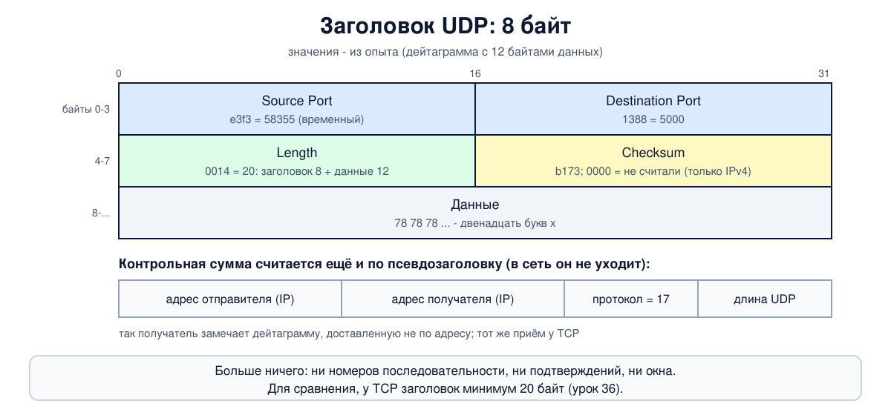

# Урок 35. UDP: дейтаграммы без гарантий

В уроке 34 мы разобрали порты и сокеты. Теперь - первый из двух транспортных протоколов интернета, самый простой. **UDP** добавляет к IP номера портов и простую контрольную сумму - и больше ничего: ни соединений, ни подтверждений, ни повторов. Кажется, что такой протокол годится только для игрушек, но на нём работают DNS, DHCP, синхронизация времени, звонки и видео, онлайн-игры, а в последние годы - QUIC и WireGuard. Разберём заголовок UDP по байтам, увидим в опыте, чем дейтаграммы отличаются от потока TCP, что бывает с ними при потерях и слишком большом размере, и почему именно UDP стал главным инструментом атак с усилением.

## Что делает UDP (и чего не делает)

UDP (User Datagram Protocol) описан в RFC 768 (1980). Оба наших автора подчёркивают его простоту. Олифер: UDP, как и IP, - дейтаграммный протокол, реализующий доставку "по возможности", без гарантий (урок 25). Таненбаум: весь смысл UDP вместо голого IP - в портах отправителя и получателя, без них транспортный уровень не знал бы, какой программе отдать пакет (урок 34).

Чего UDP **не делает** (Таненбаум перечисляет управление потоком, управление перегрузкой и повторную передачу; отсутствие соединений и порядка следует из самого устройства протокола):

- не устанавливает соединений: первая же дейтаграмма уже несёт данные;
- не подтверждает доставку и ничего не отправляет повторно: потерялось - значит, потерялось;
- не следит за порядком: дейтаграммы могут прийти не в том порядке, в каком ушли;
- не управляет потоком и перегрузкой: отправитель может слать сколько угодно, даже если сеть или получатель не справляются.

Всё это при необходимости делает сама программа. Зато UDP **сохраняет границы сообщений**: каждое сообщение программы уходит отдельной дейтаграммой и приходит к получателю целиком, одним куском. Олифер подчёркивает контраст с TCP: TCP режет поток байтов на сегменты без учёта смысла данных (урок 36). В опыте разница будет видна сразу.

## Заголовок UDP

Заголовок - **8 байт**, четыре поля по 2 байта:



- **порт отправителя** (Source Port) - нужен, чтобы получатель знал, куда ответить; Таненбаум объясняет: отвечающий просто копирует его в поле "порт получателя" своего ответа. Если ответ не нужен, поле может быть нулём;
- **порт получателя** (Destination Port) - по нему ядро находит сокет (урок 34);
- **длина** (Length) - длина всей дейтаграммы: заголовок плюс данные, от 8 байт. Поле 16-битное, но в IPv4 дейтаграмма не может быть больше, чем помещается в IP-пакет: 65 535 - 20 = 65 515 байт вместе с заголовком UDP, как пишет Таненбаум, то есть до 65 507 байт данных;
- **контрольная сумма** (Checksum) - считается по заголовку, данным и **псевдозаголовку**: адресам отправителя и получателя из IP, номеру протокола (17) и длине UDP. Таненбаум отмечает, что это нарушает иерархию уровней (адреса - дело IP), зато помогает поймать дейтаграмму, доставленную не по адресу. Тот же приём использует TCP.

Контрольная сумма UDP **в IPv4 необязательна**: ноль в поле означает "не считали" (настоящий ноль передают как `ffff`). Таненбаум считает отключение суммы глупостью, кроме редких случаев, когда важна каждая доля производительности. В **IPv6** сумма обязательна (урок 30): там нет контрольной суммы заголовка IP, и сумма UDP остаётся единственной сквозной проверкой, включающей адреса (исключения сделаны только для некоторых туннелей).

Пример Олифера: заголовок с портом отправителя `0x0035` = 53 - это ответ DNS-сервера. Олифер перечисляет поля в порядке "порты, контрольная сумма, длина", а в самом заголовке длина идёт третьей, сумма - четвёртой; так же и в его примере, и на рисунке у Таненбаума.

Если сумма не сошлась, UDP просто отбрасывает дейтаграмму, не сообщая никому, пишет Олифер. Исправлять ошибки UDP не умеет.

## Где работает UDP и почему

Таненбаум объясняет, когда UDP - "то, что доктор прописал": для программ, которые сами хотят управлять потоком, ошибками и временем. Особенно он полезен в схеме "короткий запрос - короткий ответ": если что-то потерялось, клиент через некоторое время просто спросит ещё раз. Не нужно тратить время на установку соединения, как у TCP. Главные случаи:

- **DNS** (блок 7): вопрос и ответ по одной дейтаграмме;
- **DHCP** (урок 29): у клиента ещё нет адреса, соединение установить не с кем, нужна широковещательная рассылка - а из транспортных протоколов её умеет только UDP: соединение TCP всегда связывает ровно два узла;
- **синхронизация времени** (NTP), управление оборудованием (SNMP), журналы (syslog);
- **голос, видео, игры**: опоздавший пакет уже бесполезен, повторять его нет смысла; программе важнее свежие данные, чем все данные;
- **новые протоколы поверх UDP**: QUIC (урок 43), на котором работает HTTP/3, и WireGuard (блок 10). QUIC строит поверх UDP свою надёжность, шифрование и управление перегрузкой. WireGuard - шифрованный туннель для IP-пакетов: он добавляет только шифрование и остаётся таким же ненадёжным, как UDP, а надёжность обеспечивает TCP внутри туннеля. UDP оба берут потому, что его пропускают почти все сети и NAT, тогда как новый протокол транспортного уровня многие устройства на пути просто не пропустят.

Таненбаум разбирает ещё **удалённый вызов процедур** (RPC): запрос по сети выглядит для программиста как вызов обычной функции, а под капотом идёт обмен дейтаграммами.

Раз UDP не управляет перегрузкой, программы на UDP обязаны делать это сами: RFC 8085 рекомендует им не забивать сеть, делать паузы при повторах и выбирать размер дейтаграмм под путь.

## Размер дейтаграммы и фрагментация

Дейтаграмма UDP едет в одном IP-пакете. Если она больше MTU пути, IP придётся её **фрагментировать** (урок 27): дейтаграмма в 3000 байт на обычном Ethernet превратится в три фрагмента. Потерялся любой - потеряна вся дейтаграмма, а фильтры на пути часто не пропускают фрагменты. Поэтому программы на UDP стараются укладываться в MTU пути: например, DNS сегодня рекомендует ответы по UDP не больше 1232 байт (так договорились в 2020 году: это минимальный MTU IPv6 1280 минус 40 байт заголовка IPv6 и 8 байт заголовка UDP, такой ответ пройдёт по любому пути IPv6 без фрагментации), а если данных больше, переходит на TCP.

## Как это увидеть в Linux

Соберём два узла, `a` (`192.0.2.1`) и `b` (`192.0.2.2`). На `b` будет маленький приёмник на Python, который печатает, сколько байт он получил за каждый вызов `recv`, на `a` - отправитель. Сравним UDP и TCP, прочитаем заголовок по байтам, отправим дейтаграмму без контрольной суммы, включим потерю 30% пакетов и отправим одну большую дейтаграмму. Нужны Linux (подойдёт WSL2), права sudo, python3, tcpdump и ethtool (`sudo apt install python3 tcpdump ethtool`); всё создаётся в пространствах имён `hbh-*` и в конце удаляется.

Одна тонкость: ядро не считает контрольную сумму само, если интерфейс обещает досчитать её аппаратно (разгрузка, offload). Так делают многие настоящие сетевые карты; виртуальный veth тоже так обещает, но досчитывать сумму там некому. Пакет уходит на другой конец veth с ещё не досчитанной суммой, и tcpdump (у нас он слушает на `b`) пишет `bad udp cksum`, хотя всё в порядке. Чтобы видеть настоящую сумму, мы выключаем разгрузку на `a` командой `ethtool -K eth0 tx off`. Если увидишь `bad cksum` в своей записи, снятой на машине-отправителе, почти наверняка причина та же.

Создай файл `udp-lab.sh` и запусти `bash udp-lab.sh`:

```
set -u
for c in python3 tcpdump tc ethtool; do
  command -v $c >/dev/null || { echo "нужен $c: sudo apt install python3 tcpdump iproute2 ethtool"; exit 1; }
done
# убрать остатки прошлого запуска
for n in hbh-a hbh-b; do
  sudo ip netns pids $n 2>/dev/null | xargs -r sudo kill
  sudo ip netns del $n 2>/dev/null
done
d=$(mktemp -d)
chmod 755 "$d"
for n in hbh-a hbh-b; do sudo ip netns add $n; done
sudo ip link add eth0 netns hbh-a type veth peer name eth0 netns hbh-b
sudo ip netns exec hbh-a ip addr add 192.0.2.1/24 dev eth0
sudo ip netns exec hbh-b ip addr add 192.0.2.2/24 dev eth0
for n in hbh-a hbh-b; do
  sudo ip netns exec $n ip link set lo up
  sudo ip netns exec $n ip link set eth0 up
done
# veth по умолчанию оставляет подсчёт контрольной суммы "сетевой карте" (offload),
# и на b пакет приходит с недосчитанной суммой; выключаем, чтобы видеть настоящую
sudo ip netns exec hbh-a ethtool -K eth0 tx off >/dev/null
# приёмник на b: UDP 5000 и TCP 5000; печатает, сколько байт получил за каждый вызов recv
cat > "$d/recv.py" <<'EOF'
import socket, sys, time
proto, n = sys.argv[1], int(sys.argv[2])
if proto == "udp":
    s = socket.socket(socket.AF_INET, socket.SOCK_DGRAM); s.bind(("0.0.0.0", 5000))
    s.settimeout(3)
    got = []
    try:
        while len(got) < n:
            got.append(len(s.recv(65535)))
    except socket.timeout:
        pass
else:
    l = socket.socket(); l.setsockopt(socket.SOL_SOCKET, socket.SO_REUSEADDR, 1)
    l.bind(("0.0.0.0", 5000)); l.listen(); c, _ = l.accept()
    time.sleep(1)              # дать всем данным прийти
    got = []
    while True:
        b = c.recv(65535)
        if not b: break
        got.append(len(b))
print(proto, "recv calls:", len(got), "sizes:", got if len(got) <= 6 else f"{got[:3]}... total {sum(got)}")
EOF
# отправитель на a
cat > "$d/send.py" <<'EOF'
import socket, sys, time
proto, sizes = sys.argv[1], [int(x) for x in sys.argv[2].split(",")]
nocheck = len(sys.argv) > 3
if proto == "udp":
    s = socket.socket(socket.AF_INET, socket.SOCK_DGRAM)
    if nocheck:
        s.setsockopt(socket.SOL_SOCKET, 11, 1)   # SO_NO_CHECK: не считать контрольную сумму (только IPv4)
    for z in sizes:
        s.sendto(b"x" * z, ("192.0.2.2", 5000)); time.sleep(0.02)
else:
    s = socket.create_connection(("192.0.2.2", 5000))
    for z in sizes:
        s.sendall(b"x" * z)
    s.close()
EOF
run() {  # протокол, размеры, сколько ждать, [nocheck]
  sudo ip netns exec hbh-b python3 "$d/recv.py" $1 $3 &
  sleep 0.5
  sudo ip netns exec hbh-a python3 "$d/send.py" $1 $2 ${4:-}
  wait
}
echo '--- 1. three messages: 100, 200 and 300 bytes'
run udp 100,200,300 3
run tcp 100,200,300 3
echo '--- 2. one UDP datagram on the wire, byte by byte'
sudo ip netns exec hbh-b timeout 4 tcpdump -i eth0 -n -vv -x -c 1 udp 2>/dev/null > "$d/one" &
sleep 1
run udp 12 1
sed -E 's/^[0-9:.]+ //' "$d/one"
echo '--- 3. the same, but without a checksum (allowed in IPv4 only)'
sudo ip netns exec hbh-b timeout 4 tcpdump -i eth0 -n -vv -c 1 udp 2>/dev/null > "$d/nock" &
sleep 1
run udp 12 1 nocheck
sed -E 's/^[0-9:.]+ //' "$d/nock"
echo '--- 4. 30% loss on the link: 50 datagrams vs 50 TCP writes'
sudo ip netns exec hbh-a tc qdisc add dev eth0 root netem loss 30%
sizes=$(python3 -c 'print(",".join(["100"]*50))')
run udp "$sizes" 50
run tcp "$sizes" 50
sudo ip netns exec hbh-a tc qdisc del dev eth0 root
echo '--- 5. one datagram of 3000 bytes over a 1500-byte link'
sudo ip netns exec hbh-b timeout 4 tcpdump -i eth0 -n -v -l udp or '(ip[6:2] & 0x1fff != 0)' 2>/dev/null > "$d/big" &
sleep 1
run udp 3000 1
sed -E 's/^[0-9:.]+ //' "$d/big" | grep -E 'IP \(|> 192'
echo '--- cleanup'
for n in hbh-a hbh-b; do
  sudo ip netns pids $n 2>/dev/null | xargs -r sudo kill
  sudo ip netns del $n
done
rm -rf "$d"
ip netns list | grep -cE '^hbh-(a|b)( |$)'
```

Вот что получилось на нашем сервере:

```
--- 1. three messages: 100, 200 and 300 bytes
udp recv calls: 3 sizes: [100, 200, 300]
tcp recv calls: 1 sizes: [600]
--- 2. one UDP datagram on the wire, byte by byte
udp recv calls: 1 sizes: [12]
IP (tos 0x0, ttl 64, id 41884, offset 0, flags [DF], proto UDP (17), length 40)
    192.0.2.1.58355 > 192.0.2.2.5000: [udp sum ok] UDP, length 12
	0x0000:  4500 0028 a39c 4000 4011 1325 c000 0201
	0x0010:  c000 0202 e3f3 1388 0014 b173 7878 7878
	0x0020:  7878 7878 7878 7878
--- 3. the same, but without a checksum (allowed in IPv4 only)
udp recv calls: 1 sizes: [12]
IP (tos 0x0, ttl 64, id 42200, offset 0, flags [DF], proto UDP (17), length 40)
    192.0.2.1.41294 > 192.0.2.2.5000: [no cksum] UDP, length 12
--- 4. 30% loss on the link: 50 datagrams vs 50 TCP writes
udp recv calls: 33 sizes: [100, 100, 100]... total 3300
tcp recv calls: 3 sizes: [2048, 1500, 1452]
--- 5. one datagram of 3000 bytes over a 1500-byte link
udp recv calls: 1 sizes: [3000]
IP (tos 0x0, ttl 64, id 55153, offset 0, flags [+], proto UDP (17), length 1500)
    192.0.2.1.43781 > 192.0.2.2.5000: UDP, length 3000
IP (tos 0x0, ttl 64, id 55153, offset 1480, flags [+], proto UDP (17), length 1500)
    192.0.2.1 > 192.0.2.2: ip-proto-17
IP (tos 0x0, ttl 64, id 55153, offset 2960, flags [none], proto UDP (17), length 68)
    192.0.2.1 > 192.0.2.2: ip-proto-17
--- cleanup
0
```

Разберём по шагам.

- **Шаг 1: границы сообщений.** Отправитель трижды отправил 100, 200 и 300 байт. По UDP приёмник трижды вызвал `recv` и получил ровно `[100, 200, 300]`: каждая дейтаграмма - отдельное сообщение. По TCP те же три отправки пришли **одним** куском в 600 байт: TCP - это поток байтов, границ между отправками в нём нет, и программа сама должна понимать, где кончается одно сообщение и начинается другое (урок 36). Один кусок получился потому, что наш приёмник ждёт секунду перед чтением и все данные успевают накопиться; без паузы кусков могло быть и два, и три - TCP этого не обещает.
- **Шаг 2: дейтаграмма по байтам.** tcpdump с `-x` показывает IP-пакет по байтам, а `-vv` включает подробный разбор с проверкой контрольных сумм. Флаг `[DF]` здесь не противоречит шагу 5: Linux ставит его на дейтаграммы, которые помещаются в MTU, а слишком большие режет на фрагменты сам, уже без DF. Первые 20 байт - заголовок IP (урок 25): `4500 0028` - IPv4, длина пакета 40 байт; `4011` - TTL 64 и протокол **17**, UDP. Дальше 8 байт UDP:
  - `e3f3` - порт отправителя, 58355 (временный, урок 34);
  - `1388` - порт получателя, 5000;
  - `0014` - длина 20 байт: 8 заголовка и 12 данных;
  - `b173` - контрольная сумма, и tcpdump её проверил: `[udp sum ok]`;
  - дальше данные: `78` двенадцать раз - это двенадцать букв `x`.
- **Шаг 3: без контрольной суммы.** Та же дейтаграмма, но отправитель попросил ядро не считать сумму (параметр сокета `SO_NO_CHECK`, есть только для IPv4). tcpdump пишет `[no cksum]`: в поле ноль, и получатель спокойно её принял. В IPv6 такую дейтаграмму получатель бы отбросил.
- **Шаг 4: потери.** Мы включили на `a` потерю 30% пакетов (`tc ... netem loss 30%`, как в уроке 32) и отправили 50 дейтаграмм по 100 байт. Дошло 33, остальные пропали, и никто об этом не узнал: ни отправитель, ни получатель. У тебя число будет другим, примерно от 28 до 42. По TCP те же 50 отправок по 100 байт дошли **все** - 2048 + 1500 + 1452 = 5000 байт (у тебя куски могут быть другими, сумма та же), - хотя пакеты терялись так же: TCP сам заметил потери и отправил недостающее повторно (урок 40). Заодно видно, что куски, на которые TCP нарезал поток при чтении, не совпадают с тем, как данные отправляли.
- **Шаг 5: большая дейтаграмма.** 3000 байт данных плюс 8 байт заголовка UDP не помещаются в пакет на линии с MTU 1500. Ядро `a` разрезало пакет на три фрагмента (урок 27): все с одним `id`, смещения 0, 1480 и 2960, у первых двух флаг `[+]` ("будут ещё"). Заголовок UDP с портами есть только в первом фрагменте, поэтому у остальных tcpdump видит лишь `ip-proto-17`. Получатель собрал всё и получил дейтаграмму целиком: `[3000]`. Потеряйся любой фрагмент - потерялась бы вся.
- В конце `0`: пространства имён удалены.

## Безопасность: атаки с усилением через UDP

Урок 25 обещал вернуться к атакам с отражением и усилением - вот они, на уровне принципа.

**Принцип.** В UDP нет рукопожатия: сервер отвечает на первую же дейтаграмму и никак не проверяет, что адрес отправителя настоящий (подменить его можно, урок 25). Если ответ во много раз больше запроса, любой сервер, отвечающий всем подряд, может стать "усилителем": маленькие запросы с чужим адресом отправителя превращаются в большой поток ответов на этот адрес. Отношение размера ответа к размеру запроса называют **коэффициентом усиления**. Именно поэтому для таких атак годятся службы на UDP, а службы на TCP почти не годятся: у TCP до отправки данных нужно рукопожатие, которое с поддельного адреса не завершить (урок 37).

Олифер разбирает атаку 2013 года на сайт организации Spamhaus: около 30 тысяч **открытых рекурсивных DNS-серверов**, отвечающих кому угодно, засыпали её ответами. Одна неточность в его описании: он пишет, что для усиления использовали передачу файла зоны (AXFR), но такая передача идёт по TCP, и открытые резолверы её не выполняют; в той атаке использовали обычные запросы по UDP с большим ответом (тип ANY). Олифер описывает и более простые разновидности: затопление узла потоком дейтаграмм (UDP не требует соединения, и получатель обязан принять и разобрать каждую) и отражение через древние отладочные службы echo и chargen, которые сегодня обычно выключены. В разные годы усилителями служили и другие службы на UDP - серверы времени, служебные протоколы устройств, кэширующие серверы; каждый раз причина одна: большой ответ на маленький запрос от кого угодно.

**Защита** - с четырёх сторон:

- **Владельцы служб** не дают своим серверам стать усилителями: отвечают только своим клиентам (например, рекурсивный DNS - только своей сети), выключают устаревшие "болтливые" функции и старые отладочные службы вроде echo и chargen, ограничивают частоту ответов одному адресу (для DNS это RRL), закрывают служебные порты от интернета (урок 34).
- **Сети-источники** не выпускают пакеты с чужим адресом отправителя (BCP 38, урок 25): без подмены адреса отражение невозможно.
- **Разработчики протоколов** закладывают правило "не отвечай большим на маленькое, пока не убедился в адресе": QUIC до проверки адреса клиента отправляет не больше трёх байт на каждый полученный (RFC 9000), DNS-серверы могут требовать подтверждение адреса (DNS cookies, RFC 7873).
- **Жертвы** защищаются распределённой инфраструктурой: трафик принимают сети с огромной пропускной способностью и адресами anycast (урок 30) и отсеивают мусор до того, как он дойдёт до сервера. Олифер описывает, что так и остановили атаку на Spamhaus.

Подробнее об атаках на DNS и защите - в уроке 65.

## Итог

- UDP (RFC 768) добавляет к IP порты и контрольную сумму, больше ничего: ни соединений, ни подтверждений, ни порядка, ни управления перегрузкой. Зато он сохраняет границы сообщений.
- Заголовок - 8 байт: порт отправителя, порт получателя, длина, контрольная сумма. Сумма считается с псевдозаголовком (адреса и протокол из IP); в IPv4 она необязательна, в IPv6 обязательна.
- UDP выбирают, когда важны скорость и простота или свежесть данных: DNS, DHCP, NTP, голос и видео, игры, а также QUIC (своя надёжность) и WireGuard (шифрованный туннель).
- Большая дейтаграмма фрагментируется на уровне IP, и потеря любого фрагмента губит её целиком, поэтому программы на UDP держат размер в пределах MTU пути.
- Отсутствие рукопожатия делает UDP-службы потенциальными усилителями для атак с подменой адреса. Защита - отвечать только своим, ограничивать частоту, не выпускать поддельные адреса (BCP 38), проектировать протоколы без усиления.

## Что почитать

- Олифер, "Компьютерные сети", глава 15, с. 471-472: протокол UDP и формат дейтаграммы; глава 29, с. 908-909: UDP-атаки; с. 915-916: атака отражением от DNS-серверов.
- Таненбаум, "Компьютерные сети", раздел 6.4.1, с. 611-613: основы UDP, заголовок и псевдозаголовок; раздел 6.4.2, с. 613-614: удалённый вызов процедур.
- RFC 768 (UDP), RFC 8085 (правила использования UDP).
