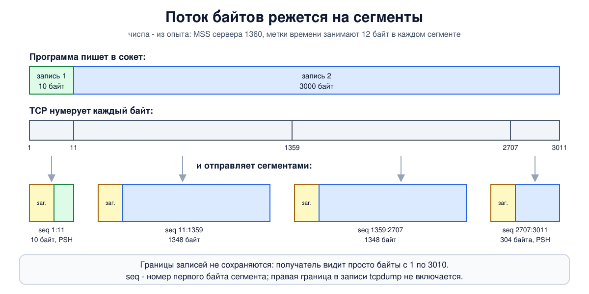
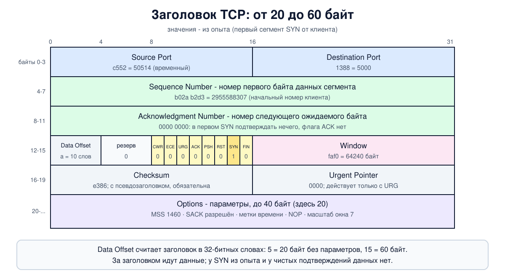

# Урок 36. TCP: поток байтов, сегмент и заголовок

UDP из урока 35 ничего не обещает. **TCP** обещает много: всё, что программа отправила, дойдёт до получателя целиком, без искажений, без повторов и в том же порядке - или отправитель рано или поздно получит ошибку. На TCP работают большая часть веба, почта, SSH, базы данных и почти все прокси-протоколы из второй половины курса. Блок о TCP займёт семь уроков; в этом - устройство: что такое поток байтов, как он режется на сегменты и что лежит в каждом поле заголовка. Следующие уроки разберут по очереди, как соединение открывается (37) и закрывается (38), как работает окно (39), повторная передача (40) и контроль перегрузки (41).

## Что обещает TCP

TCP (Transmission Control Protocol) описан в RFC 793 (1981); Таненбаум перечисляет несколько RFC, которые его с тех пор дополняли. В 2022 году базовую спецификацию с накопившимися исправлениями переиздали как RFC 9293 - это действующий стандарт (в книге его ещё нет); расширения (масштаб окна и метки времени, SACK, ECN, контроль перегрузки) остаются в отдельных RFC.

Олифер формулирует главное так: TCP строит гарантированную доставку поверх ненадёжного дейтаграммного сервиса IP, и делает это с помощью **логического соединения**. Соединение здесь - не провод и не маршрут в сети: обычные маршрутизаторы о нём ничего не знают (урок 25; исключение - NAT и межсетевые экраны, до них дойдём в блоке 6). Это договорённость двух конечных узлов и состояние, которое каждый из них хранит у себя: какие байты отправлены, какие подтверждены, сколько готов принять сосед.

Свойства службы TCP по Таненбауму:

- **соединение нужно установить явно**, прежде чем передавать данные (урок 37);
- оно **двухточечное**: у него ровно два конца. Широковещательной и групповой рассылки в TCP нет - поэтому DHCP работает на UDP (урок 35);
- оно **полнодуплексное**: данные идут в обе стороны одновременно и независимо;
- это **поток байтов, а не поток сообщений**: границы между отправками не сохраняются.

Последнее мы видели в уроке 35: три отправки по 100, 200 и 300 байт приёмник прочитал одним куском в 600. Таненбаум сравнивает TCP с файлом: читая файл, нельзя узнать, записали его одним куском или побайтно. Следствие для программиста: протокол поверх TCP обязан сам размечать сообщения - длиной в начале, разделителем или как-то ещё. HTTP, TLS и все прокси-протоколы так и делают.

## От потока к сегментам

Программа пишет байты в сокет. TCP складывает их в буфер и, как пишет Олифер, "вырезает" из буфера непрерывные куски, снабжая каждый заголовком. Такой кусок с заголовком называется **сегментом**; каждый сегмент едет в своём IP-пакете. Олифер отдельно подчёркивает контраст с UDP: TCP делит поток на сегменты без учёта смысла и структуры данных.



Как TCP решает, где резать? Таненбаум называет два предела: сегмент должен помещаться в поле данных IP-пакета и в **MTU** канала, чтобы его не пришлось фрагментировать (урок 27). На Ethernet с MTU 1500 это 1500 - 20 (заголовок IP) - 20 (заголовок TCP) = **1460 байт**. Это число - **MSS** (Maximum Segment Size): сколько байт помещается в сегменте после обязательных 20 байт заголовка TCP. Если в сегменте есть параметры, данных на столько же меньше (увидим в опыте). Каждая сторона сообщает свой MSS другой при установлении соединения. Подробно об MSS, MTU и туннелях - в уроке 42.

В остальном TCP свободен: он может склеить несколько мелких записей в один сегмент или разложить одну большую запись на несколько сегментов. В опыте мы увидим второе.

## Каждый байт имеет номер

Ключевая идея TCP, по словам Таненбаума, определяющая всю структуру протокола: **у каждого байта в соединении есть свой 32-разрядный порядковый номер**. Нумеруются не сегменты, а байты. На этом держится всё остальное:

- получатель по номерам расставляет данные в правильном порядке и отбрасывает повторы;
- подтверждение - это тоже номер байта: "всё до этого номера я получил, жду его";
- потерянный кусок можно отправить заново в сегментах другого размера - номера байтов от этого не изменятся.

У каждого направления своя нумерация, и начинается она не с нуля, а со случайного начального номера (ISN), который выбирается при установлении соединения; зачем он случайный - в уроках 37 и 38.

32 разряда - это около 4 миллиардов байт, после чего счётчик идёт по кругу. Таненбаум замечает: на линии 56 кбит/с на полный круг уходило больше недели, а при современных скоростях номера кончаются пугающе быстро (на 1 Гбит/с - примерно за 34 секунды). Чтобы не спутать новые данные со старыми, используют метки времени из параметров заголовка, о них ниже.

## Заголовок TCP

Заголовок - **минимум 20 байт**, с параметрами до 60:



- **порт отправителя и порт получателя** (по 16 бит) - как в UDP. Вместе с адресами из заголовка IP и номером протокола они дают пятёрку, которая определяет соединение (урок 34);
- **порядковый номер** (Sequence Number, 32 бита) - номер **первого байта данных** этого сегмента;
- **номер подтверждения** (Acknowledgment Number, 32 бита) - номер **следующего байта, который получатель ждёт**, а не последнего полученного. Таненбаум называет такое подтверждение накопительным: одно число сообщает обо всех данных до него;
- **длина заголовка** (Data Offset, 4 бита) - в 32-битных словах, как IHL в заголовке IP (урок 25). Нужна, потому что из-за параметров заголовок бывает разной длины. Минимум 5 (20 байт), максимум 15 (60 байт);
- 4 зарезервированных бита;
- **восемь флагов**, по одному биту;
- **окно** (Window, 16 бит) - сколько ещё байт получатель готов принять, считая от номера подтверждения. Так получатель притормаживает отправителя, это управление потоком (урок 39);
- **контрольная сумма** (16 бит) - по заголовку, данным и псевдозаголовку, как в UDP (урок 35), только протокол в псевдозаголовке - 6. В отличие от UDP, в TCP сумма обязательна всегда;
- **указатель срочности** (Urgent Pointer, 16 бит) - действует только с флагом URG; Таненбаум описывает срочные данные как неудачный исторический механизм, которым пользоваться не рекомендуется;
- **параметры** (Options) - до 40 байт.

### Флаги

Олифер называет их кодовыми битами и перечисляет шесть; Таненбаум - восемь, с двумя более поздними:

- **SYN** - открытие соединения, "синхронизация счётчиков" (урок 37);
- **ACK** - поле "номер подтверждения" действует. Установлен почти во всех сегментах, кроме самого первого SYN;
- **FIN** - у отправителя больше нет данных; так соединение закрывают (урок 38). Получать данные после своего FIN всё ещё можно;
- **RST** - немедленный сброс соединения: что-то пошло не так или соединения с такими параметрами нет. RST приходит и в ответ на попытку соединиться с закрытым портом (урок 34);
- **PSH** - просьба не задерживать данные в буфере, а сразу отдать программе. Таненбаум отмечает, что программа сама этот флаг не ставит; на практике Linux обычно ставит PSH на последнем сегменте каждой записи;
- **URG** - действует указатель срочности;
- **ECE** и **CWR** - явное уведомление о перегрузке, ECN (RFC 3168, урок 41).

Флаги SYN и FIN сами данными не являются, но каждый **занимает один номер** в нумерации (сегмент с FIN при этом может нести и последние данные). Так их можно подтвердить без двусмысленности, тем же механизмом, что и данные; Таненбаум объясняет это на примере SYN.

### Параметры

Большинство параметров устроено по схеме "тип, длина, значение". Главные, по Таненбауму:

- **MSS** - наибольший сегмент, который узел готов принять. Если параметра нет, считается 536 байт. У каждого направления свой MSS;
- **масштаб окна** (Window Scale) - поле окна 16-битное, то есть не больше 65 535 байт, а для быстрых линий этого мало. Каждая сторона объявляет в SYN свой сдвиг (до 14) для окна, которое сообщает она сама: значение поля умножается на 2 в этой степени, что даёт окно до 1 Гбайт. Масштаб работает, только если параметр прислали обе стороны;
- **метки времени** (Timestamps) - позволяют точно измерять время оборота (урок 40) и защищают от путаницы, когда номера байтов прошли полный круг (PAWS);
- **выборочные подтверждения** (SACK) - получатель сообщает, какие куски дошли после "дырки", чтобы отправитель повторил только потерянное (урок 40).

MSS, масштаб окна и разрешение SACK передаются **только в сегментах SYN**, при установлении соединения; метки времени, если о них договорились, идут потом в каждом сегменте.

Три уточнения к книге. Таненбаум пишет, что параметры могут доходить до 40 байт - "максимального размера заголовка"; точнее, 40 байт - предел для параметров, а весь заголовок тогда занимает 60. Он же пишет, что все параметры имеют формат "тип, длина, значение" и длину, кратную 32 битам; на деле кратной четырём байтам должна быть длина всего заголовка, а сами параметры бывают разной длины, и два служебных (NOP и "конец списка") состоят из одного байта без длины - NOP как раз и служит для выравнивания, в опыте он будет виден. И номер RFC у SACK в одном месте книги дан как 2108 - это опечатка, правильно RFC 2018, как у него же в начале раздела.

## Как это увидеть в Linux

Соберём клиента `a` (`192.0.2.1`) и сервер `b` (`192.0.2.2`). У `b` сделаем MTU 1400 вместо 1500 - чтобы увидеть, как каждая сторона объявляет свой размер сегмента. Клиент откроет соединение, отправит 10 байт, потом 3000 байт одной записью и закроет свою сторону; сервер ответит `ok`. tcpdump запишет весь разговор. Нужны Linux (подойдёт WSL2), права sudo, python3, tcpdump и ethtool (`sudo apt install python3 tcpdump ethtool`); всё создаётся в пространствах имён `hbh-*` и в конце удаляется.

Создай файл `tcp-lab.sh` и запусти `bash tcp-lab.sh`:
```
set -u
for c in python3 tcpdump ethtool; do
  command -v $c >/dev/null || { echo "нужен $c: sudo apt install python3 tcpdump ethtool"; exit 1; }
done
# убрать остатки прошлого запуска
for n in hbh-a hbh-b; do
  sudo ip netns pids $n 2>/dev/null | xargs -r sudo kill
  sudo ip netns del $n 2>/dev/null
done
d=$(mktemp -d)
chmod 755 "$d"
# клиент a (192.0.2.1, MTU 1500) и сервер b (192.0.2.2, MTU 1400)
for n in hbh-a hbh-b; do sudo ip netns add $n; done
sudo ip link add eth0 netns hbh-a type veth peer name eth0 netns hbh-b
sudo ip netns exec hbh-a ip addr add 192.0.2.1/24 dev eth0
sudo ip netns exec hbh-b ip addr add 192.0.2.2/24 dev eth0
sudo ip netns exec hbh-b ip link set eth0 mtu 1400
for n in hbh-a hbh-b; do
  sudo ip netns exec $n ip link set lo up
  sudo ip netns exec $n ip link set eth0 up
  # считать контрольные суммы в ядре, чтобы tcpdump видел настоящие (урок 35)
  sudo ip netns exec $n ethtool -K eth0 tx off tso off gso off >/dev/null
done
# сервер: принимает одно соединение, читает всё до конца и отвечает "ok"
cat > "$d/server.py" <<'EOF'
import socket
l = socket.socket(); l.setsockopt(socket.SOL_SOCKET, socket.SO_REUSEADDR, 1)
l.bind(("0.0.0.0", 5000)); l.listen()
c, _ = l.accept()
data = b""
while True:
    b = c.recv(65535)
    if not b: break
    data += b
c.sendall(b"ok"); c.close()
EOF
# клиент: 10 байт, потом 3000 байт одной записью, потом закрывает свою сторону
cat > "$d/client.py" <<'EOF'
import socket, time
s = socket.create_connection(("192.0.2.2", 5000))
s.sendall(b"hello, TCP"); time.sleep(0.2)
s.sendall(b"x" * 3000); time.sleep(0.2)
s.shutdown(socket.SHUT_WR)
print("client got:", s.recv(100))
s.close()
EOF
sudo ip netns exec hbh-b python3 "$d/server.py" &
sleep 0.5
sudo ip netns exec hbh-b timeout 5 tcpdump -i eth0 -n -l -v -x tcp 2>/dev/null > "$d/raw" &
sudo ip netns exec hbh-b timeout 5 tcpdump -i eth0 -n -l tcp 2>/dev/null > "$d/rel" &
sudo ip netns exec hbh-b timeout 5 tcpdump -i eth0 -n -l -S tcp 2>/dev/null > "$d/abs" &
sleep 1
sudo ip netns exec hbh-a python3 "$d/client.py"
wait
echo '--- 1. the whole conversation (relative sequence numbers)'
sed -E 's/^[0-9:.]+ IP //; s/, options \[[^]]*\]//' "$d/rel"
echo '--- 2. options of the two SYN segments'
grep -E 'Flags \[S\.?\]' "$d/rel" | sed -E 's/^[0-9:.]+ IP //; s/, seq.*options/ options/; s/, length 0$//'
echo '--- 3. the same handshake with absolute sequence numbers'
head -3 "$d/abs" | sed -E 's/^[0-9:.]+ IP //; s/, options \[[^]]*\]//; s/, length 0$//'
echo '--- 4. the first SYN byte by byte (IP header 20 bytes, then TCP)'
awk '/Flags \[S\]/{f=1} f&&/0x00/{print} f&&/0x0030/{exit}' "$d/raw"
echo '--- cleanup'
for n in hbh-a hbh-b; do
  sudo ip netns pids $n 2>/dev/null | xargs -r sudo kill
  sudo ip netns del $n
done
rm -rf "$d"
ip netns list | grep -cE '^hbh-(a|b)( |$)'
```

Кроме подсчёта контрольных сумм (урок 35), мы выключили на veth ещё `tso` и `gso` - разгрузку сегментации. С ней ядро отдаёт "сетевой карте" один огромный сегмент, а режет его уже она, и tcpdump показал бы сегменты больше MTU. Если увидишь такое в своей записи на обычной машине - причина в этом, а не в нарушении правил.

Вот что получилось на нашем сервере:
```
client got: b'ok'
--- 1. the whole conversation (relative sequence numbers)
192.0.2.1.50514 > 192.0.2.2.5000: Flags [S], seq 2955588307, win 64240, length 0
192.0.2.2.5000 > 192.0.2.1.50514: Flags [S.], seq 1092705827, ack 2955588308, win 64704, length 0
192.0.2.1.50514 > 192.0.2.2.5000: Flags [.], ack 1, win 502, length 0
192.0.2.1.50514 > 192.0.2.2.5000: Flags [P.], seq 1:11, ack 1, win 502, length 10
192.0.2.2.5000 > 192.0.2.1.50514: Flags [.], ack 11, win 506, length 0
192.0.2.1.50514 > 192.0.2.2.5000: Flags [.], seq 11:1359, ack 1, win 502, length 1348
192.0.2.2.5000 > 192.0.2.1.50514: Flags [.], ack 1359, win 502, length 0
192.0.2.1.50514 > 192.0.2.2.5000: Flags [.], seq 1359:2707, ack 1, win 502, length 1348
192.0.2.2.5000 > 192.0.2.1.50514: Flags [.], ack 2707, win 502, length 0
192.0.2.1.50514 > 192.0.2.2.5000: Flags [P.], seq 2707:3011, ack 1, win 502, length 304
192.0.2.2.5000 > 192.0.2.1.50514: Flags [.], ack 3011, win 502, length 0
192.0.2.1.50514 > 192.0.2.2.5000: Flags [F.], seq 3011, ack 1, win 502, length 0
192.0.2.2.5000 > 192.0.2.1.50514: Flags [P.], seq 1:3, ack 3012, win 502, length 2
192.0.2.1.50514 > 192.0.2.2.5000: Flags [.], ack 3, win 502, length 0
192.0.2.2.5000 > 192.0.2.1.50514: Flags [F.], seq 3, ack 3012, win 502, length 0
192.0.2.1.50514 > 192.0.2.2.5000: Flags [.], ack 4, win 502, length 0

--- 2. options of the two SYN segments
192.0.2.1.50514 > 192.0.2.2.5000: Flags [S] options [mss 1460,sackOK,TS val 3207457405 ecr 0,nop,wscale 7]
192.0.2.2.5000 > 192.0.2.1.50514: Flags [S.] options [mss 1360,sackOK,TS val 4100057078 ecr 3207457405,nop,wscale 7]
--- 3. the same handshake with absolute sequence numbers
192.0.2.1.50514 > 192.0.2.2.5000: Flags [S], seq 2955588307, win 64240
192.0.2.2.5000 > 192.0.2.1.50514: Flags [S.], seq 1092705827, ack 2955588308, win 64704
192.0.2.1.50514 > 192.0.2.2.5000: Flags [.], ack 1092705828, win 502
--- 4. the first SYN byte by byte (IP header 20 bytes, then TCP)
	0x0000:  4500 003c c944 4000 4006 ed73 c000 0201
	0x0010:  c000 0202 c552 1388 b02a b2d3 0000 0000
	0x0020:  a002 faf0 e386 0000 0204 05b4 0402 080a
	0x0030:  bf2d ea7d 0000 0000 0103 0307
--- cleanup
0
```

Разберём.

**Как читать строку tcpdump.** `Flags [...]` - флаги: `S` - SYN, `F` - FIN, `P` - PSH, `R` - RST, а точка означает ACK. `[S.]` - это SYN и ACK вместе, `[P.]` - PSH и ACK. `seq 1:11` - сегмент несёт байты с номера 1 по номер 10 (правая граница не включается), `length 10` - столько данных. `ack 11` - "жду байт номер 11". `win` - значение поля окна.

**Шаг 1: весь разговор.** Шестнадцать сегментов, по порядку:

- Строки 1-3 - установление соединения: `[S]`, `[S.]`, `[.]`. Подробно в уроке 37; сейчас заметь только, что данных в них нет (`length 0`).
- Строка 4: клиент отправил 10 байт, `seq 1:11`, с флагом `P` - запись кончилась. Строка 5: сервер подтвердил, `ack 11`.
- Строки 6, 8 и 10: запись в 3000 байт ушла **тремя сегментами**: 1348, 1348 и 304 байта (`11:1359`, `1359:2707`, `2707:3011`). Флаг `P` стоит только на последнем. Номера идут встык: каждый следующий сегмент начинается с байта, на котором кончился предыдущий. Здесь сервер отвечает подтверждением на каждый сегмент, с номером следующего ожидаемого байта: 1359, 2707, 3011. Так бывает не всегда: часто одно подтверждение приходит на два сегмента (урок 39).
- Строка 12: клиент закрыл свою сторону, `[F.]` с `seq 3011`. Строка 13: сервер отправляет свои 2 байта (`ok`, `seq 1:3`) и подтверждает `ack 3012` - на единицу больше предыдущего подтверждения 3011, хотя новых данных не было: **FIN занял один номер**. Отправить ответ после чужого FIN можно: закрыта только одна сторона.
- Строки 15-16: сервер закрывает свою сторону, `[F.]` с `seq 3`, клиент подтверждает `ack 4`.

Всего клиент передал 10 + 3000 = 3010 байт, они заняли номера с 1 по 3010, FIN - номер 3011.

**Почему 1348, а не 1460.** Это видно в шаге 2. Клиент в своём SYN объявил `mss 1460` (его MTU 1500 минус 40), а сервер в ответе - `mss 1360` (его MTU 1400 минус 40). Клиент обязан уважать MSS сервера, поэтому его сегменты не больше 1360 байт вместе с параметрами. В каждом сегменте после рукопожатия едут метки времени: 10 байт параметра и 2 байта NOP для выравнивания, итого 12. 1360 - 12 = **1348**. IP-пакет при этом занимает 20 + 20 + 12 + 1348 = 1400 байт, ровно MTU сервера.

**Шаг 2: параметры в SYN.** Обе стороны объявили: `mss`; `sackOK` - "я умею выборочные подтверждения"; `TS val ... ecr ...` - метки времени (своя и эхо чужой: в ответе сервера `ecr` равен `val` клиента); `wscale 7` - окно умножать на 2 в 7-й степени, то есть на 128; `nop` - однобайтовый заполнитель для выравнивания. У тебя `wscale` может быть другим: ядро выбирает его по наибольшему размеру приёмного буфера, а он по умолчанию зависит от объёма памяти (в WSL2 у нас получилось 10).

**Окно и масштаб.** В SYN окно `64240` и `64704` - настоящие значения: в сегментах SYN масштаб никогда не применяется. В следующих строках `win 502` - это уже значение поля, которое надо умножить на 128: 502 × 128 = 64 256 байт.

**Шаг 3: настоящие номера.** В шаге 1 tcpdump показывал **относительные** номера: после SYN он для удобства вычитает начальный номер, и счёт идёт с 1. С ключом `-S` видны настоящие. Клиент выбрал начальный номер 2955588307, сервер - 1092705827; оба случайные, у тебя будут другие. Сервер подтверждает `ack 2955588308` - начальный номер клиента плюс один: **SYN тоже занял один номер**. Клиент отвечает `ack 1092705828`. Поэтому первый байт данных в каждом направлении имеет относительный номер 1.

**Шаг 4: SYN по байтам.** Первые 20 байт - заголовок IP (урок 25): `4500 003c` - IPv4, длина пакета 60 байт; `4006` - TTL 64 и протокол **6**, TCP. Дальше заголовок TCP, 40 байт:

- `c552` - порт отправителя, 50514 (временный); `1388` - порт получателя, 5000;
- `b02a b2d3` - порядковый номер, 2955588307: то самое число из шага 3;
- `0000 0000` - номер подтверждения: подтверждать ещё нечего, флага ACK нет;
- `a002` - первая цифра `a` = 10 слов, то есть заголовок 40 байт; вторая цифра `0` - резерв; `02` - флаги, установлен один бит SYN;
- `faf0` - окно, 64240;
- `e386` - контрольная сумма; `0000` - указатель срочности;
- параметры, 20 байт: `0204 05b4` - тип 2 (MSS), длина 4, значение 1460; `0402` - тип 4 (SACK разрешён), длина 2; `080a bf2d ea7d 0000 0000` - тип 8 (метки времени), длина 10, своя метка и пустое эхо; `01` - NOP; `0303 07` - тип 3 (масштаб окна), длина 3, значение 7.

20 байт IP + 20 байт обязательного заголовка TCP + 20 байт параметров = 60, как и сказано в поле длины IP. Данных в SYN нет.

В конце `0`: пространства имён удалены.

## Итог

- TCP даёт надёжный упорядоченный поток байтов поверх ненадёжного IP. Соединение - это состояние на двух конечных узлах, сеть о нём не знает. Оно двухточечное и полнодуплексное.
- Границы записей не сохраняются: TCP режет поток на сегменты как ему удобно, не больше MSS. MSS стороны объявляют в SYN, обычно это MTU минус 40.
- Нумеруется каждый байт. Порядковый номер - номер первого байта сегмента, номер подтверждения - следующий ожидаемый байт. SYN и FIN занимают по одному номеру.
- Заголовок - от 20 до 60 байт: порты, два номера, длина заголовка, флаги (SYN, ACK, FIN, RST, PSH, URG, ECE, CWR), окно, контрольная сумма, указатель срочности, параметры.
- Параметры MSS, масштаб окна и разрешение SACK каждая сторона объявляет в SYN; метки времени идут в каждом сегменте и уменьшают место под данные на 12 байт.

## Что почитать

- Олифер, "Компьютерные сети", глава 15, с. 472-474: протокол TCP и TCP-сегменты, формат заголовка, флаги, логическое соединение.
- Таненбаум, "Компьютерные сети", разделы 6.5.1-6.5.3, с. 623-627: основы TCP, модель службы, протокол; раздел 6.5.4, с. 628-631: заголовок TCP-сегмента.
- RFC 9293 (TCP, действующая редакция), RFC 7323 (масштаб окна и метки времени), RFC 2018 (SACK).