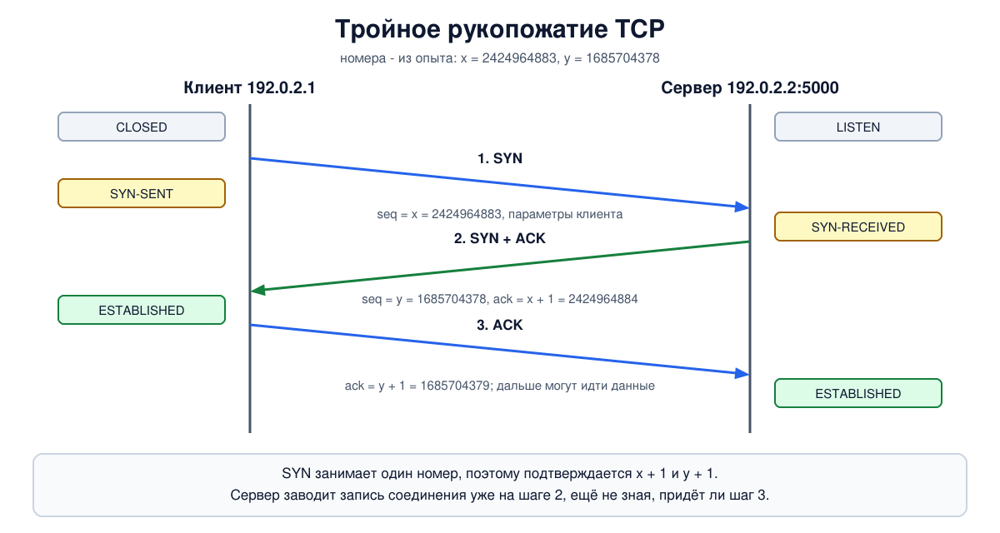
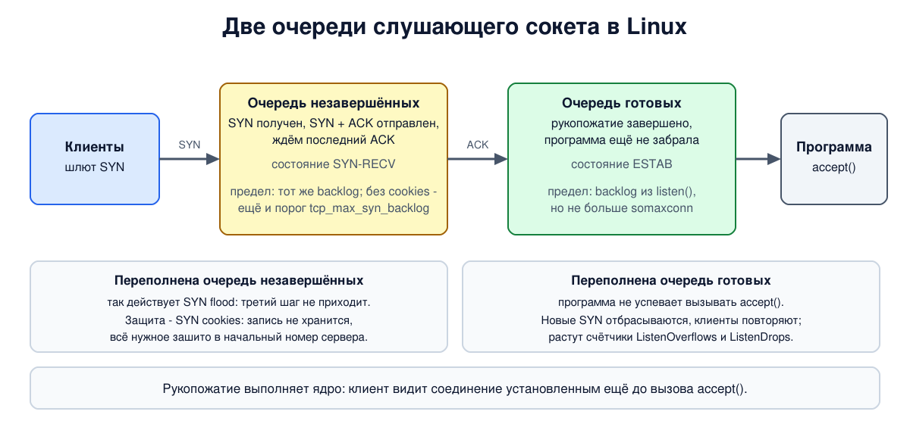

# Урок 37. Установление TCP-соединения: тройное рукопожатие и состояния

В уроке 36 мы видели три сегмента в начале каждого соединения: `[S]`, `[S.]`, `[.]`. Это **тройное рукопожатие**. За ним стоит непростой вопрос: как двум узлам, между которыми сеть теряет, задерживает и дублирует пакеты, договориться о начале разговора и не принять старый заблудившийся пакет за новый запрос. Разберём, почему шагов три, откуда берутся начальные номера, через какие состояния проходят клиент и сервер, что происходит, когда сегменты рукопожатия теряются, и как рукопожатие превращают в оружие - SYN flood - и как от этого защищаются.

## Зачем вообще рукопожатие

Олифер объясняет, что при установлении соединения каждая сторона сообщает другой три параметра: максимальный размер сегмента, который готова принимать, размер окна и **начальный порядковый номер** байта (урок 36). Сервер при этом выделяет под соединение ресурсы - буферы, таймеры, счётчики - и держит их до разрыва. Сам обмен у Олифера описан коротко: SYN, потом SYN и ACK, потом ACK; он сам оговаривает, что описание схематичное.

Почему шагов именно три, разбирает Таненбаум. Простая схема "запрос - согласие" не годится: сеть может задержать пакет и доставить его, когда о нём все забыли. Его пример - банк: клиент открыл соединение, попросил перевести деньги и закрыл соединение, а копии всех его пакетов задержались в сети и пришли позже в том же порядке. Банк принял бы их за новое соединение и перевёл деньги второй раз. Главная беда - **задержавшиеся дубликаты**, которые выглядят как новые пакеты.

Решение складывается из двух частей.

**Первая - ограничить время жизни пакета.** В IP за это отвечает TTL (урок 25). Таненбаум называет максимальное время жизни пакета в интернете - 120 секунд (в стандарте TCP это MSL, максимальное время жизни сегмента, те же две минуты; мы встретим его в уроке 38) - и вводит период T, в несколько раз больший, за который гарантированно исчезнут и сам пакет, и все подтверждения на него.

**Вторая - начинать каждое соединение с нового номера и проверять его у другой стороны.** Получатель не помнит номера прежних соединений, поэтому сам не может понять, свежий ли пришедший запрос. Он может только спросить отправителя: "ты действительно сейчас хочешь соединение с таким номером?" Отсюда три шага, которые предложил Томлинсон в 1975 году:

1. клиент: "хочу соединение, мой начальный номер x";
2. сервер: "согласен, мой начальный номер y, а твой x я получил";
3. клиент: "твой y я получил".

Если сервер получит старый дубликат первого шага, он ответит вторым шагом, но клиент, который такого соединения не открывал, откажется, и сервер о нём забудет. Таненбаум разбирает и худший случай, когда в сети блуждают и старый запрос, и старое подтверждение: сервер увидит, что подтверждён не тот номер, который он только что назвал. Вывод Таненбаума: не существует комбинации старых сегментов, которая установила бы соединение по ошибке.

Три шага - это минимум, при котором **каждая сторона получила подтверждение своего начального номера**: два запроса и два подтверждения, где ответ сервера объединяет подтверждение и встречный запрос.

## Рукопожатие в TCP



1. Клиент отправляет **SYN**: флаг SYN, порядковый номер x (его начальный номер, ISN), флага ACK нет. В этом же сегменте - параметры: MSS, масштаб окна, разрешение SACK, метка времени (урок 36).
2. Сервер отвечает **SYN и ACK**: свой начальный номер y и номер подтверждения x + 1. Плюс один - потому что SYN занимает один номер (урок 36). В сегменте его собственные параметры.
3. Клиент отправляет **ACK** с номером подтверждения y + 1. Этот сегмент уже может нести данные.

После третьего шага обе стороны знают оба начальных номера и параметры друг друга. Клиент считает соединение установленным сразу, как отправил третий сегмент, не зная, дошёл ли он; если этот ACK потерялся, сервер ещё какое-то время так не считает. Потерю восполнит повтор SYN и ACK от сервера или первый же сегмент данных клиента, в котором тоже есть подтверждение. Таненбаум описывает то же на своей иллюстрации и добавляет два случая:

- **порт никто не слушает** - в ответ на SYN приходит сегмент с флагом RST (урок 34);
- **одновременное открытие** - оба узла одновременно отправили SYN друг другу. Получится одно соединение, а не два, потому что соединение определяется парой адресов и портов. На практике это редкость.

В сегменте SYN формально могут ехать данные (Таненбаум приводит пример с паролем), но программе их отдают только после завершения рукопожатия, и обычные реализации данных в SYN не посылают.

## Начальные номера

Почему не начинать с нуля? По двум причинам.

**Задержавшиеся сегменты.** Если новое соединение с теми же адресами и портами начнёт с тех же номеров, старый сегмент прежнего соединения может попасть в окно нового и быть принят как данные. Исходная схема, которую описывает Таненбаум: начальный номер берётся с часов - счётчика, который непрерывно растёт (в исходном TCP - на единицу каждые 4 микросекунды), так что каждое новое соединение начинается с большего номера, чем предыдущее.

**Безопасность.** Таненбаум отмечает: если номер берётся с часов, его можно предсказать и открыть ложное соединение, обманув тройное рукопожатие. Иначе говоря, можно завершить рукопожатие от чужого адреса, даже не видя ответа сервера, - а именно на этом в уроке 25 держалась защита TCP от поддельных адресов. Знание номеров позволяет и вставлять сегменты в чужое соединение (урок 38). Поэтому сегодня начальные номера псевдослучайные. Действующее правило (RFC 6528, вошло в RFC 9293): номер складывается из показаний тех же часов и хеша от адресов, портов и секретного ключа узла. Для одной и той же пары адресов и портов номера по-прежнему растут, а для постороннего они непредсказуемы. Олифер тоже упоминает, что начальные номера выбираются случайно.

## Состояния соединения

Каждый конец соединения в каждый момент находится в одном из **11 состояний**; Таненбаум приводит их таблицей и схемой переходов (конечным автоматом). Для установления нужны пять:

- **CLOSED** - соединения нет;
- **LISTEN** - сервер ждёт входящих запросов (программа вызвала `listen`);
- **SYN-SENT** - клиент отправил SYN и ждёт ответа;
- **SYN-RECEIVED** - сервер получил SYN, ответил SYN и ACK и ждёт последнего ACK;
- **ESTABLISHED** - соединение установлено, идёт передача данных.

Путь клиента: CLOSED, после вызова `connect` - SYN-SENT, после получения SYN и ACK - ESTABLISHED. Путь сервера: LISTEN, после получения SYN - SYN-RECEIVED, после получения ACK - ESTABLISHED. Точнее, слушающий сокет так и остаётся в LISTEN, а через SYN-RECEIVED в ESTABLISHED проходит отдельная запись, которая заводится на каждое новое соединение. Остальные шесть состояний относятся к закрытию, их разберём в уроке 38. В книге названия пишутся без дефисов и короче (SYN RCVD), в выводе `ss` - `SYN-SENT`, `SYN-RECV`, `ESTAB`.

Состояние хранится в записи соединения в ядре. Олифер называет её блоком TCB и приводит размер: от 280 до 1300 байт в зависимости от операционной системы. Запомним, что сервер заводит такую запись **уже на втором шаге**, ещё не зная, придёт ли третий.

## Две очереди на сервере

В Linux у слушающего сокета две очереди:



- **очередь незавершённых соединений** - для тех, кто прислал SYN, но ещё не прислал последний ACK (состояние SYN-RECEIVED). В современных ядрах её предел на один сокет тот же, что у второй очереди (backlog из `listen`); настройка `net.ipv4.tcp_max_syn_backlog` действует, только когда выключены SYN cookies, о которых ниже;
- **очередь готовых соединений** - рукопожатие завершено, но программа ещё не забрала соединение вызовом `accept`. Её размер программа задаёт вторым аргументом `listen` (backlog), а сверху ограничивает `net.core.somaxconn`.

Рукопожатие выполняет ядро, без участия программы: клиент видит соединение установленным, даже если сервер ещё не вызвал `accept`. Если очередь готовых переполнена, Linux перестаёт принимать новые соединения на этот сокет, и клиенты, не получив ответа, повторяют SYN.

## Если сегмент потерялся

Сегменты рукопожатия теряются, как любые другие. Если подтверждение не пришло, отправитель по таймеру отправляет сегмент заново, и ожидание между повторами удваивается (в новых ядрах первые повторы SYN идут через равные промежутки, см. шаг 5; подробно о таймерах - в уроке 40):

- клиент повторяет **SYN**: в Linux первое ожидание 1 секунда, число повторов задаёт `net.ipv4.tcp_syn_retries` (по умолчанию 6); исчерпав их, `connect` возвращает ошибку "Connection timed out";
- сервер повторяет **SYN и ACK**: число повторов - `net.ipv4.tcp_synack_retries` (по умолчанию 5), после чего запись незавершённого соединения удаляется. Всё это время, около минуты, она занимает место в очереди.

Отсюда практическое правило диагностики: **"Connection refused" приходит сразу** - узел ответил RST, порт закрыт; **"Connection timed out" приходит через долгие секунды** - ответа нет вообще: узел выключен, пакеты отбрасывает фильтр или теряет сеть, либо сервер перегружен и не успевает принимать соединения (такой случай - в шаге 6 опыта, только там ждать до конца мы не стали). Быстрый отказ может прислать и фильтр на пути (блок 6).

## Как это увидеть в Linux

Соберём клиента `a` (`192.0.2.1`) и сервер `b` (`192.0.2.2`). Посмотрим два рукопожатия с настоящими номерами, состояния сокетов, отказ на закрытом порту; потом устроим потерю ответа сервера и увидим повторы с обеих сторон и состояния SYN-SENT и SYN-RECV; потом переполним очередь сервера, который не забирает соединения. Нужны Linux (подойдёт WSL2), права sudo, python3 и tcpdump (`sudo apt install python3 tcpdump iproute2`); всё создаётся в пространствах имён `hbh-*` и в конце удаляется. Опыт идёт около 30 секунд.

Создай файл `handshake-lab.sh` и запусти `bash handshake-lab.sh`:
```
set -u
for c in python3 tcpdump tc ss nstat; do
  command -v $c >/dev/null || { echo "нужен $c: sudo apt install python3 tcpdump iproute2"; exit 1; }
done
# убрать остатки прошлого запуска
for n in hbh-a hbh-b; do
  sudo ip netns pids $n 2>/dev/null | xargs -r sudo kill
  sudo ip netns del $n 2>/dev/null
done
d=$(mktemp -d)
chmod 755 "$d"
# клиент a (192.0.2.1) и сервер b (192.0.2.2)
for n in hbh-a hbh-b; do sudo ip netns add $n; done
sudo ip link add eth0 netns hbh-a type veth peer name eth0 netns hbh-b
sudo ip netns exec hbh-a ip addr add 192.0.2.1/24 dev eth0
sudo ip netns exec hbh-b ip addr add 192.0.2.2/24 dev eth0
for n in hbh-a hbh-b; do
  sudo ip netns exec $n ip link set lo up
  sudo ip netns exec $n ip link set eth0 up
done
A="sudo ip netns exec hbh-a"
B="sudo ip netns exec hbh-b"
# сервер: порт 5000 - принимает соединения и держит их; порт 6000 - слушает с очередью 2 и не принимает никого
cat > "$d/server.py" <<'EOF'
import socket, threading, time
def serve():
    l = socket.socket(); l.setsockopt(socket.SOL_SOCKET, socket.SO_REUSEADDR, 1)
    l.bind(("0.0.0.0", 5000)); l.listen(16)
    held = []
    while True:
        held.append(l.accept()[0])
threading.Thread(target=serve, daemon=True).start()
lazy = socket.socket(); lazy.setsockopt(socket.SOL_SOCKET, socket.SO_REUSEADDR, 1)
lazy.bind(("0.0.0.0", 6000)); lazy.listen(2)
time.sleep(120)
EOF
# клиент: открыть n соединений с портом и подержать их
cat > "$d/client.py" <<'EOF'
import socket, sys, time
port, n, timeout, hold = int(sys.argv[1]), int(sys.argv[2]), float(sys.argv[3]), float(sys.argv[4])
conns = []
for i in range(n):
    s = socket.socket(); s.settimeout(timeout)
    t = time.time()
    try:
        s.connect(("192.0.2.2", port)); conns.append(s)
        print(f"connect {i + 1}: ok")
    except OSError as e:
        print(f"connect {i + 1}: {e.strerror or e} after {time.time() - t:.0f} s")
time.sleep(hold)
EOF
$B python3 "$d/server.py" &
sleep 1
echo '--- 1. before: listening sockets on b'
$B ss -tln | awk '{print $1, $2, $3, $4}' | column -t
echo '--- 2. two connections: handshakes with real sequence numbers'
$B timeout 3 tcpdump -i eth0 -n -l -S 'tcp port 5000' 2>/dev/null > "$d/hs" &
sleep 1
$A python3 "$d/client.py" 5000 2 3 2 > "$d/c1" &
sleep 1.5
sed -E 's/^[0-9:.]+ IP //; s/, options \[[^]]*\]//; s/, length 0$//' "$d/hs"
echo '--- 3. sockets after the handshake: a, then b'
$A ss -tan | sed 1d | awk '{print $1, $4, $5}' | column -t
$B ss -tan 'sport = :5000' | sed 1d | awk '{print $1, $4, $5}' | column -t
wait %3 2>/dev/null
echo '--- 4. nobody listens on port 7000'
$B timeout 3 tcpdump -i eth0 -n -l 'tcp port 7000' 2>/dev/null > "$d/rst" &
sleep 1
$A python3 "$d/client.py" 7000 1 3 0
sleep 1.5
sed -E 's/^[0-9:.]+ IP //; s/, options \[[^]]*\]//; s/, length 0$//' "$d/rst"
echo '--- 5. the reply SYN+ACK gets lost: both sides keep retrying'
# три повтора SYN вместо шести, чтобы не ждать две минуты; в новых ядрах первые повторы идут
# через равные промежутки (tcp_syn_linear_timeouts) - выключаем, чтобы увидеть классическое удвоение
$A sysctl -qw net.ipv4.tcp_syn_retries=3
$A sysctl -qw net.ipv4.tcp_syn_linear_timeouts=0 2>/dev/null
# на входе a отбрасываем сегменты с флагами ровно SYN+ACK (байт флагов 0x12 по смещению 33 от начала IP-пакета)
$A tc qdisc add dev eth0 ingress
$A tc filter add dev eth0 ingress protocol ip u32 match ip protocol 6 0xff match u8 0x12 0xff at 33 action drop
$A timeout 17 tcpdump -i eth0 -n -l -ttt 'tcp port 5000' 2>/dev/null > "$d/lost" &
sleep 1
$A python3 "$d/client.py" 5000 1 30 0 > "$d/c2" &
sleep 2
echo 'a:'; $A ss -tan state syn-sent | sed 1d | awk '{print "SYN-SENT", $3, $4}' | column -t
echo 'b:'; $B ss -tan state syn-recv | sed 1d | awk '{print "SYN-RECV", $3, $4}' | column -t
wait %4 %5 2>/dev/null
sed -E 's/^ //; s/ IP / /; s/, options \[[^]]*\]//; s/, length 0$//; s/, win [0-9]+//' "$d/lost"
cat "$d/c2"
$A tc qdisc del dev eth0 ingress
echo '--- 6. a server that does not accept: queue of 2 on port 6000'
$A python3 "$d/client.py" 6000 5 2 1
$B ss -tln 'sport = :6000' | awk '{print $1, $2, $3, $4}' | column -t
$B nstat -asz TcpExtListenOverflows TcpExtListenDrops | sed 1d | awk '{print $1, $2}'
echo '--- 7. protective settings on b'
$B sysctl net.ipv4.tcp_syncookies net.ipv4.tcp_max_syn_backlog net.ipv4.tcp_synack_retries net.core.somaxconn
$B nstat -asz TcpExtSyncookiesSent TcpExtSyncookiesRecv | sed 1d | awk '{print $1, $2}'
echo '--- cleanup'
for n in hbh-a hbh-b; do
  sudo ip netns pids $n 2>/dev/null | xargs -r sudo kill
  sudo ip netns del $n
done
rm -rf "$d"
ip netns list | grep -cE '^hbh-(a|b)( |$)'
```

Вот что получилось на нашем сервере:
```
--- 1. before: listening sockets on b
State   Recv-Q  Send-Q  Local
LISTEN  0       2       0.0.0.0:6000
LISTEN  0       16      0.0.0.0:5000
--- 2. two connections: handshakes with real sequence numbers
192.0.2.1.54818 > 192.0.2.2.5000: Flags [S], seq 2424964883, win 64240
192.0.2.2.5000 > 192.0.2.1.54818: Flags [S.], seq 1685704378, ack 2424964884, win 65160
192.0.2.1.54818 > 192.0.2.2.5000: Flags [.], ack 1685704379, win 502
192.0.2.1.54830 > 192.0.2.2.5000: Flags [S], seq 2439487984, win 64240
192.0.2.2.5000 > 192.0.2.1.54830: Flags [S.], seq 790401240, ack 2439487985, win 65160
192.0.2.1.54830 > 192.0.2.2.5000: Flags [.], ack 790401241, win 502
--- 3. sockets after the handshake: a, then b
ESTAB  192.0.2.1:54818  192.0.2.2:5000
ESTAB  192.0.2.1:54830  192.0.2.2:5000
LISTEN  0.0.0.0:5000    0.0.0.0:*
ESTAB   192.0.2.2:5000  192.0.2.1:54818
ESTAB   192.0.2.2:5000  192.0.2.1:54830
--- 4. nobody listens on port 7000
connect 1: Connection refused after 0 s
192.0.2.1.36842 > 192.0.2.2.7000: Flags [S], seq 3394589257, win 64240
192.0.2.2.7000 > 192.0.2.1.36842: Flags [R.], seq 0, ack 3394589258, win 0
--- 5. the reply SYN+ACK gets lost: both sides keep retrying
a:
SYN-SENT  192.0.2.1:54840  192.0.2.2:5000
b:
SYN-RECV  192.0.2.2:5000  192.0.2.1:54840
00:00:00.000000 192.0.2.1.54840 > 192.0.2.2.5000: Flags [S], seq 1325621769
00:00:00.000031 192.0.2.2.5000 > 192.0.2.1.54840: Flags [S.], seq 882646946, ack 1325621770
00:00:01.027732 192.0.2.1.54840 > 192.0.2.2.5000: Flags [S], seq 1325621769
00:00:00.000043 192.0.2.2.5000 > 192.0.2.1.54840: Flags [S.], seq 882646946, ack 1325621770
00:00:00.000005 192.0.2.2.5000 > 192.0.2.1.54840: Flags [S.], seq 882646946, ack 1325621770
00:00:02.050442 192.0.2.1.54840 > 192.0.2.2.5000: Flags [S], seq 1325621769
00:00:00.000007 192.0.2.2.5000 > 192.0.2.1.54840: Flags [S.], seq 882646946, ack 1325621770
00:00:00.000021 192.0.2.2.5000 > 192.0.2.1.54840: Flags [S.], seq 882646946, ack 1325621770
00:00:04.029606 192.0.2.1.54840 > 192.0.2.2.5000: Flags [S], seq 1325621769
00:00:00.000046 192.0.2.2.5000 > 192.0.2.1.54840: Flags [S.], seq 882646946, ack 1325621770
00:00:00.000006 192.0.2.2.5000 > 192.0.2.1.54840: Flags [S.], seq 882646946, ack 1325621770
00:00:08.320281 192.0.2.2.5000 > 192.0.2.1.54840: Flags [S.], seq 882646946, ack 1325621770

connect 1: Connection timed out after 15 s
--- 6. a server that does not accept: queue of 2 on port 6000
connect 1: ok
connect 2: ok
connect 3: ok
connect 4: timed out after 2 s
connect 5: timed out after 2 s
State   Recv-Q  Send-Q  Local
LISTEN  3       2       0.0.0.0:6000
TcpExtListenOverflows 4
TcpExtListenDrops 4
--- 7. protective settings on b
net.ipv4.tcp_syncookies = 1
net.ipv4.tcp_max_syn_backlog = 256
net.ipv4.tcp_synack_retries = 5
net.core.somaxconn = 4096
TcpExtSyncookiesSent 0
TcpExtSyncookiesRecv 0
--- cleanup
0
```

Разберём по шагам.

- **Шаг 1.** `ss -tln` показывает слушающие сокеты (урок 34). Колонка `Send-Q` у слушающего сокета - это размер очереди готовых соединений: 16 и 2, как мы задали в `listen`. `Recv-Q` - сколько готовых соединений сейчас ждут `accept`: пока 0.
- **Шаг 2: два рукопожатия.** Ключ `-S` показывает настоящие номера. Клиент начал с `2424964883`, сервер ответил своим `1685704378` и подтвердил `2424964884` - номер клиента плюс один; клиент подтвердил `1685704379`. Во втором соединении, открытом долей секунды позже, номера `2439487984` и `790401240`: они не продолжают номера первого, потому что у другого порта клиента хеш другой.
- **Шаг 3: состояния.** На `a` два сокета в состоянии `ESTAB`. На `b` - слушающий сокет `LISTEN` и два соединения `ESTAB` с одним и тем же локальным адресом `192.0.2.2:5000`: различаются они адресом и портом клиента (урок 34).
- **Шаг 4: порт закрыт.** На SYN в порт 7000 пришёл сегмент `[R.]` - RST и ACK, с подтверждением номера клиента плюс один и нулевым окном. Программа сразу получила "Connection refused".
- **Шаг 5: потерянный ответ.** Мы поставили на входе `a` правило, которое отбрасывает сегменты с флагами SYN и ACK, то есть второй шаг рукопожатия не доходит. tcpdump на `a` пакеты всё равно видит: он стоит раньше правила. В этот момент клиент находится в состоянии `SYN-SENT`, а сервер - в `SYN-RECV`: он завёл запись и ждёт ACK. Ключ `-ttt` печатает время, прошедшее с предыдущей строки:
  - клиент отправил SYN и повторил его через 1, ещё через 2 и ещё через 4 секунды - ожидание удваивается. Номер в повторах тот же, `1325621769`: это тот же самый SYN;
  - сервер на каждый SYN отвечает SYN и ACK, и тоже с одним и тем же своим номером. Там, где строк с `[S.]` две подряд, - это ответ на повторный SYN и собственный повтор сервера по таймеру. Совпадение не случайно: оба таймера запущены в один момент и идут по одному расписанию - 1, 2, 4 секунды. Последняя строка - повтор сервера через 8 секунд, когда клиент уже перестал спрашивать;
  - через 15 секунд (1 + 2 + 4 + 8) клиент сдался: "Connection timed out". С настройками по умолчанию он ждал бы больше двух минут.
  
  В новых ядрах (с версии 6.5) первые несколько повторов SYN идут через равные промежутки в 1 секунду и только потом начинается удвоение (`net.ipv4.tcp_syn_linear_timeouts`); мы выключили это в скрипте, чтобы удвоение было видно сразу. На старых ядрах такой настройки нет, команда молча не сработает.
- **Шаг 6: сервер не забирает соединения.** На порту 6000 программа вызвала `listen` с очередью 2 и ни разу не вызвала `accept`. Три соединения клиент установил успешно - рукопожатие за программу выполнило ядро (Linux пускает в очередь на одно соединение больше заданного). Четвёртое и пятое не получили ответа и отвалились по нашему таймауту в 2 секунды. `ss` показывает `Recv-Q 3` при `Send-Q 2`: очередь переполнена. Счётчик `TcpExtListenOverflows` - сколько раз очередь готовых оказалась переполнена, `TcpExtListenDrops` - сколько всего запросов отброшено на слушающих сокетах. Здесь оба равны 4: два неудачных соединения, у каждого SYN и один повтор через секунду. Растущие значения на настоящем сервере означают, что программа не успевает принимать соединения.
- **Шаг 7: защитные настройки.** `tcp_syncookies = 1` - SYN cookies включатся сами при переполнении очереди незавершённых соединений; `tcp_max_syn_backlog` - дополнительный порог для этой очереди, когда cookies выключены (предел backlog действует всегда); `tcp_synack_retries` - сколько раз повторять SYN и ACK; `somaxconn` - верхний предел очереди готовых. Счётчики `SyncookiesSent` и `SyncookiesRecv` нулевые: до cookies дело не дошло. О них - в следующем разделе.
- В конце `0`: пространства имён удалены.

## Безопасность: SYN flood и SYN cookies

**Принцип.** В рукопожатии есть несимметрия: на втором шаге сервер заводит запись и держит её, пока не придёт третий шаг или не истечёт время, а отправителю SYN это не стоит ничего. Если SYN приходят потоком, а третьего шага нет, очередь незавершённых соединений заполняется, и новые запросы, в том числе от настоящих клиентов, сервер принять не может. Это **SYN flood**, атака отказа в обслуживании. Олифер относит её появление к 1996 году; Таненбаум пишет, что в 1990-е она парализовала многие веб-серверы. Оба отмечают: адрес отправителя в таких SYN часто поддельный (урок 25); Олифер поясняет, что подставляют адреса несуществующих узлов, и ответы сервера уходят в никуда. Олифер добавляет, что всплеска трафика при этом может и не быть: очередь невелика, и для её заполнения много пакетов не нужно; признак атаки - много SYN без завершающих ACK.

**Защита на сервере.** Таненбаум и Олифер называют близкие меры:

- **увеличить очередь** незавершённых соединений (Олифер), **сократить время их жизни** (оба; в Linux это число повторов SYN и ACK), при заполнении вытеснять самые старые записи (Таненбаум). Это отодвигает проблему, но не снимает её;
- **SYN cookies** - не хранить запись вовсе. Сервер выбирает свой начальный номер y не случайно, а вычисляет: несколько бит - счётчик времени, несколько бит - код MSS клиента, остальное - криптографический хеш от адресов, портов, счётчика времени и секрета сервера. Отправив SYN и ACK, сервер **забывает** о запросе. Настоящий клиент на третьем шаге пришлёт подтверждение y + 1; сервер вычтет единицу, пересчитает хеш и, если он сошёлся, заведёт соединение - восстановив MSS из тех же бит. Тому, кто отправил SYN с чужого адреса, ответ не придёт, y он не узнает и третий шаг подделать не сможет. Память до третьего шага не тратится, очередь не переполняется.

У cookies есть цена: в 32 бита номера не помещаются параметры из SYN клиента. Таненбаум описывает раскладку 5 бит времени, 3 бита MSS (то есть всего восемь возможных значений) и 24 бита хеша; масштаб окна и SACK в номер не влезают. Поэтому cookies включают не всегда, а только когда очередь переполнена: в Linux это значение `tcp_syncookies = 1`, которое мы видели в шаге 7. Современные реализации смягчают потерю: если клиент прислал метку времени, Linux прячет масштаб окна и разрешение SACK в младших битах своей метки, и они возвращаются в третьем шаге. Раскладка бит в Linux тоже своя, а значений MSS не восемь, а четыре.

Два уточнения к книгам. Олифер пишет, что сервер отправляет клиенту блок TCB в сжатом виде, а клиент повторяет его в ACK; он не уточняет, что "сжатый блок" - это и есть начальный номер сервера, и клиент ничего особенного не делает: как всегда, подтверждает этот номер плюс один. Таненбаум в разделе о TCP пишет, что cookies несовместимы с дополнительными параметрами и потому годятся только на время атаки, а в главе о безопасности об этой цене не упоминает: называет только восемь значений MSS и ускоренный рост номеров и считает это несущественным. Помнить стоит первое, с оговоркой про метки времени.

**Защита в сети.**

- Сети-источники не выпускают пакеты с чужими адресами отправителя (BCP 38, урок 25). Олифер описывает ту же идею как проверку обратного пути на маршрутизаторе: пакет пропускается, только если до его адреса отправителя есть маршрут через тот интерфейс, откуда он пришёл. Он же предупреждает, что при нескольких провайдерах такая проверка может отбрасывать и честные пакеты.
- Перед сервером ставят устройство или службу, которая завершает рукопожатие сама и передаёт серверу только состоявшиеся соединения, либо принимает трафик на распределённую инфраструктуру с запасом пропускной способности (урок 35).

Cookies защищают от SYN с поддельными адресами. Если рукопожатие честно завершают с множества настоящих узлов, это уже другая атака - на исчерпание соединений и ресурсов программы; она дороже, потому что атакующему тоже приходится держать соединения, и отбивают её ограничениями на число соединений с одного адреса (блок 6).

## Итог

- Тройное рукопожатие: SYN (x), SYN и ACK (y, подтверждение x + 1), ACK (подтверждение y + 1). Три шага - минимум, при котором каждая сторона получила подтверждение своего начального номера, и защита от задержавшихся дубликатов.
- Начальные номера не начинаются с нуля: это защищает от старых сегментов и от подделки. Сегодня они вычисляются из часов и хеша с секретом (RFC 6528).
- Состояния при установлении: у клиента CLOSED, SYN-SENT, ESTABLISHED; у сервера LISTEN, SYN-RECEIVED, ESTABLISHED. Всего состояний 11.
- На сервере две очереди: незавершённых соединений и готовых, ждущих `accept`. Рукопожатие выполняет ядро.
- Потерянные SYN и SYN с ACK повторяются с удвоением ожидания. "Refused" - быстрый отказ через RST, "timed out" - ответа нет.
- SYN flood заполняет очередь незавершённых соединений запросами, обычно с поддельных адресов. Защита: SYN cookies (состояние зашито в начальный номер сервера), настройка очереди и повторов, фильтрация поддельных адресов, защита на входе в сеть.

## Что почитать

- Олифер, "Компьютерные сети", глава 15, с. 474-478: логические соединения, параметры и установление соединения; глава 29, с. 901-903: затопление SYN-пакетами и защита.
- Таненбаум, "Компьютерные сети", раздел 6.2.2, с. 580-586: задержавшиеся дубликаты, начальные номера, тройное рукопожатие; разделы 6.5.5 и 6.5.7, с. 631-636: установка TCP-соединения, SYN cookies, состояния; раздел 8.2.4, с. 840-841: переполнение SYN-пакетами.
- RFC 9293 (TCP), RFC 6528 (начальные номера), RFC 4987 (SYN flood и меры защиты).