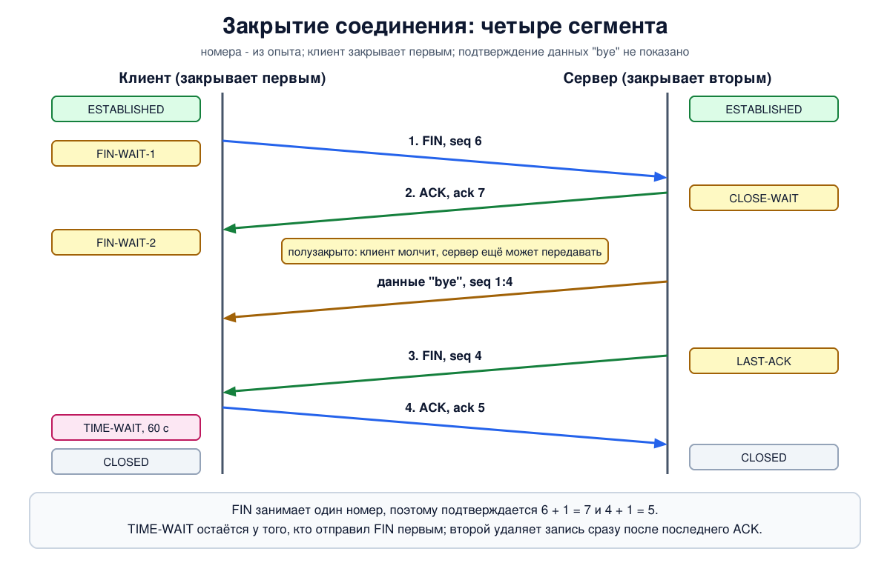

# Урок 38. Завершение TCP-соединения: FIN, RST и TIME-WAIT

Открыть соединение - три сегмента (урок 37). Закрыть его кажется делом простым, но здесь свои подводные камни: нужно, чтобы обе стороны успели сказать всё, что хотели, чтобы последние данные не пропали и чтобы после закрытия в сети не осталось пакетов, которые попадут в следующее соединение. Разберём вежливое закрытие через FIN и грубое через RST, шесть состояний закрытия, зачем нужна минута ожидания в TIME-WAIT и откуда берётся ошибка "Address already in use", что бывает, когда собеседник исчез молча, и как соединения рвут посторонние - и что от этого защищает.

## Почему закончить не так просто, как кажется

Таненбаум различает два способа разрыва. **Асимметричный** - как в телефоне: одна сторона повесила трубку, и связи нет. **Симметричный** - соединение считается парой независимых направлений, и каждое закрывается отдельно.

Асимметричный разрыв теряет данные. Пример Таненбаума: первый узел отправил порцию данных, второй в это время отправил запрос на разъединение - и данные, которые были в пути, пропали.

Симметричный разрыв аккуратнее, но и он не может быть идеальным. Таненбаум объясняет это **задачей двух армий**. Две синие армии стоят на холмах по обе стороны долины, в долине - белая армия; вместе синие сильнее, порознь слабее. Договориться об одновременной атаке они могут только через связного, который идёт через долину и может быть схвачен. Первый командир отправил: "атакуем на рассвете". Второй ответил: "согласен" - но не знает, дошёл ли ответ, и не рискнёт атаковать. Подтверждение на подтверждение переносит сомнение обратно к первому. Сколько бы сообщений ни отправили, последнее всегда может потеряться, и его отправитель никогда в этом не уверен. Вывод Таненбаума: протокола, который дал бы обеим сторонам полную уверенность, не существует.

Для соединения это значит: нельзя гарантировать, что обе стороны закроют его согласованно. Практический выход - каждая сторона решает сама и страхуется таймерами. Так TCP и делает.

## Закрытие через FIN

В TCP каждое направление закрывается отдельно. Сегмент с флагом **FIN** означает: "у меня больше нет данных для отправки". Когда на FIN пришло подтверждение, это направление закрыто. Соединение закрыто, когда закрыты оба.



Обычно, как пишет Таненбаум, нужно **четыре сегмента**: FIN и ACK в одну сторону, FIN и ACK в другую. Подтверждение первого FIN и встречный FIN могут ехать в одном сегменте, тогда сегментов три.

Между первым и вторым FIN может пройти сколько угодно времени. Сторона, отправившая FIN, больше не передаёт данные, но **продолжает принимать**: вторая сторона может досылать свои. Такое состояние называют **полузакрытым** соединением. В программе ему соответствует вызов `shutdown` для записи: "я всё отправил, жду ответ".

FIN, как и SYN, занимает один порядковый номер (урок 36), поэтому подтверждается номером на единицу больше. Потерянный FIN отправляется заново по таймеру, как обычные данные (урок 40).

Возможно и **одновременное закрытие**: оба узла отправили FIN, не дожидаясь друг друга. Каждый получит подтверждение своего FIN, и соединение закроется так же.

## Шесть состояний закрытия

К пяти состояниям из урока 37 добавляются шесть. Тот, кто закрывает первым (активное закрытие), проходит:

- **FIN-WAIT-1** - программа закрыла соединение, FIN отправлен, ждём подтверждения;
- **FIN-WAIT-2** - наш FIN подтверждён, ждём FIN от другой стороны. Это и есть полузакрытое соединение;
- **TIME-WAIT** - чужой FIN получен и подтверждён; соединение ещё некоторое время числится, потом запись удаляется.

Тот, кто закрывает вторым (пассивное закрытие):

- **CLOSE-WAIT** - получили чужой FIN и подтвердили его; ядро ждёт, пока наша программа тоже закроет соединение;
- **LAST-ACK** - программа закрыла, наш FIN отправлен, ждём последнее подтверждение. Как только оно пришло, запись удаляется сразу, без ожидания.

И одно редкое: **CLOSING** - обе стороны отправили FIN одновременно, и мы получили чужой FIN раньше, чем подтверждение своего. Дождавшись подтверждения, каждая сторона переходит в TIME-WAIT: при одновременном закрытии через него проходят обе.

Таненбаум приводит все состояния таблицей и схемой. В таблице у него неточность: состояние LAST ACK описано теми же словами, что TIME WAIT, - "ожидание, пока из сети не исчезнут все пакеты". Это верно только для TIME-WAIT; в LAST-ACK ждут подтверждения своего FIN, и в тексте самой книги путь сервера описан правильно.

Если на сервере много соединений застряло в `CLOSE-WAIT`, это почти всегда ошибка в программе: клиент закрыл соединение, а программа не заметила и не вызвала `close`.

## TIME-WAIT: минута после конца

Зачем сторона, закрывшая первой, ещё ждёт, когда всё уже сказано? По двум причинам.

**Последнее подтверждение может потеряться.** Тогда вторая сторона повторит свой FIN, и на него нужно ответить - а для этого надо ещё помнить о соединении. Это то самое "последнее сообщение" из задачи двух армий; Олифер описывает ту же мысль: соединение считается закрытым не сразу, а когда инициатор убедится, что его завершающее подтверждение дошло.

**В сети могли остаться старые сегменты.** Если сразу открыть новое соединение с теми же адресами и портами, задержавшийся сегмент старого может попасть в новое (урок 37). Таненбаум: после закрытия TCP ждёт удвоенное максимальное время жизни пакета, чтобы ни один пакет этого соединения больше не ходил по сети.

По стандарту (RFC 9293) ожидание равно двум MSL, а MSL принят равным двум минутам, то есть четыре минуты. В Linux TIME-WAIT длится **60 секунд**, и это значение не настраивается.

Практическое следствие - знакомая ошибка **"Address already in use"**. Сервер закрыл соединение первым, его остановили и тут же запустили снова: на его порту ещё висит запись в TIME-WAIT, и занять порт нельзя. Поэтому серверные программы перед `bind` ставят параметр сокета `SO_REUSEADDR`: он разрешает занять порт, на котором нет слушающего сокета, а остались такие "хвосты" (при условии, что и прежний сокет был открыт с этим параметром).

Частая путаница: настройка Linux `net.ipv4.tcp_fin_timeout` (60 секунд по умолчанию) - это не длительность TIME-WAIT. Она ограничивает, сколько соединение, уже закрытое программой, может ждать чужого FIN в состоянии FIN-WAIT-2.

## RST: сброс без церемоний

Сегмент с флагом **RST** обрывает соединение сразу: без подтверждений, без ожидания, в обоих направлениях. Получив его, ядро удаляет запись соединения, а программа получает ошибку "Connection reset by peer". Данные, которые были в пути или ещё не прочитаны, могут пропасть - это и есть асимметричный разрыв. Олифер пишет, что флаг задуман для аварийных ситуаций; Таненбаум - что RST означает проблему.

Основные случаи, когда отправляется RST:

- пришёл SYN в порт, который никто не слушает (урок 34);
- пришёл сегмент для соединения, которого узел не знает: например, узел перезагрузился и всё забыл - пример Олифера;
- программа **закрыла соединение, не прочитав пришедшие данные**: ядро вместо FIN отправляет RST, чтобы отправитель узнал, что его данные пропали;
- программа закрыла соединение **со сбросом** намеренно (параметр `SO_LINGER` с нулевым временем);
- исчерпаны проверки keepalive (о них ниже): Linux напоследок отправляет RST.

Если программа упала, ядро закрывает её сокеты как обычно - через FIN; RST получится, только если остались непрочитанные данные или собеседник продолжит что-то присылать в уже закрытый сокет.

Таненбаум замечает, что веб-серверы часто завершают соединение через RST, потому что знают схему обмена и не ждут новых данных. Олифер добавляет, что сбросом пользуются и некоторые файерволы - к этому вернёмся в разделе о безопасности.

## Если собеседник исчез молча

FIN и RST - это сообщения. Если узел выключили из розетки, перерезали кабель или фильтр на пути начал отбрасывать пакеты, не придёт ничего. Сторона, которая только ждёт данных, будет ждать вечно: соединение с её точки зрения установлено. Такие соединения Таненбаум называет **полуоткрытыми** и предлагает правило: если по соединению давно ничего не приходило - разорвать его, а чтобы не рвались живые соединения, сторона, которой нечего передавать, время от времени отправляет пустой сегмент.

В TCP похожую задачу решает механизм **keepalive**, но устроен он как проверка: после долгой тишины отправить пустой сегмент, на который собеседник обязан ответить; нет ответа на несколько проверок подряд - разорвать. Он выключен по умолчанию и включается программой (параметр сокета `SO_KEEPALIVE`). В Linux по умолчанию первая проверка уходит через **2 часа** тишины, дальше каждые 75 секунд, и после 9 безответных соединение рвётся, обычно с ошибкой "Connection timed out". Два часа - слишком долго почти для любой задачи, поэтому программы задают свои значения для каждого сокета, а многие протоколы проверяют связь сами, на своём уровне.

Сторона, которая **отправляет** данные, узнает об обрыве и без keepalive: её сегменты останутся без подтверждения, и после исчерпания повторов соединение будет закрыто, обычно с ошибкой "Connection timed out" (урок 40); собеседнику при этом ничего не отправляется.

## Как это увидеть в Linux

Клиент `a` (`192.0.2.1`) и сервер `b` (`192.0.2.2`). Посмотрим закрытие по шагам с состояниями сокетов и полузакрытым соединением, TIME-WAIT и занятый порт, два случая RST и молча исчезнувшего собеседника с keepalive. Нужны Linux (подойдёт WSL2), права sudo, python3 и tcpdump (`sudo apt install python3 tcpdump iproute2`); всё создаётся в пространствах имён `hbh-*` и в конце удаляется. Опыт идёт около 20 секунд.

Создай файл `close-lab.sh` и запусти `bash close-lab.sh`:
```
set -u
for c in python3 tcpdump tc ss; do
  command -v $c >/dev/null || { echo "нужен $c: sudo apt install python3 tcpdump iproute2"; exit 1; }
done
# убрать остатки прошлого запуска
for n in hbh-a hbh-b; do
  sudo ip netns pids $n 2>/dev/null | xargs -r sudo kill
  sudo ip netns del $n 2>/dev/null
done
d=$(mktemp -d)
chmod 755 "$d"
# клиент a (192.0.2.1) и сервер b (192.0.2.2)
for n in hbh-a hbh-b; do sudo ip netns add $n; done
sudo ip link add eth0 netns hbh-a type veth peer name eth0 netns hbh-b
sudo ip netns exec hbh-a ip addr add 192.0.2.1/24 dev eth0
sudo ip netns exec hbh-b ip addr add 192.0.2.2/24 dev eth0
for n in hbh-a hbh-b; do
  sudo ip netns exec $n ip link set lo up
  sudo ip netns exec $n ip link set eth0 up
done
A="sudo ip netns exec hbh-a"
B="sudo ip netns exec hbh-b"
# сервер: принимает одно соединение и ведёт себя по-разному
cat > "$d/server.py" <<'EOF'
import socket, struct, sys, time
mode, port = sys.argv[1], int(sys.argv[2])
l = socket.socket()
if "reuse" in sys.argv:
    l.setsockopt(socket.SOL_SOCKET, socket.SO_REUSEADDR, 1)
try:
    l.bind(("0.0.0.0", port))
except OSError as e:
    print("server bind:", e.strerror); sys.exit()
l.listen()
if mode == "bindonly":
    print("server bind: ok"); sys.exit()
c, _ = l.accept()
if mode == "hold":        # дочитать до конца, подождать, ответить и закрыть
    while c.recv(100): pass
    time.sleep(1.5)
    c.sendall(b"bye"); c.close()
elif mode == "first":     # закрыть соединение первым
    c.sendall(b"hi"); c.close(); time.sleep(0.3)
elif mode == "unread":    # закрыть, не прочитав присланное
    time.sleep(0.5); c.close()
elif mode == "abort":     # закрытие со сбросом: SO_LINGER с нулевым временем
    c.setsockopt(socket.SOL_SOCKET, socket.SO_LINGER, struct.pack("ii", 1, 0)); c.close()
elif mode == "sink":      # держать соединение и молчать
    time.sleep(30)
EOF
cat > "$d/client.py" <<'EOF'
import socket, sys, time
mode, port = sys.argv[1], int(sys.argv[2])
s = socket.create_connection(("192.0.2.2", port))
t = time.time()
try:
    if mode == "half":        # отправить, закрыть свою сторону, дочитать ответ
        s.sendall(b"hello"); s.shutdown(socket.SHUT_WR)
        data = b""
        while (b := s.recv(100)): data += b
        print("client got after its own FIN:", data); s.close()
    elif mode == "read":
        print("client got:", s.recv(100), "then", s.recv(100))
    elif mode == "unread":
        s.sendall(b"x" * 100); time.sleep(1)
        print("client got:", s.recv(100))
    elif mode == "keepalive":  # проверять молчащее соединение: через 2 с, потом каждую секунду, 3 попытки
        s.setsockopt(socket.SOL_SOCKET, socket.SO_KEEPALIVE, 1)
        s.setsockopt(socket.IPPROTO_TCP, socket.TCP_KEEPIDLE, 2)
        s.setsockopt(socket.IPPROTO_TCP, socket.TCP_KEEPINTVL, 1)
        s.setsockopt(socket.IPPROTO_TCP, socket.TCP_KEEPCNT, 3)
        print("client got:", s.recv(100))
except OSError as e:
    print(f"client error: {e.strerror} after {time.time() - t:.0f} s")
EOF
clean='s/^[0-9:.]+ IP //; s/, options \[[^]]*\]//; s/, win [0-9]+//'
nonum='s/, seq [0-9]+//; s/, ack [0-9]+//'
states() { sudo ip netns exec $1 ss -tan "$2" | sed 1d | awk '{print $1, $4, $5}' | column -t; }
echo '--- 1. a normal close, step by step'
$B timeout 5 tcpdump -i eth0 -n -l 'tcp port 5000' 2>/dev/null > "$d/close" &
$B python3 "$d/server.py" hold 5000 &
sleep 1
$A python3 "$d/client.py" half 5000 > "$d/c1" &
sleep 1
echo 'after the client FIN:'
echo -n 'a: '; states hbh-a 'dport = :5000'
echo -n 'b: '; states hbh-b 'sport = :5000' | grep -v LISTEN
sleep 1.5
echo 'after the server FIN:'
echo -n 'a: '; $A ss -tano 'dport = :5000' | sed 1d | awk '{print $1, $4, $5, $6}'
echo "b: $($B ss -tan 'sport = :5000' | sed 1d | wc -l) sockets"
wait
cat "$d/c1"
sed -E "$clean" "$d/close" | grep -v 'Flags \[S'
echo '--- 2. the server closes first and restarts at once'
$B python3 "$d/server.py" first 5001 &
sleep 0.5
$A python3 "$d/client.py" read 5001
wait
echo -n 'b: '; $B ss -tano 'sport = :5001' | sed 1d | awk '{print $1, $4, $5, $6}'
$B python3 "$d/server.py" bindonly 5001
echo 'the same, but the server sets SO_REUSEADDR from the start:'
$B python3 "$d/server.py" first 5005 reuse &
sleep 0.5
$A python3 "$d/client.py" read 5005 >/dev/null
wait
echo -n 'b: '; $B ss -tan 'sport = :5005' | sed 1d | awk '{print $1, $4, $5}'
$B python3 "$d/server.py" bindonly 5005 reuse
echo '--- 3. RST instead of FIN: closing with unread data'
$B timeout 3 tcpdump -i eth0 -n -l 'tcp port 5002 and tcp[tcpflags] & (tcp-rst|tcp-fin) != 0' 2>/dev/null > "$d/rst1" &
$B python3 "$d/server.py" unread 5002 &
sleep 1
$A python3 "$d/client.py" unread 5002
wait
sed -E "$clean; $nonum" "$d/rst1"
echo '--- 4. RST on purpose: abortive close'
$B timeout 3 tcpdump -i eth0 -n -l 'tcp port 5003 and tcp[tcpflags] & (tcp-rst|tcp-fin) != 0' 2>/dev/null > "$d/rst2" &
$B python3 "$d/server.py" abort 5003 &
sleep 1
$A python3 "$d/client.py" read 5003
wait
sed -E "$clean; $nonum" "$d/rst2"
echo '--- 5. the peer vanishes silently; keepalive finds out'
$B python3 "$d/server.py" sink 5004 &
sleep 0.5
$A timeout 7 tcpdump -i eth0 -n -l -ttt 'tcp port 5004 and tcp[tcpflags] & tcp-syn == 0' 2>/dev/null > "$d/ka" &
sleep 0.5
$A python3 "$d/client.py" keepalive 5004 > "$d/c5" &
cpid=$!
sleep 1
# "выдернуть кабель": b перестаёт получать что-либо от a
$B tc qdisc add dev eth0 ingress
$B tc filter add dev eth0 ingress protocol ip u32 match u32 0 0 action drop
wait $cpid
sleep 1.5
sed -E "s/^ //; s/ IP / /; s/, options \[[^]]*\]//; s/, win [0-9]+//; $nonum" "$d/ka"
cat "$d/c5"
echo -n 'b still believes: '; states hbh-b 'sport = :5004' | grep -v LISTEN
echo '--- 6. settings'
$A sysctl net.ipv4.tcp_fin_timeout net.ipv4.tcp_keepalive_time net.ipv4.tcp_keepalive_intvl net.ipv4.tcp_keepalive_probes
echo '--- cleanup'
for n in hbh-a hbh-b; do
  sudo ip netns pids $n 2>/dev/null | xargs -r sudo kill
  sudo ip netns del $n
done
rm -rf "$d"
ip netns list | grep -cE '^hbh-(a|b)( |$)'
```

Вот что получилось на нашем сервере:
```
--- 1. a normal close, step by step
after the client FIN:
a: FIN-WAIT-2  192.0.2.1:45444  192.0.2.2:5000
b: CLOSE-WAIT  192.0.2.2:5000  192.0.2.1:45444
after the server FIN:
a: TIME-WAIT 192.0.2.1:45444 192.0.2.2:5000 timer:(timewait,58sec,0)
b: 0 sockets
client got after its own FIN: b'bye'
192.0.2.1.45444 > 192.0.2.2.5000: Flags [.], ack 1, length 0
192.0.2.1.45444 > 192.0.2.2.5000: Flags [P.], seq 1:6, ack 1, length 5
192.0.2.2.5000 > 192.0.2.1.45444: Flags [.], ack 6, length 0
192.0.2.1.45444 > 192.0.2.2.5000: Flags [F.], seq 6, ack 1, length 0
192.0.2.2.5000 > 192.0.2.1.45444: Flags [.], ack 7, length 0
192.0.2.2.5000 > 192.0.2.1.45444: Flags [P.], seq 1:4, ack 7, length 3
192.0.2.1.45444 > 192.0.2.2.5000: Flags [.], ack 4, length 0
192.0.2.2.5000 > 192.0.2.1.45444: Flags [F.], seq 4, ack 7, length 0
192.0.2.1.45444 > 192.0.2.2.5000: Flags [.], ack 5, length 0

--- 2. the server closes first and restarts at once
client got: b'hi' then b''
b: TIME-WAIT 192.0.2.2:5001 192.0.2.1:48826 timer:(timewait,59sec,0)
server bind: Address already in use
the same, but the server sets SO_REUSEADDR from the start:
b: TIME-WAIT 192.0.2.2:5005 192.0.2.1:33910
server bind: ok
--- 3. RST instead of FIN: closing with unread data
client error: Connection reset by peer after 1 s
192.0.2.2.5002 > 192.0.2.1.35534: Flags [R.], length 0

--- 4. RST on purpose: abortive close
client error: Connection reset by peer after 0 s
192.0.2.2.5003 > 192.0.2.1.53286: Flags [R.], length 0

--- 5. the peer vanishes silently; keepalive finds out
00:00:00.000000 192.0.2.1.55484 > 192.0.2.2.5004: Flags [.], length 0
00:00:02.015595 192.0.2.1.55484 > 192.0.2.2.5004: Flags [.], length 0
00:00:01.020554 192.0.2.1.55484 > 192.0.2.2.5004: Flags [.], length 0
00:00:01.024002 192.0.2.1.55484 > 192.0.2.2.5004: Flags [.], length 0
00:00:01.024038 192.0.2.1.55484 > 192.0.2.2.5004: Flags [R.], length 0

client error: Connection timed out after 5 s
b still believes: ESTAB   192.0.2.2:5004  192.0.2.1:55484
--- 6. settings
net.ipv4.tcp_fin_timeout = 60
net.ipv4.tcp_keepalive_time = 7200
net.ipv4.tcp_keepalive_intvl = 75
net.ipv4.tcp_keepalive_probes = 9
--- cleanup
0
```

Разберём по шагам.

- **Шаг 1: вежливое закрытие.** Клиент отправил `hello`, закрыл свою сторону для записи (`shutdown`) и стал ждать ответ. Сервер дочитал до конца, подождал полторы секунды, ответил `bye` и закрыл соединение. В записи tcpdump (первая строка - последний шаг рукопожатия):
  - `[P.] seq 1:6` - пять байт `hello`; сервер подтвердил `ack 6`;
  - `[F.] seq 6` - FIN клиента; сервер подтвердил `ack 7`: FIN занял один номер. С этого момента клиент в `FIN-WAIT-2`, сервер в `CLOSE-WAIT` - это видно в первом снимке состояний. Соединение полузакрыто;
  - `[P.] seq 1:4` от сервера - три байта `bye` идут клиенту **после** его FIN, и клиент их получил: `client got after its own FIN: b'bye'`;
  - `[F.] seq 4` - FIN сервера; клиент подтвердил `ack 5`.
  
  Сегментов закрытия четыре: FIN, ACK, FIN, ACK. После второго FIN у сервера сокета уже нет (`0 sockets`): он был в LAST-ACK и исчез, получив подтверждение. А у клиента, который закрывал первым, сокет остался в `TIME-WAIT`, и таймер показывает оставшиеся секунды: `timewait,58sec` из шестидесяти.
- **Шаг 2: сервер закрывает первым и перезапускается.** Здесь соединение первым закрыл сервер, поэтому TIME-WAIT остался у него, на порту 5001. Программа завершилась, мы тут же запустили её снова - `Address already in use`. Во второй половине шага сервер с самого начала ставил `SO_REUSEADDR`: запись в TIME-WAIT на порту 5005 точно так же есть, но новый запуск занял порт - `server bind: ok`.
- **Шаг 3: закрытие с непрочитанными данными.** Клиент отправил 100 байт, сервер закрыл соединение, не прочитав их. В сети вместо `[F.]` - `[R.]`: ядро сервера отправило RST. Клиент при попытке читать получил `Connection reset by peer`.
- **Шаг 4: закрытие со сбросом.** Сервер поставил `SO_LINGER` с нулевым временем и закрыл соединение: снова `[R.]` и та же ошибка у клиента, без FIN. Состояния TIME-WAIT при сбросе не бывает.
- **Шаг 5: собеседник исчез.** Клиент подключился, включил keepalive (первая проверка через 2 секунды тишины, потом каждую секунду, три попытки) и стал ждать данных. Через секунду мы "выдернули кабель": правило на входе `b` отбрасывает все IP-пакеты. Ключ `-ttt` показывает время от предыдущей строки:
  - первая строка - конец рукопожатия;
  - через 2 секунды клиент отправил проверку - пустой сегмент `[.]`; ответа нет. Ещё две проверки с интервалом в секунду;
  - после трёх безответных проверок клиент отправил `[R.]` и сообщил программе: `Connection timed out after 5 s`.
  
  А сервер `b`, до которого ничего не дошло, по-прежнему считает соединение установленным: `ESTAB`. Это полуоткрытое соединение; оно провисит, пока программа на `b` не закроет его сама или не попробует что-нибудь отправить.
- **Шаг 6: настройки.** Значения keepalive по умолчанию: 7200 секунд до первой проверки, 75 между проверками, 9 попыток. `tcp_fin_timeout` - ожидание в FIN-WAIT-2, а не длительность TIME-WAIT.
- В конце `0`: пространства имён удалены.

## Безопасность: когда соединение рвёт или подделывает посторонний

В заголовке TCP нет ничего секретного и нет подписи. Сегмент принимается, если у него подходящие адреса, порты и номера: порядковый, а для данных - ещё и номер подтверждения. Значит, тот, кто знает эти числа, может вставить в чужое соединение свой сегмент: RST - и соединение оборвётся, данные - и получатель примет их за настоящие. Таненбаум различает подмену соединения (открыть соединение от чужого имени) и захват соединения (вставить данные в существующее). Всё зависит от того, где находится посторонний.

**Вне пути.** Посторонний не видит трафика и должен угадать порты и номера. Олифер отмечает, что проверка номера задумана, чтобы не смешивать сегменты разных соединений, и как защита не так уж надёжна. Действительно, для сброса раньше достаточно было попасть не в точный номер, а в окно приёма. Защита строится на том, чтобы угадать было нельзя:

- **случайные начальные номера** (урок 37). Таненбаум рассказывает историю 1994 года, когда предсказуемые номера позволили Кевину Митнику открыть соединение от имени доверенного узла; после неё разработчики усилили случайность номеров;
- **случайные временные порты** клиента (урок 34);
- **строгая проверка номеров, RFC 5961** (2010): RST принимается, только если его номер точно совпал с ожидаемым; на RST, попавший в окно, но не точный, и на неожиданный SYN узел не рвёт соединение, а отправляет **проверочное подтверждение** (challenge ACK). Настоящий собеседник, если он действительно сбросил соединение, ответит на него точным RST; посторонний вне пути проверочного подтверждения не увидит. Эти правила вошли в действующий стандарт TCP (RFC 9293).

Таненбаум разбирает поучительный случай: в Linux число проверочных подтверждений ограничивалось одним общим счётчиком на все соединения, и по тому, как расходовался этот лимит, посторонний мог по косвенным признакам узнавать о чужих соединениях. (Эту уязвимость описали в 2016 году, CVE-2016-5696, и тогда же исправили.) Его вывод: защитная мера сама открыла лазейку, потому что разные соединения делили общее состояние, - чем меньше общего, тем лучше.

**На пути.** Тот, кто видит трафик - оператор, владелец точки доступа, устройство фильтрации, - знает все номера, и никакая случайность от него не защищает. Он может отправить обеим сторонам поддельный RST, и каждая решит, что соединение сбросил собеседник. Олифер упоминает, что сбросом пользуются файерволы; так же могут поступать и системы глубокого анализа трафика (DPI, блок 10): устройство, которое стоит в стороне от канала и получает копию трафика, остановить пакет не может, зато может вставить свой - RST. Для пользователя это выглядит как "Connection reset by peer" на определённых сайтах или протоколах. Таненбаум приводит и пример внедрения данных в чужие соединения на практике - программу Quantum, о которой стало известно в 2013 году.

От подделки и вставки со стороны наблюдателя на пути защищает только криптография, и важно, что именно она закрывает:

- **TLS** (блок 9) шифрует и удостоверяет **данные**: вставленные посторонним байты будут отвергнуты, а обрыв посреди обмена программа отличит от честного завершения. Но TLS работает поверх TCP и заголовок TCP не защищает: соединение всё равно можно сбросить поддельным RST;
- **аутентификация сегментов TCP** (TCP-AO, RFC 5925) добавляет в каждый сегмент код на общем ключе; сегмент без верного кода, в том числе RST, отбрасывается. Олифер называет такую аутентификацию цифровой подписью сегмента (так называлась и старая опция TCP MD5, урок 33); точнее - это код аутентификации на общем секрете. Применяется там, где обе стороны заранее обменялись ключами, прежде всего между маршрутизаторами BGP (урок 33);
- **шифрованный туннель** (IPsec, WireGuard, блок 10) прячет внутри себя и заголовок TCP: посторонний не видит ни портов, ни номеров;
- **QUIC** (урок 43) после установления соединения шифрует и удостоверяет собственные служебные сообщения, включая закрытие, и работает поверх UDP, у которого нет RST.

Одно ограничение у всех этих средств общее: они защищают от подделки и вставки. Тот, кто стоит в разрыве канала, может просто не пропускать пакеты, и от этого криптография не спасает; соединение тогда не обрывается сбросом, а замирает, как в разделе про молча исчезнувшего собеседника.

## Итог

- TCP закрывает каждое направление отдельно: FIN - "у меня больше нет данных". Обычно это четыре сегмента (FIN, ACK, FIN, ACK) или три. Между двумя FIN соединение полузакрыто: одна сторона ещё может передавать.
- Закрывающий первым проходит FIN-WAIT-1, FIN-WAIT-2, TIME-WAIT; закрывающий вторым - CLOSE-WAIT, LAST-ACK.
- TIME-WAIT нужен, чтобы ответить на повторный FIN и дать исчезнуть старым сегментам. В Linux это 60 секунд; отсюда "Address already in use" и параметр SO_REUSEADDR.
- RST обрывает соединение сразу и может погубить данные: закрытый порт, неизвестное соединение, закрытие с непрочитанными данными, закрытие со сбросом.
- Полной уверенности в согласованном закрытии не бывает (задача двух армий). Молча исчезнувшего собеседника обнаруживают keepalive или неудачные повторы при отправке.
- Сегмент TCP можно подделать, зная адреса, порты и номера. От постороннего вне пути защищают случайные номера и порты и строгая проверка RST (RFC 5961); от наблюдателя на пути - только криптография, причём TLS защищает данные, но не само соединение от сброса.

## Что почитать

- Олифер, "Компьютерные сети", глава 15, с. 476-477: разрыв соединения; глава 29, с. 903-904: подделка TCP-сегмента, сброс TCP-соединения, меры защиты.
- Таненбаум, "Компьютерные сети", раздел 6.2.3, с. 586-590: разрыв соединения, задача двух армий, полуоткрытые соединения; разделы 6.5.6-6.5.7, с. 633-636: разрыв TCP-соединения и состояния; раздел 6.5.9, с. 643: таймеры keepalive и TIME WAIT; раздел 8.2.3, с. 833-840: подмена и захват TCP-соединения, RFC 5961.
- RFC 9293 (TCP), RFC 5961 (защита от подделки RST, SYN и данных), RFC 5925 (TCP-AO), `man 7 tcp` (keepalive, параметры сокетов).