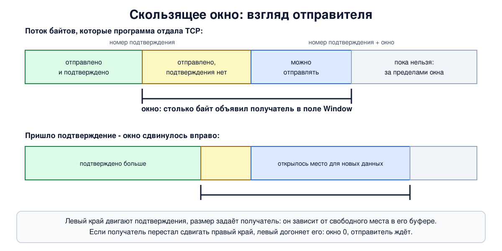

# Урок 39. Скользящее окно и управление потоком

TCP нумерует байты и подтверждает полученное (урок 36). Остаётся вопрос темпа: сколько данных можно отправить, не дожидаясь подтверждений? Отправлять по одному сегменту и ждать - медленно. Отправлять всё сразу - получатель может не успеть: его программа читает данные со своей скоростью, а память под буфер не бесконечна. Ответ TCP - **скользящее окно**, которым получатель сам говорит отправителю, сколько ещё готов принять. В этом уроке - как окно устроено, что происходит, когда оно закрывается до нуля, и три механизма, которые сглаживают работу с мелкими порциями данных: отложенные подтверждения, алгоритм Нейгла и защита от "глупого окна".

Важная граница: окно из этого урока защищает **получателя**. От перегрузки **сеть** защищает другое окно, окно перегрузки, - о нём урок 41.

## От простоя к окну

Олифер начинает с общей схемы: отправитель шлёт данные, получатель отвечает **квитанциями** (подтверждениями), и если квитанция не пришла вовремя, данные отправляются заново. Протоколы отличаются тем, как именно это организовано.

**Метод простоя источника** (stop-and-wait): отправил один пакет - жди квитанцию, только потом следующий. Просто, но, как замечает Олифер, линия большую часть времени простаивает. Чем длиннее путь, тем хуже: при времени оборота 100 миллисекунд получится не больше десяти пакетов в секунду, какой бы быстрой ни была линия.

**Метод скользящего окна**: отправителю разрешено иметь "в полёте" несколько неподтверждённых пакетов сразу. Их наибольшее число - **размер окна**. Пакеты нумеруются; окно - это диапазон номеров, которые сейчас можно отправлять. Пришла квитанция на самый старый пакет - окно сдвинулось вперёд и открыло место для нового. Если окно исчерпано, отправитель останавливается и ждёт. Пример Олифера: при окне в 5 пакетов сначала можно отправить пакеты 1-5; квитанция на первый сдвигает окно на 2-6, и так далее.

Что делать при потере, Олифер показывает на двух классических вариантах:

- **возвращение на N пакетов** (Go-Back-N): получатель принимает пакеты только строго по порядку, всё пришедшее "не в очередь" отбрасывает; квитанции **накопительные** - подтверждение пакета подтверждает и все предыдущие. При потере отправитель повторяет потерянный пакет и все, что шли за ним. Получателю не нужен буфер, зато много лишних повторов;
- **выборочное повторение** (Selective Repeat): получатель сохраняет пакеты, пришедшие не по порядку, и подтверждает каждый отдельно; повторяется только потерянное.

TCP взял от каждого понемногу: подтверждения в нём накопительные, но пришедшее не по порядку получатель, как правило, сохраняет, а не выбрасывает (Таненбаум: выбрасывать разрешено, но неэффективно), а выборочные подтверждения SACK (уроки 36 и 40) сообщают отправителю, что именно уже дошло.

## Окно в TCP

В TCP окно считается в **байтах**, а не в пакетах. Олифер описывает три буфера на каждой стороне соединения: для принятых данных, которые ещё не забрала программа; для данных, которые программа уже отдала TCP, но они ещё не отправлены; и для копий отправленного, на которое ещё нет подтверждения.

Поле **Window** в заголовке каждого сегмента (урок 36) - это объявление получателя: "начиная с номера подтверждения, я готов принять ещё столько байт". Оно отражает свободное место в буфере приёма и меняется с каждым сегментом: программа прочитала данные - место освободилось, окно выросло; данные приходят быстрее, чем их читают, - окно уменьшается. У каждого направления своё окно.



Поток байтов у отправителя делится на четыре части (так его рисует Олифер): отправлено и подтверждено; отправлено, но подтверждения ещё нет; ещё не отправлено, но отправить можно; отправлять нельзя, пока окно не сдвинется. Вторая и третья части вместе и есть окно. Его левый край двигают подтверждения, правый - левый край плюс объявленный размер.

Отсюда простое правило о скорости: за одно время оборота нельзя передать больше одного окна, то есть скорость соединения не выше размера окна, делённого на время оборота. Окно в 65 535 байт при обороте в 100 миллисекунд - это около 5 мегабит в секунду и ни битом больше, на какой угодно линии. Поэтому и нужен масштаб окна из урока 36, а современные системы сами увеличивают буфер приёма по ходу соединения.

И ещё одно: окно получателя - не единственное ограничение. Отправитель ведёт и собственное окно перегрузки, которым бережёт сеть (урок 41), и в каждый момент может отправить не больше **меньшего из двух**.

## Управление потоком и нулевое окно

Пример Таненбаума: у получателя буфер 4096 байт. Отправитель передал 2048 байт - получатель подтвердил их и объявил окно 2048. Отправитель передал ещё 2048 - буфер полон, в подтверждении **окно 0**. Отправитель обязан остановиться. Когда программа получателя прочитает 2048 байт, получатель объявит окно 2048, и передача продолжится.

Так получатель управляет отправителем: медленная программа автоматически притормаживает быстрого отправителя на другом конце, и ничего не теряется. Это и называется **управлением потоком**. Дальше торможение идёт по цепочке: буфер отправки у отправителя тоже заполняется, и его программа блокируется на записи.

С нулевым окном связана ловушка. Получатель освободил место и отправил сегмент с новым окном, а тот потерялся. Получатель ждёт данных, отправитель ждёт разрешения - тупик. Поэтому отправитель, увидев нулевое окно, не просто ждёт, а по таймеру (Таненбаум называет его **таймером настойчивости**, persistence timer; в выводе `ss` - `persist`) отправляет **пробный сегмент**; в ответ получатель повторяет текущее окно. Если оно всё ещё нулевое, таймер запускается снова; по стандарту промежутки между пробами растут, в Linux они удваиваются. Олифер описывает то же как "контрольные попытки" отправителя. Кроме пробного сегмента, при нулевом окне разрешено ещё одно - срочные данные (о них пишут оба автора, урок 36).

## Отложенные подтверждения

Подтверждать каждый сегмент отдельным пустым пакетом расточительно. Таненбаум считает на примере удалённого терминала: пользователь нажал клавишу - ушёл 1 байт в пакете из 41 байта; в ответ пакет-подтверждение (40 байт), потом пакет с обновлением окна (40 байт), потом эхо символа (41 байт). Четыре пакета, 162 байта ради одного символа.

Поэтому получатель может **отложить подтверждение** в надежде, что вот-вот появятся данные в обратную сторону и подтверждение поедет вместе с ними, или что придёт ещё сегмент и одно подтверждение покроет оба. Таненбаум называет задержку до 500 миллисекунд - это верхний предел из стандарта; второе правило стандарта - подтверждать не реже, чем каждый второй полноразмерный сегмент. В Linux задержка от 40 до 200 миллисекунд, часто около 40, а в начале соединения и при подозрении на потери подтверждения идут сразу - поэтому в опыте урока 36 мы видели подтверждение на каждый сегмент.

## Алгоритм Нейгла

Обратная проблема - программа, которая пишет в сокет по одному байту. Каждый байт в своём пакете - это 40 байт заголовков на байт данных. **Алгоритм Нейгла** (1984) по Таненбауму: если данные приходят от программы маленькими порциями, первую отправить сразу, а следующие копить, пока не придёт подтверждение на отправленное; потом отправить всё накопленное одним сегментом. Если накопилось на полный сегмент, он уходит без ожидания. В результате в пути всегда не больше одного маленького сегмента, и чем медленнее сеть, тем крупнее получаются порции.

Нейгл включён по умолчанию и почти всегда полезен. Мешает он там, где мелкие сообщения должны уходить немедленно: Таненбаум приводит игры, сюда же относятся любые протоколы "короткий запрос - короткий ответ". Интерактивные терминалы, ради которых алгоритм когда-то придумали для медленных линий, на быстрых сетях тоже его отключают. Хуже того, он неудачно сочетается с отложенными подтверждениями: отправитель ждёт подтверждения, чтобы отправить остаток, а получатель тянет с подтверждением, ожидая данных. Оба ждут, пока не сработает таймер отложенного подтверждения. Программа отключает алгоритм Нейгла для своего сокета параметром **`TCP_NODELAY`**; так делают SSH в интерактивном режиме, игры, большинство веб-серверов и прокси.

## Синдром глупого окна

Третья проблема описана Кларком в 1982 году. Отправитель передаёт большими блоками, а программа получателя читает по одному байту. Буфер полон; программа прочитала байт - получатель объявил окно в 1 байт; отправитель прислал 1 байт (в 41-байтном пакете); буфер снова полон. И так до бесконечности: соединение работает, но крайне неэффективно.

**Решение Кларка** по Таненбауму: получателю запрещено объявлять крошечные окна. Он молчит о новом окне, пока не сможет принять целый сегмент максимального размера или пока буфер не освободится наполовину. Отправитель со своей стороны тоже не посылает мелочь: ждёт, пока окно позволит отправить полный сегмент или хотя бы половину буфера получателя. (Эти числа закрепил более поздний стандарт; в исходной статье Кларка пороги другие.) Олифер описывает ту же идею без названия и с другими числами: получатель откладывает изменение окна, пока не освободится 20-40% буфера.

Таненбаум подытоживает: Нейгл решает проблему программы, которая **отдаёт** данные по байту, Кларк - программы, которая **забирает** по байту; оба механизма работают вместе.

## Как это увидеть в Linux

Отправитель `a` (`192.0.2.1`) и получатель `b` (`192.0.2.2`). В первом шаге получатель три секунды не читает данные: увидим, как окно уменьшается до нуля, как отправитель зондирует закрытое окно и как передача возобновляется. Во втором - 200 записей по одному байту с алгоритмом Нейгла и без него. Нужны Linux (подойдёт WSL2), права sudo, python3 и tcpdump (`sudo apt install python3 tcpdump iproute2`); всё создаётся в пространствах имён `hbh-*` и в конце удаляется.

Создай файл `window-lab.sh` и запусти `bash window-lab.sh`:
```
set -u
for c in python3 tcpdump tc ss; do
  command -v $c >/dev/null || { echo "нужен $c: sudo apt install python3 tcpdump iproute2"; exit 1; }
done
# убрать остатки прошлого запуска
for n in hbh-a hbh-b; do
  sudo ip netns pids $n 2>/dev/null | xargs -r sudo kill
  sudo ip netns del $n 2>/dev/null
done
d=$(mktemp -d)
chmod 755 "$d"
# отправитель a (192.0.2.1) и получатель b (192.0.2.2)
for n in hbh-a hbh-b; do sudo ip netns add $n; done
sudo ip link add eth0 netns hbh-a type veth peer name eth0 netns hbh-b
sudo ip netns exec hbh-a ip addr add 192.0.2.1/24 dev eth0
sudo ip netns exec hbh-b ip addr add 192.0.2.2/24 dev eth0
for n in hbh-a hbh-b; do
  sudo ip netns exec $n ip link set lo up
  sudo ip netns exec $n ip link set eth0 up
done
A="sudo ip netns exec hbh-a"
B="sudo ip netns exec hbh-b"
# получатель: маленький буфер приёма; сначала не читает, потом читает всё
cat > "$d/recv.py" <<'EOF'
import socket, sys, time
port, pause = int(sys.argv[1]), float(sys.argv[2])
l = socket.socket(); l.setsockopt(socket.SOL_SOCKET, socket.SO_REUSEADDR, 1)
if pause:
    l.setsockopt(socket.SOL_SOCKET, socket.SO_RCVBUF, 8192)   # маленький буфер приёма, чтобы окно было видно
l.bind(("0.0.0.0", port)); l.listen()
c, _ = l.accept()
time.sleep(pause)                 # программа "занята" и не читает
total = 0
while (b := c.recv(65536)):
    total += len(b)
print("receiver read", total, "bytes")
EOF
# отправитель: пишет, пока ядро принимает, и сообщает, сколько удалось отдать
cat > "$d/send.py" <<'EOF'
import socket, sys, time
port, mode = int(sys.argv[1]), sys.argv[2]
s = socket.create_connection(("192.0.2.2", port))
if mode == "fill":
    s.setsockopt(socket.SOL_SOCKET, socket.SO_SNDBUF, 8192)  # и буфер отправки маленький, чтобы запись быстро встала
    s.setblocking(False)
    sent, t = 0, time.time()
    while time.time() - t < 1:
        try:
            sent += s.send(b"x" * 1000)
        except BlockingIOError:
            time.sleep(0.05)
    print("sender: the kernel took", sent, "bytes, then send() would block")
    s.setblocking(True)
    s.sendall(b"y" * (60000 - sent)); s.close()
    print("sender: all 60000 bytes written")
else:                          # 200 записей по 1 байту подряд
    if mode == "nodelay":
        s.setsockopt(socket.IPPROTO_TCP, socket.TCP_NODELAY, 1)
    for i in range(200):
        s.send(b"k")
    time.sleep(0.5); s.close()
EOF
echo '--- 1. the receiver does not read: the window closes'
$A timeout 6 tcpdump -i eth0 -n -l -ttttt 'tcp port 5000' 2>/dev/null > "$d/win" &
$B python3 "$d/recv.py" 5000 3 &
sleep 1
$A python3 "$d/send.py" 5000 fill > "$d/s1" &
sleep 2
echo 'sockets after 2 seconds (sender a, receiver b):'
$A ss -tnoi 'dport = :5000' | sed 1d | tr -s ' \n' ' ' | grep -oE 'ESTAB +[0-9]+ +[0-9]+|timer:\([a-z]+|notsent:[0-9]+' | tr '\n' ' '; echo
$B ss -tnm 'sport = :5000' | grep -v LISTEN | sed 1d | tr -s ' \n' ' ' | grep -oE 'ESTAB +[0-9]+ +[0-9]+|skmem:\(r[0-9]+,rb[0-9]+' | tr '\n' ' '; echo
wait
cat "$d/s1"
echo 'what the receiver advertised (seconds since the first packet, ack, window):'
grep '192.0.2.2.5000 >' "$d/win" | sed -E 's/^ *00:00:0?//; s/ IP .*Flags \[([^]]*)\],( seq [0-9:]+,)? ack ([0-9]+), win ([0-9]+).*/ [\1] ack \3 win \4/' | awk '{ if ($NF != last) print; last = $NF }'
echo 'zero-window probes from the sender:'
awk '/win 0,/ {z=1} z && /192.0.2.2.5000 > .*win [1-9]/ {exit} z && /192.0.2.1.[0-9]+ > .*Flags \[\.\].*length 0/' "$d/win" | sed -E 's/^ *00:00:0?//; s/ IP / /; s/, options \[[^]]*\]//; s/, win [0-9]+//' | head -4
echo '--- 2. 200 one-byte writes with 20 ms of delay each way'
$A tc qdisc add dev eth0 root netem delay 20ms
$B tc qdisc add dev eth0 root netem delay 20ms
for mode in nagle nodelay; do
  $A timeout 3 tcpdump -i eth0 -n -l "tcp dst port 5001 and tcp[tcpflags] & tcp-push != 0 or (tcp dst port 5001 and len > 66)" 2>/dev/null > "$d/$mode" &
  $B python3 "$d/recv.py" 5001 0 > /dev/null &
  sleep 1
  $A python3 "$d/send.py" 5001 $mode
  wait
  echo "$mode: $(grep -c 'length [1-9]' "$d/$mode") segments with data, sizes: $(grep -oE 'length [1-9][0-9]*' "$d/$mode" | awk '{print $2}' | tr '\n' ' ')"
done
echo '--- cleanup'
for n in hbh-a hbh-b; do
  sudo ip netns pids $n 2>/dev/null | xargs -r sudo kill
  sudo ip netns del $n
done
rm -rf "$d"
ip netns list | grep -cE '^hbh-(a|b)( |$)'
```

Вот что получилось на нашем сервере:
```
--- 1. the receiver does not read: the window closes
sockets after 2 seconds (sender a, receiver b):
ESTAB 0 14480 timer:(persist notsent:14480 
ESTAB 14136 0 skmem:(r15032,rb16384 
receiver read 60000 bytes
sender: the kernel took 28616 bytes, then send() would block
sender: all 60000 bytes written
what the receiver advertised (seconds since the first packet, ack, window):
0.000025 [S.] ack 1944959458 win 7240
0.000122 [.] ack 1001 win 6240
0.008157 [.] ack 8345 win 4344
0.048838 [.] ack 12689 win 1448
0.091689 [.] ack 14137 win 0
3.004597 [.] ack 14137 win 5792
zero-window probes from the sender:
0.311349 192.0.2.1.45148 > 192.0.2.2.5000: Flags [.], ack 1, length 0
0.740496 192.0.2.1.45148 > 192.0.2.2.5000: Flags [.], ack 1, length 0
1.588592 192.0.2.1.45148 > 192.0.2.2.5000: Flags [.], ack 1, length 0
--- 2. 200 one-byte writes with 20 ms of delay each way
nagle: 2 segments with data, sizes: 1 199 
nodelay: 11 segments with data, sizes: 1 1 1 1 1 1 1 1 1 1 190 
--- cleanup
0
```

Разберём.

**Шаг 1: окно закрывается.** Получатель поставил себе маленький буфер приёма и три секунды не читал; отправитель писал, сколько принимало ядро.

- **Что объявлял получатель.** В своём SYN и ACK - окно 7240 байт. После первой тысячи байт - 6240: ровно на тысячу меньше. Дальше 4344, 1448 и, когда подтверждён байт 14136 (`ack 14137`), - **`win 0`**. Это заняло меньше десятой доли секунды. Масштаб окна здесь равен нулю (буфер задан явно и меньше 64 Кбайт, поэтому ядро выбрало сдвиг 0), так что числа в поле - настоящие байты.
- **Почему приняли больше, чем обещали.** Получатель объявил 7240 байт, программа ничего не читала, а принято 14136. Объявленное окно - осторожная оценка: сначала Linux обещает около половины буфера, а по мере прихода данных уточняет, сколько места они занимают на самом деле. Проверять строки удобно по правому краю окна, сумме `ack + win`: 1 + 7240 = 7241 (в строке `[S.]` номер подтверждения настоящий, в относительном счёте это 1, урок 36), 1001 + 6240 = 7241, потом 8345 + 4344 = 12689 и 12689 + 1448 = 14137. Число в поле может уменьшаться, но правый край только растёт или стоит: отодвигать его назад получателю по умолчанию не положено.
- **Снимок сокетов через две секунды.** У получателя `b`: `ESTAB 14136 0` - в очереди приёма лежат 14136 байт, которые программа не прочитала; `rb16384` - размер буфера приёма (ядро удвоило запрошенные 8192), `r15032` - сколько памяти из него занято: данные вместе со служебными расходами. Буфер почти полон, отсюда и нулевое окно. У отправителя `a`: `ESTAB 0 14480` - 14480 байт стоят в очереди отправки; `notsent:14480` - ни один из них ещё не отправлен; `timer:(persist` - работает таймер настойчивости.
- **Сколько приняло ядро отправителя.** 28616 байт - это очередь приёма получателя плюс очередь отправки отправителя: 14136 уже лежат у получателя, 14480 застряли в буфере отправки. После этого запись в сокет встала - торможение дошло до программы.
- **Пробные сегменты.** Отправитель зондировал окно на 0,31, 0,74 и 1,59 секунды. Считая от момента нулевого окна (0,09 секунды), промежутки примерно 0,2, 0,4 и 0,8 секунды - ожидание удваивается. Таненбаум описывает пробный сегмент с одним байтом данных; Linux отправляет пустой сегмент со старым порядковым номером (`length 0`; сам номер tcpdump у пустого сегмента не печатает), на который получатель обязан ответить подтверждением с текущим окном.
- **Окно открылось.** Через три секунды программа получателя начала читать, и он объявил `win 5792`. Передача возобновилась, и все 60000 байт дошли: `receiver read 60000 bytes`. Ни один байт не потерялся.

У тебя промежуточные значения окна, число принятых ядром байт и моменты зондов будут немного другими. Неизменно главное: окно падает до нуля, в очереди приёма около 14 тысяч байт, промежутки между зондами удваиваются, а после чтения передача продолжается.

**Шаг 2: алгоритм Нейгла.** Мы добавили по 20 миллисекунд задержки в каждую сторону (`netem`, которым в уроках 32 и 35 мы устраивали потери, умеет и задерживать пакеты), так что подтверждение приходит через 40 миллисекунд, и сделали 200 записей по одному байту подряд.

- С алгоритмом Нейгла (по умолчанию) получилось **два сегмента**: первый байт ушёл сразу, остальные 199 накопились, пока шло подтверждение, и уехали одним сегментом.
- С `TCP_NODELAY` - **одиннадцать**: десять сегментов по одному байту и один на 190 байт. Каждая запись уходила сразу, но после десятого сегмента отправителя остановило уже другое ограничение - судя по числу 10, начальное окно перегрузки в 10 сегментов (урок 41); остаток дождался подтверждений и ушёл вместе.

В конце `0`: пространства имён удалены.

## Итог

- Метод простоя (отправил - жди) надёжен, но медлен. Скользящее окно разрешает держать в пути несколько неподтверждённых порций; подтверждения сдвигают окно вперёд.
- В TCP окно считается в байтах и объявляется получателем в поле Window каждого сегмента: сколько ещё он готов принять, считая от номера подтверждения. Это управление потоком - защита получателя.
- Скорость не выше окна, делённого на время оборота.
- Нулевое окно останавливает отправителя; чтобы не зависнуть при потере обновления окна, он по таймеру настойчивости отправляет пробные сегменты.
- Отложенные подтверждения экономят пакеты у получателя, алгоритм Нейгла склеивает мелкие записи у отправителя (отключается `TCP_NODELAY`), правило Кларка не даёт объявлять и использовать крошечные окна.
- Отправитель ограничен меньшим из двух окон: окном получателя и окном перегрузки (урок 41).

## Что почитать

- Олифер, "Компьютерные сети", глава 15, с. 478-487: методы квитирования, метод простоя, скользящее окно, возвращение на N пакетов, выборочное повторение; с. 487-492: скользящее окно в TCP, буферы, накопительное квитирование, управление потоком.
- Таненбаум, "Компьютерные сети", раздел 6.5.8, с. 636-640: управление окном, отложенные подтверждения, алгоритм Нейгла, синдром глупого окна; разделы 6.5.9-6.5.10, с. 643-644: таймер настойчивости, два окна.
- RFC 9293 (TCP, разделы об управлении окном), RFC 896 (алгоритм Нейгла), RFC 813 (синдром глупого окна), `man 7 tcp` (TCP_NODELAY, буферы).