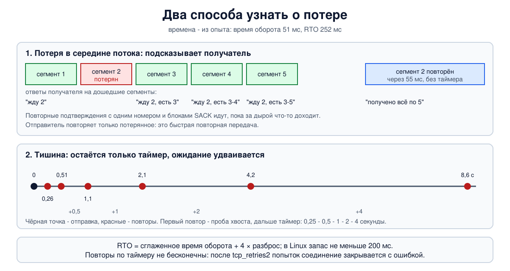

# Урок 40. Таймеры и повторная передача

TCP обещает доставить всё (урок 36), а IP пакеты теряет (урок 25). Мост между этими двумя фактами - **повторная передача**: отправитель хранит копию отправленного, пока не получит подтверждение, и если подтверждения нет, отправляет снова. Звучит просто, но в слове "нет" спрятан главный вопрос: **сколько ждать**? Поторопишься - отправишь повторно то, что и так дошло, и зря нагрузишь сеть. Промедлишь - соединение будет стоять после каждой потери. В этом уроке - как TCP измеряет время оборота и считает время ожидания, как ведёт себя при полной тишине и как узнаёт о потере гораздо раньше таймера - по повторным подтверждениям.

## Копия, таймер, повтор

Олифер описывает основу так: копия каждого отправленного сегмента ставится в очередь повторной передачи, и запускается таймер. Пришло подтверждение - копия удаляется; срок истёк - сегмент отправляется заново. Если до получателя дошли и оригинал, и повтор, дубликат отбрасывается (получатель узнаёт его по порядковым номерам).

Время ожидания подтверждения называется **RTO** (Retransmission TimeOut); Таненбаум называет таймер повторной передачи самым важным из таймеров TCP. На практике таймер один на соединение, а не на каждый сегмент: он следит за самым старым неподтверждённым.

## Сколько ждать: трудный выбор

Оба автора формулируют проблему одинаково. Олифер: слишком короткое ожидание даёт лишние повторы и снижает полезную пропускную способность, слишком длинное - простои. Таненбаум показывает, почему нельзя взять одно число на все случаи: на канальном уровне задержка почти постоянна, а в TCP разброс времени оборота велик, и оно **меняется на ходу**, за секунды, вместе с загрузкой сети. К тому же путь может быть каким угодно - от соседней стойки до другого континента. Таймер должен подстраиваться сам.

## Время оборота и его оценка

TCP постоянно измеряет **время оборота** (RTT, round-trip time): сколько прошло от отправки сегмента до подтверждения на него. Отдельные замеры скачут, поэтому их сглаживают. Олифер описывает общий принцип: замеры усредняются с весами, которые больше у свежих значений, а тайм-аут получается из среднего с запасом; он упоминает коэффициент больше двух и учёт разброса.

Точную схему, которой TCP пользуется до сих пор, предложил Джейкобсон в 1988 году; её излагает Таненбаум. TCP ведёт две величины:

- **RTTVAR** - сглаженный разброс, насколько замеры отклоняются от среднего. После каждого нового замера R: новый RTTVAR = 3/4 старого + 1/4 от |SRTT - R|, где SRTT - ещё прежнее значение;
- **SRTT** - сглаженное время оборота: новый SRTT = 7/8 старого + 1/8 от R. Старые замеры забываются постепенно.

И время ожидания:

**RTO = SRTT + 4 × RTTVAR**

Смысл формулы: ждать среднее время оборота плюс запас, и запас тем больше, чем сильнее время оборота прыгает. По одной только формуле на стабильной линии RTO почти равен времени оборота, на нервной - заметно больше. Таненбаум объясняет, почему раньше было хуже: первые реализации брали просто удвоенное время оборота, а постоянный множитель не замечает роста разброса - и именно под нагрузкой, когда задержки начинают скакать, шли лишние повторы, добавляя нагрузку. Про множитель 4 он честно пишет, что тот выбран довольно произвольно: умножать на 4 удобно сдвигом, и опоздать больше чем на четыре отклонения может меньше процента пакетов.

Действующий стандарт (RFC 6298; в книге ещё назван его предшественник RFC 2988) добавляет границы: пока замеров нет, RTO равен 1 секунде (до 2011 года было 3); вычисленное значение не должно быть меньше 1 секунды. Это правило Таненбаум тоже приводит. Реальные системы нижнюю границу опускают: в Linux запас в формуле не бывает меньше **200 миллисекунд**, так что RTO не меньше времени оборота плюс 200 мс; наибольший RTO - 120 секунд. Первый замер R задаёт начальные значения: SRTT = R, RTTVAR = R/2.

## Какой замер считать: алгоритм Карна

Отправили сегмент, не дождались, отправили повторно, пришло подтверждение. На что оно - на первую отправку или на вторую? Если ошибиться, оценка времени оборота испортится: примешь ответ на оригинал за ответ на повтор - получишь слишком маленькое число и начнёшь повторять ещё чаще.

Решение, которое Таненбаум связывает с радиолюбителем Филом Карном (**алгоритм Карна**, 1987): замеры по сегментам, которые передавались повторно, **не учитывать** вовсе, а время ожидания при каждом повторе **удваивать**, пока сегменты не начнут проходить с первой попытки.

Сегодня двусмысленность снимают ещё и метки времени из урока 36: в подтверждении возвращается метка того сегмента, на который оно отвечает, так что время оборота можно измерять и по повторам. Удвоение ожидания осталось.

## Тишина: повторы с удвоением

Если подтверждения не приходят совсем, отправитель повторяет сегмент снова и снова, каждый раз ожидая вдвое дольше: RTO, 2 RTO, 4 RTO и так далее, до потолка. Это **экспоненциальная выдержка** - то же удвоение, что мы видели у SYN в уроке 37 и у зондов окна в уроке 39. Логика общая: если сеть не отвечает, возможно, она перегружена, и частые повторы сделают только хуже.

Бесконечно это не длится. В Linux число повторов ограничивает `net.ipv4.tcp_retries2`, по умолчанию 15 - при наименьшем RTO это около 15 минут. После этого соединение закрывается, программа получает ошибку, обычно "Connection timed out" (урок 38). Пятнадцать минут - много, поэтому программы часто ставят собственный предел (параметр сокета `TCP_USER_TIMEOUT`) или следят за связью сами.

## Быстрая повторная передача

Ждать таймера - дорого: даже 200 миллисекунд по меркам быстрой сети вечность. К счастью, о потере в середине потока получатель сообщает сам, и почти сразу.

Вспомним накопительное подтверждение (урок 39): получатель подтверждает только непрерывную часть потока. Олифер разбирает пример: в буфере всё до байта 8400, следующий сегмент не пришёл, а тот, что за ним, пришёл. Подтвердить пришедшее получатель не может - в потоке "прогалина", - и он **повторяет прежнее подтверждение**: 8401. Каждый следующий сегмент, пришедший после прогалины, вызовет ещё одно такое же подтверждение (на практике Linux после первых нескольких отвечает одним подтверждением на несколько сегментов).

Для отправителя поток одинаковых подтверждений - ясный знак. Таненбаум описывает правило: **три повторных подтверждения** подряд означают, что сегмент, скорее всего, потерян (а не просто пришёл не по порядку), и его нужно отправить заново немедленно, не дожидаясь таймера. Это **быстрая повторная передача** (fast retransmit).

Выборочные подтверждения **SACK** (урок 36) делают картину точной: в каждом повторном подтверждении получатель перечисляет (до трёх блоков), какие куски после прогалины уже у него. Отправитель видит, что именно пропало, и повторяет только это, даже если потеряно несколько сегментов сразу.

Современный Linux пошёл дальше счёта до трёх: он определяет потерю по времени (алгоритм RACK, RFC 8985) - сегмент считается потерянным, если подтверждён сегмент, отправленный заметно позже него. А для потери в самом **хвосте** передачи, после которой повторным подтверждениям взяться неоткуда, он отправляет пробу (TLP): обычно примерно через два времени оборота, то есть раньше RTO, отправляет новые данные, если они есть, или повторяет последний сегмент, чтобы вызвать ответ получателя.

У повторной передачи по таймеру и быстрой - разные последствия для скорости, потому что они по-разному говорят о состоянии сети; об этом урок 41.



## Остальные таймеры

Для полноты - таймеры, которые мы уже встречали; Таненбаум перечисляет их рядом с таймером повторной передачи:

- **таймер настойчивости** - зонды при нулевом окне (урок 39);
- **keepalive** - проверка молчащего соединения (урок 38). Таненбаум называет его спорной возможностью: он добавляет трафик и может оборвать живое соединение из-за короткого сбоя связи;
- **таймер TIME-WAIT** - ожидание после закрытия (урок 38);
- и, уже не из его списка, таймер отложенного подтверждения у получателя (урок 39).

## Как это увидеть в Linux

Отправитель `a` (`192.0.2.1`) и получатель `b` (`192.0.2.2`). Посмотрим, как RTO следует за временем оборота; потеряем один сегмент в середине потока и увидим повторные подтверждения с SACK и быстрый повтор; потом "выдернем кабель" и увидим повторы по таймеру с удвоением. Нужны Linux (подойдёт WSL2), права sudo, python3, tcpdump и ethtool (`sudo apt install python3 tcpdump iproute2 ethtool`); всё создаётся в пространствах имён `hbh-*` и в конце удаляется. Опыт идёт около 30 секунд.

Создай файл `rto-lab.sh` и запусти `bash rto-lab.sh`:
```
set -u
for c in python3 tcpdump tc ss nstat ethtool; do
  command -v $c >/dev/null || { echo "нужен $c: sudo apt install python3 tcpdump iproute2 ethtool"; exit 1; }
done
# убрать остатки прошлого запуска
for n in hbh-a hbh-b; do
  sudo ip netns pids $n 2>/dev/null | xargs -r sudo kill
  sudo ip netns del $n 2>/dev/null
done
d=$(mktemp -d)
chmod 755 "$d"
# отправитель a (192.0.2.1) и получатель b (192.0.2.2)
for n in hbh-a hbh-b; do sudo ip netns add $n; done
sudo ip link add eth0 netns hbh-a type veth peer name eth0 netns hbh-b
sudo ip netns exec hbh-a ip addr add 192.0.2.1/24 dev eth0
sudo ip netns exec hbh-b ip addr add 192.0.2.2/24 dev eth0
for n in hbh-a hbh-b; do
  sudo ip netns exec $n ip link set lo up
  sudo ip netns exec $n ip link set eth0 up
  # без разгрузки сегментации, чтобы tcpdump видел настоящие сегменты (урок 36)
  sudo ip netns exec $n ethtool -K eth0 tso off gso off gro off >/dev/null 2>&1
done
A="sudo ip netns exec hbh-a"
B="sudo ip netns exec hbh-b"
# получатель читает всё, что пришлёт любой клиент
cat > "$d/recv.py" <<'EOF'
import socket, threading
l = socket.socket(); l.setsockopt(socket.SOL_SOCKET, socket.SO_REUSEADDR, 1)
l.bind(("0.0.0.0", 5000)); l.listen()
def drain(c):
    while c.recv(65536): pass
while True:
    threading.Thread(target=drain, args=(l.accept()[0],), daemon=True).start()
EOF
# отправитель: шлёт n байт, потом ждёт hold секунд и пробует отправить ещё 100 байт
cat > "$d/send.py" <<'EOF'
import socket, sys, time
n, hold = int(sys.argv[1]), float(sys.argv[2])
s = socket.create_connection(("192.0.2.2", 5000))
s.sendall(b"x" * n)
time.sleep(hold)
if len(sys.argv) > 3:
    t = time.time()
    try:
        s.sendall(b"y" * 100)
        s.settimeout(60); s.recv(1)
    except OSError as e:
        print(f"sender error: {e.strerror or e} after {time.time() - t:.1f} s")
EOF
timers() { $A ss -tni 'dport = :5000' | grep -oE ' (rto|rtt|backoff):[0-9./]+| retrans:[0-9/]+' | tr '\n' ' '; echo; }
$B python3 "$d/recv.py" &
sleep 0.5
echo '--- 1. round-trip time and the retransmission timeout'
$A python3 "$d/send.py" 100000 1.5 &
sleep 1
echo -n 'no delay:           '; timers
wait %2
$A tc qdisc add dev eth0 root netem delay 25ms
$B tc qdisc add dev eth0 root netem delay 25ms
$A python3 "$d/send.py" 100000 1.5 &
sleep 1
echo -n '25 ms each way:     '; timers
wait %2
echo '--- 2. one lost segment in the middle of a stream'
$A nstat -n
# на входе b отбрасываем ровно каждый 60-й пакет TCP
$B tc qdisc add dev eth0 ingress
$B tc filter add dev eth0 ingress protocol ip u32 match ip protocol 6 0xff action gact pass random determ drop 60
sleep 0.5
$A timeout 3 tcpdump -i eth0 -n -l -ttttt 'tcp port 5000' 2>/dev/null > "$d/fast" &
sleep 0.5
$A python3 "$d/send.py" 120000 1
wait %2
$B tc qdisc del dev eth0 ingress
f="$d/fast2"
sed -E 's/^ *00:00:0?//; s/ IP / /; s/nop,nop,TS val [0-9]+ ecr [0-9]+,?//; s/, options \[\]//; s/options \[nop,nop,(sack[^]]*)\]/\1/; s/, win [0-9]+//; s/, ack 1,/,/' "$d/fast" > "$f"
x=$(grep -m1 'sack 1' "$f" | grep -oE ' ack [0-9]+' | awk '{print $2; exit}')
echo "the lost segment starts at byte $x; it was sent at:"
grep -m1 "seq $x:" "$f"
echo 'the receiver keeps asking for it (first three of' $(grep -c "ack $x, sack 1" "$f") 'such acknowledgements):'
grep -m3 "ack $x, sack 1" "$f"
echo 'the sender repeats it without waiting for the timer:'
grep "seq $x:" "$f" | sed -n 2p
echo 'and one acknowledgement covers everything:'
awk -v x="seq $x:" 'index($0, x) {n++} n == 2 && /192.0.2.2.5000 >/ && !/sack 1/ {print; exit}' "$f"
$A nstat -z TcpRetransSegs TcpExtTCPFastRetrans TcpExtTCPSackRecovery TcpExtTCPTimeouts TcpExtTCPLossProbes | sed 1d | awk '{print $1, $2}'
echo '--- 3. the peer stops answering: retransmissions by timer'
$A sysctl -qw net.ipv4.tcp_retries2=5
$A nstat -n
$A timeout 16 tcpdump -i eth0 -n -l -ttt 'tcp port 5000 and tcp[tcpflags] & tcp-syn == 0' 2>/dev/null > "$d/rto" &
sleep 0.5
$A python3 "$d/send.py" 1000 2 more > "$d/s3" &
spid=$!
sleep 1.3
$B tc qdisc add dev eth0 ingress
$B tc filter add dev eth0 ingress protocol ip u32 match u32 0 0 action drop
sleep 3.5
echo -n 'during the retries: '; timers
wait $spid
sleep 1
sed -E 's/^ //; s/ IP / /; s/, options \[[^]]*\]//; s/, win [0-9]+//; s/, ack [0-9]+//' "$d/rto" | grep -A20 'length 100$' | sed 's/^--$//'
cat "$d/s3"
$A nstat -z TcpRetransSegs TcpExtTCPLossProbes TcpExtTCPTimeouts | sed 1d | awk '{print $1, $2}'
echo '--- cleanup'
for n in hbh-a hbh-b; do
  sudo ip netns pids $n 2>/dev/null | xargs -r sudo kill
  sudo ip netns del $n
done
rm -rf "$d"
ip netns list | grep -cE '^hbh-(a|b)( |$)'
```

Вот что получилось на нашем сервере:
```
--- 1. round-trip time and the retransmission timeout
no delay:            rto:201  rtt:0.123/0.127 
25 ms each way:      rto:252  rtt:51.113/1.498 
--- 2. one lost segment in the middle of a stream
the lost segment starts at byte 81089; it was sent at:
0.203975 192.0.2.1.39592 > 192.0.2.2.5000: Flags [.], seq 81089:82537, length 1448
the receiver keeps asking for it (first three of 16 such acknowledgements):
0.229022 192.0.2.2.5000 > 192.0.2.1.39592: Flags [.], ack 81089, sack 1 {82537:83985}, length 0
0.233247 192.0.2.2.5000 > 192.0.2.1.39592: Flags [.], ack 81089, sack 1 {82537:85433}, length 0
0.233274 192.0.2.2.5000 > 192.0.2.1.39592: Flags [.], ack 81089, sack 1 {82537:86881}, length 0
the sender repeats it without waiting for the timer:
0.258598 192.0.2.1.39592 > 192.0.2.2.5000: Flags [.], seq 81089:82537, length 1448
and one acknowledgement covers everything:
0.283818 192.0.2.2.5000 > 192.0.2.1.39592: Flags [.], ack 120001, length 0
TcpRetransSegs 1
TcpExtTCPSackRecovery 1
TcpExtTCPFastRetrans 1
TcpExtTCPTimeouts 0
TcpExtTCPLossProbes 0
--- 3. the peer stops answering: retransmissions by timer
during the retries:  rto:2024  backoff:3  rtt:52.1/20.958  retrans:1/4 
00:00:01.968774 192.0.2.1.39606 > 192.0.2.2.5000: Flags [P.], seq 1000:1100, length 100
00:00:00.258424 192.0.2.1.39606 > 192.0.2.2.5000: Flags [P.], seq 1000:1100, length 100
00:00:00.254881 192.0.2.1.39606 > 192.0.2.2.5000: Flags [P.], seq 1000:1100, length 100
00:00:00.559821 192.0.2.1.39606 > 192.0.2.2.5000: Flags [P.], seq 1000:1100, length 100
00:00:01.024846 192.0.2.1.39606 > 192.0.2.2.5000: Flags [P.], seq 1000:1100, length 100
00:00:02.055057 192.0.2.1.39606 > 192.0.2.2.5000: Flags [P.], seq 1000:1100, length 100
00:00:04.408076 192.0.2.1.39606 > 192.0.2.2.5000: Flags [P.], seq 1000:1100, length 100

sender error: Connection timed out after 16.8 s
TcpRetransSegs 6
TcpExtTCPTimeouts 6
TcpExtTCPLossProbes 1
--- cleanup
0
```

Разберём. Числа у тебя будут немного другими; картина - та же.

**Шаг 1: время оборота и RTO.** `ss -i` показывает то, что ядро знает о соединении: `rtt:среднее/разброс` - сглаженное время оборота и его разброс в миллисекундах, `rto` - текущее время ожидания.

- Без задержки: время оборота 0,123 мс, а `rto:201`. Сработала нижняя граница: запас в RTO в Linux не бывает меньше 200 мс.
- С задержкой 25 мс в каждую сторону (`netem`): время оборота около 51 мс, `rto:252` - те же 51 плюс запас 200. Сеть стабильна, разброс мал, и 4 × RTTVAR меньше нижней границы запаса. На линии с прыгающей задержкой RTO был бы заметно больше.

**Шаг 2: один потерянный сегмент.** Правило на входе `b` выбрасывает ровно каждый шестидесятый пакет; в поток из 120 000 байт попала одна потеря.

- Потерялся сегмент `seq 81089:82537`, отправленный на 0,204 секунды.
- С 0,229 получатель стал присылать подтверждения с одним и тем же номером `ack 81089` - "жду байт 81089" - и с растущим блоком SACK: `{82537:83985}`, потом `{82537:85433}`, `{82537:86881}`... Левая граница блока стоит на 82537: между 81089 и 82537 дыра ровно в один сегмент, а всё, что после неё, доходит и копится. Таких подтверждений пришло 16 - меньше, чем сегментов за дырой: после первых нескольких Linux отвечает одним подтверждением на несколько сегментов.
- На 0,259 отправитель повторил именно этот сегмент: через 55 мс после первой отправки, при том что RTO - 252 мс. Таймера он не ждал. Решение было принято ещё раньше, на 0,233, когда третье подтверждение показало, что за дырой дошли уже три сегмента; Linux считает именно сегменты, покрытые SACK, а не сами подтверждения. В записи повтор виден на 25 мс позже, потому что tcpdump видит исходящий пакет уже после задержки `netem`.
- На 0,284 пришло одно подтверждение `ack 120001`: дыра закрыта, и накопительное подтверждение разом покрыло всё, что лежало за ней.

Счётчики ядра: `TCPFastRetrans 1`, `TCPSackRecovery 1`, `TcpRetransSegs 1` - одна быстрая повторная передача с восстановлением по SACK; `TCPTimeouts 0` - таймер не срабатывал ни разу. У тебя номер потерянного байта и моменты могут отличаться, а если один блок SACK покроет сразу много сегментов, повтор уйдёт уже после второго подтверждения. Иногда ядро добавляет и пробу хвоста - тогда `TCPLossProbes` и `TcpRetransSegs` будут на единицу больше.

**Шаг 3: тишина.** Отправитель передал 1000 байт и получил подтверждение. Потом мы начали отбрасывать на входе `b` всё, и отправитель записал ещё 100 байт. Ключ `-ttt` показывает время от предыдущей строки:

- сегмент `seq 1000:1100` ушёл - и ответа нет;
- через 0,26 секунды - первый повтор, ещё через 0,25 - второй, дальше 0,56, 1,02, 2,06, 4,41: после второго повтора ожидание **удваивается**. Первый повтор - это проба хвоста (TLP), она ожидание не удваивает; остальные пять - повторы по таймеру. Проба ушла не раньше таймера, а ровно в его срок: когда в пути всего один сегмент, ядро добавляет к сроку пробы 200 мс (на случай отложенного подтверждения) и не даёт ему превысить RTO;
- в момент снимка `ss` показывал `rto:2024 backoff:3`: RTO уже вырос в восемь раз, это три удвоения; `retrans:1/4` - один повторённый сегмент сейчас без подтверждения, а всего повторов было четыре: проба и три по таймеру. Оценка `rtt` при этом не обновляется: замеров нет. Разброс здесь 21 мс, а не доли миллисекунды, потому что соединение новое: первый замер по стандарту задаёт разброс в половину времени оборота, и он ещё не успел сгладиться. 4 × 21 всё равно меньше 200, поэтому исходный RTO был тот же, около 252;
- мы заранее уменьшили `tcp_retries2` до 5, и через 17 секунд ядро сдалось: `Connection timed out`. С настройкой по умолчанию повторы шли бы около 15 минут.

Счётчики подтверждают: `TCPLossProbes 1` и `TCPTimeouts 6` - таймер срабатывал шесть раз: пять повторов и последнее срабатывание, на котором соединение закрыто.

В конце `0`: пространства имён удалены.
## Итог

- Отправитель хранит копию отправленного до подтверждения и повторяет её, если подтверждение не пришло за время RTO.
- RTO вычисляется из сглаженного времени оборота и его разброса: RTO = SRTT + 4 × RTTVAR (Джейкобсон, 1988). Чем нестабильнее сеть, тем больше запас. В Linux запас не меньше 200 мс.
- Алгоритм Карна: не измерять время оборота по повторённым сегментам и удваивать ожидание при каждом повторе. Метки времени позволяют измерять точно.
- При полной тишине повторы идут с удвоением ожидания, пока не исчерпается их число (`tcp_retries2`), затем соединение закрывается с ошибкой.
- Потерю в середине потока выдают повторные подтверждения; SACK показывает, что именно дошло. Отправитель повторяет потерянное сразу, не дожидаясь таймера, - быстрая повторная передача.
- В Linux потери определяются по времени (RACK), а потерю в хвосте ловит проба TLP.

## Что почитать

- Олифер, "Компьютерные сети", глава 15, с. 490-491: накопительное квитирование, очередь повторной передачи, выбор тайм-аута.
- Таненбаум, "Компьютерные сети", раздел 6.5.9, с. 640-643: таймер повторной передачи, алгоритмы Джейкобсона и Карна, другие таймеры; раздел 6.5.10, с. 649: повторные подтверждения и быстрая повторная передача; с. 652-653: выборочные подтверждения.
- RFC 6298 (вычисление RTO), RFC 5681 (быстрая повторная передача), RFC 2018 (SACK), RFC 8985 (RACK и TLP), RFC 7323 (метки времени), RFC 9293 (TCP).