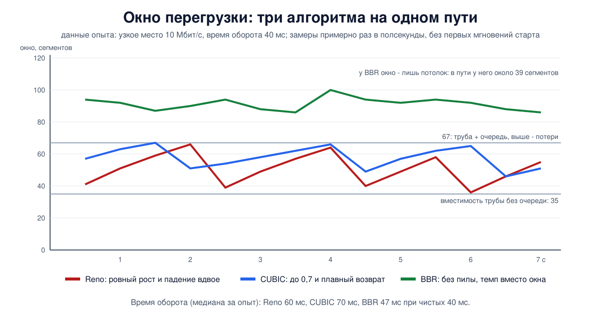

# Урок 41. Контроль перегрузки: Reno, CUBIC, BBR

Окно получателя из урока 39 защищает получателя. Но между отправителем и получателем лежит сеть, которую они делят с миллионами других соединений, и её пропускную способность никто заранее не сообщает. Если все будут отправлять столько, сколько готовы принять получатели, очереди на маршрутизаторах переполнятся, пакеты начнут теряться, повторные передачи добавят нагрузки - и сеть встанет. **Контроль перегрузки** - это то, как каждый отправитель сам, на ощупь, находит скорость, которую выдержит путь, и делит его с остальными. От этого механизма зависит скорость почти всего, что происходит в интернете, и именно здесь протоколы сильнее всего изменились за последние годы.

## Перегрузка и коллапс

Таненбаум описывает, что происходит с сетью при росте нагрузки. Сначала полезная пропускная способность растёт вместе с нагрузкой. Потом очереди на маршрутизаторах начинают расти, задержка увеличивается, рост замедляется. А дальше возможен **коллапс перегрузки**: пакеты задерживаются так сильно, что отправители по таймеру отправляют их повторно, хотя оригиналы ещё в пути; сеть занята копиями, и полезная работа падает, хотя нагрузка растёт.

Это не теория. По Таненбауму, с 1986 года интернет переживал такие коллапсы: длительные периоды, когда полезная пропускная способность падала более чем в сто раз. Ответом стала работа Ван Джейкобсона 1988 года, заложившая контроль перегрузки в TCP; примечательно, что он сделал это, не изменив ни одного поля в заголовках, - только поведение отправителя. Тогда же появился точный расчёт таймера из урока 40.

Почему этим занимается транспортный уровень, а не сеть? Перегрузка возникает на маршрутизаторах, но создают её отправители, и, как замечает Таненбаум, единственный действенный способ её снять - чтобы отправители передавали медленнее.

## Чего мы хотим от алгоритма

Таненбаум называет три требования.

- **Эффективность**: использовать доступную пропускную способность, но не доводить до перегрузки. Лучшая рабочая точка - не максимум нагрузки, а чуть раньше, там, где задержка ещё не начала расти.
- **Справедливость**: соединения, которые делят один узкий участок, должны получать сравнимые доли. Точное определение - справедливость "максимин": нельзя дать одному потоку больше, не отняв у потока, которому досталось столько же или меньше.
- **Быстрая сходимость**: соединения приходят и уходят, и алгоритм должен быстро находить новое равновесие, не раскачиваясь.

## Сигнал и реакция

Отправителю нужен **сигнал** о перегрузке и **правило** реакции. Таненбаум сводит варианты сигнала в таблицу; для нас важны три:

- **потеря пакета** - неявный сигнал: маршрутизатор с переполненной очередью отбрасывает пакеты. Им пользуются классический TCP и CUBIC. Сигнал, как пишет Таненбаум, надёжный, но запоздалый: очередь уже переполнена;
- **явное уведомление (ECN)** - маршрутизатор не отбрасывает пакет, а ставит на нём отметку в заголовке IP; получатель возвращает её отправителю флагом ECE в заголовке TCP, отправитель отвечает флагом CWR (урок 36) и снижает скорость, как при потере, только без потери;
- **задержка** - рост времени оборота означает, что где-то растёт очередь. Так работают алгоритмы, которые хотят заметить перегрузку до потерь.

Олифер пишет о том же в общих словах: потеря пакетов - косвенный признак перегрузки, и TCP - пример протокола, который судит о перегрузке неявно; отправитель может сам уменьшить окно, когда линия работает ненадёжно - запаздывают квитанции, часты повторы, а действует меньшее из окна получателя и окна, выбранного отправителем.

## AIMD: прибавлять понемногу, убавлять резко

Какое правило реакции выбрать? Таненбаум пересказывает результат Чиу и Джейна (1989). Если при сигнале перегрузки все убавляют скорость на одну и ту же величину, а без сигнала на одну и ту же величину прибавляют, разница между соединениями сохраняется навсегда: кто начал с большой доли, с ней и останется. Если и прибавлять, и убавлять в разы - сохраняется отношение долей. К справедливому и эффективному распределению сходится только одна комбинация:

- нет сигнала - **прибавлять на постоянную величину** (аддитивное увеличение);
- есть сигнал - **убавлять в разы**, например вдвое (мультипликативное уменьшение).

Это **AIMD** (additive increase, multiplicative decrease). Убавление в разы отнимает больше у того, у кого больше, и с каждым циклом доли сближаются. Таненбаум добавляет и второй довод: в перегрузку легко войти и трудно из неё выйти, поэтому расти нужно осторожно, а отступать - решительно.

## Окно перегрузки

TCP управляет не скоростью, а окном. У отправителя есть **окно перегрузки** (cwnd, congestion window) - сколько данных он позволяет себе держать в пути неподтверждёнными. Получатель о нём не знает, в заголовке его нет. В каждый момент действует **меньшее из двух окон**: окна получателя (урок 39) и окна перегрузки. Скорость получается как окно, делённое на время оборота.

У окна есть приятное свойство, которое у Таненбаума названо ack clock, синхронизация по подтверждениям: новый сегмент уходит, когда приходит подтверждение на старый, а подтверждения приходят в темпе самого узкого участка пути. Отправитель сам собой подстраивается под этот темп и не копит очередь, пока окно не растёт.

## Медленный старт

С какого окна начать? Если с большого, первый же всплеск забьёт медленную линию. Если с одного сегмента и прибавлять по одному за оборот, разгон займёт вечность: в примере Таненбаума (10 Мбит/с, оборот 100 мс, нужно окно в 100 пакетов) - десять секунд.

Решение Джейкобсона - **медленный старт**: начать с малого окна и на каждое пришедшее подтверждение увеличивать окно на один сегмент. Каждый подтверждённый сегмент разрешает отправить два, и окно **удваивается за каждое время оборота**: 10, 20, 40, 80... Название обманчиво: рост экспоненциальный. "Медленный" он только по сравнению с отправкой всего сразу.

Начальное окно по книге - до четырёх сегментов; сегодня обычно **десять** (RFC 6928, 2013), в Linux так по умолчанию. Это те самые десять сегментов из опыта с `TCP_NODELAY` в уроке 39.

Удвоение не может продолжаться долго: рано или поздно окно превысит то, что выдержит путь. Поэтому у соединения есть **порог медленного старта** (ssthresh): пока окно меньше порога - удвоение, выше порога - осторожный рост. Сначала порог очень велик, и медленный старт обычно кончается первой потерей.

## Предотвращение перегрузки и пила

Выше порога начинается **предотвращение перегрузки**: окно растёт примерно на один сегмент за время оборота. Это аддитивная часть AIMD.

Что происходит при потере, зависит от того, как о ней узнали (урок 40):

- **по таймеру** - сигнал тяжёлый: подтверждений нет вообще. Порог ставится в половину текущего окна, окно сбрасывается до одного сегмента, и снова медленный старт. В первой версии, **TCP Tahoe** (1988), так обрабатывалась любая потеря, даже замеченная по повторным подтверждениям и сразу исправленная быстрым повтором;
- **по повторным подтверждениям** - сигнал лёгкий: сегменты доходят, потеряно немного. **TCP Reno** (1990) добавил **быстрое восстановление**: потерянный сегмент повторяется, порог и окно ставятся в половину прежнего окна, и линейный рост продолжается с этого места, без медленного старта. Идея Джейкобсона, по Таненбауму: каждое повторное подтверждение означает, что ещё один сегмент покинул сеть, так что темп подтверждений можно не терять.

График окна у Reno - **пила**: линейный подъём, потеря, падение вдвое, снова подъём. (В русском издании Таненбаума в этом месте сказано, что окно уменьшается "в полтора раза"; это ошибка перевода, окно уменьшается вдвое.)



Дальнейшие улучшения не меняли этой логики. **NewReno** научился восстанавливаться после нескольких потерь в одном окне, не дожидаясь таймера; **SACK** (урок 40) показывает отправителю, что именно потеряно.

У пилы есть свойство, которое стоит запомнить: чтобы найти предел, алгоритм, судящий по потерям, должен **переполнить очередь** узкого места. Он работает при заполненной очереди, то есть с лишней задержкой, и тем большей, чем больше буфер. Для потерь есть и простой закон (его приводит Таненбаум, ссылаясь на Падхая): скорость такого TCP обратно пропорциональна квадратному корню из доли потерянных пакетов. При десяти процентах потерь, по его словам, соединение практически перестаёт работать. Поэтому беспроводные сети, где пакеты теряются от помех, а не от перегрузки, прячут потери от TCP собственными повторами на канальном уровне (урок 19).

## CUBIC

На быстрых и длинных линиях пила Reno слишком медленная. Если для заполнения пути нужно окно в десятки тысяч сегментов, то после потери возвращаться к нему по сегменту за оборот придётся больше часа.

**CUBIC** меняет закон роста. По Таненбауму: окно растёт как функция **времени, прошедшего с последней потери**, а не числа пришедших подтверждений, и функция эта кубическая - сначала быстрый рост, потом плато возле того окна, при котором случилась прошлая потеря, потом снова ускорение, разведка выше. Рядом с известным пределом CUBIC осторожен, вдали от него - быстр.

Чего в книге нет (RFC 9438): после потери CUBIC уменьшает окно не вдвое, а до 0,7 прежнего; и раз рост привязан ко времени, а не к подтверждениям, соединения с большим временем оборота проигрывают коротким меньше, чем у Reno, где окно растёт раз в оборот (на эту несправедливость AIMD к дальним узлам указывает и Таненбаум). CUBIC - алгоритм по умолчанию в Linux с ядра 2.6.19 и в современных Windows; сигнал у него тот же, что у Reno, - потеря.

## BBR

К 2010-м у алгоритмов на потерях обнаружилась системная проблема, которую Таненбаум называет излишней буферизацией (bufferbloat): буферы в узких местах стали слишком большими, и алгоритм, которому для сигнала нужно переполнить очередь, заполняет их целиком. Сигнал о потере запаздывает, задержка растёт - на практике до сотен миллисекунд, - и страдают все, кто делит эту очередь.

**BBR** (Bottleneck Bandwidth and Round-trip propagation time, Google, 2016) отказывается от потерь как главного сигнала. По Таненбауму, он строит **модель пути** из двух величин, которые постоянно измеряет:

- **пропускная способность узкого места** - наибольшая скорость доставки, замеченная за последние несколько оборотов;
- **время оборота без очередей** - наименьшее из замеченных за последние секунды (эта подробность - из статьи авторов алгоритма).

Пока данных в пути меньше, чем произведение этих двух величин, скорость доставки растёт, а время оборота нет; сверх этого - скорость упирается в потолок, а время оборота начинает расти, потому что данные встают в очередь. BBR старается держаться ровно на этой границе: **отправляет с темпом, равным измеренной пропускной способности** (равномерно, без всплесков), и держит в пути немногим больше, чем нужно для заполнения трубы. В идеале, для одиночного потока, очередь при этом почти пуста.

Чтобы модель не устаревала, BBR её регулярно проверяет; этих подробностей в книге нет, они из описания авторов алгоритма. На старте он разгоняется удвоением, как медленный старт, пока скорость доставки не перестанет расти, и сразу сливает накопившуюся очередь. Дальше он время от времени ненадолго отправляет чуть быстрее - не выросла ли пропускная способность - и изредка резко сбавляет, чтобы заново измерить время оборота без очереди.

Цена - справедливость. Таненбаум приводит исследование 2019 года: одно соединение BBR, делившее путь с шестнадцатью обычными, заняло 40% канала. BBR и алгоритмы на потерях играют по разным правилам, и деление между ними получается неровным. Следующие версии (BBRv2, BBRv3) учитывают потери и отметки ECN и ведут себя аккуратнее; в основном ядре Linux пока первая версия, с ней мы и будем ставить опыт.

BBR применяется у Google и на многих серверах, раздающих видео и файлы. В Linux он доступен с ядра 4.9 и выбирается настройкой `net.ipv4.tcp_congestion_control`. Алгоритм выбирает **отправитель** и только для себя: получателю и сети ничего менять не нужно, а сервер и клиент могут использовать разные алгоритмы.

Запомним на будущее: QUIC (урок 43) передаёт данные поверх UDP и контроль перегрузки выполняет сам: стандарт описывает базовую схему, близкую к Reno, а реализации обычно ставят CUBIC или BBR. А когда пакеты TCP-соединения целиком упакованы в туннель, который сам построен на TCP (пакетный туннель, блок 10), контроль перегрузки и повторы срабатывают дважды, и при потерях всё сильно замедляется; это одна из причин, по которым такие туннели строят на UDP. К прокси, которые принимают поток и открывают своё соединение дальше, это не относится.

## Как это увидеть в Linux

Соберём отправителя `a`, маршрутизатор `r` и получателя `b`. На выходе маршрутизатора - узкое место: 10 Мбит/с и небольшая очередь; время оборота 40 миллисекунд. Отправим поток сначала с Reno, потом с CUBIC, потом с BBR, наблюдая окно перегрузки примерно раз в полсекунды, а потом пустим два потока Reno одновременно. Нужны Linux (подойдёт WSL2), права sudo, python3 и ethtool (`sudo apt install python3 iproute2 ethtool`); всё создаётся в пространствах имён `hbh-*` и в конце удаляется. Модуль ядра `tcp_bbr` скрипт пробует загрузить сам (он останется загруженным до перезагрузки; выгрузить - `sudo modprobe -r tcp_bbr`; алгоритм по умолчанию при этом не меняется); если модуля нет, шаг с BBR будет пропущен. Опыт идёт около минуты.

Создай файл `congestion-lab.sh` и запусти `bash congestion-lab.sh`:
```
set -u
for c in python3 tc ss ethtool; do
  command -v $c >/dev/null || { echo "нужен $c: sudo apt install python3 iproute2 ethtool"; exit 1; }
done
# убрать остатки прошлого запуска
for n in hbh-a hbh-r hbh-b; do
  sudo ip netns pids $n 2>/dev/null | xargs -r sudo kill
  sudo ip netns del $n 2>/dev/null
done
d=$(mktemp -d)
chmod 755 "$d"
# отправитель a (192.0.2.1) - маршрутизатор r - получатель b (198.51.100.2)
for n in hbh-a hbh-r hbh-b; do sudo ip netns add $n; done
A="sudo ip netns exec hbh-a"
R="sudo ip netns exec hbh-r"
B="sudo ip netns exec hbh-b"
sudo ip link add eth0 netns hbh-a type veth peer name eth0 netns hbh-r
sudo ip link add eth0 netns hbh-b type veth peer name eth1 netns hbh-r
$A ip addr add 192.0.2.1/24 dev eth0
$R ip addr add 192.0.2.254/24 dev eth0
$R ip addr add 198.51.100.254/24 dev eth1
$B ip addr add 198.51.100.2/24 dev eth0
for n in hbh-a hbh-r hbh-b; do sudo ip netns exec $n ip link set lo up; sudo ip netns exec $n ip link set eth0 up; done
$R ip link set eth1 up
# без разгрузки сегментации: иначе по сети ходят склеенные сверхпакеты, и очередь в 50 пакетов теряет смысл (урок 36)
$A ethtool -K eth0 tso off gso off gro off >/dev/null 2>&1
$B ethtool -K eth0 tso off gso off gro off >/dev/null 2>&1
$R ethtool -K eth0 tso off gso off gro off >/dev/null 2>&1
$R ethtool -K eth1 tso off gso off gro off >/dev/null 2>&1
$A ip route add default via 192.0.2.254
$B ip route add default via 198.51.100.254
$R sysctl -qw net.ipv4.ip_forward=1
# узкое место на выходе маршрутизатора: 10 Мбит/с, очередь на 50 пакетов; плюс по 20 мс задержки в каждую сторону
$R tc qdisc add dev eth1 root netem rate 10mbit delay 20ms limit 50
$B tc qdisc add dev eth0 root netem delay 20ms
sudo modprobe tcp_bbr 2>/dev/null
echo "available: $($A sysctl -n net.ipv4.tcp_available_congestion_control)"
cat > "$d/recv.py" <<'EOF'
import socket, threading
l = socket.socket(); l.setsockopt(socket.SOL_SOCKET, socket.SO_REUSEADDR, 1)
l.bind(("0.0.0.0", 5000)); l.listen()
def drain(c):
    while c.recv(1 << 20): pass
while True:
    threading.Thread(target=drain, args=(l.accept()[0],), daemon=True).start()
EOF
# отправитель: выбранный алгоритм, шлёт seconds секунд, сообщает, сколько успел
cat > "$d/send.py" <<'EOF'
import socket, sys, time
algo, seconds = sys.argv[1], float(sys.argv[2])
s = socket.socket()
s.setsockopt(socket.IPPROTO_TCP, socket.TCP_CONGESTION, algo.encode())
s.connect(("198.51.100.2", 5000))
sent, t = 0, time.time()
while time.time() - t < seconds:
    sent += s.send(b"x" * 65536)
info = s.getsockopt(socket.IPPROTO_TCP, socket.TCP_INFO, 232)
retrans = int.from_bytes(info[100:104], "little")     # tcpi_total_retrans
acked = int.from_bytes(info[120:128], "little")       # tcpi_bytes_acked
s.close()
print(f"{algo}: delivered {acked * 8 / seconds / 1e6:.1f} Mbit/s, retransmitted segments: {retrans}")
EOF
field() { $A ss -tni state established '( dport = :5000 )' | grep -oE " $1:[0-9.]+" | head -1 | cut -d: -f2; }
# сколько сегментов повторено с начала соединения (второе число в поле retrans:сейчас/всего)
rtx() { r=$($A ss -tni state established '( dport = :5000 )' | grep -oE ' retrans:[0-9]+/[0-9]+' | head -1 | cut -d/ -f2); echo ${r:-0}; }
# не переносить оценки прошлого соединения на следующее
$A sysctl -qw net.ipv4.tcp_no_metrics_save=1
$B python3 "$d/recv.py" &
sleep 0.5
echo '--- 1. one flow through a 10 Mbit/s bottleneck: the congestion window over time'
for algo in reno cubic bbr; do
  $A sysctl -n net.ipv4.tcp_available_congestion_control | grep -qw $algo || { echo "$algo: not available in this kernel"; continue; }
  $A python3 "$d/send.py" $algo 9 > "$d/$algo" &
  spid=$!
  n=0; until [ -n "$(field cwnd)" ] || [ $n -gt 300 ]; do sleep 0.01; n=$((n + 1)); done
  echo -n "$algo, first 0.3 s:   cwnd"
  for i in 1 2 3 4 5; do echo -n " $(field cwnd)"; sleep 0.03; done; echo
  echo -n "$algo, every 0.5 s:   cwnd"
  rtts=""
  for i in $(seq 14); do
    sleep 0.45; echo -n " $(field cwnd)"; rtts="$rtts $(field rtt)"
    [ $i = 4 ] && early=$(rtx)
  done; echo
  echo "$algo, rtt, ms:       min $(echo $rtts | tr ' ' '\n' | sort -n | sed -n '1p' | cut -d. -f1), median $(echo $rtts | tr ' ' '\n' | sort -n | sed -n '7p' | cut -d. -f1), max $(echo $rtts | tr ' ' '\n' | sort -n | sed -n '$p' | cut -d. -f1)"
  echo "$algo, retransmitted in the first 2 s: $early"
  wait $spid
  cat "$d/$algo"
  sleep 2
done
echo '--- 2. two reno flows share the same bottleneck'
$A python3 "$d/send.py" reno 15 > "$d/f1" &
p1=$!
$A python3 "$d/send.py" reno 15 > "$d/f2" &
wait $p1 $!
echo "flow 1: $(cat "$d/f1")"
echo "flow 2: $(cat "$d/f2")"
echo '--- cleanup'
for n in hbh-a hbh-r hbh-b; do
  sudo ip netns pids $n 2>/dev/null | xargs -r sudo kill
  sudo ip netns del $n
done
rm -rf "$d"
ip netns list | grep -cE '^hbh-(a|r|b)( |$)'
```

Вот что получилось на нашем сервере:
```
available: reno cubic bbr
--- 1. one flow through a 10 Mbit/s bottleneck: the congestion window over time
reno, first 0.3 s:   cwnd 20 53 122 66 66
reno, every 0.5 s:   cwnd 41 51 59 66 39 49 57 64 40 49 58 36 46 55
reno, rtt, ms:       min 46, median 60, max 82
reno, retransmitted in the first 2 s: 67
reno: delivered 9.5 Mbit/s, retransmitted segments: 76
cubic, first 0.3 s:   cwnd 20 49 69 61 49
cubic, every 0.5 s:   cwnd 57 63 67 51 54 58 62 66 49 57 62 65 46 51
cubic, rtt, ms:       min 56, median 70, max 79
cubic, retransmitted in the first 2 s: 6
cubic: delivered 9.6 Mbit/s, retransmitted segments: 9
bbr, first 0.3 s:   cwnd 20 44 97 82 74
bbr, every 0.5 s:   cwnd 94 92 87 90 94 88 86 100 94 92 94 92 88 86
bbr, rtt, ms:       min 43, median 47, max 54
bbr, retransmitted in the first 2 s: 106
bbr: delivered 9.1 Mbit/s, retransmitted segments: 106
--- 2. two reno flows share the same bottleneck
flow 1: reno: delivered 4.4 Mbit/s, retransmitted segments: 63
flow 2: reno: delivered 5.1 Mbit/s, retransmitted segments: 45
--- cleanup
0
```

Разберём. Числа меняются от запуска к запуску: всё зависит от того, в какой момент случились потери. Смотреть нужно на форму.

Для ориентира посчитаем, сколько сегментов помещается на этом пути (сегмент здесь - около 1448 байт данных). В самой "трубе": 10 Мбит/с × 0,04 с = 400 кбит, около 33-35 сегментов. Очередь: предел `netem` в 50 пакетов общий для тех, что стоят в очереди, и тех, что "едут" свои 20 мс задержки (их около 17), так что на очередь остаётся около 33. Итого, когда в пути больше примерно 67 сегментов, начинаются потери. И ещё: 10 Мбит/с канала - это вместе с заголовками, поэтому данных доставляется не больше 9,6 Мбит/с. Скорость в последней строке каждого алгоритма посчитана грубо - по времени, которое отправитель писал в сокет, - так что погрешность в несколько десятых обычна.

**Reno** (в Linux это современный вариант: с SACK и определением потерь по времени из урока 40).

- **Медленный старт**: за первые треть секунды окно выросло до 122 сегментов, от замера к замеру - в два с лишним раза (замеры идут чуть реже, чем раз в оборот). Оно проскочило предел почти вдвое, и очередь переполнилась: почти все повторные сегменты, 67 из 76, пришлись на первые две секунды (совпадение этого числа с пределом в 67 сегментов случайно). Так кончается медленный старт у алгоритма, который судит по потерям.
- **Пила**: дальше окно ходит между половиной предела и пределом: 41, 51, 59, 66 - потеря - 39, 49, 57, 64 - потеря - 40, 49, 58. Рост ровный, 7-10 сегментов за полсекунды, то есть примерно по сегменту за оборот (оборот здесь 50-80 мс; чем полнее очередь, тем оборот длиннее и рост медленнее). После потери следующий замер примерно вдвое меньше: **мультипликативное уменьшение**.
- Время оборота ходит вместе с окном: от 46 мс, когда очередь почти пуста, до 82 мс, когда она полна; в середине - 60.

**CUBIC.**

- Медленный старт кончился раньше: 20, 49, 69 - и уже 61. Повторных сегментов всего 9. Вероятная причина - HyStart: в Linux CUBIC на старте следит за временем оборота и выходит из медленного старта, когда оно начинает расти.
- Зубцы мельче: 57, 63, 67 - потеря - 51, 54, 58, 62, 66 - потеря - 49, 57, 62, 65 - потеря - 46. Окно падает не вдвое, а примерно до 0,7 и возвращается к пределу. Кубической кривой на таком маленьком окне не видно: на коротких и небыстрых путях CUBIC нарочно растёт не медленнее Reno и потому выглядит почти как он, только с коэффициентом 0,7.
- Поэтому очередь у CUBIC пустеет меньше: время оборота от 56 до 79 мс, в середине 70. По скорости на этом пути разницы с Reno нет, а задержка выше.

Очередь у нас маленькая - примерно как сама труба: у Reno после падения окна она почти пустеет (46 мс), у CUBIC - лишь наполовину (56 мс). При буфере в несколько раз больше трубы оба держали бы очередь занятой всегда, а задержка росла бы до сотен миллисекунд: по расчёту, 500 пакетов в очереди на этой линии - около 600 мс. Попробуй сам заменить в скрипте `limit 50` на `limit 500`.

**BBR.**

- Окно не ходит пилой, а держится около 90 сегментов - больше предела в 67. Противоречия нет: у BBR окно - только страховочный потолок, около двух "труб" с запасом. Сколько данных на самом деле в пути, определяет темп отправки, равный измеренной пропускной способности узкого места. В WSL2 этот потолок получился 76: число зависит от оценок модели.
- Время оборота - от 43 до 54 мс, в середине 47: заметно ближе к чистым 40, чем у Reno (60) и CUBIC (70). Очередь узкого места большую часть времени почти пуста: при обороте 47 мс в пути находится около 39 сегментов, а вовсе не 90. (Значения сглаженные, как в уроке 40.)
- Старт у BBR тоже с удвоением и тоже с переполнением очереди: все 106 повторных сегментов пришлись на первые две секунды, дальше потерь не было.
- Доставлено 9,1 Мбит/с против 9,5-9,6 - скорее всего, из-за потерь на старте; в WSL2 разницы не было, так что по одному запуску вывода о скорости делать нельзя.

**Шаг 2: два потока Reno.** Запущенные одновременно, они поделили канал почти поровну: 4,4 и 5,1 Мбит/с. Никто им долей не назначал: оба применяют одно и то же правило. Настоящая проверка AIMD - неравный старт: если запустить второй поток на несколько секунд позже, доли будут сближаться постепенно.

В конце `0`: пространства имён удалены.

## Итог

- Перегрузка - когда отправители дают сети больше, чем она может передать; без контроля это кончается коллапсом. Скорость сдерживает сам отправитель, с помощью окна перегрузки; действует меньшее из окна перегрузки и окна получателя.
- AIMD - прибавлять понемногу, убавлять в разы - единственная из простых комбинаций, которая приводит соединения к справедливому и эффективному делению.
- Медленный старт удваивает окно каждый оборот до порога или первой потери; дальше окно растёт на сегмент за оборот. Потеря по повторным подтверждениям - окно вдвое (Reno); по таймеру - окно до одного сегмента и снова медленный старт.
- CUBIC растит окно по кубической функции времени с последней потери: быстро вдали от предела, осторожно возле него; после потери - до 0,7. Это алгоритм по умолчанию в Linux.
- Алгоритмы на потерях заполняют очередь узкого места и добавляют задержку. BBR измеряет пропускную способность и время оборота и отправляет в темпе узкого места, не заполняя очередь; платит он за это неровным делением с алгоритмами на потерях.
- Алгоритм выбирает отправитель; получатель и сеть об этом не знают.

## Что почитать

- Таненбаум, "Компьютерные сети", раздел 6.3, с. 599-610: перегрузка, справедливость, AIMD, беспроводные сети; раздел 6.5.10, с. 643-653: окно перегрузки, медленный старт, Tahoe, Reno, SACK, ECN; раздел 6.5.11, с. 654: CUBIC; раздел 6.6.2, с. 655-657: BBR.
- Олифер, "Компьютерные сети", глава 5, с. 168-170: обратная связь для предотвращения перегрузок; глава 15, с. 491-492: окно и перегрузка.
- RFC 5681 (контроль перегрузки в TCP), RFC 6928 (начальное окно), RFC 9438 (CUBIC), RFC 3168 (ECN).
- RFC 9002 (контроль перегрузки в QUIC). Cardwell N. и др. "BBR: Congestion-Based Congestion Control", ACM Queue, 2016.