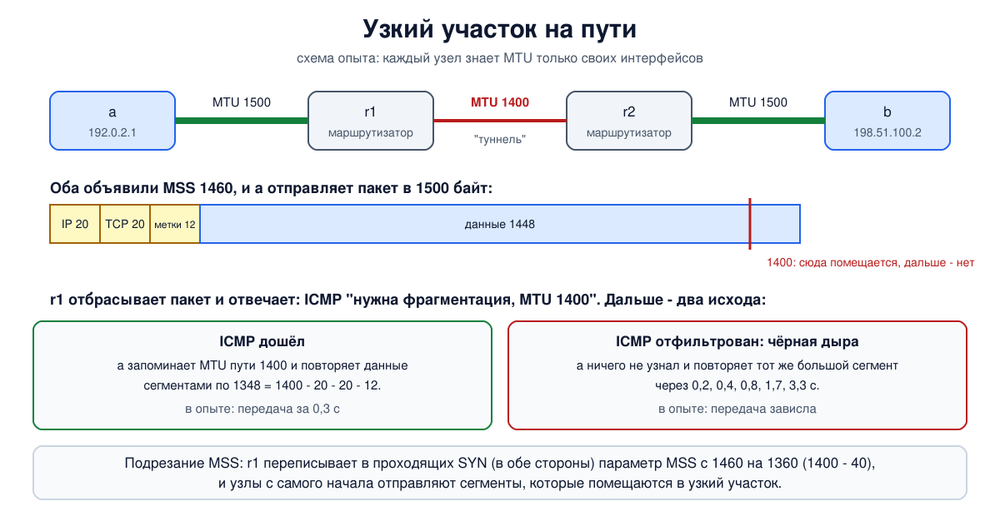

# Урок 42. MSS и MTU: почему в туннелях ломаются большие пакеты

Есть неисправность, которую встречал почти каждый, кто настраивал туннель или VPN. Соединение устанавливается. Маленькие запросы проходят. А большие - страница с картинками, передача файла, рукопожатие TLS - зависают намертво. Пинг при этом идёт, порт открыт, потерь не видно. Очень часто причина одна: где-то на пути участок с меньшим MTU, и сообщение об этом до отправителя не доходит. В этом уроке соберём вместе три вещи, которые уже знаем - MTU и фрагментацию (урок 27), MSS (урок 36) и повторы (урок 40), - и разберём, откуда берётся эта неисправность и как её лечат.

## MTU и MSS: кто что знает

**MTU** - наибольший размер IP-пакета, который можно передать через данный интерфейс (урок 27). У Ethernet это 1500 байт. MTU - свойство **одного участка** пути.

**MSS** - наибольший размер данных в сегменте TCP, который узел **готов принять** (урок 36); каждая сторона объявляет его в своём SYN, и отправитель ориентируется на MSS собеседника. Таненбаум называет предел, под который подбирают размер сегмента: он должен помещаться в MTU, чтобы пакет не пришлось фрагментировать. Если параметра нет, считается 536 байт.

Откуда узел берёт число для MSS? В простом случае - из MTU **своего** интерфейса: MTU минус 20 байт заголовка IP и 20 байт заголовка TCP. Для Ethernet это 1460 (в IPv6 заголовок 40 байт, и MSS получается 1440). Параметры TCP в это число не входят: если в каждом сегменте едут метки времени, данных в нём на 12 байт меньше.

И вот главное: узел знает MTU своего интерфейса, но **не знает MTU остальных участков пути**. Два узла в обычных сетях Ethernet объявят друг другу по 1460 и будут считать, что пакеты по 1500 байт пройдут. Пройдут ли - зависит от того, что между ними.

## Где MTU меньше: арифметика туннелей

Туннель (блок 10) - это когда пакет целиком кладут внутрь другого пакета. Внешние заголовки занимают место, и на внутренний пакет его остаётся меньше. Несколько типичных случаев на линии с MTU 1500:

- **PPPoE** (так часто подключают домашний интернет): 8 байт заголовков, MTU 1492;
- **IP в IP**: ещё один заголовок IP, 20 байт - MTU 1480;
- **GRE**: заголовок IP и GRE, 24 байта - MTU 1476;
- **WireGuard**: заголовок IP, UDP и свои 32 байта - 60 байт поверх IPv4 (остаётся 1440) и 80 поверх IPv6 (остаётся 1420); по умолчанию у его интерфейса MTU 1420, чтобы подходило в обоих случаях;
- **IPsec** (в туннельном режиме): примерно от 50 до 70 с лишним байт в зависимости от шифров.

Туннели вкладываются друг в друга, и накладные расходы складываются. Узел с MSS 1460 отправляет пакет в 1500 байт, и на входе в туннель он не помещается.

## Что должно произойти: определение MTU пути

Правильный ход событий мы разбирали в уроке 27. TCP отправляет пакеты с флагом **DF** ("не фрагментировать"). Маршрутизатор, которому пакет не влезает в следующий участок, отбрасывает его и возвращает отправителю сообщение ICMP "адресат недостижим, нужна фрагментация" с указанием подходящего MTU (в IPv6 - "пакет слишком велик"). Отправитель запоминает это значение для данного адресата, уменьшает сегменты и повторяет данные. Таненбаум описывает это как обычное поведение современного TCP: определение MTU пути (path MTU discovery) по сообщениям ICMP, чтобы выбрать размер сегмента без фрагментации.

Всё происходит за одно-два времени оборота, и программа ничего не замечает.

## Чёрная дыра

Механизм держится на том, что сообщение ICMP **дойдёт** до отправителя. А доходит оно не всегда:

- файервол отбрасывает "весь ICMP" - распространённая ошибка настройки (урок 28: сообщение "нужна фрагментация" и его собрат из IPv6 пропускать обязательно);
- маршрутизатор в туннеле не отправляет это сообщение или отправляет с адреса, который фильтруется по дороге;
- отправитель стоит за балансировщиком, и сообщение попадает не на тот сервер.

Тогда получается **чёрная дыра**: большие пакеты молча исчезают, отправитель ничего не узнаёт и по таймеру повторяет тот же большой сегмент - снова и снова, с удвоением ожидания (урок 40). Отсюда и знакомая картина:

- рукопожатие TCP проходит - в нём пакеты маленькие;
- маленькие запросы и ответы проходят;
- зависает первое же сообщение больше MTU узкого участка: ответ сервера с сертификатами в TLS, тело страницы, вставка большого текста в SSH.

Зависать может и только одно направление - то, где данных много.



## Четыре способа лечения

Проблему туннелей и MTU разбирает RFC 4459. Он перечисляет свои варианты: фрагментировать пакеты на входе в туннель и собирать на выходе (дорого и ненадёжно, урок 27), сообщать отправителю меньший MTU по ICMP и другие. На практике чаще всего встречаются четыре способа, и у каждого своя цена.

**1. Починить ICMP.** Правильное решение: не фильтровать сообщения "нужна фрагментация" и "пакет слишком велик". Работает для любого протокола, но требует, чтобы правильно были настроены все устройства на пути, а они часто чужие.

**2. Подрезать MSS на маршрутизаторе (MSS clamping).** Маршрутизатор у входа в туннель заглядывает в проходящие сегменты SYN и **переписывает в них параметр MSS** на значение, подходящее для узкого участка. Узлы, получив уменьшенный MSS собеседника, с самого начала отправляют сегменты, которые пролезут, и никакой ICMP не нужен. Это нарушение принципов - устройство сетевого уровня правит заголовок транспортного, - зато работает, не требует ничего от конечных узлов и потому применяется широко: на домашних маршрутизаторах с PPPoE, на VPN-шлюзах. В самом RFC 4459 этот приём назван уловкой. Ограничение: помогает только TCP.

**3. Пусть отправитель пробует сам.** TCP может определить MTU пути без ICMP (RFC 4821): сам подбирать размер, отправляя пробные сегменты побольше и глядя, подтверждаются ли они. В Linux это настройка `net.ipv4.tcp_mtu_probing`: 0 - выключено (по умолчанию), 1 - включается, когда замечена чёрная дыра, 2 - всегда. Помогает, когда сеть не твоя, но срабатывает не сразу: сначала должны пройти несколько безуспешных повторов, после чего Linux переходит не на точно подобранный размер, а на заведомо малый (`tcp_base_mss`, 1024 байта), и уже от него пробует расти.

**4. Уменьшить MTU заранее.** Поставить на интерфейсе туннеля честный MTU (как WireGuard со своими 1420): тогда узел, у которого этот интерфейс, сам объявит подходящий MSS. Помогает только тем, кто отправляет прямо с этого узла; транзитным пакетам от других узлов по-прежнему нужен способ 1 или 2.

А что с UDP? Там нет ни MSS, ни подрезания. Протоколы поверх UDP решают задачу сами: серверы DNS сегодня по умолчанию ограничивают ответы по UDP 1232 байтами - это минимальный MTU IPv6 1280 минус заголовки (урок 35); QUIC начинает с дейтаграмм в 1200 байт, чуть меньше того же предела, и при желании сам нащупывает больший размер (урок 43).

## Как это увидеть в Linux

Соберём путь из четырёх узлов: `a` - `r1` - `r2` - `b`. Участок между маршрутизаторами сделаем с MTU 1400, как будто это туннель. Посмотрим, что пропускает путь; увидим правильное определение MTU пути; затем отрежем ICMP и получим чёрную дыру; и вылечим её двумя способами - зондированием у отправителя и подрезанием MSS на маршрутизаторе. Нужны Linux (подойдёт WSL2), права sudo, python3, tcpdump и nftables (`sudo apt install python3 tcpdump iproute2 nftables iputils-ping iputils-tracepath ethtool`); всё создаётся в пространствах имён `hbh-*` и в конце удаляется. Опыт идёт около 30 секунд.

Создай файл `mtu-lab.sh` и запусти `bash mtu-lab.sh`:
```
set -u
for c in python3 tcpdump tc nft tracepath ping ethtool; do
  command -v $c >/dev/null || { echo "нужен $c: sudo apt install python3 tcpdump iproute2 nftables iputils-ping iputils-tracepath ethtool"; exit 1; }
done
# убрать остатки прошлого запуска
for n in hbh-a hbh-r1 hbh-r2 hbh-b; do
  sudo ip netns pids $n 2>/dev/null | xargs -r sudo kill
  sudo ip netns del $n 2>/dev/null
done
d=$(mktemp -d)
chmod 755 "$d"
# a (192.0.2.1) - r1 ==== участок с MTU 1400 ==== r2 - b (198.51.100.2)
for n in hbh-a hbh-r1 hbh-r2 hbh-b; do sudo ip netns add $n; done
A="sudo ip netns exec hbh-a"
R1="sudo ip netns exec hbh-r1"
R2="sudo ip netns exec hbh-r2"
B="sudo ip netns exec hbh-b"
sudo ip link add eth0 netns hbh-a type veth peer name eth0 netns hbh-r1
sudo ip link add eth1 netns hbh-r1 type veth peer name eth1 netns hbh-r2
sudo ip link add eth0 netns hbh-b type veth peer name eth0 netns hbh-r2
$A ip addr add 192.0.2.1/24 dev eth0
$R1 ip addr add 192.0.2.254/24 dev eth0
$R1 ip addr add 198.18.0.1/30 dev eth1
$R2 ip addr add 198.18.0.2/30 dev eth1
$R2 ip addr add 198.51.100.254/24 dev eth0
$B ip addr add 198.51.100.2/24 dev eth0
for n in hbh-a hbh-r1 hbh-r2 hbh-b; do
  sudo ip netns exec $n ip link set lo up
  for i in eth0 eth1; do
    sudo ip netns exec $n ip link set $i up 2>/dev/null
    sudo ip netns exec $n ethtool -K $i tso off gso off gro off >/dev/null 2>&1
  done
done
# узкий участок: как туннель, в который не помещается полный пакет
$R1 ip link set eth1 mtu 1400
$R2 ip link set eth1 mtu 1400
$A ip route add default via 192.0.2.254
$B ip route add default via 198.51.100.254
$R1 ip route add 198.51.100.0/24 via 198.18.0.2
$R2 ip route add 192.0.2.0/24 via 198.18.0.1
$R1 sysctl -qw net.ipv4.ip_forward=1
$R2 sysctl -qw net.ipv4.ip_forward=1
cat > "$d/recv.py" <<'EOF'
import socket, threading
l = socket.socket(); l.setsockopt(socket.SOL_SOCKET, socket.SO_REUSEADDR, 1)
l.bind(("0.0.0.0", 5000)); l.listen()
def drain(c):
    n = 0
    while (b := c.recv(65536)): n += len(b)
while True:
    threading.Thread(target=drain, args=(l.accept()[0],), daemon=True).start()
EOF
# отправитель: 100 байт, потом 20000 байт; сообщает, сколько ждал
cat > "$d/send.py" <<'EOF'
import socket, sys, time
s = socket.create_connection(("198.51.100.2", 5000), timeout=5)
s.settimeout(float(sys.argv[1]))
t = time.time()
try:
    s.sendall(b"s" * 100); time.sleep(0.3)
    s.sendall(b"L" * 20000)
    s.shutdown(socket.SHUT_WR); s.recv(1)
    print(f"sender: all 20100 bytes delivered in {time.time() - t:.1f} s")
except OSError as e:
    print(f"sender: stuck, gave up after {time.time() - t:.1f} s ({e.strerror or e})")
EOF
clean='s/^[0-9:.]+ IP //; s/, options \[[^]]*\]//; s/, win [0-9]+//; s/, ack [0-9]+//; s/\(tos [^)]*\) *//'
$B python3 "$d/recv.py" &
sleep 0.5
echo '--- 1. what the path allows'
$A ping -c 1 -W 1 -M do -s 1372 198.51.100.2 | grep -E 'bytes from|too long|Frag'
$A ping -c 1 -W 1 -M do -s 1472 198.51.100.2 2>&1 | grep -E 'bytes from|too long|Frag|100%'
$A tracepath -n 198.51.100.2 | grep -E 'pmtu|Resume'
$A ip route flush cache
echo '--- 2. TCP: both ends announce MSS from their own MTU, then the path corrects them'
$A timeout 3 tcpdump -i eth0 -n -l 'tcp[tcpflags] & tcp-syn != 0 or icmp or (tcp and len > 1300)' 2>/dev/null > "$d/pmtu" &
sleep 1
$A python3 "$d/send.py" 5
wait $!
grep -E 'Flags \[S' "$d/pmtu" | sed -E 's/^[0-9:.]+ IP //; s/, seq [0-9]+//; s/, ack [0-9]+//; s/, win [0-9]+//; s/TS val [0-9]+ ecr [0-9]+,//; s/, length 0//'
{ grep -m1 -B1 'need to frag' "$d/pmtu"; grep -m1 'length 1348' "$d/pmtu"; } | sed -E "$clean"
echo "a remembers: $($A ip route get 198.51.100.2 | grep -oE 'mtu [0-9]+')"
echo '--- 3. black hole: the ICMP message never arrives'
$A ip route flush cache
$A tc qdisc add dev eth0 ingress
$A tc filter add dev eth0 ingress protocol ip u32 match ip protocol 1 0xff action drop
$A timeout 8 tcpdump -i eth0 -n -l -ttt 'tcp[tcpflags] & tcp-syn != 0 or (tcp and len > 1300)' 2>/dev/null > "$d/hole" &
sleep 1
$A python3 "$d/send.py" 6
wait $!
echo "big segments sent by a: $(grep -c 'length 1448' "$d/hole"), the first one again and again:"
sed -E 's/^ //; s/ IP / /; s/, options \[[^]]*\]//; s/, win [0-9]+//; s/, ack [0-9]+//' "$d/hole" | grep 'seq 101:' | head -6
echo '--- 4. way out 1: the sender probes smaller segments (tcp_mtu_probing)'
$A sysctl -qw net.ipv4.tcp_mtu_probing=1
$A python3 "$d/send.py" 20
$A sysctl -qw net.ipv4.tcp_mtu_probing=0
echo '--- 5. way out 2: the router rewrites MSS in SYN (clamping)'
$R1 nft add table ip lab
$R1 nft add chain ip lab clamp '{ type filter hook forward priority mangle; }'
$R1 nft add rule ip lab clamp tcp flags syn tcp option maxseg size set rt mtu
$B timeout 3 tcpdump -i eth0 -n -l 'tcp[tcpflags] & (tcp-syn|tcp-ack) == tcp-syn' 2>/dev/null > "$d/clampb" &
p1=$!
$A timeout 3 tcpdump -i eth0 -n -l 'tcp[tcpflags] & (tcp-syn|tcp-ack) == (tcp-syn|tcp-ack)' 2>/dev/null > "$d/clampa" &
p2=$!
sleep 1
$A python3 "$d/send.py" 5
wait $p1 $p2
syn='s/^[0-9:.]+ IP //; s/, seq [0-9]+//; s/, ack [0-9]+//; s/, win [0-9]+//; s/TS val [0-9]+ ecr [0-9]+,//; s/, length 0//'
echo "SYN as it arrives at b:     $(sed -E "$syn" "$d/clampb")"
echo "SYN+ACK as it arrives at a: $(sed -E "$syn" "$d/clampa")"
echo '--- cleanup'
for n in hbh-a hbh-r1 hbh-r2 hbh-b; do
  sudo ip netns pids $n 2>/dev/null | xargs -r sudo kill
  sudo ip netns del $n
done
rm -rf "$d"
ip netns list | grep -cE '^hbh-(a|r1|r2|b)( |$)'
```

Вот что получилось на нашем сервере:
```
--- 1. what the path allows
1380 bytes from 198.51.100.2: icmp_seq=1 ttl=62 time=0.159 ms
From 192.0.2.254 icmp_seq=1 Frag needed and DF set (mtu = 1400)
1 packets transmitted, 0 received, +1 errors, 100% packet loss, time 0ms
 1?: [LOCALHOST]                      pmtu 1500
 2:  192.0.2.254                                           0.011ms pmtu 1400
     Resume: pmtu 1400 hops 3 back 3 
--- 2. TCP: both ends announce MSS from their own MTU, then the path corrects them
sender: all 20100 bytes delivered in 0.3 s
192.0.2.1.57096 > 198.51.100.2.5000: Flags [S], options [mss 1460,sackOK,nop,wscale 7]
198.51.100.2.5000 > 192.0.2.1.57096: Flags [S.], options [mss 1460,sackOK,nop,wscale 7]
192.0.2.1.57096 > 198.51.100.2.5000: Flags [P.], seq 5893:7341, length 1448
192.0.2.254 > 192.0.2.1: ICMP 198.51.100.2 unreachable - need to frag (mtu 1400), length 556
192.0.2.1.57096 > 198.51.100.2.5000: Flags [.], seq 101:1449, length 1348
a remembers: mtu 1400
--- 3. black hole: the ICMP message never arrives
sender: stuck, gave up after 6.3 s (timed out)
big segments sent by a: 16, the first one again and again:
00:00:00.300335 192.0.2.1.39282 > 198.51.100.2.5000: Flags [.], seq 101:1549, length 1448
00:00:00.204026 192.0.2.1.39282 > 198.51.100.2.5000: Flags [.], seq 101:1549, length 1448
00:00:00.407986 192.0.2.1.39282 > 198.51.100.2.5000: Flags [.], seq 101:1549, length 1448
00:00:00.816452 192.0.2.1.39282 > 198.51.100.2.5000: Flags [.], seq 101:1549, length 1448
00:00:01.663556 192.0.2.1.39282 > 198.51.100.2.5000: Flags [.], seq 101:1549, length 1448
00:00:03.264016 192.0.2.1.39282 > 198.51.100.2.5000: Flags [.], seq 101:1549, length 1448
--- 4. way out 1: the sender probes smaller segments (tcp_mtu_probing)
sender: all 20100 bytes delivered in 6.7 s
--- 5. way out 2: the router rewrites MSS in SYN (clamping)
sender: all 20100 bytes delivered in 0.3 s
SYN as it arrives at b:     192.0.2.1.41642 > 198.51.100.2.5000: Flags [S], options [mss 1360,sackOK,nop,wscale 7]
SYN+ACK as it arrives at a: 198.51.100.2.5000 > 192.0.2.1.41642: Flags [S.], options [mss 1360,sackOK,nop,wscale 7]
--- cleanup
0
```

Разберём по шагам.

- **Шаг 1: что пропускает путь.** `ping -M do` запрещает фрагментацию, `-s` задаёт размер данных; к нему прибавляются 8 байт заголовка ICMP и 20 байт IP. С 1372 байтами пакет получается ровно 1400 - прошёл. С 1472 (пакет 1500) маршрутизатор `r1` ответил: `Frag needed and DF set (mtu = 1400)`. `tracepath` делает то же по шагам и показывает, на каком участке MTU падает: у себя 1500, после `192.0.2.254` - 1400, итог `pmtu 1400` (цифра 2 в начале строки - номер пробы, на которую ответил маршрутизатор).
- **Шаг 2: определение MTU пути в TCP.** Оба узла объявили в SYN `mss 1460`: каждый смотрел на свой интерфейс с MTU 1500, об узком участке никто не знает. Дальше:
  - `a` отправил сегменты по 1448 байт (1460 минус 12 байт меток времени) - пакеты по 1500;
  - `r1` вернул `ICMP ... unreachable - need to frag (mtu 1400)`;
  - `a` тут же повторил данные сегментами по **1348** байт: 1400 - 20 - 20 - 12. Передача завершилась за 0,3 секунды.
  
  `a remembers: mtu 1400` - ядро запомнило MTU пути до этого адресата (в Linux на 10 минут), и следующие соединения туда сразу пойдут с малыми сегментами.
- **Шаг 3: чёрная дыра.** Мы стёрли запомненное значение и поставили на входе `a` правило, которое отбрасывает весь ICMP - как неудачно настроенный файервол. Рукопожатие прошло, первые 100 байт дошли. А большой сегмент `seq 101:1549` ушёл - и тишина. Ключ `-ttt` показывает время от предыдущей строки: первая строка - сама отправка, через 0,3 секунды после рукопожатия, остальные пять - повторы через 0,2, 0,4, 0,8, 1,7, 3,3 секунды. Тот же сегмент, того же размера, с удвоением ожидания. Программа сдалась через 6,3 секунды (0,3 паузы и 6 секунд нашего таймаута): `stuck`. Число 16 в выводе - это все большие сегменты, которые отправил `a`: первая пачка в пределах начального окна и повторы первого из них; ни один не подтверждён. Без нашего таймаута она висела бы около 15 минут (урок 40).
- **Шаг 4: зондирование у отправителя.** Правило, отбрасывающее ICMP, осталось на месте; мы только включили `tcp_mtu_probing=1`. Передача прошла, но за 6,7 секунды: сначала ядро четыре раза безуспешно повторило большой сегмент, как в шаге 3, а на пятом срабатывании таймера решило, что на пути чёрная дыра, и перешло на сегменты по 1024 байта.
- **Шаг 5: подрезание MSS.** Зондирование выключено, ICMP по-прежнему отбрасывается. На `r1` добавлено одно правило `nft`: в сегментах SYN записывать в параметр MSS значение, подходящее по MTU маршрута (`rt mtu`). Оба узла по-прежнему отправляют `mss 1460`, но к `b` SYN приходит уже с `mss 1360` (1400 - 40), и к `a` ответный SYN и ACK приходит тоже с `mss 1360`. Второе важнее: данные отправляет `a`, и размер его сегментов ограничивает MSS, который объявил `b`. Правило срабатывает в обе стороны, потому что `rt mtu` берёт меньший из MTU маршрута к получателю пакета и маршрута обратно к отправителю. Сегменты с самого начала помещаются в узкий участок: передача заняла 0,3 секунды, и ни одного сообщения ICMP не понадобилось.
- В конце `0`: пространства имён удалены.

## Как это распознать на практике

Признаки: соединение устанавливается, мелочь проходит, большие передачи висят; хуже становится при включении туннеля.

Проверка - то, что мы делали в шаге 1: `ping -M do -s РАЗМЕР адрес`, уменьшая размер, пока не пройдёт, и `tracepath адрес`. Если большие пинги просто пропадают без ответа "Frag needed" - на пути чёрная дыра. В `tcpdump` она выглядит как в шаге 3: один и тот же большой сегмент, повторяемый с удвоением промежутков, и ни одного сообщения ICMP в ответ.

## Итог

- MTU - свойство участка пути, MSS - размер данных сегмента, который узел объявляет исходя из MTU **своего** интерфейса: MTU минус 40 для IPv4. О MTU остальных участков узел не знает.
- Туннели уменьшают MTU на размер своих заголовков: от 8 байт у PPPoE до 60-80 у WireGuard.
- Правильный механизм - определение MTU пути: пакет с DF, сообщение ICMP "нужна фрагментация" от маршрутизатора, уменьшение сегментов.
- Если ICMP не доходит, получается чёрная дыра: рукопожатие и мелкие пакеты проходят, большие исчезают, отправитель повторяет один и тот же сегмент, пока не сдастся.
- Лечение: не фильтровать нужные сообщения ICMP; подрезать MSS в SYN на маршрутизаторе у туннеля; включить зондирование MTU у отправителя; ставить на туннельных интерфейсах честный MTU.
- Подрезание MSS помогает только TCP. Протоколы поверх UDP ограничивают размер пакетов сами.

## Что почитать

- Олифер, "Компьютерные сети", с. 458-462: фрагментация IP-пакетов и MTU.
- Таненбаум, "Компьютерные сети", раздел 6.5.3, с. 627: размер сегмента и определение MTU пути; раздел 6.5.4, с. 630: параметр MSS.
- RFC 4459 (MTU и фрагментация в туннелях), RFC 1191 и RFC 8201 (определение MTU пути для IPv4 и IPv6), RFC 4821 (определение MTU пути без ICMP), RFC 6691 (MSS и параметры TCP).