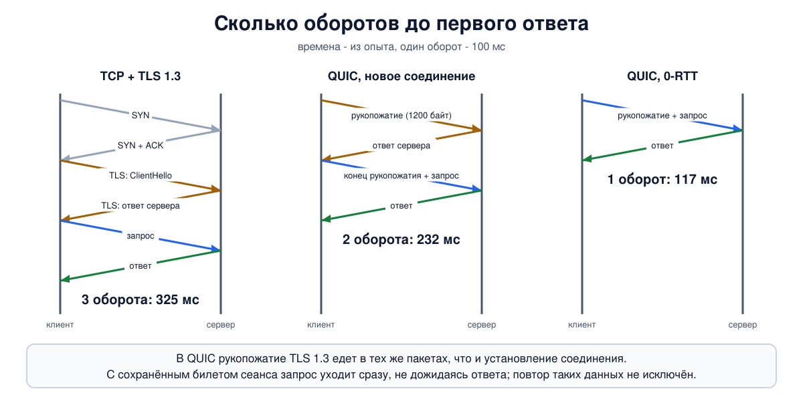

# Урок 43. QUIC: транспорт поверх UDP

Семь уроков мы разбирали TCP - протокол, которому больше сорока лет. За это время он оброс расширениями, но несколько свойств в нём изменить оказалось невозможно: они зашиты в сам формат и в миллионы устройств, которые этот формат понимают. **QUIC** - попытка сделать транспорт заново, с учётом всего, чему научил TCP. Он работает поверх UDP (урок 35), сам обеспечивает надёжность, порядок и контроль перегрузки, шифрует почти всё (первые пакеты - ключом, который может вычислить любой, остальное - ключами сеанса), и на нём работает HTTP/3. Сегодня через QUIC идёт заметная доля трафика интернета. В этом уроке - что именно не устраивало в TCP, как устроен QUIC и что в нём видит и чего не видит сторонний наблюдатель.

## Что не так с TCP

Таненбаум начинает раздел о новшествах в транспортных протоколах с двух претензий к TCP: высокие издержки на установление соединения и плохая работа в сетях с большими буферами (вторую решает BBR, урок 41). Соберём претензии полностью.

**Долгое начало.** До первого байта запроса нужно установить соединение TCP (один оборот, урок 37), а потом ещё договориться о шифровании (TLS 1.3 - ещё один оборот, блок 9). На линии с оборотом в 100 миллисекунд это 200 миллисекунд ожидания на каждое новое соединение.

**Блокировка начала очереди.** TCP доставляет байты строго по порядку (урок 39). HTTP/2 передаёт по одному соединению TCP много независимых запросов и ответов. Но потеря одного сегмента останавливает доставку **всего**, что идёт за ним, пока сегмент не будет повторён: картинка ждёт из-за потерянного куска таблицы стилей, хотя её собственные байты давно пришли. Похожую проблему Таненбаум показывает на HTTP/1.1, где большой первый ответ задерживает второй (с. 751), а про QUIC пишет прямо: при потере данных одного потока остальные продолжают доставляться.

**Привязка к адресам.** Соединение TCP определяется адресами и портами обеих сторон (урок 34). Телефон перешёл с Wi-Fi на мобильную сеть, адрес сменился - и все соединения оборваны.

**Окостенение.** TCP живёт в ядре операционной системы и в памяти промежуточных устройств: файерволы, NAT и подрезание MSS (урок 42) читают и правят его заголовки. Любое новшество в TCP должно дождаться обновления систем и пройти через устройства, которые отбрасывают незнакомое. Новый транспортный протокол с собственным номером в заголовке IP многие сети просто не пропустят (урок 35).

## Откуда взялся QUIC

QUIC придумали в Google в начале 2010-х и несколько лет обкатывали между браузером Chrome и своими серверами; оба учебника застали его ещё нестандартизованным. Таненбаум пишет, что QUIC использовался более чем в половине соединений Chrome с сервисами Google, Олифер - что HTTP/3 на момент написания книги не стандартизован. С тех пор это изменилось: в 2021 году вышли RFC 9000-9002 (QUIC), в 2022 - RFC 9114 (HTTP/3), и сегодня его поддерживают все основные браузеры.

Название когда-то расшифровывалось как Quick UDP Internet Connections; в стандарте это уже просто имя.

## Как устроен QUIC

**Поверх UDP.** От UDP берутся только порты и контрольная сумма; для сети пакет QUIC - обычная дейтаграмма UDP, которую пропускают почти везде. Всё остальное QUIC делает сам, причём, как правило, не в ядре, а в программе - браузере или сервере (Таненбаум говорит о контроле перегрузки пользовательского пространства). Поэтому он обновляется вместе с программой, а не с операционной системой.

**Идентификатор соединения.** Соединение QUIC определяется не адресами и портами, а **идентификатором соединения** (Connection ID) в заголовке пакета. Сменил клиент сеть - он продолжает отправлять пакеты с нового адреса, обычно уже с другим идентификатором из тех, что сервер заранее выдал этому соединению; сервер проверяет новый путь, и соединение продолжается. Таненбаум приводит именно этот пример: переход с мобильной сети на Wi-Fi.

**Потоки.** Внутри одного соединения QUIC живёт много независимых **потоков** (streams); по Таненбауму, QUIC гарантирует надёжную упорядоченную доставку байтов внутри одного потока и ничего не обещает о порядке между потоками. Потерялся пакет с данными одного потока - ждёт только он. Управление потоком (урок 39) ведётся и для каждого потока, и для соединения в целом, а контроль перегрузки - один на соединение.

**Надёжность и перегрузка.** Те же идеи, что в TCP (уроки 40 и 41), но без его исторических ограничений. Номер пакета в QUIC никогда не повторяется (внутри своего пространства номеров; их три - для первых пакетов, для рукопожатия и для данных): повторно отправляются **данные**, но в пакете с новым номером, так что неоднозначности "на какую отправку пришло подтверждение", из-за которой TCP нужен алгоритм Карна (урок 40), не возникает; ожидание при повторах QUIC по-прежнему удваивает. Подтверждения с самого начала перечисляют диапазоны полученного, как SACK. Контроль перегрузки стандарт описывает в духе Reno, а реализации обычно ставят CUBIC или BBR.

**Шифрование встроено.** QUIC не работает без шифрования. TLS 1.3 не кладётся поверх транспорта отдельным слоем, а встроен в него: сообщения рукопожатия TLS едут прямо в первых пакетах QUIC. Таненбаум называет два приёма: сведения о шифровании вкладываются в установление транспортного соединения, и каждый пакет шифруется независимо, чтобы потеря одного не мешала расшифровать следующие. Зашифрованы не только данные, но и почти все служебные поля: подтверждения, номера потоков, окна.

## Рукопожатие: один оборот и ноль оборотов



Раз транспортное и криптографическое рукопожатие совмещены, новое соединение готово за **один оборот**: клиент отправляет первый пакет с началом рукопожатия TLS, сервер отвечает своей частью, и уже вторым своим пакетом клиент отправляет запрос. У TCP с TLS 1.3 на то же уходит два оборота.

Если клиент уже общался с этим сервером, он сохранил **билет сеанса** и может отправить запрос **в самом первом пакете**, не дожидаясь ответа: это режим **0-RTT**, "ноль оборотов". Таненбаум описывает его как восстановление соединения с ключом, сохранённым с прошлого раза.

У 0-RTT есть цена, о которой в книге не сказано: протокол не гарантирует защиты от **повторного воспроизведения**. Тот, кто записал первые пакеты, может отправить их серверу ещё раз, и если сервер не принял отдельных мер (например, одноразовых билетов - так сделано и в нашем опыте), он снова выполнит запрос. Полностью исключить повтор трудно, особенно у распределённых серверов, поэтому в 0-RTT отправляют только то, что безопасно повторить - например, запрос на чтение страницы, но не перевод денег.

## Защита от усиления

QUIC работает на UDP, а мы помним из урока 35, чем это грозит: сервер отвечает на первую же дейтаграмму с непроверенного адреса. В QUIC это учтено в самом протоколе:

- каждая дейтаграмма клиента с пакетом Initial (прежде всего самая первая) дополняется до **1200 байт** - запрос не может быть маленьким;
- пока адрес клиента не подтверждён, сервер отправляет ему **не больше трёх байт на каждый полученный**;
- при подозрении сервер может сначала потребовать подтверждение адреса: выдать клиенту одноразовый маркер и попросить повторить первый пакет с ним.

Те же 1200 байт - требование к пути: QUIC не используется там, где не проходит дейтаграмма UDP такого размера (урок 42); больший размер он при желании подбирает сам, пробуя.

## HTTP/3 и запасной путь

HTTP/3 - это HTTP поверх QUIC: запросы и ответы едут в потоках QUIC, и блокировка начала очереди на уровне транспорта исчезает. Таненбаум называет транспорт главным отличием HTTP/3 от HTTP/2 и отмечает, что HTTP/3 работает только с шифрованием.

Сервер сообщает о поддержке HTTP/3 заголовком Alt-Svc в ответе по обычному HTTPS (RFC 7838), и следующее соединение браузер пробует открыть по QUIC; если же в DNS есть запись типа HTTPS с указанием h3 (RFC 9460), по QUIC может пойти уже первое соединение. Если UDP на порт 443 не проходит - а в некоторых сетях его фильтруют, - браузер молча возвращается к HTTP/2 поверх TCP. Поэтому блокировка QUIC для пользователя обычно выглядит не как ошибка, а как чуть более медленная загрузка.

## Как это увидеть в Linux

Клиент `a` (`192.0.2.1`) и сервер `b` (`192.0.2.2`), по 50 миллисекунд задержки в каждую сторону: оборот 100 миллисекунд. Сервер отвечает одной строкой и по TLS поверх TCP, и по QUIC. Измерим время до первого ответа тремя способами, посмотрим на пакеты QUIC в tcpdump, а потом поставим себя на место наблюдателя и попробуем прочитать первый пакет. Нужны Linux (подойдёт WSL2), права sudo, python3 с библиотекой aioquic, tcpdump, ping и openssl (`sudo apt install python3 python3-aioquic tcpdump iproute2 iputils-ping openssl`; на старых системах без пакета python3-aioquic - `pip install aioquic`). Проверка сертификата в опыте отключена - только потому, что это учебный стенд с самоподписанным сертификатом; всё создаётся в пространствах имён `hbh-*` и в конце удаляется.

Создай файл `quic-lab.sh` и запусти `bash quic-lab.sh`:
```
set -u
for c in python3 tcpdump tc openssl; do
  command -v $c >/dev/null || { echo "нужен $c: sudo apt install python3 python3-aioquic tcpdump iproute2 openssl"; exit 1; }
done
python3 -c 'import aioquic' 2>/dev/null || { echo "нужна библиотека aioquic: sudo apt install python3-aioquic"; exit 1; }
# убрать остатки прошлого запуска
for n in hbh-a hbh-b; do
  sudo ip netns pids $n 2>/dev/null | xargs -r sudo kill
  sudo ip netns del $n 2>/dev/null
done
d=$(mktemp -d)
chmod 755 "$d"
# клиент a (192.0.2.1) и сервер b (192.0.2.2), по 50 мс задержки в каждую сторону: время оборота 100 мс
for n in hbh-a hbh-b; do sudo ip netns add $n; done
sudo ip link add eth0 netns hbh-a type veth peer name eth0 netns hbh-b
sudo ip netns exec hbh-a ip addr add 192.0.2.1/24 dev eth0
sudo ip netns exec hbh-b ip addr add 192.0.2.2/24 dev eth0
for n in hbh-a hbh-b; do
  sudo ip netns exec $n ip link set lo up
  sudo ip netns exec $n ip link set eth0 up
  sudo ip netns exec $n tc qdisc add dev eth0 root netem delay 50ms
done
A="sudo ip netns exec hbh-a"
B="sudo ip netns exec hbh-b"
# самоподписанный сертификат для учебного имени hbh.test
openssl req -x509 -newkey ec -pkeyopt ec_paramgen_curve:prime256v1 -nodes -days 1 \
  -subj /CN=hbh.test -keyout "$d/key.pem" -out "$d/cert.pem" 2>/dev/null
chmod 644 "$d/key.pem"
# сервер: QUIC на UDP 443 и TLS поверх TCP на 443; отвечает на запрос одной строкой
cat > "$d/server.py" <<'EOF'
import asyncio, ssl, sys
from aioquic.asyncio import serve
from aioquic.asyncio.protocol import QuicConnectionProtocol
from aioquic.quic.configuration import QuicConfiguration
from aioquic.quic.events import StreamDataReceived
d = sys.argv[1]
class Reply(QuicConnectionProtocol):
    def quic_event_received(self, event):
        if isinstance(event, StreamDataReceived) and event.end_stream:
            self._quic.send_stream_data(event.stream_id, b"reply to " + event.data, end_stream=True)
            self.transmit()
async def tcp(reader, writer):
    writer.write(b"reply to " + await reader.read(100)); await writer.drain(); writer.close()
async def main():
    cfg = QuicConfiguration(is_client=False, alpn_protocols=["hbh"])
    cfg.load_cert_chain(d + "/cert.pem", d + "/key.pem")
    tickets = {}
    await serve("0.0.0.0", 443, configuration=cfg, create_protocol=Reply,
                session_ticket_handler=lambda t: tickets.__setitem__(t.ticket, t),
                session_ticket_fetcher=lambda label: tickets.pop(label, None))
    tls = ssl.SSLContext(ssl.PROTOCOL_TLS_SERVER); tls.load_cert_chain(d + "/cert.pem", d + "/key.pem")
    await asyncio.start_server(tcp, "0.0.0.0", 443, ssl=tls)
    await asyncio.Future()
asyncio.run(main())
EOF
# клиент: один запрос по TCP+TLS, один по QUIC и ещё один по QUIC с сохранённым билетом сеанса
cat > "$d/client.py" <<'EOF'
import asyncio, socket, ssl, time
from aioquic.asyncio import connect
from aioquic.quic.configuration import QuicConfiguration
def tcp_tls():
    ctx = ssl.create_default_context(); ctx.check_hostname = False; ctx.verify_mode = ssl.CERT_NONE
    t = time.time()
    raw = socket.create_connection(("192.0.2.2", 443))
    raw.setsockopt(socket.IPPROTO_TCP, socket.TCP_NODELAY, 1)   # иначе алгоритм Нейгла задержит запрос (урок 39)
    with ctx.wrap_socket(raw, server_hostname="hbh.test") as s:
        s.sendall(b"hello"); data = s.recv(100)
        print(f"TCP + {s.version()}:        {data!r} after {(time.time() - t) * 1000:.0f} ms")
async def quic(label, ticket=None, saved=None):
    cfg = QuicConfiguration(is_client=True, alpn_protocols=["hbh"], server_name="hbh.test")
    cfg.verify_mode = ssl.CERT_NONE
    cfg.session_ticket = ticket
    t = time.time()
    async with connect("192.0.2.2", 443, configuration=cfg, wait_connected=ticket is None,
                       session_ticket_handler=saved.append if saved is not None else None) as c:
        reader, writer = await c.create_stream()
        writer.write(b"hello"); writer.write_eof()
        data = await reader.read()
        print(f"{label} {data!r} after {(time.time() - t) * 1000:.0f} ms")
        await asyncio.sleep(0.3)      # дождаться билета сеанса от сервера
async def main():
    saved = []
    await quic("QUIC, first time:     ", saved=saved)
    await asyncio.sleep(0.5)
    await quic("QUIC, resumed (0-RTT):", ticket=saved[-1] if saved else None)
tcp_tls()
asyncio.run(main())
EOF
# наблюдатель: берёт первый пакет QUIC из записи и расшифровывает его, зная только то, что есть в самом пакете
cat > "$d/observer.py" <<'EOF'
import re, sys
from aioquic.buffer import Buffer
from aioquic.quic.crypto import CryptoPair
from aioquic.quic.packet import pull_quic_header
raw = open(sys.argv[1], "rb").read()
packet = raw[24 + 16 + 14 + 20 + 8:]            # заголовки файла и записи pcap, Ethernet, IP, UDP
buf = Buffer(data=packet)
h = pull_quic_header(buf, host_cid_length=8)
print(f"first byte {packet[0]:08b}, version {h.version:#x}, destination CID {h.destination_cid.hex()}, source CID {h.source_cid.hex()}")
end = buf.tell() + h.rest_length if hasattr(h, "rest_length") else h.packet_length
keys = CryptoPair(); keys.setup_initial(cid=h.destination_cid, is_client=False, version=h.version)
_, plain, number = keys.decrypt_packet(packet[:end], buf.tell(), 0)
names = re.findall(rb"[a-z0-9.-]+\.test", plain)
print(f"UDP payload {len(packet)} bytes; decrypted {len(plain)} bytes of the Initial packet number {number}")
print("server name in ClientHello:", names[0].decode() if names else "not found", "| ALPN:", "hbh" if b"\x03hbh" in plain else "?")
EOF
$B python3 "$d/server.py" "$d" &
sleep 1.5
echo '--- 1. how long until the first reply (round trip is 100 ms)'
$B timeout 6 tcpdump -i eth0 -n -l -w "$d/first.pcap" -c 1 'udp dst port 443' 2>/dev/null &
$A timeout 6 tcpdump -i eth0 -n -l -ttttt 'udp port 443' 2>/dev/null > "$d/quic" &
qpid=$!
sleep 1
$A ping -c 1 -W 1 192.0.2.2 >/dev/null     # заранее выяснить MAC-адрес соседа, чтобы ARP не попал в замеры
$A python3 "$d/client.py" 2>/dev/null
wait $qpid
echo '--- 2. what tcpdump shows for QUIC'
sed -E 's/^ *00:00:0?//; s/ IP / /' "$d/quic" > "$d/q"
first=$(awk '{split($2, a, "."); print a[5]; exit}' "$d/q")
echo 'first connection:'
grep -E "\.$first[ :]" "$d/q" | head -8
echo 'resumed connection, first four packets:'
grep -vE "\.$first[ :]" "$d/q" | head -4
echo '--- 3. what an outside observer can read from the very first packet'
python3 "$d/observer.py" "$d/first.pcap"
echo '--- cleanup'
for n in hbh-a hbh-b; do
  sudo ip netns pids $n 2>/dev/null | xargs -r sudo kill
  sudo ip netns del $n
done
rm -rf "$d"
ip netns list | grep -cE '^hbh-(a|b)( |$)'
```

Вот что получилось на нашем сервере:
```
--- 1. how long until the first reply (round trip is 100 ms)
TCP + TLSv1.3:        b'reply to hello' after 325 ms
QUIC, first time:      b'reply to hello' after 232 ms
QUIC, resumed (0-RTT): b'reply to hello' after 117 ms
--- 2. what tcpdump shows for QUIC
first connection:
0.000000 192.0.2.1.35727 > 192.0.2.2.443: UDP, length 1200
0.066459 192.0.2.2.443 > 192.0.2.1.35727: UDP, length 976
0.121765 192.0.2.1.35727 > 192.0.2.2.443: UDP, length 384
0.121772 192.0.2.1.35727 > 192.0.2.2.443: UDP, length 36
0.176596 192.0.2.2.443 > 192.0.2.1.35727: UDP, length 230
0.176768 192.0.2.2.443 > 192.0.2.1.35727: UDP, length 45
0.179076 192.0.2.2.443 > 192.0.2.1.35727: UDP, length 33
0.228842 192.0.2.1.35727 > 192.0.2.2.443: UDP, length 33
resumed connection, first four packets:
1.858116 192.0.2.1.49959 > 192.0.2.2.443: UDP, length 1200
1.858259 192.0.2.1.49959 > 192.0.2.2.443: UDP, length 52
1.910938 192.0.2.2.443 > 192.0.2.1.49959: UDP, length 511
1.911109 192.0.2.2.443 > 192.0.2.1.49959: UDP, length 45
--- 3. what an outside observer can read from the very first packet
first byte 11001101, version 0x1, destination CID b04d902e7df57620, source CID 8cedbbd05aeee552
UDP payload 1200 bytes; decrypted 1156 bytes of the Initial packet number 0
server name in ClientHello: hbh.test | ALPN: hbh
--- cleanup
0
```

Разберём.

**Шаг 1: время до первого ответа.** Оборот - 100 мс.

- **TCP и TLS 1.3: 325 мс**, три оборота: рукопожатие TCP, рукопожатие TLS, запрос и ответ. (Чтобы сравнение было честным, мы включили `TCP_NODELAY`: без него алгоритм Нейгла из урока 39 задержал бы запрос ещё на оборот.)
- **QUIC, новое соединение: 232 мс**, два оборота: рукопожатие и запрос с ответом.
- **QUIC, возобновление с 0-RTT: 117 мс**, один оборот: запрос ушёл сразу, вместе с первым пакетом, не дожидаясь ответа.

**Шаг 2: что показывает tcpdump.** Только дейтаграммы UDP и их размеры: по умолчанию tcpdump QUIC не разбирает, а привычные поля транспорта - номера, подтверждения, окна - к тому же лежат внутри и зашифрованы. О содержимом можно только догадываться по размерам.

- Первый пакет клиента - ровно **1200 байт**: это начало рукопожатия, дополненное до обязательного минимума.
- Сервер отвечает пакетом в 976 байт (судя по размеру, его часть рукопожатия с сертификатом); судя по размерам, клиент завершает рукопожатие и отправляет запрос (384 и 36 байт), дальше идут ответ и подтверждения.
- В возобновлённом соединении клиент сразу отправил два пакета: 1200 байт рукопожатия и 52 байта - судя по всему, запрос в режиме 0-RTT, не дожидаясь сервера. Сервер ответил через один оборот: пакетом в 511 байт (своя часть рукопожатия) и сразу за ним коротким, в 45 байт, - по размеру это и есть ответ "reply to hello".

Размеры зависят от версии библиотеки. У нас на сервере aioquic 0.9.25 из Ubuntu 24.04, и она дополняет до 1200 байт только самый первый пакет. Это нарушение стандарта: RFC 9000 требует дополнять до 1200 байт все дейтаграммы с пакетами Initial, и у клиента, и у сервера. Новые версии (1.x, в WSL2) так и делают, а запрос 0-RTT, судя по всему, кладут в ту же первую дейтаграмму - у тебя картина может быть такой.

Время у исходящих пакетов в этой записи сдвинуто на 50 мс: tcpdump видит их уже после задержки `netem`.

**Шаг 3: наблюдатель.** Мы записали первый пакет на стороне сервера и отдали его программе, которая не знает никаких секретов, - только то, что есть в самом пакете.

- `first byte 11001101`: старший бит 1 - это пакет с **длинным заголовком**, которые используются при установлении соединения; второй бит - фиксированный, обычно 1; следующие два (00) - тип Initial. Младшие четыре бита скрыты защитой заголовка, поэтому у тебя они могут быть другими. С aioquic 1.x расшифрованных байт будет меньше (в WSL2 - 480): первый пакет там устроен иначе.
- В длинном заголовке открыто лежат **версия** (`0x1` - QUIC версии 1) и **идентификаторы соединения**: получателя (его клиент выбрал случайно) и отправителя.
- Остальное зашифровано, но ключ для пакетов Initial вычисляется из идентификатора соединения, который лежит тут же, и константы, опубликованной в стандарте. Программа вычислила ключ, расшифровала 1156 байт и нашла в них сообщение ClientHello с **именем сервера** `hbh.test` и названием прикладного протокола `hbh`.

Это не уязвимость, а свойство протокола (RFC 9001, раздел 5.2): шифрование первых пакетов защищает от случайных искажений и от постороннего вне пути, который их не видел, но не от наблюдателя на пути. Всё, что идёт после рукопожатия, зашифровано уже настоящими ключами сеанса, и такой фокус с ним не пройдёт.

В конце `0`: пространства имён удалены.

## Безопасность: что видит наблюдатель в QUIC

Сведём вместе. Тот, кто стоит на пути и смотрит на трафик QUIC, **видит**:

- адреса IP и порты UDP (обычно 443), размеры пакетов и время между ними;
- при установлении соединения - версию протокола и идентификаторы соединения;
- содержимое первых пакетов клиента (Initial; у современных браузеров ClientHello бывает больше 1200 байт и занимает два-три таких пакета), в том числе **имя сервера** (SNI) и список прикладных протоколов. Это то же, что видно в TLS поверх TCP (урок 80). Скрыть имя в ClientHello позволяет отдельное расширение TLS, шифрованный ClientHello (урок 82);
- после рукопожатия - короткий заголовок с идентификатором соединения и, если реализация его включила, "бит вращения" (spin bit), по которому оператор может оценивать время оборота.

**Не видит**: сертификат сервера (он зашифрован уже во время рукопожатия ключами, выведенными из обмена ключами), а после рукопожатия - номера пакетов, подтверждения, окна, потоки и, разумеется, данные. Первые пакеты сервера (Initial с ответом ServerHello) читаются так же, как клиентские. У TCP номера, подтверждения и окна открыты всегда; сертификат скрывает и TLS 1.3.

Что из этого следует.

- **Сбросить установленное соединение подделкой нельзя.** В QUIC нет аналога RST, который принимался бы без секрета (урок 38): закрытие соединения после рукопожатия зашифровано и удостоверено, а особый "сброс без состояния" принимается, только если в нём есть маркер, переданный внутри шифрованного канала. Во время рукопожатия наблюдатель на пути ещё может сорвать установление соединения поддельным пакетом Initial - ключи к ним ему известны. А отбрасывать пакеты можно всегда: тогда соединение не обрывается, а замирает и закрывается по тайм-ауту бездействия, а новые соединения браузер открывает по TCP.
- **Править заголовки QUIC на ходу нельзя.** Промежуточное устройство не может ни подрезать параметры, ни "оптимизировать" окна: оно их не видит, а изменение заголовка QUIC или содержимого ломает проверку подлинности. Это сделано намеренно - ради защиты от окостенения. Адреса и порты в заголовках IP и UDP менять можно - так работает NAT, - для QUIC это выглядит как смена адреса клиента.
- **Анализ трафика остаётся.** Размеры и времена пакетов никуда не делись, и по ним можно многое угадать о том, что происходит внутри (урок 88). Идентификатор соединения при смене сети клиент меняет на новый - в том числе чтобы по нему нельзя было связать его старый и новый адреса.
- **Администратору сети** стоит знать: привычные инструменты, которые разбирают TCP (учёт соединений, разбор рукопожатия, счётчики повторов), для QUIC показывают только поток дейтаграмм UDP. Состояние соединения видно лишь на концах - в самой программе; наблюдателю доступны разве что оценки времени оборота по биту вращения.

## Итог

- QUIC - транспортный протокол поверх UDP, который сам обеспечивает надёжность, порядок, управление потоком и контроль перегрузки и не работает без шифрования. Обычно он реализован в программах, а не в ядре.
- Он решает четыре проблемы TCP: долгое начало, блокировку начала очереди, привязку соединения к адресам и окостенение.
- Соединение определяется идентификатором, а не адресами, и переживает смену сети. Внутри него - независимые потоки: потеря в одном не задерживает остальные.
- Рукопожатие TLS 1.3 встроено в транспортное: новое соединение - один оборот до запроса, возобновлённое - ноль (0-RTT). Данные 0-RTT можно воспроизвести повторно, поэтому в них отправляют только безопасные запросы.
- От усиления защищают обязательные 1200 байт в первом пакете и предел "не больше трёх байт на один полученный" до проверки адреса.
- Наблюдатель видит адреса, порты, размеры, времена и первые пакеты с именем сервера; всё остальное, включая служебные поля транспорта, зашифровано. Сбросить установленное соединение поддельным пакетом нельзя, можно только не пропускать пакеты.

## Что почитать

- Таненбаум, "Компьютерные сети", раздел 6.6 и 6.6.1, с. 654-655: зачем нужен QUIC и как он устроен; раздел 7.3.4, с. 748-753: HTTP/1.1, HTTP/2 и HTTP/3.
- Олифер, "Компьютерные сети", глава 24, с. 771-772: версии HTTP, HTTP/3 и QUIC.
- RFC 9000 (QUIC), RFC 9001 (TLS в QUIC, ключи для первого пакета), RFC 9002 (потери и контроль перегрузки), RFC 9114 (HTTP/3), RFC 7838 и RFC 9460 (как клиент узнаёт о поддержке HTTP/3).