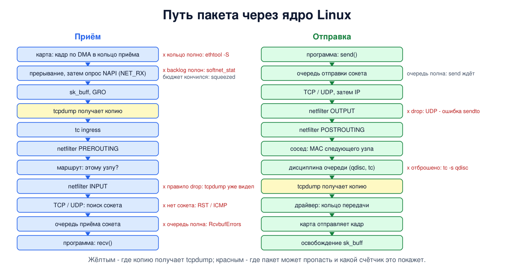

# Урок 44. Путь пакета от сетевой карты до сокета: sk_buff и NAPI

Блок 4 смотрел на сеть глазами протоколов. Блок 5 смотрит глазами Linux: что делает ядро с пакетом, который пришёл на сетевую карту, и с данными, которые программа записала в сокет. Знание этого пути объясняет вещи, с которыми мы уже сталкивались: почему tcpdump видит пакеты, которые потом отбросит файервол, почему исходящий пакет в записи tcpdump появляется позже, чем его отправили, куда деваются дейтаграммы UDP, когда программа не успевает их читать. И оно же подсказывает, где искать, когда "пакеты теряются, а где - непонятно".

Учебники по сетям этот путь не описывают: это устройство конкретной операционной системы. Источник - документация ядра Linux (раздел Documentation/networking), ссылки в конце урока.

## Карта, кольца и очереди

Сетевая карта не отдаёт пакет процессору "в руки". Драйвер заранее выделяет в памяти буферы и записывает их адреса в **кольцо приёма** (RX ring) - массив дескрипторов, который карта читает сама. Пришёл кадр - карта сама, без процессора, копирует его в очередной буфер через прямой доступ к памяти (DMA), отмечает дескриптор заполненным и двигается дальше по кольцу. Отправка устроена так же, через **кольцо передачи** (TX ring). Размер колец показывает `ethtool -g`; если процессор не успевает разбирать кольцо приёма, карта начинает отбрасывать кадры ещё до того, как о них узнает ядро.

Быстрые карты имеют **несколько очередей**, у каждой своё кольцо и своё прерывание. Чтобы пакеты одного соединения не перемешались, карта выбирает очередь по хешу от адресов и обычно портов (RSS, receive side scaling) - той самой четвёрки из урока 34. Так разные соединения обрабатываются разными ядрами процессора параллельно, а пакеты одного соединения идут по порядку через одно.

## Прерывания и NAPI

Как процессор узнаёт, что пришли пакеты? Классический способ - **прерывание**: карта сигналит, процессор бросает текущую работу и вызывает драйвер. На каждый пакет это слишком дорого: на скорости в миллионы пакетов в секунду процессор только и будет, что прыгать в обработчик прерываний, и не успеет обработать сами пакеты.

Linux решает это механизмом **NAPI** (исторически - New API, "новый API"):

1. На первый пришедший пакет карта генерирует прерывание.
2. Обработчик прерывания почти ничего не делает: выключает прерывания этой очереди и ставит в план **отложенную обработку** - программное прерывание NET_RX (softirq).
3. В отложенной обработке ядро **опрашивает** очередь: забирает из кольца сразу пачку пакетов, не дожидаясь новых прерываний.
4. Опустела очередь - прерывания включаются снова, и всё начинается сначала.

Под низкой нагрузкой это работает как обычные прерывания, под высокой - как опрос без прерываний, и процессор тратит время на пакеты, а не на переключения. Чтобы приём не захватил процессор целиком, у одного прохода есть **бюджет**: в Linux по умолчанию не больше 300 пакетов (`net.core.netdev_budget`) и не дольше двух тиков таймера ядра (`net.core.netdev_budget_usecs`: на нашем сервере это 2000 микросекунд, в WSL2 - 8000). Не уложился - работа откладывается на следующий проход или передаётся отдельному потоку ядра `ksoftirqd`, а в статистике растёт счётчик "сжатий" (squeezed). Само по себе сжатие - не потеря: необработанные пакеты ждут в кольце. Но если процессор не успевает так долго, что кольцо переполняется, карта начинает отбрасывать кадры.

## sk_buff: пакет внутри ядра

Внутри ядра каждый пакет - это структура **sk_buff** (её обычно сокращают до skb). Это не сами байты пакета, а их описание: где в памяти лежат данные, через какой интерфейс пакет пришёл или уйдёт, какому сокету он принадлежит, отметки времени, метки файервола и многое другое.

Главная идея sk_buff - **данные не копируются при переходе между уровнями**. У буфера есть указатели на начало и конец выделенной памяти и на начало и конец полезных данных. При приёме каждый уровень разбирает свой заголовок и просто сдвигает указатель начала данных вперёд: Ethernet "снимает" 14 байт, IP - свой заголовок (обычно 20), TCP - свой, и до сокета, как правило, доходят те же байты, что положила в память карта. При отправке наоборот: буфер выделяется с запасом места спереди, и каждый уровень сдвигает указатель назад, дописывая свой заголовок перед данными.

Пакет можно **клонировать**: создать второй sk_buff, указывающий на те же данные, или просто увеличить счётчик ссылок на тот же sk_buff. Так ядро передаёт пакет наблюдателям вроде tcpdump, не задерживая его на основном пути. А сокет tcpdump уже копирует себе нужные байты, не больше заданной длины захвата (snaplen): если программа не успевает их забирать, растёт счётчик "dropped by kernel" в её итоговой сводке.

Здесь же живут разгрузки из уроков 35 и 36 и GRO, который мы выключали в уроках 40-42. GRO на приёме склеивает несколько последовательных сегментов одного соединения в один большой sk_buff, чтобы стек разбирал заголовки один раз; TSO и GSO на отправке делают обратное. Поэтому tcpdump на машине с включёнными разгрузками и показывает "сегменты" больше MTU.

## Путь приёма



Пакет, который драйвер достал из кольца в sk_buff, проходит через ядро в таком порядке:

1. **Наблюдатели** (packet taps): здесь копию пакета получают tcpdump и другие программы, слушающие интерфейс напрямую. Раньше них может стоять только XDP - программа, которую загружают прямо в драйвер; то, что отбросил XDP, tcpdump не увидит.
2. **tc ingress** - входной классификатор, который мы использовали в уроках 37, 38, 40 и 42, чтобы отбрасывать пакеты.
3. **netfilter, точка PREROUTING**: здесь учёт соединений (conntrack) и преобразование адресов назначения (блок 6).
4. **Решение о маршруте**: пакет адресован этому узлу - идёт дальше вверх; нет - уходит на пересылку (FORWARD) и дальше на выход, как у маршрутизаторов в наших опытах, если пересылка включена (`net.ipv4.ip_forward=1`); иначе пакет отбрасывается.
5. **netfilter, точка INPUT** - основное место для правил "что пускать к службам этой машины".
6. **Протокол**: IP передаёт пакет TCP или UDP, а тот находит сокет по адресам и портам (урок 34). Сокета нет - TCP отвечает RST, UDP - сообщением ICMP "порт недоступен".
7. **Очередь приёма сокета**: данные ждут, пока программа их заберёт. Её размер ограничен буфером приёма (урок 39). Для TCP окно обычно не даёт очереди переполниться: отправитель остановится раньше; для UDP лишние дейтаграммы просто отбрасываются.
8. **Программа** вызывает `recv`, ядро будит её и копирует данные из sk_buff в её память.

Отсюда первое практическое следствие: **tcpdump видит пакет раньше файервола**. Если tcpdump показывает входящие пакеты, а программа их не получает, они могли быть отброшены дальше по пути - и запись tcpdump этого не покажет.

## Путь отправки

Отправка идёт в обратном порядке:

1. Программа вызывает `send`; ядро копирует данные в sk_buff. У TCP они встают в **очередь отправки сокета** (буфер отправки, урок 39), и если она полна, программа ждёт. UDP сразу передаёт дейтаграмму ниже, а буфер отправки ограничивает, сколько его дейтаграмм может одновременно ждать в очередях под ним.
2. **TCP** режет поток на сегменты с учётом окон (уроки 39 и 41) или UDP оформляет дейтаграмму; потом **IP** выбирает маршрут и дописывает заголовок.
3. **netfilter, точки OUTPUT и POSTROUTING**: фильтр исходящих и преобразование адресов источника (блок 6).
4. **Сосед**: по таблице соседей находится MAC-адрес следующего узла (урок 45).
5. **Дисциплина очереди** (qdisc) интерфейса: здесь пакеты ждут своей очереди на отправку, здесь работает `tc` - и `netem`, которым мы задерживали пакеты в прошлых уроках. Само ядро по умолчанию ставит pfifo_fast, современные дистрибутивы (через systemd) - fq_codel; у виртуальных интерфейсов вроде lo и veth дисциплины очереди обычно нет вовсе (noqueue).
6. **Наблюдатели**: только здесь копию получает tcpdump.
7. **Драйвер** кладёт пакет в кольцо передачи, карта отправляет и сообщает о завершении, после чего sk_buff освобождается.

Второе следствие: **tcpdump на отправке видит пакет после дисциплины очереди**. Поэтому в уроках 40 и 43 исходящие пакеты появлялись в записи на 25 и 50 мс позже - они успевали отстоять задержку `netem`. А пакет, отброшенный файерволом в точке OUTPUT, tcpdump не увидит вовсе.

## Где теряются пакеты

На этом пути есть несколько мест, где пакет может пропасть, и у каждого - свой счётчик:

- **кольцо приёма карты** переполнено - `ethtool -S интерфейс` (счётчики со словами missed, dropped, no_buffer; названия зависят от драйвера);
- **входная очередь процессора** (backlog, её длина - `net.core.netdev_max_backlog`, у нас 1000) переполнена - вторая колонка `/proc/net/softnet_stat`. Через эту очередь идут пакеты от loopback и veth (у veth - пока на нём не включены GRO или XDP), от драйверов без NAPI и пакеты, которые ядро перекладывает на другой процессор. Третья колонка, "сжатия", - не потери, а признак, что процессор не успевает разбирать приём;
- **дисциплина очереди** на отправке отбросила пакет - `tc -s qdisc show dev интерфейс`;
- **файервол** - счётчики правил (`nft list ruleset` для правил со словом counter);
- **сокета нет** или **очередь сокета полна** - счётчики протоколов: `nstat` или `netstat -s` (UdpNoPorts, UdpRcvbufErrors и другие).

## Как это увидеть в Linux

Сначала посмотрим, только читая, на настоящую сетевую карту машины: драйвер, очереди, кольца, прерывания и счётчики NAPI. Потом в двух пространствах имён `a` (`192.0.2.1`) и `b` (`192.0.2.2`) проверим порядок обработки: входящий пакет, отброшенный файерволом; исходящий пакет, отброшенный файерволом; переполненную очередь сокета; и порт без программы. Нужны Linux (подойдёт WSL2), права sudo, python3, tcpdump, nftables и ethtool (`sudo apt install python3 tcpdump nftables iproute2 ethtool`); настоящая карта только читается, всё остальное создаётся в пространствах имён `hbh-*` и в конце удаляется.

Создай файл `path-lab.sh` и запусти `bash path-lab.sh`:
```
set -u
for c in python3 tcpdump nft ss nstat ethtool; do
  command -v $c >/dev/null || { echo "нужен $c: sudo apt install python3 tcpdump nftables iproute2 ethtool"; exit 1; }
done
# убрать остатки прошлого запуска
for n in hbh-a hbh-b; do
  sudo ip netns pids $n 2>/dev/null | xargs -r sudo kill
  sudo ip netns del $n 2>/dev/null
done
d=$(mktemp -d)
chmod 755 "$d"
echo '--- 1. the real network card of this machine (read only)'
dev=$(ip route show default | awk '{print $5; exit}')
echo "interface: $dev, driver: $(ethtool -i $dev 2>/dev/null | awk '/^driver/ {print $2}')"
ethtool -l $dev 2>/dev/null | awk '/Current hardware settings/ {c=1} c && /Combined/ {print "  queues:", $2}'
ethtool -g $dev 2>/dev/null | awk '/Current hardware settings/ {c=1} c && /^(RX|TX):/ {print "  ring", $1, $2}'
echo "  interrupts of the card:"
grep -iE "$dev|virtio[0-9]+-(input|output)|eth|mlx|ena|hv_" /proc/interrupts | awk '{s = 0; for (i = 2; i <= NF; i++) if ($i ~ /^[0-9]+$/) s += $i; else break; print "   ", $NF, s}' | head -4
echo "  softirq counters (all CPUs):"
awk '/NET_RX|NET_TX/ {s = 0; for (i = 2; i <= NF; i++) s += $i; print "   ", $1, s}' /proc/softirqs
echo "  NAPI budget: $(sysctl -n net.core.netdev_budget) packets or $(sysctl -n net.core.netdev_budget_usecs) us per round, backlog $(sysctl -n net.core.netdev_max_backlog)"
i=0; while read -r p dr sq _; do printf "  CPU%d: processed %d, dropped %d, squeezed %d\n" $i 0x$p 0x$dr 0x$sq; i=$((i + 1)); done < /proc/net/softnet_stat | head -4
# два узла для опытов
for n in hbh-a hbh-b; do sudo ip netns add $n; done
sudo ip link add eth0 netns hbh-a type veth peer name eth0 netns hbh-b
sudo ip netns exec hbh-a ip addr add 192.0.2.1/24 dev eth0
sudo ip netns exec hbh-b ip addr add 192.0.2.2/24 dev eth0
for n in hbh-a hbh-b; do
  sudo ip netns exec $n ip link set lo up
  sudo ip netns exec $n ip link set eth0 up
done
A="sudo ip netns exec hbh-a"
B="sudo ip netns exec hbh-b"
cat > "$d/send.py" <<'EOF'
import socket, sys
port, n = int(sys.argv[1]), int(sys.argv[2])
s = socket.socket(socket.AF_INET, socket.SOCK_DGRAM)
ok = err = 0
for i in range(n):
    try:
        s.sendto(b"x" * 200, ("192.0.2.2", port)); ok += 1
    except OSError as e:
        err += 1; last = e.strerror
print(f"sender: {ok} sent" + (f", {err} refused by the kernel ({last})" if err else ""))
EOF
cat > "$d/recv.py" <<'EOF'
import socket, sys, time
port, rcvbuf, wait = int(sys.argv[1]), int(sys.argv[2]), float(sys.argv[3])
s = socket.socket(socket.AF_INET, socket.SOCK_DGRAM)
if rcvbuf:
    s.setsockopt(socket.SOL_SOCKET, socket.SO_RCVBUF, rcvbuf)
s.bind(("0.0.0.0", port)); s.settimeout(0.2)
time.sleep(wait)                      # программа занята и не читает
n = 0
try:
    while True:
        s.recv(2048); n += 1
except socket.timeout:
    pass
print(f"receiver on port {port}: the program got {n} datagrams")
EOF
counters() { sudo ip netns exec $1 nstat -asz $2 | sed 1d | awk '{printf "  %s %s\n", $1, $2}'; }
echo '--- 2. incoming: tcpdump sees what the firewall then drops'
$B nft add table ip lab
$B nft add chain ip lab in '{ type filter hook input priority 0; }'
$B nft add rule ip lab in udp dport 6000 counter drop
$B python3 "$d/recv.py" 6000 0 1 > "$d/r2" &
$B timeout 3 tcpdump -i eth0 -n -l 'udp port 6000' 2>/dev/null > "$d/t2" &
sleep 1
$A python3 "$d/send.py" 6000 5
wait
echo "  tcpdump on b saw: $(grep -c 'UDP, length 200' "$d/t2") datagrams"
echo "  firewall rule on b: $($B nft list chain ip lab in | grep -oE 'packets [0-9]+')"
sed 's/^/  /' "$d/r2"
echo '--- 3. outgoing: what the firewall drops never reaches tcpdump'
$A nft add table ip lab
$A nft add chain ip lab out '{ type filter hook output priority 0; }'
$A nft add rule ip lab out udp dport 6001 counter drop
$A timeout 3 tcpdump -i eth0 -n -l 'udp port 6001' 2>/dev/null > "$d/t3" &
sleep 1
$A python3 "$d/send.py" 6001 5
wait
echo "  tcpdump on a saw: $(grep -c 'UDP, length 200' "$d/t3") datagrams"
echo '--- 4. the socket queue is full: the program is busy and does not read'
$B python3 "$d/recv.py" 6002 4096 2 > "$d/r4" &
sleep 0.5
$A python3 "$d/send.py" 6002 1000
sleep 0.3
echo "  socket while the program sleeps: $($B ss -uanm 'sport = :6002' | grep -oE 'skmem:\(r[0-9]+,rb[0-9]+' | head -1)"
wait
sed 's/^/  /' "$d/r4"
counters hbh-b 'UdpInDatagrams UdpRcvbufErrors'
echo '--- 5. nobody listens on the port'
$A python3 "$d/send.py" 6003 5
sleep 0.5
counters hbh-b 'UdpNoPorts IcmpOutDestUnreachs'
echo '--- cleanup'
for n in hbh-a hbh-b; do
  sudo ip netns pids $n 2>/dev/null | xargs -r sudo kill
  sudo ip netns del $n
done
rm -rf "$d"
ip netns list | grep -cE '^hbh-(a|b)( |$)'
```

Вот что получилось на нашем сервере:
```
--- 1. the real network card of this machine (read only)
interface: enp0s3, driver: virtio_net
  queues: 1
  ring RX: 256
  ring TX: 256
  interrupts of the card:
    virtio0-input.0 477250
    virtio0-output.0 153392
  softirq counters (all CPUs):
    NET_TX: 244172
    NET_RX: 942313
  NAPI budget: 300 packets or 2000 us per round, backlog 1000
  CPU0: processed 1441862, dropped 0, squeezed 208
--- 2. incoming: tcpdump sees what the firewall then drops
sender: 5 sent
  tcpdump on b saw: 5 datagrams
  firewall rule on b: packets 5
  receiver on port 6000: the program got 0 datagrams
--- 3. outgoing: what the firewall drops never reaches tcpdump
sender: 0 sent, 5 refused by the kernel (Operation not permitted)
  tcpdump on a saw: 0 datagrams
--- 4. the socket queue is full: the program is busy and does not read
sender: 1000 sent
  socket while the program sleeps: skmem:(r8960,rb8192
  receiver on port 6002: the program got 10 datagrams
  UdpInDatagrams 10
  UdpRcvbufErrors 990
--- 5. nobody listens on the port
sender: 5 sent
  IcmpOutDestUnreachs 5
  UdpNoPorts 5
--- cleanup
0
```

Разберём.

**Шаг 1: настоящая карта.** Наш сервер - виртуальная машина, и карта у него виртуальная: драйвер `virtio_net`, одна очередь, кольца приёма и передачи по 256 дескрипторов. У очередей карты два прерывания - на приём (`virtio0-input.0`) и на передачу (`virtio0-output.0`); прерываний заметно меньше, чем обработанных пакетов: NAPI забирает их пачками (правда, в число обработанных входит и внутренний трафик машины, например опыты прошлых уроков через veth, так что сравнение грубое). Счётчики программных прерываний NET_RX и NET_TX - это запуски отложенной обработки. Бюджет - 300 пакетов или 2000 микросекунд. В `softnet_stat` у единственного процессора обработано около 1,4 миллиона пакетов, отброшенных ноль, а "сжатий" 208 - столько раз проходу не хватило бюджета и работа была отложена; backlog 1000 - длина входной очереди процессора. На другой машине картина будет другой: в WSL2 у нас драйвер `hv_netvsc`, 14 очередей и кольцо приёма на 9362 дескриптора, а строка прерываний карты пустая: у этого драйвера они идут через шину виртуальной машины Hyper-V (VMBus) и называются иначе.

**Шаг 2: вход.** На `b` правило файервола в точке INPUT отбрасывает UDP на порт 6000. Отправлено 5 дейтаграмм, tcpdump на `b` увидел **все 5**, счётчик правила тоже показывает 5, а программа не получила ни одной. tcpdump стоит раньше файервола.

**Шаг 3: выход.** На `a` правило в точке OUTPUT отбрасывает UDP на порт 6001. Ядро не только не отправило дейтаграммы, но и сразу сказало об этом программе: `Operation not permitted` на каждый вызов `sendto`. tcpdump на `a` не увидел ничего: на отправке он стоит после файервола. Ошибка сразу - особенность UDP: у TCP вызов `send` только кладёт данные в буфер сокета, и отброшенные сегменты TCP будет молча повторять.

**Шаг 4: полная очередь сокета.** Программа на `b` поставила буфер приёма 4096 байт (ядро удвоило его до 8192, `rb8192`) и две секунды не читала. За это время пришло 1000 дейтаграмм по 200 байт. В очередь поместилось только 10: учитываются не только 200 байт данных, но и служебная память sk_buff - всего около 900 байт на дейтаграмму (8960 / 10). Памяти занято `r8960`, чуть больше буфера: ядро 6.8 принимает дейтаграмму, если до неё очередь не превышала буфер, так что последняя может выйти за предел. Более новые ядра строже и принимают дейтаграмму, только если она помещается целиком: в WSL2 у нас вошло 8 дейтаграмм, `r7680`. Остальные 990 ядро отбросило: `UdpRcvbufErrors 990`, а `UdpInDatagrams 10` - доставлено программе. Отправитель ничего не узнал. Для UDP это обычная история: если программа не успевает читать, увеличивают буфер или ускоряют чтение, а сеть тут ни при чём.

**Шаг 5: порт без программы.** Пять дейтаграмм на порт 6003, где никто не слушает: `UdpNoPorts 5` и `IcmpOutDestUnreachs 5` - на каждую ядро ответило сообщением ICMP "порт недоступен" (урок 34). При потоке дейтаграмм ядро ограничивает частоту таких ответов (`net.ipv4.icmp_ratelimit`), и `IcmpOutDestUnreachs` отстанет от `UdpNoPorts`.

В конце `0`: пространства имён удалены.

## Итог

- Карта сама складывает пакеты в память по кольцу дескрипторов (DMA); у быстрых карт несколько очередей, и соединения распределяются по ним хешем от адресов и портов.
- NAPI: первое прерывание включает режим опроса, и ядро забирает пакеты пачками в отложенной обработке, пока очередь не опустеет или не кончится бюджет (300 пакетов или два тика таймера).
- sk_buff - описание пакета в ядре; уровни снимают и добавляют заголовки сдвигом указателей, без копирования данных. tcpdump получает ссылку или клон, а себе копирует только нужные байты.
- На приёме: наблюдатели (tcpdump), tc ingress, netfilter PREROUTING, маршрут, INPUT, протокол и поиск сокета, очередь сокета, программа. На отправке - обратно, и tcpdump стоит после файервола и дисциплины очереди.
- Пакеты теряются в кольце карты, во входной очереди процессора, в дисциплине очереди, в файерволе, в очереди сокета; у каждого места свой счётчик.

## Что почитать

- Документация ядра Linux, Documentation/networking: napi.rst (NAPI), scaling.rst (несколько очередей, RSS, RPS), segmentation-offloads.rst (GSO, TSO, GRO), ip-sysctl.rst и admin-guide/sysctl/net.rst (netdev_budget, netdev_max_backlog, буферы сокетов).
- Описание структуры sk_buff: include/linux/skbuff.h в исходниках ядра.
- `man 8 ethtool`, `man 8 tc`, `man 8 nft`, `man 8 nstat`.