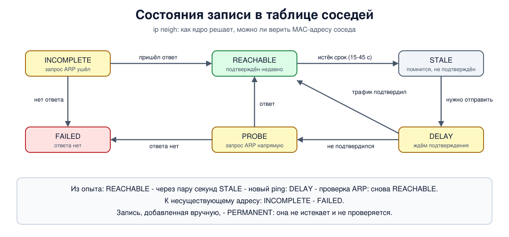

# Урок 45. iproute2: ip link, ip addr, ip route, ip neigh

Мы уже десяток уроков пользуемся командой `ip`: создаём интерфейсы, раздаём адреса, добавляем маршруты. Пора разобраться в ней как следует. Пакет **iproute2** и его главная команда `ip` - основной инструмент настройки сети в Linux. Он показывает и меняет то, что мы разбирали в теории: интерфейсы канального уровня (блок 2), адреса и маршруты (блок 3), таблицу соседей, то есть ARP (урок 24). В этом уроке - четыре главных объекта: `link`, `addr`, `route` и `neigh`, - как читать их вывод и что он говорит о состоянии сети.

## Почему iproute2, а не ifconfig

Старые команды `ifconfig`, `route`, `arp` и `netstat` из пакета **net-tools** до сих пор встречаются в инструкциях, но устарели: они появились задолго до многих возможностей современного ядра и не умеют работать с ними - несколько адресов на интерфейсе без псевдонимов, несколько таблиц маршрутов (урок 48), пространства имён (урок 49), большинство типов маршрутов (blackhole, prohibit). iproute2 общается с ядром через специальный интерфейс netlink и видит всё. Во многих современных дистрибутивах net-tools даже не установлен.

Соответствие для памяти: `ifconfig` - `ip link` и `ip addr`, `route` - `ip route`, `arp` - `ip neigh`, `netstat` - `ss` (урок 46).

## Общий вид команды

Все команды устроены одинаково: `ip [параметры] ОБЪЕКТ [команда] [аргументы]`.

- Объект: `link` (интерфейсы), `addr` (адреса), `route` (маршруты), `neigh` (соседи), а также `rule` (урок 48), `netns` (урок 49) и другие.
- Команда: `show` (по умолчанию), `add`, `del`, `set`, `get`, `flush`.
- Объекты и команды можно сокращать: `ip a`, `ip r`, `ip n`, `ip l`.

Полезные параметры:

- `-br` - краткий вывод, по строке на интерфейс;
- `-4` или `-6` - только IPv4 или только IPv6;
- `-s` - статистика;
- `-j` - вывод в формате JSON, удобно для программ;
- `-c` - цветной вывод.

Изменения через `ip` действуют сразу и **не сохраняются** после перезагрузки. Постоянная настройка хранится в файлах системы (в Ubuntu - netplan, в других дистрибутивах свои средства), а `ip` - для того, чтобы посмотреть, проверить и поменять на ходу.

## ip link: интерфейсы

`ip link` показывает интерфейсы - всё, через что ядро отправляет и получает кадры: настоящие карты, виртуальные пары veth, мосты, туннели, `lo`. Разберём строку из опыта:

- `2:` - номер интерфейса в ядре (индекс);
- `eth0@if2` - имя; после `@` - связанный интерфейс: у veth это вторая сторона пары (интерфейс с индексом 2 в другом пространстве имён), у VLAN - родительская карта;
- `<BROADCAST,MULTICAST,UP,LOWER_UP>` - флаги. `UP` - интерфейс включён администратором; `LOWER_UP` - есть физическая связь (кабель, вторая сторона пары). Включён, но связи нет - будет `UP` без `LOWER_UP`, флаг `NO-CARRIER` и `state DOWN` (у veth и VLAN бывает `LOWERLAYERDOWN`: связи нет у нижнего интерфейса);
- `mtu 1500` - MTU интерфейса (уроки 27 и 42);
- `qdisc noop` или `noqueue` - дисциплина очереди (урок 44);
- `state DOWN` или `UP` - итоговое состояние; `UNKNOWN` значит, что драйвер его не сообщает, как у `lo`, и это нормально;
- `link/ether ...` - MAC-адрес, `brd` - широковещательный MAC.

Включить и выключить интерфейс - `ip link set ИМЯ up` и `down`, сменить MTU - `ip link set ИМЯ mtu ЧИСЛО`. Статистика (`ip -s link`) показывает принятые и отправленные байты и пакеты и счётчики ошибок и отбрасываний на уровне драйвера - первое, куда смотреть при подозрении на проблемы с картой или кабелем.

## ip addr: адреса

`ip addr` показывает адреса интерфейсов. На одном интерфейсе их может быть сколько угодно, разных семейств. В строке адреса:

- `inet 192.0.2.2/24` - адрес и длина префикса (урок 22); `inet6` - IPv6;
- `scope global` - адрес годится для связи с кем угодно; `scope link` - только внутри своего сегмента (так помечены локальные адреса IPv6 `fe80::`, урок 30); `scope host` - только внутри самой машины (`127.0.0.1`);
- `valid_lft` и `preferred_lft` - сроки жизни адреса: у выданных по DHCP или SLAAC (уроки 29 и 31) они обычно конечны, у заданных вручную - `forever`.

Добавить адрес - `ip addr add АДРЕС/ДЛИНА dev ИМЯ`, удалить - `ip addr del`. Важное следствие: добавление адреса с префиксом сразу создаёт маршрут в его сеть, его не нужно добавлять отдельно.

## ip route: маршруты

`ip route` показывает таблицу маршрутов (урок 26), точнее главную таблицу `main`; другие таблицы - в уроке 48. Строка маршрута:

- `192.0.2.0/24` - сеть назначения; `default` - маршрут по умолчанию;
- `via 192.0.2.2` - следующий узел (шлюз); если `via` нет, сеть подключена прямо к интерфейсу;
- `dev eth0` - через какой интерфейс;
- `proto kernel` - кто добавил маршрут: `kernel` - ядро само, при добавлении адреса; `boot` - добавлен командой `ip route add` без указания proto (такое значение `ip` не печатает, поэтому у маршрута, который мы добавим в опыте, поля proto нет; увидеть можно через `ip -d route`); `static` - администратор или система настройки вроде netplan; `dhcp`, `bird` и другие - соответствующие программы (как в уроках 32 и 33);
- `scope link` - назначение достижимо напрямую, без шлюза;
- `src 192.0.2.1` - какой адрес отправителя ставить на пакеты, уходящие по этому маршруту;
- `metric` - приоритет при нескольких маршрутах в одну сеть: меньше - лучше.

Самая полезная команда здесь - `ip route get АДРЕС`: ядро говорит, **что оно сделает** с пакетом на этот адрес - через какой шлюз и интерфейс отправит и с каким адресом отправителя. Это отвечает на вопрос "куда уйдёт пакет" точнее, чем чтение таблицы глазами, потому что учитывает всё: самое длинное совпадение префикса, метрики, правила (урок 48). В ответе бывают и служебные поля: `uid 0` - для какого пользователя считался маршрут (правила могут от этого зависеть), `cache` - служебная строка.

Кроме обычных маршрутов есть маршруты, которые **отказывают**:

- `unreachable` - пакет отбрасывается, отправитель получает "нет маршрута к узлу" (ICMP "узел недоступен", урок 28);
- `prohibit` - то же, но с ответом "запрещено администратором";
- `blackhole` - пакет молча исчезает.

Их ставят, чтобы закрыть доступ к сетям или чтобы пакеты к неиспользуемым адресам не уходили по маршруту по умолчанию.

## ip neigh: соседи



`ip neigh` показывает таблицу соседей - результат работы ARP для IPv4 и обнаружения соседей для IPv6 (уроки 24 и 31). Кроме адреса и MAC в каждой строке есть **состояние**:

- `REACHABLE` - сосед недавно подтвердил, что жив: пришёл ответ ARP или протокол выше подтвердил связь (например, TCP получил подтверждение своих данных). Действует ограниченное время (по умолчанию случайно от 15 до 45 секунд);
- `STALE` - срок подтверждения истёк, но адрес ещё помнится и используется; при следующей отправке ядро перепроверит;
- `DELAY` и `PROBE` - перепроверка: ядро немного ждёт, не подтвердит ли соседа сам трафик, потом отправляет ему запрос ARP напрямую;
- `INCOMPLETE` - запрос ARP отправлен, ответа ещё нет;
- `FAILED` - ответа нет: соседа не существует или он недоступен. Пакеты к нему не уходят, а программа получает "узел недоступен";
- `PERMANENT` - запись добавлена вручную и не истекает.

Ручные записи (`ip neigh add ... nud permanent`) иногда ставят для защиты от подмены ARP (урок 24) или для отладки.

## Как это увидеть в Linux

Создадим два узла `a` (`192.0.2.1`) и `b` (`192.0.2.2`) и пройдём по всем четырём объектам: включим интерфейсы и сменим MTU, раздадим адреса, добавим маршруты и маршруты-отказы, посмотрим, как меняется состояние соседа. Чтобы не ждать минуту, мы укоротили сроки в таблице соседей у `a` до пары секунд. Нужны Linux (подойдёт WSL2), права sudo, iproute2, ping и python3 (`sudo apt install iproute2 iputils-ping python3`); всё создаётся в пространствах имён `hbh-*` и в конце удаляется.

Создай файл `ip-lab.sh` и запусти `bash ip-lab.sh`:
```
set -u
for c in ip ping python3; do
  command -v $c >/dev/null || { echo "нужен $c: sudo apt install iproute2 iputils-ping python3"; exit 1; }
done
# убрать остатки прошлого запуска
for n in hbh-a hbh-b; do
  sudo ip netns pids $n 2>/dev/null | xargs -r sudo kill
  sudo ip netns del $n 2>/dev/null
done
# два узла: a (192.0.2.1) и b (192.0.2.2); у b есть ещё сеть 198.51.100.0/24 за собой
for n in hbh-a hbh-b; do sudo ip netns add $n; done
A="sudo ip netns exec hbh-a"
B="sudo ip netns exec hbh-b"
sudo ip link add eth0 netns hbh-a type veth peer name eth0 netns hbh-b
echo '--- 1. ip link: interfaces (b, right after creation)'
$B ip link show dev eth0
$A ip link set lo up; $B ip link set lo up
$A ip link set eth0 up
$B ip link set eth0 up
$B ip link set eth0 mtu 1400
echo 'after "up" and "mtu 1400":'
$B ip -br link
echo '--- 2. ip addr: addresses'
$A ip addr add 192.0.2.1/24 dev eth0
$B ip addr add 192.0.2.2/24 dev eth0
$B ip addr add 198.51.100.1/24 dev eth0
$B ip -4 addr show dev eth0 | sed -E 's/valid_lft.*//' | grep -v '^ *$'
echo 'brief form on b:'
$B ip -br addr
echo '--- 3. ip route: where packets go'
$A ip route
echo 'route to b, and to the network behind b, before and after adding a route:'
$A ip route get 192.0.2.2
$A ip route get 198.51.100.1 2>&1
$A ip route add 198.51.100.0/24 via 192.0.2.2
$A ip route get 198.51.100.1
echo 'routes that refuse:'
$A ip route add unreachable 203.0.113.0/26
$A ip route add prohibit 203.0.113.64/26
$A ip route add blackhole 203.0.113.128/26
for t in 203.0.113.1 203.0.113.65 203.0.113.129; do
  echo "$t: $($A ip route get $t 2>&1)"
done
$A ip route
echo '--- 4. ip neigh: who has which MAC address'
$A sysctl -qw net.ipv4.neigh.eth0.base_reachable_time_ms=2000
$A sysctl -qw net.ipv4.neigh.eth0.delay_first_probe_time=1
$A ping -c 1 -W 1 192.0.2.2 >/dev/null
echo -n 'right after ping:      '; $A ip neigh show dev eth0 192.0.2.2
sleep 4
echo -n 'a few seconds later:   '; $A ip neigh show dev eth0 192.0.2.2
$A ping -c 1 -W 1 192.0.2.2 >/dev/null
echo -n 'used again:            '; $A ip neigh show dev eth0 192.0.2.2
sleep 1.5
echo -n 'after the check:       '; $A ip neigh show dev eth0 192.0.2.2
$A ping -c 1 -W 1 192.0.2.99 >/dev/null 2>&1 &
sleep 0.3
echo -n 'nobody at .99, asking: '; $A ip neigh show dev eth0 192.0.2.99
wait
sleep 3
echo -n 'nobody at .99, later:  '; $A ip neigh show dev eth0 192.0.2.99
$A ip neigh add 192.0.2.50 lladdr 02:00:00:00:00:50 dev eth0 nud permanent
echo -n 'added by hand:         '; $A ip neigh show dev eth0 192.0.2.50
echo '--- 5. the same in JSON, for scripts'
$A ip -j route show 198.51.100.0/24 | python3 -m json.tool
echo '--- 6. statistics of the interface'
$A ip -s link show dev eth0 | sed -n '1p;/RX:/,$p'
echo '--- cleanup'
for n in hbh-a hbh-b; do
  sudo ip netns pids $n 2>/dev/null | xargs -r sudo kill
  sudo ip netns del $n
done
ip netns list | grep -cE '^hbh-(a|b)( |$)'
```

Вот что получилось на нашем сервере:
```
--- 1. ip link: interfaces (b, right after creation)
2: eth0@if2: <BROADCAST,MULTICAST> mtu 1500 qdisc noop state DOWN mode DEFAULT group default qlen 1000
    link/ether 92:61:50:45:1f:bb brd ff:ff:ff:ff:ff:ff link-netns hbh-a
after "up" and "mtu 1400":
lo               UNKNOWN        00:00:00:00:00:00 <LOOPBACK,UP,LOWER_UP> 
eth0@if2         UP             92:61:50:45:1f:bb <BROADCAST,MULTICAST,UP,LOWER_UP> 
--- 2. ip addr: addresses
2: eth0@if2: <BROADCAST,MULTICAST,UP,LOWER_UP> mtu 1400 qdisc noqueue state UP group default qlen 1000 link-netns hbh-a
    inet 192.0.2.2/24 scope global eth0
    inet 198.51.100.1/24 scope global eth0
brief form on b:
lo               UNKNOWN        127.0.0.1/8 ::1/128 
eth0@if2         UP             192.0.2.2/24 198.51.100.1/24 fe80::9061:50ff:fe45:1fbb/64 
--- 3. ip route: where packets go
192.0.2.0/24 dev eth0 proto kernel scope link src 192.0.2.1 
route to b, and to the network behind b, before and after adding a route:
192.0.2.2 dev eth0 src 192.0.2.1 uid 0 
    cache 
RTNETLINK answers: Network is unreachable
198.51.100.1 via 192.0.2.2 dev eth0 src 192.0.2.1 uid 0 
    cache 
routes that refuse:
203.0.113.1: RTNETLINK answers: No route to host
203.0.113.65: RTNETLINK answers: Permission denied
203.0.113.129: RTNETLINK answers: Invalid argument
192.0.2.0/24 dev eth0 proto kernel scope link src 192.0.2.1 
198.51.100.0/24 via 192.0.2.2 dev eth0 
unreachable 203.0.113.0/26 
prohibit 203.0.113.64/26 
blackhole 203.0.113.128/26 
--- 4. ip neigh: who has which MAC address
right after ping:      192.0.2.2 lladdr 92:61:50:45:1f:bb REACHABLE 
a few seconds later:   192.0.2.2 lladdr 92:61:50:45:1f:bb STALE 
used again:            192.0.2.2 lladdr 92:61:50:45:1f:bb DELAY 
after the check:       192.0.2.2 lladdr 92:61:50:45:1f:bb REACHABLE 
nobody at .99, asking: 192.0.2.99 INCOMPLETE 
nobody at .99, later:  192.0.2.99 FAILED 
added by hand:         192.0.2.50 lladdr 02:00:00:00:00:50 PERMANENT 
--- 5. the same in JSON, for scripts
[
    {
        "dst": "198.51.100.0/24",
        "gateway": "192.0.2.2",
        "dev": "eth0",
        "flags": []
    }
]
--- 6. statistics of the interface
2: eth0@if2: <BROADCAST,MULTICAST,UP,LOWER_UP> mtu 1500 qdisc noqueue state UP mode DEFAULT group default qlen 1000
    RX:  bytes packets errors dropped  missed   mcast           
           908      12      0       0       0       0 
    TX:  bytes packets errors dropped carrier collsns           
          1034      15      0       0       0       0 
--- cleanup
0
```

Разберём.

- **Шаг 1: интерфейс.** Сразу после создания `eth0` у `b` выключен: флаги без `UP`, `state DOWN`, дисциплина `noop`. После `ip link set ... up` в кратком выводе - `UP` и флаги `UP,LOWER_UP`: интерфейс включён и вторая сторона пары тоже. MTU мы сменили на 1400 - это видно в следующем шаге.
- **Шаг 2: адреса.** У `b` на одном интерфейсе два адреса IPv4 из разных сетей, оба `scope global`. В кратком выводе есть и третий, `fe80::...`: локальный адрес IPv6 ядро назначило само, как только интерфейс поднялся (урок 30).
- **Шаг 3: маршруты.** У `a` в таблице одна строка, `proto kernel scope link`: её ядро добавило само вместе с адресом. `ip route get 192.0.2.2` отвечает: напрямую через `eth0`, отправитель `192.0.2.1`. А для `198.51.100.1` - `Network is unreachable`: нет ни подходящего маршрута, ни маршрута по умолчанию. После `ip route add 198.51.100.0/24 via 192.0.2.2` тот же вопрос даёт ответ `via 192.0.2.2`. Три маршрута-отказа отвечают по-разному: `No route to host` (unreachable), `Permission denied` (prohibit), `Invalid argument` (blackhole) - так их увидит и программа, которая попробует туда отправить пакет. В таблице они записаны с типом в начале строки.
- **Шаг 4: соседи.** Сразу после пинга сосед `192.0.2.2` - `REACHABLE`. Через несколько секунд (у нас укороченный срок) - `STALE`: адрес помнится, но не подтверждён. Новый пинг - `DELAY`: ядро отправило пакет по старому адресу и ждёт, не подтвердит ли соседа сам трафик. Наш ping отправил всего один пакет, ещё не получив ни одного ответа, и подтвердить соседа ему нечем (долгий ping и TCP подтверждают соседа, когда получают ответы), поэтому через секунду ядро перешло в `PROBE`, спросило `b` по ARP напрямую, получило ответ - и сосед снова `REACHABLE`. `PROBE` длится, пока не придёт ответ ARP, а на паре veth это мгновение, поэтому в выводе его нет. Для несуществующего `192.0.2.99` - сначала `INCOMPLETE` (запросы ARP уходят, ответа нет), потом `FAILED`. Запись, добавленная вручную, - `PERMANENT`.
- **Шаг 5: JSON.** Тот же маршрут в машиночитаемом виде: поля `dst`, `gateway`, `dev`. Скриптам лучше разбирать JSON, а не текст, формат которого может меняться между версиями.
- **Шаг 6: статистика.** Принятые и отправленные байты и пакеты, ошибки и отбрасывания на уровне драйвера. У нас ошибок нет. Это интерфейс `a`, поэтому MTU 1500: 1400 мы ставили у `b`. В настоящей сети MTU на обоих концах одного сегмента должен совпадать (урок 27), здесь мы сменили его только для демонстрации.
- В конце `0`: пространства имён удалены.

## Итог

- iproute2 и команда `ip` - основной инструмент настройки сети в Linux; старые `ifconfig`, `route`, `arp` устарели и видят не всё.
- `ip link` - интерфейсы: флаги `UP` (включён) и `LOWER_UP` (есть связь), MTU, MAC, статистика с `-s`.
- `ip addr` - адреса: их может быть несколько, у каждого область действия (global, link, host) и срок жизни; добавление адреса создаёт маршрут в его сеть.
- `ip route` - маршруты: `via`, `dev`, `proto`, `scope`, `src`, `metric`; `ip route get` показывает, что ядро сделает с пакетом; `unreachable`, `prohibit`, `blackhole` отказывают по-разному.
- `ip neigh` - соседи с состояниями REACHABLE, STALE, DELAY, PROBE, INCOMPLETE, FAILED, PERMANENT.
- Изменения через `ip` не переживают перезагрузку; для скриптов есть вывод в JSON (`-j`).

## Что почитать

- `man 8 ip`, `man 8 ip-link`, `man 8 ip-address`, `man 8 ip-route`, `man 8 ip-neighbour`.
- Документация ядра Linux: Documentation/networking/ip-sysctl.rst, параметры `neigh/*` (сроки и попытки в таблице соседей).
- Уроки 24 (ARP), 26 (таблица маршрутов) и 31 (обнаружение соседей в IPv6) - теория, которую показывают эти команды.