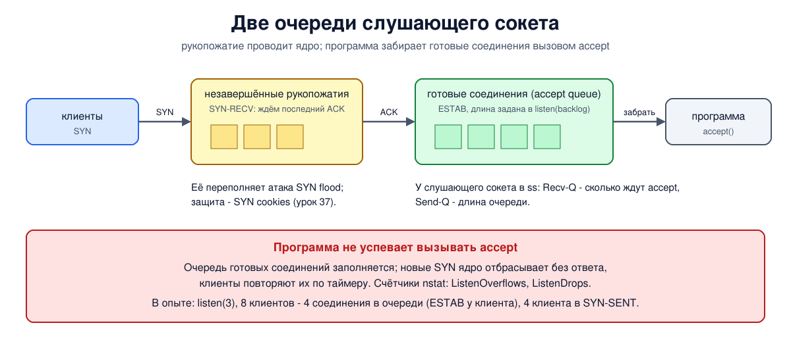

# Урок 46. Сокеты в Linux и ss

В уроке 34 мы познакомились с сокетом - конечной точкой, через которую программа работает с сетью, - и с вызовами `socket`, `bind`, `listen`, `accept` и `connect`. Блок 4 разобрал, что TCP делает внутри соединения. Теперь посмотрим на сокеты со стороны администратора Linux: какие очереди есть у слушающего сокета и что происходит, когда программа не успевает их разбирать, как по состоянию сокета понять, что программа работает неправильно, и как главным инструментом, `ss`, увидеть всё это на живой машине. В конце - как найти на своём сервере порты, которые открыты, хотя никто этого не планировал.

## Сокет - это файл программы

Для программы сокет - такой же **файловый дескриптор**, как открытый файл: число, которое вернул вызов `socket` и которое потом передаётся в `bind`, `send`, `recv` и `close`. Поэтому `ss` показывает у сокета не только программу, но и номер дескриптора: `users:(("python3",pid=1234,fd=3))` - процесс python3, дескриптор 3. Сам сокет живёт в ядре: там его очереди, буферы, состояние TCP и таймеры. Если программа завершится, ядро закроет все её сокеты.

Набор вызовов пришёл из BSD Unix начала 1980-х (сокеты Беркли) и с тех пор почти не изменился - его поддерживают Linux, macOS, Windows. Таненбаум описывает его в разделе 6.1.3 (с. 569-571, таблица вызовов - с. 570) и в разделе 6.1.4 разбирает пример простого файлового сервера и клиента (с. 571-575):

| Вызов | Кто | Что делает |
|---|---|---|
| `socket` | оба | создать сокет: семейство (IPv4, IPv6) и тип (поток TCP или дейтаграммы UDP) |
| `bind` | сервер | привязать к адресу и порту |
| `listen` | сервер | сделать слушающим и задать длину очереди готовых соединений |
| `accept` | сервер | забрать из очереди готовое соединение: получить **новый** сокет |
| `connect` | клиент | установить соединение; ядро само выберет временный порт |
| `send`, `recv` | оба | передать и получить данные |
| `close` | оба | закрыть свою сторону соединения |

У UDP нет соединений, поэтому нет и `listen` с `accept`: программа привязывает сокет и сразу получает дейтаграммы от кого угодно. В `ss` такой сокет показан в состоянии `UNCONN`.

## Очереди слушающего сокета

Когда клиент присылает SYN, программа-сервер ещё ничего не знает: рукопожатие проводит ядро. Как мы видели в уроке 37, для этого у слушающего сокета есть две очереди:

1. **Очередь незавершённых рукопожатий**: пришёл SYN, ядро ответило SYN+ACK и ждёт последнего ACK. Сокеты в этой очереди - в состоянии `SYN-RECV`. Именно её переполняет атака SYN flood, и от этого защищают SYN cookies (урок 37).
2. **Очередь готовых соединений** (accept queue): рукопожатие завершено, соединение установлено и ждёт, пока программа вызовет `accept`. Длину этой очереди программа задаёт в `listen` (параметр backlog), а ядро ограничивает её сверху значением `net.core.somaxconn` (в современных ядрах 4096). Тот же backlog в современных ядрах ограничивает и первую очередь (урок 37).

Важная тонкость: **клиент считает соединение установленным, как только прошло рукопожатие**, даже если программа-сервер его ещё не приняла. Клиент может уже отправлять данные - они полежат в очереди сокета.

Если программа принимает соединения медленнее, чем они приходят, очередь готовых соединений заполняется. Тогда Linux перестаёт принимать новые SYN на этом сокете: просто отбрасывает их, не отвечая, а клиенты повторяют SYN по таймеру (урок 40). Растут счётчики `ListenOverflows` и `ListenDrops` (`nstat`). Для пользователя это выглядит как "сайт иногда долго открывается", хотя сеть в порядке и сервер жив. (Параметр `net.ipv4.tcp_abort_on_overflow` касается другого случая: если последний ACK рукопожатия пришёл, когда очередь уже полна, ядро по умолчанию его игнорирует и ждёт повтора, а с этим параметром отвечает RST. Новые SYN при полной очереди отбрасываются молча в любом случае.) Таненбаум (разд. 6.1.4, с. 574) описывает параметр `listen` как число запросов, которые система держит в очереди, пока сервер занят, а лишние запросы - как просто игнорируемые. Linux ведёт себя так же.

У слушающего сокета столбцы `ss` значат не то, что у обычного: **Recv-Q** - сколько готовых соединений ждут `accept` прямо сейчас, **Send-Q** - длина очереди, заданная в `listen` (с учётом предела `somaxconn`). Recv-Q, близкое к Send-Q, - верный признак, что программа не успевает.

## ss: что показывает и как фильтровать

`ss` (socket statistics, пакет iproute2) пришёл на смену `netstat` из устаревшего net-tools, как `ip` пришёл на смену `ifconfig` (урок 45). Он получает сведения из ядра напрямую через netlink, а не разбирает текстовые файлы `/proc`, поэтому быстро работает даже на машине с сотнями тысяч соединений.

Основные ключи:

- `-t`, `-u`, `-x` - сокеты TCP, UDP, локальные сокеты Unix; `-4`, `-6` - только IPv4 или IPv6;
- `-l` - только слушающие, `-a` - все, без них - соединения, кроме слушающих (а также кроме `TIME-WAIT`, `SYN-RECV` и неподключённых UDP-сокетов `UNCONN`);
- `-n` - числа вместо имён служб и узлов (быстрее и однозначнее);
- `-p` - какой процесс владеет сокетом (чтобы видеть чужие процессы, нужны права root);
- `-o` - таймеры: повторная передача, keepalive, TIME-WAIT;
- `-i` - внутренние сведения TCP: время оборота, окно перегрузки, MSS, повторы (уроки 39-42);
- `-m` - память сокета, `-e` - расширенные сведения, `-s` - сводка, `-H` - без заголовка.

Самая частая команда - `ss -tulpn`: все слушающие сокеты TCP и UDP с номерами портов и программами.

Столбцы обычного соединения: состояние (`ESTAB`, `TIME-WAIT` и т. д.), **Recv-Q** - сколько байт пришло, но программа их ещё не прочитала, **Send-Q** - сколько байт программа уже отдала ядру, а другая сторона ещё не подтвердила (часть из них, возможно, ещё не отправлена), затем локальный и удалённый адрес с портом. Постоянно растущий Recv-Q - программа не успевает читать; растущий Send-Q - сеть или получатель не успевают принимать.

Фильтры позволяют не листать тысячи строк:

- по состоянию: `ss -tn state established`, `state time-wait`, `state close-wait`, `state syn-recv`, `state listening`;
- по адресу и порту: `ss -tn '( dport = :443 or sport = :443 )'`, `ss -tn dst 192.0.2.0/24`.

Состояния TCP из уроков 37 и 38 подсказывают, где ошибка:

- много `SYN-RECV` - незавершённые рукопожатия: под атакой SYN flood или когда ответы клиентов теряются;
- много `TIME-WAIT` - нормально для стороны, которая закрывает первой (урок 38), если их не сотни тысяч;
- много `CLOSE-WAIT` - почти всегда **ошибка в программе**: другая сторона закрыла соединение, а программа так и не вызвала `close`. Такие сокеты не исчезнут сами, пока жива программа, и рано или поздно она упрётся в предел открытых дескрипторов.



## Как это увидеть в Linux

В двух пространствах имён: клиент `a` (`192.0.2.1`) и сервер `b` (`192.0.2.2`). Сначала переполним очередь сервера, который не вызывает `accept`; потом посмотрим на сервер, который забывает закрыть соединение; потом разберём одно соединение ключами `ss`; в конце проведём проверку открытых портов на `b` и закроем лишнее файерволом. Нужны Linux (подойдёт WSL2), права sudo, python3 и nftables (`sudo apt install python3 iproute2 nftables`); всё создаётся в пространствах имён `hbh-*` и в конце удаляется.

Создай файл `sockets-lab.sh` и запусти `bash sockets-lab.sh`:
```
set -u
for c in python3 ss nstat nft; do
  command -v $c >/dev/null || { echo "нужен $c: sudo apt install python3 iproute2 nftables"; exit 1; }
done
# убрать остатки прошлого запуска
for n in hbh-a hbh-b; do
  sudo ip netns pids $n 2>/dev/null | xargs -r sudo kill
  sudo ip netns del $n 2>/dev/null
done
d=$(mktemp -d)
chmod 755 "$d"
# клиент a (192.0.2.1) и сервер b (192.0.2.2)
for n in hbh-a hbh-b; do sudo ip netns add $n; done
sudo ip link add eth0 netns hbh-a type veth peer name eth0 netns hbh-b
sudo ip netns exec hbh-a ip addr add 192.0.2.1/24 dev eth0
sudo ip netns exec hbh-b ip addr add 192.0.2.2/24 dev eth0
for n in hbh-a hbh-b; do
  sudo ip netns exec $n ip link set lo up
  sudo ip netns exec $n ip link set eth0 up
done
A="sudo ip netns exec hbh-a"
B="sudo ip netns exec hbh-b"
# сервер, который слушает, но никого не принимает (accept не вызывает)
cat > "$d/lazy.py" <<'EOF'
import socket, time
s = socket.socket()
s.bind(("0.0.0.0", 5000))
s.listen(3)                      # очередь готовых соединений: 3
time.sleep(60)
EOF
# клиенты: n соединений сразу, держит их открытыми
cat > "$d/many.py" <<'EOF'
import socket, sys, time
socks = []
for i in range(int(sys.argv[1])):
    c = socket.socket(); c.setblocking(False)
    c.connect_ex(("192.0.2.2", 5000)); socks.append(c)
time.sleep(60)
EOF
# сервер, который принимает соединение, но забывает его закрыть
cat > "$d/forgetful.py" <<'EOF'
import socket, time
s = socket.socket(); s.setsockopt(socket.SOL_SOCKET, socket.SO_REUSEADDR, 1)
s.bind(("0.0.0.0", 5001)); s.listen()
c, _ = s.accept()
c.recv(100)                      # клиент закрыл соединение: recv вернул b""
time.sleep(3)                    # а сервер не закрывает свою сторону
c.close()
time.sleep(60)
EOF
cat > "$d/client.py" <<'EOF'
import socket, time
c = socket.create_connection(("192.0.2.2", 5001))
c.close()
time.sleep(60)
EOF
st='s/ +/ /g'
echo '--- 1. a listening socket and its queue'
$B python3 "$d/lazy.py" &
sleep 0.5
$B ss -tln
$A python3 "$d/many.py" 8 &
sleep 2
echo 'after 8 clients tried to connect:'
$B ss -tln 'sport = :5000'
echo "on b: $($B ss -tan state syn-recv 'sport = :5000' | sed 1d | wc -l) connections half-open (SYN-RECV)"
echo "on a, connection states: $($A ss -tanH 'dport = :5000' | awk '{print $1}' | sort | uniq -c | xargs)"
$B nstat -asz TcpExtListenOverflows TcpExtListenDrops | sed 1d | awk '{print $1, $2}'
echo '--- 2. a server that forgets to close'
$B python3 "$d/forgetful.py" &
sleep 0.5
$A python3 "$d/client.py" &
sleep 1
echo 'the client has closed, the server has not:'
echo "  a: $($A ss -tanH 'dport = :5001' | sed -E "$st")"
echo "  b: $($B ss -tanH 'sport = :5001' | grep -v LISTEN | sed -E "$st")"
sleep 3
echo 'the server closed 3 s later:'
echo "  a: $($A ss -tanoH 'dport = :5001' | sed -E "$st")"
echo "  b: $($B ss -tanH 'sport = :5001' | grep -v LISTEN | sed -E "$st" | grep . || echo '(no connection, only the listening socket)')"
echo '--- 3. who owns the socket and how the connection is doing'
cat > "$d/talk.py" <<'EOF'
import socket, sys, time
if sys.argv[1] == "server":
    s = socket.socket(); s.setsockopt(socket.SOL_SOCKET, socket.SO_REUSEADDR, 1)
    s.bind(("0.0.0.0", 5002)); s.listen()
    c, _ = s.accept()
    while c.recv(65536): pass
else:
    c = socket.create_connection(("192.0.2.2", 5002))
    c.setsockopt(socket.SOL_SOCKET, socket.SO_KEEPALIVE, 1)
    for i in range(20):
        c.sendall(b"x" * 100000); time.sleep(0.05)
    time.sleep(60)
EOF
$B python3 "$d/talk.py" server &
sleep 0.5
$A python3 "$d/talk.py" client &
sleep 2
$A ss -tnpo state established '( dport = :5002 )' | sed -E 's/pid=[0-9]+/pid=N/' | tr -s ' '
info=$($A ss -tniH state established '( dport = :5002 )' | tr -s ' \t' ' ')
echo 'some of the fields from ss -i:'
for f in ' rtt:[0-9./]+' 'mss:[0-9]+' 'cwnd:[0-9]+' 'bytes_acked:[0-9]+' 'retrans:[0-9/]+' 'snd_wnd:[0-9]+'; do
  echo "$info" | grep -oE "$f" | head -1 | sed -E 's/^ ?/  /'
done
echo 'memory of the socket (ss -m):'
$A ss -tnm state established '( dport = :5002 )' | grep -oE 'skmem:\([^)]*\)' | sed 's/^/  /'
echo '--- 4. audit: what is listening on b, and what can be reached from a'
for n in hbh-a hbh-b; do sudo ip netns pids $n 2>/dev/null | xargs -r sudo kill; done
sleep 0.5
cat > "$d/svc.py" <<'EOF'
import socket, sys, time
host, port, kind = sys.argv[1], int(sys.argv[2]), sys.argv[3]
fam = socket.AF_INET6 if ":" in host else socket.AF_INET
s = socket.socket(fam, socket.SOCK_STREAM if kind == "tcp" else socket.SOCK_DGRAM)
s.setsockopt(socket.SOL_SOCKET, socket.SO_REUSEADDR, 1)
s.bind((host, port))
if kind == "tcp":
    s.listen()
time.sleep(60)
EOF
$B python3 "$d/svc.py" 0.0.0.0 8080 tcp &      # сайт, должен быть доступен
$B python3 "$d/svc.py" 127.0.0.1 6379 tcp &    # база данных, только для своих
$B python3 "$d/svc.py" :: 9000 tcp &           # служба на IPv6 "::"
$B python3 -m http.server 8000 -d "$d" >/dev/null 2>&1 &   # забытый отладочный сервер
$B python3 "$d/svc.py" 0.0.0.0 5353 udp &
sleep 1
$B ss -tulnp | sed -E 's/pid=[0-9]+/pid=N/g; s/,fd=[0-9]+//g' | tr -s ' '
cat > "$d/probe.py" <<'EOF'
import socket
res = []
for p in (22, 6379, 8000, 8080, 9000):
    c = socket.socket(); c.settimeout(1)
    try:
        c.connect(("192.0.2.2", p)); r = "open"
    except ConnectionRefusedError:
        r = "closed"
    except socket.timeout:
        r = "no answer"
    res.append(f"{p} {r}")
print("from a:", ", ".join(res))
EOF
$A python3 "$d/probe.py"
echo '--- 5. defence: only 8080 is allowed in from outside'
$B nft add table inet lab
$B nft add chain inet lab in '{ type filter hook input priority 0; policy drop; }'
$B nft add rule inet lab in iif lo accept
$B nft add rule inet lab in ct state established,related accept
$B nft add rule inet lab in tcp dport 8080 accept
$A python3 "$d/probe.py"
echo "on b, port 8000 is still listening: $($B ss -tlnH 'sport = :8000' | awk '{print $1, $4}')"
echo '--- cleanup'
for n in hbh-a hbh-b; do
  sudo ip netns pids $n 2>/dev/null | xargs -r sudo kill
  sudo ip netns del $n
done
rm -rf "$d"
ip netns list | grep -cE '^hbh-(a|b)( |$)'
```

Вот что получилось на нашем сервере:
```
--- 1. a listening socket and its queue
State  Recv-Q Send-Q Local Address:Port Peer Address:PortProcess
LISTEN 0      3            0.0.0.0:5000      0.0.0.0:*          
after 8 clients tried to connect:
State  Recv-Q Send-Q Local Address:Port Peer Address:PortProcess
LISTEN 4      3            0.0.0.0:5000      0.0.0.0:*          
on b: 0 connections half-open (SYN-RECV)
on a, connection states: 4 ESTAB 4 SYN-SENT
TcpExtListenOverflows 12
TcpExtListenDrops 12
--- 2. a server that forgets to close
the client has closed, the server has not:
  a: FIN-WAIT-2 0 0 192.0.2.1:54348 192.0.2.2:5001
  b: CLOSE-WAIT 0 0 192.0.2.2:5001 192.0.2.1:54348
the server closed 3 s later:
  a: TIME-WAIT 0 0 192.0.2.1:54348 192.0.2.2:5001 timer:(timewait,58sec,0)
  b: (no connection, only the listening socket)
--- 3. who owns the socket and how the connection is doing
Recv-Q Send-Q Local Address:Port Peer Address:PortProcess
0 0 192.0.2.1:48378 192.0.2.2:5002 users:(("python3",pid=N,fd=3)) timer:(keepalive,119min,0)
some of the fields from ss -i:
  rtt:0.075/0.006
  mss:1448
  cwnd:248
  bytes_acked:2000001
  snd_wnd:3672960
memory of the socket (ss -m):
  skmem:(r0,rb131072,t0,tb130560,f0,w0,o0,bl0,d0)
--- 4. audit: what is listening on b, and what can be reached from a
Netid State Recv-Q Send-Q Local Address:Port Peer Address:PortProcess 
udp UNCONN 0 0 0.0.0.0:5353 0.0.0.0:* users:(("python3",pid=N))
tcp LISTEN 0 5 0.0.0.0:8000 0.0.0.0:* users:(("python3",pid=N))
tcp LISTEN 0 128 0.0.0.0:8080 0.0.0.0:* users:(("python3",pid=N))
tcp LISTEN 0 128 127.0.0.1:6379 0.0.0.0:* users:(("python3",pid=N))
tcp LISTEN 0 128 *:9000 *:* users:(("python3",pid=N))
from a: 22 closed, 6379 closed, 8000 open, 8080 open, 9000 open
--- 5. defence: only 8080 is allowed in from outside
from a: 22 no answer, 6379 no answer, 8000 no answer, 8080 open, 9000 no answer
on b, port 8000 is still listening: LISTEN 0.0.0.0:8000
--- cleanup
0
```

Разберём.

**Шаг 1: очередь готовых соединений.** Сервер вызвал `listen(3)` и не вызывает `accept`. Сразу после запуска у слушающего сокета Recv-Q 0 и Send-Q 3 - очередь пуста, длина 3. Восемь клиентов подключились одновременно, и Recv-Q стал 4: Linux пускает в очередь на одно соединение больше заданного. У этих четырёх клиентов на `a` соединение в состоянии `ESTAB` - для них рукопожатие завершено, хотя программа-сервер о них не знает. Остальные четыре - в `SYN-SENT`: их SYN ядро `b` отбросило без ответа, и они повторяют попытки. Полуоткрытых соединений на `b` нет: при полной очереди ядро не начинает новых рукопожатий. Счётчики `ListenOverflows` и `ListenDrops` считают каждый отброшенный SYN вместе с повторами, поэтому они больше четырёх: в WSL2 у нас было 8 - первая попытка и повтор через секунду, на сервере 12 - успел прийти и второй повтор, ещё через 2 секунды (урок 40).

**Шаг 2: сервер забыл закрыть.** Клиент закрыл соединение, его сторона в `FIN-WAIT-2` - ждёт FIN от сервера. Сервер получил FIN (его `recv` вернул пустой байтовый объект `b""`), но `close` не вызвал: сокет висит в `CLOSE-WAIT`. Через 3 секунды программа всё-таки закрыла сокет - и он у `b` исчез, а у клиента начался `TIME-WAIT`, ключ `-o` показывает таймер: `timewait,58sec` из 60 секунд. Будь в программе ошибка, `CLOSE-WAIT` висел бы, пока она жива.

**Шаг 3: одно соединение подробно.** Клиент отправил 2 000 000 байт.

- `-p`: владелец - процесс `python3`, дескриптор 3.
- `-o`: таймер keepalive - программа включила проверку живости соединения (`SO_KEEPALIVE`), и первая проверка будет через 2 часа простоя (`net.ipv4.tcp_keepalive_time`, 7200 секунд).
- `-i`: `rtt:0.075/0.006` - сглаженное время оборота 0,075 мс и его разброс 0,006 мс, MSS 1448 - это 1460 минус 12 байт меток времени (урок 42), окно перегрузки 248 сегментов (урок 41), `bytes_acked` 2 000 001 - подтверждены все данные и ещё один номер, занятый SYN (урок 37). Окно получателя `snd_wnd` - около 3,7 МБ (урок 39). Поля `retrans` в выводе нет: повторов не было, и `ss` его не печатает.
- `-m`: `rb` и `tb` - размеры буферов приёма и отправки, `r` - сколько занято в буфере приёма, `w` - в буфере отправки (ноль: всё прочитано и подтверждено), `d` - отброшено. В WSL2 буфер отправки `tb` вырос до 1,2 МБ: когда программа упирается в заполненный буфер, ядро увеличивает его примерно до двух окон перегрузки (2 × 144 сегмента). На сервере `tb` остался таким, каким ядро задало его при установлении соединения (около 127 КБ, с запасом под алгоритм BBR): каждая запись в 100 000 байт помещалась в буфер, программа ни разу не ждала, и увеличивать его было незачем. Значение по умолчанию из `net.ipv4.tcp_wmem` ещё меньше - 16 КБ.

**Шаг 4: проверка открытых портов.** На `b` пять служб. `ss -tulpn` показывает их все с программами. Проверка с `a`:

- `8080` открыт - так и задумано, это сайт;
- `6379` закрыт: служба есть, но слушает только `127.0.0.1` - снаружи её не видно (урок 34);
- `8000` открыт: это отладочный сервер `python3 -m http.server`, который кто-то запустил "на минутку" и забыл. Он отдаёт содержимое папки любому, кто зайдёт;
- `9000` открыт: служба слушает IPv6-адрес `::`, а `ss` показывает его как `*:9000` - такой сокет в Linux по умолчанию принимает и IPv4. Звёздочку `ss` ставит именно для таких сокетов; сокет только для IPv6 был бы показан как `[::]:9000`. Легко подумать "она же только для IPv6" и не закрыть её правилами для IPv4;
- `22` закрыт: на `b` ничего не слушает этот порт.

Заодно видны длины очередей: у `http.server` Send-Q 5 (столько задаёт его библиотека), у остальных 128 - значение Python по умолчанию.

**Шаг 5: файервол.** На `b` - правило с политикой "запрещено всё, что не разрешено" (урок 51) в семействе `inet`, то есть сразу для IPv4 и IPv6: пропускаются только loopback, ответы на свои соединения и порт 8080. Теперь снаружи открыт только 8080, остальные порты не отвечают вовсе (пакеты отбрасываются молча, клиент ждёт до таймаута - так выглядит "фильтруемый" порт). Но отладочный сервер на 8000 **по-прежнему слушает**. Файервол спрятал его, но не убрал: стоит правилу измениться - и он снова доступен.

В конце `0`: пространства имён удалены.

## Безопасность: неожиданно открытые порты

Каждый слушающий сокет на внешнем адресе - вход в машину, и через него могут прийти не только те, для кого его открыли. Неожиданно открытые порты появляются по нескольким типичным причинам: программа по умолчанию слушает `0.0.0.0` или `::`, хотя нужна только локально (базы данных, кэши, панели управления, метрики); забытый временный или отладочный сервер; служба на IPv6, которую не закрыли правила, написанные только для IPv4; контейнер, порт которого опубликован наружу. Последнее особенно коварно: Docker при публикации порта (`-p 8080:80`) добавляет свои правила преобразования адресов, и такой трафик идёт мимо цепочки INPUT, где стоят правила ufw и подобных надстроек, - порт открыт, хотя файервол "всё запрещает" (подробнее о NAT и пробросе портов - уроки 56-57).

Как защищаться:

- **Знать, что должно быть открыто.** Держать список ожидаемых портов для каждого сервера и регулярно сравнивать с ним вывод `ss -tulpn`; лишнее - разбирать, откуда взялось. Сравнение легко автоматизировать: `ss -tulnH` в скрипте и оповещение при расхождении.
- **Закрывать, а не прятать.** Ненужную службу - останавливать и отключать. Нужную только локально - привязывать к `127.0.0.1` (или к локальному сокету Unix), у контейнеров публиковать порт так же: `-p 127.0.0.1:8080:80` (в Docker до версии 28 такой порт был доступен и соседям по сегменту сети, поэтому стоит обновиться).
- **Файервол как второй рубеж**, с политикой "запрещено всё, что не разрешено", и одинаково для IPv4 и IPv6 (в nftables это семейство `inet`, блок 6).
- **Проверять снаружи.** `ss` показывает, что слушает, но не что доступно: файервол, NAT и облачные группы безопасности меняют картину. Поэтому полезно проверять свой сервер со своей же другой машины - как `a` проверял `b` в опыте. Проверять можно только свои системы или с разрешения владельца.

## Итог

- Для программы сокет - файловый дескриптор; очереди, буферы, состояние и таймеры живут в ядре.
- У слушающего сокета две очереди: незавершённых рукопожатий (`SYN-RECV`) и готовых соединений, длина которой задаётся в `listen`. Когда вторая полна, Linux отбрасывает новые SYN, а клиенты повторяют; у слушающего сокета Recv-Q - сколько ждут `accept`, Send-Q - предел.
- `ss` - главный инструмент: `-tulpn` для слушающих, `-o` таймеры, `-i` внутренности TCP, `-m` память, фильтры по состоянию и портам.
- Много `CLOSE-WAIT` - ошибка программы, которая не закрывает соединения.
- Порты проверяют регулярно: что слушает (`ss`) и что доступно снаружи. Лишнее закрывают, внутреннее привязывают к `127.0.0.1`, файервол - второй рубеж для IPv4 и IPv6.

## Что почитать

- Таненбаум, разд. 6.1.3 "Сокеты Беркли" (с. 569-571) и 6.1.4 - пример файлового сервера и клиента (с. 571-575).
- `man 8 ss`, `man 7 socket`, `man 7 tcp` (параметры `tcp_keepalive_time`, `somaxconn`), `man 2 listen`.
