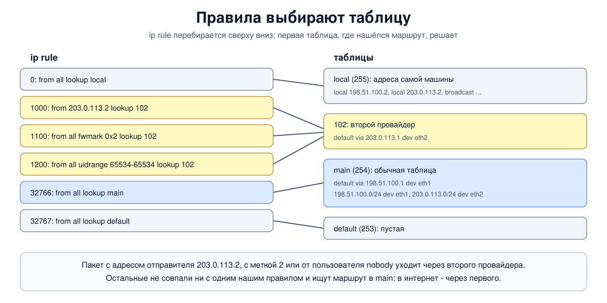

# Урок 48. Policy routing: ip rule, несколько таблиц, fwmark

Обычная маршрутизация (урок 26) смотрит только на адрес назначения: ищет в таблице маршрутов самое длинное совпадение префикса - и всё. Этого хватает, пока у машины один выход в мир. Но если у неё два провайдера, если часть трафика должна идти через VPN, а часть напрямую, если трафик одной программы или одного пользователя нужно пустить другим путём, - одного адреса назначения мало. Linux умеет выбирать маршрут и по другим признакам: адресу отправителя, метке пакета, входящему интерфейсу, пользователю, порту. Это называется **маршрутизацией по правилам** (policy routing), и устроена она из двух частей: нескольких таблиц маршрутов и списка правил, которые выбирают, в какой таблице искать.

Учебники по сетям этот механизм Linux не описывают; источник - документация iproute2 (`man ip-rule`, `man ip-route`), ссылки в конце урока.

## Несколько таблиц маршрутов

Таблица, которую показывает `ip route`, - лишь одна из многих. В Linux таблиц может быть очень много (номер - 32-битное число), и у трёх есть имена:

- **local** (255) - адреса самой машины и широковещательные адреса её сетей. Ядро заполняет её само при добавлении адреса (урок 21): именно по ней ядро понимает, что пакет адресован ему и наружу его отправлять не надо;
- **main** (254) - обычная таблица, её показывает `ip route` без уточнений и в неё по умолчанию добавляет `ip route add`;
- **default** (253) - пустая, запасная.

Остальные таблицы создаются просто: достаточно добавить в неё маршрут, `ip route add ... table 102`. Номерам можно дать имена в файле `/etc/iproute2/rt_tables` или в отдельном файле `/etc/iproute2/rt_tables.d/ИМЯ.conf`, например `102 isp2`, и писать `table isp2`. В новых версиях iproute2 исходный файл лежит в `/usr/share/iproute2/rt_tables`, а каталог `/etc/iproute2` создают сами, если он нужен.

## Правила

Какую таблицу смотреть, решают **правила** (routing policy database, RPDB) - список, который показывает `ip rule`. У каждого правила есть приоритет (меньше - раньше), условие и действие. По умолчанию правил три:

```
0:      from all lookup local
32766:  from all lookup main
32767:  from all lookup default
```

То есть для любого пакета сначала смотрится local, потом main, потом default. Ядро перебирает правила по порядку: если условие совпало, ищет маршрут в указанной таблице; нашёлся - поиск окончен (маршрут-отказ тоже считается найденным; исключение - тип `throw`, который как раз велит перейти к следующему правилу), не нашёлся - переходит к следующему правилу. Поэтому таблица в правиле может содержать хоть один маршрут: всё остальное найдётся дальше, в main.

Условия (их можно сочетать в одном правиле):

- `from ПРЕФИКС`, `to ПРЕФИКС` - адрес отправителя или получателя;
- `iif ИНТЕРФЕЙС`, `oif ИНТЕРФЕЙС` - откуда пришёл пакет или через какой интерфейс программа просит его отправить;
- `fwmark МЕТКА[/МАСКА]` - метка пакета (о ней ниже);
- `uidrange ОТ-ДО` - пользователь, от имени которого работает программа (для пересылаемых пакетов ядро считает uid равным 0, поэтому диапазон с 0 захватит и их);
- `ipproto`, `sport`, `dport` - протокол и порты;
- `tos` - поле типа обслуживания.

Действие обычно `lookup ТАБЛИЦА`, но бывают и `blackhole`, `unreachable`, `prohibit` - те же отказы, что у маршрутов (урок 45), только для целого класса пакетов. Есть и хитрые возможности: например, `suppress_prefixlength 0` велит не принимать из таблицы маршрут по умолчанию - на этом построена настройка `wg-quick` у WireGuard, чтобы весь трафик шёл в туннель, а конкретные маршруты из main продолжали работать.



Проверить, что получится, помогает `ip route get` с теми же условиями: `ip route get АДРЕС from ОТПРАВИТЕЛЬ`, `... mark 2`, `... uid 1000`, `... iif eth0`. Если маршрут взят не из main, ответ показывает и таблицу (`table 102`).

## Два провайдера: зачем нужен выбор по отправителю

Самая частая задача - машина с двумя провайдерами. У неё два адреса: `198.51.100.2` от первого и `203.0.113.2` от второго - и, как обычно, один маршрут по умолчанию, скажем через первого. Пока соединения начинает сама машина, всё работает: пакеты уходят через первого провайдера с его адресом. Но если кто-то обратится к машине по адресу второго провайдера, ответ найдёт в таблице main маршрут по умолчанию и уйдёт **через первого провайдера с адресом второго**.

Первый провайдер видит пакет с чужим адресом отправителя. Добросовестный провайдер такие пакеты не пропускает: это фильтрация поддельных адресов отправителя (BCP 38, урок 25). Один из способов её сделать - проверка обратного пути, в Linux `rp_filter`: её мы и включим у провайдеров в опыте. Пакет пропадает, соединение не устанавливается.

Решение - отдельная таблица для второго провайдера с его маршрутом по умолчанию и правило "всё, что отправлено с адреса второго провайдера, ищи в этой таблице":

```
ip route add default via 203.0.113.1 dev eth2 table 102
ip rule add from 203.0.113.2 table 102 priority 1000
```

Если на самой машине включена строгая проверка обратного пути (`rp_filter = 1`), без такого правила она отбросит уже входящий пакет на адрес второго провайдера; правило `from` исправляет и это.

## fwmark: метка пакета

**fwmark** - число, которое ядро хранит рядом с пакетом (в sk_buff, урок 44) и которое не уходит в сеть. Его ставят:

- файервол: в nftables `meta mark set 2`, в iptables действие `MARK` (блок 6). Так можно пометить трафик по любому признаку, который видит файервол, - порту, протоколу, состоянию соединения;
- сама программа: опция сокета `SO_MARK` (нужно право `CAP_NET_ADMIN` или `CAP_NET_RAW`). Её используют VPN-клиенты, чтобы их собственные зашифрованные пакеты не попадали обратно в туннель.

Правило `fwmark 2 table 102` отправляет помеченные пакеты в свою таблицу. Тонкость: когда метку ставит файервол на исходящем пакете (в iptables - в таблице mangle, в nftables - в цепочке типа route), ядро повторно выбирает маршрут, но адрес отправителя уже выбран по первому поиску - поэтому в таких схемах обычно добавляют ещё и замену адреса отправителя (NAT, блок 6). Метка на сокете стоит до соединения, и ядро сразу выбирает и маршрут, и адрес отправителя с её учётом.

## Как это увидеть в Linux

Четыре пространства имён: узел `h` с двумя провайдерами - `i1` (сеть `198.51.100.0/24`) и `i2` (сеть `203.0.113.0/24`), а за обоими провайдерами - сервер `s` с адресом `192.0.2.10`. Провайдеры пересылают пакеты и, как положено, проверяют обратный путь. Сервер отвечает каждому клиенту, с какого адреса тот пришёл. Посмотрим на исходные правила и таблицы, на сломанное соединение с адреса второго провайдера, починим его второй таблицей и правилом, а потом пустим через второго провайдера трафик с меткой и трафик одного пользователя. Нужны Linux (подойдёт WSL2), права sudo, python3 и iproute2; всё создаётся в пространствах имён `hbh-*` и в конце удаляется.

Создай файл `policy-lab.sh` и запусти `bash policy-lab.sh`:
```
set -u
for c in python3 nstat; do
  command -v $c >/dev/null || { echo "нужен $c: sudo apt install python3 iproute2"; exit 1; }
done
ns="hbh-h hbh-i1 hbh-i2 hbh-s"
# убрать остатки прошлого запуска
for n in $ns; do
  sudo ip netns pids $n 2>/dev/null | xargs -r sudo kill
  sudo ip netns del $n 2>/dev/null
done
d=$(mktemp -d)
chmod 755 "$d"
# узел h подключён к двум провайдерам: i1 (198.51.100.0/24) и i2 (203.0.113.0/24);
# за обоими провайдерами - сервер s с адресом 192.0.2.10
for n in $ns; do sudo ip netns add $n; done
H="sudo ip netns exec hbh-h"
I1="sudo ip netns exec hbh-i1"
I2="sudo ip netns exec hbh-i2"
S="sudo ip netns exec hbh-s"
sudo ip link add eth1 netns hbh-h type veth peer name eth0 netns hbh-i1
sudo ip link add eth2 netns hbh-h type veth peer name eth0 netns hbh-i2
sudo ip link add eth1 netns hbh-s type veth peer name eth1 netns hbh-i1
sudo ip link add eth2 netns hbh-s type veth peer name eth1 netns hbh-i2
$H ip addr add 198.51.100.2/24 dev eth1
$H ip addr add 203.0.113.2/24 dev eth2
$I1 ip addr add 198.51.100.1/24 dev eth0
$I1 ip addr add 100.64.1.1/30 dev eth1
$I2 ip addr add 203.0.113.1/24 dev eth0
$I2 ip addr add 100.64.2.1/30 dev eth1
$S ip addr add 100.64.1.2/30 dev eth1
$S ip addr add 100.64.2.2/30 dev eth2
$S ip addr add 192.0.2.10/32 dev lo
for n in $ns; do
  for i in lo eth0 eth1 eth2; do sudo ip netns exec $n ip link set $i up 2>/dev/null; done
done
for n in hbh-i1 hbh-i2; do
  sudo ip netns exec $n sysctl -qw net.ipv4.ip_forward=1
  # провайдер не пропускает пакеты с чужими адресами отправителя (проверка обратного пути)
  sudo ip netns exec $n sysctl -qw net.ipv4.conf.all.rp_filter=1 net.ipv4.conf.eth0.rp_filter=1
done
$I1 ip route add 192.0.2.10 via 100.64.1.2
$I2 ip route add 192.0.2.10 via 100.64.2.2
$S ip route add 198.51.100.0/24 via 100.64.1.1
$S ip route add 203.0.113.0/24 via 100.64.2.1
$H ip route add default via 198.51.100.1          # основной провайдер - i1
# сервер на s: отвечает, с какого адреса пришло соединение
cat > "$d/whoami.py" <<'EOF'
import socket
l = socket.socket(); l.setsockopt(socket.SOL_SOCKET, socket.SO_REUSEADDR, 1)
l.bind(("0.0.0.0", 7000)); l.listen()
while True:
    c, peer = l.accept(); c.sendall(f"server sees you as {peer[0]}".encode()); c.close()
EOF
# клиент: можно привязать к адресу (src) или поставить метку на сокет (mark)
cat > "$d/client.py" <<'EOF'
import socket, sys
s = socket.socket(); s.settimeout(1.5)
for arg in sys.argv[1:]:
    k, v = arg.split("=")
    if k == "src": s.bind((v, 0))
    if k == "mark": s.setsockopt(socket.SOL_SOCKET, socket.SO_MARK, int(v))
try:
    s.connect(("192.0.2.10", 7000)); print(s.recv(100).decode())
except OSError as e:
    print("failed:", e.strerror or e)
EOF
chmod 644 "$d"/*.py
$S python3 "$d/whoami.py" &
sleep 0.5
echo '--- 1. rules and tables on h at the start'
$H ip rule show
echo 'table main:'
$H ip route show table main
echo 'table local (first lines):'
$H ip route show table local | head -4
echo '--- 2. one default route: the address of the second provider does not work'
$H ip route get 192.0.2.10 from 198.51.100.2 | head -1
$H ip route get 192.0.2.10 from 203.0.113.2 | head -1
echo -n 'connection from 198.51.100.2: '; $H python3 "$d/client.py" src=198.51.100.2
echo -n 'connection from 203.0.113.2: '; $H python3 "$d/client.py" src=203.0.113.2
echo "dropped by i1 as a foreign source: $($I1 nstat -asz TcpExtIPReversePathFilter | awk '/ReversePath/ {print $2}')"
echo '--- 3. a second table and a rule: what comes from the address of i2 goes via i2'
$H ip route add default via 203.0.113.1 dev eth2 table 102
$H ip rule add from 203.0.113.2 table 102 priority 1000
$H ip rule show
$H ip route get 192.0.2.10 from 203.0.113.2 | head -1
echo -n 'connection from 203.0.113.2: '; $H python3 "$d/client.py" src=203.0.113.2
echo '--- 4. fwmark: the program marks its socket, the rule sends it via i2'
$H ip rule add fwmark 2 table 102 priority 1100
$H ip route get 192.0.2.10 mark 2 | head -1
echo -n 'no mark: '; $H python3 "$d/client.py"
echo -n 'mark 2:  '; $H python3 "$d/client.py" mark=2
echo '--- 5. by user: everything from uid 65534 (nobody) goes via i2'
$H ip rule add uidrange 65534-65534 table 102 priority 1200
echo -n 'root:    '; $H python3 "$d/client.py"
echo -n 'nobody:  '; $H sudo -u nobody python3 "$d/client.py"
echo '--- 6. the final rule list'
$H ip rule show
echo '--- cleanup'
for n in $ns; do
  sudo ip netns pids $n 2>/dev/null | xargs -r sudo kill
  sudo ip netns del $n
done
rm -rf "$d"
ip netns list | grep -cE '^hbh-(h|i1|i2|s)( |$)'
```

Вот что получилось на нашем сервере:
```
--- 1. rules and tables on h at the start
0:	from all lookup local
32766:	from all lookup main
32767:	from all lookup default
table main:
default via 198.51.100.1 dev eth1 
198.51.100.0/24 dev eth1 proto kernel scope link src 198.51.100.2 
203.0.113.0/24 dev eth2 proto kernel scope link src 203.0.113.2 
table local (first lines):
local 127.0.0.0/8 dev lo proto kernel scope host src 127.0.0.1 
local 127.0.0.1 dev lo proto kernel scope host src 127.0.0.1 
broadcast 127.255.255.255 dev lo proto kernel scope link src 127.0.0.1 
local 198.51.100.2 dev eth1 proto kernel scope host src 198.51.100.2 
--- 2. one default route: the address of the second provider does not work
192.0.2.10 from 198.51.100.2 via 198.51.100.1 dev eth1 uid 0 
192.0.2.10 from 203.0.113.2 via 198.51.100.1 dev eth1 uid 0 
connection from 198.51.100.2: server sees you as 198.51.100.2
connection from 203.0.113.2: failed: timed out
dropped by i1 as a foreign source: 2
--- 3. a second table and a rule: what comes from the address of i2 goes via i2
0:	from all lookup local
1000:	from 203.0.113.2 lookup 102
32766:	from all lookup main
32767:	from all lookup default
192.0.2.10 from 203.0.113.2 via 203.0.113.1 dev eth2 table 102 uid 0 
connection from 203.0.113.2: server sees you as 203.0.113.2
--- 4. fwmark: the program marks its socket, the rule sends it via i2
192.0.2.10 via 203.0.113.1 dev eth2 table 102 src 203.0.113.2 mark 2 uid 0 
no mark: server sees you as 198.51.100.2
mark 2:  server sees you as 203.0.113.2
--- 5. by user: everything from uid 65534 (nobody) goes via i2
root:    server sees you as 198.51.100.2
nobody:  server sees you as 203.0.113.2
--- 6. the final rule list
0:	from all lookup local
1000:	from 203.0.113.2 lookup 102
1100:	from all fwmark 0x2 lookup 102
1200:	from all uidrange 65534-65534 lookup 102
32766:	from all lookup main
32767:	from all lookup default
--- cleanup
0
```

Разберём.

**Шаг 1: исходное состояние.** Три правила по умолчанию: local, main, default. В main - маршрут по умолчанию через первого провайдера и две подключённые сети, которые ядро добавило вместе с адресами. В local - адреса самой машины (`local 198.51.100.2`), включая loopback, и широковещательные адреса.

**Шаг 2: один маршрут по умолчанию.** `ip route get` показывает: и с адреса первого провайдера, и с адреса второго пакет уйдёт через `198.51.100.1`, то есть через первого. С адресом первого соединение работает, сервер видит `198.51.100.2`. С адресом второго - таймаут: `i1` отбросил пакеты с чужим адресом отправителя, счётчик проверки обратного пути на нём - 2 (первый SYN и его повтор через секунду, урок 37).

**Шаг 3: вторая таблица и правило.** В списке правил появилось `1000: from 203.0.113.2 lookup 102`, и `ip route get` теперь отвечает `via 203.0.113.1 dev eth2 table 102`: маршрут взят из таблицы 102. Соединение с адреса второго провайдера проходит, сервер видит `203.0.113.2`. Привязка клиента к адресу даёт тот же эффект, что ответ сервера с этого адреса: пакеты уходят с адресом второго провайдера. На практике в такую таблицу кладут и маршрут к подключённой сети провайдера, а не только маршрут по умолчанию.

**Шаг 4: метка.** Правило `fwmark 0x2 lookup 102` (ip показывает метку в шестнадцатеричном виде). `ip route get ... mark 2` - через второго провайдера, и заодно выбран адрес отправителя `src 203.0.113.2`. Программа без метки, не привязанная к адресу, идёт через первого провайдера, а та же программа с меткой 2 на сокете - через второго, с его адресом.

**Шаг 5: по пользователю.** Правило `uidrange 65534-65534 lookup 102`: всё, что отправляют программы пользователя nobody, идёт через второго провайдера. Тот же клиент от root ушёл через первого, от nobody - через второго. Так, например, пускают в туннель трафик только одной службы, запущенной от своего пользователя.

**Шаг 6: итоговый список.** Правила стоят по возрастанию приоритета, между local (0) и main (32766). Пакет, который не подошёл ни под одно наше правило, как и раньше, найдёт маршрут в main.

В конце `0`: пространства имён удалены.

Правила и таблицы, добавленные командой `ip`, как и маршруты, не переживают перезагрузку. Постоянно их задают в настройках системы: в netplan - разделы `routes` с полем `table` и `routing-policy`, в systemd-networkd - `[RoutingPolicyRule]`.

## Итог

- Policy routing выбирает маршрут не только по адресу назначения: по отправителю, метке, интерфейсу, пользователю, протоколу и портам.
- Таблиц маршрутов много: local (адреса машины), main (обычная), default и любые свои по номеру.
- Правила `ip rule` перебираются по приоритету; совпало условие - ищем в таблице; маршрута там нет - идём к следующему правилу.
- С двумя провайдерами без правила `from` ответы с адреса второго уходят через первого и отбрасываются как поддельные; лечится своей таблицей и правилом по отправителю.
- fwmark ставит файервол или программа (`SO_MARK`); правило `fwmark` направляет помеченный трафик в свою таблицу. Проверять всё удобно через `ip route get ... from / mark / uid`.

## Что почитать

- `man 8 ip-rule`, `man 8 ip-route` (таблицы, `ip route get`), `man 7 socket` (`SO_MARK`).
- Документация ядра: Documentation/networking/ip-sysctl.rst (`rp_filter`).
- RFC 2827 (BCP 38): фильтрация поддельных адресов отправителя у провайдеров.
