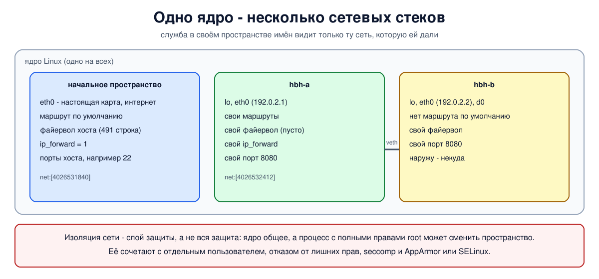

# Урок 49. Network namespaces

С урока 16, где мы собрали учебный коммутатор, почти каждый опыт курса начинался с `ip netns add`. Мы пользовались пространствами имён сети как готовыми отдельными машинами. Теперь разберёмся, что это такое: как ядро Linux умеет держать несколько независимых сетевых стеков сразу, как этим управлять и почему это не только удобный инструмент для опытов, но и средство защиты.

Учебники по сетям этот механизм не описывают; источники - `man 7 network_namespaces`, `man 8 ip-netns` и документация ядра, ссылки в конце урока.

## Что такое пространство имён сети

**Пространство имён сети** (network namespace) - это отдельная копия всего сетевого стека ядра. У каждого пространства свои:

- сетевые интерфейсы, включая собственный loopback;
- адреса, таблицы маршрутов и правила (уроки 45 и 48), таблица соседей;
- правила файервола netfilter и таблица отслеживания соединений (блок 6);
- сокеты и порты: один и тот же порт может быть занят в каждом пространстве своей программой;
- большинство параметров `sysctl` вида `net.*` и содержимое `/proc/net`.

Ядро одно, а стеков много, и они ничего не знают друг о друге. Каждый процесс находится ровно в одном пространстве имён сети, дочерние процессы наследуют его от родителя. При загрузке системы есть одно, начальное, пространство - в нём живут все обычные программы.

Сеть - один из нескольких видов пространств имён Linux. Есть ещё пространства для точек монтирования, номеров процессов, имени узла, пользователей и другие. **Контейнер** (Docker, Kubernetes) - это процесс, для которого создан набор таких пространств сразу, плюс ограничения ресурсов. Сетевая часть контейнера обычно устроена так же, как в наших опытах: своё пространство имён сети и пара veth, в Docker по умолчанию - к мосту на хосте (урок 50).

Новое пространство имён сети создаётся почти пустым: в нём только интерфейс `lo`, и тот выключен (если на хосте загружены модули туннелей, появятся и их служебные интерфейсы вроде `tunl0` или `sit0`, тоже выключенные). Ни адресов, ни маршрутов, ни правил файервола.

## Управление: ip netns и другие

- `ip netns add ИМЯ` - создать пространство с именем. Имя - это файл в `/run/netns/` (в man написано `/var/run/netns`, это тот же каталог), к которому привязано пространство; благодаря ему пространство существует, даже когда в нём не работает ни одна программа;
- `ip netns list` - список; `ip netns del ИМЯ` убирает имя, а само пространство исчезнет, когда в нём не останется процессов (поэтому наши скрипты сначала их завершают);
- `ip netns exec ИМЯ КОМАНДА` - запустить программу внутри. Заодно `ip netns exec` подставляет файлы из `/etc/netns/ИМЯ/` вместо одноимённых из `/etc` - так у пространства может быть, например, свой `resolv.conf`;
- `ip -n ИМЯ ...` - короткая запись для команд самого `ip`: `ip -n hbh-a route` то же, что `ip netns exec hbh-a ip route`;
- `ip netns pids ИМЯ` - какие процессы в пространстве, `ip netns identify PID` - в каком пространстве процесс;
- `unshare --net КОМАНДА` - запустить программу в новом безымянном пространстве; оно исчезнет вместе с последним его процессом. Войти в пространство уже работающего процесса позволяет `nsenter --net=/proc/PID/ns/net`.

Принадлежность процесса видна в `/proc/PID/ns/net`: это ссылка вида `net:[4026531840]`, и число - номер пространства. У процессов одного пространства номер одинаковый.

## Интерфейсы и параметры

**Интерфейс находится ровно в одном пространстве.** Переместить его можно командой `ip link set ИМЯ netns ПРОСТРАНСТВО` (кроме некоторых, привязанных к своему пространству, например `lo` и мостов). Так можно отдать пространству и настоящую сетевую карту - тогда начальное пространство её больше не видит. Пару veth обычно создают сразу с концами в двух разных пространствах, как в наших опытах. При удалении пространства его виртуальные интерфейсы уничтожаются, а физические возвращаются в начальное пространство.

**Большинство параметров `net.*` свои у каждого пространства**: включить пересылку пакетов в одном пространстве - не значит включить её на всей машине. Есть тонкость с начальными значениями: при создании пространства параметры интерфейсов IPv4 (`net.ipv4.conf.all.*` и `net.ipv4.conf.default.*`, к ним относится и `net.ipv4.ip_forward`) копируются из начального пространства, а такие же параметры IPv6 ставятся по умолчанию (это определяет `net.core.devconf_inherit_init_net`). Большинство остальных параметров `net.*` новое пространство получает со значениями по умолчанию. Поэтому новое пространство на нашем сервере, где пересылка включена (её включил Docker), тоже получает включённую пересылку.

## Как это увидеть в Linux

Создадим два пространства имён и посмотрим: что в новом пространстве, чьи у него параметры и файервол, как две программы занимают один порт, как интерфейс переезжает из пространства в пространство, как найти пространство процесса и как выглядит безымянное пространство от `unshare`. В конце - что пространство без связей с другими не может отправить пакет никуда. Нужны Linux (подойдёт WSL2), права sudo, python3 и nftables (`sudo apt install python3 iproute2 iputils-ping nftables util-linux`). На хосте скрипт только читает (`sysctl -n`, `nft list ruleset`); всё остальное создаётся в пространствах имён `hbh-*` и в конце удаляется.

Создай файл `netns-lab.sh` и запусти `bash netns-lab.sh`:
```
set -u
for c in python3 ping ss nft unshare; do
  command -v $c >/dev/null || { echo "нужен $c: sudo apt install python3 iproute2 iputils-ping nftables util-linux"; exit 1; }
done
# убрать остатки прошлого запуска
for n in hbh-a hbh-b; do
  sudo ip netns pids $n 2>/dev/null | xargs -r sudo kill
  sudo ip netns del $n 2>/dev/null
done
d=$(mktemp -d)
chmod 755 "$d"
echo '--- 1. a new namespace is empty'
sudo ip netns add hbh-a
sudo ip netns add hbh-b
ip netns list | grep -E '^hbh-' | sort
echo 'interfaces in hbh-a:'
sudo ip -n hbh-a link
echo "routes in hbh-a: $(sudo ip -n hbh-a route | wc -l)"
echo -n 'ping 127.0.0.1 while lo is down: '
sudo ip netns exec hbh-a ping -c 1 -W 1 127.0.0.1 2>&1 | tail -1
sudo ip -n hbh-a link set lo up
echo -n 'after "ip link set lo up":         '
sudo ip netns exec hbh-a ping -c 1 -W 1 127.0.0.1 | grep -oE '1 received'
echo '--- 2. own settings and firewall'
echo "ip_forward: host $(sysctl -n net.ipv4.ip_forward), hbh-a $(sudo ip netns exec hbh-a sysctl -n net.ipv4.ip_forward)"
# поменяем значение в hbh-a на противоположное хостовому
sudo ip netns exec hbh-a sysctl -qw net.ipv4.ip_forward=$((1 - $(sysctl -n net.ipv4.ip_forward)))
echo "after changing it in hbh-a: host $(sysctl -n net.ipv4.ip_forward), hbh-a $(sudo ip netns exec hbh-a sysctl -n net.ipv4.ip_forward)"
echo "nftables ruleset: host $(sudo nft list ruleset | wc -l) lines, hbh-a $(sudo ip netns exec hbh-a nft list ruleset | wc -l) lines"
echo '--- 3. the same port in two namespaces at once'
cat > "$d/srv.py" <<'EOF'
import socket, time
s = socket.socket(); s.bind(("0.0.0.0", 8080)); s.listen(); time.sleep(60)
EOF
sudo ip -n hbh-b link set lo up
sudo ip netns exec hbh-a python3 "$d/srv.py" &
sudo ip netns exec hbh-b python3 "$d/srv.py" &
sleep 0.5
for n in hbh-a hbh-b; do
  echo "$n: $(sudo ip netns exec $n ss -tlnH 'sport = :8080' | awk '{print $1, $4}')"
done
echo '--- 4. an interface lives in exactly one namespace'
sudo ip -n hbh-a link add d0 type dummy
echo "d0 in hbh-a: $(sudo ip -n hbh-a -br link show d0 | awk '{print $1}')"
sudo ip -n hbh-a link set d0 netns hbh-b
echo "after moving: hbh-a $(sudo ip -n hbh-a -br link show d0 2>&1 | head -1), hbh-b $(sudo ip -n hbh-b -br link show d0 | awk '{print $1}')"
echo '--- 5. processes and their namespace'
sudo ip netns exec hbh-a sleep 60 &
sleep 0.5
pid=$(sudo ip netns pids hbh-a | xargs ps -o pid=,comm= -p | awk '$2 == "sleep" {print $1}')
echo "sleep runs in: $(sudo ip netns identify $pid)"
echo "its network namespace: $(sudo readlink /proc/$pid/ns/net), mine: $(readlink /proc/self/ns/net)"
echo "processes in hbh-a: $(sudo ip netns pids hbh-a | xargs ps -o comm= -p | sort | uniq -c | xargs)"
echo -n 'an unnamed namespace (unshare): '
sudo unshare --net ip -br link | awk '{print $1, $2}' | xargs
echo '--- 6. isolation: no link - no network'
echo -n 'hbh-b -> 192.0.2.1: '
sudo ip netns exec hbh-b ping -c 1 -W 1 192.0.2.1 2>&1 | tail -1
sudo ip link add eth0 netns hbh-a type veth peer name eth0 netns hbh-b
sudo ip -n hbh-a addr add 192.0.2.1/24 dev eth0
sudo ip -n hbh-b addr add 192.0.2.2/24 dev eth0
sudo ip -n hbh-a link set eth0 up
sudo ip -n hbh-b link set eth0 up
echo -n 'after connecting a veth pair:  '
sudo ip netns exec hbh-b ping -c 1 -W 1 192.0.2.1 | grep -oE '1 received'
echo -n 'hbh-b -> 1.1.1.1 (no default route): '
sudo ip netns exec hbh-b ping -c 1 -W 1 1.1.1.1 2>&1 | tail -1
echo '--- cleanup'
for n in hbh-a hbh-b; do
  sudo ip netns pids $n 2>/dev/null | xargs -r sudo kill
  sudo ip netns del $n
done
rm -rf "$d"
ip netns list | grep -cE '^hbh-(a|b)( |$)'
```

Вот что получилось на нашем сервере:
```
--- 1. a new namespace is empty
hbh-a
hbh-b
interfaces in hbh-a:
1: lo: <LOOPBACK> mtu 65536 qdisc noop state DOWN mode DEFAULT group default qlen 1000
    link/loopback 00:00:00:00:00:00 brd 00:00:00:00:00:00
routes in hbh-a: 0
ping 127.0.0.1 while lo is down: ping: connect: Network is unreachable
after "ip link set lo up":         1 received
--- 2. own settings and firewall
ip_forward: host 1, hbh-a 1
after changing it in hbh-a: host 1, hbh-a 0
nftables ruleset: host 491 lines, hbh-a 0 lines
--- 3. the same port in two namespaces at once
hbh-a: LISTEN 0.0.0.0:8080
hbh-b: LISTEN 0.0.0.0:8080
--- 4. an interface lives in exactly one namespace
d0 in hbh-a: d0
after moving: hbh-a Device "d0" does not exist., hbh-b d0
--- 5. processes and their namespace
sleep runs in: hbh-a
its network namespace: net:[4026532412], mine: net:[4026531840]
processes in hbh-a: 1 python3 1 sleep
an unnamed namespace (unshare): lo DOWN
--- 6. isolation: no link - no network
hbh-b -> 192.0.2.1: ping: connect: Network is unreachable
after connecting a veth pair:  1 received
hbh-b -> 1.1.1.1 (no default route): ping: connect: Network is unreachable
--- cleanup
0
```

Разберём.

**Шаг 1: новое пространство пусто.** Только `lo`, и тот `DOWN`, маршрутов ноль. Даже `127.0.0.1` недоступен (`Network is unreachable`). Пока `lo` выключен, у него нет адреса `127.0.0.1`: ядро назначает его при включении `lo`, и только тогда в таблице local (урок 48) появляется маршрут к нему. После `ip link set lo up` ping до себя проходит. Об этом легко забыть: многие программы общаются сами с собой через `127.0.0.1` и в новом пространстве без включённого `lo` не работают.

**Шаг 2: свои параметры и свой файервол.** На нашем сервере пересылка на хосте включена, и новое пространство унаследовало `1` (в WSL2, где на хосте `0`, было `0`). Значение в `hbh-a` мы поменяли на противоположное - на хосте оно осталось прежним. На хосте в правилах nftables 491 строка (среди них правила, которые добавил Docker для контейнера бота), в `hbh-a` - ноль: правил файервола в новом пространстве нет вообще.

**Шаг 3: один порт дважды.** Две программы слушают `0.0.0.0:8080` одновременно, каждая в своём пространстве, и никакой ошибки "адрес уже занят". `ss` в каждом пространстве видит только свой сокет.

**Шаг 4: переезд интерфейса.** Интерфейс `d0` создан в `hbh-a`; после `ip link set d0 netns hbh-b` в `hbh-a` его больше нет (`Device "d0" does not exist`), а в `hbh-b` он есть.

**Шаг 5: процессы.** `ip netns identify` по номеру процесса нашёл его пространство - `hbh-a`. У процесса `sleep` номер пространства `4026532412`, у самого скрипта - `4026531840`, это начальное пространство (номер зависит от системы: в WSL2 был `4026531833`). В `hbh-a` работают два процесса: наш сервер из шага 3 и `sleep`. А `unshare --net` создал безымянное пространство, в котором, как и положено новому, только выключенный `lo`.

**Шаг 6: нет связи - нет сети.** Из `hbh-b` до `192.0.2.1` - `Network is unreachable`: в пространстве нет ни одного маршрута туда. После того как мы соединили пространства парой veth и дали адреса, ping проходит. Но до `1.1.1.1` по-прежнему `Network is unreachable`: маршрута по умолчанию нет, и программа в `hbh-b` может говорить только с `hbh-a`, а в интернет её пакеты сами не уйдут.

В конце `0`: пространства имён удалены.



## Безопасность: изоляция как средство защиты

Опыт показывает главное свойство пространства имён с точки зрения защиты: **программа в нём видит только ту сеть, которую ей дали**. Отсюда принцип наименьших привилегий для сети - службе дают ровно те связи, которые ей нужны, и не больше:

- служба не видит интерфейсы хоста и может записать анализатором только то, что приходит на её собственный интерфейс (урок 47);
- не может занять порты хоста и не мешает другим службам;
- у неё свои правила файервола, которые настраиваются отдельно от правил хоста;
- без маршрута по умолчанию служба, даже взломанная, не сможет сама связаться с внешним миром - ей некуда отправить пакет. Это работает, пока у службы нет прав менять сетевые настройки в своём пространстве (`CAP_NET_ADMIN`), а соседи, с которыми её связали, не передают её данные дальше - ни пересылкой пакетов, ни как посредник (прокси, резолвер DNS). Если связь нужна, её дают через пару veth и узкие правила файервола.

Так устроена изоляция в контейнерах; systemd умеет запускать службу в собственном пустом пространстве (параметр `PrivateNetwork=yes` - у службы будет только `lo`); браузеры на Linux используют пространства имён в песочнице для своих внутренних процессов.

Но у изоляции есть пределы, и их важно помнить:

- **ядро одно на всех.** Уязвимость в ядре (не обязательно в сетевом стеке) может позволить выйти за пределы пространства, поэтому ядро нужно обновлять;
- **пространство имён сети не ограничивает права.** Процесс с правами root в начальном пространстве пользователей может перейти в другое пространство или изменить настройки. Поэтому изоляцию сети сочетают с понижением прав: запуск от отдельного пользователя, пространства имён пользователей, отказ от лишних возможностей (capabilities), ограничение системных вызовов (seccomp), профили AppArmor или SELinux;
- **сеть - не единственный путь.** Если у службы есть доступ к общим файлам или сокетам Unix хоста (например, к сокету Docker: сокеты Unix в файловой системе пространство имён сети не разделяет), изоляция сети её не остановит.

Пространство имён сети - один из слоёв защиты, а не вся защита целиком.

## Итог

- Пространство имён сети - отдельная копия сетевого стека: интерфейсы, адреса, маршруты, соседи, файервол, сокеты, параметры `net.*`. Ядро одно, стеков много.
- Новое пространство почти пустое: только выключенный `lo`. Каждый процесс находится в одном пространстве (`/proc/PID/ns/net`), интерфейс - тоже в одном и может переезжать.
- Управление: `ip netns add/exec/del/pids/identify`, `ip -n`, `unshare --net`, `nsenter`. Параметры интерфейсов IPv4, включая `ip_forward`, новое пространство копирует из начального.
- Контейнер - процесс в наборе пространств имён; его сеть - пространство имён и пара veth.
- Изоляция сети - сильный слой защиты (служба видит только свою сеть, без маршрута наружу не может связаться с миром), но ядро общее, поэтому её сочетают с понижением прав и другими ограничениями.

## Что почитать

- `man 7 network_namespaces`, `man 7 namespaces`, `man 8 ip-netns`, `man 1 unshare`, `man 1 nsenter`.
- Документация ядра: Documentation/admin-guide/sysctl/net.rst (`devconf_inherit_init_net`).
- `man 5 systemd.exec` (`PrivateNetwork=`).
