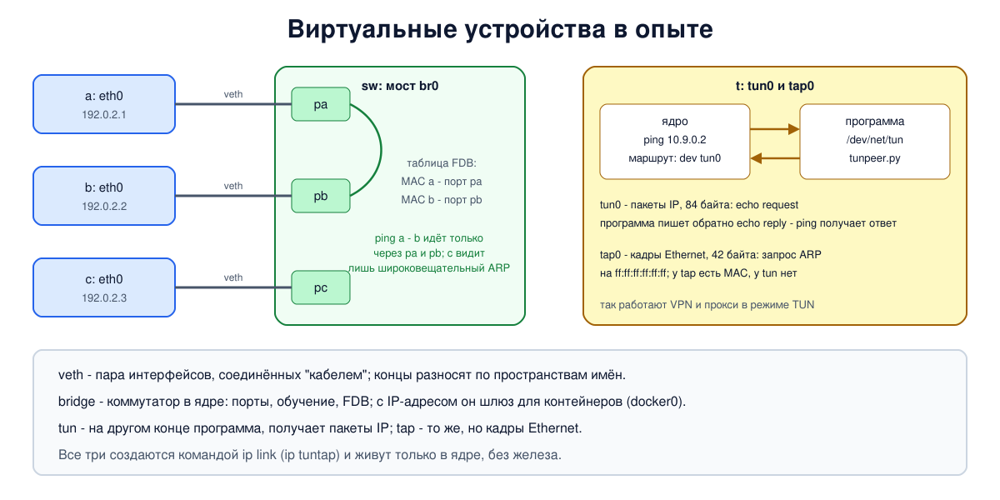

# Урок 50. Виртуальные устройства: veth, bridge, tun/tap

Сетевой интерфейс в Linux не обязан быть платой с разъёмом. Ядро умеет создавать интерфейсы, за которыми нет никакого железа: виртуальный кабель между двумя пространствами имён, коммутатор внутри ядра, интерфейс, на другом конце которого - обычная программа. Из этих деталей собраны контейнерные сети, виртуальные машины, VPN и прокси с режимом TUN, о которых пойдёт речь в последних блоках курса. В этом уроке - три главных виртуальных устройства: veth, bridge и tun/tap.

Учебники по сетям эти устройства Linux не описывают; источники - `man 8 ip-link`, `man 8 bridge`, `man 8 ip-tuntap` и документация ядра, ссылки в конце урока.

## veth: виртуальный кабель

**veth** (virtual Ethernet) - пара интерфейсов, соединённых друг с другом: всё, что отправлено в один конец, выходит из другого. Пары создаются только целиком и удаляются тоже целиком: удалишь один конец - исчезнет и второй. Концы можно разнести по разным пространствам имён (урок 49), и тогда пара работает как кабель между двумя "компьютерами". Именно так мы соединяли узлы почти во всех опытах курса:

```
ip link add eth0 netns hbh-a type veth peer name eth0 netns hbh-b
```

Второй конец пары виден в имени: `eth0@if2` - "этот интерфейс, его пара - интерфейс номер 2" (в другом пространстве номер ищут там; если оба конца в одном пространстве, вместо номера будет имя: `veth0@veth1`). Тот же номер показывает `ethtool -S eth0` в строке `peer_ifindex`.

Так по умолчанию подключён к сети контейнер Docker: один конец пары внутри контейнера под именем `eth0`, второй - на хосте, с именем вроде `veth3a1f...`, и этот второй конец воткнут в мост.

## bridge: коммутатор внутри ядра

**bridge** (мост) - программный коммутатор, работающий ровно так, как настоящий из урока 16: у него есть порты, он запоминает, за каким портом какой MAC-адрес (таблица FDB), пересылает кадр только в нужный порт, а кадры для неизвестных адресов и широковещательные рассылает во все остальные порты. Портами моста становятся другие интерфейсы - концы veth, настоящие сетевые карты, tap:

```
ip link add br0 type bridge
ip link set pa master br0      # подключить интерфейс pa к мосту как порт
ip link set br0 up
```

Посмотреть на мост помогает команда `bridge`: `bridge link` - порты и их состояние, `bridge fdb` - таблица MAC-адресов. Мост умеет и больше: протокол STP (урок 17, по умолчанию выключен), фильтрацию VLAN (урок 18, `bridge vlan`).

У моста есть важная особенность: он сам тоже интерфейс в сетевом стеке своего пространства имён. Если дать ему IP-адрес, машина становится участником той сети, которую соединяет мост, и может быть шлюзом для неё. Так устроены `docker0` у Docker, `virbr0` у виртуальных машин libvirt, `lxcbr0` у LXC: мост с адресом (у `docker0` по умолчанию `172.17.0.1`), к которому подключены контейнеры или виртуальные машины, а дальше - маршрутизация и преобразование адресов на хосте (блок 6).

## tun и tap: интерфейс, за которым программа

У обычного интерфейса на другом конце - кабель и чужая сетевая карта. У **tun** и **tap** на другом конце - программа. Она открывает специальный файл `/dev/net/tun`, привязывается к интерфейсу и дальше просто читает и пишет:

- всё, что ядро отправляет в интерфейс (по маршруту, как в любой другой), программа **читает** из файла;
- всё, что программа **записывает** в файл, ядро получает так, будто это пришло по сети через этот интерфейс.

Разница между двумя видами:

| | tun | tap |
|---|---|---|
| уровень | сетевой: пакеты IP | канальный: кадры Ethernet |
| MAC-адрес, ARP | нет (`NOARP`, `POINTOPOINT`) | есть |
| можно подключить к мосту | нет | да |
| где используют | VPN (OpenVPN в режиме tun, WireGuard в пространстве пользователя), прокси в режиме TUN (sing-box, Xray и подобные) | виртуальные машины (QEMU подключает к мосту tap), VPN, которым нужен канальный уровень |

Именно tun позволяет VPN-клиенту "перехватить" трафик всей системы, не трогая программы: маршрут ведёт пакеты в tun-интерфейс, VPN-клиент читает их, шифрует и отправляет по обычному сокету на сервер, а ответы, расшифровав, записывает обратно в tun. Для ядра и программ это просто ещё один интерфейс.

Интерфейс создают командой `ip tuntap add dev ИМЯ mode tun` (или `mode tap`); параметр `user` назначает владельца, и программа, запущенная от его имени, сможет привязаться к интерфейсу без прав root. Пока к интерфейсу не привязана ни одна программа, у него нет "несущей": флаг `NO-CARRIER`, и пакеты в него уходят в никуда.

Других виртуальных устройств в Linux много: `dummy` (интерфейс-заглушка: всё, что в него отправлено, пропадает; мы перемещали его в уроке 49), `vlan` (урок 18), `macvlan` и `ipvlan`, туннели `gre`, `vxlan`, `wireguard`. С частью из них встретимся в блоках про туннели и VPN.



## Как это увидеть в Linux

Пять пространств имён: `a`, `b` и `c` - "компьютеры", `sw` - "коммутатор" с мостом `br0`, `t` - машина с интерфейсами tun и tap. Сначала посмотрим на пару veth, потом соберём из моста коммутатор на три порта и проверим, что он выучил адреса и не показывает `c` чужой разговор. Потом создадим `tun0`, и маленькая программа на Python будет сама отвечать на ping, приходящий в этот интерфейс. В конце - то же с `tap0`, чтобы увидеть кадр Ethernet. Чтобы служебные пакеты IPv6 не мешали смотреть, IPv6 в пространствах выключен. Нужны Linux (подойдёт WSL2), права sudo, python3, tcpdump и ethtool (`sudo apt install python3 iproute2 iputils-ping tcpdump ethtool`); всё создаётся в пространствах имён `hbh-*` и в конце удаляется.

Создай файл `devices-lab.sh` и запусти `bash devices-lab.sh`:
```
set -u
for c in python3 ping bridge tcpdump ethtool; do
  command -v $c >/dev/null || { echo "нужен $c: sudo apt install python3 iproute2 iputils-ping tcpdump ethtool"; exit 1; }
done
ns="hbh-a hbh-b hbh-c hbh-sw hbh-t"
# убрать остатки прошлого запуска
for n in $ns; do
  sudo ip netns pids $n 2>/dev/null | xargs -r sudo kill
  sudo ip netns del $n 2>/dev/null
done
d=$(mktemp -d)
chmod 755 "$d"
# IPv6 выключен, чтобы служебные пакеты IPv6 не мешали смотреть
for n in $ns; do
  sudo ip netns add $n; sudo ip -n $n link set lo up
  sudo ip netns exec $n sysctl -qw net.ipv6.conf.all.disable_ipv6=1 net.ipv6.conf.default.disable_ipv6=1
done
echo '--- 1. veth: a pair of interfaces connected by a "cable"'
sudo ip link add eth0 netns hbh-a type veth peer name pa netns hbh-sw
sudo ip -n hbh-a -d link show eth0 | awk 'NR == 1 {print $2, $3} NR == 3 {print "   ", $1}'
echo "    the other end: interface number $(sudo ip netns exec hbh-a ethtool -S eth0 | awk '/peer_ifindex/ {print $2}') in hbh-sw, that is $(sudo ip -n hbh-sw -o link | awk -F': ' -v i="$(sudo ip netns exec hbh-a ethtool -S eth0 | awk '/peer_ifindex/ {print $2}')" '$1 == i {sub(/@.*/, "", $2); print $2}')"
echo '--- 2. bridge: a switch inside the kernel'
sudo ip link add eth0 netns hbh-b type veth peer name pb netns hbh-sw
sudo ip link add eth0 netns hbh-c type veth peer name pc netns hbh-sw
SW="sudo ip netns exec hbh-sw"
$SW ip link add br0 type bridge
for p in pa pb pc; do $SW ip link set $p master br0; $SW ip link set $p up; done
$SW ip link set br0 up
i=1
for n in hbh-a hbh-b hbh-c; do
  sudo ip -n $n addr add 192.0.2.$i/24 dev eth0
  sudo ip -n $n link set eth0 up
  i=$((i + 1))
done
$SW bridge link | awk '{sub(/[@:].*/, "", $2); for (i = 1; i < NF; i++) if ($i == "master" || $i == "state") s = s " " $i " " $(i + 1); print "   ", $2 s; s = ""}'
sleep 2      # дать интерфейсам подняться
echo "MAC addresses: a $(sudo ip -n hbh-a -br link show eth0 | awk '{print $3}'), b $(sudo ip -n hbh-b -br link show eth0 | awk '{print $3}'), c $(sudo ip -n hbh-c -br link show eth0 | awk '{print $3}')"
sudo ip netns exec hbh-c timeout 4 tcpdump -i eth0 -n -l -e 'icmp or arp' 2>/dev/null > "$d/c" &
sleep 1
echo -n 'a -> b: '; sudo ip netns exec hbh-a ping -c 3 -i 0.3 192.0.2.2 | grep -oE '[0-9]+ received'
wait
echo 'learned addresses (bridge fdb, only the dynamic ones):'
$SW bridge fdb show br br0 | grep -vE 'permanent' | awk '{print "   ", $1, "on port", $3}'
echo "what c saw of the a-b conversation: $(grep -c ARP "$d/c") ARP broadcast(s), $(grep -c ICMP "$d/c") ICMP packets"
echo '--- 3. tun: the kernel hands IP packets to a program'
T="sudo ip netns exec hbh-t"
$T ip tuntap add dev tun0 mode tun
$T ip addr add 10.9.0.1/24 dev tun0
$T ip link set tun0 up
$T ip -d link show tun0 | awk 'NR == 1 {print $2, $3, $4, $5} NR == 3 {print "   ", $1, $2, $3}'
# программа на другом конце tun0: читает пакеты, на ICMP echo request отвечает сама
cat > "$d/tunpeer.py" <<'EOF'
import fcntl, os, struct, sys
TUNSETIFF, IFF_TUN, IFF_TAP, IFF_NO_PI = 0x400454ca, 0x0001, 0x0002, 0x1000
name, mode, count = sys.argv[1], sys.argv[2], int(sys.argv[3])
fd = os.open("/dev/net/tun", os.O_RDWR)
fcntl.ioctl(fd, TUNSETIFF, struct.pack("16sH", name.encode(), (IFF_TUN if mode == "tun" else IFF_TAP) | IFF_NO_PI))
def csum(b):
    if len(b) % 2: b += b"\0"
    s = sum(struct.unpack(f"!{len(b) // 2}H", b)); s = (s >> 16) + (s & 0xffff); s += s >> 16
    return ~s & 0xffff
for i in range(count):
    p = os.read(fd, 2048)
    if mode == "tap":
        dst, src, etype = p[:6].hex(":"), p[6:12].hex(":"), p[12:14].hex()
        print(f"   program got a frame of {len(p)} bytes: {src} -> {dst}, type 0x{etype}" + (" (ARP)" if etype == "0806" else ""))
        continue
    ver, proto = p[0] >> 4, p[9]
    src, dst = ".".join(map(str, p[12:16])), ".".join(map(str, p[16:20]))
    print(f"   program got a packet of {len(p)} bytes: IPv{ver}, protocol {proto}, {src} -> {dst}", end="")
    if ver == 4 and proto == 1 and p[20] == 8:          # ICMP echo request: ответить
        hl = (p[0] & 15) * 4
        icmp = bytearray(p[hl:]); icmp[0] = 0; icmp[2:4] = b"\0\0"
        icmp[2:4] = struct.pack("!H", csum(bytes(icmp)))
        os.write(fd, p[:12] + p[16:20] + p[12:16] + p[20:hl] + bytes(icmp))
        print(", answered with echo reply")
    else:
        print()
EOF
$T python3 "$d/tunpeer.py" tun0 tun 2 &
sleep 0.5
$T ping -c 2 -i 0.3 -W 1 10.9.0.2 | grep -E 'bytes from|received'
wait
echo '--- 4. tap: the same, but with Ethernet frames'
$T ip tuntap add dev tap0 mode tap
$T ip addr add 10.8.0.1/24 dev tap0
$T ip link set tap0 up
$T python3 "$d/tunpeer.py" tap0 tap 1 &
sleep 0.5
$T ping -c 1 -W 1 10.8.0.2 >/dev/null 2>&1
wait
echo "    tap0 has a MAC address: $($T ip -br link show tap0 | awk '{print $3}'); tun0 has none: $($T ip -br link show tun0 | awk '{print NF == 3 ? "none" : $3}')"
echo '--- cleanup'
for n in $ns; do
  sudo ip netns pids $n 2>/dev/null | xargs -r sudo kill
  sudo ip netns del $n
done
rm -rf "$d"
ip netns list | grep -cE '^hbh-(a|b|c|sw|t)( |$)'
```

Вот что получилось на нашем сервере:
```
--- 1. veth: a pair of interfaces connected by a "cable"
eth0@if2: <BROADCAST,MULTICAST>
    veth
    the other end: interface number 2 in hbh-sw, that is pa
--- 2. bridge: a switch inside the kernel
    pa master br0 state forwarding
    pb master br0 state forwarding
    pc master br0 state forwarding
MAC addresses: a ee:bc:5f:14:76:18, b fa:84:37:71:13:a1, c a2:64:a1:0e:ec:32
a -> b: 3 received
learned addresses (bridge fdb, only the dynamic ones):
    ee:bc:5f:14:76:18 on port pa
    fa:84:37:71:13:a1 on port pb
what c saw of the a-b conversation: 1 ARP broadcast(s), 0 ICMP packets
--- 3. tun: the kernel hands IP packets to a program
tun0: <NO-CARRIER,POINTOPOINT,MULTICAST,NOARP,UP> mtu 1500
    tun type tun
   program got a packet of 84 bytes: IPv4, protocol 1, 10.9.0.1 -> 10.9.0.2, answered with echo reply
   program got a packet of 84 bytes: IPv4, protocol 1, 10.9.0.1 -> 10.9.0.2, answered with echo reply
64 bytes from 10.9.0.2: icmp_seq=1 ttl=64 time=0.187 ms
64 bytes from 10.9.0.2: icmp_seq=2 ttl=64 time=0.164 ms
2 packets transmitted, 2 received, 0% packet loss, time 310ms
--- 4. tap: the same, but with Ethernet frames
   program got a frame of 42 bytes: e6:3a:b6:5e:9a:ab -> ff:ff:ff:ff:ff:ff, type 0x0806 (ARP)
    tap0 has a MAC address: e6:3a:b6:5e:9a:ab; tun0 has none: none
--- cleanup
0
```

Разберём.

**Шаг 1: veth.** `ip -d link` (подробный вывод) показывает тип `veth`. Имя `eth0@if2` и `peer_ifindex` из `ethtool -S` говорят одно: пара - интерфейс номер 2, и в `hbh-sw` под этим номером `pa`. Флагов `UP` нет: интерфейс ещё не включён.

**Шаг 2: мост.** Три порта `pa`, `pb`, `pc` подключены к `br0` (`master br0`) и пересылают кадры (`state forwarding`). После трёх ping от `a` к `b` мост выучил два адреса: MAC `a` - за портом `pa`, MAC `b` - за портом `pb` (сверь с адресами, напечатанными выше). Адреса `c` в таблице нет: `c` молчал. А что видел `c`: один широковещательный запрос ARP (`a` искал MAC-адрес `b`, урок 24) - и ни одного пакета ICMP. Разговор `a` и `b` мост отправлял только в их порты, ровно как коммутатор в уроке 16. Скрипт убрал из вывода постоянные записи (`grep -v permanent`): кроме выученных, в `bridge fdb` есть постоянные служебные записи - прежде всего MAC-адреса самих портов моста.

**Шаг 3: tun.** У `tun0` флаги `POINTOPOINT` и `NOARP`: MAC-адресов и ARP здесь нет. `NO-CARRIER` - к интерфейсу ещё не привязалась программа. Дальше ping на `10.9.0.2`: по маршруту `10.9.0.0/24 dev tun0` ядро отправило пакеты в `tun0`, и наша программа прочитала их - 84 байта, IPv4, протокол 1 (ICMP), от `10.9.0.1` к `10.9.0.2`. Ни заголовка Ethernet, ни чего-то ещё: ровно пакет IP (без флага `IFF_NO_PI`, который ставит наша программа, ядро добавило бы перед пакетом ещё 4 служебных байта). Программа поменяла местами адреса, превратила запрос в ответ (тип 0), пересчитала контрольную сумму ICMP и записала пакет обратно. Ядро приняло его как пришедший по сети - и ping получил оба ответа. Никакого `10.9.0.2` не существует: "на той стороне" пара десятков строк на Python. Так же, только с шифрованием и пересылкой по сети, работает любой VPN-клиент на tun.

**Шаг 4: tap.** С `tap0` программа получила уже кадр Ethernet: 42 байта, от MAC-адреса `tap0` на широковещательный `ff:ff:ff:ff:ff:ff`, тип `0x0806` - это запрос ARP: прежде чем отправить пакет на `10.8.0.2`, ядро ищет его MAC-адрес, как в любой сети Ethernet. У `tap0` MAC-адрес есть, у `tun0` - нет.

В конце `0`: пространства имён удалены.

## Итог

- veth - пара интерфейсов, соединённых "кабелем"; концы разносят по пространствам имён. Пара видна в имени `ИМЯ@ifN` и в `ethtool -S` (`peer_ifindex`).
- bridge - коммутатор в ядре: порты (`master br0`), обучение и таблица FDB (`bridge fdb`), пересылка только в нужный порт. С IP-адресом мост становится шлюзом для подключённых к нему контейнеров или машин (`docker0`, `virbr0`).
- tun и tap - интерфейсы, на другом конце которых программа через `/dev/net/tun`: tun передаёт пакеты IP, tap - кадры Ethernet.
- На tun работают VPN и прокси в режиме TUN: маршрут ведёт пакеты в интерфейс, программа их забирает и отправляет дальше по-своему. На tap и мостах - сети виртуальных машин.

## Что почитать

- `man 8 ip-link` (типы `veth`, `bridge`, `dummy` и другие), `man 8 bridge`, `man 8 ip-tuntap`.
- Документация ядра: Documentation/networking/tuntap.rst (устройство tun/tap и пример программы), Documentation/networking/bridge.rst.
