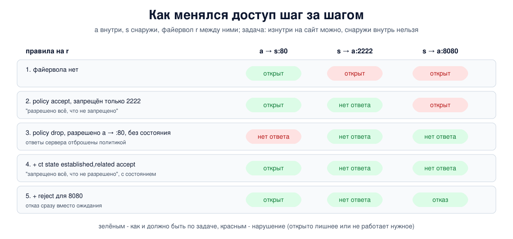

# Урок 51. Фильтрация и файерволы: stateless и stateful, типы файерволов

С этого урока начинается блок про то, как Linux решает судьбу пакетов: пропустить, отбросить, изменить. Сначала - общая картина без привязки к конкретной программе: что такое файервол, по каким признакам он фильтрует, чем фильтр без состояния отличается от фильтра с отслеживанием соединений и почему правильная политика - "запрещено всё, что не разрешено". Дальше в блоке - как это устроено в ядре (netfilter, урок 52), iptables и nftables (уроки 53-54), отслеживание соединений (урок 55) и NAT (уроки 56-58).

## Что такое файервол

**Файервол** (межсетевой экран, брандмауэр) - устройство или программа, которая стоит между сетями или между сетью и машиной и по заданным правилам решает, какой трафик пропустить, а какой нет. Олифер (гл. 28, с. 868-870) подчёркивает главное условие его работы: через файервол должен идти **весь** трафик между защищаемой сетью и внешним миром, без обходных путей; Таненбаум (разд. 8.3.1, с. 844-845) сравнивает его с единственным подъёмным мостом через ров замка. Кроме фильтрации, вторая базовая функция файервола - аудит: журнал того, что он заблокировал. Он воплощает в сети **политику безопасности**: кому, куда и по каким протоколам можно обращаться.

Файерволы различают по тому, где они стоят:

- **сетевой** - на границе сетей: на маршрутизаторе, отдельном устройстве или в облаке (группы безопасности). Фильтрует трафик, который проходит **через** него;
- **персональный** (хостовый) - на самой машине. Фильтрует трафик, который приходит **к** ней и уходит **от** неё. В Linux это те же nftables или iptables, в Windows - встроенный брандмауэр.

Хорошая практика - оба сразу: сетевой экран защищает всю сеть, хостовый - каждую машину, даже если враг уже внутри сети.

## По каким признакам фильтруют

Классический **фильтр пакетов** смотрит на заголовки каждого пакета по отдельности:

- адреса отправителя и получателя (урок 25);
- протокол: TCP, UDP, ICMP (уроки 25, 28);
- порты отправителя и получателя (урок 34);
- флаги TCP (урок 36), тип сообщения ICMP;
- интерфейс, через который пакет пришёл или уйдёт.

Правила проверяются **по порядку**, сверху вниз; первое подошедшее правило с решением (accept, drop, reject) определяет судьбу пакета; правило только со счётчиком или журналом решения не выносит, и проверка идёт дальше. Если ни одно не подошло, действует **политика по умолчанию** цепочки правил. Действия обычно такие: пропустить (accept), молча отбросить (drop) или отбросить с ответом-отказом (reject: ICMP "недоступно" или TCP RST).

Олифер (гл. 28, с. 865-867) разбирает это на примере списков доступа маршрутизаторов: условия проверяются в порядке перечисления до первого совпадения, поэтому частное разрешение должно стоять раньше общего запрета.

## Без состояния и с состоянием

**Фильтр без состояния** (stateless) ничего не помнит: каждый пакет он оценивает сам по себе. Это просто и быстро, но неудобно. Соединение TCP - это пакеты в обе стороны. Чтобы внутренний компьютер мог ходить на внешний сайт, мало разрешить пакеты "изнутри на порт 80" - нужно пропустить и ответы, идущие "с порта 80 внутрь". Правило для ответов приходится писать по признакам заголовка, и оно неизбежно шире, чем нужно: фильтр не может отличить настоящий ответ на наш запрос от любого другого пакета с теми же адресами и портами.

**Фильтр с отслеживанием состояния** (stateful) ведёт таблицу соединений. Увидев разрешённый первый пакет (для TCP - SYN), он запоминает соединение - адреса, порты, протокол, состояние - и дальше пропускает пакеты именно этого соединения в обе стороны. Правила пишутся только для **начала** соединений, а всё остальное решает одна строка "пропускать пакеты уже установленных соединений". Сюда же относятся связанные пакеты (related), например сообщения ICMP об ошибках, которые относятся к разрешённому соединению, - без них сломался бы поиск MTU пути (уроки 27, 42). В Linux это делает подсистема conntrack (урок 55), а правило выглядит как `ct state established,related accept`.

Сегодня практически все файерволы - с состоянием. Фильтр без состояния остаётся там, где важна скорость и простота, например на маршрутизаторах провайдеров для грубой отсечки.

## Шлюзы уровня приложения

Фильтр пакетов, даже с состоянием, видит заголовки, но не понимает содержимого. Следующая ступень - **шлюз уровня приложения** (прокси): соединение клиента заканчивается на нём, а к серверу он открывает своё соединение и передаёт данные дальше, разобрав их по правилам протокола (HTTP, почта, DNS). Такой шлюз может проверить, что внутри действительно HTTP, отфильтровать адреса страниц, проверить файлы. Плата - сложность, задержка и необходимость понимать каждый протокол, а для зашифрованного трафика - необходимость его расшифровывать. Промежуточный вариант - **шлюз сеансового уровня** - пересылает соединения, не разбирая содержимое (так работает SOCKS).

Олифер (гл. 28, с. 871-874) делит файерволы по уровню модели OSI, который они анализируют: сетевой (фильтр пакетов), сеансовый, прикладной; прокси он описывает как особый вид прикладного экрана (с. 874, 877). Учти, что термины в разных книгах расходятся: у Олифера "сеансовым" назван экран с отслеживанием состояния ниже прикладного уровня, а в англоязычной литературе шлюз сеансового уровня (circuit-level gateway) - это именно пересылающий посредник. Таненбаум (с. 845-846) описывает ту же лестницу короче: фильтр пакетов, фильтр с состоянием, шлюз прикладного уровня. Он же вводит **DMZ** - часть сети за пределами внутреннего периметра для общедоступных серверов (подробнее - урок 60).

Не всё в книгах актуально. Олифер пишет, что маршрутизаторы обычно не умеют отслеживать состояние, а хостовые файерволы, как правило, без состояния (с. 868, 872, 875), хотя сам на с. 875 приводит правило iptables с отслеживанием состояния; сегодня это не так - и Linux с conntrack, и брандмауэр Windows отслеживают соединения, а встроенный в macOS фильтр pf тоже работает с состоянием (не путать с брандмауэром в настройках macOS, который фильтрует по программам). А облачные группы безопасности - тоже фильтры с состоянием, где входящее из интернета по умолчанию запрещено.

Современные устройства, которые продают как **NGFW** (next-generation firewall, файервол нового поколения), объединяют всё это: фильтр с состоянием, распознавание приложений, системы обнаружения вторжений (урок 60), иногда расшифровку TLS.

## Как это увидеть в Linux

Три пространства имён: внутренний компьютер `a` (`192.0.2.1`), файервол-маршрутизатор `r` и внешний сервер `s` (`198.51.100.2`) с сайтом на порту 80. На `a` работают две службы, которых снаружи быть не должно: служба администрирования на порту 2222 и забытый отладочный сервер на порту 8080. Задача: изнутри можно ходить на сайты, снаружи внутрь - нельзя ничего. На `r` в цепочке пересылки (forward) будем строить правила nftables шаг за шагом и после каждого шага проверять, что открыто. Подробно синтаксис nftables разберём в уроке 54, здесь важна логика. Нужны Linux (подойдёт WSL2), права sudo, python3 и nftables (`sudo apt install python3 nftables`); всё создаётся в пространствах имён `hbh-*` и в конце удаляется.

Создай файл `firewall-lab.sh` и запусти `bash firewall-lab.sh`:
```
set -u
for c in python3 nft; do
  command -v $c >/dev/null || { echo "нужен $c: sudo apt install python3 nftables"; exit 1; }
done
ns="hbh-a hbh-r hbh-s"
# убрать остатки прошлого запуска
for n in $ns; do
  sudo ip netns pids $n 2>/dev/null | xargs -r sudo kill
  sudo ip netns del $n 2>/dev/null
done
d=$(mktemp -d)
chmod 755 "$d"
# внутренняя сеть: a (192.0.2.1) - файервол r - внешняя сеть: s (198.51.100.2)
for n in $ns; do sudo ip netns add $n; sudo ip -n $n link set lo up; done
A="sudo ip netns exec hbh-a"
R="sudo ip netns exec hbh-r"
S="sudo ip netns exec hbh-s"
sudo ip link add eth0 netns hbh-a type veth peer name eth0 netns hbh-r
sudo ip link add eth0 netns hbh-s type veth peer name eth1 netns hbh-r
$A ip addr add 192.0.2.1/24 dev eth0
$R ip addr add 192.0.2.254/24 dev eth0
$R ip addr add 198.51.100.254/24 dev eth1
$S ip addr add 198.51.100.2/24 dev eth0
for n in $ns; do sudo ip netns exec $n ip link set eth0 up; done
$R ip link set eth1 up
$A ip route add default via 192.0.2.254
$S ip route add default via 198.51.100.254
$R sysctl -qw net.ipv4.ip_forward=1
# службы: сайт на s:80; на a - служба администрирования 2222 и забытая отладочная 8080
cat > "$d/srv.py" <<'EOF'
import socket, sys, threading
def serve(port):
    l = socket.socket(); l.setsockopt(socket.SOL_SOCKET, socket.SO_REUSEADDR, 1)
    l.bind(("0.0.0.0", port)); l.listen()
    while True:
        c, _ = l.accept(); c.sendall(b"hello"); c.close()
for p in sys.argv[1:]:
    threading.Thread(target=serve, args=(int(p),)).start()
EOF
# проверка: подключиться к каждому порту и сказать, что вышло и за сколько
cat > "$d/check.py" <<'EOF'
import socket, sys, time
host, res = sys.argv[1], []
for port in sys.argv[2:]:
    c = socket.socket(); c.settimeout(1.5); t = time.time()
    try:
        c.connect((host, int(port))); r = "open"
    except ConnectionRefusedError:
        r = "refused"
    except socket.timeout:
        r = "no answer"
    res.append(f"{port} {r} ({(time.time() - t) * 1000:.0f} ms)")
print(", ".join(res))
EOF
$S python3 "$d/srv.py" 80 &
$A python3 "$d/srv.py" 2222 8080 &
sleep 0.5
check() {
  echo -n "  a -> s: "; $A python3 "$d/check.py" 198.51.100.2 80
  echo -n "  s -> a: "; $S python3 "$d/check.py" 192.0.2.1 2222 8080
}
echo '--- 1. no firewall'
check
echo '--- 2. "everything is allowed except what is forbidden": block the admin port 2222'
$R nft add table inet lab
$R nft add chain inet lab forward_filter '{ type filter hook forward priority 0; policy accept; }'
$R nft add rule inet lab forward_filter ip daddr 192.0.2.0/24 tcp dport 2222 counter drop
check
echo '--- 3. "everything is forbidden except what is allowed", without state: only a -> web'
$R nft flush chain inet lab forward_filter
$R nft chain inet lab forward_filter '{ policy drop; }'
$R nft add rule inet lab forward_filter ip saddr 192.0.2.0/24 tcp dport 80 counter accept
check
echo '--- 4. the same with connection tracking: replies to allowed connections pass'
$R nft add rule inet lab forward_filter ct state established,related counter accept
check
echo '--- 5. drop or reject: the forgotten port 8080 gets a refusal'
$R nft insert rule inet lab forward_filter ip daddr 192.0.2.0/24 tcp dport 8080 counter reject with tcp reset
check
echo '--- 6. the final rules with their counters'
$R nft list chain inet lab forward_filter | grep -vE '^\s*$'
echo '--- cleanup'
for n in $ns; do
  sudo ip netns pids $n 2>/dev/null | xargs -r sudo kill
  sudo ip netns del $n
done
rm -rf "$d"
ip netns list | grep -cE '^hbh-(a|r|s)( |$)'
```

Вот что получилось на нашем сервере:
```
--- 1. no firewall
  a -> s: 80 open (0 ms)
  s -> a: 2222 open (0 ms), 8080 open (0 ms)
--- 2. "everything is allowed except what is forbidden": block the admin port 2222
  a -> s: 80 open (0 ms)
  s -> a: 2222 no answer (1502 ms), 8080 open (0 ms)
--- 3. "everything is forbidden except what is allowed", without state: only a -> web
  a -> s: 80 no answer (1503 ms)
  s -> a: 2222 no answer (1505 ms), 8080 no answer (1503 ms)
--- 4. the same with connection tracking: replies to allowed connections pass
  a -> s: 80 open (1 ms)
  s -> a: 2222 no answer (1502 ms), 8080 no answer (1503 ms)
--- 5. drop or reject: the forgotten port 8080 gets a refusal
  a -> s: 80 open (0 ms)
  s -> a: 2222 no answer (1502 ms), 8080 refused (0 ms)
--- 6. the final rules with their counters
table inet lab {
	chain forward_filter {
		type filter hook forward priority filter; policy drop;
		ip daddr 192.0.2.0/24 tcp dport 8080 counter packets 1 bytes 60 reject with tcp reset
		ip saddr 192.0.2.0/24 tcp dport 80 counter packets 9 bytes 500 accept
		ct state established,related counter packets 6 bytes 338 accept
	}
}
--- cleanup
0
```

Разберём.

**Шаг 1: файервола нет.** Всё открыто в обе стороны: изнутри на сайт и снаружи на обе службы `a`.

**Шаг 2: "разрешено всё, что не запрещено".** Политика цепочки - пропускать (`policy accept`), а мы запретили то, о чём знали: порт 2222. Он закрылся (`no answer` - пакеты отброшены молча, клиент ждал до таймаута 1,5 с). Но забытый порт 8080 по-прежнему открыт: о нём просто не вспомнили. Так работает любой "список запретов": защищает только от того, что заранее перечислено.

**Шаг 3: "запрещено всё, что не разрешено", но без состояния.** Политика - отбрасывать (`policy drop`), разрешено одно: изнутри на порт 80. Снаружи внутрь теперь закрыто всё, включая забытый 8080. Но и сайт перестал открываться: SYN от `a` проходит, а ответ сервера (SYN+ACK с порта 80) под правило не подпадает и отбрасывается политикой. Фильтру без состояния нужно отдельное правило для ответов.

**Шаг 4: то же с отслеживанием соединений.** Добавили одну строку `ct state established,related accept`. Сайт снова открывается: ответы относятся к соединению, которое начал `a`, и файервол их пропускает. А снаружи внутрь по-прежнему закрыто: соединение, начатое `s`, не установлено, и его первый пакет не подходит ни под одно разрешающее правило.

**Шаг 5: drop или reject.** Для порта 8080 мы вставили в начало цепочки правило `reject with tcp reset`. Клиент получил отказ сразу (`refused`, 0 мс), а на 2222, как раньше, ждал 1,5 с впустую. Что выбрать - вопрос вкуса и задачи. `reject` честнее для своих пользователей и не заставляет программы ждать таймаута; `drop` сообщает отправителю меньше (только то, что ответа нет) и не тратит ресурсы на ответы. Частая практика: снаружи - `drop`, внутри своей сети - `reject`.



**Шаг 6: правила и счётчики.** В конечной цепочке три правила и политика `drop` (`priority filter` - имя стандартного приоритета 0, nft выводит его вместо числа). Счётчики показывают, сколько пакетов подошло под каждое правило: по ним видно, что правило вообще срабатывает, - первое, что проверяют, когда "файервол не пускает". У нас: 1 пакет на reject - единственный SYN на 8080; среди 9 пакетов разрешающего правила - два SYN шага 3 (клиент повторил SYN через секунду), ответы на которые отбросила политика; 6 пакетов established - по три ответа сервера на шагах 4 и 5. На другой машине числа могут чуть отличаться (в WSL2 у разрешающего правила было 10 пакетов и 552 байта). Отброшенное политикой счётчиком правила не учитывается; чтобы видеть и его, в конец цепочки ставят правило со счётчиком (и часто с журналом, уроки 53-54).

В конце `0`: пространства имён удалены.

## Безопасность: "запрещено всё, что не разрешено"

Опыт показал главный принцип построения файервола: **политика по умолчанию - запрещать**, а разрешать только то, что действительно нужно (белый список). Обратный подход - "разрешено всё, кроме перечисленного" - проигрывает всегда, потому что перечислить всё опасное невозможно: забытая служба, новая программа, служба на непривычном порту окажутся открытыми. При политике запрета ошибка обычно выглядит как "что-то нужное не работает" - это заметно сразу и исправляется добавлением правила, а не как незаметная дыра.

Как применять:

- **Начинать с запрета**: политика `drop` на входящих и пересылаемых пакетах, затем разрешения для нужного - `established,related`, loopback, конкретные службы и адреса. Исходящий трафик серверов тоже стоит ограничивать: это мешает взломанной службе связываться с внешним миром.
- **Не забывать нужный ICMP**: сообщения об ошибках пропускает `related`, но если запрещать ICMP целиком, ломается поиск MTU пути (урок 42), а у IPv6 - ещё и обнаружение соседей (урок 31).
- **Одинаково для IPv4 и IPv6**: правила только для IPv4 оставляют IPv6 открытым (урок 46). В nftables для этого есть семейство `inet`.
- **Осторожно при удалённой настройке**: политика `drop` без правила для SSH отрезает собственный доступ. Правила проверяют на тестовой машине или применяют с автоматическим откатом.
- **Файервол не всё**: он не защищает от атак через разрешённые порты (уязвимость в самом веб-сервере), от угроз изнутри сети и от трафика, идущего в обход него. Поэтому вместе с ним нужны обновления, минимум открытых служб (урок 46), сегментация сети и обнаружение вторжений (урок 60).

Таненбаум (с. 846-847) перечисляет пределы файерволов: правила опираются на номера портов, шифрование скрывает содержимое, атаки изнутри часто опаснее внешних, а единый периметр при взломе отдаёт всё сразу. Его вывод - эшелонированная защита (defense in depth), включая файервол на каждой машине.

## Итог

- Файервол по правилам решает, какой трафик пропустить; сетевой стоит на границе сетей, хостовый - на самой машине.
- Фильтр пакетов смотрит на адреса, протокол, порты, флаги, интерфейсы; правила проверяются по порядку, остальное решает политика по умолчанию; действия - accept, drop, reject.
- Фильтр без состояния оценивает каждый пакет отдельно и вынужден широко разрешать ответы. Фильтр с состоянием помнит соединения: правила пишутся для их начала, ответы пропускает `established,related`.
- Шлюзы уровня приложения понимают содержимое протоколов; NGFW объединяют фильтр с состоянием, распознавание приложений и обнаружение вторжений.
- Правильная политика - "запрещено всё, что не разрешено", одинаково для IPv4 и IPv6, с нужным ICMP и без иллюзии, что файервол защищает от всего.

## Что почитать

- Олифер, гл. 28, с. 864-877: фильтрация трафика, определение и функции файервола, типы по уровням OSI, хостовые экраны и прокси; с. 895-898 - DMZ и типовые схемы.
- Таненбаум, разд. 8.3.1, с. 844-847: файерволы, DMZ, их ограничения.
- `man 8 nft`; вики nftables (wiki.nftables.org): Simple ruleset for a server, Matching connection tracking stateful metainformation.
